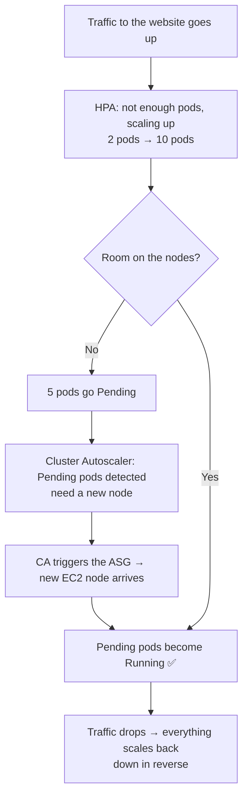

# 01 — Autoscaling Concepts (Read This First)

> After this page you'll understand *what* the Cluster Autoscaler is, how it
> differs from ASG / HPA / VPA, and how they all cooperate. Then do the
> hands-on [`02-setup-guide.md`](02-setup-guide.md).

---

## 1.1 What is autoscaling?

In one line: **automatically add or remove resources based on demand.**

A restaurant analogy:

| Situation | What you do |
|---|---|
| More customers arrive | Put extra waiters to work |
| Fewer customers | Send waiters home |

Kubernetes is the same — load goes up, add resources; load drops, remove them.
Instead of doing it by hand, an **autoscaler** does it for you.

---

## 1.2 Kubernetes has TWO levels of scaling

```
┌─────────────────────────────────────────────┐
│ LEVEL 1: Pod Scaling  (HPA / VPA)            │
│   → add more pods  /  make pods bigger       │
├─────────────────────────────────────────────┤
│ LEVEL 2: Node Scaling (Cluster Autoscaler)   │
│   → add / remove Worker Nodes (EC2)          │
└─────────────────────────────────────────────┘
```

One works at the **Pod** level, the other at the **Node (machine)** level.
This lab is about **Level 2 — the Cluster Autoscaler.**

---

## 1.3 The big comparison — ASG vs CA vs HPA vs VPA

### (A) AWS ASG (Auto Scaling Group) — on its own

An ASG is a pure **AWS** feature. It knows *nothing* about Kubernetes.

```
Watches  → EC2 CPU / Memory (CloudWatch metrics)
Decision → If CPU > 70% → add a new EC2
Trigger  → AWS CloudWatch alarm
```

❌ **Problem:** if a Pod is `Pending` (can't be scheduled), that does **not**
show up as EC2 CPU usage — so the ASG never reacts. A `Pending` pod stays
stuck. An ASG **alone** is not enough for Kubernetes.

### (B) Cluster Autoscaler (CA) — node level, Kubernetes-aware ⭐

This is what we set up in this lab.

```
Watches  → Kubernetes Pods (are there Pending pods?)
Decision → A pod can't be scheduled → add a new Node
Trigger  → Kubernetes Scheduler
Control  → Uses the ASG to actually add/remove nodes
```

Flow:
```
Pod Pending → CA notices → CA tells the ASG → New Node arrives → Pod Running ✅
```

🔑 **Key idea:** CA does **not** fight the ASG — it **uses** the ASG as a tool.
**CA = the brain, ASG = the hands.**

### (C) HPA (Horizontal Pod Autoscaler) — more pods

```
Watches  → Pod CPU / Memory usage
Decision → Load up → increase replicas (2 → 5 → 10)
Action   → Creates more copies of the same pod
```
"Horizontal" = scaling **sideways** (more copies). *(This is the `hpa-lab`
in the sibling folder.)*

### (D) VPA (Vertical Pod Autoscaler) — bigger pods

```
Watches  → How much a pod actually needs
Decision → Increase the pod's CPU/Memory request (256Mi → 1Gi)
Action   → Same pod, more power (pod restarts at the new size)
```
"Vertical" = scaling **upward** (bigger size).

---

## 1.4 Everything in one table

| | **ASG (alone)** | **Cluster Autoscaler** | **HPA** | **VPA** |
|---|---|---|---|---|
| **Level** | Machine (EC2) | Node (machine) | Pod | Pod |
| **Kubernetes aware?** | ❌ No | ✅ Yes | ✅ Yes | ✅ Yes |
| **Watches** | EC2 CPU | Pending pods | Pod CPU/Mem | Pod needs |
| **What it does** | Add EC2 | Add node | More pods | Bigger pod |
| **Example** | CPU>70% → EC2 | Pod pending → node | 1 pod → 5 pods | 256Mi → 1Gi |
| **Triggered by** | CloudWatch | Scheduler | Metrics Server | VPA Recommender |

---

## 1.5 How they all work together (real scenario)



Step by step:
1. Traffic goes up.
2. **HPA** adds pods (2 → 10).
3. No room on nodes → 5 pods go **Pending**.
4. **Cluster Autoscaler** sees Pending pods → decides to add a node.
5. CA → triggers the **ASG** → a new EC2 node arrives.
6. Pending pods become **Running**.
7. Traffic drops → everything scales back down in reverse.

> 🧠 **Remember:** HPA adds pods; if there's no room for them, CA adds a node.
> The two work as a team. That's why this lab pairs naturally with `hpa-lab`.

➡️ **Next:** [`02-setup-guide.md`](02-setup-guide.md) — set CA up on kOps.
