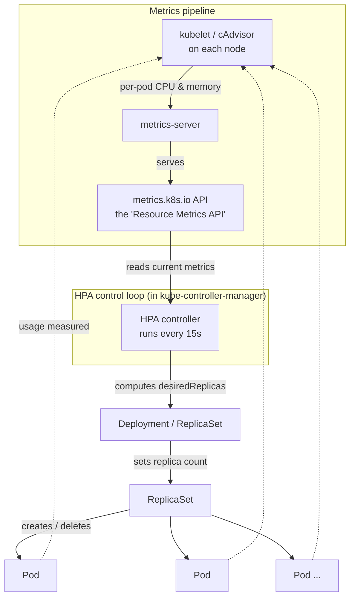

# 01 — HPA Concepts

> Read this before the hands-on lab. It gives you the mental model so the
> commands in `02-lab-guide.md` make sense instead of feeling like magic.

---

## 1. What is the Horizontal Pod Autoscaler (HPA)?

The **Horizontal Pod Autoscaler** is a built-in Kubernetes controller that
**automatically changes the number of Pod replicas** in a workload
(Deployment, ReplicaSet, or StatefulSet) based on observed load.

- **Horizontal scaling** = change the *number of pods* (scale **out** / **in**).
- **Vertical scaling** = change the *size of a pod* (more CPU/memory per pod).

The HPA does horizontal scaling. When average CPU (or memory, or a custom
metric) rises above your target, it adds pods; when load drops, it removes
them — keeping the workload responsive without you watching a dashboard.

### Why autoscaling?

| Without autoscaling | With HPA |
|---|---|
| You guess a fixed replica count | Replicas track real demand |
| Over-provision "just in case" → wasted money | Scale in when idle → save money |
| Traffic spike → overloaded pods, slow/500s | Scale out automatically → stay healthy |
| Someone must be paged to scale manually | The control loop reacts in ~15–30s |

---

## 2. HPA vs VPA vs Cluster Autoscaler

These three autoscalers solve **different** problems and are often used together.

| | **HPA** | **VPA** | **Cluster Autoscaler** |
|---|---|---|---|
| Scales | **Number of pods** | **CPU/mem requests of a pod** | **Number of nodes** |
| Direction | Out / In | Up / Down (per pod) | Add / Remove nodes |
| Answers | "Do I need *more pods*?" | "Is each pod the *right size*?" | "Do I have *room* to place pods?" |
| Trigger | Live metrics (CPU/mem/custom) | Historical usage recommendations | Pending (unschedulable) pods |
| Built-in? | Yes (core Kubernetes) | Add-on | Add-on / cloud-managed |

**How they fit together:** HPA adds pods → if nodes run out of capacity the
new pods become `Pending` → the Cluster Autoscaler notices and adds a node.
VPA right-sizes each pod's requests. ⚠️ HPA and VPA should **not** both manage
**CPU/memory** on the same workload at the same time (they fight each other).

---

## 3. Architecture — how the pieces connect



**Read it as a loop:** the kubelet measures each pod → metrics-server
aggregates it and exposes the `metrics.k8s.io` API → the HPA controller reads
those metrics every 15 seconds, does the math, and updates the Deployment's
replica count → the ReplicaSet creates or deletes pods → the new pods'
usage is measured again → repeat.

> 🔑 **The metrics-server is mandatory.** No metrics-server ⇒ the HPA has no
> data ⇒ `TARGETS` shows `<unknown>` and nothing scales. On minikube you
> enable it with one command (covered in the lab).

---

## 4. The HPA control loop and the 15-second sync period

The HPA is not event-driven — it **polls on a timer**. By default the
controller re-evaluates every HPA object **every 15 seconds** (this is the
`--horizontal-pod-autoscaler-sync-period` flag on the controller-manager;
15s is the default and you rarely change it).

On each tick the controller:

1. **Fetches** the current metric for every pod of the target workload from
   the metrics API.
2. **Averages** the metric across all *Ready* pods.
3. **Computes** the desired replica count using the scaling formula (below).
4. **Applies guardrails**: clamp to `minReplicas`/`maxReplicas`, respect the
   `behavior` policies, and apply the **stabilization window** (a look-back
   that damps rapid flapping — especially on scale-down).
5. **Updates** the target's `.spec.replicas` if the number changed.

Because of the 15s tick plus stabilization windows, scaling is **quick but
not instant**. Expect scale-**out** within ~15–60s of a load spike, and
scale-**in** to be deliberately slow (default 5-minute stabilization window)
so a brief dip in traffic doesn't tear down pods you'll need again seconds later.

---

## 5. The scaling formula (the heart of HPA)

Every 15 seconds the HPA computes:

```
desiredReplicas = ceil( currentReplicas × ( currentMetricValue / targetMetricValue ) )
```

- `ceil(...)` = round **up** to the next whole pod (you can't run 3.2 pods).
- `currentMetricValue` = the **average** metric across current Ready pods.
- `targetMetricValue` = the number you set in the HPA (e.g. 50% utilization).
- The ratio `current / target` is the **"how far off am I"** multiplier.

There is also a **10% tolerance**: if the ratio is within 0.9–1.1 of 1.0,
the HPA does **nothing** (this stops constant ±1 pod churn near the target).

### Worked example 1 — scale OUT

- `currentReplicas = 1`
- Target CPU utilization = **50%**
- Measured average CPU utilization = **250%** (pods are slammed)

```
desiredReplicas = ceil( 1 × (250 / 50) ) = ceil(5.0) = 5
```

➡️ The HPA scales the Deployment from **1 → 5** pods. (This is exactly what
you'll watch happen in the lab when the load generator starts.)

### Worked example 2 — scale IN

- `currentReplicas = 5`
- Target CPU utilization = **50%**
- Measured average CPU utilization = **20%** (load is gone)

```
desiredReplicas = ceil( 5 × (20 / 50) ) = ceil(2.0) = 2
```

➡️ The HPA *wants* **2** pods. But scale-down is gated by the stabilization
window (default 300s) — it uses the **highest** recommendation seen in the
last 5 minutes, so it waits before actually dropping from 5 to 2.

### Worked example 3 — tolerance / no change

- `currentReplicas = 4`
- Target CPU utilization = **50%**
- Measured average CPU utilization = **53%**

```
ratio = 53 / 50 = 1.06   → within the 0.9–1.1 tolerance band
desiredReplicas = 4      → NO CHANGE
```

➡️ Even though usage is slightly over target, the HPA holds at **4** because
the difference is inside the 10% tolerance. This prevents noisy, pointless scaling.

> 📝 **Utilization vs raw value.** With `type: Utilization` the metric is a
> **percentage of the pod's request**. If the CPU request is `200m` and the
> target is `50%`, the effective per-pod CPU target is `100m`. This is why
> **resource requests are non-negotiable for HPA** — no request, no
> percentage, no scaling.

---

## 6. Key terms cheat-sheet

| Term | Meaning |
|---|---|
| **Replica** | One running copy (pod) of your workload |
| **Request** | Guaranteed CPU/mem reserved for a container; the base for `Utilization` |
| **Limit** | Hard ceiling a container may use |
| **Utilization** | current usage ÷ request, as a percentage |
| **Sync period** | How often the HPA re-evaluates (default **15s**) |
| **Stabilization window** | Look-back period that damps flapping (scale-down default **300s**) |
| **Tolerance** | ±10% dead-band around the target where HPA does nothing |
| **`scaleTargetRef`** | The workload the HPA controls |

➡️ **Next:** open [`02-lab-guide.md`](02-lab-guide.md) and run the lab.
