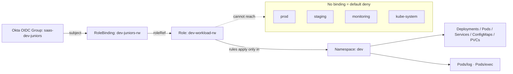
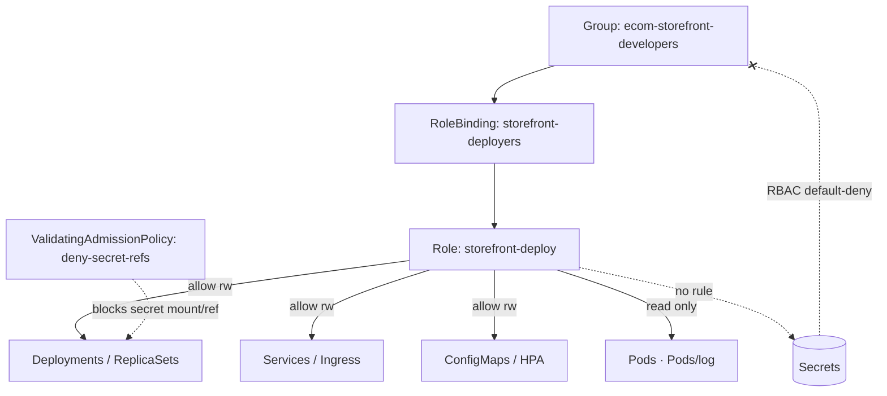
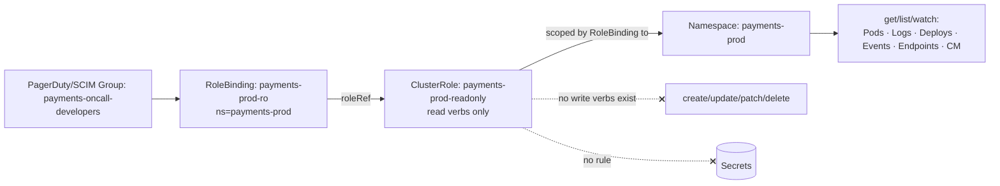
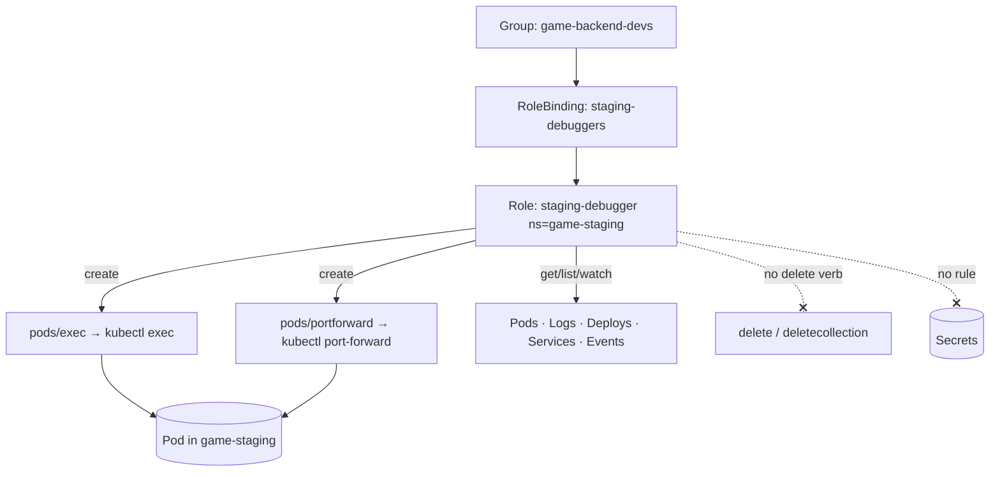
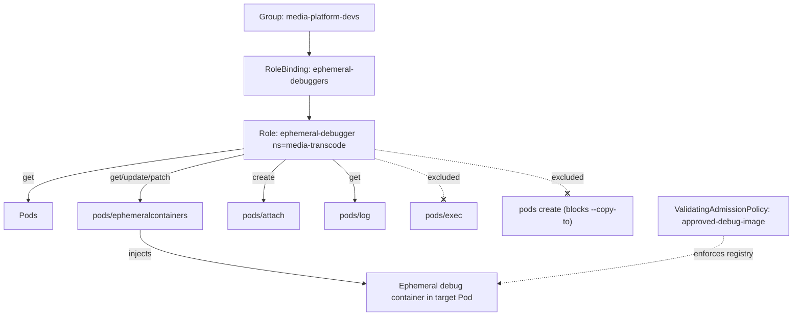

# Developer Teams

Production-grade RBAC patterns for scoping developer access safely across dev, staging, and production namespaces on Kubernetes v1.33+, from junior read/write sandboxes to self-service deploys, live prod debugging, and controlled ephemeral debug containers.

## Scenario 1 — Junior Developer Sandbox: Read/Write in `dev` Only, Zero Access Elsewhere

**Company / Industry:** SaaS (multi-tenant B2B analytics platform)

### Business Requirement
New graduate and contractor developers must be productive on day one inside a shared `dev` namespace — deploying their own workloads, tailing logs, editing ConfigMaps, iterating fast — without any risk of touching `staging`, `prod`, or platform namespaces such as `kube-system`, `monitoring`, or another squad's namespace. Onboarding happens weekly, so access must be group-driven (via the Okta OIDC integration) rather than per-user, and it must be provably confined to a single namespace for the SOC2 audit.

### Existing Problem
The platform team originally granted juniors the built-in `edit` ClusterRole through a `ClusterRoleBinding`. During an incident review it emerged that a junior, following a stale Stack Overflow snippet, ran `kubectl delete deploy --all -n monitoring` and wiped the Prometheus stack cluster-wide. The `ClusterRoleBinding` gave namespace-wide `edit` in *every* namespace. Blast radius was the entire cluster; there was no confinement and no clear audit trail of who could touch what.

### Proposed RBAC Solution
Use a **namespaced `Role`** in `dev` plus a **`RoleBinding`** to an **OIDC Group** (`saas-dev-juniors`). A namespaced `Role` cannot grant access outside its own namespace, so confinement is structural, not policy-based. We deliberately reject `ClusterRole`/`ClusterRoleBinding` (cluster-wide blast radius) and the built-in `edit` ClusterRole bound cluster-wide. Binding to a **Group** rather than individual users means onboarding/offboarding is handled entirely in Okta — no `kubectl` changes per hire. We also avoid granting `secrets` write and any RBAC verbs so juniors cannot self-escalate.

### Kubernetes Resources
- Pods, Pods/log, Pods/exec
- Deployments, ReplicaSets, StatefulSets
- Services, ConfigMaps
- PersistentVolumeClaims
- Events (read-only), Jobs, CronJobs
- ResourceQuota + LimitRange (guardrails, cluster-admin managed)

### Required Permissions
- Deployments, ReplicaSets, StatefulSets, Services, ConfigMaps, PVCs, Jobs, CronJobs → `get, list, watch, create, update, patch, delete` — full iteration on their own workloads.
- Pods → `get, list, watch, delete` — inspect and recycle pods (create is delegated to controllers, so no direct `create`).
- Pods/log → `get` — tail logs while debugging.
- Pods/exec → `create` — shell into their own pods in dev only.
- Events → `get, list, watch` — read scheduling/OOM events.
- **Not granted:** `secrets` (any verb), `resourcequotas`/`limitranges` write, any `rbac.authorization.k8s.io` verb, `namespaces` — preventing self-escalation and quota bypass.

### Architecture Diagram


### YAML Implementation
```yaml
apiVersion: v1
kind: Namespace
metadata:
  name: dev
  labels:
    team: shared
    environment: development
    pod-security.kubernetes.io/enforce: baseline
    pod-security.kubernetes.io/warn: restricted
---
apiVersion: rbac.authorization.k8s.io/v1
kind: Role
metadata:
  name: dev-workload-rw
  namespace: dev
  labels:
    app.kubernetes.io/managed-by: platform-team
rules:
  # Full lifecycle over their own workloads
  - apiGroups: ["apps"]
    resources: ["deployments", "replicasets", "statefulsets"]
    verbs: ["get", "list", "watch", "create", "update", "patch", "delete"]
  - apiGroups: ["batch"]
    resources: ["jobs", "cronjobs"]
    verbs: ["get", "list", "watch", "create", "update", "patch", "delete"]
  - apiGroups: [""]
    resources: ["services", "configmaps", "persistentvolumeclaims"]
    verbs: ["get", "list", "watch", "create", "update", "patch", "delete"]
  # Pods: inspect + recycle (creation is done by controllers, so no create)
  - apiGroups: [""]
    resources: ["pods"]
    verbs: ["get", "list", "watch", "delete"]
  - apiGroups: [""]
    resources: ["pods/log"]
    verbs: ["get"]
  - apiGroups: [""]
    resources: ["pods/exec"]
    verbs: ["create"]
  # Read-only observability
  - apiGroups: [""]
    resources: ["events", "endpoints"]
    verbs: ["get", "list", "watch"]
---
apiVersion: rbac.authorization.k8s.io/v1
kind: RoleBinding
metadata:
  name: dev-juniors-rw
  namespace: dev
subjects:
  - kind: Group
    name: saas-dev-juniors          # emitted by Okta OIDC in the groups claim
    apiGroup: rbac.authorization.k8s.io
roleRef:
  kind: Role
  name: dev-workload-rw
  apiGroup: rbac.authorization.k8s.io
---
# Guardrails so a runaway loop cannot exhaust the shared namespace
apiVersion: v1
kind: ResourceQuota
metadata:
  name: dev-quota
  namespace: dev
spec:
  hard:
    requests.cpu: "20"
    requests.memory: 40Gi
    limits.cpu: "40"
    limits.memory: 80Gi
    pods: "100"
    persistentvolumeclaims: "20"
---
apiVersion: v1
kind: LimitRange
metadata:
  name: dev-limits
  namespace: dev
spec:
  limits:
    - type: Container
      default:
        cpu: 500m
        memory: 512Mi
      defaultRequest:
        cpu: 100m
        memory: 128Mi
      max:
        cpu: "4"
        memory: 8Gi
```

### Commands
```bash
# Apply namespace, role, binding and guardrails in one shot
kubectl apply -f dev-junior-rbac.yaml

# Confirm the RoleBinding wired the Okta group to the Role
kubectl get rolebinding dev-juniors-rw -n dev -o wide

# Inspect exactly which rules the Role grants
kubectl describe role dev-workload-rw -n dev
```

### Verification
```bash
# ALLOW: junior can manage deployments in dev
kubectl auth can-i create deployments -n dev \
  --as=priya@saas.io --as-group=saas-dev-juniors

# ALLOW: junior can exec into a pod in dev
kubectl auth can-i create pods/exec -n dev \
  --as=priya@saas.io --as-group=saas-dev-juniors

# DENY: no access to another namespace at all
kubectl auth can-i list pods -n monitoring \
  --as=priya@saas.io --as-group=saas-dev-juniors

# DENY: cannot read secrets even inside dev
kubectl auth can-i get secrets -n dev \
  --as=priya@saas.io --as-group=saas-dev-juniors

# DENY: cannot self-escalate via RBAC
kubectl auth can-i create rolebindings -n dev \
  --as=priya@saas.io --as-group=saas-dev-juniors

# Full effective-permission dump for the subject in dev
kubectl auth can-i --list -n dev \
  --as=priya@saas.io --as-group=saas-dev-juniors
```

### Expected Output
```text
# create deployments -n dev
yes

# create pods/exec -n dev
yes

# list pods -n monitoring
no

# get secrets -n dev
no

# create rolebindings -n dev
no

# A real Forbidden error when the junior actually tries prod:
$ kubectl get pods -n monitoring
Error from server (Forbidden): pods is forbidden: User "priya@saas.io" cannot
list resource "pods" in API group "" in the namespace "monitoring"
```

### Common Mistakes
- Binding the built-in `edit`/`admin` **ClusterRole** with a **ClusterRoleBinding**, which silently grants access in *every* namespace.
- Using a `RoleBinding` but pointing `roleRef` at a `ClusterRole` that already includes `secrets` (e.g. `edit`), leaking secret access into `dev`.
- Forgetting `apiGroup: rbac.authorization.k8s.io` on the `Group` subject, so the binding matches nothing and access silently fails.
- Granting `pods` the `create` verb directly — pods are created by controllers; direct create lets juniors bypass Deployment templates and PSA.
- Omitting ResourceQuota/LimitRange, so a bad `while true` deploy loop starves the shared namespace.

### Troubleshooting
- Start with `kubectl auth can-i --list -n dev --as=<user> --as-group=saas-dev-juniors` to see the *effective* rules; if empty, the binding didn't match.
- Verify the OIDC groups claim actually contains `saas-dev-juniors`: `kubectl get --raw /apis/authentication.k8s.io/v1/... ` or decode the token; a mismatched group name is the #1 cause.
- `kubectl describe rolebinding dev-juniors-rw -n dev` — check the subject `kind`, `name`, and `apiGroup` are exactly right (case-sensitive).
- If a verb is unexpectedly denied, confirm the correct `apiGroups` (e.g. deployments live in `apps`, not `""`).
- Namespace scope: a `Role`+`RoleBinding` only ever applies in the binding's namespace — access to `prod` failing is correct, not a bug.

### Best Practice
Mature SaaS platforms treat namespaces as the tenancy boundary and drive all developer access from IdP groups (Okta/Azure AD/Google Workspace) synced to Kubernetes via OIDC, never per-user bindings. The `Role` + `RoleBinding` + `ResourceQuota` + `LimitRange` bundle is templated per namespace (Helm/Kustomize) and GitOps-managed via Argo CD or Flux, so every access grant is a reviewed pull request with an audit trail. Onboarding is purely "add user to Okta group."

### Security Notes
Structural least privilege: a namespaced `Role` *cannot* express cluster-wide access, so the monitoring-deletion incident is impossible by construction — blast radius is exactly one namespace. Withholding `secrets` and all `rbac.authorization.k8s.io` verbs blocks two escalation paths: reading credentials and self-granting more power (`bind`/`escalate`). `pods/exec` is scoped to `dev` only, so shelling in cannot reach prod data. Quotas cap the denial-of-service risk of the shared namespace.

### Interview Questions
1. Why does a `Role` + `RoleBinding` confine a junior to one namespace, whereas `edit` + `ClusterRoleBinding` does not?
2. RBAC has no explicit "deny" rule — how do you guarantee zero access to `prod` for this group?
3. Why grant `delete` on pods but not `create`?
4. How would you bind the same `Role` to a Group instead of individual users, and why is that better?
5. What is the risk of pointing a namespaced `RoleBinding` at the built-in `edit` ClusterRole?

### Interview Answers
1. A `Role` is a namespaced object; its rules are only ever evaluated within its own namespace, and a `RoleBinding` can only reference subjects into that same namespace. `edit` is a `ClusterRole`, and a `ClusterRoleBinding` applies that role in *all* namespaces at once — cluster-wide. The confinement comes from the object kinds, not from any deny statement.
2. RBAC is default-deny and purely additive: any verb/resource not explicitly granted is forbidden. Because the group has *no* binding referencing `prod` (or any namespace but `dev`), every request there is denied automatically. You prove it with `kubectl auth can-i ... -n prod` returning `no`. There is no need for — and no such thing as — an explicit deny rule.
3. Pods in production-shaped workloads are created by controllers (ReplicaSet/Job) from a template, which enforces the image, security context, and PSA level. Granting developers direct pod `create` lets them run arbitrary bare pods that bypass those templates. `delete` is safe and useful — it just triggers the controller to recreate a fresh pod.
4. Replace the `subjects` entry with `kind: Group, name: saas-dev-juniors, apiGroup: rbac.authorization.k8s.io`. It's better because membership is managed in the IdP: hiring or offboarding never requires editing Kubernetes RBAC, eliminating stale per-user bindings and drift, and centralizing the audit in the identity provider.
5. `edit` includes read/write on `secrets` and several other sensitive resources. A `RoleBinding` to `edit` scopes *where* it applies (one namespace) but not *what* it grants — so juniors would be able to read and modify secrets in `dev`, an unintended credential-exposure path. A tailored custom `Role` avoids that.

### Follow-up Questions
- How would you make this grant time-bound (e.g. auto-expire contractor access after 90 days)?
- If two squads share `dev`, how do you prevent squad A from deleting squad B's Deployments within the same namespace?
- How do you audit every `pods/exec` a junior performs, and ship it to your SIEM?
- Would you use `hierarchical namespaces` (HNC) or one namespace per developer instead, and what are the trade-offs?

### Production Tips
Amazon EKS teams map IAM/OIDC identities to Kubernetes groups (via the EKS access-entry API or `aws-auth`) and bind namespaced Roles to those groups. Google GKE uses **Google Groups for RBAC** (`gke-security-groups@yourdomain`) so `kind: Group` subjects resolve directly to Workspace groups. Microsoft AKS binds **Azure AD group object IDs** as the subject name. Flipkart and Razorpay templatize the namespace+Role+quota bundle in Kustomize overlays reconciled by Argo CD, so a "new developer" or "new namespace" is a single reviewed PR.

## Scenario 2 — Developer Self-Service Deploy: Manage Deployments/Services/Ingress, Denied Secret Access

**Company / Industry:** E-Commerce (high-traffic online marketplace)

### Business Requirement
The storefront squad must ship independently without filing platform tickets: they own their Deployments, Services, Ingress rules, ConfigMaps, and HorizontalPodAutoscalers in the `storefront` namespace. But the storefront handles payment tokens, PII, and third-party API keys stored as Kubernetes `Secrets`, and PCI-DSS scoping requires that application developers **cannot read or exfiltrate** those secrets — they are provisioned exclusively by the platform team via External Secrets Operator from Vault.

### Existing Problem
Developers previously held the `edit` ClusterRole in `storefront`. A pen-test showed any developer could run `kubectl get secret payment-gateway-key -o jsonpath='{.data.token}' | base64 -d` and print the live production payment token. Even after "we told them not to," the capability existed, so the namespace was in PCI scope and every developer was a compliance liability. Worse, a developer could add a `secretKeyRef` to their own Deployment and mount any secret into a pod they control, exfiltrating it through logs.

### Proposed RBAC Solution
A namespaced **`Role`** granting full lifecycle over workloads/networking but **omitting `secrets` entirely**, bound via **`RoleBinding`** to the **Group** `ecom-storefront-developers`. Because RBAC is additive and default-deny, *not granting* secrets access is the "deny." However, since developers still control Deployment specs, we add a **`ValidatingAdmissionPolicy`** (GA, `admissionregistration.k8s.io/v1`) that rejects any workload referencing a Secret via volume, `secretKeyRef`, or `envFrom.secretRef`. This closes the indirect exfiltration path that pure RBAC cannot. We choose a `Role` (not ClusterRole) for namespace confinement and a Group subject for IdP-driven membership.

### Kubernetes Resources
- Deployments, ReplicaSets (apps/v1)
- Services (v1), Ingresses (networking.k8s.io/v1)
- ConfigMaps (v1)
- HorizontalPodAutoscalers (autoscaling/v2)
- Pods, Pods/log (read-only inspection)
- Secrets — **explicitly not granted; consumption blocked by admission policy**

### Required Permissions
- Deployments, ReplicaSets → `get, list, watch, create, update, patch, delete` — self-service rollout and rollback.
- Services → `get, list, watch, create, update, patch, delete` — expose their apps.
- Ingresses → `get, list, watch, create, update, patch, delete` — manage routing/hostnames.
- ConfigMaps → `get, list, watch, create, update, patch, delete` — non-secret config.
- HorizontalPodAutoscalers → `get, list, watch, create, update, patch, delete` — tune autoscaling.
- Pods, Pods/log → `get, list, watch` — observe rollouts and read logs.
- **Secrets → no verbs at all.** Even `get`/`list` are denied; the admission policy additionally blocks mounting/referencing them.

### Architecture Diagram


### YAML Implementation
```yaml
apiVersion: rbac.authorization.k8s.io/v1
kind: Role
metadata:
  name: storefront-deploy
  namespace: storefront
rules:
  - apiGroups: ["apps"]
    resources: ["deployments", "replicasets"]
    verbs: ["get", "list", "watch", "create", "update", "patch", "delete"]
  - apiGroups: [""]
    resources: ["services", "configmaps"]
    verbs: ["get", "list", "watch", "create", "update", "patch", "delete"]
  - apiGroups: ["networking.k8s.io"]
    resources: ["ingresses"]
    verbs: ["get", "list", "watch", "create", "update", "patch", "delete"]
  - apiGroups: ["autoscaling"]
    resources: ["horizontalpodautoscalers"]
    verbs: ["get", "list", "watch", "create", "update", "patch", "delete"]
  # Read-only pod inspection — NO secrets rule anywhere in this Role
  - apiGroups: [""]
    resources: ["pods", "pods/log"]
    verbs: ["get", "list", "watch"]
---
apiVersion: rbac.authorization.k8s.io/v1
kind: RoleBinding
metadata:
  name: storefront-deployers
  namespace: storefront
subjects:
  - kind: Group
    name: ecom-storefront-developers
    apiGroup: rbac.authorization.k8s.io
roleRef:
  kind: Role
  name: storefront-deploy
  apiGroup: rbac.authorization.k8s.io
---
# Close the indirect path: developers control specs, so block secret consumption at admission.
apiVersion: admissionregistration.k8s.io/v1
kind: ValidatingAdmissionPolicy
metadata:
  name: storefront-deny-secret-refs
spec:
  failurePolicy: Fail
  matchConstraints:
    resourceRules:
      - apiGroups: ["apps"]
        apiVersions: ["v1"]
        operations: ["CREATE", "UPDATE"]
        resources: ["deployments", "replicasets"]
  validations:
    - expression: >-
        !(has(object.spec.template.spec.volumes) &&
          object.spec.template.spec.volumes.exists(v, has(v.secret)))
      message: "Mounting Secrets as volumes is not permitted in storefront."
    - expression: >-
        !object.spec.template.spec.containers.exists(c,
          has(c.envFrom) && c.envFrom.exists(e, has(e.secretRef)))
      message: "envFrom.secretRef is not permitted in storefront."
    - expression: >-
        !object.spec.template.spec.containers.exists(c,
          has(c.env) && c.env.exists(e,
            has(e.valueFrom) && has(e.valueFrom.secretKeyRef)))
      message: "env valueFrom.secretKeyRef is not permitted in storefront."
---
apiVersion: admissionregistration.k8s.io/v1
kind: ValidatingAdmissionPolicyBinding
metadata:
  name: storefront-deny-secret-refs-binding
spec:
  policyName: storefront-deny-secret-refs
  validationActions: ["Deny", "Audit"]
  matchResources:
    namespaceSelector:
      matchLabels:
        kubernetes.io/metadata.name: storefront
```

### Commands
```bash
# Wire up RBAC + admission policy
kubectl apply -f storefront-deploy-rbac.yaml

# Confirm the binding and the policy binding exist
kubectl get rolebinding storefront-deployers -n storefront
kubectl get validatingadmissionpolicybinding storefront-deny-secret-refs-binding

# The platform team (not developers) creates secrets via External Secrets Operator:
kubectl get externalsecret -n storefront            # owned by platform-team SA
```

### Verification
```bash
# ALLOW: developer manages Deployments and Ingress
kubectl auth can-i update deployments -n storefront \
  --as=arjun@shopfast.com --as-group=ecom-storefront-developers
kubectl auth can-i create ingresses.networking.k8s.io -n storefront \
  --as=arjun@shopfast.com --as-group=ecom-storefront-developers

# DENY: cannot read secrets (the whole point)
kubectl auth can-i get secrets -n storefront \
  --as=arjun@shopfast.com --as-group=ecom-storefront-developers
kubectl auth can-i list secrets -n storefront \
  --as=arjun@shopfast.com --as-group=ecom-storefront-developers

# DENY (via admission): applying a Deployment that mounts a secret is rejected
cat <<'EOF' | kubectl apply -n storefront --as=arjun@shopfast.com \
  --as-group=ecom-storefront-developers -f -
apiVersion: apps/v1
kind: Deployment
metadata: { name: sneaky, namespace: storefront }
spec:
  replicas: 1
  selector: { matchLabels: { app: sneaky } }
  template:
    metadata: { labels: { app: sneaky } }
    spec:
      containers:
        - name: c
          image: registry.shopfast.com/base:1.4
          envFrom:
            - secretRef: { name: payment-gateway-key }
EOF
```

### Expected Output
```text
# update deployments -n storefront
yes
# create ingresses -n storefront
yes

# get secrets -n storefront
no
# list secrets -n storefront
no

# Direct read attempt:
$ kubectl get secret payment-gateway-key -n storefront --as=arjun@shopfast.com \
    --as-group=ecom-storefront-developers
Error from server (Forbidden): secrets "payment-gateway-key" is forbidden:
User "arjun@shopfast.com" cannot get resource "secrets" in API group "" in the
namespace "storefront"

# Admission rejection of the indirect exfiltration attempt:
Error from server (Forbidden): admission webhook denied the request:
ValidatingAdmissionPolicy 'storefront-deny-secret-refs' with binding
'storefront-deny-secret-refs-binding' denied request:
envFrom.secretRef is not permitted in storefront.
```

### Common Mistakes
- Believing RBAC has a `deny` verb — it does not; "deny secrets" simply means *never listing* secrets in any Role bound to the group.
- Granting `get secrets` "just for readiness debugging," which reopens the entire PCI exposure.
- Blocking direct `get secrets` in RBAC but forgetting developers can mount a secret via their own Deployment spec — closing only half the path.
- Binding `edit`/`admin` ClusterRole, both of which include secrets.
- Putting Ingress under `apiGroups: [""]`; it lives in `networking.k8s.io`.

### Troubleshooting
- `kubectl auth can-i get secrets -n storefront --as=<dev> --as-group=...` must return `no`; if `yes`, another binding (often `edit`) is leaking access — find it with `kubectl get rolebindings,clusterrolebindings -A -o wide | grep ecom-storefront`.
- If a legitimate Deployment is rejected, read the exact `ValidatingAdmissionPolicy ... denied request:` message — it names which validation failed.
- Test CEL policy changes with `validationActions: ["Audit"]` first, watch the audit log, then flip to `Deny`.
- If the policy isn't firing, confirm the namespace has the `kubernetes.io/metadata.name: storefront` label (auto-added by the API server) matched by the binding's `namespaceSelector`.

### Best Practice
Real e-commerce platforms remove secrets from developer reach entirely: secrets are synced from Vault/AWS Secrets Manager by **External Secrets Operator** or **Secrets Store CSI Driver** using a platform-owned ServiceAccount, and applications consume them only through pre-approved, platform-managed mounts. Developer self-service is deliberately capped at Deployments/Services/Ingress/HPA. The RBAC + ValidatingAdmissionPolicy pair is version-controlled and gated in CI (with `kubectl auth can-i` assertions) so a regression that re-grants secrets fails the pipeline.

### Security Notes
This is defense-in-depth against secret exposure: RBAC removes the direct read path (least privilege — the developer literally has no `get`/`list` on secrets), and the admission policy removes the indirect mount/reference path, shrinking the exfiltration blast radius to zero for that subject. Because secrets are provisioned by a separate platform SA, there is a clean privilege separation between "who deploys apps" and "who holds credentials." The main residual risk — a developer with `exec` reading a secret already mounted into a pod — is why we grant only read-only `pods` here and no `pods/exec`.

### Interview Questions
1. RBAC has no deny rule — how do you "explicitly deny" secret access to a group that otherwise has broad write access?
2. A developer can't `get secrets`, but can still exfiltrate them. How, and how do you stop it?
3. Why is a `ValidatingAdmissionPolicy` a better fit here than a mutating webhook or OPA Gatekeeper?
4. Why should Ingress be in `networking.k8s.io` and what breaks if you list it under the core group?
5. How do you prove to a PCI auditor that developers cannot read production secrets?

### Interview Answers
1. You rely on RBAC's default-deny: you author a `Role` that grants everything the team needs *except* any rule mentioning `secrets`, so all secret verbs are implicitly forbidden. There is no positive deny to write — the absence of a grant is the denial. You then verify with `kubectl auth can-i get secrets` returning `no`.
2. A developer controls their Deployment spec, so they could mount the secret as a volume or inject it with `secretKeyRef`/`envFrom.secretRef` into a container they own and read it from logs or the process. Pure RBAC can't stop this because the controller — not the developer — creates the pod. You close it with an admission policy that rejects any workload referencing a Secret, plus withholding `pods/exec`.
3. `ValidatingAdmissionPolicy` is built into the API server (GA in 1.30, `admissionregistration.k8s.io/v1`), needs no extra pod/webhook to run, has no network hop or availability risk, and uses CEL evaluated in-process. It's ideal for a pure allow/deny check like "no secret references." A mutating webhook or Gatekeeper adds an external dependency and operational surface you don't need for validation-only logic.
4. Ingress is defined in the `networking.k8s.io` API group (core `""` only has Services, ConfigMaps, Pods, Secrets, etc.). If you list `ingresses` under `apiGroups: [""]`, the rule matches nothing, so developers silently can't manage Ingress despite the Role looking correct — a classic apiGroup bug.
5. Show the `Role` YAML (no secrets rule), the `kubectl auth can-i get/list secrets` returning `no` for the developer group as a CI test artifact, the audit-log entries for any attempt, and the fact that secrets are owned by a separate platform ServiceAccount via External Secrets Operator. The combination demonstrates both the control and its continuous verification.

### Follow-up Questions
- How would you allow developers to see that a secret *exists* (name only) for readiness debugging, without exposing its data?
- If the app needs a DB password at runtime, how does it get there without developers ever touching the secret?
- How do you prevent a developer from creating a `ServiceAccount` + token to read secrets indirectly?
- Would you extend the ValidatingAdmissionPolicy to also block `projected` secret volumes and `imagePullSecrets` abuse?

### Production Tips
PhonePe and Razorpay keep application namespaces out of PCI scope by provisioning all secrets through Vault + External Secrets Operator with a dedicated operator ServiceAccount, so developer RBAC never includes secrets. Amazon EKS teams pair this with **IRSA** so pods assume IAM roles for AWS secrets rather than storing them in Kubernetes at all. Netflix and Uber enforce "no secret references from developer-authored manifests" through admission control (OPA/Gatekeeper historically, migrating to CEL-based `ValidatingAdmissionPolicy`), exactly the pattern above.

## Scenario 3 — Read-Only Production Access for Live Debugging, No Write of Any Kind

**Company / Industry:** FinTech (regulated digital lending platform)

### Business Requirement
When a production incident hits the `payments-prod` namespace, the on-call developer must be able to inspect the live state — pod status, logs, events, ConfigMaps, endpoints, rollout history — to diagnose the issue quickly, without waiting for an SRE. But regulatory (RBI/PCI) controls mandate that developers can make **no mutations whatsoever** in production: no edit, no delete, no scale, no exec, and absolutely no secret reads. Change to production must always flow through the GitOps pipeline, never `kubectl`.

### Existing Problem
During a Sev-1, a stressed developer with `edit` access "temporarily" ran `kubectl scale deploy/ledger --replicas=0` in `payments-prod` to "restart cleanly," and took payments down for 40 minutes. The post-incident audit couldn't cleanly distinguish read actions from writes, and the presence of write capability in prod was itself an audit finding. The team needs read access that is *structurally incapable* of mutation.

### Proposed RBAC Solution
A reusable **`ClusterRole`** (`payments-prod-readonly`) containing only read verbs, bound with a **namespaced `RoleBinding`** into `payments-prod`. Using a `ClusterRole` + `RoleBinding` (rather than a `Role`) makes the read-only definition reusable across multiple prod namespaces while the `RoleBinding` still confines it to exactly one namespace. We bind to the **Group** `payments-oncall-developers` (populated only while a developer is on the PagerDuty rotation, via SCIM). We deliberately exclude the built-in `view` ClusterRole here because we also want to *exclude* `pods/exec` implicitly and be explicit about the read surface for the auditor.

### Kubernetes Resources
- Pods, Pods/log, Pods/status
- Deployments, ReplicaSets, StatefulSets (+ their `/status`)
- Services, Endpoints, EndpointSlices
- ConfigMaps (non-secret config)
- Events, HorizontalPodAutoscalers, PersistentVolumeClaims
- Secrets — **excluded** (view of credentials is forbidden in prod)

### Required Permissions
- Pods, Pods/log, Pods/status → `get, list, watch` — inspect state and stream logs.
- Deployments, ReplicaSets, StatefulSets (+ `/status`) → `get, list, watch` — rollout/replica diagnosis.
- Services, Endpoints, EndpointSlices → `get, list, watch` — connectivity debugging.
- ConfigMaps → `get, list, watch` — verify non-secret config.
- Events → `get, list, watch` — OOMKills, scheduling failures, probe failures.
- HPAs, PVCs → `get, list, watch` — scaling/storage diagnosis.
- **No** `create, update, patch, delete, deletecollection` anywhere; **no** `pods/exec`, `pods/portforward`; **no** `secrets`.

### Architecture Diagram


### YAML Implementation
```yaml
apiVersion: rbac.authorization.k8s.io/v1
kind: ClusterRole
metadata:
  name: payments-prod-readonly
  labels:
    rbac.acme-fin.io/purpose: prod-debug-readonly
rules:
  - apiGroups: [""]
    resources: ["pods", "pods/log", "pods/status", "services",
                "endpoints", "configmaps", "events",
                "persistentvolumeclaims", "replicationcontrollers"]
    verbs: ["get", "list", "watch"]
  - apiGroups: ["apps"]
    resources: ["deployments", "deployments/status",
                "replicasets", "replicasets/status",
                "statefulsets", "statefulsets/status"]
    verbs: ["get", "list", "watch"]
  - apiGroups: ["discovery.k8s.io"]
    resources: ["endpointslices"]
    verbs: ["get", "list", "watch"]
  - apiGroups: ["autoscaling"]
    resources: ["horizontalpodautoscalers"]
    verbs: ["get", "list", "watch"]
  - apiGroups: ["batch"]
    resources: ["jobs", "cronjobs"]
    verbs: ["get", "list", "watch"]
# Note: NO secrets, NO pods/exec, NO pods/portforward, NO write verbs anywhere.
---
apiVersion: rbac.authorization.k8s.io/v1
kind: RoleBinding
metadata:
  name: payments-prod-ro
  namespace: payments-prod        # binding confines the ClusterRole to THIS namespace
subjects:
  - kind: Group
    name: payments-oncall-developers   # populated only during active on-call (SCIM)
    apiGroup: rbac.authorization.k8s.io
roleRef:
  kind: ClusterRole
  name: payments-prod-readonly
  apiGroup: rbac.authorization.k8s.io
```

### Commands
```bash
# Create the reusable read-only ClusterRole and scope it into payments-prod
kubectl apply -f payments-prod-readonly.yaml

# The same ClusterRole can be reused for another prod namespace with a new RoleBinding:
kubectl create rolebinding ledger-prod-ro \
  --clusterrole=payments-prod-readonly \
  --group=payments-oncall-developers \
  --namespace=ledger-prod --dry-run=client -o yaml | kubectl apply -f -

# Inspect what the binding grants
kubectl describe rolebinding payments-prod-ro -n payments-prod
```

### Verification
```bash
# ALLOW: read pods, logs, events
kubectl auth can-i get pods -n payments-prod \
  --as=meera@acme-fin.io --as-group=payments-oncall-developers
kubectl auth can-i get pods/log -n payments-prod \
  --as=meera@acme-fin.io --as-group=payments-oncall-developers

# DENY: any mutation
kubectl auth can-i delete deployments -n payments-prod \
  --as=meera@acme-fin.io --as-group=payments-oncall-developers
kubectl auth can-i patch deployments -n payments-prod \
  --as=meera@acme-fin.io --as-group=payments-oncall-developers
kubectl auth can-i update deployments/scale -n payments-prod \
  --as=meera@acme-fin.io --as-group=payments-oncall-developers

# DENY: exec and secrets
kubectl auth can-i create pods/exec -n payments-prod \
  --as=meera@acme-fin.io --as-group=payments-oncall-developers
kubectl auth can-i get secrets -n payments-prod \
  --as=meera@acme-fin.io --as-group=payments-oncall-developers

# Real read usage
kubectl logs deploy/ledger -n payments-prod --as=meera@acme-fin.io \
  --as-group=payments-oncall-developers --tail=100
```

### Expected Output
```text
# get pods / get pods/log
yes
yes

# delete/patch/update scale
no
no
no

# create pods/exec / get secrets
no
no

# Attempted write in prod:
$ kubectl scale deploy/ledger --replicas=0 -n payments-prod \
    --as=meera@acme-fin.io --as-group=payments-oncall-developers
Error from server (Forbidden): deployments.apps "ledger" is forbidden:
User "meera@acme-fin.io" cannot patch resource "deployments/scale" in API group
"apps" in the namespace "payments-prod"
```

### Common Mistakes
- Adding `pods/exec` "to run a quick `curl` inside" — `exec` is a write-class capability and can mutate/exfiltrate; it breaks the read-only guarantee.
- Granting `get secrets` because `view` does not — actually the built-in `view` role *excludes* secrets by design; re-adding them is a regression.
- Forgetting `pods/log` and `pods/status` subresources, so developers can list pods but can't read logs.
- Using a `ClusterRoleBinding` instead of a `RoleBinding`, which would grant read access in *every* namespace, defeating prod isolation.
- Omitting `endpointslices` (discovery.k8s.io) and `deployments/status`, causing incomplete debugging views in newer clusters.

### Troubleshooting
- `kubectl auth can-i --list -n payments-prod --as=<dev> --as-group=payments-oncall-developers` should show only `get/list/watch` verbs — any write verb appearing means an extra binding is in play.
- If logs fail but `get pods` works, you missed the `pods/log` subresource in the ClusterRole.
- Confirm scope: `kubectl auth can-i get pods -n other-prod --as=...` should be `no`, proving the `RoleBinding` confined the reusable ClusterRole.
- If the developer sees `no` even for reads, check that SCIM actually added them to `payments-oncall-developers` for the current on-call window.

### Best Practice
Regulated FinTechs make production read-only access **just-in-time and time-bound**: membership in `payments-oncall-developers` is granted only for the duration of the PagerDuty on-call shift (via Okta/SCIM lifecycle or a tool like ConductorOne/Teleport), and every read is captured in the API-server audit log shipped to the SIEM. All production *changes* go exclusively through GitOps (Argo CD), so `kubectl` in prod is provably read-only. A separate audited "break-glass" ClusterRole exists for true emergencies and triggers an alert when used.

### Security Notes
The design enforces least privilege at the verb level: the `ClusterRole` contains no mutating verb, so mutation in prod is impossible for this subject regardless of intent — the `--replicas=0` outage cannot recur. Excluding `secrets` and `pods/exec` prevents credential exposure and interactive tampering. Blast radius is one namespace because a `RoleBinding` (not `ClusterRoleBinding`) scopes the reusable ClusterRole. The residual risk — a developer reading PII from logs — is handled outside RBAC via log redaction, but RBAC guarantees they cannot alter or exfiltrate live state.

### Interview Questions
1. Why bind a `ClusterRole` with a `RoleBinding` instead of just writing a namespaced `Role`?
2. Why is `pods/exec` considered a write capability and excluded from a "read-only" role?
3. The built-in `view` ClusterRole exists — why hand-roll a custom read-only role here?
4. How do you make production read access time-bound to an on-call shift?
5. How do you guarantee, technically, that no `kubectl`-driven change can happen in prod?

### Interview Answers
1. A `ClusterRole` is a reusable, namespace-agnostic definition; a `RoleBinding` referencing it grants those rules *only* in the binding's namespace. This lets one audited read-only definition be scoped into `payments-prod`, `ledger-prod`, etc. via separate RoleBindings, avoiding duplicate `Role` objects and keeping the read surface consistent and reviewable.
2. Kubernetes models `exec` as `create` on the `pods/exec` subresource — it opens an interactive session inside a container where you can modify files, kill processes, read mounted secrets, and change runtime state. It is not a read; including it in a read-only role silently grants mutation and data-exfiltration ability, breaking the guarantee.
3. `view` is a fine default, but for a regulated prod namespace we want the read surface to be explicit and auditable line-by-line (and to be sure exactly which subresources are included). A custom role also lets us add/remove specific resources (e.g. `deployments/status`, `endpointslices`) deliberately and version-control the exact contract shown to auditors.
4. Membership in the subject Group is driven by the identity provider: an on-call automation (Okta lifecycle, SCIM, or Teleport/PagerDuty integration) adds the engineer to `payments-oncall-developers` when their shift starts and removes them when it ends. RBAC stays static; access appears and disappears with group membership, and every change is logged in the IdP.
5. Ensure no binding in any prod namespace grants a mutating verb to human subjects — all human roles are read-only — while the only identities with write access are the GitOps controller's ServiceAccount (Argo CD) and a separate, alerting break-glass role. Then production state can only change via reconciled Git commits, and `kubectl` for humans is provably read-only.

### Follow-up Questions
- How would you allow a read-only debugger to run a network probe (`curl`) inside the namespace without granting `exec`? (Hint: ephemeral debug container policy — see Scenario 5.)
- How do you implement break-glass write access that is fully audited and auto-expires?
- How do you prevent developers from reading PII that legitimately appears in logs they can access?
- Would you use `impersonate` to let SREs debug "as" the developer, and what are the risks?

### Production Tips
Google SRE practice binds read-only roles via **gke-security-groups** and keeps all prod mutation in reconciled config. Netflix and Uber gate production writes entirely behind GitOps/CD, leaving humans with read-only + audited break-glass. Razorpay and PhonePe use just-in-time access tools (Teleport / native OIDC + SCIM) so prod read groups are populated only during active on-call, and every read hits the audit pipeline. Amazon EKS teams use short-lived STS-backed sessions mapped to read-only Kubernetes groups so credentials themselves expire with the shift.

## Scenario 4 — Pod Exec & Port-Forward for Staging Debugging, Tightly Scoped, No Delete

**Company / Industry:** Gaming (real-time multiplayer backend)

### Business Requirement
The game-backend developers need deep interactive debugging in the `game-staging` namespace during load testing: shelling into pods to inspect matchmaking state, and port-forwarding to a pod's admin/metrics port to hit internal endpoints from their laptop. Staging mirrors production traffic patterns, so this is where latency bugs surface. But even in staging, developers must not be able to **delete** pods/deployments (deleting a pod mid-load-test invalidates a multi-hour run) and must have no access to `secrets`.

### Existing Problem
Developers had the `admin` ClusterRole in `game-staging`. Two problems surfaced: (1) during a load test, a developer reflexively ran `kubectl delete pod matchmaker-7d9` to "reset" it, killing an 3-hour soak test and wasting a cross-team session; (2) `admin` gave `port-forward` *and* full delete *and* secret access, so the capability far exceeded the actual need (exec + port-forward). They want exec and port-forward, read access for context, and nothing destructive.

### Proposed RBAC Solution
A namespaced **`Role`** (`staging-debugger`) granting read on workloads plus the two interactive subresources — `pods/exec` and `pods/portforward` (both require the `create` verb) — and explicitly **no** `delete`/`deletecollection` and **no** `secrets`. Bound via **`RoleBinding`** to the Group `game-backend-devs`. A `Role` (not ClusterRole) confines this powerful capability to staging only. We separate this from the read-only prod role of Scenario 3 precisely because exec/port-forward are write-class and must never leak to prod.

### Kubernetes Resources
- Pods, Pods/log
- Pods/exec (interactive shell)
- Pods/portforward (tunnel to pod ports)
- Deployments, ReplicaSets, Services (read-only, for context)
- ConfigMaps (read-only)
- Events (read-only)

### Required Permissions
- Pods, Pods/log → `get, list, watch` — find and observe pods to debug.
- Pods/exec → `create` — open an interactive shell (`kubectl exec`).
- Pods/portforward → `create` — establish a local tunnel (`kubectl port-forward`).
- Deployments, ReplicaSets, Services, ConfigMaps → `get, list, watch` — context only.
- Events → `get, list, watch` — see restarts/probe failures.
- **Not granted:** `delete`, `deletecollection` on any resource; `create`/`update`/`patch` on workloads; `secrets` (any verb); `pods/attach` (avoid attaching to the live main process).

### Architecture Diagram


### YAML Implementation
```yaml
apiVersion: rbac.authorization.k8s.io/v1
kind: Role
metadata:
  name: staging-debugger
  namespace: game-staging
rules:
  # Read context
  - apiGroups: [""]
    resources: ["pods", "pods/log", "services", "configmaps", "events"]
    verbs: ["get", "list", "watch"]
  - apiGroups: ["apps"]
    resources: ["deployments", "replicasets"]
    verbs: ["get", "list", "watch"]
  # Interactive debugging — both are 'create' on a subresource
  - apiGroups: [""]
    resources: ["pods/exec"]
    verbs: ["create"]
  - apiGroups: [""]
    resources: ["pods/portforward"]
    verbs: ["create"]
  # Intentionally absent: delete, deletecollection, create/update/patch on
  # workloads, pods/attach, and secrets (any verb).
---
apiVersion: rbac.authorization.k8s.io/v1
kind: RoleBinding
metadata:
  name: staging-debuggers
  namespace: game-staging
subjects:
  - kind: Group
    name: game-backend-devs
    apiGroup: rbac.authorization.k8s.io
roleRef:
  kind: Role
  name: staging-debugger
  apiGroup: rbac.authorization.k8s.io
---
# Optional: pin down which service accounts developers could exec into by keeping
# staging under 'restricted' PSA, so an exec'd shell can't escalate the container.
apiVersion: v1
kind: Namespace
metadata:
  name: game-staging
  labels:
    environment: staging
    team: game-backend
    pod-security.kubernetes.io/enforce: restricted
    pod-security.kubernetes.io/enforce-version: latest
```

### Commands
```bash
# Apply the namespace label policy + debugger Role + binding
kubectl apply -f staging-debugger-rbac.yaml

# Verify the binding
kubectl describe rolebinding staging-debuggers -n game-staging

# Show that exec/port-forward are 'create' on subresources
kubectl describe role staging-debugger -n game-staging
```

### Verification
```bash
# ALLOW: exec and port-forward
kubectl auth can-i create pods/exec -n game-staging \
  --as=kenji@playforge.gg --as-group=game-backend-devs
kubectl auth can-i create pods/portforward -n game-staging \
  --as=kenji@playforge.gg --as-group=game-backend-devs

# ALLOW: read pods/logs
kubectl auth can-i get pods/log -n game-staging \
  --as=kenji@playforge.gg --as-group=game-backend-devs

# DENY: cannot delete anything
kubectl auth can-i delete pods -n game-staging \
  --as=kenji@playforge.gg --as-group=game-backend-devs
kubectl auth can-i delete deployments -n game-staging \
  --as=kenji@playforge.gg --as-group=game-backend-devs

# DENY: secrets and prod
kubectl auth can-i get secrets -n game-staging \
  --as=kenji@playforge.gg --as-group=game-backend-devs
kubectl auth can-i create pods/exec -n game-prod \
  --as=kenji@playforge.gg --as-group=game-backend-devs

# Real usage
kubectl exec -it matchmaker-7d9 -n game-staging --as=kenji@playforge.gg \
  --as-group=game-backend-devs -- sh
kubectl port-forward pod/matchmaker-7d9 9090:9090 -n game-staging \
  --as=kenji@playforge.gg --as-group=game-backend-devs
```

### Expected Output
```text
# create pods/exec  &  create pods/portforward
yes
yes
# get pods/log
yes

# delete pods  &  delete deployments
no
no

# get secrets  &  exec in game-prod
no
no

# Attempted delete during a load test:
$ kubectl delete pod matchmaker-7d9 -n game-staging --as=kenji@playforge.gg \
    --as-group=game-backend-devs
Error from server (Forbidden): pods "matchmaker-7d9" is forbidden:
User "kenji@playforge.gg" cannot delete resource "pods" in API group "" in the
namespace "game-staging"
```

### Common Mistakes
- Listing `pods/exec` under the `apps` API group — it's core (`apiGroups: [""]`).
- Using the `get` verb for exec/port-forward — both are modeled as **`create`**; `get` grants nothing usable.
- Assuming `pods/exec` is harmless read-only — an exec shell can modify the container, read mounted secrets, and generate load; treat it as a write capability.
- Granting `pods` `delete` "for convenience," which is exactly the load-test-killing behavior to prevent.
- Forgetting `pods/log`, so developers can exec but can't tail logs, forcing them to shell in just to `cat` a logfile.

### Troubleshooting
- If `kubectl exec` returns Forbidden, confirm the rule is `resources: ["pods/exec"], verbs: ["create"]` in the core group — a wrong group or `get` verb is the usual culprit.
- `kubectl auth can-i create pods/portforward -n game-staging --as=...` isolates the port-forward grant from exec.
- If exec works but the shell is immediately killed or can't run tools, that's Pod Security `restricted` doing its job, not RBAC — check `kubectl get ns game-staging -o yaml` labels.
- Verify no `ClusterRoleBinding` grants the group `admin`/`edit` elsewhere: `kubectl get clusterrolebindings -o wide | grep game-backend-devs`.

### Best Practice
Mature gaming/backend teams grant `exec`/`port-forward` **only in non-prod**, and treat them as privileged even there: sessions are logged (API-server audit records the `create` on `pods/exec`), namespaces run under `restricted` Pod Security so an exec'd shell can't escalate, and the grant is scoped to a single staging namespace via a `Role`. Delete rights are reserved for the CD controller and the platform team. Many teams are moving interactive debugging to ephemeral debug containers (Scenario 5) to avoid shelling into the app container at all.

### Security Notes
`pods/exec` and `pods/portforward` are the two most abused developer capabilities: exec grants in-container code execution and access to anything mounted (including secrets), and port-forward can tunnel to internal admin ports. Confining both to `game-staging` via a namespaced `Role` bounds the blast radius to non-production. Withholding `delete` protects test integrity and prevents destructive mistakes. Withholding `secrets` and `pods/attach` limits credential exposure and prevents hijacking the live main process. `restricted` PSA ensures an exec session can't gain host privileges.

### Interview Questions
1. Which verb do `pods/exec` and `pods/portforward` require, and what surprises engineers about that?
2. Why is `pods/exec` a security-sensitive grant even in staging?
3. How do you allow exec + port-forward while guaranteeing no pod can be deleted?
4. How would you prevent this staging debug capability from ever applying to production?
5. Why might a mature team prefer ephemeral debug containers over `pods/exec`?

### Interview Answers
1. Both are subresources requiring the **`create`** verb (`kubectl exec`/`port-forward` open a new connection to the API server that it models as creating a sub-object). Engineers expect `get` because it "reads" a shell, but `get pods/exec` grants nothing — you must grant `create`.
2. An exec session runs code inside the container as its runtime user: you can read files (including mounted Secret volumes and tokens), modify state, install tools, and pivot to network-reachable services. It is functionally remote code execution scoped to that pod, so it must be treated as a write/privileged capability, audited and confined.
3. Grant `create` on `pods/exec` and `pods/portforward` plus `get/list/watch` for context, and simply never include `delete`/`deletecollection` on any resource. RBAC's default-deny means delete is forbidden; verify with `kubectl auth can-i delete pods` returning `no`.
4. Use a namespaced `Role`+`RoleBinding` in `game-staging` only. A `Role` cannot grant access in another namespace, and there is no `ClusterRoleBinding`, so `kubectl exec` in `game-prod` is denied by default. You confirm with `kubectl auth can-i create pods/exec -n game-prod` returning `no`.
5. Ephemeral debug containers (`kubectl debug`) attach a *separate* container with your debug tooling to the pod without touching the app container, so you don't need a shell (and a shell-capable image) inside the production workload. This reduces the attack surface, keeps app images minimal/distroless, and lets you control the debug image via policy — a cleaner, more auditable model than `exec`.

### Follow-up Questions
- How would you rate-limit or session-record every `kubectl exec` for forensic replay?
- If a distroless app image has no shell, how do developers debug it without exec?
- How would you allow port-forward only to a specific port (e.g. 9090 metrics) and not arbitrary ports?
- Would you allow `pods/attach`? What's the difference from `pods/exec` and why is it riskier?

### Production Tips
Uber and Netflix restrict `exec`/`port-forward` to non-prod namespaces and record every exec via audit + tooling (Teleport session recording) for privileged access. Zomato and Swiggy run staging under `restricted` Pod Security so exec sessions can't escalate, and reserve delete for CD. Google and Amazon push developers toward ephemeral debug containers and distroless images so `exec` into app containers becomes unnecessary, controlling the debug image centrally.

## Scenario 5 — Controlling Ephemeral Debug Containers via `kubectl debug`

**Company / Industry:** Media (video streaming / transcoding platform)

### Business Requirement
The transcoding services in `media-transcode` run **distroless** images (no shell, no `curl`, no busybox) for a minimal attack surface. When a transcode job hangs, developers still need to debug the live pod — inspect the process tree, check network reachability, poke at shared volumes. The sanctioned way on Kubernetes v1.33 is `kubectl debug` with **ephemeral containers**, which attaches a debug-tooling container to the running pod without a restart. Developers must be able to do exactly this, but must **not** be able to `exec` into the app container, create standalone pods, or delete anything.

### Existing Problem
Because the app images are distroless, `kubectl exec` fails ("no shell"), so developers escalated by asking the platform team to temporarily grant `admin`, or worse, they rebuilt images with a shell baked in — bloating the attack surface and violating the distroless policy. There was no clean RBAC grant for *just* ephemeral debug containers, so the team either over-privileged developers or degraded image security.

### Proposed RBAC Solution
A namespaced **`Role`** (`ephemeral-debugger`) granting the precise permissions `kubectl debug <pod>` needs: `get` on `pods`, `patch`/`update` on the **`pods/ephemeralcontainers`** subresource (adding an ephemeral container is a PATCH to that subresource), and `create` on `pods/attach` (kubectl debug attaches to the new container). We deliberately **exclude** `pods/exec` (no shelling into the app container) and `create` on `pods` (so `kubectl debug --copy-to`, which clones a new pod, is blocked — keeping debugging in-place and auditable). Bound via **`RoleBinding`** to Group `media-platform-devs`. Combined with a `ValidatingAdmissionPolicy` restricting the debug image to an approved registry.

### Kubernetes Resources
- Pods (get)
- Pods/ephemeralcontainers (the debug-container subresource)
- Pods/attach (to interact with the debug container)
- Pods/log (read output)
- **Excluded:** Pods/exec, pod `create` (blocks `--copy-to`), delete, secrets

### Required Permissions
- Pods → `get, list, watch` — locate the target pod.
- Pods/ephemeralcontainers → `get, update, patch` — `kubectl debug` reads then PATCHes this subresource to inject the ephemeral container.
- Pods/attach → `create` — attach the terminal to the newly added ephemeral container.
- Pods/log → `get` — read logs of the target/ephemeral container.
- **Not granted:** `pods/exec` (no app-container shell); `create` on `pods` (blocks `--copy-to` clones); `delete`/`deletecollection`; `secrets`.

### Architecture Diagram


### YAML Implementation
```yaml
apiVersion: rbac.authorization.k8s.io/v1
kind: Role
metadata:
  name: ephemeral-debugger
  namespace: media-transcode
rules:
  - apiGroups: [""]
    resources: ["pods", "pods/log"]
    verbs: ["get", "list", "watch"]
  # kubectl debug injects an ephemeral container via GET + PATCH on this subresource
  - apiGroups: [""]
    resources: ["pods/ephemeralcontainers"]
    verbs: ["get", "update", "patch"]
  # attach a terminal to the ephemeral container
  - apiGroups: [""]
    resources: ["pods/attach"]
    verbs: ["create"]
  # Deliberately NOT present: pods/exec, pods create (blocks --copy-to),
  # delete/deletecollection, secrets.
---
apiVersion: rbac.authorization.k8s.io/v1
kind: RoleBinding
metadata:
  name: ephemeral-debuggers
  namespace: media-transcode
subjects:
  - kind: Group
    name: media-platform-devs
    apiGroup: rbac.authorization.k8s.io
roleRef:
  kind: Role
  name: ephemeral-debugger
  apiGroup: rbac.authorization.k8s.io
---
# Only allow ephemeral debug containers from the approved internal registry,
# and keep them non-privileged. Ephemeral containers are added via UPDATE on the
# pods/ephemeralcontainers subresource, so we validate that operation.
apiVersion: admissionregistration.k8s.io/v1
kind: ValidatingAdmissionPolicy
metadata:
  name: approved-debug-image
spec:
  failurePolicy: Fail
  matchConstraints:
    resourceRules:
      - apiGroups: [""]
        apiVersions: ["v1"]
        operations: ["UPDATE"]
        resources: ["pods/ephemeralcontainers"]
  validations:
    - expression: >-
        !has(object.spec.ephemeralContainers) ||
        object.spec.ephemeralContainers.all(c,
          c.image.startsWith("registry.mediastream.io/debug/"))
      message: "Ephemeral debug containers must use registry.mediastream.io/debug/* images."
    - expression: >-
        !has(object.spec.ephemeralContainers) ||
        object.spec.ephemeralContainers.all(c,
          !has(c.securityContext) ||
          !has(c.securityContext.privileged) ||
          c.securityContext.privileged == false)
      message: "Privileged ephemeral debug containers are not permitted."
---
apiVersion: admissionregistration.k8s.io/v1
kind: ValidatingAdmissionPolicyBinding
metadata:
  name: approved-debug-image-binding
spec:
  policyName: approved-debug-image
  validationActions: ["Deny", "Audit"]
  matchResources:
    namespaceSelector:
      matchLabels:
        kubernetes.io/metadata.name: media-transcode
```

### Commands
```bash
# Apply the debugger Role, binding, and debug-image admission policy
kubectl apply -f ephemeral-debug-rbac.yaml

# Verify binding + policy binding
kubectl describe rolebinding ephemeral-debuggers -n media-transcode
kubectl get validatingadmissionpolicybinding approved-debug-image-binding

# Real usage: attach an approved debug container to a distroless transcoder pod
kubectl debug -n media-transcode transcoder-abc123 -it \
  --image=registry.mediastream.io/debug/netshoot:1.6 \
  --target=transcoder \
  --as=lena@mediastream.io --as-group=media-platform-devs
```

### Verification
```bash
# ALLOW: inject ephemeral container (the debug capability)
kubectl auth can-i update pods/ephemeralcontainers -n media-transcode \
  --as=lena@mediastream.io --as-group=media-platform-devs
kubectl auth can-i create pods/attach -n media-transcode \
  --as=lena@mediastream.io --as-group=media-platform-devs
kubectl auth can-i get pods -n media-transcode \
  --as=lena@mediastream.io --as-group=media-platform-devs

# DENY: cannot exec into the app container
kubectl auth can-i create pods/exec -n media-transcode \
  --as=lena@mediastream.io --as-group=media-platform-devs

# DENY: cannot create standalone pods (so kubectl debug --copy-to is blocked)
kubectl auth can-i create pods -n media-transcode \
  --as=lena@mediastream.io --as-group=media-platform-devs

# DENY: cannot delete or read secrets
kubectl auth can-i delete pods -n media-transcode \
  --as=lena@mediastream.io --as-group=media-platform-devs
kubectl auth can-i get secrets -n media-transcode \
  --as=lena@mediastream.io --as-group=media-platform-devs
```

### Expected Output
```text
# update pods/ephemeralcontainers  &  create pods/attach  &  get pods
yes
yes
yes

# create pods/exec
no
# create pods (--copy-to)
no
# delete pods  &  get secrets
no
no

# Attempting exec into the distroless app container:
$ kubectl exec -it transcoder-abc123 -n media-transcode --as=lena@mediastream.io \
    --as-group=media-platform-devs -- sh
Error from server (Forbidden): pods "transcoder-abc123" is forbidden:
User "lena@mediastream.io" cannot create resource "pods/exec" in API group ""
in the namespace "media-transcode"

# Attempting a debug container from a non-approved image:
$ kubectl debug -n media-transcode transcoder-abc123 -it \
    --image=docker.io/library/busybox --target=transcoder --as=lena@mediastream.io \
    --as-group=media-platform-devs
Error from server (Forbidden): admission webhook denied the request:
ValidatingAdmissionPolicy 'approved-debug-image' denied request:
Ephemeral debug containers must use registry.mediastream.io/debug/* images.
```

### Common Mistakes
- Granting `pods/exec` and assuming it also enables `kubectl debug` — the ephemeral-container flow uses `pods/ephemeralcontainers`, a *different* subresource; `exec` is neither necessary nor sufficient.
- Using the `create` verb on `pods/ephemeralcontainers` — adding an ephemeral container is an **`update`/`patch`** on the existing pod's subresource, not a create.
- Forgetting `pods/attach` (`create`), so the container is injected but `kubectl debug -it` can't attach a terminal.
- Granting `create` on `pods`, which quietly enables `kubectl debug --copy-to` to spawn full new pods, expanding scope beyond in-place debugging.
- Not restricting the debug image, letting developers run arbitrary internet images with root tooling inside a sensitive namespace.

### Troubleshooting
- If `kubectl debug` fails with Forbidden, check the exact resource in the error — it will say `pods/ephemeralcontainers`; ensure the Role grants `update` (and `patch`) on it in the core group.
- If injection succeeds but the terminal won't attach, you're missing `create` on `pods/attach`.
- If the ephemeral container is rejected at admission, read the `ValidatingAdmissionPolicy 'approved-debug-image'` message — usually a wrong image registry or a `privileged` flag.
- Confirm Pod Security: the namespace's PSA level must permit the ephemeral container's security context; a `restricted` namespace will reject a privileged debug container regardless of RBAC.
- `kubectl auth can-i --list -n media-transcode --as=...` should show `pods/ephemeralcontainers [update patch]` and `pods/attach [create]` but no `pods/exec` or `pods [create]`.

### Best Practice
Media and streaming platforms standardize on **distroless/minimal app images** and route all live debugging through `kubectl debug` with a curated, security-scanned debug image (e.g. an internal `netshoot`) pulled only from the corporate registry. RBAC grants exactly the ephemeral-container subresources — never `exec` into app containers — and a `ValidatingAdmissionPolicy` pins the debug image and forbids privilege. Every ephemeral-container injection is captured in the audit log (it's an `update` on `pods/ephemeralcontainers`) and reviewed. `--copy-to` is disabled by withholding pod `create`.

### Security Notes
Ephemeral debug containers shrink the attack surface versus `exec`: the app image stays distroless (no shell to abuse), and the debug tooling lives in a separate, policy-controlled container that disappears when the pod restarts. The admission policy enforces a trusted image and non-privileged context, so a debug container can't become a root foothold. Withholding `pods/exec` prevents tampering with the running app process; withholding pod `create` blocks `--copy-to` clones that could run outside the target's constraints; withholding `secrets` and `delete` limits exposure and destructive power. The residual risk — an ephemeral container sharing the pod's namespaces/volumes — is bounded by the approved, minimal debug image and the non-privileged requirement.

### Interview Questions
1. Which subresource and verb does `kubectl debug` need to inject an ephemeral container, and why isn't it `create`?
2. Why are ephemeral debug containers preferred over `kubectl exec` for distroless workloads?
3. How do you allow ephemeral debugging while blocking `kubectl debug --copy-to`?
4. How do you ensure developers can only use an approved, non-privileged debug image?
5. What's the difference in blast radius between granting `pods/exec` and `pods/ephemeralcontainers`?

### Interview Answers
1. It needs `update` (and in practice `patch`) on the **`pods/ephemeralcontainers`** subresource, plus `get` on the pod. Adding an ephemeral container modifies an *existing* pod object's ephemeralContainers list — it's an update/patch to that pod's subresource, not the creation of a new API object — so RBAC models it as `update`/`patch`, not `create`. `kubectl debug -it` additionally needs `create` on `pods/attach`.
2. Distroless images have no shell or debug tools, so `kubectl exec ... -- sh` fails outright. Ephemeral containers attach a *separate* container carrying the debug tooling into the running pod, sharing its process/network namespaces, without modifying the app image or restarting the pod. This keeps the production image minimal and lets you control the debug image centrally.
3. Grant the ephemeral-container subresource and `pods/attach`, but do **not** grant `create` on `pods`. `--copy-to` works by creating a brand-new copy pod, which requires pod `create`; withholding it forces all debugging to happen in-place on the target pod. Verify with `kubectl auth can-i create pods -n media-transcode` returning `no`.
4. Layer a `ValidatingAdmissionPolicy` on `UPDATE` of `pods/ephemeralcontainers` that asserts every ephemeral container's image starts with your approved registry prefix and that `securityContext.privileged` is not true. RBAC decides *who* can debug; the admission policy constrains *what* image and privilege they can inject, closing the gap RBAC can't express.
5. `pods/exec` lets you run arbitrary commands *inside the existing app container* as its user — full interactive control of the live workload, including its mounted secrets and files. `pods/ephemeralcontainers` only lets you attach a *new* container (which you can constrain by image/privilege via admission) sharing namespaces; you don't get a shell in the app container itself. The ephemeral path has a smaller, more controllable blast radius, especially with the image/privilege policy.

### Follow-up Questions
- How would you also restrict *which* pods (by label) a developer may attach an ephemeral container to?
- Ephemeral containers share the pod's process namespace only if `shareProcessNamespace`/target is set — how does `--target` affect what the debugger can see?
- How do you audit and alert on every ephemeral-container injection in production?
- Could a developer use an ephemeral container to read a Secret mounted into the target pod, and how would you mitigate that?

### Production Tips
Netflix and Amazon (EKS) push teams to distroless images plus `kubectl debug` with an internal, scanned `netshoot`-style image from a private registry (ECR), enforced by admission (CEL `ValidatingAdmissionPolicy` or historically Gatekeeper). Google GKE documents ephemeral containers as the sanctioned live-debug path and controls the debug image via Binary Authorization + admission policy. Red Hat OpenShift ships this as a governed `oc debug` flow with SCCs constraining privilege. Uber and Swiggy audit every `pods/ephemeralcontainers` update into their SIEM and alert on any use in production namespaces.
