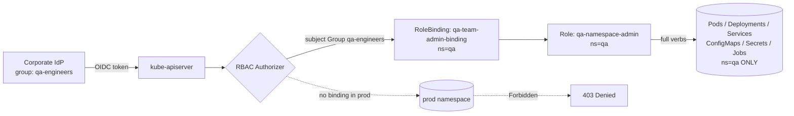
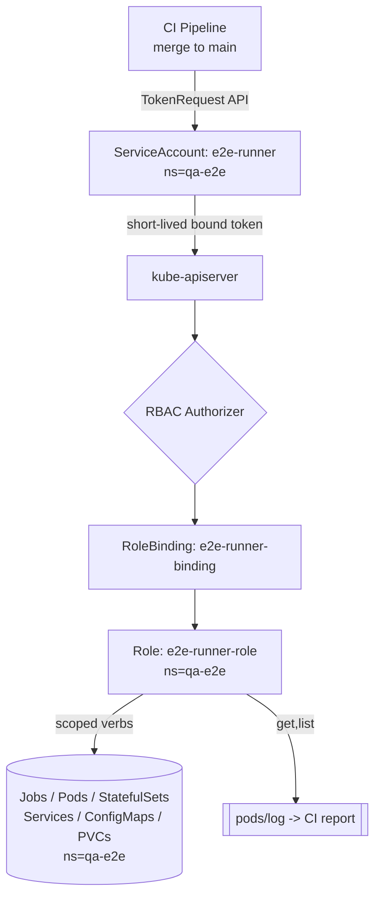
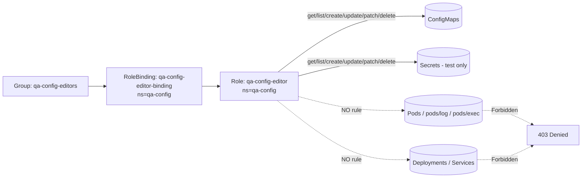
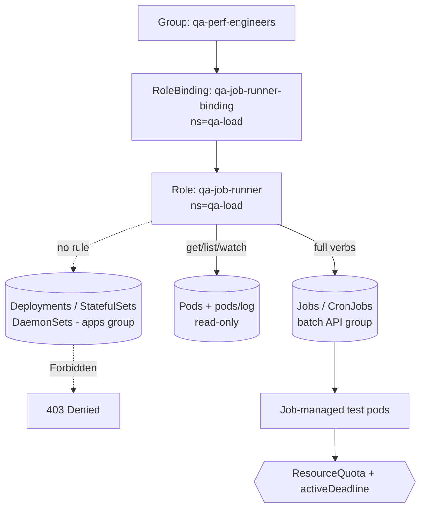
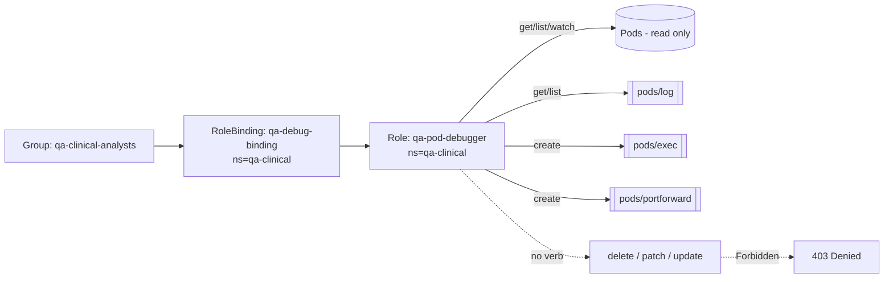

# QA & Test Teams
Real-time Kubernetes RBAC scenarios for granting QA and test-automation teams exactly the access they need in non-production namespaces while keeping production and application workloads firmly out of reach.

## Scenario 6 — QA Team Full Control Inside the `qa` Namespace with Zero Production Reach

**Company / Industry:** E-Commerce (large online marketplace)

### Business Requirement
The QA organization runs functional, regression, and UAT cycles against a full-fidelity copy of the checkout and catalog services deployed in a dedicated `qa` namespace. QA engineers must be able to deploy builds, restart pods, edit ConfigMaps, and tear down test fixtures on their own without filing tickets to the platform team. At the same time, corporate policy and PCI-DSS scoping demand that QA identities have provably **no** access to the `prod` namespace where live cardholder-adjacent traffic flows.

### Existing Problem
QA engineers were previously granted a broad `cluster-admin` `ClusterRoleBinding` "temporarily" so they could iterate quickly. During a peak-sale rehearsal, a QA engineer ran `kubectl delete deploy --all` against the wrong context and wiped the `prod` catalog Deployment, causing a 22-minute catalog outage. The post-incident review flagged that QA credentials could reach every namespace, so blast radius was the entire cluster.

### Proposed RBAC Solution
Use a namespaced **Role** granting full verbs on the workload/config resources QA needs, bound with a **RoleBinding** in the `qa` namespace to a corporate **Group** (`qa-engineers`) that is federated from the IdP. A Role + RoleBinding is chosen over a ClusterRole/ClusterRoleBinding precisely because the grant must be *confined* to `qa`; a ClusterRoleBinding would leak the same power into every namespace including `prod`. Binding to a Group rather than individual users means joiners/leavers are handled entirely in the IdP with no cluster changes. No binding referencing this subject exists in `prod`, so access there is denied by default.

### Kubernetes Resources
- Pods, Pods/exec, Pods/log
- Deployments, ReplicaSets, StatefulSets
- Services, ConfigMaps, Secrets (test-only)
- PersistentVolumeClaims
- Jobs, CronJobs
- Events (read)

### Required Permissions
- Deployments / StatefulSets / Services / ConfigMaps / PVCs / Jobs / CronJobs → `get, list, watch, create, update, patch, delete, deletecollection` — QA owns the full lifecycle of these objects inside `qa`.
- Pods → `get, list, watch, delete, deletecollection` — restart/clean pods but pods are created by controllers.
- Pods/exec, Pods/log → `create` (exec), `get, list` (log) — debug failing tests.
- Secrets → `get, list, watch, create, update, patch, delete` — scoped only to `qa`; these are non-prod test secrets.
- Events → `get, list, watch` — read-only for triage.

### Architecture Diagram


### YAML Implementation
```yaml
apiVersion: v1
kind: Namespace
metadata:
  name: qa
  labels:
    team: qa
    environment: non-production
    pci-scope: "out"
---
apiVersion: rbac.authorization.k8s.io/v1
kind: Role
metadata:
  name: qa-namespace-admin
  namespace: qa
  labels:
    team: qa
rules:
  - apiGroups: ["apps"]
    resources: ["deployments", "replicasets", "statefulsets", "daemonsets"]
    verbs: ["get", "list", "watch", "create", "update", "patch", "delete", "deletecollection"]
  - apiGroups: [""]
    resources: ["services", "configmaps", "persistentvolumeclaims"]
    verbs: ["get", "list", "watch", "create", "update", "patch", "delete", "deletecollection"]
  - apiGroups: [""]
    resources: ["secrets"]
    verbs: ["get", "list", "watch", "create", "update", "patch", "delete"]
  - apiGroups: [""]
    resources: ["pods"]
    verbs: ["get", "list", "watch", "delete", "deletecollection"]
  - apiGroups: [""]
    resources: ["pods/log"]
    verbs: ["get", "list"]
  - apiGroups: [""]
    resources: ["pods/exec", "pods/portforward"]
    verbs: ["create"]
  - apiGroups: ["batch"]
    resources: ["jobs", "cronjobs"]
    verbs: ["get", "list", "watch", "create", "update", "patch", "delete", "deletecollection"]
  - apiGroups: [""]
    resources: ["events"]
    verbs: ["get", "list", "watch"]
---
apiVersion: rbac.authorization.k8s.io/v1
kind: RoleBinding
metadata:
  name: qa-team-admin-binding
  namespace: qa
  labels:
    team: qa
subjects:
  - kind: Group
    name: qa-engineers
    apiGroup: rbac.authorization.k8s.io
roleRef:
  kind: Role
  name: qa-namespace-admin
  apiGroup: rbac.authorization.k8s.io
---
# Guardrail: cap resource consumption so QA cannot exhaust cluster capacity
apiVersion: v1
kind: ResourceQuota
metadata:
  name: qa-quota
  namespace: qa
spec:
  hard:
    requests.cpu: "20"
    requests.memory: 40Gi
    limits.cpu: "40"
    limits.memory: 80Gi
    pods: "80"
    count/deployments.apps: "40"
---
# Guardrail: block egress from qa to the prod namespace at L3/L4
apiVersion: networking.k8s.io/v1
kind: NetworkPolicy
metadata:
  name: qa-deny-prod-egress
  namespace: qa
spec:
  podSelector: {}
  policyTypes:
    - Egress
  egress:
    - to:
        - namespaceSelector:
            matchLabels:
              environment: non-production
    - to:
        - namespaceSelector: {}
          podSelector:
            matchLabels:
              k8s-app: kube-dns
      ports:
        - protocol: UDP
          port: 53
```

### Commands
```bash
# Apply the namespace, role, binding and guardrails
kubectl apply -f qa-namespace-admin.yaml

# Confirm the Role and its rules landed in the qa namespace
kubectl get role qa-namespace-admin -n qa -o yaml

# Confirm the binding wires the group to the role
kubectl get rolebinding qa-team-admin-binding -n qa -o wide

# (IdP already emits the group claim; no per-user kubectl work needed)
```

### Verification
```bash
# ALLOW: QA engineer can manage deployments in qa
kubectl auth can-i create deployments -n qa \
  --as=alice@shop.example --as-group=qa-engineers
kubectl auth can-i delete pods -n qa \
  --as=alice@shop.example --as-group=qa-engineers

# DENY: same identity has nothing in prod
kubectl auth can-i delete deployments -n prod \
  --as=alice@shop.example --as-group=qa-engineers
kubectl auth can-i get secrets -n prod \
  --as=alice@shop.example --as-group=qa-engineers

# Full effective permission dump for the identity in qa
kubectl auth can-i --list -n qa \
  --as=alice@shop.example --as-group=qa-engineers
```

### Expected Output
```text
# ALLOW cases
$ kubectl auth can-i create deployments -n qa --as=alice@shop.example --as-group=qa-engineers
yes
$ kubectl auth can-i delete pods -n qa --as=alice@shop.example --as-group=qa-engineers
yes

# DENY cases
$ kubectl auth can-i delete deployments -n prod --as=alice@shop.example --as-group=qa-engineers
no
$ kubectl auth can-i get secrets -n prod --as=alice@shop.example --as-group=qa-engineers
no

# A real forbidden error when the QA engineer actually tries prod
$ kubectl delete deploy catalog -n prod --as=alice@shop.example --as-group=qa-engineers
Error from server (Forbidden): deployments.apps "catalog" is forbidden: User "alice@shop.example" cannot delete resource "deployments" in API group "apps" in the namespace "prod"
```

### Common Mistakes
- Reaching for a `ClusterRoleBinding` "to keep it simple," which silently grants the same power in `prod`.
- Adding `secrets` with `*` verbs at cluster scope instead of confining them to `qa`.
- Forgetting `pods/log` and `pods/exec` are **subresources** — omitting them breaks QA debugging even though `pods` is allowed.
- Binding to individual `User` subjects, creating churn every time someone joins or leaves the team.
- Leaving no `ResourceQuota`, letting a runaway test load starve shared nodes.

### Troubleshooting
- `kubectl auth can-i --list -n qa --as-group=qa-engineers` to see the effective rule set.
- `kubectl describe rolebinding qa-team-admin-binding -n qa` and verify the subject `kind: Group` / `name` exactly matches the IdP group claim (case-sensitive).
- If exec fails but get pods works, confirm the `pods/exec` subresource rule exists.
- Confirm the OIDC token actually carries `qa-engineers` in its groups claim: `kubectl get --raw /apis/authentication.k8s.io/v1/selfsubjectreviews` or inspect the JWT.
- If prod access unexpectedly succeeds, hunt for a stray `ClusterRoleBinding`: `kubectl get clusterrolebindings -o json | jq '.items[] | select(.subjects[]?.name=="qa-engineers")'`.

### Best Practice
Mature e-commerce platforms treat namespaces as the isolation boundary and never grant QA cluster-wide verbs. The group is sourced from the IdP (Okta/Entra), the Role lives in Git, and the RoleBinding is applied per-environment by a GitOps controller (Argo CD/Flux). Production namespaces have an explicit deny-by-default posture — QA simply has no binding there — reinforced by a NetworkPolicy and separate node pools/kubeconfig contexts so a wrong-context command cannot even authenticate to prod.

### Security Notes
The design enforces least privilege by namespace confinement: the blast radius of any compromised QA credential is exactly the `qa` namespace and its quota. Secrets access is deliberately non-cluster-scoped, so leaked test secrets never expose production. There is no `escalate`, `bind`, or `impersonate` verb anywhere, so a QA engineer cannot self-elevate by editing roles. The NetworkPolicy adds defense-in-depth so that even a running QA pod cannot reach prod services over the network.

### Interview Questions
1. Why is a Role + RoleBinding the correct primitive here instead of a ClusterRole bound cluster-wide, and what specifically prevents QA from touching `prod`?
2. `pods` is in the Role but `kubectl exec` and `kubectl logs` fail — what is wrong and how do you fix it?
3. How would you grant the same access to 60 rotating QA contractors without editing the cluster on every onboarding?
4. A ClusterRole named `qa-namespace-admin` and a Role with the same name — can they coexist, and how does the RoleBinding know which one it references?
5. How do you prove to a PCI auditor that QA has zero access to the prod namespace?

### Interview Answers
1. A Role is namespace-scoped, so its rules only ever evaluate against objects in `qa`. A RoleBinding also grants only within its own namespace. Because no binding referencing `qa-engineers` exists in `prod`, RBAC's default-deny returns Forbidden there. A ClusterRoleBinding, by contrast, applies the referenced permissions in *every* namespace, which is exactly the failure that caused the original prod outage.
2. `exec` and `logs` operate on the `pods/exec` and `pods/log` **subresources**, which are authorized independently of the `pods` resource. You must add explicit rules: `resources: ["pods/exec"]` with verb `create`, and `resources: ["pods/log"]` with verbs `get`/`list`. Granting verbs on `pods` alone does not cover subresources.
3. Bind the Role to a **Group** (`qa-engineers`) rather than users. Membership is managed entirely in the IdP; the OIDC/SAML integration emits the group as a claim, and the apiserver maps it to the RBAC subject. Onboarding a contractor is an IdP group add — zero cluster changes, and offboarding is equally instant.
4. Yes, they can coexist — Role and ClusterRole live in different scopes and namespaces. The RoleBinding's `roleRef.kind` field disambiguates: `kind: Role` binds the namespaced Role in the binding's own namespace, while `kind: ClusterRole` would reference the cluster-scoped object. The name alone is not enough; `kind` is authoritative.
5. Run `kubectl auth can-i --list -n prod --as-group=qa-engineers` and capture the output showing no workload verbs; enumerate all ClusterRoleBindings and RoleBindings in `prod` and show none reference the QA subject; and export the audit log filtered on the QA group against `prod` resources showing only `forbid`/absent decisions. Combine with the namespace label `pci-scope: out` and the NetworkPolicy as compensating evidence.

### Follow-up Questions
- How would you extend this so QA can read (but not write) a shared `staging` namespace for cross-team integration tests?
- What breaks if the IdP changes the group claim name from `qa-engineers` to `QA-Engineers`, and how do you make the binding resilient?
- How do you prevent QA from creating a privileged/hostPath pod inside `qa` even though they have full pod-adjacent verbs?
- Where do audit logs need to be routed to satisfy PCI, and what fields prove the deny decisions?

### Production Tips
Amazon and Flipkart-scale marketplaces bind QA groups sourced from AWS IAM/SSO or Okta to namespaced Roles reconciled by GitOps, and enforce prod isolation via separate EKS node groups plus IRSA so QA service accounts have no cloud IAM to prod resources. Microsoft/Azure shops map **Entra ID (Azure AD) groups** straight to Kubernetes Groups via AKS AAD integration, so QA membership never touches the cluster. Google's GKE uses **`gke-security-groups`** to federate Google Groups into RBAC subjects, and pairs QA namespaces with Pod Security Admission (`restricted`) to stop privileged test pods.

## Scenario 7 — QA End-to-End Automation ServiceAccount for the Test Runner

**Company / Industry:** EdTech (online learning / assessment platform)

### Business Requirement
The E2E suite runs on every merge to `main` from a CI pipeline. The runner spins up ephemeral test fixtures (browser pods, seed Jobs, a throwaway database StatefulSet) inside the `qa-e2e` namespace, executes Cypress/Playwright flows against them, scrapes pod logs to attach to the CI report, and then tears everything down. This must run **non-interactively** as a machine identity — no human kubeconfig, no long-lived admin token.

### Existing Problem
The pipeline was authenticating with a copied-out `cluster-admin` kubeconfig stored as a CI secret. The token never expired, was readable by anyone with pipeline edit rights, and after a repo fork the same token leaked into a public build log. Anyone could have driven the entire cluster. Security mandated a scoped, short-lived, auditable machine identity for the test runner.

### Proposed RBAC Solution
Create a dedicated **ServiceAccount** (`e2e-runner`) in `qa-e2e`, bound via a **RoleBinding** to a purpose-built **Role**. A ServiceAccount is the correct subject for a non-human automated runner (unlike a User/Group, which model people). The token is obtained at runtime via the **TokenRequest API** (bound, short-lived, audience-scoped) rather than a static Secret. RoleBinding + namespaced Role keeps the automation confined to `qa-e2e`; the runner has no reach into other QA namespaces or prod.

### Kubernetes Resources
- Jobs, CronJobs (seed/cleanup)
- Pods, Pods/log
- Deployments, StatefulSets (ephemeral fixtures)
- Services, ConfigMaps, Secrets (test data)
- PersistentVolumeClaims (throwaway DB storage)

### Required Permissions
- Jobs → `create, get, list, watch, delete, deletecollection` — spin up and clean seed/test jobs.
- Deployments / StatefulSets / Services → `create, get, list, watch, delete` — stand up and tear down fixtures.
- Pods → `get, list, watch, delete` — poll readiness and clean up.
- Pods/log → `get, list` — attach logs to CI report.
- ConfigMaps / Secrets → `create, get, list, delete` — inject test config/data (namespace-local only).
- PVCs → `create, get, list, delete` — ephemeral DB volumes.
- No `update`/`patch` on most objects — the runner recreates rather than mutates, shrinking the permission surface.

### Architecture Diagram


### YAML Implementation
```yaml
apiVersion: v1
kind: Namespace
metadata:
  name: qa-e2e
  labels:
    team: qa
    purpose: end-to-end-automation
    environment: non-production
---
apiVersion: v1
kind: ServiceAccount
metadata:
  name: e2e-runner
  namespace: qa-e2e
  labels:
    app.kubernetes.io/managed-by: ci
automountServiceAccountToken: false
---
apiVersion: rbac.authorization.k8s.io/v1
kind: Role
metadata:
  name: e2e-runner-role
  namespace: qa-e2e
rules:
  - apiGroups: ["batch"]
    resources: ["jobs", "cronjobs"]
    verbs: ["get", "list", "watch", "create", "delete", "deletecollection"]
  - apiGroups: ["apps"]
    resources: ["deployments", "statefulsets", "replicasets"]
    verbs: ["get", "list", "watch", "create", "delete"]
  - apiGroups: [""]
    resources: ["pods"]
    verbs: ["get", "list", "watch", "delete"]
  - apiGroups: [""]
    resources: ["pods/log"]
    verbs: ["get", "list"]
  - apiGroups: [""]
    resources: ["services", "configmaps", "persistentvolumeclaims"]
    verbs: ["get", "list", "watch", "create", "delete"]
  - apiGroups: [""]
    resources: ["secrets"]
    verbs: ["get", "list", "create", "delete"]
---
apiVersion: rbac.authorization.k8s.io/v1
kind: RoleBinding
metadata:
  name: e2e-runner-binding
  namespace: qa-e2e
subjects:
  - kind: ServiceAccount
    name: e2e-runner
    namespace: qa-e2e
roleRef:
  kind: Role
  name: e2e-runner-role
  apiGroup: rbac.authorization.k8s.io
---
# Time-boxed test workloads: any Job left behind is auto-reaped
apiVersion: v1
kind: LimitRange
metadata:
  name: qa-e2e-limits
  namespace: qa-e2e
spec:
  limits:
    - type: Container
      default:
        cpu: "500m"
        memory: 512Mi
      defaultRequest:
        cpu: "100m"
        memory: 128Mi
---
apiVersion: v1
kind: ResourceQuota
metadata:
  name: qa-e2e-quota
  namespace: qa-e2e
spec:
  hard:
    pods: "40"
    count/jobs.batch: "30"
    requests.cpu: "10"
    requests.memory: 20Gi
```

### Commands
```bash
# Create namespace, SA, role, binding and guardrails
kubectl apply -f e2e-runner.yaml

# In CI: mint a short-lived (1h) bound token for the runner — no static secret
TOKEN=$(kubectl create token e2e-runner -n qa-e2e \
  --duration=3600s --audience=https://kubernetes.default.svc)

# CI configures kubectl with that ephemeral token
kubectl config set-credentials e2e-runner --token="$TOKEN"
kubectl config set-context e2e --cluster=qa-cluster \
  --user=e2e-runner --namespace=qa-e2e
kubectl config use-context e2e
```

### Verification
```bash
# ALLOW: runner can create jobs and read logs in qa-e2e
kubectl auth can-i create jobs -n qa-e2e \
  --as=system:serviceaccount:qa-e2e:e2e-runner
kubectl auth can-i get pods/log -n qa-e2e \
  --as=system:serviceaccount:qa-e2e:e2e-runner

# DENY: runner cannot patch anything, and cannot touch other namespaces
kubectl auth can-i patch deployments -n qa-e2e \
  --as=system:serviceaccount:qa-e2e:e2e-runner
kubectl auth can-i create jobs -n prod \
  --as=system:serviceaccount:qa-e2e:e2e-runner

# Prove the token is bound and short-lived
kubectl create token e2e-runner -n qa-e2e --duration=3600s | cut -d. -f2 | base64 -d 2>/dev/null
```

### Expected Output
```text
$ kubectl auth can-i create jobs -n qa-e2e --as=system:serviceaccount:qa-e2e:e2e-runner
yes
$ kubectl auth can-i get pods/log -n qa-e2e --as=system:serviceaccount:qa-e2e:e2e-runner
yes
$ kubectl auth can-i patch deployments -n qa-e2e --as=system:serviceaccount:qa-e2e:e2e-runner
no
$ kubectl auth can-i create jobs -n prod --as=system:serviceaccount:qa-e2e:e2e-runner
no

# The runner actually trying to patch a fixture:
$ kubectl patch deploy web-fixture -n qa-e2e -p '{"spec":{"replicas":3}}' \
    --as=system:serviceaccount:qa-e2e:e2e-runner
Error from server (Forbidden): deployments.apps "web-fixture" is forbidden: User "system:serviceaccount:qa-e2e:e2e-runner" cannot patch resource "deployments" in API group "apps" in the namespace "qa-e2e"
```

### Common Mistakes
- Storing a static `kubernetes.io/service-account-token` Secret in CI instead of using the TokenRequest API — the token never expires and leaks are catastrophic.
- Leaving `automountServiceAccountToken: true` on the SA so every pod using it silently mounts a token.
- Granting `*` verbs "so the runner never gets blocked," reintroducing the admin-token problem.
- Binding the SA with a ClusterRoleBinding, giving the pipeline cluster-wide create power.
- Forgetting `pods/log` and having the CI report show no test output.

### Troubleshooting
- `kubectl auth can-i --list -n qa-e2e --as=system:serviceaccount:qa-e2e:e2e-runner` to enumerate exactly what the machine identity can do.
- If the runner is 403 despite a correct Role, verify the SA name in the token subject matches `system:serviceaccount:<ns>:<name>` exactly.
- Decode the JWT (`exp`, `aud`, `kubernetes.io.namespace`) to confirm the token is the bound short-lived one and not a stale static token.
- `kubectl describe rolebinding e2e-runner-binding -n qa-e2e` — confirm `subjects[].namespace` is set (SA subjects require the namespace field).
- If a fixture create fails on quota, `kubectl describe resourcequota -n qa-e2e`.

### Best Practice
Production EdTech pipelines never persist a Kubernetes token. The CI system exchanges its own OIDC identity (GitHub Actions/GitLab OIDC) for a Kubernetes-bound token via the TokenRequest API or a workload-identity federation, scoped to a single namespace with a ~1h TTL. The Role grants create/delete but avoids update/patch, favoring immutable recreate-per-run fixtures. Namespaces are ephemeral or reset between runs, and every apiserver call is audited against the SA identity.

### Security Notes
Short-lived bound tokens shrink the exposure window from "forever" to one CI run; a leaked token in a build log is useless within the hour and is audience-bound to the apiserver. The absence of `update`/`patch`/`escalate`/`bind` means a compromised runner cannot rewrite RBAC or hijack existing workloads — it can only create/delete in its own sandbox, all of which is quota-capped and audited. `automountServiceAccountToken: false` prevents accidental token exposure to unrelated pods.

### Interview Questions
1. Why use a ServiceAccount here rather than a User or Group, and why via the TokenRequest API instead of a mounted Secret?
2. What is the security difference between `kubectl create token` and the legacy `service-account-token` Secret?
3. Why does the Role omit `update` and `patch`, and what design pattern does that enforce?
4. What is the exact subject string you pass to `--as` to impersonate a ServiceAccount, and why does the namespace matter?
5. How do you ensure a leaked CI token cannot be replayed against production?

### Interview Answers
1. A ServiceAccount models a non-human, in-cluster automated identity, which is exactly what a test runner is — Users/Groups are for humans federated from an IdP. The TokenRequest API issues **bound, expiring, audience-scoped** tokens on demand, so nothing long-lived is stored in CI. A mounted static Secret is a permanent credential that survives forever and is the classic leak vector.
2. The legacy Secret token is non-expiring, not audience-bound, and valid until the SA or Secret is deleted. A TokenRequest token has an `exp` (e.g., 1h), an `aud` (e.g., the apiserver), and can be bound to a pod object so it is invalidated when that pod dies. Kubernetes v1.24+ stopped auto-creating the legacy Secret precisely for this reason.
3. Omitting `update`/`patch` forces the runner into an immutable, recreate-per-run pattern: fixtures are created fresh and deleted after, never mutated in place. This shrinks the permission surface (no in-place tampering with existing objects) and makes test runs deterministic and reproducible.
4. `system:serviceaccount:<namespace>:<name>`, e.g. `system:serviceaccount:qa-e2e:e2e-runner`. The namespace is part of the identity — two SAs named `e2e-runner` in different namespaces are distinct subjects, and RBAC RoleBinding subjects for SAs require an explicit `namespace` field for the same reason.
5. The token is audience-scoped and short-lived, and the SA has *no binding whatsoever* in prod, so even a valid-but-leaked token is denied there by default-deny RBAC. Combined with a 1h TTL and audit logging, replay is both time-limited and namespace-limited, and prod uses a different cluster/API endpoint the token's audience does not match.

### Follow-up Questions
- How would you bind the TokenRequest token to the runner pod's lifecycle so it dies with the pod?
- How do you rotate and revoke the SA's trust if the CI system itself is compromised?
- How would workload identity federation (GitHub OIDC → Kubernetes) remove even the `kubectl create token` step?
- How do you clean up fixtures if the runner crashes mid-run and never reaches its delete step?

### Production Tips
Netflix and Uber run E2E automation as namespaced ServiceAccounts with projected, short-TTL tokens and treat CI as an OIDC identity provider federated into the cluster. On AWS EKS, teams use **IRSA** so the runner SA maps to a tightly-scoped IAM role for any cloud test fixtures, never a shared node role. Google/GKE uses **Workload Identity** to bind the SA to a GCP service account with minimal IAM. Razorpay and Freshworks-style shops reap ephemeral test namespaces with a TTL controller and audit every runner call by SA subject.

## Scenario 8 — QA Access Limited to Test Secrets and ConfigMaps Only, Not Application Workloads

**Company / Industry:** Insurance (policy administration and claims platform)

### Business Requirement
QA data engineers maintain the test data set: feature-flag ConfigMaps, mock third-party API keys, and test payment-gateway credentials stored as Secrets in the `qa-config` namespace. They must be able to read and rotate this configuration so test suites use fresh fixtures, but under insurance/IRDAI data-handling rules they must **not** be able to view, deploy, exec into, or read logs of the application workloads that consume those Secrets, because those workloads process synthetic-but-PII-shaped policyholder records.

### Existing Problem
QA config editors had the namespace `edit` ClusterRole via a RoleBinding, which — beyond ConfigMaps/Secrets — also let them `exec` into running pods and read pod logs. An auditor discovered a QA engineer had run `kubectl logs` on a claims-processor pod and seen synthetic records that were structurally identical to real PII, breaching the data-segregation control. The company needed config-plane access decoupled from workload/data-plane access.

### Proposed RBAC Solution
Use a narrowly scoped **Role** whose rules cover **only** `configmaps` and `secrets`, bound with a **RoleBinding** to the **Group** `qa-config-editors` in `qa-config`. This deliberately excludes `pods`, `pods/log`, `pods/exec`, and all workload controllers. Choosing a bespoke Role over the built-in `edit`/`view` ClusterRoles is the whole point: the built-ins bundle workload and log/exec access that violate the segregation requirement. Group binding keeps membership in the IdP.

### Kubernetes Resources
- ConfigMaps (read/write)
- Secrets (read/write, test-only)
- Explicitly excluded: Pods, Pods/log, Pods/exec, Deployments, Services

### Required Permissions
- ConfigMaps → `get, list, watch, create, update, patch, delete` — full config lifecycle.
- Secrets → `get, list, watch, create, update, patch, delete` — rotate test credentials.
- No pod, log, exec, or workload verbs at all — the data plane is invisible to this role.

### Architecture Diagram


### YAML Implementation
```yaml
apiVersion: v1
kind: Namespace
metadata:
  name: qa-config
  labels:
    team: qa
    plane: config
    environment: non-production
---
apiVersion: rbac.authorization.k8s.io/v1
kind: Role
metadata:
  name: qa-config-editor
  namespace: qa-config
  labels:
    plane: config
rules:
  - apiGroups: [""]
    resources: ["configmaps"]
    verbs: ["get", "list", "watch", "create", "update", "patch", "delete"]
  - apiGroups: [""]
    resources: ["secrets"]
    verbs: ["get", "list", "watch", "create", "update", "patch", "delete"]
---
apiVersion: rbac.authorization.k8s.io/v1
kind: RoleBinding
metadata:
  name: qa-config-editor-binding
  namespace: qa-config
subjects:
  - kind: Group
    name: qa-config-editors
    apiGroup: rbac.authorization.k8s.io
roleRef:
  kind: Role
  name: qa-config-editor
  apiGroup: rbac.authorization.k8s.io
---
# Optional hardening: a read-only companion role for QA leads who audit config
apiVersion: rbac.authorization.k8s.io/v1
kind: Role
metadata:
  name: qa-config-viewer
  namespace: qa-config
rules:
  - apiGroups: [""]
    resources: ["configmaps"]
    verbs: ["get", "list", "watch"]
  # NOTE: secrets intentionally excluded from the read-only role to avoid
  # broad secret reads; viewers see config shape, not credential values.
---
apiVersion: rbac.authorization.k8s.io/v1
kind: RoleBinding
metadata:
  name: qa-config-viewer-binding
  namespace: qa-config
subjects:
  - kind: Group
    name: qa-leads
    apiGroup: rbac.authorization.k8s.io
roleRef:
  kind: Role
  name: qa-config-viewer
  apiGroup: rbac.authorization.k8s.io
```

### Commands
```bash
# Apply the config-plane role, viewer role and bindings
kubectl apply -f qa-config-editor.yaml

# Inspect the editor role's rules
kubectl get role qa-config-editor -n qa-config -o yaml

# Confirm the binding targets the group
kubectl describe rolebinding qa-config-editor-binding -n qa-config
```

### Verification
```bash
# ALLOW: config editor can manage configmaps and secrets in qa-config
kubectl auth can-i update secrets -n qa-config \
  --as=meera@insure.example --as-group=qa-config-editors
kubectl auth can-i create configmaps -n qa-config \
  --as=meera@insure.example --as-group=qa-config-editors

# DENY: cannot read logs, exec, or see workloads
kubectl auth can-i get pods/log -n qa-config \
  --as=meera@insure.example --as-group=qa-config-editors
kubectl auth can-i create pods/exec -n qa-config \
  --as=meera@insure.example --as-group=qa-config-editors
kubectl auth can-i list deployments -n qa-config \
  --as=meera@insure.example --as-group=qa-config-editors

# Full effective set
kubectl auth can-i --list -n qa-config \
  --as=meera@insure.example --as-group=qa-config-editors
```

### Expected Output
```text
$ kubectl auth can-i update secrets -n qa-config --as=meera@insure.example --as-group=qa-config-editors
yes
$ kubectl auth can-i create configmaps -n qa-config --as=meera@insure.example --as-group=qa-config-editors
yes
$ kubectl auth can-i get pods/log -n qa-config --as=meera@insure.example --as-group=qa-config-editors
no
$ kubectl auth can-i create pods/exec -n qa-config --as=meera@insure.example --as-group=qa-config-editors
no
$ kubectl auth can-i list deployments -n qa-config --as=meera@insure.example --as-group=qa-config-editors
no

# Real forbidden error when the QA engineer tries to read a claims-processor log
$ kubectl logs claims-processor-7d9f -n qa-config --as=meera@insure.example --as-group=qa-config-editors
Error from server (Forbidden): pods "claims-processor-7d9f" is forbidden: User "meera@insure.example" cannot get resource "pods/log" in API group "" in the namespace "qa-config"
```

### Common Mistakes
- Reusing the built-in `edit` ClusterRole, which quietly includes `pods/exec` and `pods/log` and breaks the segregation control.
- Assuming that denying `pods` also denies `pods/log`/`pods/exec` — subresources must be reasoned about explicitly (here they simply have no rule, so they are denied).
- Putting Secrets in the same namespace as the workloads that consume them, so a workload-viewer role incidentally sees them.
- Granting `list secrets` cluster-wide, which lets one namespace's editors enumerate every Secret in the cluster.
- Forgetting that anyone who can create a pod that mounts a Secret can read that Secret's contents indirectly — hence workload-create is also excluded.

### Troubleshooting
- `kubectl auth can-i --list -n qa-config --as-group=qa-config-editors` should show only configmaps/secrets verbs and nothing pod-related.
- If a QA engineer unexpectedly can read logs, look for a second RoleBinding granting `edit`/`view`: `kubectl get rolebindings -n qa-config -o wide`.
- Verify apiGroup is `""` (core) for configmaps/secrets — a common typo is putting them under `apps`.
- Check no aggregated ClusterRole is pulling extra rules in via `rbac.authorization.k8s.io/aggregate-to-edit` labels.
- Confirm the group name matches the IdP claim exactly.

### Best Practice
Regulated insurers split the config plane from the data plane. Secrets and ConfigMaps for tests live in a dedicated namespace (or an external secret manager surfaced via the External Secrets Operator), and the QA config role touches only those objects. Workload logs/exec are governed by a separate role granted to a separate group, and no single identity holds both. Secret values are ideally sourced from Vault/AWS Secrets Manager so Kubernetes only ever holds short-lived synced copies.

### Security Notes
The core risk is PII/secret exposure through the data plane. By removing `pods/log`, `pods/exec`, and all pod/workload verbs, the config editors literally cannot observe running application data, mitigating the exact audit finding. Excluding cluster-scoped secret reads bounds blast radius to `qa-config`. The design also accounts for the indirect read path: since Secret contents can be exfiltrated by mounting them into an attacker-controlled pod, the role withholds pod-create entirely, closing that side channel.

### Interview Questions
1. Why is the built-in `edit` ClusterRole unsafe for this requirement even though the engineer "only needs configmaps and secrets"?
2. If the Role has no rule for `pods/log`, is log access allowed, denied, or dependent on the `pods` rule? Explain.
3. An engineer has full secret access in `qa-config` but no pod-create. Why does removing pod-create still matter for secret confidentiality?
4. How would you let QA leads see that a ConfigMap exists and its keys without exposing Secret *values*?
5. What is the danger of granting `list secrets` at cluster scope versus namespace scope?

### Interview Answers
1. The built-in `edit` ClusterRole aggregates far more than configmaps/secrets — it includes `pods/exec`, `pods/attach`, `pods/log`, and write access to workloads. Binding it hands the QA engineer data-plane observability into running application pods, which is precisely the segregation breach the auditor flagged. A bespoke Role scoped to two resource types is the only way to satisfy least privilege.
2. Denied. Authorization is default-deny: a subject can only do what a matching rule explicitly allows. `pods/log` is its own subresource and needs its own rule; the presence or absence of a `pods` rule is irrelevant to it. With no `pods/log` rule, log access returns Forbidden.
3. Because a Secret's plaintext can be read indirectly: anyone who can create a pod can mount the Secret as a volume or env var and print it. So even without direct `get secrets`, pod-create is a secret-read side channel. Here the engineer *does* have direct secret access by design (they rotate test creds), but withholding pod-create prevents them (or an attacker using their token) from exfiltrating *other* namespaces' secrets by scheduling a reader pod — reinforced by the namespace scope.
4. Give QA leads a read-only Role with `get,list,watch` on `configmaps` only and deliberately omit `secrets`. They can see ConfigMap keys/values (non-sensitive config) and confirm a Secret object exists via events/references, but cannot read Secret values. That is the `qa-config-viewer` role in the manifest.
5. Cluster-scoped `list secrets` (via a ClusterRole+ClusterRoleBinding) lets the subject enumerate and read every Secret in every namespace — including prod TLS keys and DB passwords — a massive blast radius. Namespace-scoped secret access confines exposure to that one namespace, which is the least-privilege posture.

### Follow-up Questions
- How would you integrate the External Secrets Operator so QA never holds long-lived credential values in etcd?
- How do you audit every `get secrets` call by the QA group and alert on anomalous volume?
- Would encryption-at-rest (KMS) change who can read Secrets, and does it affect RBAC decisions?
- How would you prevent a QA editor from patching a ConfigMap that a shared controller watches and thereby affecting other teams?

### Production Tips
IBM and Cisco-style regulated shops enforce config/data-plane separation with distinct RBAC groups and route all Secret material through Vault or AWS/Azure secret managers via the **External Secrets Operator**, so etcd holds only short-lived synced copies. Microsoft/Azure environments use **Entra ID groups** to keep config-editor and workload-operator memberships disjoint. Red Hat OpenShift shops lean on separate roles plus admission policies (OPA Gatekeeper/Kyverno) to block pods that mount Secrets they should not, and stream every secret access to a SIEM for IRDAI-style audits.

## Scenario 9 — QA Can Create Jobs for On-Demand Test Workloads but Not Deployments

**Company / Industry:** Telecom (mobile network / OSS-BSS platform)

### Business Requirement
QA performance engineers run on-demand load and conformance tests — traffic generators, protocol-conformance batch runs, and data-migration dry runs — as Kubernetes **Jobs** and **CronJobs** in the `qa-load` namespace. These are finite, run-to-completion workloads. QA must be able to create and delete them freely. However, they must **not** be able to create long-running **Deployments/StatefulSets/DaemonSets**, because standing services in the shared QA cluster consume node capacity indefinitely and, in the past, silently pinned expensive SR-IOV/DPDK nodes reserved for the network data plane.

### Existing Problem
QA had the `edit` role, so nothing stopped an engineer from `kubectl create deployment loadgen --replicas=50`. A left-behind 50-replica Deployment ran for a weekend on DPDK-capable nodes, blocked a real network-function test from scheduling, and rang up a large cloud bill. Management wanted QA restricted to ephemeral, run-to-completion workloads only.

### Proposed RBAC Solution
A namespaced **Role** that grants full lifecycle verbs on `batch` resources (`jobs`, `cronjobs`) and read-only visibility on pods, but grants **no verbs on `apps` workloads** (Deployments/StatefulSets/DaemonSets/ReplicaSets). Bound via **RoleBinding** to the **Group** `qa-perf-engineers`. The precision here is at the `apiGroups`/`resources` level — `batch` allowed, `apps` absent. A ClusterRole is unnecessary since everything is confined to `qa-load`. Guardrails (ResourceQuota, activeDeadline expectations) complement RBAC.

### Kubernetes Resources
- Jobs, CronJobs (create/manage)
- Pods, Pods/log (read for monitoring)
- Events (read)
- Explicitly excluded: Deployments, StatefulSets, DaemonSets, ReplicaSets

### Required Permissions
- Jobs → `get, list, watch, create, update, patch, delete, deletecollection` — full control of batch test workloads.
- CronJobs → `get, list, watch, create, update, patch, delete` — schedule recurring conformance runs.
- Pods → `get, list, watch` — observe Job pods (read-only; Jobs create the pods).
- Pods/log → `get, list` — collect test output.
- Events → `get, list, watch` — triage failures.
- No verbs on `deployments`/`statefulsets`/`daemonsets`/`replicasets` — standing services are forbidden.

### Architecture Diagram


### YAML Implementation
```yaml
apiVersion: v1
kind: Namespace
metadata:
  name: qa-load
  labels:
    team: qa
    workload-type: batch-only
    environment: non-production
---
apiVersion: rbac.authorization.k8s.io/v1
kind: Role
metadata:
  name: qa-job-runner
  namespace: qa-load
  labels:
    team: qa
rules:
  - apiGroups: ["batch"]
    resources: ["jobs"]
    verbs: ["get", "list", "watch", "create", "update", "patch", "delete", "deletecollection"]
  - apiGroups: ["batch"]
    resources: ["cronjobs"]
    verbs: ["get", "list", "watch", "create", "update", "patch", "delete"]
  - apiGroups: [""]
    resources: ["pods"]
    verbs: ["get", "list", "watch"]
  - apiGroups: [""]
    resources: ["pods/log"]
    verbs: ["get", "list"]
  - apiGroups: [""]
    resources: ["events"]
    verbs: ["get", "list", "watch"]
  # Intentionally NO rule for apiGroups ["apps"] -> deployments/statefulsets/daemonsets denied
---
apiVersion: rbac.authorization.k8s.io/v1
kind: RoleBinding
metadata:
  name: qa-job-runner-binding
  namespace: qa-load
subjects:
  - kind: Group
    name: qa-perf-engineers
    apiGroup: rbac.authorization.k8s.io
roleRef:
  kind: Role
  name: qa-job-runner
  apiGroup: rbac.authorization.k8s.io
---
# Cap concurrent batch load; prevents the "50-replica weekend" incident
apiVersion: v1
kind: ResourceQuota
metadata:
  name: qa-load-quota
  namespace: qa-load
spec:
  hard:
    count/jobs.batch: "25"
    count/cronjobs.batch: "10"
    pods: "60"
    requests.cpu: "30"
    requests.memory: 60Gi
    limits.cpu: "60"
    limits.memory: 120Gi
---
# Default container limits so a runaway load pod cannot grab a whole node
apiVersion: v1
kind: LimitRange
metadata:
  name: qa-load-limits
  namespace: qa-load
spec:
  limits:
    - type: Container
      max:
        cpu: "4"
        memory: 8Gi
      default:
        cpu: "500m"
        memory: 1Gi
      defaultRequest:
        cpu: "250m"
        memory: 512Mi
```

### Commands
```bash
# Apply the batch-only role, binding and guardrails
kubectl apply -f qa-job-runner.yaml

# Verify the role has batch verbs but no apps verbs
kubectl get role qa-job-runner -n qa-load -o yaml

# Example on-demand load test (run as a QA engineer)
kubectl create job loadgen-run-42 -n qa-load \
  --image=registry.telco.example/qa/loadgen:1.7 \
  -- ./run --target http://sut.qa-load.svc --duration 300s
```

### Verification
```bash
# ALLOW: create/delete jobs and cronjobs
kubectl auth can-i create jobs -n qa-load \
  --as=ravi@telco.example --as-group=qa-perf-engineers
kubectl auth can-i create cronjobs -n qa-load \
  --as=ravi@telco.example --as-group=qa-perf-engineers

# DENY: cannot create standing workloads
kubectl auth can-i create deployments -n qa-load \
  --as=ravi@telco.example --as-group=qa-perf-engineers
kubectl auth can-i create statefulsets -n qa-load \
  --as=ravi@telco.example --as-group=qa-perf-engineers
kubectl auth can-i delete pods -n qa-load \
  --as=ravi@telco.example --as-group=qa-perf-engineers

# Full effective set
kubectl auth can-i --list -n qa-load \
  --as=ravi@telco.example --as-group=qa-perf-engineers
```

### Expected Output
```text
$ kubectl auth can-i create jobs -n qa-load --as=ravi@telco.example --as-group=qa-perf-engineers
yes
$ kubectl auth can-i create cronjobs -n qa-load --as=ravi@telco.example --as-group=qa-perf-engineers
yes
$ kubectl auth can-i create deployments -n qa-load --as=ravi@telco.example --as-group=qa-perf-engineers
no
$ kubectl auth can-i create statefulsets -n qa-load --as=ravi@telco.example --as-group=qa-perf-engineers
no
$ kubectl auth can-i delete pods -n qa-load --as=ravi@telco.example --as-group=qa-perf-engineers
no

# Real forbidden error when a QA engineer tries to stand up a Deployment
$ kubectl create deployment loadgen -n qa-load --image=nginx --replicas=50 \
    --as=ravi@telco.example --as-group=qa-perf-engineers
Error from server (Forbidden): deployments.apps is forbidden: User "ravi@telco.example" cannot create resource "deployments" in API group "apps" in the namespace "qa-load"
```

### Common Mistakes
- Granting the `edit` role, which includes `apps` workloads and defeats the whole restriction.
- Adding `pods` with `create` — this lets QA bypass the intent by scheduling bare long-running pods; keep pods read-only.
- Confusing API groups: putting `jobs` under `apps` instead of `batch`, so the rule matches nothing.
- Forgetting `deletecollection` on jobs, so bulk cleanup of finished test jobs fails.
- Omitting a ResourceQuota, letting a 500-parallelism Job flood the cluster even though it is "just a Job."

### Troubleshooting
- `kubectl auth can-i --list -n qa-load --as-group=qa-perf-engineers` — confirm `jobs`/`cronjobs` present and `deployments` absent.
- If Job creation fails, check the `batch` apiGroup spelling and that `create` is in the verb list.
- If a Deployment unexpectedly succeeds, search for another binding granting `apps`: `kubectl get rolebindings -n qa-load -o wide`.
- If Jobs create but never run pods, it is likely quota (`kubectl describe quota -n qa-load`) or the Job's own pod template, not RBAC.
- Bare-pod creation being blocked is expected — pods are read-only in this role by design.

### Best Practice
Telecoms running mixed batch/standing workloads scope QA to the `batch` API group and pair it with quotas, `activeDeadlineSeconds`/`ttlSecondsAfterFinished` on Jobs, and dedicated node pools with taints so expensive DPDK/SR-IOV nodes are never eligible for QA test pods. Standing services in QA are provisioned only through GitOps by the platform team, never ad hoc by QA. This keeps ephemeral test capacity elastic while protecting specialized hardware.

### Security Notes
Restricting QA to run-to-completion Jobs bounds the *time* and *cost* blast radius — nothing QA creates runs indefinitely, especially with `ttlSecondsAfterFinished` and quotas. Keeping pods read-only closes the obvious bypass (a bare long-lived pod). No `escalate`/`bind` means QA cannot widen their own role to add `apps`. Node taints ensure that even a legitimate Job cannot land on protected network-function hardware, isolating the shared-infrastructure risk.

### Interview Questions
1. Which API group are Jobs and CronJobs in, and why does getting that wrong silently break the Role?
2. The requirement is "no Deployments," yet you also keep `pods` read-only. Why is allowing `create pods` a loophole?
3. How does RBAC alone fail to stop a 500-parallelism Job, and what non-RBAC guardrails complete the control?
4. Why choose a Role/RoleBinding over a ClusterRole here, and what would change if perf tests needed to span three namespaces?
5. How would you additionally guarantee QA Jobs never schedule onto SR-IOV/DPDK nodes?

### Interview Answers
1. Jobs and CronJobs are in the `batch` API group (`batch/v1`). RBAC rules match on `apiGroups` + `resources`; if you write `apiGroups: ["apps"]` for jobs, no rule matches the request, so every Job action is denied with a confusing Forbidden even though "jobs" appears in the manifest. Precision on the API group is mandatory.
2. Because a Deployment is just a controller that ultimately creates pods — the thing you actually want to prevent is a long-running pod consuming capacity. If QA can `create pods` directly, they can schedule a bare, restart-forever pod and reproduce exactly the standing-workload problem without ever touching a Deployment. So pods stay read-only; only the Job controller (acting via its own controller identity) creates pods.
3. RBAC authorizes *whether* you can create a Job, not *how big* it is — a single authorized Job with `parallelism: 500` is fully permitted. You complete the control with a `ResourceQuota` capping pods/CPU/memory and `count/jobs.batch`, a `LimitRange` for per-container ceilings, and Job specs with `activeDeadlineSeconds`/`ttlSecondsAfterFinished`. Admission policy (Kyverno) can enforce max parallelism.
4. A Role/RoleBinding confines the grant to `qa-load`, matching least privilege for a single test namespace. If perf tests spanned three namespaces, the cleanest approach is one **ClusterRole** (the reusable rule set) referenced by three **RoleBindings**, one per namespace — this reuses the definition while still confining each grant, rather than a single ClusterRoleBinding that would leak into every namespace.
5. Taint the SR-IOV/DPDK nodes (e.g., `dedicated=network-functions:NoSchedule`) and do not give QA any way to add the matching toleration — enforce via a Kyverno/Gatekeeper policy that strips or rejects tolerations for that taint on pods in `qa-load`. Combined with nodeSelector defaults, QA Jobs land only on general-purpose nodes.

### Follow-up Questions
- How would you enforce `ttlSecondsAfterFinished` and `activeDeadlineSeconds` on every QA Job automatically?
- How do you let QA run CronJobs but prevent a misconfigured schedule from firing hundreds of concurrent runs?
- If QA needs one specific standing service (a mock SUT), how do you provision it without granting `apps` verbs?
- How would admission control (Kyverno/Gatekeeper) complement this RBAC to cap Job `parallelism`?

### Production Tips
Telecom platforms at Cisco and VMware scope test teams to the `batch` group and layer Kyverno/Gatekeeper to enforce Job TTLs, parallelism caps, and toleration restrictions. On specialized hardware (DPDK/SR-IOV), they taint node pools and centrally control tolerations. PhonePe and Paytm-style high-throughput shops run load tests as quota-bounded Jobs in isolated namespaces on autoscaling general-purpose node groups, keeping standing services under GitOps-only provisioning so QA never creates long-lived workloads by hand.

## Scenario 10 — QA Can Read Logs and Exec Into Test Pods with No Delete or Patch

**Company / Industry:** Healthcare (clinical / EHR SaaS platform)

### Business Requirement
QA test analysts validating an EHR test environment in the `qa-clinical` namespace need to debug failing test cases: tail application logs and `kubectl exec` into running test pods to inspect state, run a query, or check a mounted config. Under HIPAA-aligned change-control, they must **not** be able to mutate or destroy the environment — no `delete`, no `patch`, no `scale`, no `edit` of workloads — because uncontrolled changes to a validated test environment invalidate the test evidence used for release sign-off.

### Existing Problem
QA analysts held the `edit` role, so while debugging a flaky test one analyst ran `kubectl delete pod` on a stateful test pod to "reset" it, wiping seeded clinical test data mid-validation and forcing the entire GxP-style validation run to restart — a multi-day delay. Compliance required read-and-inspect access that is provably incapable of changing the environment.

### Proposed RBAC Solution
A namespaced **Role** granting read verbs on pods/logs/events plus the **`create` verb on the `pods/exec` subresource** (exec is authorized as a `create` on `pods/exec`), and nothing else — explicitly no `delete`, `patch`, `update`, or `deletecollection`, and no workload write. Bound with a **RoleBinding** to the **Group** `qa-clinical-analysts`. The subtle point is that exec requires `create` on a subresource while the parent `pods` resource stays strictly read-only; this is the crux of "inspect but never mutate."

### Kubernetes Resources
- Pods (read)
- Pods/log (read)
- Pods/exec (exec only)
- Pods/portforward (optional, for debugging local tooling)
- Events, Services, ConfigMaps (read)
- Explicitly excluded: any delete/patch/update on pods or workloads

### Required Permissions
- Pods → `get, list, watch` — see pod status; NOT `delete`/`patch`.
- Pods/log → `get, list` — tail logs.
- Pods/exec → `create` — open an exec session (this is how exec is authorized).
- Pods/portforward → `create` — optional local debugging.
- Events / Services / ConfigMaps → `get, list, watch` — read-only environment context.
- Deliberately NO `delete`, `patch`, `update`, `deletecollection`, or workload write anywhere.

### Architecture Diagram


### YAML Implementation
```yaml
apiVersion: v1
kind: Namespace
metadata:
  name: qa-clinical
  labels:
    team: qa
    compliance: hipaa-gxp
    environment: non-production
---
apiVersion: rbac.authorization.k8s.io/v1
kind: Role
metadata:
  name: qa-pod-debugger
  namespace: qa-clinical
  labels:
    access: read-and-exec
rules:
  - apiGroups: [""]
    resources: ["pods"]
    verbs: ["get", "list", "watch"]
  - apiGroups: [""]
    resources: ["pods/log"]
    verbs: ["get", "list"]
  - apiGroups: [""]
    resources: ["pods/exec"]
    verbs: ["create"]
  - apiGroups: [""]
    resources: ["pods/portforward"]
    verbs: ["create"]
  - apiGroups: [""]
    resources: ["events", "services", "configmaps"]
    verbs: ["get", "list", "watch"]
  # No delete, patch, update, deletecollection anywhere -> environment is immutable to QA
---
apiVersion: rbac.authorization.k8s.io/v1
kind: RoleBinding
metadata:
  name: qa-debug-binding
  namespace: qa-clinical
subjects:
  - kind: Group
    name: qa-clinical-analysts
    apiGroup: rbac.authorization.k8s.io
roleRef:
  kind: Role
  name: qa-pod-debugger
  apiGroup: rbac.authorization.k8s.io
---
# Defense-in-depth: block privileged/hostPath exec targets via Pod Security
apiVersion: v1
kind: Namespace
metadata:
  name: qa-clinical
  labels:
    pod-security.kubernetes.io/enforce: restricted
    pod-security.kubernetes.io/enforce-version: latest
    pod-security.kubernetes.io/audit: restricted
    pod-security.kubernetes.io/warn: restricted
    team: qa
    compliance: hipaa-gxp
    environment: non-production
```

### Commands
```bash
# Apply the read-and-exec role and binding
kubectl apply -f qa-pod-debugger.yaml

# Confirm the role's verbs
kubectl get role qa-pod-debugger -n qa-clinical -o yaml

# A QA analyst debugging a failing test pod
kubectl logs ehr-test-api-6c8f9 -n qa-clinical --as=priya@ehr.example --as-group=qa-clinical-analysts
kubectl exec -it ehr-test-api-6c8f9 -n qa-clinical --as=priya@ehr.example --as-group=qa-clinical-analysts -- /bin/sh
```

### Verification
```bash
# ALLOW: read logs, list pods, exec
kubectl auth can-i get pods/log -n qa-clinical \
  --as=priya@ehr.example --as-group=qa-clinical-analysts
kubectl auth can-i create pods/exec -n qa-clinical \
  --as=priya@ehr.example --as-group=qa-clinical-analysts
kubectl auth can-i list pods -n qa-clinical \
  --as=priya@ehr.example --as-group=qa-clinical-analysts

# DENY: no mutation of the environment
kubectl auth can-i delete pods -n qa-clinical \
  --as=priya@ehr.example --as-group=qa-clinical-analysts
kubectl auth can-i patch pods -n qa-clinical \
  --as=priya@ehr.example --as-group=qa-clinical-analysts
kubectl auth can-i patch deployments -n qa-clinical \
  --as=priya@ehr.example --as-group=qa-clinical-analysts

# Full effective set
kubectl auth can-i --list -n qa-clinical \
  --as=priya@ehr.example --as-group=qa-clinical-analysts
```

### Expected Output
```text
$ kubectl auth can-i get pods/log -n qa-clinical --as=priya@ehr.example --as-group=qa-clinical-analysts
yes
$ kubectl auth can-i create pods/exec -n qa-clinical --as=priya@ehr.example --as-group=qa-clinical-analysts
yes
$ kubectl auth can-i list pods -n qa-clinical --as=priya@ehr.example --as-group=qa-clinical-analysts
yes
$ kubectl auth can-i delete pods -n qa-clinical --as=priya@ehr.example --as-group=qa-clinical-analysts
no
$ kubectl auth can-i patch pods -n qa-clinical --as=priya@ehr.example --as-group=qa-clinical-analysts
no
$ kubectl auth can-i patch deployments -n qa-clinical --as=priya@ehr.example --as-group=qa-clinical-analysts
no

# Real forbidden error when an analyst tries to delete a pod
$ kubectl delete pod ehr-test-api-6c8f9 -n qa-clinical --as=priya@ehr.example --as-group=qa-clinical-analysts
Error from server (Forbidden): pods "ehr-test-api-6c8f9" is forbidden: User "priya@ehr.example" cannot delete resource "pods" in API group "" in the namespace "qa-clinical"
```

### Common Mistakes
- Assuming `kubectl exec` needs a verb on `pods`; it actually needs `create` on `pods/exec` — granting only `get pods` fails exec.
- Granting `get pods` but forgetting `pods/log`, so `kubectl logs` returns Forbidden while `get pod` works.
- Using the `edit`/`admin` role, which permits delete/patch and reintroduces the environment-mutation risk.
- Treating exec as harmless read access — exec is a powerful write-capable channel into the container; it must be paired with Pod Security so QA cannot exec into a privileged pod.
- Forgetting that `kubectl cp` also uses `pods/exec`, so denying exec would break it — here exec is intentionally allowed.

### Troubleshooting
- `kubectl auth can-i --list -n qa-clinical --as-group=qa-clinical-analysts` should show `pods` read verbs, `pods/exec [create]`, `pods/log [get,list]`, and no delete/patch.
- If exec fails with Forbidden, confirm the `pods/exec` rule uses verb `create` (not `get`).
- If logs fail but exec works, the `pods/log` rule is missing.
- If delete unexpectedly succeeds, look for a stray `edit`/`admin` RoleBinding in the namespace.
- Confirm apiGroup is `""` for all these core subresources.

### Best Practice
Regulated healthcare platforms grant read-and-exec debugging as a distinct, tightly-audited role separate from any write role, and pair it with Pod Security Admission (`restricted`) plus an ephemeral-debug-container workflow (`kubectl debug`) so analysts inspect without ever needing delete/patch. Exec sessions are logged and, in stricter shops, brokered through a session-recording proxy (Teleport/Boundary) so every command an analyst runs inside a test pod is captured for the validation audit trail.

### Security Notes
Exec is deceptively powerful — it is effectively code execution inside the container, so even without `delete`/`patch` an analyst could alter in-container state. This is mitigated by Pod Security `restricted` (no privileged, no hostPath, non-root), by confining the role to the `qa-clinical` namespace (blast radius is one test environment), and by exec-session auditing. The absence of `delete`/`patch`/`update` guarantees the *declared* state of the validated environment is immutable to QA, preserving the integrity of GxP test evidence. No `escalate`/`bind`/`impersonate` prevents self-elevation.

### Interview Questions
1. Precisely which resource and verb authorize `kubectl exec`, and why is `get pods` insufficient?
2. The role has no `delete`/`patch` — is exec therefore "safe"? What can an analyst still do inside a pod, and how do you contain it?
3. How is `kubectl logs` authorized differently from `kubectl exec`, and what happens if you grant one but not the other?
4. Why is a Role/RoleBinding to a Group the right shape, and how do you make exec sessions auditable for a HIPAA/GxP trail?
5. How would `kubectl debug` (ephemeral containers) change the permissions you need, and why might it be preferable?

### Interview Answers
1. `kubectl exec` is authorized as the `create` verb on the `pods/exec` subresource (apiGroup `""`). `get pods` only allows reading the Pod object's spec/status; it does not open the exec streaming channel. Without a `create` rule on `pods/exec`, exec returns Forbidden regardless of pod read access.
2. No — exec grants interactive shell/command execution inside the container, so the analyst can modify files, kill processes, or read in-container secrets even without Kubernetes `delete`/`patch`. You contain it with Pod Security `restricted` (non-root, no privilege escalation, no hostPath), namespace confinement to bound blast radius, read-only root filesystems where feasible, and session recording/auditing so every in-pod command is captured. `delete`/`patch` being denied only protects the *Kubernetes object* state, not in-container state.
3. `kubectl logs` needs `get` (and `list`) on the `pods/log` subresource; `kubectl exec` needs `create` on `pods/exec`. They are independent subresources. Granting logs but not exec lets analysts read output but not enter the pod; granting exec but not logs lets them shell in but `kubectl logs` returns Forbidden. Both rules are required for the full debugging workflow.
4. A namespaced Role confines the debug capability to the single validated test environment, and binding to a Group keeps membership in the IdP with no per-user cluster churn — appropriate for a rotating analyst pool. For auditability, enable API audit logging (which records every `pods/exec` create with the impersonated user), and route exec through a session-recording access proxy (Teleport) so the full keystroke/command transcript is retained as GxP evidence.
5. `kubectl debug` attaches an **ephemeral container** to a running pod, authorized via the `create` verb on the `pods/ephemeralcontainers` subresource. It lets analysts run debug tooling in a sidecar without exec-ing into (and potentially altering) the application container, and without needing a shell present in the app image. It is preferable because the debug tooling is isolated from the workload container, leaving the validated container's state untouched — better for GxP integrity. You would add a `pods/ephemeralcontainers: [create]` rule and could then even remove `pods/exec`.

### Follow-up Questions
- How would you switch analysts from `pods/exec` to `pods/ephemeralcontainers` and what are the trade-offs?
- How do you capture a full command transcript of every exec session for the compliance auditor?
- Exec is denied on privileged pods how, exactly — is that RBAC or admission control?
- How would you time-box this debug access (e.g., only during an active incident) rather than granting it standing?

### Production Tips
Healthcare SaaS platforms and IBM/Red Hat OpenShift shops separate read-and-exec debug roles from write roles, enforce Pod Security `restricted`, and increasingly steer engineers to `kubectl debug` ephemeral containers so the validated workload is never entered directly. Exec access is commonly brokered through session-recording proxies (Teleport, HashiCorp Boundary) and time-boxed via just-in-time access tools, with every `pods/exec` call captured in the API audit log and shipped to a SIEM. Google/GKE and Microsoft/AKS environments bind the debug group from `gke-security-groups`/Entra ID and pair it with audit-log-based alerting on exec frequency.
