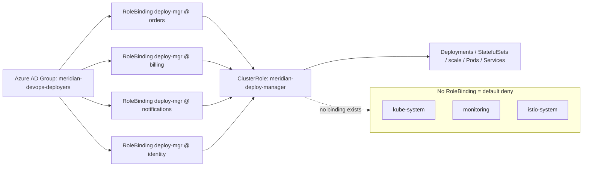
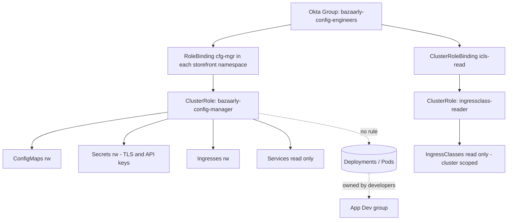
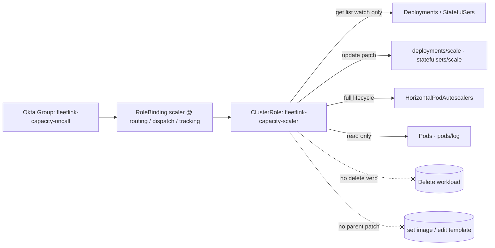
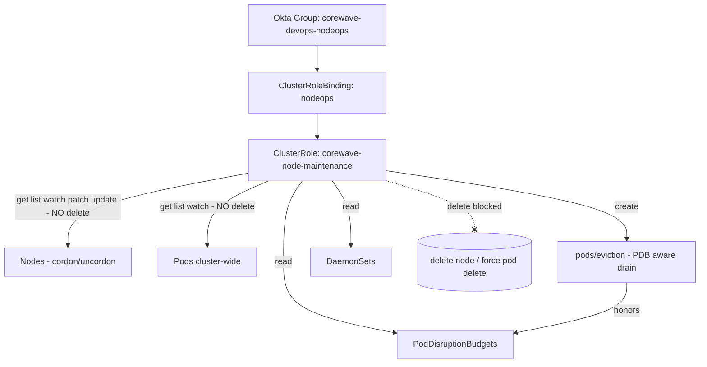
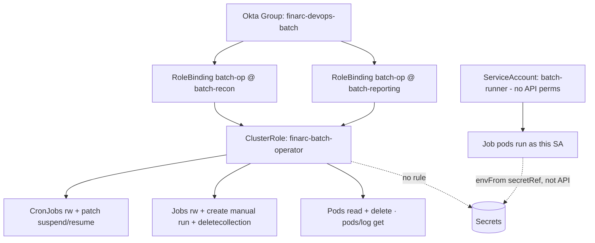

# DevOps Team

Production-grade RBAC patterns for the DevOps/release-engineering function on Kubernetes v1.33+ — reusing one ClusterRole across several application namespaces for deploys, owning the config/secret/ingress plane, granting scale-only rights without delete, running safe node cordon/drain maintenance, and operating CronJob/Job batch pipelines — each scoped to least privilege with a provable audit trail.

## Scenario 11 — Cross-Namespace Deployment Manager Over Several Application Namespaces

**Company / Industry:** SaaS (multi-tenant workflow-automation platform, "Meridian Cloud")

### Business Requirement
A central DevOps/release team drives continuous delivery for roughly a dozen microservices spread across four product namespaces — `orders`, `billing`, `notifications`, and `identity`. From a single on-call rotation they roll out new versions, roll back bad releases, restart wedged workloads, and adjust replica counts across all four namespaces. The grant must be identical in every product namespace, must never touch platform namespaces (`kube-system`, `monitoring`, `istio-system`) or any other team's namespace, must be driven by an Azure AD group so joiners/leavers are managed in the IdP, and onboarding a new product namespace must not require inventing a new permission set.

### Existing Problem
DevOps held `cluster-admin` through a `ClusterRoleBinding` "just to unblock deploys." During a routine rollback an Argo CD sync script ran against the wrong context and restarted pods in `istio-system`, dropping the service mesh for 20 minutes. Because the grant was cluster-wide, the audit log could not distinguish a legitimate deploy from a platform mutation, and the security team flagged the blast radius — every namespace, every resource kind — as unacceptable for the SOC 2 renewal.

### Proposed RBAC Solution
Define **one `ClusterRole`** (`meridian-deploy-manager`) that encodes the deployment-management rule set, then bind it with a **separate `RoleBinding` in each of the four product namespaces**. The subtlety that makes this work: a `ClusterRole` is only a reusable bag of rules; a `RoleBinding` that references a `ClusterRole` applies those rules **only inside the binding's namespace**. This yields DRY, drift-free permissions across the four namespaces while structurally excluding every other namespace. We reject a `ClusterRoleBinding` (it would apply the role cluster-wide, reintroducing the exact blast radius we are fixing) and reject four hand-copied namespaced `Role` objects (they drift and multiply maintenance). Adding a fifth product namespace becomes a single one-line `RoleBinding` PR. Membership is an **Azure AD group** subject, so hiring/offboarding never touches Kubernetes.

### Kubernetes Resources
- Deployments, StatefulSets, DaemonSets, ReplicaSets (apps/v1)
- `deployments/scale`, `statefulsets/scale` (scale subresource)
- Pods, `pods/log` (inspect + restart)
- Services (v1) — wire up during rollout
- ConfigMaps (v1) — read-only
- Events (v1) — read-only observability

### Required Permissions
- Deployments, StatefulSets, DaemonSets, ReplicaSets → `get, list, watch, create, update, patch, delete` — full release lifecycle including `kubectl rollout undo` (patch) and `kubectl rollout restart` (patch of the template annotation).
- `deployments/scale`, `statefulsets/scale` → `get, update, patch` — adjust replica counts during a rollout.
- Pods → `get, list, watch, delete` — inspect and recycle pods; **no `create`** (pods come from controllers).
- `pods/log` → `get` — read logs while validating a release.
- Services → `get, list, watch, create, update, patch, delete` — expose/repoint app traffic during deploys.
- ConfigMaps → `get, list, watch` — read-only (the config plane belongs to Scenario 12's team).
- Events → `get, list, watch` — read scheduling/OOM/rollout events.
- **Not granted:** `secrets` (any verb), any `rbac.authorization.k8s.io` verb, `namespaces`, `nodes`, `impersonate`/`bind`/`escalate`.

### Architecture Diagram


### YAML Implementation
```yaml
apiVersion: rbac.authorization.k8s.io/v1
kind: ClusterRole
metadata:
  name: meridian-deploy-manager
  labels:
    app.kubernetes.io/managed-by: platform-team
    rbac.meridian.cloud/persona: devops-deployer
rules:
  # Full release lifecycle over workloads
  - apiGroups: ["apps"]
    resources: ["deployments", "statefulsets", "daemonsets", "replicasets"]
    verbs: ["get", "list", "watch", "create", "update", "patch", "delete"]
  # Replica changes during a rollout (scale subresource)
  - apiGroups: ["apps"]
    resources: ["deployments/scale", "statefulsets/scale"]
    verbs: ["get", "update", "patch"]
  # Inspect + recycle pods; NO create (controllers own creation)
  - apiGroups: [""]
    resources: ["pods"]
    verbs: ["get", "list", "watch", "delete"]
  - apiGroups: [""]
    resources: ["pods/log"]
    verbs: ["get"]
  # Repoint traffic during deploys
  - apiGroups: [""]
    resources: ["services"]
    verbs: ["get", "list", "watch", "create", "update", "patch", "delete"]
  # Config is read-only for the deploy persona
  - apiGroups: [""]
    resources: ["configmaps"]
    verbs: ["get", "list", "watch"]
  - apiGroups: [""]
    resources: ["events"]
    verbs: ["get", "list", "watch"]
---
# One RoleBinding per product namespace — same ClusterRole, four scopes.
apiVersion: rbac.authorization.k8s.io/v1
kind: RoleBinding
metadata:
  name: deploy-mgr
  namespace: orders
subjects:
  - kind: Group
    name: meridian-devops-deployers   # Azure AD group object ID in AKS
    apiGroup: rbac.authorization.k8s.io
roleRef:
  kind: ClusterRole
  name: meridian-deploy-manager
  apiGroup: rbac.authorization.k8s.io
---
apiVersion: rbac.authorization.k8s.io/v1
kind: RoleBinding
metadata:
  name: deploy-mgr
  namespace: billing
subjects:
  - kind: Group
    name: meridian-devops-deployers
    apiGroup: rbac.authorization.k8s.io
roleRef:
  kind: ClusterRole
  name: meridian-deploy-manager
  apiGroup: rbac.authorization.k8s.io
---
apiVersion: rbac.authorization.k8s.io/v1
kind: RoleBinding
metadata:
  name: deploy-mgr
  namespace: notifications
subjects:
  - kind: Group
    name: meridian-devops-deployers
    apiGroup: rbac.authorization.k8s.io
roleRef:
  kind: ClusterRole
  name: meridian-deploy-manager
  apiGroup: rbac.authorization.k8s.io
---
apiVersion: rbac.authorization.k8s.io/v1
kind: RoleBinding
metadata:
  name: deploy-mgr
  namespace: identity
subjects:
  - kind: Group
    name: meridian-devops-deployers
    apiGroup: rbac.authorization.k8s.io
roleRef:
  kind: ClusterRole
  name: meridian-deploy-manager
  apiGroup: rbac.authorization.k8s.io
```

### Commands
```bash
# Apply the ClusterRole + the four RoleBindings together
kubectl apply -f meridian-deploy-rbac.yaml

# Confirm the ClusterRole rules
kubectl describe clusterrole meridian-deploy-manager

# Confirm every product namespace got a binding pointing at the ClusterRole
for ns in orders billing notifications identity; do
  kubectl get rolebinding deploy-mgr -n "$ns" -o wide
done
```

### Verification
```bash
# ALLOW: manage deployments in each product namespace
kubectl auth can-i update deployments -n orders \
  --as=arjun@meridian.cloud --as-group=meridian-devops-deployers
kubectl auth can-i patch deployments/scale -n billing \
  --as=arjun@meridian.cloud --as-group=meridian-devops-deployers

# ALLOW: roll back (patch) and restart pods
kubectl auth can-i delete pods -n notifications \
  --as=arjun@meridian.cloud --as-group=meridian-devops-deployers

# DENY: no access to platform namespaces at all
kubectl auth can-i list pods -n istio-system \
  --as=arjun@meridian.cloud --as-group=meridian-devops-deployers

# DENY: cannot read secrets even in a product namespace
kubectl auth can-i get secrets -n orders \
  --as=arjun@meridian.cloud --as-group=meridian-devops-deployers

# DENY: cannot self-escalate via RBAC
kubectl auth can-i create rolebindings -n orders \
  --as=arjun@meridian.cloud --as-group=meridian-devops-deployers

# Effective permission dump in one namespace
kubectl auth can-i --list -n orders \
  --as=arjun@meridian.cloud --as-group=meridian-devops-deployers
```

### Expected Output
```text
# update deployments -n orders
yes

# patch deployments/scale -n billing
yes

# delete pods -n notifications
yes

# list pods -n istio-system
no

# get secrets -n orders
no

# create rolebindings -n orders
no

# A real Forbidden error when the deployer strays into a platform namespace:
$ kubectl rollout restart deploy/istiod -n istio-system
Error from server (Forbidden): deployments.apps "istiod" is forbidden: User
"arjun@meridian.cloud" cannot patch resource "deployments" in API group "apps"
in the namespace "istio-system"
```

### Common Mistakes
- Using a single `ClusterRoleBinding` to "save typing" — it silently grants the role in every namespace including `kube-system`, exactly the blast radius this design removes.
- Copy-pasting four separate namespaced `Role` objects instead of one `ClusterRole` + four `RoleBinding`s, then letting them drift apart over time.
- Granting `pods` the `create` verb; bare-pod creation bypasses Deployment templates and Pod Security Admission.
- Forgetting `deployments/scale` and then wondering why `kubectl scale` is denied even though `patch deployments` is allowed — the scale subresource is authorized separately.
- Adding a ConfigMap or Secret write rule "for convenience," dragging the deploy persona into the config/secret plane that belongs to another team.

### Troubleshooting
- Run `kubectl auth can-i --list -n <ns> --as=<user> --as-group=meridian-devops-deployers`; an empty result means no binding matched in that namespace.
- If a specific namespace fails while others work, the `RoleBinding` for that namespace is missing — this design needs one per namespace.
- `kubectl describe rolebinding deploy-mgr -n orders` — confirm `roleRef.kind: ClusterRole` (not `Role`) and the exact ClusterRole name.
- Verify the Azure AD groups claim carries `meridian-devops-deployers`; a wrong object ID in AKS is the most common silent failure.
- A denied verb on `deployments/scale` but allowed on `deployments` means you forgot the separate scale-subresource rule.

### Best Practice
Mature SaaS platforms treat one ClusterRole as the canonical persona definition and template the per-namespace RoleBindings with Kustomize/Helm, reconciled by Argo CD or Flux, so "give the deploy team a new namespace" is a reviewed PR that adds a single binding. The ClusterRole itself is version-controlled and never edited by hand in the cluster. All subjects are IdP groups (Azure AD/Okta/Google Workspace) rather than individual users, and drift is detected by the GitOps controller.

### Security Notes
Blast radius is bounded to exactly the namespaces that have a binding — platform namespaces have none, so mesh/monitoring cannot be touched by construction. Withholding `secrets` and all RBAC verbs closes the two escalation paths (credential theft and self-granting via `bind`/`escalate`). Because pod `create` is withheld, the team cannot run bare pods that dodge admission policy. The scale subresource is granted without granting broad node/namespace power, so a scaling action can never mutate cluster topology.

### Interview Questions
1. Why does binding a single `ClusterRole` with four `RoleBinding`s confine access to four namespaces, while a `ClusterRoleBinding` to the same `ClusterRole` does not?
2. When would you prefer this "one ClusterRole, many RoleBindings" pattern over per-namespace `Role` objects?
3. Why is `deployments/scale` listed as its own rule even though `patch` on `deployments` is already granted?
4. How does onboarding a new product namespace work under this design, and why is that better than editing a Role?
5. Why grant `delete` on pods but not `create`?

### Interview Answers
1. A `ClusterRole` only defines rules; the binding kind decides scope. A `RoleBinding` applies those rules solely within its own namespace, so four bindings equal four namespaces. A `ClusterRoleBinding` applies the same rules in every namespace at once (cluster-wide), which is why it reintroduces the blast radius. Scope is a property of the binding, not the role.
2. When several namespaces must share an *identical* permission set. One ClusterRole is the single source of truth; you avoid the drift and copy-paste errors of maintaining N near-identical Roles, and updating the permission set is one edit instead of N.
3. The scale subresource (`deployments/scale`) is authorized independently from the parent `deployments` resource. `patch deployments` covers the deployment object, but `kubectl scale` issues a GET/UPDATE against the `scale` subresource, which requires its own rule. Without it, scaling is denied despite broad deployment patch rights.
4. You add one new `RoleBinding` in the new namespace referencing the existing `ClusterRole`. It is better than editing a Role because there is nothing to edit — the permission definition is untouched and reused, so there is zero risk of accidentally changing the grant for the existing namespaces while extending it to a new one.
5. Pods are created by controllers (ReplicaSet/StatefulSet) from a template that enforces image, security context, and PSA level. Direct pod `create` lets the team launch arbitrary bare pods that bypass those guardrails. `delete` is safe — it just makes the controller recreate a fresh pod, which is how "restart" works.

### Follow-up Questions
- How would you make this grant time-bound so a departing engineer loses access even before the Azure AD sync catches up?
- If `orders` and `billing` must have slightly different verb sets, how do you keep most of the definition shared while diverging cleanly?
- How would you audit every `rollout undo` performed by this group and ship it to your SIEM?
- Would you consider an aggregated ClusterRole here, and what would aggregation buy you over a flat rule list?

### Production Tips
Microsoft AKS binds **Azure AD group object IDs** directly as `kind: Group` subjects, which is exactly this pattern — one ClusterRole, RoleBindings per namespace, groups managed in Entra ID. Google GKE uses **Google Groups for RBAC** (`gke-security-groups@yourdomain`) so the group subject resolves to a Workspace group. Amazon EKS maps IAM principals to Kubernetes groups via **EKS access entries**. Flipkart and Razorpay template the per-namespace RoleBinding in Kustomize overlays reconciled by Argo CD, so onboarding a service team is a single reviewed PR that never touches the shared ClusterRole.

## Scenario 12 — Owning ConfigMaps, Secrets and Ingress Across App Namespaces

**Company / Industry:** E-Commerce (high-traffic online marketplace, "Bazaarly")

### Business Requirement
A dedicated config/release-engineering DevOps team owns the **configuration and routing plane** — ConfigMaps (feature flags, tuning), Secrets (TLS certificates, third-party API keys sourced from Vault), and Ingress objects (hostnames, path routing, canary weights) — across the storefront namespaces `storefront-web`, `storefront-api`, `checkout`, and `search`. They rotate certificates, flip feature flags, and repoint routing independently of the application developers, who own the Deployments. This team must **not** be able to mutate workloads, and every Secret write must be attributable for the PCI-DSS audit.

### Existing Problem
Both developers and the config team shared the `edit` ClusterRole. During a Black Friday incident a developer edited an Ingress and routed live checkout traffic to a staging backend, and separately overwrote the `wallet-tls` Secret with a self-signed cert, producing browser TLS errors for 11 minutes. There was no separation between "who owns code" and "who owns config/routing/certs," and because anyone with `edit` could write Secrets, the change was not attributable to a specific role.

### Proposed RBAC Solution
A single **`ClusterRole`** (`bazaarly-config-manager`) reused via **`RoleBinding`s** across the four storefront namespaces, granting full lifecycle on `configmaps`, `secrets`, and `ingresses` but **zero verbs on `deployments`/`pods`** (workloads remain with developers). Secret management is deliberately consolidated into this specialized, audited team rather than left with developers. A crucial gotcha handled here: `IngressClass` is a **cluster-scoped** resource, so a `RoleBinding` can never grant read access to it — we add a tiny separate `ClusterRole` + `ClusterRoleBinding` for read-only `ingressclasses`. We reject a `ClusterRoleBinding` for the main role because cluster-wide Secret write is the worst blast radius in the cluster.

### Kubernetes Resources
- ConfigMaps (v1)
- Secrets (v1 — `Opaque` config secrets + `kubernetes.io/tls`)
- Ingresses (networking.k8s.io/v1)
- IngressClasses (networking.k8s.io/v1 — **cluster-scoped**, read-only)
- Services (v1 — read-only, to wire Ingress backends)

### Required Permissions
- ConfigMaps → `get, list, watch, create, update, patch, delete` — full feature-flag and tuning lifecycle.
- Secrets → `get, list, watch, create, update, patch, delete` — `get`/`list` are needed to inspect a cert before rotation; write verbs to rotate. This is the sensitive grant, mitigated by audit logging and team scoping.
- Ingresses → `get, list, watch, create, update, patch, delete` — manage hosts, paths, TLS references, and canary annotations.
- IngressClasses → `get, list, watch` — read-only, **must** come from a ClusterRole+ClusterRoleBinding (cluster-scoped).
- Services → `get, list, watch` — read backends referenced by Ingress rules.
- **Not granted:** `deployments`/`replicasets`/`pods` (any verb), any `rbac.authorization.k8s.io` verb, `impersonate`.

### Architecture Diagram


### YAML Implementation
```yaml
apiVersion: rbac.authorization.k8s.io/v1
kind: ClusterRole
metadata:
  name: bazaarly-config-manager
  labels:
    rbac.bazaarly.io/persona: config-engineer
rules:
  - apiGroups: [""]
    resources: ["configmaps"]
    verbs: ["get", "list", "watch", "create", "update", "patch", "delete"]
  - apiGroups: [""]
    resources: ["secrets"]
    verbs: ["get", "list", "watch", "create", "update", "patch", "delete"]
  - apiGroups: ["networking.k8s.io"]
    resources: ["ingresses"]
    verbs: ["get", "list", "watch", "create", "update", "patch", "delete"]
  # Read-only visibility of the backends an Ingress points at
  - apiGroups: [""]
    resources: ["services"]
    verbs: ["get", "list", "watch"]
---
# IngressClass is cluster-scoped: it CANNOT be granted by a RoleBinding.
apiVersion: rbac.authorization.k8s.io/v1
kind: ClusterRole
metadata:
  name: ingressclass-reader
rules:
  - apiGroups: ["networking.k8s.io"]
    resources: ["ingressclasses"]
    verbs: ["get", "list", "watch"]
---
apiVersion: rbac.authorization.k8s.io/v1
kind: ClusterRoleBinding
metadata:
  name: config-engineers-icls-read
subjects:
  - kind: Group
    name: bazaarly-config-engineers
    apiGroup: rbac.authorization.k8s.io
roleRef:
  kind: ClusterRole
  name: ingressclass-reader
  apiGroup: rbac.authorization.k8s.io
---
# Namespaced binding of the config manager — repeated per storefront namespace.
apiVersion: rbac.authorization.k8s.io/v1
kind: RoleBinding
metadata:
  name: cfg-mgr
  namespace: storefront-web
subjects:
  - kind: Group
    name: bazaarly-config-engineers
    apiGroup: rbac.authorization.k8s.io
roleRef:
  kind: ClusterRole
  name: bazaarly-config-manager
  apiGroup: rbac.authorization.k8s.io
---
apiVersion: rbac.authorization.k8s.io/v1
kind: RoleBinding
metadata:
  name: cfg-mgr
  namespace: storefront-api
subjects:
  - kind: Group
    name: bazaarly-config-engineers
    apiGroup: rbac.authorization.k8s.io
roleRef:
  kind: ClusterRole
  name: bazaarly-config-manager
  apiGroup: rbac.authorization.k8s.io
---
apiVersion: rbac.authorization.k8s.io/v1
kind: RoleBinding
metadata:
  name: cfg-mgr
  namespace: checkout
subjects:
  - kind: Group
    name: bazaarly-config-engineers
    apiGroup: rbac.authorization.k8s.io
roleRef:
  kind: ClusterRole
  name: bazaarly-config-manager
  apiGroup: rbac.authorization.k8s.io
---
apiVersion: rbac.authorization.k8s.io/v1
kind: RoleBinding
metadata:
  name: cfg-mgr
  namespace: search
subjects:
  - kind: Group
    name: bazaarly-config-engineers
    apiGroup: rbac.authorization.k8s.io
roleRef:
  kind: ClusterRole
  name: bazaarly-config-manager
  apiGroup: rbac.authorization.k8s.io
```

### Commands
```bash
# Apply the two ClusterRoles, the ClusterRoleBinding, and the per-namespace RoleBindings
kubectl apply -f bazaarly-config-rbac.yaml

# Verify the config manager rules and the ingressclass reader
kubectl describe clusterrole bazaarly-config-manager
kubectl describe clusterrole ingressclass-reader

# Confirm each storefront namespace has the cfg-mgr binding
for ns in storefront-web storefront-api checkout search; do
  kubectl get rolebinding cfg-mgr -n "$ns" -o wide
done
```

### Verification
```bash
# ALLOW: rotate a TLS secret and edit an ingress in a storefront namespace
kubectl auth can-i update secrets -n checkout \
  --as=neha@bazaarly.io --as-group=bazaarly-config-engineers
kubectl auth can-i patch ingresses -n storefront-web \
  --as=neha@bazaarly.io --as-group=bazaarly-config-engineers

# ALLOW: read the cluster-scoped IngressClass
kubectl auth can-i list ingressclasses \
  --as=neha@bazaarly.io --as-group=bazaarly-config-engineers

# DENY: cannot touch workloads (owned by developers)
kubectl auth can-i patch deployments -n checkout \
  --as=neha@bazaarly.io --as-group=bazaarly-config-engineers

# DENY: no config/secret access in a non-storefront namespace
kubectl auth can-i get secrets -n payments-core \
  --as=neha@bazaarly.io --as-group=bazaarly-config-engineers

# DENY: cannot escalate via RBAC
kubectl auth can-i create rolebindings -n checkout \
  --as=neha@bazaarly.io --as-group=bazaarly-config-engineers
```

### Expected Output
```text
# update secrets -n checkout
yes

# patch ingresses -n storefront-web
yes

# list ingressclasses
yes

# patch deployments -n checkout
no

# get secrets -n payments-core
no

# create rolebindings -n checkout
no

# A real Forbidden error when the config team tries to touch a workload:
$ kubectl rollout restart deploy/checkout-api -n checkout
Error from server (Forbidden): deployments.apps "checkout-api" is forbidden:
User "neha@bazaarly.io" cannot patch resource "deployments" in API group "apps"
in the namespace "checkout"
```

### Common Mistakes
- Putting `ingressclasses` in the namespaced `ClusterRole` bound via `RoleBinding` and expecting it to work — cluster-scoped resources are invisible to a RoleBinding, so it silently returns `no`.
- Binding `bazaarly-config-manager` with a `ClusterRoleBinding` to save four RoleBindings, thereby granting Secret write in every namespace of the cluster.
- Confusing the resource names: `ingresses` live in `networking.k8s.io`, not the core group; a wrong `apiGroups` value denies everything.
- Granting the config team `pods/exec` "to debug TLS," which would let them read mounted secrets from inside app pods, defeating the workload separation.
- Assuming RBAC can restrict *which* Secrets are readable by value — it cannot; only `resourceNames` (and only for `get`/`update`/`patch`/`delete`, never `list`/`watch`/`create`) narrows by name.

### Troubleshooting
- `kubectl auth can-i list ingressclasses --as=...` returning `no` while namespaced verbs pass is the classic cluster-scoped-resource-via-RoleBinding trap; add the ClusterRoleBinding.
- `kubectl describe rolebinding cfg-mgr -n checkout` — verify `roleRef` points at the ClusterRole and the subject group name matches the IdP claim exactly.
- If an Ingress edit is denied, confirm `apiGroups: ["networking.k8s.io"]` and `resources: ["ingresses"]` (plural).
- To scope a specific Secret by name, use a targeted rule with `resourceNames`, and remember that `list`/`watch`/`create` cannot be name-restricted.
- Check the audit policy is actually logging `secrets` writes at `RequestResponse`/`Metadata` level, or attribution will be missing even though RBAC is correct.

### Best Practice
Mature marketplaces do not let humans mint Secrets by hand at all — the config team manages `ExternalSecret`/`SecretStore` objects (External Secrets Operator) or Sealed Secrets, so the source of truth is Vault/KMS and Kubernetes Secrets are reconciled. The RBAC here then narrows to managing those CRDs plus TLS. Ingress/config changes flow through GitOps with required review, and a `ValidatingAdmissionPolicy` restricts allowed `IngressClass` values and enforces that TLS secrets are of type `kubernetes.io/tls`. Every Secret mutation is captured in the audit log and alerted on.

### Security Notes
Secret write is the highest-value grant in a cluster, so it is deliberately consolidated into a small, audited team instead of scattered across all developers, and it is confined to four namespaces (no ClusterRoleBinding). Withholding all workload verbs means the config team cannot deploy code or `exec` into pods to read mounted secrets, and withholding RBAC verbs blocks self-escalation. The residual risk — a config engineer reading a live cert/API key — is mitigated by mandatory audit logging, short Vault-sourced rotation, and the fact that the same identity cannot run a workload to exfiltrate what it reads.

### Interview Questions
1. Why can a `RoleBinding` never grant access to `IngressClass`, and how do you fix it?
2. Why keep Secret management with a dedicated DevOps team rather than the developers who wrote the app?
3. Can RBAC restrict *which* Secrets a subject may read? What are the exact limits of `resourceNames`?
4. Why is granting this team `pods/exec` a hole in the design even though they have no workload verbs?
5. How would External Secrets Operator change the RBAC you write here?

### Interview Answers
1. `IngressClass` is a cluster-scoped resource; a `RoleBinding` only authorizes namespaced resources within its namespace, so cluster-scoped objects are never matched by it. The fix is a separate `ClusterRole` with an `ingressclasses` read rule bound by a `ClusterRoleBinding`.
2. Secrets are credential material with cluster-wide impact if leaked. Consolidating writes into a small, audited team reduces the number of principals who can touch cert/API-key material, makes every change attributable to a known role for PCI-DSS, and separates the "config/routing" responsibility from the "ship code" responsibility so a single compromised developer account cannot rotate production certs.
3. Partially. `resourceNames` narrows a rule to named objects but only for verbs that address a specific object: `get`, `update`, `patch`, `delete`. It cannot restrict `list`, `watch`, or `create`, because those either enumerate a collection or name the object in the request body. RBAC cannot filter by Secret *content* or type at all — that needs admission control.
4. `pods/exec` lets you open a shell in a running app pod, which has the app's Secrets mounted as files or env vars. So even with zero Secret verbs, an engineer could read secrets from inside the pod, and could also read whatever the workload can reach — completely bypassing the intended separation. Exec is effectively a superset capability.
5. With ESO you would stop granting humans direct `secrets` write. Instead the RBAC grants create/update on `externalsecrets`/`secretstores` (CRDs), and the operator's own ServiceAccount holds the `secrets` write in each namespace. Humans express intent in Git; the operator reconciles from Vault. Attribution moves to the Git history plus the operator audit trail.

### Follow-up Questions
- How would you prevent this team from reading a specific ultra-sensitive Secret (e.g., the root signing key) while still allowing them to manage everything else?
- How do you rotate a TLS Secret with zero downtime given Ingress controllers cache certs?
- What admission policy would you add to guarantee only `kubernetes.io/tls` Secrets are referenced by Ingress `tls` blocks?
- How would you detect and alert when a human (not the operator) writes a Secret in these namespaces?

### Production Tips
Razorpay and PhonePe keep cert/secret material in HashiCorp Vault and reconcile into the cluster with External Secrets Operator, so the human RBAC manages CRDs rather than raw Secrets. Amazon EKS teams commonly use **IRSA** so the ESO controller assumes an IAM role for KMS/Secrets Manager access instead of any human holding it. Flipkart routes Ingress/config changes through Argo CD with mandatory reviewers and a Gatekeeper/`ValidatingAdmissionPolicy` that pins allowed `IngressClass` values, and streams all `secrets` audit events to their SIEM for real-time alerting.

## Scenario 13 — Scaling Rights (Deployments/Scale, HPA) Without Delete of Workloads

**Company / Industry:** Logistics (last-mile delivery + freight, "FleetLink")

### Business Requirement
During predictable demand surges — festival dispatch peaks, flash-sale delivery volume, the 7–10am morning dispatch window — the on-call DevOps/capacity team must scale workloads up and down fast and tune HorizontalPodAutoscalers across the `routing`, `dispatch`, and `tracking` namespaces. The one thing they must never be able to do is **delete a workload or change its image**, because a scaling action must never be able to turn into an outage or a stealth deploy.

### Existing Problem
On-call held the `edit` ClusterRole for "operational flexibility." At 2am, mid-incident, an exhausted engineer typed `kubectl delete deploy dispatch-router` intending to scale it, and the dispatch plane went dark for 8 minutes until it was reapplied from Git. Separately, an engineer "just scaling" a service used `kubectl set image` to pin a supposedly-good tag and shipped a broken build outside the release pipeline. Both incidents trace to `edit` bundling delete and template-mutation rights alongside scaling.

### Proposed RBAC Solution
A **`ClusterRole`** (`fleetlink-capacity-scaler`) that grants `update`/`patch` only on the **`deployments/scale` and `statefulsets/scale` subresources** — which mutate the replica count and nothing else — plus full lifecycle on **HPAs**, plus **read-only** on the workloads themselves for observation. Critically, it grants **no `patch`/`update` on the parent `deployments`/`statefulsets` object** (so image/env/template cannot change) and **no `delete`/`deletecollection` anywhere** (so no workload can be removed). The scale subresource is authorized independently from the workload resource, which is the whole trick: you can grant "change replicas" without granting "change the workload." Bound per namespace via `RoleBinding` to the Okta group.

### Kubernetes Resources
- Deployments, StatefulSets (apps/v1) — read-only
- `deployments/scale`, `statefulsets/scale` — scale subresource
- HorizontalPodAutoscalers (autoscaling/v2)
- Pods, `pods/log` — read-only observation
- Events (v1) — read-only

### Required Permissions
- Deployments, StatefulSets → `get, list, watch` — observe current replicas/rollout status only.
- `deployments/scale`, `statefulsets/scale` → `get, update, patch` — the only mutation allowed; changes replica count exclusively.
- HorizontalPodAutoscalers → `get, list, watch, create, update, patch, delete` — full ownership of autoscaling policy (deleting an HPA is low-blast-radius and part of tuning).
- Pods → `get, list, watch` — verify scale effects. **No `delete`** (recycling is not scaling).
- `pods/log` → `get` — confirm new replicas are healthy.
- Events → `get, list, watch` — see scale-related scheduling events.
- **Not granted:** `delete`/`deletecollection` on any workload, `patch`/`update` on the parent `deployments`/`statefulsets` (blocks `set image`), `secrets`, `pods/exec`, any RBAC verb.

### Architecture Diagram


### YAML Implementation
```yaml
apiVersion: rbac.authorization.k8s.io/v1
kind: ClusterRole
metadata:
  name: fleetlink-capacity-scaler
  labels:
    rbac.fleetlink.io/persona: capacity-oncall
rules:
  # Read-only view of the workloads
  - apiGroups: ["apps"]
    resources: ["deployments", "statefulsets"]
    verbs: ["get", "list", "watch"]
  # The ONLY mutation: replica count via the scale subresource
  - apiGroups: ["apps"]
    resources: ["deployments/scale", "statefulsets/scale"]
    verbs: ["get", "update", "patch"]
  # Full ownership of autoscaling policy
  - apiGroups: ["autoscaling"]
    resources: ["horizontalpodautoscalers"]
    verbs: ["get", "list", "watch", "create", "update", "patch", "delete"]
  # Read-only observation of the effect of scaling
  - apiGroups: [""]
    resources: ["pods", "pods/log"]
    verbs: ["get", "list", "watch"]
  - apiGroups: [""]
    resources: ["events"]
    verbs: ["get", "list", "watch"]
---
apiVersion: rbac.authorization.k8s.io/v1
kind: RoleBinding
metadata:
  name: scaler
  namespace: routing
subjects:
  - kind: Group
    name: fleetlink-capacity-oncall
    apiGroup: rbac.authorization.k8s.io
roleRef:
  kind: ClusterRole
  name: fleetlink-capacity-scaler
  apiGroup: rbac.authorization.k8s.io
---
apiVersion: rbac.authorization.k8s.io/v1
kind: RoleBinding
metadata:
  name: scaler
  namespace: dispatch
subjects:
  - kind: Group
    name: fleetlink-capacity-oncall
    apiGroup: rbac.authorization.k8s.io
roleRef:
  kind: ClusterRole
  name: fleetlink-capacity-scaler
  apiGroup: rbac.authorization.k8s.io
---
apiVersion: rbac.authorization.k8s.io/v1
kind: RoleBinding
metadata:
  name: scaler
  namespace: tracking
subjects:
  - kind: Group
    name: fleetlink-capacity-oncall
    apiGroup: rbac.authorization.k8s.io
roleRef:
  kind: ClusterRole
  name: fleetlink-capacity-scaler
  apiGroup: rbac.authorization.k8s.io
---
# Example HPA the team owns end-to-end; maxReplicas is the safety ceiling.
apiVersion: autoscaling/v2
kind: HorizontalPodAutoscaler
metadata:
  name: dispatch-router-hpa
  namespace: dispatch
spec:
  scaleTargetRef:
    apiVersion: apps/v1
    kind: Deployment
    name: dispatch-router
  minReplicas: 6
  maxReplicas: 60
  metrics:
    - type: Resource
      resource:
        name: cpu
        target:
          type: Utilization
          averageUtilization: 65
  behavior:
    scaleDown:
      stabilizationWindowSeconds: 300
    scaleUp:
      stabilizationWindowSeconds: 30
```

### Commands
```bash
# Apply the scaler ClusterRole, the three RoleBindings, and the sample HPA
kubectl apply -f fleetlink-scaler-rbac.yaml

# Inspect the rules — confirm no delete and no parent-object patch
kubectl describe clusterrole fleetlink-capacity-scaler

# Confirm bindings in each surge-relevant namespace
for ns in routing dispatch tracking; do
  kubectl get rolebinding scaler -n "$ns" -o wide
done
```

### Verification
```bash
# ALLOW: scale up during a surge
kubectl auth can-i update deployments/scale -n dispatch \
  --as=vikram@fleetlink.io --as-group=fleetlink-capacity-oncall

# ALLOW: tune the HPA
kubectl auth can-i patch horizontalpodautoscalers -n dispatch \
  --as=vikram@fleetlink.io --as-group=fleetlink-capacity-oncall

# DENY: cannot delete the workload
kubectl auth can-i delete deployments -n dispatch \
  --as=vikram@fleetlink.io --as-group=fleetlink-capacity-oncall

# DENY: cannot change the image/template (patch on the parent object)
kubectl auth can-i patch deployments -n dispatch \
  --as=vikram@fleetlink.io --as-group=fleetlink-capacity-oncall

# DENY: cannot delete pods either
kubectl auth can-i delete pods -n routing \
  --as=vikram@fleetlink.io --as-group=fleetlink-capacity-oncall

# Effective permissions
kubectl auth can-i --list -n dispatch \
  --as=vikram@fleetlink.io --as-group=fleetlink-capacity-oncall
```

### Expected Output
```text
# update deployments/scale -n dispatch
yes

# patch horizontalpodautoscalers -n dispatch
yes

# delete deployments -n dispatch
no

# patch deployments -n dispatch
no

# delete pods -n routing
no

# A real Forbidden error from the 2am delete that started the incident:
$ kubectl delete deploy dispatch-router -n dispatch
Error from server (Forbidden): deployments.apps "dispatch-router" is forbidden:
User "vikram@fleetlink.io" cannot delete resource "deployments" in API group
"apps" in the namespace "dispatch"

# And the stealth-deploy attempt is blocked too:
$ kubectl set image deploy/dispatch-router router=router:hotfix -n dispatch
Error from server (Forbidden): deployments.apps "dispatch-router" is forbidden:
User "vikram@fleetlink.io" cannot patch resource "deployments" in API group
"apps" in the namespace "dispatch"
```

### Common Mistakes
- Granting `patch`/`update` on `deployments` to enable scaling; that also re-enables `set image` and template edits, which is exactly the stealth-deploy hole. Use the `scale` subresource instead.
- Forgetting that `kubectl scale` needs `get` on `deployments/scale` too (it reads before it writes), so granting only `update` can still fail in some flows.
- Including `delete` "for cleanup," which reintroduces the accidental-outage risk this design exists to prevent.
- Assuming manual `kubectl scale` and an HPA can coexist peacefully on the same target — the HPA will fight and revert manual changes; the team must suspend/scale the HPA, not the Deployment, when the HPA is active.
- Omitting a `maxReplicas` ceiling on HPAs, letting a runaway scale-up exhaust the node pool.

### Troubleshooting
- `kubectl auth can-i update deployments/scale -n <ns>` returning `no` while HPA verbs pass means the scale-subresource rule is missing or the `apiGroups` is wrong (it is `apps`).
- If `kubectl scale` errors with a GET-forbidden message, add `get` to the `deployments/scale` verbs.
- A denied `delete deployments` is the intended behavior — confirm with `kubectl auth can-i --list` that no delete verb appears anywhere.
- If manual scale "doesn't stick," an active HPA is overriding it — check `kubectl get hpa -n <ns>` and reconcile via the HPA instead.
- `kubectl describe clusterrole fleetlink-capacity-scaler` should show `deployments/scale` and `statefulsets/scale` but never `deployments`/`statefulsets` with a write verb.

### Best Practice
Capacity teams at scale prefer to change *policy* (HPA min/max, KEDA scalers) rather than issue imperative `kubectl scale`, so scaling is declarative and auditable. Where manual scale is retained for incidents, it is gated behind the scale subresource exactly as here, and a `ValidatingAdmissionPolicy` caps `spec.replicas` and HPA `maxReplicas` to a per-namespace ceiling so no surge action can overrun the cluster. All HPA changes flow through GitOps; break-glass manual scale is time-boxed and alerted.

### Security Notes
The scale subresource enforces least privilege structurally: it can only change replica count, so it is impossible to smuggle an image or command change through it — closing the stealth-deploy vector. Withholding `delete`/`deletecollection` bounds the worst-case action to "wrong replica count," which is trivially recoverable, versus "workload gone." No `pods/exec` and no `secrets` means the team cannot read app data even during a scaling incident. The HPA `maxReplicas` ceiling and an admission cap prevent a scaling action from becoming a node-exhaustion denial of service.

### Interview Questions
1. How does granting `update` on `deployments/scale` differ from granting `update` on `deployments`?
2. Why is `set image` blocked by this role even though the team can scale the same Deployment?
3. What breaks if the team runs `kubectl scale` on a Deployment that already has an active HPA?
4. Why include `get` (not just `update`/`patch`) on the scale subresource?
5. How would you prevent a surge scale-up from exhausting the node pool?

### Interview Answers
1. `deployments/scale` is a narrow subresource whose schema is essentially just `spec.replicas`; a write there can only change the replica count. `deployments` is the full object, so `update`/`patch` there can change the pod template, image, env, strategy — everything. RBAC treats them as distinct resources, so you can grant one without the other.
2. `kubectl set image` issues a PATCH against the `deployments` resource (the parent object's pod template), which this role does not grant. Scaling goes through `deployments/scale`. Because the two are authorized separately, image changes are denied while replica changes succeed.
3. The HPA continuously reconciles the target's replica count to its own computed value. A manual `kubectl scale` will be reverted within a reconcile loop, and worse, it can cause flapping. During an incident you either scale the HPA's `minReplicas` or temporarily disable the HPA; you do not fight it with imperative scale.
4. `kubectl scale` performs a read-modify-write: it GETs the current scale subresource, sets the new replica count, and UPDATEs. Without `get` on `deployments/scale`, the read step is forbidden and the command fails before it can write.
5. Cap it in two places: set a sane `maxReplicas` on every HPA so autoscaling has a ceiling, and add a `ValidatingAdmissionPolicy` that rejects `spec.replicas` (and HPA `maxReplicas`) above a per-namespace limit derived from the node pool capacity and ResourceQuota. That way neither manual scale nor autoscaling can overrun the cluster.

### Follow-up Questions
- How would you let the team scale to zero for cost savings without also enabling a "delete-equivalent" outage?
- If you adopt KEDA, which additional resources/verbs does this role need, and what new risks appear?
- How do you make manual break-glass scale time-boxed and auto-reverted to the HPA baseline?
- How would you audit the difference between a human scale action and an HPA-driven scale event?

### Production Tips
Uber and Swiggy run capacity as declarative policy (HPA/KEDA reconciled by GitOps) and reserve imperative scale for break-glass, gated by the scale subresource exactly as shown. Netflix caps scaling with admission policies tied to cluster capacity so a surge never starves the node pool. Amazon EKS pairs HPA with Cluster Autoscaler/Karpenter so replica increases translate into governed node provisioning rather than pending pods, and the scaling identity never carries workload-delete or template-mutation rights.

## Scenario 14 — Node Cordon/Drain and Maintenance Operations

**Company / Industry:** Telecom (5G core / mobile network operator, "CoreWave")

### Business Requirement
DevOps runs a rolling monthly maintenance program across a mixed bare-metal and managed node fleet — kernel/CVE patching, NIC firmware upgrades, and node-pool right-sizing. Engineers must **cordon** a node (mark it unschedulable), **drain** it safely so pods reschedule while honoring PodDisruptionBudgets, perform the maintenance, then **uncordon** it. They must be able to do this fleet-wide, but must **not** be able to delete Node objects or force pods off a node in a way that bypasses PDBs — draining a node hosting live SIP session pods without respecting availability guarantees causes dropped calls.

### Existing Problem
DevOps drained nodes using the cloud console with `cluster-admin`. An engineer meaning to drain instead ran `kubectl delete node core-5g-07`, orphaning the Node object while pods were still running and confusing the autoscaler. Separately, the team habitually drained with `--force --grace-period=0 --disable-eviction`, which deletes pods directly and **bypasses the eviction API and PDBs**, once taking a session-management service below its minimum-available floor and dropping active calls. They need a constrained, auditable node-ops capability that forces drains through the PDB-respecting eviction path.

### Proposed RBAC Solution
A **`ClusterRole` + `ClusterRoleBinding`** — nodes are cluster-scoped, so a namespaced `Role`/`RoleBinding` cannot grant any node access at all, and maintenance legitimately spans the whole fleet. Grant `get`/`list`/`watch` + `patch`/`update` on **nodes** (patch sets `spec.unschedulable`, i.e. cordon/uncordon), `get`/`list`/`watch` on **pods** cluster-wide (to enumerate what a node hosts), and `create` on **`pods/eviction`** (the eviction API that `kubectl drain` uses, which honors PDBs). Deliberately **withhold `delete` on nodes** (no orphaning) and **`delete` on pods** (forces the eviction path so `--disable-eviction`/raw delete is impossible). Read on DaemonSets and PodDisruptionBudgets rounds out drain visibility. The binding is cluster-wide but the verb set is minimal.

### Kubernetes Resources
- Nodes (v1) — cluster-scoped
- Pods (v1) — read cluster-wide
- `pods/eviction` (subresource) — the PDB-aware drain primitive
- DaemonSets (apps/v1) — read (drain skips DS-managed pods)
- PodDisruptionBudgets (policy/v1) — read (see why a drain is blocked)
- Events (v1) — read

### Required Permissions
- Nodes → `get, list, watch, patch, update` — `patch` sets `spec.unschedulable=true/false` for cordon/uncordon and can add maintenance labels/taints. **No `delete`** (never orphan a Node object).
- Pods → `get, list, watch` — enumerate pods on the target node. **No `delete`** (forces eviction, so PDBs cannot be bypassed).
- `pods/eviction` → `create` — the graceful, PDB-respecting drain mechanism (apiGroup is core `""`).
- DaemonSets → `get, list, watch` — `kubectl drain --ignore-daemonsets` needs to identify DS-managed pods.
- PodDisruptionBudgets → `get, list, watch` — inspect the availability floor blocking a drain.
- Events → `get, list, watch` — observe eviction/scheduling events.
- **Not granted:** `nodes` `delete`, `pods` `delete`/`deletecollection`, any workload write, `secrets`, RBAC verbs.

### Architecture Diagram


### YAML Implementation
```yaml
apiVersion: rbac.authorization.k8s.io/v1
kind: ClusterRole
metadata:
  name: corewave-node-maintenance
  labels:
    rbac.corewave.net/persona: node-ops
rules:
  # Cordon/uncordon = patch spec.unschedulable. NO node delete.
  - apiGroups: [""]
    resources: ["nodes"]
    verbs: ["get", "list", "watch", "patch", "update"]
  # See what runs on the node. NO pod delete -> forces eviction path.
  - apiGroups: [""]
    resources: ["pods"]
    verbs: ["get", "list", "watch"]
  # The safe, PDB-respecting drain primitive (core group subresource).
  - apiGroups: [""]
    resources: ["pods/eviction"]
    verbs: ["create"]
  # Drain logic ignores DaemonSet-managed pods; needs to read them.
  - apiGroups: ["apps"]
    resources: ["daemonsets"]
    verbs: ["get", "list", "watch"]
  # Visibility into the availability floor that can block a drain.
  - apiGroups: ["policy"]
    resources: ["poddisruptionbudgets"]
    verbs: ["get", "list", "watch"]
  - apiGroups: [""]
    resources: ["events"]
    verbs: ["get", "list", "watch"]
---
apiVersion: rbac.authorization.k8s.io/v1
kind: ClusterRoleBinding
metadata:
  name: nodeops
subjects:
  - kind: Group
    name: corewave-devops-nodeops
    apiGroup: rbac.authorization.k8s.io
roleRef:
  kind: ClusterRole
  name: corewave-node-maintenance
  apiGroup: rbac.authorization.k8s.io
---
# The PDB that the eviction API will honor during drain: keeps enough
# session-management replicas up so live calls are never dropped.
apiVersion: policy/v1
kind: PodDisruptionBudget
metadata:
  name: sip-session-mgr-pdb
  namespace: telco-core
spec:
  minAvailable: 80%
  selector:
    matchLabels:
      app.kubernetes.io/name: sip-session-mgr
```

### Commands
```bash
# Apply the node-maintenance ClusterRole, the cluster-wide binding, and the PDB
kubectl apply -f corewave-nodeops-rbac.yaml

# Confirm the rules (note: patch on nodes, create on pods/eviction, no delete)
kubectl describe clusterrole corewave-node-maintenance

# The real maintenance flow the role is built for:
kubectl cordon core-5g-07                                  # patch spec.unschedulable=true
kubectl drain core-5g-07 \
  --ignore-daemonsets \
  --delete-emptydir-data \
  --timeout=300s                                           # uses eviction API -> respects PDBs
# ... perform kernel/firmware maintenance on the node ...
kubectl uncordon core-5g-07                                # patch spec.unschedulable=false
```

### Verification
```bash
# ALLOW: cordon/uncordon (patch nodes)
kubectl auth can-i patch nodes \
  --as=meena@corewave.net --as-group=corewave-devops-nodeops

# ALLOW: drain via the eviction API
kubectl auth can-i create pods/eviction -n telco-core \
  --as=meena@corewave.net --as-group=corewave-devops-nodeops

# DENY: cannot delete Node objects (no orphaning)
kubectl auth can-i delete nodes \
  --as=meena@corewave.net --as-group=corewave-devops-nodeops

# DENY: cannot force-delete pods (must go through eviction/PDBs)
kubectl auth can-i delete pods -n telco-core \
  --as=meena@corewave.net --as-group=corewave-devops-nodeops

# DENY: cannot mutate workloads
kubectl auth can-i patch deployments -n telco-core \
  --as=meena@corewave.net --as-group=corewave-devops-nodeops

# Effective cluster-scoped permissions
kubectl auth can-i --list \
  --as=meena@corewave.net --as-group=corewave-devops-nodeops
```

### Expected Output
```text
# patch nodes
yes

# create pods/eviction -n telco-core
yes

# delete nodes
no

# delete pods -n telco-core
no

# patch deployments -n telco-core
no

# The exact mistake that caused the incident is now blocked:
$ kubectl delete node core-5g-07
Error from server (Forbidden): nodes "core-5g-07" is forbidden: User
"meena@corewave.net" cannot delete resource "nodes" in API group "" at the
cluster scope

# And a PDB-bypassing force drain can't delete pods directly:
$ kubectl drain core-5g-07 --disable-eviction --force
Error from server (Forbidden): pods "sip-session-mgr-3f2a" is forbidden: User
"meena@corewave.net" cannot delete resource "pods" in API group "" in the
namespace "telco-core"
```

### Common Mistakes
- Draining with `--disable-eviction` / `--force` / `--grace-period=0`, which switches drain to raw pod `delete` and bypasses PDBs — the design blocks it by withholding pod `delete`.
- Granting `nodes` `delete` "for node-pool cleanup," enabling accidental orphaning of live nodes.
- Putting `pods/eviction` under the `policy` apiGroup in the RBAC rule — the eviction subresource is authorized under the core group (`""`) as `pods/eviction`, even though the Eviction object is `policy/v1`.
- Trying to grant node access with a namespaced `Role` — nodes are cluster-scoped, so it silently grants nothing.
- Forgetting DaemonSet read, so `kubectl drain --ignore-daemonsets` cannot classify DS pods and behaves unexpectedly.

### Troubleshooting
- `kubectl auth can-i patch nodes --as=...` returning `no` while namespaced checks pass usually means you used a `Role`/`RoleBinding` instead of `ClusterRole`/`ClusterRoleBinding` for a cluster-scoped resource.
- If drain hangs, it is likely the eviction API refusing to violate a PDB — inspect with `kubectl get pdb -A` and `kubectl describe pdb <name>`; this is correct, PDB-respecting behavior, not an RBAC bug.
- A `cannot create resource "pods/eviction"` error means the `pods/eviction` `create` rule is missing or was placed under the wrong apiGroup — use `""`.
- `kubectl auth can-i --list --as=...` should show `nodes [get list watch patch update]` and `pods/eviction [create]` but no `delete` anywhere.
- Confirm the group name matches the IdP claim exactly; a cluster-scoped binding to a mistyped group silently authorizes nothing.

### Best Practice
Mature operators treat node maintenance as an audited, often automated workflow: a controller or runbook (e.g., the Kubernetes node-problem-detector plus a maintenance operator, or Karpenter/Cluster Autoscaler consolidation) performs cordon/drain with a bounded ServiceAccount holding exactly these permissions, and humans trigger it via a reviewed change ticket rather than raw `kubectl`. Break-glass human access to this ClusterRole is time-boxed, requires a second approver, and every cordon/drain is logged to the SIEM. PDBs are mandatory on every stateful/telco-critical workload so drains can never breach availability.

### Security Notes
Cluster-wide node access is powerful, so the verb set is pared to the minimum that maintenance needs — patch (cordon), read (enumerate), and eviction-create (safe drain) — while the two dangerous verbs (node `delete`, pod `delete`) are withheld. Withholding pod `delete` is the security control that *forces* every drain through the eviction API, guaranteeing PDBs are honored and making the call-dropping incident impossible. No workload write and no secrets access mean a node-ops engineer cannot pivot from maintenance into tampering with applications or reading credentials.

### Interview Questions
1. Why must node maintenance permissions live in a `ClusterRole`/`ClusterRoleBinding` rather than a `Role`/`RoleBinding`?
2. Why does withholding pod `delete` while granting `pods/eviction` `create` make drains safer?
3. What apiGroup does the `pods/eviction` RBAC rule use, and why is that surprising?
4. What exact field does `kubectl cordon` change, and which verb authorizes it?
5. Why is `nodes` `delete` deliberately excluded even for a node-maintenance role?

### Interview Answers
1. Nodes are cluster-scoped objects — they do not live in a namespace. A `RoleBinding` only authorizes namespaced resources within its namespace, so it can never grant node access. Only a `ClusterRole` bound with a `ClusterRoleBinding` can authorize cluster-scoped resources like nodes.
2. `kubectl drain` normally calls the eviction API (`POST pods/{name}/eviction`), which the API server evaluates against PodDisruptionBudgets and refuses if it would breach the availability floor. If you grant pod `delete`, an engineer can use `--disable-eviction`/`--force` to delete pods directly, bypassing PDBs. By granting only `pods/eviction` `create` and withholding pod `delete`, every drain must go through the PDB-respecting path.
3. It uses the core group, `apiGroups: [""]`, with `resources: ["pods/eviction"]`. It is surprising because the Eviction *object* is defined in `policy/v1`. But RBAC attributes derive from the request path, and the eviction subresource is served under `/api/v1/.../pods/{name}/eviction`, so the authorized resource is the core-group subresource `pods/eviction`.
4. `kubectl cordon` sets `.spec.unschedulable = true` on the Node object (uncordon sets it back to false). It is a mutation of the node, authorized by the `patch` (or `update`) verb on `nodes`. No delete or create is involved.
5. Deleting a Node object does not gracefully migrate workloads; it removes the node from the API while pods may still be running, orphaning them and confusing controllers/autoscalers. Maintenance only ever needs cordon (patch) and drain (eviction), never delete. Excluding it prevents the orphaning incident and keeps node lifecycle with the cloud provider/autoscaler.

### Follow-up Questions
- How would you fully automate rolling maintenance while keeping humans out of the direct node-delete path?
- How do PodDisruptionBudgets interact with a drain when `minAvailable` cannot be satisfied, and how do you resolve a stuck drain safely?
- How would you grant the ability to add a maintenance taint but not to remove arbitrary taints from other teams' nodes?
- What audit events would you alert on to detect an out-of-window or PDB-bypassing drain attempt?

### Production Tips
Google GKE and Amazon EKS surface managed node upgrades that cordon/drain via eviction under the hood, so human RBAC is reserved for break-glass and mirrors this minimal set. Cisco and VMware (Tanzu) telco platforms mandate PDBs on every network-function workload and run maintenance through operators holding a bounded ServiceAccount, with humans triggering via change tickets. Netflix and Uber automate node consolidation (Karpenter-style) so the eviction path is the only way pods ever leave a node, and every human cordon/drain is a time-boxed, dual-approved, SIEM-logged break-glass action.

## Scenario 15 — Managing CronJobs and Jobs for Batch Pipelines

**Company / Industry:** FinTech (payments & lending, "FinArc")

### Business Requirement
DevOps owns the batch/pipeline plane — end-of-day settlement, ledger reconciliation, regulatory report generation, and dunning — implemented as CronJobs and Jobs in the `batch-recon` and `batch-reporting` namespaces. They must schedule and reschedule pipelines, **suspend** them during an incident, **manually trigger** an ad-hoc run (e.g., re-run a failed settlement), inspect logs, and clean up failed Jobs. They must **not** read the database/credential Secrets the job pods consume (keeping the namespaces out of unnecessary PCI/SOX scope) and must not touch the online (non-batch) services.

### Existing Problem
Batch was managed with the `edit` ClusterRole in a shared namespace. During a late-night incident an engineer manually re-ran a settlement by creating a duplicate Job, which **double-posted a batch of payouts** because there was no controlled trigger mechanism and no way to suspend the schedule while investigating. Separately, `edit` let the batch team `kubectl get secret settlement-db -o jsonpath=...` and read the production DB password, dragging the whole namespace into PCI scope and making every batch engineer a compliance liability.

### Proposed RBAC Solution
A **`ClusterRole`** (`finarc-batch-operator`) reused via **`RoleBinding`s** in the two batch namespaces, granting full lifecycle on `cronjobs` and `jobs` — including `patch` on cronjobs to **suspend/resume** (`spec.suspend`) and `create` on jobs for **manual `--from=cronjob` runs** — plus read on pods and `pods/log`, with `secrets` **omitted entirely**. Separately, we define a dedicated **`ServiceAccount`** (`batch-runner`) that the Job pods actually run as, with `automountServiceAccountToken: false`, so the identity that *operates* pipelines (humans) is cleanly separated from the identity the pipelines *run under* (the SA), and the running pods carry no API credentials. The double-post is fixed at the workload level with `concurrencyPolicy: Forbid` on the settlement CronJob.

### Kubernetes Resources
- CronJobs (batch/v1)
- Jobs (batch/v1)
- Pods, `pods/log` (inspect + clean up job pods)
- Events (v1) — read
- ServiceAccount `batch-runner` (the identity Job pods run as)
- Secrets — **explicitly not granted to human operators**

### Required Permissions
- CronJobs → `get, list, watch, create, update, patch, delete` — `patch` toggles `spec.suspend` (suspend/resume) and edits schedules.
- Jobs → `get, list, watch, create, update, patch, delete, deletecollection` — `create` for manual `--from=cronjob` runs; `delete`/`deletecollection` to purge failed Jobs in bulk.
- Pods → `get, list, watch, delete` — inspect job pods and delete stuck ones.
- `pods/log` → `get` — read pipeline output for debugging.
- Events → `get, list, watch` — see backoff/failure events.
- **Not granted:** `secrets` (any verb), `deployments`/`services` (any verb — the online plane is off-limits), any RBAC verb, `impersonate`.
- The `batch-runner` ServiceAccount holds **no API permissions** (no RoleBinding), and pods disable token automount.

### Architecture Diagram


### YAML Implementation
```yaml
apiVersion: v1
kind: ServiceAccount
metadata:
  name: batch-runner
  namespace: batch-recon
  labels:
    app.kubernetes.io/component: batch-pipeline
automountServiceAccountToken: false   # job pods need no API access
---
apiVersion: rbac.authorization.k8s.io/v1
kind: ClusterRole
metadata:
  name: finarc-batch-operator
  labels:
    rbac.finarc.io/persona: batch-operator
rules:
  # Schedule, reschedule, suspend/resume (patch spec.suspend), delete pipelines
  - apiGroups: ["batch"]
    resources: ["cronjobs"]
    verbs: ["get", "list", "watch", "create", "update", "patch", "delete"]
  # Manual runs (create/--from=cronjob) + bulk cleanup of failed jobs
  - apiGroups: ["batch"]
    resources: ["jobs"]
    verbs: ["get", "list", "watch", "create", "update", "patch", "delete", "deletecollection"]
  # Inspect + recycle job pods
  - apiGroups: [""]
    resources: ["pods"]
    verbs: ["get", "list", "watch", "delete"]
  - apiGroups: [""]
    resources: ["pods/log"]
    verbs: ["get"]
  - apiGroups: [""]
    resources: ["events"]
    verbs: ["get", "list", "watch"]
  # NOTE: no "secrets" rule anywhere — batch operators cannot read credentials.
---
apiVersion: rbac.authorization.k8s.io/v1
kind: RoleBinding
metadata:
  name: batch-op
  namespace: batch-recon
subjects:
  - kind: Group
    name: finarc-devops-batch
    apiGroup: rbac.authorization.k8s.io
roleRef:
  kind: ClusterRole
  name: finarc-batch-operator
  apiGroup: rbac.authorization.k8s.io
---
apiVersion: rbac.authorization.k8s.io/v1
kind: RoleBinding
metadata:
  name: batch-op
  namespace: batch-reporting
subjects:
  - kind: Group
    name: finarc-devops-batch
    apiGroup: rbac.authorization.k8s.io
roleRef:
  kind: ClusterRole
  name: finarc-batch-operator
  apiGroup: rbac.authorization.k8s.io
---
# The settlement CronJob. concurrencyPolicy: Forbid makes the double-post
# impossible even under a manual re-run while one is already active.
apiVersion: batch/v1
kind: CronJob
metadata:
  name: eod-settlement
  namespace: batch-recon
spec:
  schedule: "30 18 * * *"        # 18:30 daily EOD
  timeZone: "Asia/Kolkata"
  concurrencyPolicy: Forbid      # never run two settlements at once
  startingDeadlineSeconds: 300
  successfulJobsHistoryLimit: 5
  failedJobsHistoryLimit: 10
  suspend: false                 # flip to true to pause during an incident
  jobTemplate:
    spec:
      backoffLimit: 2
      ttlSecondsAfterFinished: 86400
      template:
        spec:
          serviceAccountName: batch-runner
          automountServiceAccountToken: false
          restartPolicy: Never
          containers:
            - name: settlement
              image: registry.finarc.io/batch/settlement:1.24.3
              args: ["--mode=eod", "--ledger=primary"]
              envFrom:
                # DB creds mounted by the kubelet from a Secret — NOT via API.
                - secretRef:
                    name: settlement-db
              resources:
                requests:
                  cpu: "500m"
                  memory: 512Mi
                limits:
                  cpu: "2"
                  memory: 2Gi
```

### Commands
```bash
# Apply the SA, ClusterRole, both RoleBindings, and the settlement CronJob
kubectl apply -f finarc-batch-rbac.yaml

# Inspect the operator rules (note: no secrets, deletecollection on jobs)
kubectl describe clusterrole finarc-batch-operator

# Suspend a pipeline during an incident (patch spec.suspend)
kubectl patch cronjob eod-settlement -n batch-recon \
  -p '{"spec":{"suspend":true}}' --type=merge

# Manually trigger a controlled re-run from the CronJob template
kubectl create job eod-settlement-manual-20260714 \
  --from=cronjob/eod-settlement -n batch-recon

# Resume the schedule after the incident
kubectl patch cronjob eod-settlement -n batch-recon \
  -p '{"spec":{"suspend":false}}' --type=merge

# Bulk-clean failed jobs
kubectl delete jobs -n batch-recon --field-selector status.successful=0
```

### Verification
```bash
# ALLOW: manage cronjobs and suspend them
kubectl auth can-i patch cronjobs -n batch-recon \
  --as=rahul@finarc.io --as-group=finarc-devops-batch

# ALLOW: manually create a Job (controlled re-run) and clean up
kubectl auth can-i create jobs -n batch-recon \
  --as=rahul@finarc.io --as-group=finarc-devops-batch
kubectl auth can-i deletecollection jobs -n batch-recon \
  --as=rahul@finarc.io --as-group=finarc-devops-batch

# ALLOW: read pipeline logs
kubectl auth can-i get pods/log -n batch-reporting \
  --as=rahul@finarc.io --as-group=finarc-devops-batch

# DENY: cannot read the DB credential Secret
kubectl auth can-i get secrets -n batch-recon \
  --as=rahul@finarc.io --as-group=finarc-devops-batch

# DENY: cannot touch the online plane
kubectl auth can-i patch deployments -n payments-online \
  --as=rahul@finarc.io --as-group=finarc-devops-batch

# Effective permissions
kubectl auth can-i --list -n batch-recon \
  --as=rahul@finarc.io --as-group=finarc-devops-batch
```

### Expected Output
```text
# patch cronjobs -n batch-recon
yes

# create jobs -n batch-recon
yes

# deletecollection jobs -n batch-recon
yes

# get pods/log -n batch-reporting
yes

# get secrets -n batch-recon
no

# patch deployments -n payments-online
no

# The exact compliance hole from the incident is now closed:
$ kubectl get secret settlement-db -n batch-recon -o jsonpath='{.data.password}'
Error from server (Forbidden): secrets "settlement-db" is forbidden: User
"rahul@finarc.io" cannot get resource "secrets" in API group "" in the
namespace "batch-recon"
```

### Common Mistakes
- Re-running a pipeline by hand-crafting a duplicate Job instead of `kubectl create job --from=cronjob`, and without `concurrencyPolicy: Forbid` — the direct cause of the double-post.
- Granting `secrets` `get` "because jobs use a DB password"; pods receive the Secret via `envFrom` mounted by the kubelet, which needs no human RBAC — reading the Secret via the API is a separate, unnecessary privilege.
- Forgetting `get` on `cronjobs` while granting `create` on `jobs`; `--from=cronjob` needs to read the CronJob template, so the manual run fails without it.
- Letting Job pods run as the `default` ServiceAccount with an auto-mounted token, giving batch pods needless API access; use a dedicated SA with `automountServiceAccountToken: false`.
- Omitting `ttlSecondsAfterFinished`/history limits, so completed Jobs and their pods pile up and eventually breach quota.

### Troubleshooting
- If `kubectl create job --from=cronjob/...` fails with a forbidden on the CronJob, add `get` on `cronjobs` (the `--from` read is separate from Job create).
- Suspend not taking effect: confirm you patched `spec.suspend` on the `cronjob` (needs `patch cronjobs`), and that already-running Jobs are unaffected — suspend only stops future runs.
- `kubectl auth can-i --list -n batch-recon --as=...` should show `cronjobs`/`jobs` verbs but no `secrets` and no `deployments`.
- A manual re-run "does nothing" while one is active — that is `concurrencyPolicy: Forbid` working as designed, not an RBAC failure.
- If job pods unexpectedly have API access, check the CronJob template's `serviceAccountName` and `automountServiceAccountToken`.

### Best Practice
Regulated fintechs drive batch pipelines declaratively via GitOps (Argo CD/Flux) or a workflow engine (Argo Workflows), so schedule/suspend changes are reviewed PRs, and manual re-runs are executed through an audited runbook or a self-service tool that wraps `--from=cronjob` — never ad-hoc Job YAML. Job identities are dedicated ServiceAccounts with token automount disabled, DB credentials come from Vault via External Secrets or IRSA/Workload Identity, and every settlement run is idempotent with `concurrencyPolicy: Forbid` plus an application-level dedupe key so a re-run can never double-post.

### Security Notes
Omitting `secrets` from the operator role removes the credential-exposure path that put the namespace in PCI/SOX scope, while the pipelines still function because the kubelet mounts the Secret into the pod without any human API access. Separating the operator identity (humans, IdP group) from the runner identity (a permission-less ServiceAccount with automount off) means a compromised batch pod carries no API token to abuse, and a compromised human account cannot deploy code (no workload verbs) or self-escalate (no RBAC verbs). `concurrencyPolicy: Forbid` and idempotent settlement bound the financial blast radius of a mistaken re-run.

### Interview Questions
1. Why can the batch team run pipelines that use a DB password Secret without being granted any `secrets` verb?
2. Which verb toggles a CronJob's suspend state, and how does suspend behave toward already-running Jobs?
3. What permissions does `kubectl create job --from=cronjob` require, and why more than just `create jobs`?
4. How does `concurrencyPolicy: Forbid` relate to the RBAC design in preventing the double-post?
5. Why give Job pods a dedicated ServiceAccount with `automountServiceAccountToken: false`?

### Interview Answers
1. The Secret is consumed by the pod at runtime — the kubelet mounts it via `envFrom.secretRef`/volume based on the pod spec, which is a node-level operation that does not require the *human* to hold any `secrets` RBAC. Human `secrets` verbs only govern reading/writing Secrets through the API. So the pipeline works while the operator is denied API access to the credential.
2. `patch` (or `update`) on `cronjobs`, setting `spec.suspend: true`. Suspend only prevents *future* scheduled Jobs from being created; it does not stop or delete Jobs that are already running. To stop an in-flight run you delete that Job/its pods.
3. It needs `get` on `cronjobs` (to read the CronJob's `jobTemplate`) and `create` on `jobs` (to create the new Job from that template). Granting only `create jobs` fails because the command cannot read the source CronJob to copy its spec.
4. RBAC controls *who* can trigger a run; `concurrencyPolicy: Forbid` controls *what happens* if a run is triggered while one is active — the new Job is skipped. Together they mean even an authorized manual re-run during an active settlement cannot produce two concurrent settlements, closing the double-post at the workload level rather than relying solely on human discipline.
5. The `default` SA auto-mounts a token, giving batch pods needless API credentials that widen the attack surface if a pod is compromised. A dedicated SA with `automountServiceAccountToken: false` means the pod carries no token at all, so a compromised batch container has zero Kubernetes API reach — it can only do what its process needs (talk to the external DB), which is least privilege for the workload identity.

### Follow-up Questions
- How would you make manual re-runs fully self-service and auditable without granting raw `create jobs` to humans?
- How do you guarantee a settlement pipeline is idempotent so a re-run is safe even if `concurrencyPolicy` were misconfigured?
- How would you rotate the `settlement-db` Secret with zero missed EOD runs?
- If a pipeline genuinely needs to talk to the Kubernetes API (e.g., to spawn child Jobs), how would you scope the runner SA's RBAC?

### Production Tips
Razorpay, Paytm, and PhonePe run settlement/reconciliation as idempotent batch with `concurrencyPolicy: Forbid` and application-level dedupe, and source DB credentials from Vault via External Secrets rather than any human-readable Secret. Amazon EKS batch teams give Job pods an **IRSA**-backed ServiceAccount for cloud access while keeping Kubernetes API permissions at zero and token automount disabled. Zoho and Freshworks wrap manual re-runs in an internal self-service tool that executes `--from=cronjob` under an audited service identity, so engineers never apply ad-hoc Job YAML and every trigger is attributable in the audit log.
