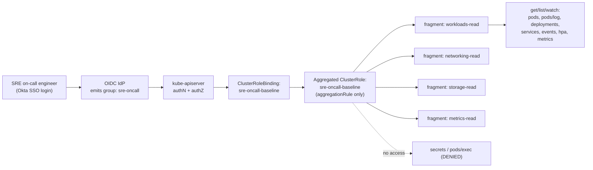
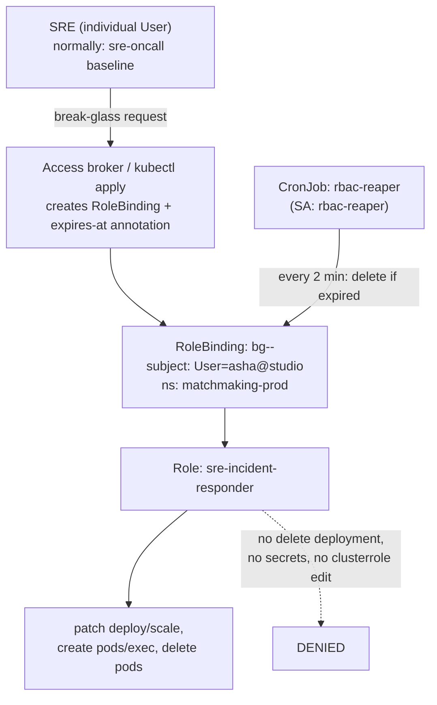
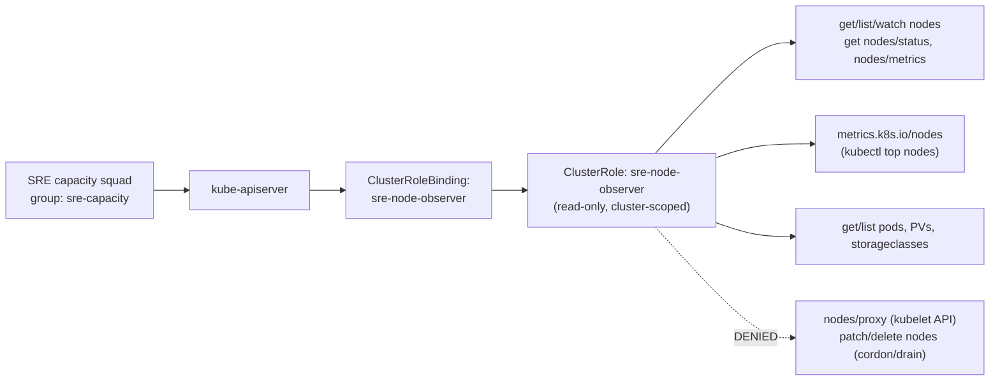
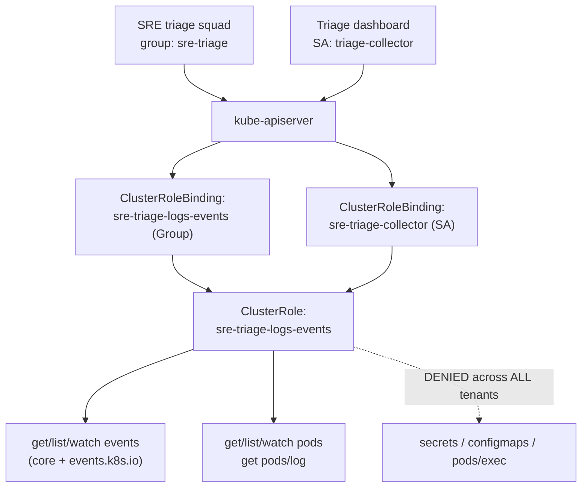
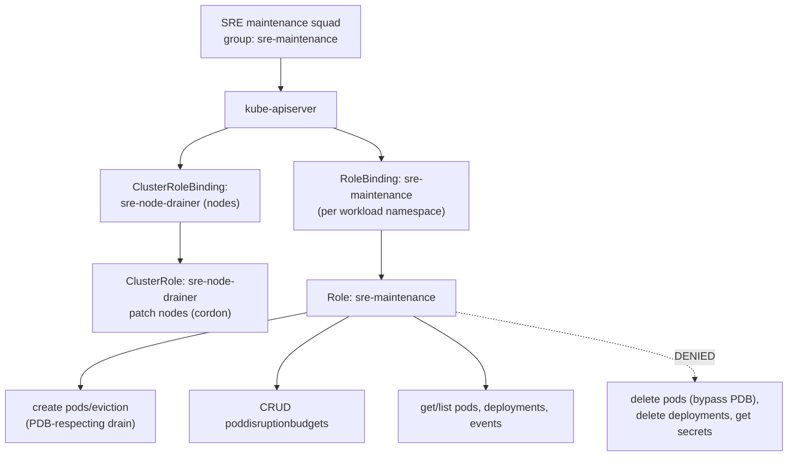

# SRE Team

Production-grade RBAC for Site Reliability Engineers — where a read-only default posture, break-glass elevation, node and capacity visibility, cross-tenant triage, and disruption-budget-aware maintenance each demand a precisely different permission surface.

## Scenario 16 — SRE Read-Only Production Baseline for On-Call (FinTech)

**Company / Industry:** Banking / FinTech (regulated payments platform)

### Business Requirement
A digital bank runs payments, ledger, KYC, and card-issuing microservices across dozens of production namespaces on a single regional EKS cluster. The SRE on-call rotation must be able to triage any alert for any service the instant it pages — a payments latency spike at 03:00 cannot wait for a per-namespace access request. The team therefore needs one consistent, cluster-wide, read-only posture that is the *default* identity every SRE carries, with all mutating power deliberately pushed into a separate, audited elevation path (Scenario 17). RBI and PCI-DSS auditors require that this default identity provably cannot read cardholder Secrets or shell into a container.

### Existing Problem
On-call access grew organically: some SREs had `view` bound in a handful of namespaces, a few carried a legacy `cluster-admin` kubeconfig "for emergencies," and new joiners frequently hit `Forbidden` mid-incident and lost minutes filing JIT tickets while a P1 burned. Worse, the `view` ClusterRole they leaned on grants `get`/`list` on `secrets` in several older cluster builds, so the on-call baseline was effectively exposing the card-processor HSM credentials to the entire rotation — a finding the last PCI audit flagged as critical.

### Proposed RBAC Solution
Use an **aggregated ClusterRole** (`sre-oncall-baseline`) bound with a single **ClusterRoleBinding** to the SSO **Group** `sre-oncall`. Cluster-wide scope (ClusterRoleBinding, not per-namespace RoleBindings) is correct here because on-call responsibility is genuinely cluster-wide — anything can page — and maintaining a RoleBinding per namespace would drift the moment a new namespace ships. A Group subject means on-boarding/off-boarding is an Okta action, never a `kubectl` edit. The role is *aggregated* so the read surface is assembled from small, independently reviewable fragment ClusterRoles (workloads-read, networking-read, storage-read, metrics-read); crucially, **no fragment includes `secrets`, `pods/exec`, `pods/portforward`, or any write verb**, so the union is provably safe by construction.

### Kubernetes Resources
- Pods, Pods logs (`pods`, `pods/log`), Services, Endpoints, ConfigMaps, PersistentVolumeClaims, Namespaces, Events (core)
- Deployments, ReplicaSets, StatefulSets, DaemonSets (`apps`)
- Ingresses, NetworkPolicies (`networking.k8s.io`)
- HorizontalPodAutoscalers (`autoscaling`), EndpointSlices (`discovery.k8s.io`)
- PodMetrics (`metrics.k8s.io`), Events (`events.k8s.io`)

### Required Permissions
- `pods`, `pods/log` → `get`, `list`, `watch` — pod health and log triage; `pods/log` is a distinct subresource.
- `deployments`, `replicasets`, `statefulsets`, `daemonsets` → `get`, `list`, `watch` — desired vs. ready replicas.
- `services`, `endpoints`, `endpointslices`, `ingresses`, `networkpolicies` → `get`, `list`, `watch` — routing and connectivity.
- `configmaps`, `persistentvolumeclaims`, `horizontalpodautoscalers`, `namespaces`, `events` → `get`, `list`, `watch`.
- `metrics.k8s.io/pods` → `get`, `list` — live CPU/memory for triage.
- Explicitly **no** `secrets` (any verb), **no** `pods/exec`, **no** `pods/portforward`, **no** write verbs anywhere.

### Architecture Diagram


### YAML Implementation
```yaml
# Aggregate role: carries ONLY an aggregationRule. The controller-manager
# unions the rules of every ClusterRole matching the selector into it.
apiVersion: rbac.authorization.k8s.io/v1
kind: ClusterRole
metadata:
  name: sre-oncall-baseline
  labels:
    app.kubernetes.io/part-of: sre-rbac
    sre.role: oncall-baseline
aggregationRule:
  clusterRoleSelectors:
    - matchLabels:
        rbac.sre/aggregate-to-oncall: "true"
rules: []   # intentionally empty; populated by the aggregation controller
---
apiVersion: rbac.authorization.k8s.io/v1
kind: ClusterRole
metadata:
  name: sre-oncall-workloads-read
  labels:
    rbac.sre/aggregate-to-oncall: "true"
rules:
  - apiGroups: [""]
    resources: ["pods", "pods/log", "events", "namespaces"]
    verbs: ["get", "list", "watch"]
  - apiGroups: ["apps"]
    resources: ["deployments", "replicasets", "statefulsets", "daemonsets"]
    verbs: ["get", "list", "watch"]
  - apiGroups: ["autoscaling"]
    resources: ["horizontalpodautoscalers"]
    verbs: ["get", "list", "watch"]
  - apiGroups: ["events.k8s.io"]
    resources: ["events"]
    verbs: ["get", "list", "watch"]
---
apiVersion: rbac.authorization.k8s.io/v1
kind: ClusterRole
metadata:
  name: sre-oncall-networking-read
  labels:
    rbac.sre/aggregate-to-oncall: "true"
rules:
  - apiGroups: [""]
    resources: ["services", "endpoints"]
    verbs: ["get", "list", "watch"]
  - apiGroups: ["discovery.k8s.io"]
    resources: ["endpointslices"]
    verbs: ["get", "list", "watch"]
  - apiGroups: ["networking.k8s.io"]
    resources: ["ingresses", "networkpolicies"]
    verbs: ["get", "list", "watch"]
---
apiVersion: rbac.authorization.k8s.io/v1
kind: ClusterRole
metadata:
  name: sre-oncall-storage-read
  labels:
    rbac.sre/aggregate-to-oncall: "true"
rules:
  - apiGroups: [""]
    resources: ["configmaps", "persistentvolumeclaims"]
    verbs: ["get", "list", "watch"]
---
apiVersion: rbac.authorization.k8s.io/v1
kind: ClusterRole
metadata:
  name: sre-oncall-metrics-read
  labels:
    rbac.sre/aggregate-to-oncall: "true"
rules:
  - apiGroups: ["metrics.k8s.io"]
    resources: ["pods"]
    verbs: ["get", "list"]
---
apiVersion: rbac.authorization.k8s.io/v1
kind: ClusterRoleBinding
metadata:
  name: sre-oncall-baseline
  labels:
    app.kubernetes.io/part-of: sre-rbac
subjects:
  - kind: Group
    name: sre-oncall
    apiGroup: rbac.authorization.k8s.io
roleRef:
  kind: ClusterRole
  name: sre-oncall-baseline
  apiGroup: rbac.authorization.k8s.io
```

### Commands
```bash
# Apply the aggregate role, all fragments, and the binding in one shot
kubectl apply -f sre-oncall-baseline.yaml

# The controller-manager populates rules[] on the aggregate — confirm it filled in
kubectl get clusterrole sre-oncall-baseline -o yaml | grep -A3 "rules:"

# Prove no fragment leaked a secrets rule into the union
kubectl get clusterrole sre-oncall-baseline -o json | jq '.rules[] | select(.resources[]=="secrets")'
# (should print nothing)
```

### Verification
```bash
# ALLOW: broad read across any production namespace
kubectl auth can-i list pods            --as-group=sre-oncall -n payments-prod
kubectl auth can-i get  pods/log        --as-group=sre-oncall -n ledger-prod
kubectl auth can-i list deployments     --as-group=sre-oncall -n kyc-prod
kubectl auth can-i get  pods.metrics.k8s.io --as-group=sre-oncall -n payments-prod

# DENY: no secrets, no exec, no writes anywhere
kubectl auth can-i get    secrets       --as-group=sre-oncall -n payments-prod
kubectl auth can-i create pods/exec     --as-group=sre-oncall -n payments-prod
kubectl auth can-i delete pods          --as-group=sre-oncall -n ledger-prod
kubectl auth can-i patch  deployments   --as-group=sre-oncall -n kyc-prod

# Full effective matrix for the group (attach as audit evidence)
kubectl auth can-i --list --as-group=sre-oncall -n payments-prod
```

### Expected Output
```text
# ALLOW
$ kubectl auth can-i list pods --as-group=sre-oncall -n payments-prod
yes
$ kubectl auth can-i get pods/log --as-group=sre-oncall -n ledger-prod
yes

# DENY
$ kubectl auth can-i get secrets --as-group=sre-oncall -n payments-prod
no
$ kubectl auth can-i create pods/exec --as-group=sre-oncall -n payments-prod
no

# Attempting to read cardholder secrets as on-call baseline
$ kubectl --as=asha@neobank.example --as-group=sre-oncall -n payments-prod get secret card-hsm-creds
Error from server (Forbidden): secrets "card-hsm-creds" is forbidden: User "asha@neobank.example" cannot get resource "secrets" in API group "" in the namespace "payments-prod"
```

### Common Mistakes
- Binding the built-in `view` cluster-wide as the "on-call role" — `view` may grant `secrets` read in some builds and is not version-pinned to your audit evidence.
- Authoring `rules:` on the aggregate ClusterRole; the aggregation controller overwrites them — rules must live in the labelled fragments only.
- Forgetting `pods/log` as a separate subresource, leaving on-call unable to read logs despite `get pods`.
- Granting `configmaps` read without noticing teams have stuffed tokens into ConfigMaps — audit ConfigMap contents separately.
- Using per-namespace RoleBindings for a genuinely cluster-wide role, then drifting when a new namespace is created.

### Troubleshooting
- Permission "keeps disappearing" from the aggregate? The controller-manager reconciles `rules` from fragments; check each fragment carries the exact `rbac.sre/aggregate-to-oncall: "true"` label.
- `kubectl auth can-i --list --as-group=sre-oncall -n <ns>` prints the exact effective verbs — the fastest way to spot a missing resource.
- If metrics reads fail, confirm the metrics-server is installed and the rule uses `apiGroups: ["metrics.k8s.io"]` with resource `pods` (not `podmetrics`).
- If a real user is denied despite the group binding, confirm the OIDC token actually carries `sre-oncall` (`--oidc-groups-claim` mapping) — impersonation via `--as-group` bypasses this and can mask the real issue.

### Best Practice
Mature FinTechs treat the on-call baseline as the *floor* of a two-tier model: everyone in the rotation always holds read-only, and mutation is a separate, time-boxed grant. The role is managed in GitOps (Argo CD), assembled from aggregated fragments so security can review the risky-surface fragments independently, and gated by a CI policy (OPA Gatekeeper / Conftest) that fails the pipeline if `secrets`, `exec`, or any write verb ever appears in an `aggregate-to-oncall` fragment. Group membership syncs from the identity provider; no human is ever named in a binding.

### Security Notes
Least privilege is enforced by verb (read-only) and by resource (no `secrets`, no exec/portforward). Because the subject is a group synced from SSO, a departed SRE loses all cluster access the instant Okta deprovisions them — no orphaned binding. Blast radius of a stolen on-call token is bounded to *observation*: an attacker can see workload state but cannot read cardholder Secrets, exec into a PCI pod, or mutate anything. Keeping mutation out of the default identity means the credential most SREs use most of the time is the least dangerous one to lose.

### Interview Questions
1. Why make the on-call baseline cluster-wide (ClusterRoleBinding) here, when Scenario 15-style read roles are namespace-scoped?
2. What does an `aggregationRule` buy you over one hand-written read-only ClusterRole, and what is the classic bug with it?
3. How do you *prove* to a PCI auditor that on-call can never read Secrets?
4. `kubectl top pods` fails for the on-call group. Walk through the RBAC (and non-RBAC) causes.
5. Why split read (baseline) from write (elevation) into two identities instead of one role with a few write verbs?

### Interview Answers
1. On-call responsibility is genuinely cluster-wide — any namespace can page — so the permission set is identical everywhere and a ClusterRoleBinding expresses that once. Per-namespace RoleBindings would immediately drift as new services ship, and a mid-incident `Forbidden` in a brand-new namespace is exactly the failure mode we are eliminating. The trade-off (visibility into every namespace) is acceptable *only because* the role is strictly read-only and secret-free.
2. Aggregation lets you compose the read surface from small, independently owned/reviewed fragment ClusterRoles; security can scrutinise the higher-risk fragments in isolation and extend the union additively without editing a monolith. The classic bug: authoring `rules:` on the aggregate itself — the kube-controller-manager owns and periodically overwrites that field, so your rules vanish. Rules must live only in the labelled fragments.
3. No fragment contains a `secrets` rule and none uses `resources: ["*"]`, so the union provably excludes Secrets. Prove it live with `kubectl auth can-i get secrets --as-group=sre-oncall -n payments-prod` returning `no`, and attach a dump of `kubectl auth can-i --list --as-group=sre-oncall` plus a `jq` scan of the aggregate's `rules[]` for `secrets` (empty) as CI-generated audit artifacts.
4. `kubectl top` calls the `metrics.k8s.io` API. RBAC-wise the group needs `get`/`list` on `pods` in `apiGroups: ["metrics.k8s.io"]` — verify with `kubectl auth can-i list pods.metrics.k8s.io`. Non-RBAC causes: metrics-server not installed or not `Ready`, the APIService `v1beta1.metrics.k8s.io` unavailable, or metrics-server itself lacking permission to scrape kubelets. So diagnose RBAC first, then the metrics pipeline.
5. Splitting identities keeps the credential used 99% of the time (read) harmless if leaked, and forces every mutation through an audited, time-boxed, individually-attributable elevation path. A single role with "a few write verbs" means every on-call token is permanently a live-site risk, elevation is invisible in audit logs, and revoking it is all-or-nothing. Separation of the default posture from the privileged action is the core of least privilege for operators.

### Follow-up Questions
- How would you redact PII from log lines before an SRE reads them, given `pods/log` returns raw container output?
- If a single "god" cluster is replaced by many clusters, how does the baseline role and its GitOps delivery change?
- How do you alert when someone adds `secrets` or a write verb to any `aggregate-to-oncall` fragment?
- Would you let the baseline read `configmaps`, knowing teams sometimes store tokens there — and how would you enforce that they don't?

### Production Tips
Amazon EKS shops map IAM Identity Center groups to Kubernetes groups and deliver the aggregated baseline via GitOps, asserting `kubectl auth can-i` results in CodePipeline. Google GKE customers wire `gke-security-groups` so `sre-oncall@company.com` is a first-class RBAC Group subject. Netflix and Uber run a strictly read-only default for operators with all mutation behind time-boxed elevation. Razorpay and PhonePe, under RBI scrutiny, gate every `aggregate-to-oncall` fragment with OPA Gatekeeper policies that reject any rule touching `secrets` or carrying a write verb, and keep the effective-permission dump as standing PCI evidence.

## Scenario 17 — SRE Time-Bound Incident-Response Elevation: Restart, Scale, Exec (Gaming)

**Company / Industry:** Online Gaming / Live Multiplayer Platform

### Business Requirement
A live-service game studio runs matchmaking, session, and game-state services that must not drop players mid-match. During a SEV-1 (matchmaking wedged, session pods OOM-looping) the on-call SRE — who normally holds only the read-only baseline from Scenario 16 — needs to *act*: `rollout restart` a stuck deployment, `scale` matchmaking to absorb a spike, and `exec` into a session pod to capture a heap dump. But this power must exist **only for the duration of the incident** and only in the affected namespace, then evaporate automatically. Post-incident review must show exactly who elevated, when, why, and when access expired.

### Existing Problem
The team's previous "break-glass" was a shared `cluster-admin` kubeconfig in a password manager. During a matchmaking incident an engineer used it, forgot it existed, and it stayed live for six weeks — until a leaked laptop backup exposed it and an attacker scaled crypto-miner pods across the cluster. There was no expiry, no per-incident attribution, and revocation meant rotating the cluster CA. The studio needs elevation that is self-expiring, individually attributed, and scoped to one namespace.

### Proposed RBAC Solution
Kubernetes RBAC has **no native TTL**, so time-boxing is built from two parts. (1) A pre-created, tightly-scoped **Role** (`sre-incident-responder`) in each production namespace granting exactly the incident verbs — never bound by default. (2) A break-glass **RoleBinding** created on demand naming the *individual* engineer (`kind: User`) and carrying an `access.sre/expires-at` annotation; a **reaper CronJob** (running as a dedicated **ServiceAccount**) deletes any break-glass binding whose expiry has passed. A namespaced Role (not ClusterRole) confines elevation to the paging namespace; a `User` subject (not Group) guarantees per-incident attribution; the annotation + reaper delivers the TTL RBAC lacks.

### Kubernetes Resources
- Deployments, StatefulSets and their `scale` subresource (`apps`)
- Pods, the `pods/exec` subresource, Events (core)
- RoleBindings (`rbac.authorization.k8s.io`) — managed by the reaper
- CronJob (`batch`), ServiceAccount, Role/RoleBinding for the reaper

### Required Permissions
- Incident responder — `deployments`, `statefulsets` → `get`, `list`, `watch`, `patch` — `rollout restart`/`undo` are PATCH operations.
- Incident responder — `deployments/scale`, `statefulsets/scale` → `get`, `patch` — `kubectl scale`.
- Incident responder — `pods` → `get`, `list`, `watch`, `delete` — force-recycle a wedged pod.
- Incident responder — `pods/exec` → `create` — attach a shell / capture a dump (the single most dangerous grant; time-boxed for exactly this reason).
- Incident responder — `events` → `get`, `list`, `watch`.
- Reaper SA — `rolebindings` → `get`, `list`, `watch`, `delete` — expire break-glass bindings. No `create` (it must not mint elevation, only revoke it).

### Architecture Diagram


### YAML Implementation
```yaml
apiVersion: v1
kind: Namespace
metadata:
  name: sre-automation
  labels:
    app.kubernetes.io/part-of: sre-rbac
---
# Pre-created, never-bound-by-default incident Role in the workload namespace.
apiVersion: rbac.authorization.k8s.io/v1
kind: Role
metadata:
  name: sre-incident-responder
  namespace: matchmaking-prod
  labels:
    app.kubernetes.io/part-of: sre-rbac
    sre.role: incident-responder
rules:
  # rollout restart / undo == PATCH on the controller
  - apiGroups: ["apps"]
    resources: ["deployments", "statefulsets"]
    verbs: ["get", "list", "watch", "patch"]
  # kubectl scale == patch on the scale subresource
  - apiGroups: ["apps"]
    resources: ["deployments/scale", "statefulsets/scale"]
    verbs: ["get", "patch"]
  # force-recycle a wedged pod
  - apiGroups: [""]
    resources: ["pods"]
    verbs: ["get", "list", "watch", "delete"]
  # attach a shell / capture heap dump — the high-risk, time-boxed verb
  - apiGroups: [""]
    resources: ["pods/exec"]
    verbs: ["create"]
  - apiGroups: [""]
    resources: ["events"]
    verbs: ["get", "list", "watch"]
---
# Example break-glass binding an access broker (or kubectl) creates on demand.
# The reaper deletes it once access.sre/expires-at is in the past.
apiVersion: rbac.authorization.k8s.io/v1
kind: RoleBinding
metadata:
  name: bg-asha-inc4821
  namespace: matchmaking-prod
  labels:
    access-type: break-glass
    sre.role: incident-responder
  annotations:
    access.sre/expires-at: "2026-07-15T04:30:00Z"
    access.sre/incident: "INC-4821"
    access.sre/requested-by: "asha@studio.example"
    access.sre/reason: "matchmaking pods OOM-looping, need exec + restart"
subjects:
  - kind: User
    name: asha@studio.example
    apiGroup: rbac.authorization.k8s.io
roleRef:
  kind: Role
  name: sre-incident-responder
  apiGroup: rbac.authorization.k8s.io
---
apiVersion: v1
kind: ServiceAccount
metadata:
  name: rbac-reaper
  namespace: sre-automation
---
# Reaper may only READ and DELETE bindings cluster-wide — never CREATE them.
apiVersion: rbac.authorization.k8s.io/v1
kind: ClusterRole
metadata:
  name: rbac-reaper
rules:
  - apiGroups: ["rbac.authorization.k8s.io"]
    resources: ["rolebindings"]
    verbs: ["get", "list", "watch", "delete"]
---
apiVersion: rbac.authorization.k8s.io/v1
kind: ClusterRoleBinding
metadata:
  name: rbac-reaper
subjects:
  - kind: ServiceAccount
    name: rbac-reaper
    namespace: sre-automation
roleRef:
  kind: ClusterRole
  name: rbac-reaper
  apiGroup: rbac.authorization.k8s.io
---
apiVersion: batch/v1
kind: CronJob
metadata:
  name: rbac-reaper
  namespace: sre-automation
  labels:
    app.kubernetes.io/part-of: sre-rbac
spec:
  schedule: "*/2 * * * *"        # every 2 minutes
  concurrencyPolicy: Forbid
  successfulJobsHistoryLimit: 3
  failedJobsHistoryLimit: 3
  jobTemplate:
    spec:
      ttlSecondsAfterFinished: 300
      template:
        spec:
          serviceAccountName: rbac-reaper
          restartPolicy: Never
          securityContext:
            runAsNonRoot: true
            runAsUser: 65534
            seccompProfile:
              type: RuntimeDefault
          containers:
            - name: reaper
              image: bitnami/kubectl:1.33
              securityContext:
                allowPrivilegeEscalation: false
                readOnlyRootFilesystem: true
                capabilities:
                  drop: ["ALL"]
              command: ["/bin/bash", "-c"]
              args:
                - |
                  set -euo pipefail
                  now=$(date -u +%s)
                  # All break-glass bindings across all namespaces
                  kubectl get rolebindings -A -l access-type=break-glass \
                    -o jsonpath='{range .items[*]}{.metadata.namespace}{" "}{.metadata.name}{" "}{.metadata.annotations.access\.sre/expires-at}{"\n"}{end}' \
                  | while read -r ns name exp; do
                      [ -z "$exp" ] && continue
                      exp_s=$(date -u -d "$exp" +%s)
                      if [ "$now" -ge "$exp_s" ]; then
                        echo "expiring $ns/$name (expired at $exp)"
                        kubectl delete rolebinding "$name" -n "$ns"
                      fi
                    done
```

### Commands
```bash
# One-time platform setup: namespace, incident Role, reaper SA/role/cronjob
kubectl apply -f sre-incident-response.yaml

# During INC-4821: mint a 30-minute break-glass binding for the individual on-call
# (in practice an access broker templates this; shown here as raw kubectl)
kubectl apply -f bg-asha-inc4821.yaml

# The engineer now performs incident actions (as themselves)
kubectl -n matchmaking-prod rollout restart deployment/matchmaker
kubectl -n matchmaking-prod scale deployment/matchmaker --replicas=12
kubectl -n matchmaking-prod exec -it session-77b9c-abcde -- jstack 1 > /tmp/heap.txt

# Reaper auto-deletes the binding after expires-at; or revoke immediately:
kubectl -n matchmaking-prod delete rolebinding bg-asha-inc4821
```

### Verification
```bash
# WHILE the break-glass binding is live:
kubectl auth can-i patch  deployments        --as=asha@studio.example -n matchmaking-prod
kubectl auth can-i patch  deployments/scale  --as=asha@studio.example -n matchmaking-prod
kubectl auth can-i create pods/exec          --as=asha@studio.example -n matchmaking-prod

# DENY even while elevated: no deleting the workload, no secrets, no other namespace
kubectl auth can-i delete deployments        --as=asha@studio.example -n matchmaking-prod
kubectl auth can-i get    secrets            --as=asha@studio.example -n matchmaking-prod
kubectl auth can-i patch  deployments        --as=asha@studio.example -n payments-prod

# Reaper must NOT be able to mint elevation
kubectl auth can-i create rolebindings --as=system:serviceaccount:sre-automation:rbac-reaper -n matchmaking-prod

# AFTER expiry (reaper ran): elevation is gone
kubectl auth can-i patch deployments --as=asha@studio.example -n matchmaking-prod
```

### Expected Output
```text
# WHILE elevated
$ kubectl auth can-i patch deployments/scale --as=asha@studio.example -n matchmaking-prod
yes
$ kubectl auth can-i create pods/exec --as=asha@studio.example -n matchmaking-prod
yes

# DENY even while elevated
$ kubectl auth can-i delete deployments --as=asha@studio.example -n matchmaking-prod
no
$ kubectl auth can-i create rolebindings --as=system:serviceaccount:sre-automation:rbac-reaper -n matchmaking-prod
no

# AFTER the reaper deleted the expired binding
$ kubectl auth can-i patch deployments --as=asha@studio.example -n matchmaking-prod
no
$ kubectl --as=asha@studio.example -n matchmaking-prod rollout restart deployment/matchmaker
Error from server (Forbidden): deployments.apps "matchmaker" is forbidden: User "asha@studio.example" cannot patch resource "deployments" in API group "apps" in the namespace "matchmaking-prod"
```

### Common Mistakes
- Believing RBAC has a TTL — it does not; without a reaper (or an external broker with its own expiry) the binding lives forever.
- Binding to a Group instead of an individual User, destroying per-incident attribution in the audit log.
- Granting the reaper `create`/`patch` on rolebindings "for convenience" — that turns the janitor into a privilege-escalation engine.
- Adding `escalate`/`bind` to the incident Role so responders can "grant themselves more" — a direct path around least privilege.
- Leaving `pods/exec` in the *baseline* role rather than the time-boxed one, making shell-into-prod permanently available.
- Reaper container running as root or with a writable rootfs — a compromised janitor with cluster-wide `delete rolebindings` is a serious foothold.

### Troubleshooting
- Elevation not working during an incident? Confirm the break-glass RoleBinding exists in the *paging* namespace and names the exact user string the OIDC token carries (`kubectl -n <ns> describe rolebinding bg-...`).
- Access not expiring? Check the CronJob ran (`kubectl -n sre-automation get jobs`), inspect its logs, and validate the `access.sre/expires-at` timestamp is RFC3339 UTC (`date -d` must parse it).
- Responder can restart but not scale? `scale` is a separate subresource — verify `deployments/scale` is in the Role with `patch`.
- Reaper failing with `forbidden`? It only needs `list`/`delete` on `rolebindings`; if it also tries `create`, that's a bug, not a missing permission.
- Use `kubectl auth can-i --list --as=<user> -n <ns>` mid-incident to see exactly what the elevated identity can do right now.

### Best Practice
Mature live-service studios never hand out standing write access. Elevation is requested through an access broker (e.g. an internal Slack `/breakglass` command or a tool like Teleport / ConsoleMe) that verifies the requester is the current on-call, requires an incident ID and reason, mints the individually-named RoleBinding with a short expiry, and posts the grant to an audit channel. The reaper is defence-in-depth even when the broker sets its own expiry. Every elevation, every action taken while elevated (via API-server audit policy), and the expiry event are shipped to the SIEM and reviewed in the post-incident retro.

### Security Notes
Blast radius is bounded on three axes: scope (one namespace via a Role), time (reaper enforces expiry that RBAC lacks), and identity (a named User, fully attributable). The most dangerous verb, `create pods/exec`, exists only inside the time-boxed grant and never in the default posture. The reaper deliberately cannot `create` or `patch` bindings — it can only revoke — so compromising the janitor cannot manufacture elevation. Excluding `bind`/`escalate` from the incident Role blocks self-escalation. A leaked elevated token is dangerous for minutes, not weeks, and its every action is in the audit trail.

### Interview Questions
1. Kubernetes RBAC has no expiry field. How do you build genuinely time-bound access, and what are the moving parts?
2. Why is the incident Role bound to a `User` and not the `sre-oncall` Group?
3. Why is `create pods/exec` treated as more dangerous than `patch deployments`, and how does the design contain it?
4. Why must the reaper ServiceAccount have `delete` but never `create` on rolebindings?
5. `kubectl rollout restart` and `kubectl scale` — what API operations are these under the hood, and which exact RBAC resources/verbs do they require?

### Interview Answers
1. RBAC objects have no TTL, so time-boxing is layered on top: a pre-created, never-bound incident Role; an on-demand RoleBinding stamped with an `expires-at` annotation and an incident ID; and a controller (here a CronJob reaper, in production usually an access broker plus the reaper as backstop) that deletes bindings past their expiry. The broker enforces "who can request" (must be current on-call) and captures reason/incident; the reaper guarantees the grant cannot outlive its window even if the broker fails.
2. A `User` subject makes every elevation individually attributable — the post-incident review and SIEM show exactly which human held exec/scale and when. A Group subject would make the grant apply to the whole rotation and blur attribution, which defeats the purpose of a break-glass audit trail and would over-grant far beyond the one responder handling the incident.
3. `patch deployments` mutates declared state that GitOps can detect and reconcile, and it is bounded to the workload API. `create pods/exec` opens an interactive channel into a running container — arbitrary command execution, filesystem access, in-memory secret exposure, lateral movement — none of which GitOps sees. The design contains it by placing exec only in the time-boxed Role, scoping it to one namespace, attributing it to a named user, and expiring it within minutes.
4. The reaper's job is to *revoke* elevation, so it needs `delete` (and `list`/`watch` to find expired bindings). Granting it `create` or `patch` on rolebindings would let a compromised janitor mint new elevation or rewrite existing bindings to point at attacker-chosen subjects/roles — a full privilege-escalation primitive. Least privilege means the revoker can only revoke.
5. `kubectl rollout restart` issues a PATCH that stamps a `kubectl.kubernetes.io/restartedAt` annotation on the pod template, so it needs `patch` on `deployments`/`statefulsets` (`apps`). `kubectl scale` issues a PATCH (or PUT) to the `scale` subresource, needing `patch` on `deployments/scale`. They are distinct resources — granting `patch deployments` does not grant `patch deployments/scale`, which is why both rules are present.

### Follow-up Questions
- How would you capture, in the audit log, every command an SRE ran *while elevated*, and tie it back to the incident ID?
- If the reaper CronJob is down for an hour, what compensating control prevents a binding from overstaying?
- How would you extend this to auto-expire based on incident *resolution* (PagerDuty webhook) rather than a fixed clock?
- Would you allow `exec` at all, or force ephemeral debug containers (`kubectl debug`) instead — and what changes in RBAC?

### Production Tips
Uber and Netflix front break-glass with an access broker (ConsoleMe-style / internal equivalents) that mints short-lived, individually-named grants and streams every elevation to the SIEM. Amazon EKS teams pair short-lived IAM sessions with a reaper controller and API-server audit policy for the "who did what while elevated" trail. Zomato and Swiggy, running live consumer traffic, keep exec strictly time-boxed per incident and default the rotation to read-only. Google SRE culture codifies exactly this split — a benign default identity plus audited, expiring elevation — and treats any standing write access on operators as an audit finding.

## Scenario 18 — SRE Node and Node-Metrics Access for Capacity & Health (Telecom)

**Company / Industry:** Telecommunications / Mobile Core Network Operator

### Business Requirement
A telecom operator runs 5G core network functions (AMF, SMF, UPF) on bare-metal Kubernetes across multiple edge sites. The capacity-and-reliability SRE squad must continuously assess node health and headroom — allocatable vs. requested CPU/memory, node conditions (MemoryPressure, DiskPressure, PIDPressure), kubelet-reported resource usage, and taints — to decide when to add edge capacity or cordon a degrading node before it drops subscriber sessions. Nodes are cluster-scoped objects, so this visibility cannot be expressed with a namespaced Role. The squad must see node internals *without* the ability to cordon, drain, delete, or reach the kubelet's privileged proxy endpoints.

### Existing Problem
Capacity engineers had no node RBAC at all, so they relied on a Grafana dashboard that silently broke when the metrics pipeline changed, and they missed a slow memory leak on three UPF nodes at a busy site — the nodes hit `MemoryPressure`, the kubelet evicted UPF pods, and a metro area lost data sessions for eleven minutes. When engineers tried to inspect nodes directly they were handed a `cluster-admin` token as a stopgap, which also let them `delete node` and hit `nodes/proxy` (the kubelet API) — a far larger surface than "look at node health."

### Proposed RBAC Solution
Use a read-only **ClusterRole** (`sre-node-observer`) bound with a **ClusterRoleBinding** to the SSO **Group** `sre-capacity`. ClusterRole + ClusterRoleBinding is mandatory because `nodes` (and `persistentvolumes`, `storageclasses`) are cluster-scoped — there is no namespace to which a RoleBinding could confine node reads. The role grants `get`/`list`/`watch` on `nodes` and `get` on the `nodes/metrics` subresource (the kubelet resource-metrics endpoint the metrics-server also scrapes) plus `metrics.k8s.io/nodes` for `kubectl top nodes`. It deliberately **omits `nodes/proxy`** (arbitrary kubelet API access — a lateral-movement and RCE surface), and all node mutation (`patch`/`update`/`delete` — i.e. cordon/uncordon/delete). Pods are readable cluster-wide (`get`/`list`) with the field-selector `spec.nodeName` so engineers can map load to nodes.

### Kubernetes Resources
- Nodes and the `nodes/metrics`, `nodes/status` subresources (core)
- NodeMetrics via `metrics.k8s.io` (`kubectl top nodes`)
- Pods (`get`/`list`, to correlate pod requests to node allocatable) and Events
- PersistentVolumes, StorageClasses (cluster-scoped storage headroom)
- PriorityClasses (`scheduling.k8s.io`) — to reason about preemption during pressure

### Required Permissions
- `nodes` → `get`, `list`, `watch` — node objects: allocatable, capacity, conditions, taints, labels.
- `nodes/status` → `get` — the live status subresource (conditions/allocatable as reported).
- `nodes/metrics` → `get` — kubelet resource-metrics endpoint (read-only usage).
- `metrics.k8s.io/nodes` → `get`, `list` — `kubectl top nodes`.
- `pods` → `get`, `list`, `watch` — correlate scheduled requests to node headroom.
- `events`, `persistentvolumes`, `storageclasses`, `priorityclasses` → `get`, `list`, `watch`.
- Explicitly **no** `nodes/proxy` (kubelet API / RCE surface), **no** `patch`/`update`/`delete` on `nodes` (no cordon/drain/delete), **no** `secrets`.

### Architecture Diagram


### YAML Implementation
```yaml
apiVersion: rbac.authorization.k8s.io/v1
kind: ClusterRole
metadata:
  name: sre-node-observer
  labels:
    app.kubernetes.io/part-of: sre-rbac
    sre.role: node-observer
rules:
  # Node objects + read-only status/metrics subresources. NO nodes/proxy.
  - apiGroups: [""]
    resources: ["nodes", "nodes/status", "nodes/metrics"]
    verbs: ["get", "list", "watch"]
  # kubectl top nodes
  - apiGroups: ["metrics.k8s.io"]
    resources: ["nodes"]
    verbs: ["get", "list"]
  # Correlate pod resource requests to node allocatable headroom
  - apiGroups: [""]
    resources: ["pods", "events"]
    verbs: ["get", "list", "watch"]
  # Cluster-scoped storage headroom
  - apiGroups: [""]
    resources: ["persistentvolumes"]
    verbs: ["get", "list", "watch"]
  - apiGroups: ["storage.k8s.io"]
    resources: ["storageclasses"]
    verbs: ["get", "list", "watch"]
  # Preemption reasoning during resource pressure
  - apiGroups: ["scheduling.k8s.io"]
    resources: ["priorityclasses"]
    verbs: ["get", "list", "watch"]
---
apiVersion: rbac.authorization.k8s.io/v1
kind: ClusterRoleBinding
metadata:
  name: sre-node-observer
  labels:
    app.kubernetes.io/part-of: sre-rbac
subjects:
  - kind: Group
    name: sre-capacity
    apiGroup: rbac.authorization.k8s.io
roleRef:
  kind: ClusterRole
  name: sre-node-observer
  apiGroup: rbac.authorization.k8s.io
```

### Commands
```bash
# Apply the cluster-scoped observer role + binding
kubectl apply -f sre-node-observer.yaml

# Confirm the binding and that nodes/proxy is NOT present
kubectl get clusterrolebinding sre-node-observer -o wide
kubectl get clusterrole sre-node-observer -o json \
  | jq '.rules[] | select(.resources[]=="nodes/proxy")'   # must print nothing

# Typical capacity workflow the group performs
kubectl top nodes
kubectl describe node edge-site3-worker-04
kubectl get pods -A --field-selector spec.nodeName=edge-site3-worker-04 \
  -o custom-columns=NS:.metadata.namespace,POD:.metadata.name,CPU:.spec.containers[*].resources.requests.cpu
```

### Verification
```bash
# ALLOW: node health + metrics, cluster-wide
kubectl auth can-i list  nodes                --as-group=sre-capacity
kubectl auth can-i get   nodes/metrics        --as-group=sre-capacity
kubectl auth can-i list  nodes.metrics.k8s.io --as-group=sre-capacity
kubectl auth can-i list  persistentvolumes    --as-group=sre-capacity

# DENY: no cordon/drain/delete, no kubelet proxy, no secrets
kubectl auth can-i patch  nodes               --as-group=sre-capacity   # cordon/uncordon
kubectl auth can-i delete nodes               --as-group=sre-capacity
kubectl auth can-i get    nodes/proxy         --as-group=sre-capacity   # kubelet API
kubectl auth can-i create pods/eviction       --as-group=sre-capacity -n network-core

kubectl auth can-i --list --as-group=sre-capacity
```

### Expected Output
```text
# ALLOW
$ kubectl auth can-i list nodes --as-group=sre-capacity
yes
$ kubectl auth can-i get nodes/metrics --as-group=sre-capacity
yes
$ kubectl auth can-i list nodes.metrics.k8s.io --as-group=sre-capacity
yes

# DENY
$ kubectl auth can-i patch nodes --as-group=sre-capacity
no
$ kubectl auth can-i get nodes/proxy --as-group=sre-capacity
no

# Attempting to cordon a degrading node as a capacity observer
$ kubectl --as=ravi@telco.example --as-group=sre-capacity cordon edge-site3-worker-04
Error from server (Forbidden): nodes "edge-site3-worker-04" is forbidden: User "ravi@telco.example" cannot patch resource "nodes" in API group "" at the cluster scope
```

### Common Mistakes
- Reaching for `cluster-admin` because "nodes are cluster-scoped anyway" — read-only node access is easily expressed without any write or proxy verb.
- Confusing `nodes/metrics` (read-only resource metrics) with `nodes/proxy` (full kubelet API) — the latter is an RCE/lateral-movement surface and must not be granted for capacity work.
- Trying to scope node reads with a namespaced Role/RoleBinding — nodes have no namespace; only a ClusterRole via ClusterRoleBinding works.
- Forgetting the `metrics.k8s.io` rule and wondering why `kubectl top nodes` returns Forbidden while `get nodes` works.
- Granting `patch nodes` "just for cordon" and thereby also enabling arbitrary label/taint edits that reshape scheduling cluster-wide.

### Troubleshooting
- `kubectl top nodes` forbidden but `kubectl get nodes` fine? You granted core `nodes` but missed `apiGroups: ["metrics.k8s.io"]` resource `nodes`. Also confirm metrics-server is `Ready` and its APIService is available.
- `describe node` shows objects but usage columns are blank? That's the metrics pipeline (metrics-server scraping kubelets), not RBAC — verify with `kubectl get apiservices v1beta1.metrics.k8s.io`.
- Engineer can list nodes but not `nodes/status`? Add the `nodes/status` subresource; some tooling reads it directly.
- Confirm the effective surface with `kubectl auth can-i --list --as-group=sre-capacity` and grep it for `nodes/proxy` (must be absent).
- If reads work in one cluster/site but not another, remember ClusterRoleBindings are per-cluster — each edge cluster needs the binding applied.

### Best Practice
Mature telcos keep capacity/observability access strictly read-only and cluster-scoped, delivered by GitOps to every edge cluster so the surface is identical everywhere. Node *actions* (cordon, drain, taint) live in a separate maintenance role (Scenario 20) held by a different group. The observer role is validated in CI by a policy that fails if `nodes/proxy`, any node write verb, or `secrets` appears. Capacity signals are consumed via metrics-server / Prometheus for dashboards, and direct `kubectl top`/`describe node` is the fallback the RBAC guarantees still works during a pipeline outage — exactly the failure that caused the original incident.

### Security Notes
Excluding `nodes/proxy` is the single most important control: that subresource proxies to the kubelet API and can expose container logs, run commands, and read pod environment — an effective node-level RCE and lateral-movement path. Denying `patch`/`update`/`delete` on nodes prevents an observer from cordoning production edge nodes (a DoS on subscriber traffic) or editing taints/labels to reshape scheduling. The role holds no `secrets` and no namespaced write, so a stolen `sre-capacity` token yields visibility only. Cluster scope is unavoidable for node reads, so it is compensated by a zero-write, zero-proxy verb set.

### Interview Questions
1. Why can node access here only be a ClusterRole + ClusterRoleBinding, never a namespaced Role?
2. What is the difference between `nodes/metrics`, `nodes/status`, and `nodes/proxy`, and which are safe for a capacity role?
3. `kubectl get nodes` works but `kubectl top nodes` is Forbidden — diagnose it.
4. Why deliberately exclude `patch nodes` from a capacity role, given cordoning sounds like a reliability action?
5. How would you prove to a security reviewer that this role cannot reach the kubelet API?

### Interview Answers
1. `nodes` are cluster-scoped objects with no `metadata.namespace`. RBAC RoleBindings grant a role's rules only within their own namespace, and there is no namespace that "contains" a node, so a namespaced Role can never authorize `get nodes`. Only a ClusterRole (which can reference cluster-scoped resources) bound by a ClusterRoleBinding (cluster-wide) reaches them. The same is true of `persistentvolumes` and `storageclasses`.
2. `nodes/status` is the status subresource of the node object (conditions, allocatable) — a benign read. `nodes/metrics` is the kubelet's read-only resource-metrics endpoint (CPU/memory usage) that metrics-server scrapes — also safe read-only. `nodes/proxy` proxies arbitrary requests to the kubelet API, including `/exec`, `/run`, `/logs` — effectively node-level command execution. The first two are appropriate for capacity work; `nodes/proxy` must never be in an observer role.
3. `kubectl top` uses the `metrics.k8s.io` aggregated API, a different resource from core `nodes`. Grant `get`/`list` on `nodes` in `apiGroups: ["metrics.k8s.io"]` (verify: `kubectl auth can-i list nodes.metrics.k8s.io --as-group=sre-capacity`). If RBAC is correct but it still fails, the metrics-server may be down or its APIService `v1beta1.metrics.k8s.io` unavailable — check `kubectl get apiservices`.
4. `patch nodes` is not just "cordon" — it authorizes editing `spec.unschedulable`, taints, labels, and more. Cordoning an edge node drops it from scheduling and, combined with drain, evicts live 5G core pods and subscriber sessions — a self-inflicted outage. Node actions belong to an audited maintenance role held by a different group, keeping the capacity squad purely observational.
5. Show `kubectl auth can-i get nodes/proxy --as-group=sre-capacity` returning `no`, and dump the ClusterRole with `jq` to prove no rule lists `nodes/proxy` (or a wildcard `nodes/*` or `resources: ["*"]`). Add `kubectl auth can-i --list --as-group=sre-capacity` as an artifact and grep it — the absence of `nodes/proxy` and any node write verb is the evidence.

### Follow-up Questions
- How would you give the squad the ability to *cordon* (but not delete) a node during a maintenance window without permanently granting `patch nodes`?
- What are the risks of exposing `nodes/proxy` even read-only, and when is it ever legitimately needed?
- How does this role interact with the cluster-autoscaler's own permissions — could an observer accidentally influence scaling?
- On bare-metal multi-site clusters, how do you keep the ClusterRoleBinding consistent across every edge without manual `kubectl`?

### Production Tips
Cisco and VMware (Tanzu) telco stacks keep capacity/health roles read-only and cluster-scoped, with node lifecycle actions gated behind separate maintenance groups. Google GKE and Amazon EKS expose node usage through metrics-server + managed Prometheus; SRE reads flow through `metrics.k8s.io` RBAC exactly as above. Red Hat OpenShift ships a comparable read-only node observability posture and treats `nodes/proxy` as a highly privileged grant reserved for platform components. Large operators deliver the ClusterRole/Binding to every edge cluster via GitOps (Argo CD ApplicationSets) so the observability surface is byte-identical and auditable across sites.

## Scenario 19 — SRE Cluster-Wide Events and Pod Logs for Triage (SaaS)

**Company / Industry:** B2B SaaS / Multi-Tenant Platform

### Business Requirement
A multi-tenant SaaS platform isolates each customer in its own namespace (`tenant-<slug>`), with hundreds of tenant namespaces on shared clusters. When a platform-wide alert fires ("elevated 5xx across region"), the SRE triage squad and the internal triage dashboard need to fan out across *all* tenant namespaces at once — reading Events (scheduling failures, image pull errors, OOMKills, probe failures) and Pod logs — to localize the blast radius to specific tenants or a shared dependency. They must do this without per-tenant onboarding and without any ability to read tenant Secrets/ConfigMaps, mutate workloads, or exec into a tenant's pods (a hard multi-tenancy and data-isolation boundary in the DPA/SOC 2 contract).

### Existing Problem
Triage previously required an SRE to be added to each tenant namespace's RoleBinding on demand; during a regional incident an engineer had access to only 40 of 300 affected namespaces and spent 20 minutes requesting the rest while error rates climbed. A workaround binding of the built-in `view` ClusterRole cluster-wide was then applied — which also exposed every tenant's Secrets and ConfigMaps to the whole triage team, breaching the contractual promise that only tenant-scoped roles can read tenant data. Security demanded a role that is genuinely cluster-wide but provably limited to Events and Pod logs.

### Proposed RBAC Solution
Use a razor-thin read-only **ClusterRole** (`sre-triage-logs-events`) that grants **only** Events (core and `events.k8s.io`) and `pods` + `pods/log`, bound with a **ClusterRoleBinding** to the SSO **Group** `sre-triage`. A second **ClusterRoleBinding** grants the same ClusterRole to a dedicated **ServiceAccount** (`triage-collector`) used by the internal triage dashboard that tails logs and correlates events across tenants. ClusterRoleBinding is chosen because triage must reach every current *and future* tenant namespace with zero per-namespace toil. The role is deliberately minimal — no `secrets`, no `configmaps`, no `pods/exec`, no workload objects — so "cluster-wide" is safe precisely because the surface is two resources.

### Kubernetes Resources
- Events (`events` core group, and `events.events.k8s.io`)
- Pods (`pods`) and Pod logs (`pods/log`)

### Required Permissions
- `events` (core) → `get`, `list`, `watch` — legacy event stream still emitted by many components.
- `events` (`events.k8s.io`) → `get`, `list`, `watch` — the current Events API; both are needed for full coverage.
- `pods` → `get`, `list`, `watch` — enumerate pods to select which logs to read and observe restart counts.
- `pods/log` → `get` — read container logs (distinct subresource from `pods`).
- Explicitly **no** `secrets`, **no** `configmaps`, **no** `pods/exec`, **no** `pods/portforward`, **no** write verbs, **no** workload (`apps`) resources.

### Architecture Diagram


### YAML Implementation
```yaml
apiVersion: rbac.authorization.k8s.io/v1
kind: ClusterRole
metadata:
  name: sre-triage-logs-events
  labels:
    app.kubernetes.io/part-of: sre-rbac
    sre.role: triage
rules:
  # Legacy core Events (still emitted by kubelet, scheduler, etc.)
  - apiGroups: [""]
    resources: ["events"]
    verbs: ["get", "list", "watch"]
  # Current Events API
  - apiGroups: ["events.k8s.io"]
    resources: ["events"]
    verbs: ["get", "list", "watch"]
  # Pods + logs ONLY. No exec, no portforward, no secrets, no configmaps.
  - apiGroups: [""]
    resources: ["pods"]
    verbs: ["get", "list", "watch"]
  - apiGroups: [""]
    resources: ["pods/log"]
    verbs: ["get"]
---
apiVersion: v1
kind: Namespace
metadata:
  name: sre-observability
  labels:
    app.kubernetes.io/part-of: sre-rbac
---
apiVersion: v1
kind: ServiceAccount
metadata:
  name: triage-collector
  namespace: sre-observability
---
# Human triage squad (SSO group)
apiVersion: rbac.authorization.k8s.io/v1
kind: ClusterRoleBinding
metadata:
  name: sre-triage-logs-events
  labels:
    app.kubernetes.io/part-of: sre-rbac
subjects:
  - kind: Group
    name: sre-triage
    apiGroup: rbac.authorization.k8s.io
roleRef:
  kind: ClusterRole
  name: sre-triage-logs-events
  apiGroup: rbac.authorization.k8s.io
---
# Automated triage dashboard (ServiceAccount)
apiVersion: rbac.authorization.k8s.io/v1
kind: ClusterRoleBinding
metadata:
  name: sre-triage-collector
  labels:
    app.kubernetes.io/part-of: sre-rbac
subjects:
  - kind: ServiceAccount
    name: triage-collector
    namespace: sre-observability
roleRef:
  kind: ClusterRole
  name: sre-triage-logs-events
  apiGroup: rbac.authorization.k8s.io
```

### Commands
```bash
# Apply role, namespace, SA, and both bindings
kubectl apply -f sre-triage-logs-events.yaml

# Confirm the role surface is exactly events + pods/log (no secrets/exec)
kubectl get clusterrole sre-triage-logs-events -o json \
  | jq '[.rules[].resources[]] | unique'
# => ["events","pods","pods/log"]

# Mint a short-lived token for the dashboard SA (K8s 1.33 projected token)
kubectl -n sre-observability create token triage-collector --duration=1h

# Typical cross-tenant triage during a regional incident
kubectl get events -A --field-selector type=Warning --sort-by=.lastTimestamp | tail -50
kubectl get pods -A --field-selector status.phase!=Running -o wide
kubectl logs -n tenant-acme deploy/api --tail=200 --since=15m
```

### Verification
```bash
# ALLOW: events and logs in ANY tenant namespace (existing or future)
kubectl auth can-i list events    --as-group=sre-triage -n tenant-acme
kubectl auth can-i get  pods/log  --as-group=sre-triage -n tenant-globex
kubectl auth can-i list events    --as=system:serviceaccount:sre-observability:triage-collector -n tenant-initech

# DENY: the hard multi-tenancy boundary
kubectl auth can-i get    secrets      --as-group=sre-triage -n tenant-acme
kubectl auth can-i get    configmaps   --as-group=sre-triage -n tenant-acme
kubectl auth can-i create pods/exec    --as-group=sre-triage -n tenant-acme
kubectl auth can-i delete pods         --as-group=sre-triage -n tenant-acme
kubectl auth can-i list   deployments  --as-group=sre-triage -n tenant-acme

kubectl auth can-i --list --as-group=sre-triage -n tenant-acme
```

### Expected Output
```text
# ALLOW
$ kubectl auth can-i list events --as-group=sre-triage -n tenant-acme
yes
$ kubectl auth can-i get pods/log --as-group=sre-triage -n tenant-globex
yes
$ kubectl auth can-i list events --as=system:serviceaccount:sre-observability:triage-collector -n tenant-initech
yes

# DENY
$ kubectl auth can-i get secrets --as-group=sre-triage -n tenant-acme
no
$ kubectl auth can-i get configmaps --as-group=sre-triage -n tenant-acme
no
$ kubectl auth can-i create pods/exec --as-group=sre-triage -n tenant-acme
no

# Attempting to read a tenant secret during triage
$ kubectl --as=meera@saasco.example --as-group=sre-triage -n tenant-acme get secret db-credentials
Error from server (Forbidden): secrets "db-credentials" is forbidden: User "meera@saasco.example" cannot get resource "secrets" in API group "" in the namespace "tenant-acme"
```

### Common Mistakes
- Using the built-in `view` ClusterRole for triage — it also grants `configmaps` and (in some builds) `secrets`, breaching tenant data isolation.
- Granting `get pods` but forgetting `get pods/log`, so `kubectl logs` fails despite pod listing working.
- Covering only core `events` and missing `events.k8s.io` (or vice-versa), so some component events are invisible.
- Adding `pods/exec` "for deeper debugging" — that crosses the exec boundary into tenant runtimes and voids the isolation guarantee.
- Handing the dashboard a long-lived static token instead of a short-lived projected ServiceAccount token.

### Troubleshooting
- Logs Forbidden but pods listable? Add the `pods/log` subresource with `get`.
- Some events missing? You likely covered only one of the two event APIs — include both `""` and `events.k8s.io`.
- Dashboard SA denied? Confirm the ClusterRoleBinding subject `namespace`/`name` match the SA exactly and the token is fresh (`kubectl -n sre-observability create token triage-collector`).
- Verify the surface is truly minimal with `jq '[.rules[].resources[]]|unique'` on the ClusterRole — anything beyond `events/pods/pods/log` is scope creep.
- A tenant complains triage "sees too much" — prove the boundary with `kubectl auth can-i get secrets --as-group=sre-triage -n tenant-<slug>` returning `no`.

### Best Practice
Mature SaaS platforms keep the cross-tenant triage surface intentionally tiny — events and logs, nothing else — precisely because it is cluster-wide. Log *content* is piped through a redaction layer (e.g. a logging pipeline that scrubs PII/tokens) before dashboards render it, since `pods/log` returns raw output. The role is GitOps-managed and CI-gated to reject any addition of `secrets`, `configmaps`, or `exec`. The automated collector uses short-lived projected tokens (bound SA tokens, 1.33-native) rather than static Secrets, and its access is monitored for anomalous cross-tenant fan-out.

### Security Notes
The role is cluster-wide but its surface is two resources, so a leaked `sre-triage` token or a compromised collector token exposes only event metadata and log streams — never tenant Secrets, ConfigMaps, or a shell. Denying `pods/exec`/`pods/portforward` holds the multi-tenancy boundary that the customer DPA depends on. The residual risk is log *content* leakage (secrets accidentally logged by tenants), mitigated by the redaction pipeline and by short-lived tokens for the automated reader that limit the window of a stolen credential.

### Interview Questions
1. Why is a cluster-wide ClusterRoleBinding acceptable here but reckless with the built-in `view` role?
2. Why must the role include both `""` and `events.k8s.io` event resources?
3. What is the residual data-leak risk once you allow `pods/log` cluster-wide, and how do you mitigate it?
4. Why give the automated dashboard its own ServiceAccount and binding rather than reusing the `sre-triage` group?
5. How do bound/projected ServiceAccount tokens in v1.33 improve this design over classic SA Secrets?

### Interview Answers
1. Cluster-wide is acceptable because the *surface* is minimal — only events and pod logs — so breadth of namespaces does not translate into breadth of sensitive data. The built-in `view` role is reckless cluster-wide because it also reads `configmaps` (and historically `secrets`) in every namespace, turning a triage convenience into a tenant-data exposure. Safety here comes from the tiny verb/resource set, not from limiting namespaces.
2. Kubernetes has two overlapping Events APIs: the legacy core `events` (`apiGroups: [""]`) still emitted by many components, and the newer `events.k8s.io` API. Components populate one or the other, and tooling reads both, so covering only one leaves gaps — e.g. missing scheduler or kubelet events during triage. Both rules are required for complete event visibility.
3. `pods/log` returns raw container stdout/stderr, which can contain secrets, tokens, or PII that a tenant accidentally logged — so cluster-wide log read is an information-exposure risk even without `secrets` access. Mitigate by routing log content through a redaction/scrubbing pipeline before it reaches dashboards, restricting the human group to on-call membership, and giving the automated reader short-lived tokens plus anomaly monitoring on cross-tenant access patterns.
4. A distinct ServiceAccount gives the automated collector its own identity, its own short-lived token lifecycle, and independently revocable, separately auditable access — you can disable the dashboard without touching human on-call access and vice versa. Reusing the human group would blur audit attribution (was it a person or the bot?), and you could not rotate/revoke the machine credential independently.
5. In v1.33, `kubectl create token` (and projected volume tokens) issues audience-bound, time-limited tokens tied to the SA, which expire automatically and can be scoped to a specific audience. Classic SA Secrets are long-lived, non-expiring bearer tokens stored in etcd — a far larger exposure window if leaked. Bound tokens shrink the blast radius of a compromised collector credential to its short TTL.

### Follow-up Questions
- How would you prevent an SRE from tailing logs of a tenant they have no incident ticket for, while keeping cluster-wide reach for genuine incidents?
- If a tenant demands their logs never be visible to the vendor SRE at all, how would you carve out an exception from a cluster-wide binding?
- How do you detect and alert on anomalous cross-tenant log fan-out by the triage group or the collector SA?
- Would you split read of Events from read of Logs into two roles, and when would that matter?

### Production Tips
Freshworks and Zoho, both multi-tenant SaaS at scale, keep vendor-side triage confined to logs/events and pipe content through PII-scrubbing before it reaches engineers. Netflix and Uber centralize logs/events into observability planes with tightly-scoped read RBAC rather than broad cluster access. Amazon EKS and Google GKE customers pair a minimal cross-namespace read ClusterRole with short-lived IRSA / Workload Identity credentials for the collector, and gate the role in CI so `secrets`/`configmaps`/`exec` can never be added. Razorpay applies the same "narrow surface, wide scope" pattern for cross-service triage under its compliance regime.

## Scenario 20 — SRE PodDisruptionBudget & Pod Eviction Management (E-Commerce)

**Company / Industry:** E-Commerce / High-Traffic Online Marketplace

### Business Requirement
A marketplace running checkout, cart, search, and payments services must perform routine node maintenance — kernel patching, node pool upgrades, instance recycling — without breaching availability SLOs during business hours. The SRE maintenance squad needs to safely cordon and drain nodes, which means evicting pods through the SLO-respecting Eviction API, and it needs to author and tune PodDisruptionBudgets (PDBs) so critical services keep a minimum number of replicas available while a node is drained. They must NOT be able to bypass PDBs by deleting pods directly, delete the workloads themselves, or read application Secrets.

### Existing Problem
During a node pool upgrade, an engineer drained nodes with `kubectl delete pod` in a loop instead of the Eviction API. That bypassed the checkout service's PDB entirely, took all three checkout replicas down simultaneously on the same drained node group, and caused a 9-minute checkout outage during an evening sale. Separately, no one owned PDBs — several critical Deployments had none, so even correct drains risked full unavailability. The squad had been using an over-broad `edit` role that also let them delete Deployments and read Secrets, well beyond what maintenance requires.

### Proposed RBAC Solution
Combine a namespaced **Role** (`sre-maintenance`) for pod-eviction and full PDB lifecycle in each workload namespace, plus a small cluster-scoped **ClusterRole** (`sre-node-drainer`) for the cordon step (nodes are cluster-scoped). Both bind to the SSO **Group** `sre-maintenance` — the ClusterRole via a **ClusterRoleBinding** (cordon must work on any node), the Role via per-namespace **RoleBindings** (PDBs and eviction are namespaced and only apply where the squad owns workloads). The decisive verb choice: grant `create` on the `pods/eviction` subresource (the SLO-safe drain primitive that *honors* PDBs) and full CRUD on `poddisruptionbudgets`, while **withholding `delete` on `pods`** so draining cannot bypass a PDB, and withholding all workload `delete`.

### Kubernetes Resources
- PodDisruptionBudgets (`policy/v1`)
- Pods and the `pods/eviction` subresource (core)
- Nodes (cluster-scoped, cordon/uncordon via `patch`)
- Deployments/StatefulSets (read-only, to reason about replica counts) and Events

### Required Permissions
- `poddisruptionbudgets` (`policy`) → `get`, `list`, `watch`, `create`, `update`, `patch`, `delete` — full PDB lifecycle so the squad owns availability floors.
- `pods/eviction` (core subresource) → `create` — the Eviction API that respects PDBs during drain.
- `pods` → `get`, `list`, `watch` — enumerate pods to drain and observe termination. **No `delete`** (that would bypass PDBs).
- `nodes` → `get`, `list`, `watch`, `patch` — cordon/uncordon sets `spec.unschedulable`; cluster-scoped, hence the ClusterRole. **No `delete`.**
- `deployments`, `statefulsets` (`apps`) → `get`, `list`, `watch` — reason about desired replicas vs. PDB `minAvailable`.
- `events` → `get`, `list`, `watch` — observe eviction/`DisruptionTarget` events. No `secrets`.

### Architecture Diagram


### YAML Implementation
```yaml
# PDB protecting checkout: at least 2 of 3 replicas stay up during any drain.
apiVersion: policy/v1
kind: PodDisruptionBudget
metadata:
  name: checkout-pdb
  namespace: checkout-prod
  labels:
    app.kubernetes.io/part-of: marketplace
spec:
  minAvailable: 2
  selector:
    matchLabels:
      app: checkout
---
# Cluster-scoped cordon capability (nodes have no namespace).
apiVersion: rbac.authorization.k8s.io/v1
kind: ClusterRole
metadata:
  name: sre-node-drainer
  labels:
    app.kubernetes.io/part-of: sre-rbac
    sre.role: maintenance
rules:
  - apiGroups: [""]
    resources: ["nodes"]
    verbs: ["get", "list", "watch", "patch"]   # patch == cordon/uncordon. No delete.
---
apiVersion: rbac.authorization.k8s.io/v1
kind: ClusterRoleBinding
metadata:
  name: sre-node-drainer
  labels:
    app.kubernetes.io/part-of: sre-rbac
subjects:
  - kind: Group
    name: sre-maintenance
    apiGroup: rbac.authorization.k8s.io
roleRef:
  kind: ClusterRole
  name: sre-node-drainer
  apiGroup: rbac.authorization.k8s.io
---
# Namespaced maintenance role: eviction + PDB lifecycle. No pod delete.
apiVersion: rbac.authorization.k8s.io/v1
kind: Role
metadata:
  name: sre-maintenance
  namespace: checkout-prod
  labels:
    app.kubernetes.io/part-of: sre-rbac
    sre.role: maintenance
rules:
  # SLO-safe drain: eviction honors PodDisruptionBudgets.
  - apiGroups: [""]
    resources: ["pods/eviction"]
    verbs: ["create"]
  # Observe pods during drain. Deliberately NO delete (delete would bypass PDBs).
  - apiGroups: [""]
    resources: ["pods"]
    verbs: ["get", "list", "watch"]
  # Own the availability floor: full PDB lifecycle.
  - apiGroups: ["policy"]
    resources: ["poddisruptionbudgets"]
    verbs: ["get", "list", "watch", "create", "update", "patch", "delete"]
  # Reason about replica counts vs. PDB minAvailable (read-only).
  - apiGroups: ["apps"]
    resources: ["deployments", "statefulsets"]
    verbs: ["get", "list", "watch"]
  - apiGroups: [""]
    resources: ["events"]
    verbs: ["get", "list", "watch"]
  - apiGroups: ["events.k8s.io"]
    resources: ["events"]
    verbs: ["get", "list", "watch"]
---
apiVersion: rbac.authorization.k8s.io/v1
kind: RoleBinding
metadata:
  name: sre-maintenance
  namespace: checkout-prod
  labels:
    app.kubernetes.io/part-of: sre-rbac
subjects:
  - kind: Group
    name: sre-maintenance
    apiGroup: rbac.authorization.k8s.io
roleRef:
  kind: Role
  name: sre-maintenance
  apiGroup: rbac.authorization.k8s.io
---
# Same namespaced Role projected into the cart namespace.
apiVersion: rbac.authorization.k8s.io/v1
kind: RoleBinding
metadata:
  name: sre-maintenance
  namespace: cart-prod
  labels:
    app.kubernetes.io/part-of: sre-rbac
subjects:
  - kind: Group
    name: sre-maintenance
    apiGroup: rbac.authorization.k8s.io
roleRef:
  kind: Role
  name: sre-maintenance          # bound per-namespace; define the Role in cart-prod too
  apiGroup: rbac.authorization.k8s.io
```

### Commands
```bash
# Apply the PDB, cluster-scoped drainer, and namespaced maintenance role + bindings
kubectl apply -f sre-maintenance.yaml
# (define the Role in each additional workload namespace, e.g. cart-prod)
kubectl -n cart-prod apply -f role-sre-maintenance.yaml

# A safe maintenance workflow the squad runs:
kubectl cordon gke-shop-pool-a-3f2c           # patch node: spec.unschedulable=true
kubectl drain  gke-shop-pool-a-3f2c \
  --ignore-daemonsets --delete-emptydir-data  # uses the Eviction API -> honors PDBs
# ... patch/upgrade the node ...
kubectl uncordon gke-shop-pool-a-3f2c

# Tune an availability floor
kubectl -n checkout-prod patch pdb checkout-pdb --type=merge -p '{"spec":{"minAvailable":2}}'
```

### Verification
```bash
# ALLOW: eviction, PDB lifecycle, cordon
kubectl auth can-i create pods/eviction        --as-group=sre-maintenance -n checkout-prod
kubectl auth can-i create poddisruptionbudgets --as-group=sre-maintenance -n checkout-prod
kubectl auth can-i delete poddisruptionbudgets --as-group=sre-maintenance -n checkout-prod
kubectl auth can-i patch  nodes                --as-group=sre-maintenance   # cordon

# DENY: no PDB-bypassing pod delete, no workload delete, no secrets
kubectl auth can-i delete pods         --as-group=sre-maintenance -n checkout-prod
kubectl auth can-i delete deployments  --as-group=sre-maintenance -n checkout-prod
kubectl auth can-i delete nodes        --as-group=sre-maintenance
kubectl auth can-i get    secrets      --as-group=sre-maintenance -n checkout-prod

kubectl auth can-i --list --as-group=sre-maintenance -n checkout-prod
```

### Expected Output
```text
# ALLOW
$ kubectl auth can-i create pods/eviction --as-group=sre-maintenance -n checkout-prod
yes
$ kubectl auth can-i delete poddisruptionbudgets --as-group=sre-maintenance -n checkout-prod
yes
$ kubectl auth can-i patch nodes --as-group=sre-maintenance
yes

# DENY
$ kubectl auth can-i delete pods --as-group=sre-maintenance -n checkout-prod
no
$ kubectl auth can-i delete deployments --as-group=sre-maintenance -n checkout-prod
no

# Attempting to bypass the PDB with a raw pod delete
$ kubectl --as=devi@shopco.example --as-group=sre-maintenance -n checkout-prod delete pod checkout-6b8f9-x2k1
Error from server (Forbidden): pods "checkout-6b8f9-x2k1" is forbidden: User "devi@shopco.example" cannot delete resource "pods" in API group "" in the namespace "checkout-prod"

# Eviction that WOULD violate the PDB is refused by the Eviction API (not RBAC):
$ kubectl -n checkout-prod delete pod checkout-6b8f9-x2k1 --grace-period=30  # via eviction
Cannot evict pod as it would violate the pod's disruption budget.
```

### Common Mistakes
- Draining with `kubectl delete pod` (needs `delete pods`) instead of the Eviction API — bypasses PDBs and can take a service fully down.
- Granting `delete pods` to the maintenance role "so drain works" — drain does NOT need it when using eviction; adding it reintroduces the PDB-bypass hazard.
- Putting the cordon (`patch nodes`) rule in a namespaced Role — nodes are cluster-scoped, so it silently never applies; it must be a ClusterRole.
- Setting a PDB with `minAvailable` equal to the replica count (e.g. `minAvailable: 3` on 3 replicas) — the drain can never make progress and the node never empties.
- Forgetting to define the namespaced Role in every workload namespace before adding its RoleBinding — the binding then references a non-existent Role.

### Troubleshooting
- Drain hangs forever? The PDB is too strict (`minAvailable` == replicas) or the workload has fewer healthy replicas than the floor — inspect `kubectl get pdb -n <ns>` (`ALLOWED DISRUPTIONS` column) and the drain output for `Cannot evict`.
- `create pods/eviction` forbidden? Confirm the rule uses `apiGroups: [""]` with resource `pods/eviction` (it is a core subresource, not under `policy` for RBAC purposes).
- Cordon forbidden but PDB edits work? The node rule is missing/misplaced — it must live in the ClusterRole bound cluster-wide, not the namespaced Role.
- PDB edits forbidden? Check the `apiGroups: ["policy"]` resource `poddisruptionbudgets` rule and that `policy/v1` is the served version in v1.33.
- Use `kubectl auth can-i --list --as-group=sre-maintenance -n <ns>` and confirm `pods` shows only read verbs (no `delete`).

### Best Practice
Mature marketplaces make PDBs a first-class, code-reviewed asset owned jointly by service teams and the maintenance squad, with a policy (OPA Gatekeeper / Kyverno) that *requires* every production Deployment above N replicas to ship a PDB and that rejects `minAvailable` set equal to `replicas`. Node maintenance is automated (managed node-pool surge upgrades, Cluster API, or a drain controller) and always routes through the Eviction API. The maintenance RBAC is delivered by GitOps per workload namespace, and CI asserts the role never gains `delete pods` or `delete deployments`.

### Security Notes
Withholding `delete pods` is the load-bearing control: it forces every disruption through the Eviction API, which enforces PodDisruptionBudgets and thus the availability SLO — RBAC here protects reliability, not just confidentiality. Denying `delete nodes` and workload `delete` bounds the blast radius of a compromised maintenance token to *reschedulable* disruption, never permanent workload or node destruction. No `secrets` access keeps the squad's confidentiality footprint at zero. The one broad grant, cluster-wide `patch nodes` for cordon, is justified because nodes are cluster-scoped and is compensated by the absence of `delete`.

### Interview Questions
1. Why does `kubectl drain` not require `delete pods` when configured to use the Eviction API, and why is that the safer grant?
2. What breaks if you set a PDB's `minAvailable` equal to the Deployment's replica count during a drain?
3. Why is the cordon permission a ClusterRole while PDB/eviction is a namespaced Role?
4. Under RBAC, which apiGroup and resource authorize a pod eviction, and how does that differ from the Eviction object's own apiVersion?
5. How does withholding `delete pods` from an SRE actually protect an availability SLO?

### Interview Answers
1. `kubectl drain` evicts pods by POSTing Eviction objects to the `pods/eviction` subresource, which requires `create` on `pods/eviction` — not `delete` on `pods`. The Eviction API checks the pod's PodDisruptionBudget and refuses if the eviction would drop the workload below its `minAvailable`, so it is inherently SLO-safe. `delete pods` bypasses that check entirely, letting a drain take a service fully down — so granting eviction and withholding delete is strictly safer.
2. If `minAvailable` equals the replica count, the PDB permits zero voluntary disruptions (`ALLOWED DISRUPTIONS: 0`). Every eviction attempt returns "Cannot evict pod as it would violate the pod's disruption budget," so the drain never makes progress and the node can never be emptied. The correct pattern is `minAvailable: N-1` (or a percentage) so one pod at a time can move while the floor holds.
3. Nodes are cluster-scoped objects with no namespace, so `patch nodes` (cordon/uncordon) can only be granted via a ClusterRole bound with a ClusterRoleBinding — a namespaced Role rule for nodes silently never matches. PDBs and the `pods/eviction` subresource are namespaced and only relevant where the squad owns workloads, so they belong in a namespaced Role bound per-namespace, keeping other teams' namespaces out of scope.
4. For RBAC authorization, eviction is a subresource of pods in the core group: `apiGroups: [""]`, `resources: ["pods/eviction"]`, verb `create`. This is distinct from the Eviction *object* the client sends, which is `policy/v1 Eviction`. A common mistake is writing the RBAC rule under `apiGroups: ["policy"]` for `pods/eviction` — the check is against the core `pods/eviction` subresource, so the rule must use `""`.
5. The availability SLO is protected because the only disruption primitive the SRE can invoke — `create pods/eviction` — is gated by the PodDisruptionBudget admission logic. By removing `delete pods`, there is no path that skips the PDB check, so no maintenance action (accidental or malicious) can take a service below its minimum-available replicas. RBAC thus enforces a reliability invariant, not merely who-can-read-what.

### Follow-up Questions
- How would you let the squad handle a stuck pod that refuses eviction (e.g. a misbehaving finalizer) without granting standing `delete pods`?
- How do you enforce, cluster-wide, that every critical Deployment has a sane PDB before allowing any drain?
- What is the interaction between PDBs, `terminationGracePeriodSeconds`, and the cluster-autoscaler during a scale-down?
- Would you automate drains with a controller instead of human `kubectl drain`, and how would the RBAC subject change (Group vs. ServiceAccount)?

### Production Tips
Flipkart, Swiggy, and Zomato — all high-traffic marketplaces — mandate PDBs on customer-facing services and route every node upgrade through the Eviction API via managed surge upgrades. Amazon EKS managed node groups and Google GKE surge/auto-upgrades drain nodes using eviction that honors PDBs by default; SRE cordon/drain RBAC mirrors the role above. Kyverno/OPA Gatekeeper policies at Razorpay and PhonePe require a PDB on every production workload and reject `minAvailable == replicas`. Netflix and Uber run drain controllers (ServiceAccount subjects) that hold exactly this eviction+PDB surface, keeping humans out of the routine maintenance path entirely.
