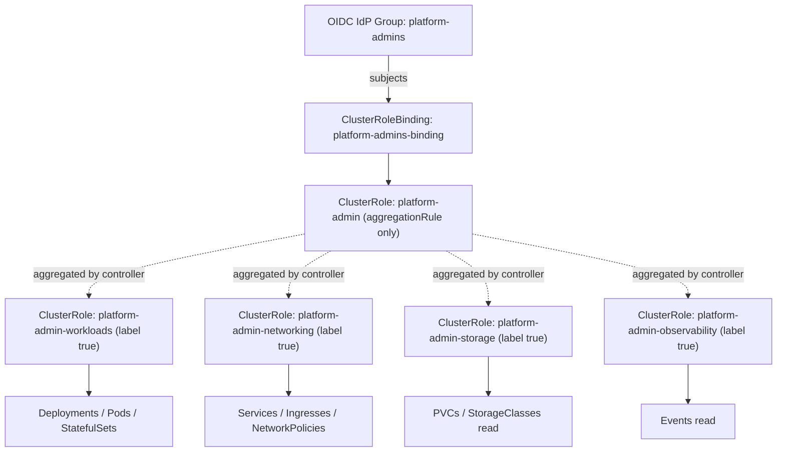
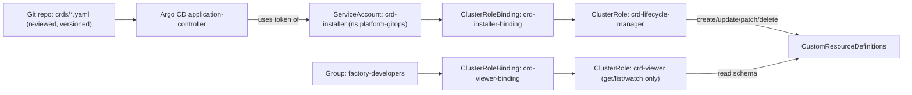
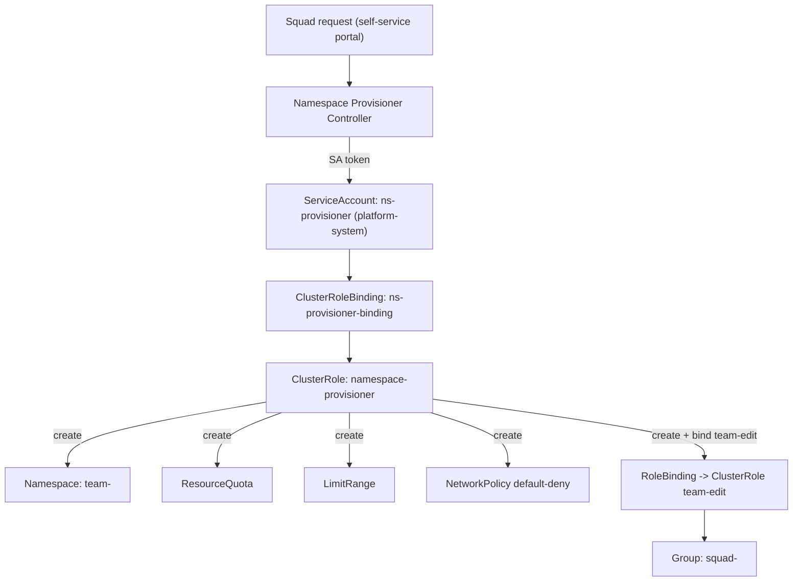
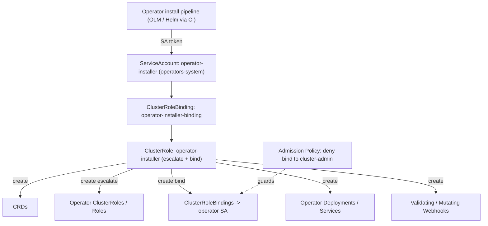
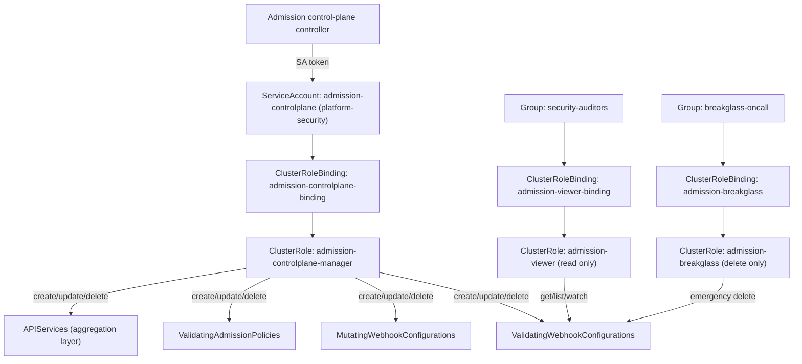

# Platform Team

Real-time enterprise RBAC scenarios for the platform engineering function that owns cluster-wide primitives — aggregated admin roles, CRD lifecycle, namespace-as-a-service, operator installation, and the admission/aggregation control plane — on Kubernetes v1.33+.

## Scenario 21 — Composable Platform-Admin Delegation via Aggregated ClusterRole

**Company / Industry:** SaaS (multi-tenant developer platform provider)

### Business Requirement
The platform team at a B2B SaaS company ships an internal developer platform (IDP) to ~40 stream-aligned squads. Each squad's "platform champion" needs elevated cluster access, but the exact bundle of permissions keeps growing as the platform adds capabilities (service mesh, cert-manager, external-dns). The team wants a single `platform-admin` role whose contents expand automatically as new capability modules are onboarded, without editing one giant, brittle ClusterRole or re-binding every champion each time.

### Existing Problem
Today there is one hand-maintained 800-line `platform-admin` ClusterRole. Every capability addition triggers a risky merge into that file; two incidents were caused by a bad YAML edit that silently dropped `secrets` read access for the whole platform team. Reviewers cannot reason about the monolith, and there is no way to let the networking sub-team own "their" rules independently of the storage sub-team.

### Proposed RBAC Solution
Use an **aggregated ClusterRole**. The top-level `platform-admin` ClusterRole carries an `aggregationRule` with label selectors and an empty `rules` array; the control-plane controller fills `rules` by unioning every ClusterRole matching the selector. Capability sub-teams own small, single-purpose ClusterRoles labeled for aggregation. A single **ClusterRoleBinding** ties the aggregate to the OIDC-backed `platform-admins` Group, so onboarding a champion never touches RBAC. ClusterRole (not Role) is mandatory because these permissions span all namespaces and include cluster-scoped objects; a Group binding (not per-user) keeps membership in the IdP where it belongs.

### Kubernetes Resources
- Deployments, StatefulSets, DaemonSets, Pods, Services, ConfigMaps, Secrets
- Ingresses, NetworkPolicies
- PersistentVolumeClaims, StorageClasses
- Certificates (cert-manager CRD), events
- ClusterRoles (the aggregation targets themselves)

### Required Permissions
- Workloads module -> `deployments, statefulsets, daemonsets, pods, replicasets`: `get, list, watch, create, update, patch, delete` (full lifecycle ownership of app workloads).
- Networking module -> `services, ingresses, networkpolicies`: `get, list, watch, create, update, patch, delete`.
- Storage module -> `persistentvolumeclaims`: `get, list, watch, create, update, patch, delete`; `storageclasses`: `get, list, watch` (read-only — provisioning class changes are SRE-owned).
- Observability -> `events`: `get, list, watch`.
- Deliberately excluded from every module: `escalate` and `bind` on `roles/clusterroles`, so a platform champion can never mint themselves a broader grant.

### Architecture Diagram


### YAML Implementation
```yaml
# Aggregate role: NO rules authored here; the controller fills them in.
apiVersion: rbac.authorization.k8s.io/v1
kind: ClusterRole
metadata:
  name: platform-admin
  labels:
    app.kubernetes.io/part-of: idp
aggregationRule:
  clusterRoleSelectors:
    - matchLabels:
        rbac.acme-saas.io/aggregate-to-platform-admin: "true"
rules: [] # intentionally empty; managed by the aggregation controller
---
apiVersion: rbac.authorization.k8s.io/v1
kind: ClusterRole
metadata:
  name: platform-admin-workloads
  labels:
    rbac.acme-saas.io/aggregate-to-platform-admin: "true"
    rbac.acme-saas.io/module: workloads
rules:
  - apiGroups: ["apps"]
    resources: ["deployments", "statefulsets", "daemonsets", "replicasets"]
    verbs: ["get", "list", "watch", "create", "update", "patch", "delete"]
  - apiGroups: [""]
    resources: ["pods", "configmaps", "secrets"]
    verbs: ["get", "list", "watch", "create", "update", "patch", "delete"]
---
apiVersion: rbac.authorization.k8s.io/v1
kind: ClusterRole
metadata:
  name: platform-admin-networking
  labels:
    rbac.acme-saas.io/aggregate-to-platform-admin: "true"
    rbac.acme-saas.io/module: networking
rules:
  - apiGroups: [""]
    resources: ["services"]
    verbs: ["get", "list", "watch", "create", "update", "patch", "delete"]
  - apiGroups: ["networking.k8s.io"]
    resources: ["ingresses", "networkpolicies"]
    verbs: ["get", "list", "watch", "create", "update", "patch", "delete"]
---
apiVersion: rbac.authorization.k8s.io/v1
kind: ClusterRole
metadata:
  name: platform-admin-storage
  labels:
    rbac.acme-saas.io/aggregate-to-platform-admin: "true"
    rbac.acme-saas.io/module: storage
rules:
  - apiGroups: [""]
    resources: ["persistentvolumeclaims"]
    verbs: ["get", "list", "watch", "create", "update", "patch", "delete"]
  - apiGroups: ["storage.k8s.io"]
    resources: ["storageclasses"]
    verbs: ["get", "list", "watch"]
---
apiVersion: rbac.authorization.k8s.io/v1
kind: ClusterRole
metadata:
  name: platform-admin-observability
  labels:
    rbac.acme-saas.io/aggregate-to-platform-admin: "true"
    rbac.acme-saas.io/module: observability
rules:
  - apiGroups: [""]
    resources: ["events"]
    verbs: ["get", "list", "watch"]
---
apiVersion: rbac.authorization.k8s.io/v1
kind: ClusterRoleBinding
metadata:
  name: platform-admins-binding
subjects:
  - kind: Group
    name: platform-admins            # asserted by the OIDC token 'groups' claim
    apiGroup: rbac.authorization.k8s.io
roleRef:
  kind: ClusterRole
  name: platform-admin
  apiGroup: rbac.authorization.k8s.io
```

### Commands
```bash
# Apply the aggregate role, all module roles, and the single binding
kubectl apply -f platform-admin-aggregated.yaml

# Confirm the controller populated the aggregate's rules from the modules
kubectl get clusterrole platform-admin -o yaml | grep -A3 "resources:"

# Onboard a new capability later WITHOUT touching the aggregate or binding
kubectl label clusterrole cert-manager-platform-view \
  rbac.acme-saas.io/aggregate-to-platform-admin=true
```

### Verification
```bash
# Allowed: a platform champion (group platform-admins) manages workloads
kubectl auth can-i create deployments \
  --as=jordan@acme-saas.io --as-group=platform-admins -n team-checkout

# Allowed: networking rules were aggregated in
kubectl auth can-i delete networkpolicies \
  --as=jordan@acme-saas.io --as-group=platform-admins -n team-checkout

# Denied: champions must NOT be able to escalate their own grants
kubectl auth can-i update clusterroles \
  --as=jordan@acme-saas.io --as-group=platform-admins

# Denied: storageclass mutation is SRE-owned, only read was aggregated
kubectl auth can-i create storageclasses \
  --as=jordan@acme-saas.io --as-group=platform-admins

# Inspect the effective, aggregated permission set for a champion
kubectl auth can-i --list \
  --as=jordan@acme-saas.io --as-group=platform-admins
```

### Expected Output
```text
# create deployments
yes

# delete networkpolicies
yes

# update clusterroles
no

# create storageclasses
no

# Attempting the denied action directly:
$ kubectl create clusterrole rogue --verb=* --resource=* \
    --as=jordan@acme-saas.io --as-group=platform-admins
Error from server (Forbidden): clusterroles.rbac.authorization.k8s.io is forbidden:
User "jordan@acme-saas.io" cannot create resource "clusterroles" in API group
"rbac.authorization.k8s.io" at the cluster scope
```

### Common Mistakes
- Authoring `rules:` inside the aggregate ClusterRole — the controller will overwrite them; the aggregate must only carry `aggregationRule`.
- Forgetting the label on a new module ClusterRole, then wondering why the permission "disappeared" after a controller resync.
- Binding to individual users instead of the Group, recreating the churn the design was meant to eliminate.
- Leaving `escalate`/`bind` in a module role, which lets any champion self-promote to cluster-admin.

### Troubleshooting
- Aggregate shows empty `rules`? Check the module label key/value exactly matches the `clusterRoleSelectors.matchLabels`; a typo yields silent non-aggregation.
- Permission missing for a user: run `kubectl auth can-i --list --as=<user> --as-group=platform-admins` to see the effective union, then `kubectl describe clusterrolebinding platform-admins-binding` to confirm the subject `kind: Group` and name match the OIDC `groups` claim.
- If the group claim is wrong, decode the OIDC token (`jwt` of the `groups` claim) — RBAC never sees the user's real IdP groups unless the API server `--oidc-groups-claim` is mapped.
- Watch for `apiGroup` slips: `networkpolicies` live in `networking.k8s.io`, not core `""`.

### Best Practice
Mature platform teams treat each capability module ClusterRole as a self-contained, code-reviewed unit owned by the sub-team that ships that capability, wired through GitOps (Argo CD / Flux). The aggregate + single Group binding becomes immutable infrastructure; day-to-day change happens only in leaf module files, giving clean ownership boundaries and small, auditable PRs.

### Security Notes
The design enforces least privilege by construction: no module carries `escalate`, `bind`, or `impersonate`, so the blast radius of a compromised champion is capped at namespaced workload/network/storage objects — never the RBAC graph itself. Because membership lives in the IdP group, offboarding is instant (remove from group) and independent of cluster state. The main risk is an over-broad module role slipping in via aggregation; mitigate with an admission policy (Kyverno/Gatekeeper) that rejects any aggregated module granting `secrets` write cluster-wide or any of the three dangerous verbs.

### Interview Questions
1. Why must the aggregate ClusterRole's `rules` field be empty, and what happens if you populate it?
2. How does the aggregation controller decide which ClusterRoles to merge, and when does the merge re-run?
3. Why bind to a Group rather than to the individual champion users?
4. How do you prevent a capability sub-team from smuggling `escalate` into the aggregate via their module role?
5. A champion reports they lost `secrets` access after a platform release. Walk through your diagnosis.

### Interview Answers
1. The kube-controller-manager's ClusterRole aggregation controller owns the `rules` of any ClusterRole that has an `aggregationRule`. It periodically reconciles by unioning the rules of all matching ClusterRoles and writing the result into `rules`, overwriting whatever you put there. Hand-authored rules are therefore transient and will be clobbered, which is a classic "my permission keeps disappearing" bug.
2. It selects ClusterRoles whose labels satisfy any `matchLabels`/`matchExpressions` in `clusterRoleSelectors`. The union of their `rules` becomes the aggregate's rules. Reconciliation runs on a controller resync interval and on relevant create/update/delete events, so labeling a new module role propagates within seconds without editing the aggregate.
3. Group binding decouples authorization from identity lifecycle. Onboarding/offboarding is an IdP membership change, leaving zero cluster mutations, no PR, and no drift. Per-user bindings reintroduce churn, are error-prone at 40 squads, and make offboarding depend on someone remembering to delete a binding.
4. Enforce a policy-as-code guardrail: an admission webhook (Kyverno `ClusterPolicy` or Gatekeeper constraint) that denies any ClusterRole carrying the aggregation label if its rules include verbs `escalate`, `bind`, or `impersonate`, or grant `*` on `*`. Combine with mandatory PR review and CODEOWNERS on the module files.
5. Run `kubectl auth can-i --list --as=<champion> --as-group=platform-admins` to confirm the loss. Inspect `kubectl get clusterrole platform-admin -o yaml` — if `secrets` is absent from the aggregated rules, the workloads module role either lost its aggregation label or its `secrets` rule in the release. `kubectl get clusterrole platform-admin-workloads --show-labels` verifies the label; `git blame` on the module file pins the regressing commit.

### Follow-up Questions
1. How would you scope a "read-only auditor" aggregate that reuses the same module roles without duplicating rules?
2. What are the ordering/consistency implications if two module roles grant overlapping verbs on the same resource?
3. Could you aggregate CRD-defined resources (e.g., cert-manager `Certificates`) into this role, and what apiGroup pitfalls arise?
4. How do you unit-test an aggregated ClusterRole in CI before it hits a live cluster?

### Production Tips
Google's GKE uses `gke-security-groups` so RBAC bindings reference Google Groups rather than users — the same Group-binding pattern shown here. Red Hat OpenShift ships aggregated ClusterRoles natively (`admin`, `edit`, `view` are aggregation targets with `rbac.authorization.k8s.io/aggregate-to-*` labels), so operators contribute permissions by labeling their own ClusterRoles. Microsoft AKS binds Microsoft Entra ID (Azure AD) groups into ClusterRoleBindings identically. Amazon EKS maps IAM roles/SSO groups to Kubernetes groups via `eks.amazonaws.com/access-entry` (Access Entries) or the legacy `aws-auth` ConfigMap, then binds those groups to aggregated roles.

## Scenario 22 — Controlled CustomResourceDefinition Lifecycle for a GitOps Installer

**Company / Industry:** Manufacturing (industrial IoT / smart-factory edge platform)

### Business Requirement
A global manufacturer runs a fleet of edge Kubernetes clusters on the factory floor. Device drivers, PLC connectors, and OT-protocol adapters are shipped as operators, each introducing its own CustomResourceDefinitions (e.g., `deviceprofiles.iot.acme-mfg.io`). The platform team wants CRD installation and upgrades to flow exclusively through a GitOps installer ServiceAccount, so schemas are versioned, reviewed, and consistent across 200+ clusters — while humans and app workloads are blocked from touching CRDs directly.

### Existing Problem
Field engineers used to `kubectl apply` CRDs manually during on-site fixes. This caused schema drift: one plant ran `deviceprofiles` v1alpha1 while another ran v1beta1, and a manual `kubectl delete crd` once cascaded-deleted thousands of custom resources (and their controllers' state) because CRD deletion garbage-collects all instances. There is no controlled path and no audit trail for who changed a schema.

### Proposed RBAC Solution
Grant CRD lifecycle rights to a dedicated **ServiceAccount** (`crd-installer` in `platform-gitops`) consumed by the Argo CD application controller, via a **ClusterRole** + **ClusterRoleBinding** (CRDs are cluster-scoped, so Role/RoleBinding cannot apply). Crucially, split into two roles: a full-lifecycle role for the installer SA, and a **read-only** ClusterRole aggregated to developers so they can discover schemas but never mutate them. `deletecollection` and broad `delete` are deliberately withheld on the human path to prevent cascade wipes.

### Kubernetes Resources
- CustomResourceDefinitions (`apiextensions.k8s.io`)
- The custom resources themselves (namespaced instances, managed by their operators)
- APIServices (read, to observe served versions)
- Events (for install diagnostics)

### Required Permissions
- Installer SA -> `customresourcedefinitions`: `get, list, watch, create, update, patch` (apply/upgrade schemas) and `delete` **restricted** — see YAML `resourceNames` note; deletion allowed only via the installer for controlled removals.
- Installer SA -> `apiservices`: `get, list, watch` (verify aggregated API health post-install).
- Developers (read path) -> `customresourcedefinitions`: `get, list, watch` only (schema discovery, `kubectl explain`).
- No one on the human path gets `deletecollection` on CRDs (prevents mass instance garbage collection).

### Architecture Diagram


### YAML Implementation
```yaml
apiVersion: v1
kind: Namespace
metadata:
  name: platform-gitops
  labels:
    pod-security.kubernetes.io/enforce: restricted
---
apiVersion: v1
kind: ServiceAccount
metadata:
  name: crd-installer
  namespace: platform-gitops
  annotations:
    description: "Argo CD-driven CRD lifecycle installer. Human use prohibited."
---
apiVersion: rbac.authorization.k8s.io/v1
kind: ClusterRole
metadata:
  name: crd-lifecycle-manager
rules:
  - apiGroups: ["apiextensions.k8s.io"]
    resources: ["customresourcedefinitions"]
    verbs: ["get", "list", "watch", "create", "update", "patch", "delete"]
  - apiGroups: ["apiregistration.k8s.io"]
    resources: ["apiservices"]
    verbs: ["get", "list", "watch"]
  - apiGroups: [""]
    resources: ["events"]
    verbs: ["get", "list", "watch", "create", "patch"]
---
apiVersion: rbac.authorization.k8s.io/v1
kind: ClusterRoleBinding
metadata:
  name: crd-installer-binding
subjects:
  - kind: ServiceAccount
    name: crd-installer
    namespace: platform-gitops
roleRef:
  kind: ClusterRole
  name: crd-lifecycle-manager
  apiGroup: rbac.authorization.k8s.io
---
# Read-only discovery path for developers: no mutation, no delete.
apiVersion: rbac.authorization.k8s.io/v1
kind: ClusterRole
metadata:
  name: crd-viewer
  labels:
    rbac.acme-mfg.io/aggregate-to-developer: "true"
rules:
  - apiGroups: ["apiextensions.k8s.io"]
    resources: ["customresourcedefinitions"]
    verbs: ["get", "list", "watch"]
---
apiVersion: rbac.authorization.k8s.io/v1
kind: ClusterRoleBinding
metadata:
  name: crd-viewer-binding
subjects:
  - kind: Group
    name: factory-developers
    apiGroup: rbac.authorization.k8s.io
roleRef:
  kind: ClusterRole
  name: crd-viewer
  apiGroup: rbac.authorization.k8s.io
---
# Example CRD this pipeline manages (shown for completeness, v1.33-valid).
apiVersion: apiextensions.k8s.io/v1
kind: CustomResourceDefinition
metadata:
  name: deviceprofiles.iot.acme-mfg.io
spec:
  group: iot.acme-mfg.io
  scope: Namespaced
  names:
    plural: deviceprofiles
    singular: deviceprofile
    kind: DeviceProfile
    shortNames: ["dprof"]
  versions:
    - name: v1
      served: true
      storage: true
      schema:
        openAPIV3Schema:
          type: object
          properties:
            spec:
              type: object
              required: ["protocol", "pollIntervalSeconds"]
              properties:
                protocol:
                  type: string
                  enum: ["modbus", "opcua", "mqtt"]
                pollIntervalSeconds:
                  type: integer
                  minimum: 1
                  maximum: 3600
```

### Commands
```bash
# Apply namespace, SA, both roles and bindings
kubectl apply -f crd-lifecycle-rbac.yaml

# Register the SA token with Argo CD as the destination-cluster credential
# (Argo CD reconciles the crds/ path in Git using this SA)
argocd cluster add factory-edge-07 --service-account crd-installer \
  --namespace platform-gitops

# GitOps applies the CRD; no human runs kubectl apply on CRDs
git add crds/deviceprofiles.yaml && git commit -m "add v1 DeviceProfile" && git push
```

### Verification
```bash
# Allowed: the installer SA can create/upgrade CRDs
kubectl auth can-i create customresourcedefinitions \
  --as=system:serviceaccount:platform-gitops:crd-installer

kubectl auth can-i patch customresourcedefinitions \
  --as=system:serviceaccount:platform-gitops:crd-installer

# Denied: a factory developer can read but NOT mutate CRDs
kubectl auth can-i get customresourcedefinitions \
  --as=priya@acme-mfg.io --as-group=factory-developers   # yes
kubectl auth can-i delete customresourcedefinitions \
  --as=priya@acme-mfg.io --as-group=factory-developers   # no
kubectl auth can-i deletecollection customresourcedefinitions \
  --as=priya@acme-mfg.io --as-group=factory-developers   # no

# Prove the schema is discoverable read-only
kubectl explain deviceprofile.spec --as=priya@acme-mfg.io --as-group=factory-developers
```

### Expected Output
```text
# installer create / patch
yes
yes

# developer get
yes

# developer delete
no

# developer deletecollection
no

# A developer attempting to delete a CRD directly:
$ kubectl delete crd deviceprofiles.iot.acme-mfg.io \
    --as=priya@acme-mfg.io --as-group=factory-developers
Error from server (Forbidden): customresourcedefinitions.apiextensions.k8s.io
"deviceprofiles.iot.acme-mfg.io" is forbidden: User "priya@acme-mfg.io" cannot
delete resource "customresourcedefinitions" in API group "apiextensions.k8s.io"
at the cluster scope
```

### Common Mistakes
- Using a Role/RoleBinding for CRDs — they are cluster-scoped, so a namespaced Role silently grants nothing.
- Granting developers `delete` on CRDs "for convenience," forgetting that deleting a CRD cascade-deletes every instance and their controller state.
- Putting `customresourcedefinitions` under the wrong apiGroup (it is `apiextensions.k8s.io`, not the CRD's own group like `iot.acme-mfg.io`).
- Confusing rights over the CRD (the schema) with rights over the custom resources (the instances) — they are separate RBAC surfaces.

### Troubleshooting
- Argo CD sync fails with Forbidden on CRD create: confirm the `ClusterRoleBinding` subject `namespace` matches the SA's namespace exactly, and that Argo CD is using the SA token (`kubectl auth can-i ... --as=system:serviceaccount:platform-gitops:crd-installer`).
- `kubectl explain` returns "couldn't find resource": the CRD's `served: true` version may differ from what you query; check `kubectl get crd <name> -o jsonpath='{.spec.versions[*].name}'`.
- Developer can list but not `explain`: `explain` needs `get` on the CRD object plus discovery access; verify the viewer ClusterRole and that discovery (`system:discovery`) is intact.
- Accidental cascade delete: check whether someone had `deletecollection`; audit with `kubectl get events` and API server audit logs filtered on `customresourcedefinitions`.

### Best Practice
Leading manufacturers gate all CRD schema changes behind GitOps with a dedicated installer identity, schema-lint CRDs in CI (structural schema + `kubeconform`), and pin CRD versions per cluster fleet ring (canary plant -> region -> global). CRD deletion is a separate, break-glass workflow requiring a second approver, never part of the routine sync, precisely because deletion is destructive and irreversible.

### Security Notes
CRD control is high-value: whoever can create CRDs can extend the API surface, and whoever can delete them can wipe correlated state cluster-wide. Restricting mutation to one auditable, non-human SA drastically shrinks the attack surface and gives a clean audit trail. The developer read-only split preserves self-service discovery without mutation risk. Residual risk: a compromised Argo CD could push malicious CRDs; mitigate with signed commits, Git branch protection, and an admission policy blocking CRDs outside approved apiGroups (`*.acme-mfg.io`).

### Interview Questions
1. Why can't you manage CRDs with a namespaced Role, and how does that fail if you try?
2. What is the difference between RBAC over a CustomResourceDefinition and RBAC over the custom resources it defines?
3. Why is `delete`/`deletecollection` on CRDs considered especially dangerous, and how do you contain it?
4. In which apiGroup do `customresourcedefinitions` live, and why does this trip people up?
5. How would you let developers discover CRD schemas (`kubectl explain`) without any ability to change them?

### Interview Answers
1. CRDs are cluster-scoped objects, but a Role and its RoleBinding only authorize namespaced resources within one namespace. Binding a Role that lists `customresourcedefinitions` produces no effective access — `kubectl auth can-i create crd` returns `no` — because the authorizer never matches a cluster-scoped request to a namespaced rule. You must use ClusterRole + ClusterRoleBinding.
2. They are two independent RBAC surfaces. Rights on `customresourcedefinitions` in `apiextensions.k8s.io` govern the schema object (create/upgrade/delete the type). Rights on the instances use the CRD's own apiGroup and plural (e.g., `deviceprofiles` in `iot.acme-mfg.io`). A user can be allowed to create `DeviceProfile` instances while being forbidden from touching the `DeviceProfile` CRD, and vice versa.
3. Deleting a CRD triggers garbage collection of all custom resources of that type across all namespaces, and their controllers lose their source of truth — an irreversible, cluster-wide data loss event. Containment: withhold `delete`/`deletecollection` from all human and app paths, route deletions through a break-glass, dual-approval workflow, and enforce finalizers/backup before removal.
4. They live in `apiextensions.k8s.io`. People wrongly place them under the CRD's domain group (e.g., `iot.acme-mfg.io`) or core `""`, so the rule never matches and access silently fails. The instances, confusingly, do use the domain group — hence the frequent mix-up.
5. Grant a ClusterRole with only `get, list, watch` on `customresourcedefinitions` and bind it (via Group) to developers. `kubectl explain` reads the CRD's OpenAPI schema through this access plus normal discovery, giving full schema introspection with zero mutation capability.

### Follow-up Questions
1. How do you safely roll a CRD from `v1beta1` to `v1` across 200 clusters without breaking existing instances (conversion webhooks, storage version migration)?
2. What role do finalizers play in preventing accidental cascade deletion, and how can they also cause a stuck delete?
3. How would you audit every CRD schema change with attribution to a specific Git commit and approver?
4. Could you use `resourceNames` in the ClusterRole to scope CRD access to only your company's apiGroups, and what are the limits of that approach?

### Production Tips
Red Hat's Operator Lifecycle Manager (OLM) installs operator CRDs through a controlled service account with explicitly scoped permissions rather than cluster-admin, and rejects operators requesting more than their bundle declares. VMware Tanzu and Google's Config Sync (Anthos) treat CRDs as GitOps-managed cluster resources reconciled by a dedicated controller identity — exactly this pattern. IBM Cloud Kubernetes Service and Amazon EKS Blueprints both recommend a single GitOps installer SA for cluster-scoped resources (CRDs, ClusterRoles) so manual `kubectl apply` on schemas is eliminated fleet-wide.

## Scenario 23 — Namespace-as-a-Service with Quota and LimitRange Bootstrap

**Company / Industry:** FinTech (payments platform, PCI-DSS in scope)

### Business Requirement
A payments company offers self-service "team namespaces" to product squads. Every new namespace must be born compliant: a hard ResourceQuota, a default LimitRange, a baseline NetworkPolicy (default-deny), and a scoped RoleBinding granting the requesting team edit rights — all applied atomically by a namespace-provisioner controller. Product teams must never create raw namespaces themselves (that would bypass the compliance bootstrap).

### Existing Problem
Previously, teams self-served namespaces with `kubectl create namespace` and forgot to add quotas. A single misconfigured Deployment with no limits consumed an entire node pool during a Black Friday load test, degrading the live authorization service. There was also no default-deny NetworkPolicy, so a compromised sandbox pod could reach the PCI cardholder-data namespace. Audit flagged "namespaces without ResourceQuota" as a recurring finding.

### Proposed RBAC Solution
A **ServiceAccount** (`ns-provisioner` in `platform-system`) backs an internal provisioning controller. It gets a **ClusterRole** allowing it to create namespaces and, within them, bootstrap `resourcequotas`, `limitranges`, `networkpolicies`, and `rolebindings`. Because it must create RoleBindings for teams, it needs the `bind` verb — but scoped so it can only bind two pre-approved ClusterRoles (`team-edit`, `team-view`), never arbitrary ones. This is a ClusterRole + ClusterRoleBinding (namespaces are cluster-scoped). Product teams get NO namespace-create right at all.

### Kubernetes Resources
- Namespaces
- ResourceQuotas, LimitRanges
- NetworkPolicies
- RoleBindings (created inside each new namespace)
- ClusterRoles `team-edit` / `team-view` (bind targets, not modified)

### Required Permissions
- Provisioner -> `namespaces`: `get, list, watch, create, update, patch` (create and label; no `delete` — teardown is a separate reviewed flow).
- Provisioner -> `resourcequotas`, `limitranges`: `get, list, watch, create, update, patch` (bootstrap and reconcile compliance objects).
- Provisioner -> `networkpolicies`: `get, list, watch, create, update, patch` (default-deny baseline).
- Provisioner -> `rolebindings`: `get, list, watch, create, update, patch`, plus **`bind`** on `clusterroles` restricted via `resourceNames: ["team-edit","team-view"]` (privilege-escalation guard: cannot grant more than these).
- Explicitly withheld: `escalate` on roles/clusterroles, and `create` on `clusterroles` (so the provisioner can never widen the bind targets).

### Architecture Diagram


### YAML Implementation
```yaml
apiVersion: v1
kind: Namespace
metadata:
  name: platform-system
  labels:
    pod-security.kubernetes.io/enforce: restricted
---
apiVersion: v1
kind: ServiceAccount
metadata:
  name: ns-provisioner
  namespace: platform-system
---
apiVersion: rbac.authorization.k8s.io/v1
kind: ClusterRole
metadata:
  name: namespace-provisioner
rules:
  - apiGroups: [""]
    resources: ["namespaces"]
    verbs: ["get", "list", "watch", "create", "update", "patch"]
  - apiGroups: [""]
    resources: ["resourcequotas", "limitranges"]
    verbs: ["get", "list", "watch", "create", "update", "patch"]
  - apiGroups: ["networking.k8s.io"]
    resources: ["networkpolicies"]
    verbs: ["get", "list", "watch", "create", "update", "patch"]
  - apiGroups: ["rbac.authorization.k8s.io"]
    resources: ["rolebindings"]
    verbs: ["get", "list", "watch", "create", "update", "patch"]
  # Privilege-escalation guard: may ONLY bind these two vetted ClusterRoles.
  - apiGroups: ["rbac.authorization.k8s.io"]
    resources: ["clusterroles"]
    verbs: ["bind"]
    resourceNames: ["team-edit", "team-view"]
---
apiVersion: rbac.authorization.k8s.io/v1
kind: ClusterRoleBinding
metadata:
  name: ns-provisioner-binding
subjects:
  - kind: ServiceAccount
    name: ns-provisioner
    namespace: platform-system
roleRef:
  kind: ClusterRole
  name: namespace-provisioner
  apiGroup: rbac.authorization.k8s.io
---
# Vetted bind target: team edit rights (namespaced when bound via RoleBinding).
apiVersion: rbac.authorization.k8s.io/v1
kind: ClusterRole
metadata:
  name: team-edit
rules:
  - apiGroups: ["apps", ""]
    resources: ["deployments", "pods", "services", "configmaps"]
    verbs: ["get", "list", "watch", "create", "update", "patch", "delete"]
---
# ---------- Objects the provisioner stamps into each new namespace ----------
apiVersion: v1
kind: Namespace
metadata:
  name: team-ledger
  labels:
    acme-pay.io/managed-by: ns-provisioner
    acme-pay.io/tier: standard
    pod-security.kubernetes.io/enforce: baseline
---
apiVersion: v1
kind: ResourceQuota
metadata:
  name: team-ledger-quota
  namespace: team-ledger
spec:
  hard:
    requests.cpu: "8"
    requests.memory: 16Gi
    limits.cpu: "16"
    limits.memory: 32Gi
    pods: "50"
    persistentvolumeclaims: "10"
    services.loadbalancers: "2"
---
apiVersion: v1
kind: LimitRange
metadata:
  name: team-ledger-limits
  namespace: team-ledger
spec:
  limits:
    - type: Container
      default:
        cpu: "500m"
        memory: 512Mi
      defaultRequest:
        cpu: "100m"
        memory: 128Mi
      max:
        cpu: "2"
        memory: 4Gi
---
apiVersion: networking.k8s.io/v1
kind: NetworkPolicy
metadata:
  name: default-deny-all
  namespace: team-ledger
spec:
  podSelector: {}
  policyTypes: ["Ingress", "Egress"]
---
apiVersion: rbac.authorization.k8s.io/v1
kind: RoleBinding
metadata:
  name: team-ledger-edit
  namespace: team-ledger
subjects:
  - kind: Group
    name: squad-ledger
    apiGroup: rbac.authorization.k8s.io
roleRef:
  kind: ClusterRole
  name: team-edit
  apiGroup: rbac.authorization.k8s.io
```

### Commands
```bash
# Install the provisioner identity, role, binding, and bind targets
kubectl apply -f namespace-provisioner-rbac.yaml

# The controller (running as ns-provisioner) then bootstraps a team namespace.
# Simulated manually to demonstrate the atomic bootstrap set:
kubectl apply -f team-ledger-bootstrap.yaml \
  --as=system:serviceaccount:platform-system:ns-provisioner

# Confirm the namespace was born compliant
kubectl get resourcequota,limitrange,networkpolicy -n team-ledger
```

### Verification
```bash
# Allowed: provisioner can create namespaces and bootstrap objects
kubectl auth can-i create namespaces \
  --as=system:serviceaccount:platform-system:ns-provisioner
kubectl auth can-i create resourcequotas -n team-ledger \
  --as=system:serviceaccount:platform-system:ns-provisioner

# Allowed: provisioner can bind the vetted team-edit ClusterRole
kubectl auth can-i create rolebindings -n team-ledger \
  --as=system:serviceaccount:platform-system:ns-provisioner

# Denied: provisioner cannot bind an arbitrary (non-vetted) ClusterRole
kubectl auth can-i bind clusterroles \
  --subresource="" --as=system:serviceaccount:platform-system:ns-provisioner
# (bind is resourceName-scoped; attempting to reference cluster-admin fails)

# Denied: a product-squad member cannot create raw namespaces
kubectl auth can-i create namespaces \
  --as=dev@acme-pay.io --as-group=squad-ledger
```

### Expected Output
```text
# provisioner create namespaces / resourcequotas / rolebindings
yes
yes
yes

# squad member create namespaces
no

# A squad member trying to self-serve a namespace:
$ kubectl create namespace team-rogue --as=dev@acme-pay.io --as-group=squad-ledger
Error from server (Forbidden): namespaces is forbidden: User "dev@acme-pay.io"
cannot create resource "namespaces" in API group "" at the cluster scope

# The provisioner trying to bind a NON-vetted ClusterRole (privilege escalation):
$ kubectl create rolebinding grab --clusterrole=cluster-admin --group=squad-ledger \
    -n team-ledger --as=system:serviceaccount:platform-system:ns-provisioner
Error from server (Forbidden): rolebindings.rbac.authorization.k8s.io is forbidden:
User "system:serviceaccount:platform-system:ns-provisioner" cannot bind
clusterrole "cluster-admin": no permission to bind
```

### Common Mistakes
- Granting the provisioner `bind` on `clusterroles` without `resourceNames`, which lets it grant `cluster-admin` to anyone — total privilege escalation.
- Giving product squads `create namespaces` directly, bypassing the compliance bootstrap entirely.
- Forgetting the default-deny NetworkPolicy, leaving new namespaces open to reach PCI-scoped namespaces.
- Setting a ResourceQuota that requires limits but no LimitRange to supply defaults, so every pod without explicit limits is rejected on admission.

### Troubleshooting
- Provisioner gets "no permission to bind clusterrole X": that is by design unless X is in `resourceNames`. To add a new vetted role, extend `resourceNames`, never grant `escalate`.
- Pods rejected with "must specify limits.cpu": the ResourceQuota enforces limits but the LimitRange defaults are missing or don't cover that resource — reconcile both together.
- Namespace created but RoleBinding missing: check the controller logs and `kubectl auth can-i create rolebindings -n <ns> --as=...:ns-provisioner`; a namespaced verb must be allowed cluster-wide via the ClusterRole for it to apply in every new namespace.
- Use `kubectl auth can-i --list --as=system:serviceaccount:platform-system:ns-provisioner` to confirm the effective set matches least privilege.

### Best Practice
FinTech platform teams implement namespace-as-a-service with a controller (custom, or Capsule/Kiosk/Hierarchical Namespace Controller) that owns an atomic template: Namespace + ResourceQuota + LimitRange + default-deny NetworkPolicy + scoped RoleBinding, all reconciled continuously so drift self-heals. The `bind` verb is always `resourceNames`-restricted, and a policy engine blocks any namespace lacking a quota.

### Security Notes
The critical control is the `bind`-with-`resourceNames` guard: it lets an automated provisioner grant access without holding the power to grant *arbitrary* access, closing the classic RBAC escalation hole where "create rolebindings" silently equals "become cluster-admin." Withholding namespace `delete` limits blast radius (no accidental namespace wipe). The default-deny NetworkPolicy enforces PCI segmentation at birth. Residual risk: a compromised provisioner could still create many namespaces (DoS); mitigate with rate limits and a ResourceQuota on namespace count at the controller layer plus audit alerting on `namespaces/create` volume.

### Interview Questions
1. Why is `bind` on `clusterroles` without `resourceNames` a privilege-escalation vulnerability, and how does `resourceNames` fix it?
2. What is the difference between the `bind` verb and the `escalate` verb, and when do you need each?
3. Why must a ResourceQuota that enforces `limits.cpu` be paired with a LimitRange?
4. Why deny product teams the ability to create namespaces directly?
5. Why does the provisioner deliberately lack `delete` on namespaces?

### Interview Answers
1. RBAC forbids granting permissions you don't hold, but the `bind` verb is the sanctioned exception that lets a subject create a binding to a role. If a subject can `bind` any ClusterRole, it can create a RoleBinding/ClusterRoleBinding to `cluster-admin` and hand that to anyone — instant escalation. Constraining `bind` with `resourceNames: ["team-edit","team-view"]` means the API server only permits bindings that reference those exact roles; any attempt to bind `cluster-admin` is rejected with "no permission to bind."
2. `bind` lets you create a binding that references a specific role (subject to your `resourceNames`), without yourself holding that role's permissions. `escalate` lets you *write into a Role/ClusterRole rules that exceed your own permissions* — i.e., author a more powerful role. You need `bind` for a provisioner that wires teams to vetted roles; you almost never grant `escalate` outside of trusted controllers, because it defeats the "can't grant what you don't have" safeguard entirely.
3. A ResourceQuota that puts `limits.cpu` in its `hard` set forces every pod to declare a CPU limit, or admission rejects it. Developers routinely omit limits. A LimitRange supplies `default`/`defaultRequest` values that the admission controller injects into containers lacking them, so pods satisfy the quota automatically. Without the LimitRange, the quota makes the namespace nearly unusable.
4. Direct namespace creation bypasses the compliance bootstrap — no quota, no LimitRange, no default-deny policy, no audit trail. In a PCI environment that is a control failure: an unquota'd namespace can starve the cluster, and a namespace without default-deny can reach cardholder-data workloads. Funneling creation through the provisioner guarantees every namespace is born compliant.
5. Namespace deletion is cluster-wide destructive (cascades to all contained objects and can strand finalizers). Keeping `delete` out of the routine automation prevents a bug or compromise from wiping a live team's workloads; teardown is routed through a separate, reviewed, dual-approval flow.

### Follow-up Questions
1. How would you enforce, at admission time, that no namespace can exist without a ResourceQuota (belt-and-suspenders beyond the controller)?
2. How does the Hierarchical Namespace Controller or Capsule change the RBAC model for multi-tenant namespace trees?
3. If you must occasionally bind a brand-new ClusterRole, how do you evolve `resourceNames` safely under GitOps?
4. How would you rate-limit or cap the number of namespaces the provisioner can create to prevent a DoS via runaway automation?

### Production Tips
Razorpay and PhonePe-style payments platforms run namespace-as-a-service controllers that stamp quota + LimitRange + default-deny NetworkPolicy atomically, with `bind` always resourceName-scoped. Google's Config Connector and Anthos Config Management provision compliant namespaces from Git. Amazon EKS commonly pairs this with OPA Gatekeeper/Kyverno constraints ("deny namespace without ResourceQuota") as a second enforcement layer. VMware's Capsule and the community Hierarchical Namespace Controller (a Kubernetes SIG project used at scale) implement exactly this tenant-namespace bootstrap with delegated, bounded RBAC.

## Scenario 24 — Cluster-Wide Operator Installation RBAC (with Bounded `bind`/`escalate`)

**Company / Industry:** Telecom (5G core network functions on Kubernetes)

### Business Requirement
A telecom operator runs containerized 5G network functions (UPF, SMF, AMF) that depend on vendor operators (e.g., a MetalLB-style LB operator, a Multus/SR-IOV network operator, a Prometheus operator). Installing these operators requires creating CRDs, ClusterRoles, ClusterRoleBindings, webhooks, and namespaced controllers. The platform team needs one controlled installer identity that can perform operator installation cluster-wide, but must not become an unbounded cluster-admin.

### Existing Problem
Vendors historically shipped install manifests that the team applied as a human with `cluster-admin`, because operators create ClusterRoles/ClusterRoleBindings and "it was easier." That gave every install run god-mode, with no scoping and no audit separation between "installing operator X" and "doing anything." A vendor manifest once created a ClusterRoleBinding to `cluster-admin` for its own SA, and nobody noticed for weeks — a massive latent escalation.

### Proposed RBAC Solution
A dedicated **ServiceAccount** (`operator-installer` in `operators-system`) with a **ClusterRole** granting operator-install primitives: manage CRDs, Deployments, Services, ConfigMaps, ClusterRoles/ClusterRoleBindings, and webhook configs. Because installing an operator legitimately requires creating ClusterRoles and ClusterRoleBindings, the installer needs **`escalate`** (to author operator ClusterRoles) and **`bind`** (to bind them) — but we contain this with an admission policy that blocks binding `cluster-admin`. This is the honest, real-world case where `escalate`/`bind` are unavoidable and must be tightly audited rather than pretended away.

### Kubernetes Resources
- CustomResourceDefinitions
- Deployments, Services, ServiceAccounts, ConfigMaps, Secrets (operator controllers)
- ClusterRoles, ClusterRoleBindings, Roles, RoleBindings (operator's own RBAC)
- ValidatingWebhookConfigurations, MutatingWebhookConfigurations (operator webhooks)
- Namespaces (operator target namespaces)

### Required Permissions
- Installer -> `customresourcedefinitions`: `get, list, watch, create, update, patch, delete`.
- Installer -> `deployments, services, serviceaccounts, configmaps, secrets`: `get, list, watch, create, update, patch, delete` (deploy controllers).
- Installer -> `clusterroles, roles`: `get, list, watch, create, update, patch, delete` **and `escalate`** (author the operator's own RBAC that may exceed the installer's own rights).
- Installer -> `clusterroles`: **`bind`** (bind operator roles to operator SAs).
- Installer -> `clusterrolebindings, rolebindings`: `get, list, watch, create, update, patch, delete`.
- Installer -> `validatingwebhookconfigurations, mutatingwebhookconfigurations`: `get, list, watch, create, update, patch, delete`.

### Architecture Diagram


### YAML Implementation
```yaml
apiVersion: v1
kind: Namespace
metadata:
  name: operators-system
  labels:
    pod-security.kubernetes.io/enforce: baseline
---
apiVersion: v1
kind: ServiceAccount
metadata:
  name: operator-installer
  namespace: operators-system
---
apiVersion: rbac.authorization.k8s.io/v1
kind: ClusterRole
metadata:
  name: operator-installer
rules:
  - apiGroups: ["apiextensions.k8s.io"]
    resources: ["customresourcedefinitions"]
    verbs: ["get", "list", "watch", "create", "update", "patch", "delete"]
  - apiGroups: ["apps"]
    resources: ["deployments", "daemonsets", "statefulsets"]
    verbs: ["get", "list", "watch", "create", "update", "patch", "delete"]
  - apiGroups: [""]
    resources: ["services", "serviceaccounts", "configmaps", "secrets"]
    verbs: ["get", "list", "watch", "create", "update", "patch", "delete"]
  # Operators ship their own RBAC; authoring roles that exceed the installer's
  # own rights requires 'escalate', and wiring them requires 'bind'.
  - apiGroups: ["rbac.authorization.k8s.io"]
    resources: ["clusterroles", "roles"]
    verbs: ["get", "list", "watch", "create", "update", "patch", "delete", "escalate"]
  - apiGroups: ["rbac.authorization.k8s.io"]
    resources: ["clusterroles", "roles"]
    verbs: ["bind"]
  - apiGroups: ["rbac.authorization.k8s.io"]
    resources: ["clusterrolebindings", "rolebindings"]
    verbs: ["get", "list", "watch", "create", "update", "patch", "delete"]
  - apiGroups: ["admissionregistration.k8s.io"]
    resources: ["validatingwebhookconfigurations", "mutatingwebhookconfigurations"]
    verbs: ["get", "list", "watch", "create", "update", "patch", "delete"]
---
apiVersion: rbac.authorization.k8s.io/v1
kind: ClusterRoleBinding
metadata:
  name: operator-installer-binding
subjects:
  - kind: ServiceAccount
    name: operator-installer
    namespace: operators-system
roleRef:
  kind: ClusterRole
  name: operator-installer
  apiGroup: rbac.authorization.k8s.io
---
# Compensating control: deny binding the god-mode role even to the installer.
apiVersion: admissionregistration.k8s.io/v1
kind: ValidatingWebhookConfiguration
metadata:
  name: block-cluster-admin-bind
webhooks:
  - name: noclusteradminbind.acme-telco.io
    admissionReviewVersions: ["v1"]
    sideEffects: None
    rules:
      - apiGroups: ["rbac.authorization.k8s.io"]
        apiVersions: ["v1"]
        operations: ["CREATE", "UPDATE"]
        resources: ["clusterrolebindings"]
    clientConfig:
      service:
        name: rbac-guard
        namespace: operators-system
        path: /validate-crb
        port: 443
    failurePolicy: Fail
```

### Commands
```bash
# Install the bounded installer identity
kubectl apply -f operator-installer-rbac.yaml

# Run the operator install as the installer SA (via CI / OLM), never as a human admin
helm install network-operator vendor/sriov-network-operator \
  --namespace operators-system \
  --set installer.serviceAccount=operator-installer \
  --kube-as-user=system:serviceaccount:operators-system:operator-installer

# Verify the operator's own RBAC was created
kubectl get clusterrole,clusterrolebinding | grep sriov
```

### Verification
```bash
# Allowed: installer can create CRDs and operator controllers
kubectl auth can-i create customresourcedefinitions \
  --as=system:serviceaccount:operators-system:operator-installer
kubectl auth can-i create deployments -n operators-system \
  --as=system:serviceaccount:operators-system:operator-installer

# Allowed: installer can escalate/bind operator RBAC (needed for operators)
kubectl auth can-i escalate clusterroles \
  --as=system:serviceaccount:operators-system:operator-installer
kubectl auth can-i bind clusterroles \
  --as=system:serviceaccount:operators-system:operator-installer

# Compensating control: webhook denies binding cluster-admin even though RBAC would allow bind
kubectl create clusterrolebinding evil --clusterrole=cluster-admin \
  --serviceaccount=operators-system:operator-installer \
  --as=system:serviceaccount:operators-system:operator-installer
```

### Expected Output
```text
# create CRDs / deployments
yes
yes

# escalate / bind clusterroles
yes
yes

# The admission webhook blocks the dangerous cluster-admin binding:
$ kubectl create clusterrolebinding evil --clusterrole=cluster-admin \
    --serviceaccount=operators-system:operator-installer \
    --as=system:serviceaccount:operators-system:operator-installer
Error from server (Forbidden): admission webhook "noclusteradminbind.acme-telco.io"
denied the request: binding to ClusterRole "cluster-admin" is prohibited by
platform policy (ticket required for break-glass)
```

### Common Mistakes
- Just handing the installer `cluster-admin` because "operators need it" — losing all scoping and audit separation.
- Granting `escalate`/`bind` with no compensating admission control, leaving the door to `cluster-admin` binding wide open.
- Forgetting that without `escalate`, the API server rejects creating an operator ClusterRole whose rules exceed the installer's own — the install silently fails on RBAC objects.
- Running installs as a human's `cluster-admin` kubeconfig, so the audit log shows the human, not a purpose-built identity.

### Troubleshooting
- Operator install fails creating a ClusterRole with "attempting to grant RBAC permissions not currently held": the installer lacks `escalate` on `clusterroles` (or the specific rules) — this is the classic operator-install RBAC error.
- Operator SA cannot function post-install: the install created the ClusterRole but the `bind` was denied; check `kubectl auth can-i bind clusterroles --as=...:operator-installer`.
- Webhook blocks a legitimate operator binding: inspect the webhook's `rules`/matchConditions; scope it to deny only `cluster-admin` (by roleRef name), not all bindings.
- Use `kubectl auth can-i --list --as=system:serviceaccount:operators-system:operator-installer` and diff against the intended matrix before each release.

### Best Practice
Telecom and other regulated operators install via OLM or a hardened Helm pipeline using a purpose-built installer SA, never a human cluster-admin. The unavoidable `escalate`/`bind` powers are wrapped in compensating controls: an admission webhook or ValidatingAdmissionPolicy that forbids binding `cluster-admin`/`system:*` roles, mandatory CI provenance, and audit alerting on every `escalate`/`bind` event. Break-glass cluster-admin is a separate, time-boxed, dual-approved identity.

### Security Notes
`escalate` and `bind` are the two verbs that intentionally defeat the "can't grant what you don't have" rule; anyone holding them can, in principle, reach cluster-admin. This scenario is honest that operator installation genuinely needs them — so the mitigation is defense-in-depth: (1) a dedicated, non-human identity so every use is attributable; (2) an admission webhook/ValidatingAdmissionPolicy blocking the specific dangerous target (`cluster-admin`); (3) audit-log alerting on `rbac.authorization.k8s.io` `escalate`/`bind`; (4) time-boxed rotation of the installer token. Blast radius is contained by policy, not by pretending the powerful verbs aren't needed.

### Interview Questions
1. Why does installing a typical operator require the `escalate` verb, and what exact error appears without it?
2. Distinguish `bind` and `escalate` in the context of an operator that ships its own ClusterRole and ClusterRoleBinding.
3. If the installer legitimately needs `bind`, how do you still prevent it from granting `cluster-admin`?
4. Why run operator installs as a dedicated ServiceAccount instead of a human's cluster-admin kubeconfig?
5. What audit and detection controls would you add around `escalate`/`bind` usage?

### Interview Answers
1. RBAC forbids a subject from creating a Role/ClusterRole whose rules exceed the subject's own permissions, unless the subject has `escalate` on that resource. Operators ship ClusterRoles that often grant more than the installer itself holds (e.g., broad watch on all pods). Without `escalate`, the API server rejects the ClusterRole create with `Error from server (Forbidden): ... attempting to grant RBAC permissions not currently held`, and the operator install fails on its RBAC objects.
2. `escalate` governs *authoring* the operator's ClusterRole — writing rules more powerful than the installer's own. `bind` governs *wiring* that ClusterRole to the operator's ServiceAccount via a ClusterRoleBinding — again, without needing to hold those permissions yourself. An operator install needs both: create the powerful role (`escalate`) and attach it to the controller SA (`bind`).
3. Keep `bind` broad in RBAC (operators bind many roles) but add a compensating admission control — a ValidatingWebhookConfiguration or ValidatingAdmissionPolicy that denies any ClusterRoleBinding whose `roleRef.name` is `cluster-admin` (or matches `system:*`/privileged patterns). RBAC allows the bind mechanically; the admission layer vetoes the specific dangerous target, with break-glass reserved for a separate approved identity.
4. Attribution and scoping. A dedicated SA means every install action in the audit log is tied to `system:serviceaccount:operators-system:operator-installer`, cleanly separated from ad-hoc human admin activity. It also lets you scope the identity to exactly the install primitives and rotate/revoke it independently. A human cluster-admin kubeconfig is unscoped, shared, and pollutes the audit trail.
5. Enable API server audit logging at `RequestResponse` for `rbac.authorization.k8s.io`, and alert on any request with verb `escalate` or `bind`, or any ClusterRoleBinding referencing `cluster-admin`. Pipe to SIEM with alerting; require that each such event correlate to a known install pipeline run (CI provenance). Add periodic reconciliation that diffs actual ClusterRoleBindings against an approved allowlist.

### Follow-up Questions
1. How would ValidatingAdmissionPolicy (CEL, GA in v1.30+) replace the webhook here, and what are the trade-offs versus a webhook?
2. How does Operator Lifecycle Manager (OLM) scope operator permissions, and how does it prevent an operator from requesting more than its bundle declares?
3. How would you implement time-boxed, auto-expiring installer credentials (bound service account tokens with short TTL)?
4. If a vendor operator's ClusterRole requests `secrets` cluster-wide, how do you evaluate and constrain that before install?

### Production Tips
Red Hat OpenShift's OLM is the canonical implementation: it installs operators through scoped service accounts, computes the union of permissions an operator's ClusterServiceVersion declares, and refuses installs requesting permissions the installer can't grant — with admission-time guardrails. Google (Anthos) and VMware Tanzu install platform operators via GitOps controllers with dedicated identities and OPA/Gatekeeper policies denying `cluster-admin` bindings. Cisco and telecom vendors running 5G CNFs on Kubernetes wrap operator installs in CI with mandatory RBAC diff review and audit alerting on `escalate`/`bind`, treating cluster-admin as break-glass only.

## Scenario 25 — Governing Admission Webhooks and Aggregated APIServices

**Company / Industry:** Banking (core banking platform, regulated, tier-1 bank)

### Business Requirement
A tier-1 bank enforces security and compliance in-cluster via admission control (Kyverno/Gatekeeper validating and mutating webhooks) and extends the API with aggregated APIServices (e.g., `metrics.k8s.io`, a custom compliance-reporting API). Only the platform team's controller may create or modify `ValidatingWebhookConfigurations`, `MutatingWebhookConfigurations`, and `APIServices`, because these objects can intercept, mutate, or deny every API request in the cluster and are a catastrophic single point of failure if misconfigured.

### Existing Problem
An engineer with broad edit rights once pushed a MutatingWebhookConfiguration with `failurePolicy: Fail` and a `namespaceSelector` that accidentally matched `kube-system`. The webhook backend was not yet running, so every pod create — including control-plane and the webhook's own pods — was rejected. The cluster wedged: nothing could schedule, and recovery required direct etcd/API-server intervention. Post-incident, the bank mandated that webhook and APIService objects be a tightly restricted, audited surface owned solely by the platform team.

### Proposed RBAC Solution
A dedicated **ServiceAccount** (`admission-controlplane` in `platform-security`) plus a **ClusterRole** granting full lifecycle over `validatingwebhookconfigurations`, `mutatingwebhookconfigurations` (`admissionregistration.k8s.io`) and `apiservices` (`apiregistration.k8s.io`). These are cluster-scoped, so ClusterRole + ClusterRoleBinding is mandatory. All other roles (developers, even most platform admins) get at most **read** on these objects. A separate break-glass ClusterRole exists for emergency webhook deletion, bound only to an audited break-glass Group.

### Kubernetes Resources
- ValidatingWebhookConfigurations, MutatingWebhookConfigurations (`admissionregistration.k8s.io`)
- APIServices (`apiregistration.k8s.io`)
- ValidatingAdmissionPolicies / ValidatingAdmissionPolicyBindings (`admissionregistration.k8s.io`, GA in v1.30+)
- Services, Endpoints (webhook/APIService backends, read for health)

### Required Permissions
- Admission control-plane SA -> `validatingwebhookconfigurations`, `mutatingwebhookconfigurations`: `get, list, watch, create, update, patch, delete` (own the full admission config lifecycle).
- Admission control-plane SA -> `validatingadmissionpolicies`, `validatingadmissionpolicybindings`: `get, list, watch, create, update, patch, delete` (manage CEL-based policies).
- Admission control-plane SA -> `apiservices`: `get, list, watch, create, update, patch, delete` (register/deregister aggregated APIs).
- Everyone else (auditors/devs) -> the same resources: `get, list, watch` only (visibility, no mutation).
- Break-glass Group -> `delete` on webhook configs only (emergency disable), separately bound and audited.

### Architecture Diagram


### YAML Implementation
```yaml
apiVersion: v1
kind: Namespace
metadata:
  name: platform-security
  labels:
    pod-security.kubernetes.io/enforce: restricted
---
apiVersion: v1
kind: ServiceAccount
metadata:
  name: admission-controlplane
  namespace: platform-security
---
apiVersion: rbac.authorization.k8s.io/v1
kind: ClusterRole
metadata:
  name: admission-controlplane-manager
rules:
  - apiGroups: ["admissionregistration.k8s.io"]
    resources:
      - "validatingwebhookconfigurations"
      - "mutatingwebhookconfigurations"
    verbs: ["get", "list", "watch", "create", "update", "patch", "delete"]
  - apiGroups: ["admissionregistration.k8s.io"]
    resources:
      - "validatingadmissionpolicies"
      - "validatingadmissionpolicybindings"
    verbs: ["get", "list", "watch", "create", "update", "patch", "delete"]
  - apiGroups: ["apiregistration.k8s.io"]
    resources: ["apiservices"]
    verbs: ["get", "list", "watch", "create", "update", "patch", "delete"]
  - apiGroups: [""]
    resources: ["services", "endpoints"]
    verbs: ["get", "list", "watch"]
---
apiVersion: rbac.authorization.k8s.io/v1
kind: ClusterRoleBinding
metadata:
  name: admission-controlplane-binding
subjects:
  - kind: ServiceAccount
    name: admission-controlplane
    namespace: platform-security
roleRef:
  kind: ClusterRole
  name: admission-controlplane-manager
  apiGroup: rbac.authorization.k8s.io
---
# Read-only visibility for security auditors: see configs, change nothing.
apiVersion: rbac.authorization.k8s.io/v1
kind: ClusterRole
metadata:
  name: admission-viewer
rules:
  - apiGroups: ["admissionregistration.k8s.io"]
    resources:
      - "validatingwebhookconfigurations"
      - "mutatingwebhookconfigurations"
      - "validatingadmissionpolicies"
      - "validatingadmissionpolicybindings"
    verbs: ["get", "list", "watch"]
  - apiGroups: ["apiregistration.k8s.io"]
    resources: ["apiservices"]
    verbs: ["get", "list", "watch"]
---
apiVersion: rbac.authorization.k8s.io/v1
kind: ClusterRoleBinding
metadata:
  name: admission-viewer-binding
subjects:
  - kind: Group
    name: security-auditors
    apiGroup: rbac.authorization.k8s.io
roleRef:
  kind: ClusterRole
  name: admission-viewer
  apiGroup: rbac.authorization.k8s.io
---
# Break-glass: emergency DELETE of webhook configs only, tightly bound + audited.
apiVersion: rbac.authorization.k8s.io/v1
kind: ClusterRole
metadata:
  name: admission-breakglass
rules:
  - apiGroups: ["admissionregistration.k8s.io"]
    resources:
      - "validatingwebhookconfigurations"
      - "mutatingwebhookconfigurations"
    verbs: ["get", "list", "delete"]
---
apiVersion: rbac.authorization.k8s.io/v1
kind: ClusterRoleBinding
metadata:
  name: admission-breakglass
subjects:
  - kind: Group
    name: breakglass-oncall
    apiGroup: rbac.authorization.k8s.io
roleRef:
  kind: ClusterRole
  name: admission-breakglass
  apiGroup: rbac.authorization.k8s.io
---
# Example safe webhook the platform team manages (namespace-scoped, fail-safe).
apiVersion: admissionregistration.k8s.io/v1
kind: ValidatingWebhookConfiguration
metadata:
  name: image-provenance.acme-bank.io
webhooks:
  - name: image-provenance.acme-bank.io
    admissionReviewVersions: ["v1"]
    sideEffects: None
    timeoutSeconds: 5
    failurePolicy: Fail
    namespaceSelector:            # never match control-plane namespaces
      matchExpressions:
        - key: kubernetes.io/metadata.name
          operator: NotIn
          values: ["kube-system", "kube-node-lease", "platform-security"]
    rules:
      - apiGroups: ["apps", ""]
        apiVersions: ["v1"]
        operations: ["CREATE", "UPDATE"]
        resources: ["deployments", "pods"]
    clientConfig:
      service:
        name: provenance-verifier
        namespace: platform-security
        path: /validate
        port: 443
```

### Commands
```bash
# Apply the admission control-plane RBAC, viewer, and break-glass roles
kubectl apply -f admission-controlplane-rbac.yaml

# The controller (as admission-controlplane SA) manages webhook configs via GitOps
kubectl apply -f image-provenance-webhook.yaml \
  --as=system:serviceaccount:platform-security:admission-controlplane

# List all admission configs and registered aggregated APIs
kubectl get validatingwebhookconfigurations,mutatingwebhookconfigurations
kubectl get apiservices | grep -v Local
```

### Verification
```bash
# Allowed: control-plane SA manages webhooks and APIServices
kubectl auth can-i create validatingwebhookconfigurations \
  --as=system:serviceaccount:platform-security:admission-controlplane
kubectl auth can-i delete apiservices \
  --as=system:serviceaccount:platform-security:admission-controlplane

# Denied: a security auditor can read but not mutate webhooks
kubectl auth can-i get mutatingwebhookconfigurations \
  --as=grace@acme-bank.io --as-group=security-auditors      # yes
kubectl auth can-i update mutatingwebhookconfigurations \
  --as=grace@acme-bank.io --as-group=security-auditors      # no

# Break-glass can delete (emergency) but NOT create webhooks
kubectl auth can-i delete validatingwebhookconfigurations \
  --as=oncall@acme-bank.io --as-group=breakglass-oncall     # yes
kubectl auth can-i create validatingwebhookconfigurations \
  --as=oncall@acme-bank.io --as-group=breakglass-oncall     # no
```

### Expected Output
```text
# control-plane SA create webhook / delete apiservice
yes
yes

# auditor get / update
yes
no

# break-glass delete / create
yes
no

# An auditor attempting to modify a webhook (the incident's root cause path):
$ kubectl patch mutatingwebhookconfiguration image-provenance.acme-bank.io \
    --type=json -p='[{"op":"replace","path":"/webhooks/0/failurePolicy","value":"Fail"}]' \
    --as=grace@acme-bank.io --as-group=security-auditors
Error from server (Forbidden): mutatingwebhookconfigurations.admissionregistration.k8s.io
"image-provenance.acme-bank.io" is forbidden: User "grace@acme-bank.io" cannot patch
resource "mutatingwebhookconfigurations" in API group "admissionregistration.k8s.io"
at the cluster scope
```

### Common Mistakes
- Wrong apiGroup: webhook configs are `admissionregistration.k8s.io`; `apiservices` are `apiregistration.k8s.io` — swapping them yields silent non-matching rules.
- Shipping a webhook with `failurePolicy: Fail` and no `namespaceSelector` excluding control-plane namespaces, risking a cluster-wide wedge if the backend is down.
- Granting broad `edit`/`admin` roles that implicitly include webhook mutation, defeating the restriction.
- Forgetting that a mutating webhook can silently alter every object; treating it as low-risk.

### Troubleshooting
- Everything is being denied cluster-wide after a webhook change: this is likely a `failurePolicy: Fail` webhook with an unreachable backend. Break-glass Group deletes the offending `validatingwebhookconfiguration`/`mutatingwebhookconfiguration` to restore the API.
- Aggregated API shows `False (MissingEndpoints)` in `kubectl get apiservices`: the backing Service/Endpoints are down — the SA has read on services/endpoints to diagnose.
- Auditor cannot list webhooks: confirm the `admission-viewer` ClusterRole lists both `validatingwebhookconfigurations` and `mutatingwebhookconfigurations` and the binding subject group matches the OIDC claim.
- Use `kubectl auth can-i --list --as=system:serviceaccount:platform-security:admission-controlplane` to validate the manager's effective set.

### Best Practice
Banks treat the admission/aggregation surface as tier-0. Webhook and APIService objects are managed exclusively by a controller identity via GitOps, with mandatory `namespaceSelector`/`objectSelector` guards excluding control-plane namespaces, conservative `timeoutSeconds`, and a documented `failurePolicy` decision per webhook. A pre-wired, audited break-glass path can delete a wedging webhook in seconds. Increasingly, teams migrate simple policies to in-tree ValidatingAdmissionPolicy (CEL) to remove the external-backend failure mode entirely.

### Security Notes
Admission webhooks and APIServices are among the highest-blast-radius objects in Kubernetes: a mutating webhook can inject sidecars, credentials, or malicious config into every workload, and a validating webhook with `failurePolicy: Fail` can deny all API writes, wedging the cluster. Restricting mutation to a single audited controller identity minimizes who can weaponize or break this surface. The read-only auditor split preserves oversight without risk; the delete-only break-glass provides fast recovery without granting create/update. Residual risks: a malicious mutating webhook exfiltrating secrets — mitigate with `sideEffects: None`, egress restrictions on webhook backends, `matchConditions` narrowing, and audit alerting on every change to `admissionregistration.k8s.io`/`apiregistration.k8s.io` objects.

### Interview Questions
1. Why is a MutatingWebhookConfiguration considered one of the highest-risk objects in a cluster?
2. How can a single ValidatingWebhookConfiguration wedge an entire cluster, and how do you design against it?
3. What are the correct apiGroups for webhook configurations versus APIServices, and why does confusing them fail silently?
4. Why implement a separate delete-only break-glass role instead of giving on-call the full manager role?
5. When would you prefer a ValidatingAdmissionPolicy (CEL) over an external validating webhook?

### Interview Answers
1. A mutating webhook runs on the write path of matching API requests and can rewrite objects before persistence — injecting containers, environment variables, volumes, or credentials into every Deployment/Pod it matches. A compromised or malicious mutating webhook is effectively cluster-wide code/config injection, and because mutation is invisible to the submitter, it is hard to detect. That is why write access to `MutatingWebhookConfigurations` must be tightly held and audited.
2. A validating webhook with `failurePolicy: Fail` rejects the API request if its backend is unreachable or times out. If its `rules`/`namespaceSelector` match control-plane operations (e.g., pods in `kube-system`) and the backend is down, every matching write — including the webhook's own pods and control-plane components — is denied, so nothing can schedule and the cluster wedges. Design against it with a `namespaceSelector` that excludes `kube-system` and other control-plane namespaces, short `timeoutSeconds`, careful `failurePolicy` choice, and a break-glass delete path.
3. Webhook configurations (`ValidatingWebhookConfiguration`, `MutatingWebhookConfiguration`) are in `admissionregistration.k8s.io`; `APIService` objects (aggregation layer) are in `apiregistration.k8s.io`. RBAC rules match on exact apiGroup, so putting `apiservices` under `admissionregistration.k8s.io` (or vice versa) produces a rule that never matches — access silently fails with no error until you test it, which is why explicit `auth can-i` verification matters.
4. Least privilege and blast-radius control. On-call needs exactly one emergency capability: delete a wedging webhook to restore the API. Granting the full manager (create/update) would let a stressed responder — or a compromised on-call credential — author or alter webhooks, expanding risk. A delete-only ClusterRole bound to an audited break-glass Group gives fast recovery with the minimum power, and every use is logged and reviewed.
5. Prefer ValidatingAdmissionPolicy (CEL, GA in v1.30+) when the policy logic can be expressed declaratively in CEL and you want to eliminate the external webhook backend as a failure mode and attack surface. It runs in-process in the API server, so there is no network hop, no `failurePolicy: Fail` wedge risk from an unreachable backend, and no separate service to secure. Keep external webhooks for logic that needs external data, complex computation, or existing engines (Kyverno/Gatekeeper) not yet expressible in CEL.

### Follow-up Questions
1. How would you migrate an existing Gatekeeper/Kyverno validating webhook to ValidatingAdmissionPolicy, and what limitations of CEL would block full migration?
2. How do `matchConditions` (CEL) on a webhook reduce blast radius compared to `namespaceSelector`/`objectSelector` alone?
3. What audit-log signals would you alert on to detect malicious changes to webhooks or APIServices?
4. How do you protect the webhook backend's TLS `caBundle` and prevent a MITM or rogue backend swap?

### Production Tips
Google (GKE) and Microsoft (AKS) manage their platform admission webhooks (Policy Controller / Azure Policy for AKS) through dedicated controller identities and exclude system namespaces via selectors by default. Banks and regulated firms commonly run Kyverno or OPA Gatekeeper whose webhook configs are GitOps-managed by a single platform-security SA, with break-glass runbooks to delete a wedging webhook. Red Hat OpenShift protects its own webhooks and aggregated APIs (`metrics.k8s.io`, `packages.operators.coreos.com`) under tightly scoped operator identities. Across Cisco, IBM, and VMware Tanzu, the aggregation/admission layer is treated as tier-0 with audit alerting on every `admissionregistration.k8s.io` and `apiregistration.k8s.io` mutation.
