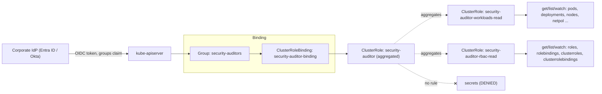
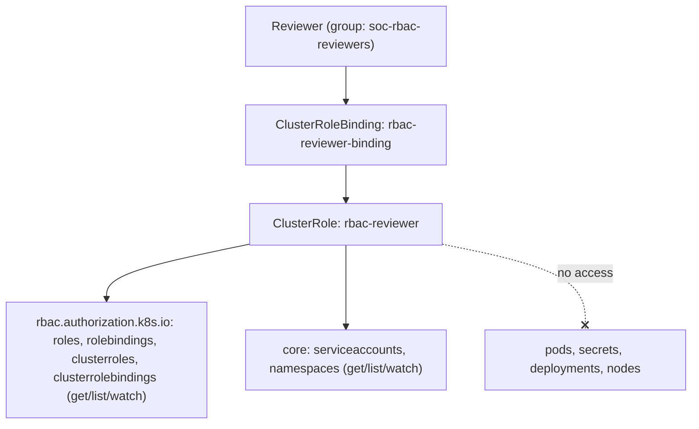
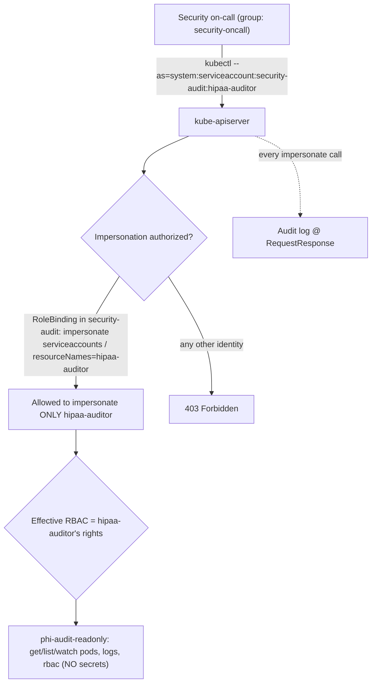
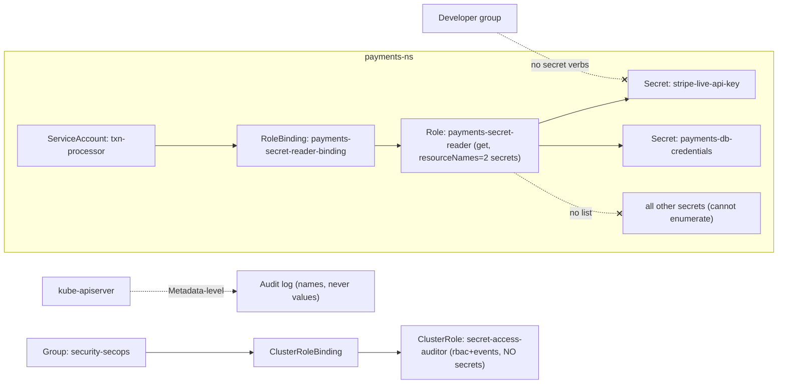
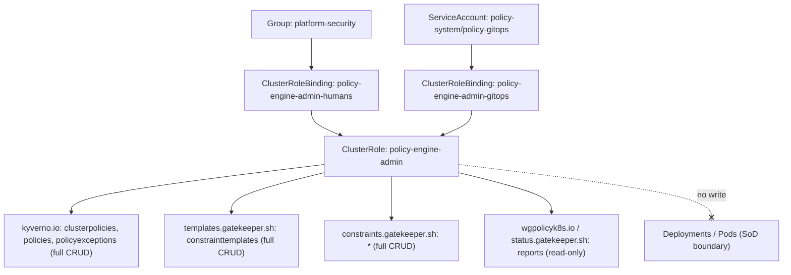

# Security Team

Five production RBAC scenarios covering how enterprise security, audit, and governance teams get read visibility, controlled break-glass impersonation, tight secret access, and policy-engine ownership on Kubernetes v1.33+ clusters.

## Scenario 26 — Cluster-Wide Read-Only Auditor Including RBAC Objects

**Company / Industry:** Banking / Core Banking Platform

### Business Requirement
A tier-1 bank runs its payments and ledger workloads on multi-tenant EKS clusters that fall under RBI and PCI-DSS scope. Internal audit and the second-line risk function must be able to inspect *everything* in the cluster — workloads, network policy, node posture, and crucially the full RBAC graph (who can do what) — during quarterly access certifications and ad-hoc incident reviews. Auditors must never be able to change state or read secret material, because auditor credentials are handed to external assessors during regulatory examinations.

### Existing Problem
Previously auditors were given the built-in `view` ClusterRole. That role deliberately excludes `roles`, `rolebindings`, `clusterroles`, and `clusterrolebindings`, so auditors could see Deployments but were blind to the authorization model itself. To compensate, an engineer had granted the audit group `cluster-admin` "just for the audit window" and forgot to revoke it — a finding that was itself raised as a critical control gap in the last examination. The bank needs a purpose-built, read-only role that includes RBAC introspection but grants zero write and zero secret access.

### Proposed RBAC Solution
Use an **aggregated ClusterRole** bound with a **ClusterRoleBinding** to a corporate IdP **Group** (`security-auditors`). A ClusterRole (not a Role) is mandatory because the audit scope is cluster-wide and includes cluster-scoped objects (nodes, PVs, ClusterRoles). Aggregation is chosen over one monolithic role so the "workloads-read" and "rbac-read" concerns are separately reviewable and independently revocable, and so future read surfaces (a new CRD group) are added by dropping in a labeled component role rather than editing a 200-line rule block. Binding to a Group rather than to individual users means joiner/mover/leaver is handled entirely in the IdP — no cluster change when an auditor rotates off.

### Kubernetes Resources
- Pods, Pods/log, Services, Endpoints, ConfigMaps, Namespaces, Events, ServiceAccounts
- Deployments, ReplicaSets, StatefulSets, DaemonSets, Jobs, CronJobs
- Nodes, PersistentVolumes, PersistentVolumeClaims, StorageClasses
- Ingresses, NetworkPolicies, HorizontalPodAutoscalers, PodDisruptionBudgets
- Roles, RoleBindings, ClusterRoles, ClusterRoleBindings, CustomResourceDefinitions
- **Explicitly excluded:** Secrets

### Required Permissions
- All the above resources → `get`, `list`, `watch` only. No mutating verbs anywhere.
- `roles`/`rolebindings`/`clusterroles`/`clusterrolebindings` (apiGroup `rbac.authorization.k8s.io`) → `get`, `list`, `watch` so auditors can reconstruct the full authorization graph.
- `secrets` → **no verbs**. Secret bodies are out of audit scope; existence/rotation is proven from audit logs and the ExternalSecret CRs instead.

### Architecture Diagram


### YAML Implementation
```yaml
apiVersion: rbac.authorization.k8s.io/v1
kind: ClusterRole
metadata:
  name: security-auditor
  labels:
    app.kubernetes.io/part-of: security-governance
    rbac.example.com/tier: audit
aggregationRule:
  clusterRoleSelectors:
    - matchLabels:
        rbac.example.com/aggregate-to-auditor: "true"
rules: []   # deliberately empty; the controller fills this from aggregated roles
---
apiVersion: rbac.authorization.k8s.io/v1
kind: ClusterRole
metadata:
  name: security-auditor-workloads-read
  labels:
    rbac.example.com/aggregate-to-auditor: "true"
rules:
  - apiGroups: [""]
    resources:
      - pods
      - pods/log
      - services
      - endpoints
      - configmaps
      - namespaces
      - events
      - serviceaccounts
      - persistentvolumeclaims
      - persistentvolumes
      - replicationcontrollers
      - resourcequotas
      - limitranges
      - nodes
    verbs: ["get", "list", "watch"]
  - apiGroups: ["apps"]
    resources: ["deployments", "replicasets", "statefulsets", "daemonsets"]
    verbs: ["get", "list", "watch"]
  - apiGroups: ["batch"]
    resources: ["jobs", "cronjobs"]
    verbs: ["get", "list", "watch"]
  - apiGroups: ["networking.k8s.io"]
    resources: ["ingresses", "networkpolicies"]
    verbs: ["get", "list", "watch"]
  - apiGroups: ["autoscaling"]
    resources: ["horizontalpodautoscalers"]
    verbs: ["get", "list", "watch"]
  - apiGroups: ["policy"]
    resources: ["poddisruptionbudgets"]
    verbs: ["get", "list", "watch"]
  - apiGroups: ["storage.k8s.io"]
    resources: ["storageclasses", "volumeattachments"]
    verbs: ["get", "list", "watch"]
  - apiGroups: ["apiextensions.k8s.io"]
    resources: ["customresourcedefinitions"]
    verbs: ["get", "list", "watch"]
---
apiVersion: rbac.authorization.k8s.io/v1
kind: ClusterRole
metadata:
  name: security-auditor-rbac-read
  labels:
    rbac.example.com/aggregate-to-auditor: "true"
rules:
  - apiGroups: ["rbac.authorization.k8s.io"]
    resources: ["roles", "rolebindings", "clusterroles", "clusterrolebindings"]
    verbs: ["get", "list", "watch"]
---
apiVersion: rbac.authorization.k8s.io/v1
kind: ClusterRoleBinding
metadata:
  name: security-auditor-binding
  labels:
    app.kubernetes.io/part-of: security-governance
subjects:
  - kind: Group
    name: security-auditors            # OIDC "groups" claim from the corporate IdP
    apiGroup: rbac.authorization.k8s.io
roleRef:
  kind: ClusterRole
  name: security-auditor
  apiGroup: rbac.authorization.k8s.io
```

### Commands
```bash
# Apply the aggregated role, its components, and the group binding
kubectl apply -f security-auditor.yaml

# Confirm the aggregation controller populated the parent role's rules
kubectl get clusterrole security-auditor -o yaml | grep -A3 rules

# Inspect who is bound as an auditor
kubectl describe clusterrolebinding security-auditor-binding
```

### Verification
```bash
# ALLOW: auditor can read RBAC objects cluster-wide
kubectl auth can-i list clusterrolebindings \
  --as=jane.auditor@bank.example --as-group=security-auditors

# ALLOW: auditor can read workloads in any namespace
kubectl auth can-i get deployments -n payments \
  --as=jane.auditor@bank.example --as-group=security-auditors

# DENY: auditor must NOT read secrets
kubectl auth can-i get secrets -n payments \
  --as=jane.auditor@bank.example --as-group=security-auditors

# DENY: auditor must NOT mutate anything
kubectl auth can-i delete deployment/ledger-api -n payments \
  --as=jane.auditor@bank.example --as-group=security-auditors

# Full effective permission dump for the auditor identity
kubectl auth can-i --list \
  --as=jane.auditor@bank.example --as-group=security-auditors
```

### Expected Output
```text
# ALLOW cases
$ kubectl auth can-i list clusterrolebindings --as=jane.auditor@bank.example --as-group=security-auditors
yes
$ kubectl auth can-i get deployments -n payments --as=jane.auditor@bank.example --as-group=security-auditors
yes

# DENY cases
$ kubectl auth can-i get secrets -n payments --as=jane.auditor@bank.example --as-group=security-auditors
no
$ kubectl auth can-i delete deployment/ledger-api -n payments --as=jane.auditor@bank.example --as-group=security-auditors
no

# A real forbidden error if the auditor actually attempts a write:
$ kubectl delete deployment ledger-api -n payments --as=jane.auditor@bank.example --as-group=security-auditors
Error from server (Forbidden): deployments.apps "ledger-api" is forbidden:
User "jane.auditor@bank.example" cannot delete resource "deployments" in API group "apps" in the namespace "payments"
```

### Common Mistakes
- Handing auditors the built-in `view` role and being surprised RBAC objects are invisible — `view` intentionally omits them.
- Adding `secrets` with `get`/`list` "so they can verify rotation" — `list` returns full secret bodies, silently defeating the exclusion.
- Granting `cluster-admin` temporarily and never revoking it (the classic audit finding).
- Writing one giant ClusterRole instead of aggregating, then breaking read access when a single line is fat-fingered.
- Binding to individual usernames so the binding rots as auditors rotate.

### Troubleshooting
- Auditor sees nothing after login: check the OIDC `groups` claim actually contains `security-auditors` with `kubectl auth can-i --list --as=user --as-group=security-auditors` versus what the token carries (`kubectl --token=... get --raw /apis`).
- Parent role empty: the aggregation controller only fills `security-auditor` if component roles carry the exact label key/value; a typo in `rbac.example.com/aggregate-to-auditor` leaves `rules: []`.
- RBAC objects still forbidden: confirm `apiGroups: ["rbac.authorization.k8s.io"]` (not `""`).
- Use `kubectl describe clusterrolebinding security-auditor-binding` to confirm `roleRef` points at the aggregated parent, not a component.

### Best Practice
Mature banks drive this entirely from the IdP: the `security-auditors` group is an Entra ID / Okta group, membership is time-boxed via PAM (auditor access auto-expires after the certification window), and the ClusterRoleBinding never changes. The role is delivered by GitOps (Argo CD) so every permission change is a reviewed pull request. External assessors receive a short-lived OIDC identity, never a static kubeconfig.

### Security Notes
Least privilege is enforced by omission — no verb outside `get/list/watch` exists anywhere in the aggregate, so even a compromised auditor token cannot mutate the cluster. Blast radius is bounded to *disclosure of non-secret metadata*; because `secrets` carry no verb, a leaked auditor credential cannot exfiltrate credentials, private keys, or PHI. Note the residual risk: read access to the full RBAC graph is itself sensitive reconnaissance, so auditor sessions must be short-lived and their `list clusterrolebindings` calls audited.

### Interview Questions
1. Why does the built-in `view` ClusterRole not let a security auditor read Roles and RoleBindings, and how do you fix that without granting write?
2. Why did you exclude `secrets` entirely instead of granting `get` but not `list`?
3. What does an `aggregationRule` buy you over a single hand-written ClusterRole here?
4. How do you scope this to be cluster-wide and include cluster-scoped objects like Nodes and PVs?
5. Why bind to a Group instead of individual User subjects?

### Interview Answers
1. `view` is intentionally curated to exclude RBAC objects (and secrets) because being able to enumerate bindings is reconnaissance that leaks the security posture. You fix it by authoring a dedicated ClusterRole granting `get/list/watch` on `roles/rolebindings/clusterroles/clusterrolebindings` in the `rbac.authorization.k8s.io` API group, and aggregating it alongside broad workload reads — read-only, no escalation.
2. `list` returns the full object, including the base64-encoded `data` map, so `get`-without-`list` still discloses every secret an auditor can name and `list` discloses all of them. RBAC cannot return metadata-only for secrets, so the only safe posture is zero verbs on `secrets`; rotation evidence comes from audit logs and ExternalSecret CRs instead.
3. Aggregation separates concerns (workloads vs RBAC introspection) into independently reviewable, independently revocable component roles, and makes the read surface extensible — a new CRD read is a new labeled component, not a risky edit to a monolith. The controller recomputes the parent automatically.
4. Use `kind: ClusterRole` bound with a `ClusterRoleBinding`; a namespaced Role/RoleBinding cannot grant access to cluster-scoped resources such as `nodes`, `persistentvolumes`, `storageclasses`, or `clusterroles`, and would need replication per namespace.
5. Binding to a Group delegates joiner/mover/leaver to the IdP, so auditors rotating on and off never require a cluster change; it also keeps the RBAC graph small and auditable versus dozens of per-user subjects that inevitably drift.

### Follow-up Questions
- How would you prevent an auditor from using their read access to Secrets *indirectly*, e.g. reading a Pod spec that mounts a secret as an env var literal?
- If the cluster uses `Node` authorization and Webhook authorizers in addition to RBAC, how do the authorizers combine for this identity?
- How do you produce a machine-readable, diffable snapshot of the entire RBAC graph for the certification package?
- How would you time-box this access so it self-expires without a human revoking the binding?

### Production Tips
Amazon-style shops federate this via EKS IAM/OIDC where the `security-auditors` mapping lives in `aws-auth`/EKS access entries and membership is a time-boxed IAM Identity Center permission set. Microsoft/AKS customers map an Entra ID group directly (`gke-security-groups` is the GKE equivalent for Google) so the ClusterRoleBinding references a stable group SID. Netflix and Uber build read-only "auditor" aggregated ClusterRoles delivered by GitOps and pair them with break-glass audit logging so that even read access to the RBAC graph is recorded and alertable.

## Scenario 27 — Security Team RBAC Review Access (Roles, Bindings, ClusterRoles)

**Company / Industry:** Insurance / Policy Administration Platform

### Business Requirement
A large insurer must satisfy SOX IT General Controls and internal SoD (segregation-of-duties) reviews every quarter. The security governance team needs to periodically pull the *complete authorization model* of each production cluster — every Role, RoleBinding, ClusterRole, ClusterRoleBinding, plus the ServiceAccounts and Namespaces they reference — to prove that no developer group has been granted write access to another line-of-business namespace and that no unexpected `cluster-admin` bindings exist. This is a narrow, RBAC-only read; unlike full auditors, these reviewers do not need to see workloads or logs.

### Existing Problem
The governance team was screen-sharing with a cluster admin once a quarter while the admin ran `kubectl get clusterrolebindings` and pasted output into a spreadsheet. The process was manual, unverifiable, non-repeatable, and gave the reviewers no independent evidence trail. During the last SOX walkthrough, the external auditor flagged that the "reviewers" had no credentialed, least-privilege access of their own — the review was effectively performed by the very admins being reviewed, breaking segregation of duties.

### Proposed RBAC Solution
A single tightly-scoped **ClusterRole** (`rbac-reviewer`) restricted to the `rbac.authorization.k8s.io` API group plus read on `serviceaccounts` and `namespaces`, bound cluster-wide with a **ClusterRoleBinding** to the IdP **Group** `soc-rbac-reviewers`. A ClusterRole is required because ClusterRoles and ClusterRoleBindings are cluster-scoped. This is deliberately *narrower* than the Scenario 26 auditor role — it grants no workload, node, or event visibility, minimizing what these reviewers can see and keeping their access proportional to the SoD task.

### Kubernetes Resources
- Roles, RoleBindings (namespaced)
- ClusterRoles, ClusterRoleBindings (cluster-scoped)
- ServiceAccounts (RBAC subjects)
- Namespaces (to map bindings to line-of-business boundaries)

### Required Permissions
- `roles`, `rolebindings`, `clusterroles`, `clusterrolebindings` → `get`, `list`, `watch`. `list` powers the quarterly export; `watch` powers a continuous drift detector.
- `serviceaccounts` → `get`, `list`, `watch` so bindings that reference SAs can be resolved to real identities.
- `namespaces` → `get`, `list`, `watch` to attribute each binding to a business unit.
- Nothing else — no pods, no secrets, no write.

### Architecture Diagram


### YAML Implementation
```yaml
apiVersion: rbac.authorization.k8s.io/v1
kind: ClusterRole
metadata:
  name: rbac-reviewer
  labels:
    app.kubernetes.io/part-of: access-governance
    compliance.example.com/control: sox-itgc
  annotations:
    governance.example.com/purpose: "Quarterly SoD and RBAC certification review (read-only)"
rules:
  - apiGroups: ["rbac.authorization.k8s.io"]
    resources: ["roles", "rolebindings", "clusterroles", "clusterrolebindings"]
    verbs: ["get", "list", "watch"]
  - apiGroups: [""]
    resources: ["serviceaccounts", "namespaces"]
    verbs: ["get", "list", "watch"]
---
apiVersion: rbac.authorization.k8s.io/v1
kind: ClusterRoleBinding
metadata:
  name: rbac-reviewer-binding
  labels:
    app.kubernetes.io/part-of: access-governance
subjects:
  - kind: Group
    name: soc-rbac-reviewers          # OIDC group; membership managed in the IdP + PAM
    apiGroup: rbac.authorization.k8s.io
roleRef:
  kind: ClusterRole
  name: rbac-reviewer
  apiGroup: rbac.authorization.k8s.io
```

### Commands
```bash
# Apply the reviewer role + binding
kubectl apply -f rbac-reviewer.yaml

# Confirm the binding subjects
kubectl describe clusterrolebinding rbac-reviewer-binding

# Reviewer's evidence export (run as the reviewer identity in CI)
kubectl get clusterroles,clusterrolebindings -o yaml \
  --as=carol.reviewer@insure.example --as-group=soc-rbac-reviewers > cluster-rbac-snapshot.yaml
kubectl get roles,rolebindings -A -o yaml \
  --as=carol.reviewer@insure.example --as-group=soc-rbac-reviewers > namespaced-rbac-snapshot.yaml
```

### Verification
```bash
# ALLOW: read the RBAC graph
kubectl auth can-i list clusterroles \
  --as=carol.reviewer@insure.example --as-group=soc-rbac-reviewers
kubectl auth can-i list rolebindings -A \
  --as=carol.reviewer@insure.example --as-group=soc-rbac-reviewers

# DENY: reviewers must NOT read workloads or secrets
kubectl auth can-i list pods -n claims \
  --as=carol.reviewer@insure.example --as-group=soc-rbac-reviewers
kubectl auth can-i get secrets -n claims \
  --as=carol.reviewer@insure.example --as-group=soc-rbac-reviewers

# DENY: reviewers must NOT create/edit bindings (SoD)
kubectl auth can-i create clusterrolebindings \
  --as=carol.reviewer@insure.example --as-group=soc-rbac-reviewers
```

### Expected Output
```text
$ kubectl auth can-i list clusterroles --as=carol.reviewer@insure.example --as-group=soc-rbac-reviewers
yes
$ kubectl auth can-i list rolebindings -A --as=carol.reviewer@insure.example --as-group=soc-rbac-reviewers
yes
$ kubectl auth can-i list pods -n claims --as=carol.reviewer@insure.example --as-group=soc-rbac-reviewers
no
$ kubectl auth can-i create clusterrolebindings --as=carol.reviewer@insure.example --as-group=soc-rbac-reviewers
no

# If a reviewer attempts to edit a binding:
$ kubectl edit clusterrolebinding cluster-admin --as=carol.reviewer@insure.example --as-group=soc-rbac-reviewers
Error from server (Forbidden): clusterrolebindings.rbac.authorization.k8s.io "cluster-admin" is forbidden:
User "carol.reviewer@insure.example" cannot patch resource "clusterrolebindings" in API group "rbac.authorization.k8s.io" at the cluster scope
```

### Common Mistakes
- Granting `update`/`patch`/`create` "so they can fix findings" — that destroys segregation of duties; reviewers find, a separate team remediates.
- Forgetting `serviceaccounts` and `namespaces`, leaving bindings that reference SAs unresolvable during the review.
- Putting `rbac` resources under `apiGroups: [""]` (the core group) — RBAC objects live in `rbac.authorization.k8s.io`.
- Using a namespaced Role and then being unable to see any ClusterRole/ClusterRoleBinding.
- Adding `escalate`/`bind` verbs — never needed for read, and they are the two most dangerous RBAC verbs.

### Troubleshooting
- `kubectl auth can-i --list --as=... --as-group=soc-rbac-reviewers` to dump the reviewer's exact effective permissions.
- If cluster-scoped RBAC is invisible but namespaced is fine, you accidentally used a RoleBinding — cluster-scoped objects require a ClusterRoleBinding.
- If everything is denied, verify the token's group claim matches `soc-rbac-reviewers` character-for-character (case-sensitive).
- `kubectl describe clusterrolebinding rbac-reviewer-binding` to confirm `roleRef` and subject `kind: Group`.

### Best Practice
The reviewer group is IdP-managed with PAM-issued, time-boxed membership, and the export runs as a scheduled read-only CI job (its own OIDC identity in `soc-rbac-reviewers`) that commits a diffable RBAC snapshot to a Git evidence repo every night. Drift between snapshots raises a ticket automatically, so the "quarterly review" is continuous and the quarter-end certification is just a sign-off on already-collected evidence.

### Security Notes
This role is a textbook least-privilege, read-only design: no verb can alter authorization, so a compromised reviewer token cannot grant itself power. The one sensitivity is that the RBAC graph is reconnaissance gold — an attacker holding this token learns exactly which identities are over-privileged. Mitigations: short-lived tokens, alert on `list clusterrolebindings` from non-CI identities, and never combine this role with any write verb (which would enable self-escalation via `bind`).

### Interview Questions
1. How is this reviewer role different from a full cluster read-only auditor, and why make it narrower?
2. Why must reviewers have no `create`/`update`/`bind` on RBAC objects?
3. Which API group holds Roles and ClusterRoles, and why does it matter in the rule?
4. Why include `serviceaccounts` and `namespaces` in a role that is "about RBAC"?
5. How would you turn a quarterly manual review into continuous drift detection using only read permissions?

### Interview Answers
1. The auditor (Scenario 26) reads the whole cluster; the reviewer reads only the authorization model. Narrowing it keeps access proportional to the SoD task, shrinks the blast radius of a leaked token, and makes the access itself easy to justify to an external auditor.
2. Write on RBAC — especially `bind` — lets the holder escalate: they could bind themselves to `cluster-admin`. Read-only reviewers with any RBAC write both violate SoD and create a privilege-escalation path, so writes stay with a separate remediation team.
3. `rbac.authorization.k8s.io`. If you mistakenly list them under the core group `""`, the rule matches nothing and every RBAC read is forbidden.
4. RBAC subjects are frequently ServiceAccounts, and bindings only make sense mapped to the namespace/business unit they live in. Without SA and namespace read, the reviewer sees binding names but cannot resolve who they actually empower or where.
5. Grant `watch` on the RBAC resources and run a controller/CronJob under the reviewer identity that snapshots the graph on a schedule, diffs against the last committed state in Git, and opens a ticket on any change — all achievable with pure `get/list/watch`.

### Follow-up Questions
- How do you detect a *wildcard* ClusterRole (`resources: ["*"]`, `verbs: ["*"]`) programmatically during the review?
- How would you correlate a RoleBinding to the human who created it (managedFields, audit logs)?
- How do aggregated ClusterRoles complicate "what can this subject actually do" analysis, and how do you resolve the effective permissions?
- Would you give reviewers `impersonate` to test other users' access, and what are the risks?

### Production Tips
Financial-services teams at the scale of PhonePe, Razorpay, and Paytm run exactly this pattern: a locked-down RBAC-read ClusterRole bound to an IdP group, feeding a nightly GitOps snapshot for SOX/PCI evidence. Red Hat OpenShift ships an analogous `cluster-reader` you can trim down; VMware Tanzu and IBM Cloud publish reviewer roles wired to LDAP/AD groups. The common mechanism is IdP-group binding plus GitOps-delivered, diff-audited role definitions so the review process is itself reviewable.

## Scenario 28 — Controlled Impersonation for Authorized Audit Only

**Company / Industry:** Healthcare / Electronic Health Records (EHR) SaaS

### Business Requirement
A HIPAA-covered EHR platform occasionally needs a senior security engineer to *reproduce exactly what a specific low-privilege audit persona can see* — for example when an assessor asks "prove the read-only auditor cannot reach PHI in these pods." Rather than minting new credentials, the engineer must be able to temporarily *become* a single, well-known, read-only audit identity via `kubectl --as`, and every such action must be captured at full fidelity in the audit log for the HIPAA accounting-of-disclosures requirement.

### Existing Problem
Engineers were sharing the kubeconfig of the `hipaa-auditor` service account (copying its token out of a Secret) whenever they needed to test the auditor's view. That leaked a long-lived token into laptops and chat history, produced audit-log entries attributed to the SA rather than the human, and gave the engineers no bounded, revocable mechanism. Worse, one engineer had been granted broad `impersonate` on `users`/`groups`, meaning they could impersonate *anyone*, including `system:masters` — an unbounded privilege-escalation path that a pen test flagged as critical.

### Proposed RBAC Solution
Grant a **ClusterRole** with the `impersonate` verb **restricted by `resourceNames`** to exactly one service account (`hipaa-auditor`), and bind it with a **namespaced RoleBinding** in the `security-audit` namespace to the **Group** `security-oncall`. Scoping `resourceNames` to a single SA prevents impersonating any other identity; binding the impersonation right through a namespaced RoleBinding (not a ClusterRoleBinding) confines the `serviceaccounts` impersonation check to the `security-audit` namespace. The impersonated SA itself holds only a read-only ClusterRole, so the *effective* power while impersonating is strictly read-only — impersonation never grants more than the target already has.

### Kubernetes Resources
- ServiceAccounts (the impersonation target `hipaa-auditor`, `impersonate` verb)
- The read surface the persona is allowed: Pods, Pods/log, Services, ConfigMaps, Events, Namespaces, Deployments/StatefulSets/ReplicaSets, RBAC objects
- kube-apiserver audit Policy (captures every impersonation event)

### Required Permissions
- `serviceaccounts` (core) → `impersonate`, restricted `resourceNames: ["hipaa-auditor"]`. This is the *only* impersonation grant; no `users`, no `groups`, no wildcard.
- The `hipaa-auditor` SA itself → `get`, `list`, `watch` on workloads/RBAC via a separate ClusterRole. **No `secrets`** so PHI-bearing secrets stay unreachable even while impersonating.

### Architecture Diagram


### YAML Implementation
```yaml
apiVersion: v1
kind: Namespace
metadata:
  name: security-audit
  labels:
    pod-security.kubernetes.io/enforce: restricted
    compliance.example.com/scope: hipaa
---
# The ONLY identity that may be impersonated. Token never auto-mounted or exported.
apiVersion: v1
kind: ServiceAccount
metadata:
  name: hipaa-auditor
  namespace: security-audit
automountServiceAccountToken: false
---
# What the audit persona may see: strictly read-only, and NO secrets (PHI protection).
apiVersion: rbac.authorization.k8s.io/v1
kind: ClusterRole
metadata:
  name: phi-audit-readonly
rules:
  - apiGroups: [""]
    resources: ["pods", "pods/log", "services", "configmaps", "events", "namespaces", "persistentvolumeclaims"]
    verbs: ["get", "list", "watch"]
  - apiGroups: ["apps"]
    resources: ["deployments", "statefulsets", "replicasets"]
    verbs: ["get", "list", "watch"]
  - apiGroups: ["rbac.authorization.k8s.io"]
    resources: ["roles", "rolebindings", "clusterroles", "clusterrolebindings"]
    verbs: ["get", "list", "watch"]
---
apiVersion: rbac.authorization.k8s.io/v1
kind: ClusterRoleBinding
metadata:
  name: hipaa-auditor-readonly-binding
subjects:
  - kind: ServiceAccount
    name: hipaa-auditor
    namespace: security-audit
roleRef:
  kind: ClusterRole
  name: phi-audit-readonly
  apiGroup: rbac.authorization.k8s.io
---
# The impersonation right — reusable ClusterRole, restricted to ONE service account.
apiVersion: rbac.authorization.k8s.io/v1
kind: ClusterRole
metadata:
  name: controlled-impersonator
rules:
  - apiGroups: [""]
    resources: ["serviceaccounts"]
    verbs: ["impersonate"]
    resourceNames: ["hipaa-auditor"]
---
# Namespaced binding confines the impersonation check to the security-audit namespace,
# so security-oncall can impersonate hipaa-auditor and NOTHING else, anywhere else.
apiVersion: rbac.authorization.k8s.io/v1
kind: RoleBinding
metadata:
  name: controlled-impersonator-binding
  namespace: security-audit
subjects:
  - kind: Group
    name: security-oncall
    apiGroup: rbac.authorization.k8s.io
roleRef:
  kind: ClusterRole
  name: controlled-impersonator
  apiGroup: rbac.authorization.k8s.io
---
# kube-apiserver audit policy (configured via --audit-policy-file; NOT applied by kubectl).
# Captures every impersonation call at full fidelity for HIPAA accounting-of-disclosures.
apiVersion: audit.k8s.io/v1
kind: Policy
rules:
  - level: RequestResponse
    verbs: ["impersonate"]
    resources:
      - group: ""
        resources: ["serviceaccounts", "users", "groups"]
  - level: Metadata
    userGroups: ["security-oncall"]
```

### Commands
```bash
# Apply namespace, target SA, read-only role, impersonation role + binding
kubectl apply -f controlled-impersonation.yaml

# (Cluster operator) install the audit policy on the API server, e.g. for kubeadm:
#   --audit-policy-file=/etc/kubernetes/audit/policy.yaml
#   --audit-log-path=/var/log/kubernetes/audit/audit.log

# Use the impersonation: security on-call reproduces the auditor's exact view
kubectl get pods -n clinical-records \
  --as=system:serviceaccount:security-audit:hipaa-auditor
```

### Verification
```bash
# ALLOW: on-call may impersonate ONLY the hipaa-auditor SA
kubectl auth can-i impersonate serviceaccount/hipaa-auditor -n security-audit \
  --as=dan.oncall@ehr.example --as-group=security-oncall

# While impersonating, effective access is read-only (this succeeds)
kubectl auth can-i list pods -n clinical-records \
  --as=system:serviceaccount:security-audit:hipaa-auditor

# DENY: cannot impersonate any other SA or a privileged user
kubectl auth can-i impersonate serviceaccount/argocd-admin -n argocd \
  --as=dan.oncall@ehr.example --as-group=security-oncall
kubectl auth can-i impersonate user/system:admin \
  --as=dan.oncall@ehr.example --as-group=security-oncall

# DENY: even while impersonating the auditor, PHI-bearing secrets are unreachable
kubectl auth can-i get secrets -n clinical-records \
  --as=system:serviceaccount:security-audit:hipaa-auditor
```

### Expected Output
```text
$ kubectl auth can-i impersonate serviceaccount/hipaa-auditor -n security-audit --as=dan.oncall@ehr.example --as-group=security-oncall
yes
$ kubectl auth can-i list pods -n clinical-records --as=system:serviceaccount:security-audit:hipaa-auditor
yes
$ kubectl auth can-i impersonate serviceaccount/argocd-admin -n argocd --as=dan.oncall@ehr.example --as-group=security-oncall
no
$ kubectl auth can-i get secrets -n clinical-records --as=system:serviceaccount:security-audit:hipaa-auditor
no

# On-call tries to impersonate a privileged identity directly:
$ kubectl get nodes --as=system:admin --as-group=system:masters
Error from server (Forbidden): users "system:admin" is forbidden:
User "dan.oncall@ehr.example" cannot impersonate resource "users" in API group "" at the cluster scope
```

### Common Mistakes
- Granting `impersonate` on `users`/`groups` with no `resourceNames`, which permits impersonating `system:masters` — total cluster takeover.
- Binding `controlled-impersonator` with a *ClusterRoleBinding*, which drops the namespace confinement and lets on-call impersonate any SA named `hipaa-auditor` in any namespace.
- Copying the SA token out of its Secret to "test as the auditor" instead of using `--as`, leaking a long-lived credential.
- Forgetting to also restrict what the target SA can do — impersonation inherits the target's rights, so a powerful target defeats the control.
- Not logging impersonation at `RequestResponse`, leaving no evidence trail for HIPAA.

### Troubleshooting
- `kubectl auth can-i impersonate serviceaccount/hipaa-auditor -n security-audit --as=... --as-group=security-oncall` to confirm the grant; a `no` usually means the binding is in the wrong namespace or `resourceNames` doesn't match.
- If impersonation of *other* identities unexpectedly succeeds, you likely used a ClusterRoleBinding or left `resourceNames` empty.
- If reads fail *while* impersonating, the problem is the target SA's own RBAC, not the impersonation grant — check `phi-audit-readonly`.
- Confirm audit capture with a `grep '"verb":"impersonate"'` over the API-server audit log.

### Best Practice
Real EHR platforms gate this behind break-glass: `security-oncall` membership is granted just-in-time by a PAM tool for the duration of a ticket, every impersonation is logged at `RequestResponse` and streamed to the SIEM, and an alert fires on any `impersonate` verb. The impersonatable target is a single, permanently read-only SA — never a human admin — so the maximum achievable privilege via this path is bounded and known.

### Security Notes
`impersonate` is one of the three "dangerous" verbs (with `bind` and `escalate`) because it lets one identity assume another's authority. The design mitigates this three ways: (1) `resourceNames` caps the target set to a single benign SA; (2) the namespaced RoleBinding confines the check to `security-audit`; (3) the target SA itself is read-only and secret-free, so even successful impersonation cannot reach PHI or mutate anything. Residual risk is limited to disclosure of non-secret metadata, fully attributed to the human via `RequestResponse` audit logging.

### Interview Questions
1. What is the danger of granting `impersonate` on `users`/`groups` without `resourceNames`?
2. Why bind the impersonation ClusterRole with a namespaced RoleBinding instead of a ClusterRoleBinding here?
3. When a user impersonates a ServiceAccount, whose RBAC permissions apply to the resulting requests?
4. How does this design keep PHI in Secrets unreachable even during authorized impersonation?
5. How do you produce a HIPAA-grade evidence trail of who impersonated whom and what they read?

### Interview Answers
1. Unrestricted `impersonate` on `users`/`groups` lets the holder impersonate any identity, including `system:masters` (the built-in super-group), which is equivalent to `cluster-admin`. It is a direct, total privilege-escalation path and must always be constrained with `resourceNames`.
2. A ClusterRoleBinding would authorize impersonating a ServiceAccount named `hipaa-auditor` in *every* namespace and at cluster scope; the namespaced RoleBinding confines the `serviceaccounts` impersonation authorization check to `security-audit`, so only that one specific SA is reachable.
3. The impersonated identity's permissions apply. Impersonation replaces the request's effective user with the target; the impersonator's own broad or narrow rights are irrelevant once the impersonation is authorized — which is exactly why the target must be low-privilege.
4. The impersonation target (`hipaa-auditor`) is bound to `phi-audit-readonly`, which has zero verbs on `secrets`. Since effective access equals the target's rights, no `secrets` read is possible regardless of who is impersonating.
5. Configure a kube-apiserver audit Policy that logs the `impersonate` verb at `RequestResponse` (capturing both the impersonator and the target) and streams to a SIEM; correlate the subsequent impersonated read requests, which the API server tags with the impersonated user plus the original requester in the audit entry's `impersonatedUser`/`user` fields.

### Follow-up Questions
- How would you additionally allow impersonating the target's *groups* (`--as-group`), and why is that a separate `groups` impersonation grant?
- Could an attacker with this exact grant chain impersonation to reach higher privilege? Walk through why not.
- How does impersonation interact with admission webhooks and Pod Security Admission?
- How would you auto-expire `security-oncall` membership without a human revoking it?

### Production Tips
Google's `gke-security-groups` and AWS EKS access entries are typically wired so that break-glass impersonation targets a dedicated read-only SA, with Cloud Audit Logs / CloudTrail capturing the `impersonate` call. Netflix and Uber implement "controlled impersonation" as JIT break-glass gated by their internal PAM, alerting on every impersonation event. Red Hat OpenShift documents `impersonate` restricted by `resourceNames` as the sanctioned pattern for support engineers reproducing a customer's view, and VMware Tanzu ships similar guidance for its SRE break-glass flows.

## Scenario 29 — Restricting and Auditing Secret Access

**Company / Industry:** FinTech / Card Payments & Wallet

### Business Requirement
A card-payments FinTech under PCI-DSS must guarantee that only the transaction-processing workload can read its Stripe live key and payments-database credentials, that no human or CI identity can enumerate secrets across the `payments` namespace, and that every access to any Secret object is recorded — without the secret *values* ever landing in the audit log. Security must also be able to prove *who is authorized* to read secrets at any time.

### Existing Problem
The `payments` namespace had a broad RoleBinding granting the developer group `get,list` on all Secrets "for convenience." A leaked developer laptop token was used to `kubectl get secrets -o yaml` and exfiltrate the live Stripe key, triggering a PCI incident and key rotation across the fleet. Root cause: `list` on Secrets returns full bodies, and the grant was namespace-wide rather than scoped to the specific secrets a workload legitimately needs.

### Proposed RBAC Solution
Replace the broad grant with a namespaced **Role** that permits only `get` on the two specific Secrets by **`resourceNames`**, bound via a **RoleBinding** to the workload's dedicated **ServiceAccount** — no `list`, so nothing can enumerate the namespace's secrets. A separate cluster-wide **ClusterRole** gives the security team RBAC-and-events introspection (to see *who* can read secrets) but grants **no verb on Secrets** so security itself cannot read secret bodies. Defence-in-depth is layered on with a NetworkPolicy limiting the workload's egress and a kube-apiserver audit Policy logging Secret access at `Metadata` level (never the payload).

### Kubernetes Resources
- Secrets (`stripe-live-api-key`, `payments-db-credentials`)
- ServiceAccount `txn-processor`
- Roles / RoleBindings, ClusterRoles / ClusterRoleBindings (for the introspection role)
- Events, ServiceAccounts (introspection)
- NetworkPolicy (egress restriction)
- kube-apiserver audit Policy

### Required Permissions
- `secrets` → `get` only, restricted `resourceNames: ["stripe-live-api-key","payments-db-credentials"]`, granted solely to `txn-processor`. **No `list`** (list ignores resourceNames for enumeration and returns bodies) and **no `watch`**.
- Security team → `get/list/watch` on `roles/rolebindings/clusterroles/clusterrolebindings`, `events`, `serviceaccounts`; **zero verbs on `secrets`**.
- No `create/update/patch/delete` on Secrets for anyone in this path — secrets are provisioned by the External Secrets Operator, not humans.

### Architecture Diagram


### YAML Implementation
```yaml
apiVersion: v1
kind: Namespace
metadata:
  name: payments
  labels:
    pod-security.kubernetes.io/enforce: restricted
    data-classification: pci
---
apiVersion: v1
kind: ServiceAccount
metadata:
  name: txn-processor
  namespace: payments
automountServiceAccountToken: true
---
# Workload may read ONLY the two secrets it needs, by name. No list => cannot enumerate.
apiVersion: rbac.authorization.k8s.io/v1
kind: Role
metadata:
  name: payments-secret-reader
  namespace: payments
rules:
  - apiGroups: [""]
    resources: ["secrets"]
    verbs: ["get"]
    resourceNames: ["stripe-live-api-key", "payments-db-credentials"]
---
apiVersion: rbac.authorization.k8s.io/v1
kind: RoleBinding
metadata:
  name: payments-secret-reader-binding
  namespace: payments
subjects:
  - kind: ServiceAccount
    name: txn-processor
    namespace: payments
roleRef:
  kind: Role
  name: payments-secret-reader
  apiGroup: rbac.authorization.k8s.io
---
# Security team: see WHO can touch secrets (RBAC + events), but NOT read secret bodies.
apiVersion: rbac.authorization.k8s.io/v1
kind: ClusterRole
metadata:
  name: secret-access-auditor
rules:
  - apiGroups: ["rbac.authorization.k8s.io"]
    resources: ["roles", "rolebindings", "clusterroles", "clusterrolebindings"]
    verbs: ["get", "list", "watch"]
  - apiGroups: [""]
    resources: ["events", "serviceaccounts"]
    verbs: ["get", "list", "watch"]
---
apiVersion: rbac.authorization.k8s.io/v1
kind: ClusterRoleBinding
metadata:
  name: secret-access-auditor-binding
subjects:
  - kind: Group
    name: security-secops
    apiGroup: rbac.authorization.k8s.io
roleRef:
  kind: ClusterRole
  name: secret-access-auditor
  apiGroup: rbac.authorization.k8s.io
---
# Defence in depth: limit egress of the secret-consuming pod (anti-exfiltration).
apiVersion: networking.k8s.io/v1
kind: NetworkPolicy
metadata:
  name: txn-processor-egress
  namespace: payments
spec:
  podSelector:
    matchLabels:
      app: txn-processor
  policyTypes: ["Egress"]
  egress:
    - to:
        - namespaceSelector:
            matchLabels:
              kubernetes.io/metadata.name: kube-system
      ports:
        - protocol: UDP
          port: 53
        - protocol: TCP
          port: 53
    - to:
        - ipBlock:
            cidr: 10.20.0.0/16     # internal payments DB subnet only
      ports:
        - protocol: TCP
          port: 5432
---
# kube-apiserver audit Policy (via --audit-policy-file). Metadata level => log ACCESS, never VALUES.
apiVersion: audit.k8s.io/v1
kind: Policy
rules:
  - level: Metadata
    resources:
      - group: ""
        resources: ["secrets"]
    verbs: ["get", "list", "watch", "create", "update", "patch", "delete"]
```

### Commands
```bash
# Provision RBAC, network policy, and identity
kubectl apply -f payments-secret-access.yaml

# (Cluster operator) load audit policy on the API server:
#   --audit-policy-file=/etc/kubernetes/audit/secrets-policy.yaml --audit-log-maxsize=100

# Confirm the reader role is scoped by name
kubectl get role payments-secret-reader -n payments -o yaml | grep -A2 resourceNames
```

### Verification
```bash
# ALLOW: the workload SA can GET its two named secrets
kubectl auth can-i get secret/stripe-live-api-key -n payments \
  --as=system:serviceaccount:payments:txn-processor
kubectl auth can-i get secret/payments-db-credentials -n payments \
  --as=system:serviceaccount:payments:txn-processor

# DENY: the workload cannot LIST (enumerate) secrets
kubectl auth can-i list secrets -n payments \
  --as=system:serviceaccount:payments:txn-processor

# DENY: the workload cannot read a different secret it wasn't named for
kubectl auth can-i get secret/root-ca-key -n payments \
  --as=system:serviceaccount:payments:txn-processor

# DENY: security team can see WHO is bound but cannot read secret bodies
kubectl auth can-i list rolebindings -n payments \
  --as=erin.secops@fintech.example --as-group=security-secops
kubectl auth can-i get secrets -n payments \
  --as=erin.secops@fintech.example --as-group=security-secops
```

### Expected Output
```text
$ kubectl auth can-i get secret/stripe-live-api-key -n payments --as=system:serviceaccount:payments:txn-processor
yes
$ kubectl auth can-i list secrets -n payments --as=system:serviceaccount:payments:txn-processor
no
$ kubectl auth can-i get secret/root-ca-key -n payments --as=system:serviceaccount:payments:txn-processor
no
$ kubectl auth can-i list rolebindings -n payments --as=erin.secops@fintech.example --as-group=security-secops
yes
$ kubectl auth can-i get secrets -n payments --as=erin.secops@fintech.example --as-group=security-secops
no

# A developer (or leaked token) attempting the old exfiltration path now fails:
$ kubectl get secrets -n payments -o yaml --as=system:serviceaccount:payments:txn-processor
Error from server (Forbidden): secrets is forbidden:
User "system:serviceaccount:payments:txn-processor" cannot list resource "secrets" in API group "" in the namespace "payments"
```

### Common Mistakes
- Granting `list` (or `watch`) on Secrets — both stream full bodies and ignore `resourceNames` for enumeration, defeating the whole control.
- Assuming `resourceNames` restricts `list`; it does not — `list`/`watch` are collection verbs and cannot be name-scoped.
- Logging Secret access at `RequestResponse` level, which writes the secret payload straight into the audit log — a new exposure.
- Namespace-wide secret grants to developer groups "for convenience."
- Giving the security team `get` on Secrets so they can "audit content" — auditing *who is authorized* needs RBAC read, not Secret read.

### Troubleshooting
- Workload can't start / can't read its secret: verify the exact secret name is in `resourceNames` (a rename breaks the match silently) and that the Pod uses `serviceAccountName: txn-processor`.
- `list` unexpectedly allowed: search for a second, broader RoleBinding/ClusterRoleBinding granting Secrets — RBAC is additive, the most-permissive grant wins.
- Secret values appearing in audit logs: the audit Policy rule is at `RequestResponse`; drop it to `Metadata`.
- `kubectl auth can-i --list -n payments --as=system:serviceaccount:payments:txn-processor` to see the SA's exact effective verbs on secrets.

### Best Practice
Mature FinTechs remove long-lived Secrets from the cluster entirely: the External Secrets Operator (or Vault Agent / CSI Secrets Store) syncs values from a KMS-backed store at runtime, RBAC on the in-cluster mirror is `get`-by-name only to one SA, and the audit stream (Metadata-level) is shipped to a SIEM with alerts on any Secret access outside the expected SA. Access to read secrets is treated as a break-glass event for humans.

### Security Notes
The core insight: in Kubernetes RBAC, `get` can be name-scoped but `list`/`watch` cannot, and both return full secret bodies — so any `list` grant on Secrets is effectively "read everything." This design grants only name-scoped `get` to a single workload SA, gives humans zero Secret verbs, and keeps values out of audit logs via `Metadata`-level logging. Blast radius of a leaked `txn-processor` token is capped at two known secrets (rotate those, not the fleet), and the NetworkPolicy limits where a compromised pod could send them.

### Interview Questions
1. Why does `list` on Secrets defeat a `resourceNames` restriction that works fine for `get`?
2. How do you let a workload read exactly two secrets and nothing else in its namespace?
3. Why log Secret access at `Metadata` and not `RequestResponse`?
4. How can the security team audit secret access without being able to read secret values?
5. What is the blast radius of a leaked `txn-processor` token under this design, and how do you respond?

### Interview Answers
1. `resourceNames` only constrains verbs that act on a named object (`get`, `update`, `delete`, etc.). `list` and `watch` are collection operations over the whole resource type in the namespace; RBAC has no way to filter a collection by name, so a `list` grant returns every Secret's full body regardless of `resourceNames`.
2. Grant a namespaced Role with `verbs: ["get"]`, `resources: ["secrets"]`, and `resourceNames` set to exactly those two secret names, bound only to the workload's ServiceAccount. Omit `list`/`watch` so the SA cannot enumerate the namespace.
3. `RequestResponse` captures the full object including the base64 secret data, which would write plaintext-equivalent secrets into the audit log — a fresh exposure and a compliance violation. `Metadata` records who accessed which secret and when, giving accountability without leaking the payload.
4. Grant them read on the RBAC graph (`roles/rolebindings/clusterroles/clusterrolebindings`), `events`, and `serviceaccounts`, with **no** verbs on `secrets`. That reveals *who is authorized* to read secrets and correlates access events, which is what auditing requires — the values themselves are irrelevant to the control.
5. It is capped at the two named secrets that SA can `get`; the token cannot enumerate or read anything else. Response is to rotate just those two secrets (via the external secret store), revoke/rotate the SA token, and review the Metadata audit trail for anomalous access — no fleet-wide rotation needed.

### Follow-up Questions
- How does mounting a Secret as a volume or env var change the RBAC exposure versus a direct API `get`?
- How would External Secrets Operator or the Secrets Store CSI Driver change this RBAC model?
- How do you detect a *second*, overly-broad binding that silently re-grants `list` on Secrets?
- What encryption-at-rest (`EncryptionConfiguration`/KMS) considerations complement this RBAC control?

### Production Tips
Razorpay, PhonePe, and Paytm-class payment platforms pair name-scoped `get` RBAC with HashiCorp Vault + External Secrets Operator so the authoritative secret never lives statically in etcd, and stream Metadata-level secret audit events to a SIEM. Amazon EKS shops use IRSA so the pod pulls the real key from AWS Secrets Manager/KMS under an IAM role, shrinking the in-cluster Secret to a short-lived mirror. Google (Workload Identity) and Microsoft (Entra Workload ID) follow the same pattern, and Netflix is known for treating any human Secret read as an alertable break-glass event.

## Scenario 30 — Security Team Managing Policy-Engine Policies (Kyverno / Gatekeeper)

**Company / Industry:** Government / Public-Sector Cloud (FedRAMP-style)

### Business Requirement
A government cloud platform enforces mandatory admission controls (image provenance, no privileged containers, required labels, allowed registries) using Kyverno and OPA Gatekeeper. Under strict separation of duties, only the central **platform-security** team may create, modify, or delete the policy custom resources that govern the whole fleet; application teams may deploy workloads but must never be able to weaken or delete a policy. A GitOps service account also needs the same policy-management rights so policies are delivered through reviewed pull requests.

### Existing Problem
Policy CRs were being applied with `cluster-admin` by whoever was on shift, and once an application team — accidentally granted broad `*/*` on a custom API group — deleted a Gatekeeper `ConstraintTemplate` to unblock a deployment, silently disabling the "no privileged pods" control fleet-wide for six hours. The platform needs a dedicated, auditable role that owns *only* the policy-engine CRs (both Kyverno and Gatekeeper) and is held only by security and the GitOps controller.

### Proposed RBAC Solution
A single aggregatable-friendly **ClusterRole** (`policy-engine-admin`) granting full lifecycle verbs on the Kyverno and Gatekeeper custom-resource API groups (and read-only on policy reports), bound with **two ClusterRoleBindings**: one to the human **Group** `platform-security`, one to the GitOps **ServiceAccount** `policy-gitops`. ClusterRole/ClusterRoleBinding are required because policies are cluster-scoped CRs (`ClusterPolicy`, `ConstraintTemplate`, constraint kinds). Crucially the role contains **no verbs on workloads** (Deployments, Pods) — enforcing SoD so the policy owners cannot also silently deploy or delete applications.

### Kubernetes Resources
- Kyverno: `clusterpolicies`, `policies`, `policyexceptions`, `cleanuppolicies`, `clustercleanuppolicies` (`kyverno.io`)
- Gatekeeper: `constrainttemplates` (`templates.gatekeeper.sh`), all constraint kinds (`constraints.gatekeeper.sh`), `configs` (`config.gatekeeper.sh`), mutators (`mutations.gatekeeper.sh`)
- Policy reports: `policyreports`, `clusterpolicyreports` (`wgpolicyk8s.io`), Gatekeeper `status.gatekeeper.sh`
- Read-only context: Namespaces, Pods, Events

### Required Permissions
- Kyverno + Gatekeeper policy/template/mutator CRs → `get`, `list`, `watch`, `create`, `update`, `patch`, `delete`, `deletecollection` (full lifecycle — policies are created, tuned, and retired).
- Policy report CRs and Gatekeeper `status` → `get`, `list`, `watch` (read-only — reports are engine-generated).
- `namespaces`, `pods`, `events` → `get`, `list`, `watch` (context for authoring/debugging policies).
- Deliberately **no** verbs on `deployments`/`pods` writes, no `bind`/`escalate`/`impersonate`.

### Architecture Diagram


### YAML Implementation
```yaml
apiVersion: v1
kind: Namespace
metadata:
  name: policy-system
  labels:
    app.kubernetes.io/part-of: policy-governance
---
apiVersion: v1
kind: ServiceAccount
metadata:
  name: policy-gitops
  namespace: policy-system
---
apiVersion: rbac.authorization.k8s.io/v1
kind: ClusterRole
metadata:
  name: policy-engine-admin
  labels:
    app.kubernetes.io/part-of: policy-governance
rules:
  # --- Kyverno policy CRs (full lifecycle) ---
  - apiGroups: ["kyverno.io"]
    resources: ["clusterpolicies", "policies", "policyexceptions", "cleanuppolicies", "clustercleanuppolicies"]
    verbs: ["get", "list", "watch", "create", "update", "patch", "delete", "deletecollection"]
  # --- Gatekeeper constraint templates (full lifecycle) ---
  - apiGroups: ["templates.gatekeeper.sh"]
    resources: ["constrainttemplates"]
    verbs: ["get", "list", "watch", "create", "update", "patch", "delete", "deletecollection"]
  # --- Gatekeeper constraint instances of every kind (full lifecycle) ---
  - apiGroups: ["constraints.gatekeeper.sh"]
    resources: ["*"]
    verbs: ["get", "list", "watch", "create", "update", "patch", "delete", "deletecollection"]
  # --- Gatekeeper config + mutators ---
  - apiGroups: ["config.gatekeeper.sh"]
    resources: ["configs"]
    verbs: ["get", "list", "watch", "create", "update", "patch", "delete"]
  - apiGroups: ["mutations.gatekeeper.sh"]
    resources: ["assign", "assignmetadata", "modifyset", "assignimage"]
    verbs: ["get", "list", "watch", "create", "update", "patch", "delete"]
  # --- Policy reports / audit results (read-only; engine-generated) ---
  - apiGroups: ["wgpolicyk8s.io"]
    resources: ["policyreports", "clusterpolicyreports"]
    verbs: ["get", "list", "watch"]
  - apiGroups: ["status.gatekeeper.sh"]
    resources: ["*"]
    verbs: ["get", "list", "watch"]
  # --- Read-only cluster context for authoring/debugging policies ---
  - apiGroups: [""]
    resources: ["namespaces", "pods", "events"]
    verbs: ["get", "list", "watch"]
---
apiVersion: rbac.authorization.k8s.io/v1
kind: ClusterRoleBinding
metadata:
  name: policy-engine-admin-humans
subjects:
  - kind: Group
    name: platform-security            # OIDC group managed in the IdP
    apiGroup: rbac.authorization.k8s.io
roleRef:
  kind: ClusterRole
  name: policy-engine-admin
  apiGroup: rbac.authorization.k8s.io
---
apiVersion: rbac.authorization.k8s.io/v1
kind: ClusterRoleBinding
metadata:
  name: policy-engine-admin-gitops
subjects:
  - kind: ServiceAccount
    name: policy-gitops
    namespace: policy-system
roleRef:
  kind: ClusterRole
  name: policy-engine-admin
  apiGroup: rbac.authorization.k8s.io
```

### Commands
```bash
# Apply namespace, GitOps SA, the policy-engine admin role and both bindings
kubectl apply -f policy-engine-admin.yaml

# Discover the exact API groups/resources on THIS cluster (versions vary by install)
kubectl api-resources --api-group=kyverno.io
kubectl api-resources --api-group=constraints.gatekeeper.sh
kubectl api-resources --api-group=templates.gatekeeper.sh

# GitOps controller applies a policy using the dedicated SA token (via Argo CD/Flux)
kubectl apply -f require-non-root.yaml \
  --as=system:serviceaccount:policy-system:policy-gitops
```

### Verification
```bash
# ALLOW: security team manages Kyverno + Gatekeeper policies
kubectl auth can-i create clusterpolicies.kyverno.io \
  --as=frank.sec@gov.example --as-group=platform-security
kubectl auth can-i delete constrainttemplates.templates.gatekeeper.sh \
  --as=frank.sec@gov.example --as-group=platform-security

# ALLOW: GitOps SA can apply policies
kubectl auth can-i update clusterpolicies.kyverno.io \
  --as=system:serviceaccount:policy-system:policy-gitops

# ALLOW read-only: reports
kubectl auth can-i list policyreports.wgpolicyk8s.io -A \
  --as=frank.sec@gov.example --as-group=platform-security

# DENY: policy owners must NOT deploy or delete workloads (SoD)
kubectl auth can-i delete deployments -n citizen-portal \
  --as=frank.sec@gov.example --as-group=platform-security

# DENY: an app team must NOT be able to delete a policy
kubectl auth can-i delete constrainttemplates.templates.gatekeeper.sh \
  --as=dev.app@gov.example --as-group=citizen-portal-devs
```

### Expected Output
```text
$ kubectl auth can-i create clusterpolicies.kyverno.io --as=frank.sec@gov.example --as-group=platform-security
yes
$ kubectl auth can-i delete constrainttemplates.templates.gatekeeper.sh --as=frank.sec@gov.example --as-group=platform-security
yes
$ kubectl auth can-i update clusterpolicies.kyverno.io --as=system:serviceaccount:policy-system:policy-gitops
yes
$ kubectl auth can-i delete deployments -n citizen-portal --as=frank.sec@gov.example --as-group=platform-security
no

# An application team member trying to disable a control now fails:
$ kubectl delete constrainttemplate k8srequiredlabels --as=dev.app@gov.example --as-group=citizen-portal-devs
Error from server (Forbidden): constrainttemplates.templates.gatekeeper.sh "k8srequiredlabels" is forbidden:
User "dev.app@gov.example" cannot delete resource "constrainttemplates" in API group "templates.gatekeeper.sh" at the cluster scope
```

### Common Mistakes
- Managing policies with `cluster-admin` instead of a scoped role, erasing the audit story.
- Granting workload write verbs in the same role, breaking separation of duties between policy authoring and app deployment.
- Hard-coding one constraint kind under `constraints.gatekeeper.sh` instead of `resources: ["*"]` — Gatekeeper mints a new resource type per `ConstraintTemplate`, so an explicit list goes stale.
- Forgetting `policyexceptions` (Kyverno) or `mutations.gatekeeper.sh`, so the team can write policies but cannot manage exceptions or mutators.
- Wrong API group version assumptions — always confirm with `kubectl api-resources` since the group (not version) is what RBAC matches.

### Troubleshooting
- Forbidden on a constraint kind: confirm the constraint's API group is `constraints.gatekeeper.sh` and that the rule uses `resources: ["*"]`; RBAC matches on group+resource, and Gatekeeper's per-template kinds all live in that one group.
- Policy applies fail via GitOps: verify the controller uses `system:serviceaccount:policy-system:policy-gitops` and that ClusterRoleBinding #2 targets that exact namespace/name.
- `kubectl auth can-i --list --as=... --as-group=platform-security` to confirm the aggregate of verbs on each policy group.
- If a new Kyverno resource (e.g. a new report type) is invisible, check the CRD's API group with `kubectl get crd` and extend the role.

### Best Practice
Government and regulated platforms manage all policy CRs exclusively through GitOps: humans in `platform-security` review pull requests, and the only identity that actually mutates policies in-cluster is the GitOps SA — human write access is break-glass. Policies themselves are versioned, signed, and promoted through environments; `policyreports` are scraped into dashboards so drift and violations are visible. The role never carries workload write verbs, preserving a hard SoD boundary.

### Security Notes
The role's power is deliberately confined to the policy-engine API groups: whoever holds it governs cluster-wide admission but cannot deploy, delete, or read application workloads/secrets, so a compromised `platform-security` credential cannot pivot into data. The real risk is that deleting a `ConstraintTemplate` or `ClusterPolicy` disables enforcement fleet-wide — mitigated by GitOps-only mutation, protected-branch review, and alerting on any `delete`/`deletecollection` against these groups. No `bind`/`escalate`/`impersonate` is present, so the role cannot be used to grant additional privilege.

### Interview Questions
1. Why use `resources: ["*"]` under `constraints.gatekeeper.sh` instead of listing constraint kinds explicitly?
2. Why does this role deliberately exclude write verbs on Deployments and Pods?
3. Why bind the same ClusterRole to both a Group and a ServiceAccount, and what does each represent?
4. What is the fleet-wide risk of a `delete` on a `ConstraintTemplate` or Kyverno `ClusterPolicy`, and how do you mitigate it?
5. How do you make sure this role stays correct as Kyverno/Gatekeeper versions and CRDs evolve?

### Interview Answers
1. Gatekeeper generates a distinct custom resource *kind* (and thus RBAC resource) for every `ConstraintTemplate` you create, all under the `constraints.gatekeeper.sh` group. An explicit list would omit any constraint kind added later; `["*"]` scoped to that single group grants full management of all current and future constraints without over-granting into other groups.
2. Separation of duties: the team that authors the guardrails must not also be able to silently deploy or delete the workloads those guardrails govern. Excluding workload writes means a compromised policy-admin credential cannot push or destroy applications, and it keeps policy governance independently auditable.
3. The Group (`platform-security`) is the human security team, managed in the IdP; the ServiceAccount (`policy-gitops`) is the automation identity used by Argo CD/Flux to apply reviewed policy changes. Binding both to one ClusterRole keeps a single source of truth for what "policy management" means, while distinguishing human break-glass from routine GitOps.
4. Deleting a `ConstraintTemplate`/`ClusterPolicy` removes an admission control cluster-wide, instantly allowing previously blocked workloads (e.g. privileged pods). Mitigate with GitOps-only mutation, protected branches with mandatory review, `deletecollection` alerts to the SIEM, and Kyverno/Gatekeeper policies that themselves protect the policy CRs from ad-hoc deletion.
5. Drive the role from `kubectl api-resources`/`kubectl get crd` discovery rather than memory, keep it in GitOps so changes are reviewed, and prefer group-scoped `["*"]` for the dynamically-generated constraint kinds. Validate after each engine upgrade with `kubectl auth can-i --list` for the `platform-security` identity.

### Follow-up Questions
- How would you use Kyverno itself to prevent deletion or weakening of its own `ClusterPolicy` objects (policy-protecting-policy)?
- How do you split "author" vs "approve" for policies to enforce four-eyes on guardrail changes?
- How would aggregated ClusterRoles let application teams read (but not write) the policies that affect them?
- How do you handle emergency policy changes (break-glass) while preserving the audit trail and SoD?

### Production Tips
Cisco, IBM, and Red Hat (OpenShift ships Gatekeeper/Kyverno integrations and its own admission framework) run policy management as a dedicated, GitOps-delivered ClusterRole held by a security guild plus an automation SA — never `cluster-admin`. Google (GKE) and Microsoft (AKS) wire the human side to `gke-security-groups` / Entra ID groups and the automation side to Workload Identity / Entra Workload ID, so the GitOps controller assumes a scoped cloud identity. Regulated platforms add signed-policy promotion and SIEM alerting on any `delete` against the Kyverno/Gatekeeper API groups so a disabled guardrail is caught in seconds.
