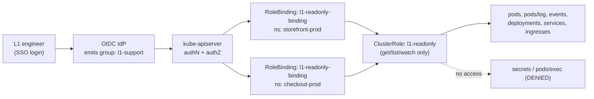
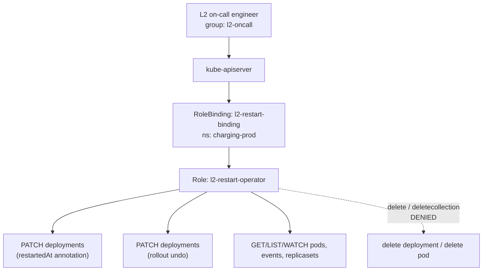
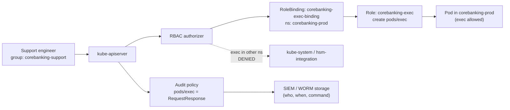
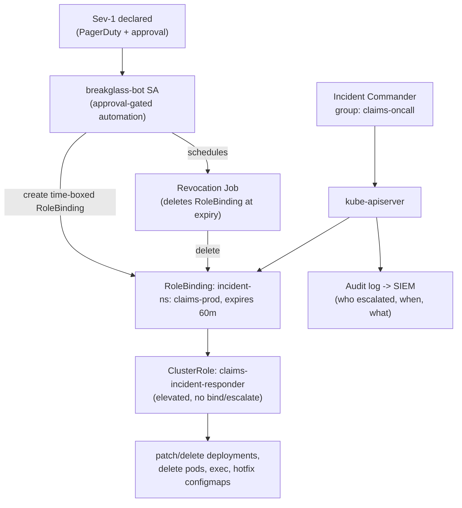
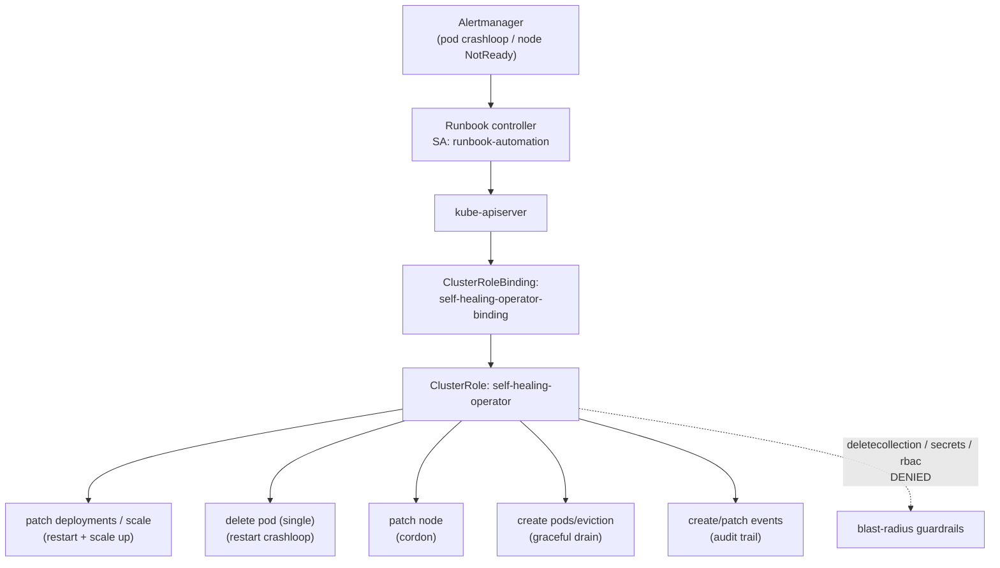

# Production Support / On-call

Real-world RBAC designs for tiered production support, on-call operators, and automated self-healing — where the wrong verb on the wrong resource is a live-site incident waiting to happen.

## Scenario 31 — L1 Support Read-Only Access to Pods and Logs in Production (E-Commerce)

**Company / Industry:** E-Commerce / Online Retail

### Business Requirement
A large online retailer runs its storefront, checkout, and catalog services across several production namespaces. The Level 1 (L1) support desk is the first responder for customer-facing alerts during peak sale events. They must be able to inspect pod status, read application logs, and view recent events to triage and correctly route an incident — but they must never be able to mutate production state, read Secrets, or shell into containers. The access must survive PCI-DSS and SOC 2 audits where "read-only means read-only."

### Existing Problem
During the last flash sale, an L1 engineer was granted the built-in `edit` ClusterRole "temporarily" to look at logs, because nobody had built a proper read-only role. That engineer accidentally scaled the `checkout` deployment to zero while poking around, causing a 12-minute checkout outage at peak traffic. Post-incident review found L1 tokens could also `get secrets`, exposing the payment gateway API key to a tier that has no need for it. Access was over-broad and blast radius was cluster-wide.

### Proposed RBAC Solution
Use a single reusable **ClusterRole** (`l1-readonly`) that enumerates only safe read verbs, and bind it with **RoleBindings** — one per production namespace — to the corporate SSO **Group** `l1-support` (delivered via OIDC). ClusterRole is chosen because the permission set is identical across namespaces and should be defined once; RoleBinding (not ClusterRoleBinding) is chosen because L1 must only see the explicitly whitelisted production namespaces, not every namespace including `kube-system` or `payments`. A Group subject (not individual users) is chosen so on-boarding/off-boarding an L1 engineer is an identity-provider action, never a `kubectl` change. Crucially, the ClusterRole omits `secrets` entirely and omits the `pods/exec` subresource.

### Kubernetes Resources
- Pods and Pods logs (`pods`, `pods/log`)
- Events (`events`, and `events.events.k8s.io`)
- Deployments, ReplicaSets, StatefulSets, DaemonSets (`apps`)
- Services, Endpoints, EndpointSlices
- ConfigMaps, PersistentVolumeClaims
- Ingresses (`networking.k8s.io`)
- HorizontalPodAutoscalers (`autoscaling`)

### Required Permissions
- `pods`, `pods/log` → `get`, `list`, `watch` — triage pod health and read logs.
- `events`, `events.events.k8s.io/events` → `get`, `list`, `watch` — see crash/backoff/scheduling reasons.
- `deployments`, `replicasets`, `statefulsets`, `daemonsets` → `get`, `list`, `watch` — see desired vs. ready replicas.
- `services`, `endpoints`, `endpointslices`, `ingresses` → `get`, `list`, `watch` — confirm routing/endpoints.
- `configmaps`, `persistentvolumeclaims`, `horizontalpodautoscalers` → `get`, `list`, `watch` — inspect non-secret config and scaling.
- Explicitly **no** `secrets` (any verb), **no** `pods/exec`, **no** `pods/portforward`, and **no** write verbs (`create`, `update`, `patch`, `delete`, `deletecollection`).

### Architecture Diagram


### YAML Implementation
```yaml
apiVersion: rbac.authorization.k8s.io/v1
kind: ClusterRole
metadata:
  name: l1-readonly
  labels:
    app.kubernetes.io/part-of: support-rbac
    support.tier: l1
rules:
  - apiGroups: [""]
    resources: ["pods", "pods/log", "services", "endpoints", "configmaps", "persistentvolumeclaims", "events"]
    verbs: ["get", "list", "watch"]
  - apiGroups: ["apps"]
    resources: ["deployments", "replicasets", "statefulsets", "daemonsets"]
    verbs: ["get", "list", "watch"]
  - apiGroups: ["networking.k8s.io"]
    resources: ["ingresses"]
    verbs: ["get", "list", "watch"]
  - apiGroups: ["discovery.k8s.io"]
    resources: ["endpointslices"]
    verbs: ["get", "list", "watch"]
  - apiGroups: ["autoscaling"]
    resources: ["horizontalpodautoscalers"]
    verbs: ["get", "list", "watch"]
  - apiGroups: ["events.k8s.io"]
    resources: ["events"]
    verbs: ["get", "list", "watch"]
---
apiVersion: rbac.authorization.k8s.io/v1
kind: RoleBinding
metadata:
  name: l1-readonly-binding
  namespace: storefront-prod
  labels:
    support.tier: l1
subjects:
  - kind: Group
    name: l1-support
    apiGroup: rbac.authorization.k8s.io
roleRef:
  kind: ClusterRole
  name: l1-readonly
  apiGroup: rbac.authorization.k8s.io
---
apiVersion: rbac.authorization.k8s.io/v1
kind: RoleBinding
metadata:
  name: l1-readonly-binding
  namespace: checkout-prod
  labels:
    support.tier: l1
subjects:
  - kind: Group
    name: l1-support
    apiGroup: rbac.authorization.k8s.io
roleRef:
  kind: ClusterRole
  name: l1-readonly
  apiGroup: rbac.authorization.k8s.io
---
apiVersion: rbac.authorization.k8s.io/v1
kind: RoleBinding
metadata:
  name: l1-readonly-binding
  namespace: catalog-prod
  labels:
    support.tier: l1
subjects:
  - kind: Group
    name: l1-support
    apiGroup: rbac.authorization.k8s.io
roleRef:
  kind: ClusterRole
  name: l1-readonly
  apiGroup: rbac.authorization.k8s.io
```

### Commands
```bash
# Apply the reusable read-only ClusterRole
kubectl apply -f l1-readonly.yaml

# Confirm the ClusterRole exists and carries only read verbs
kubectl get clusterrole l1-readonly -o yaml

# Confirm bindings landed in each production namespace
kubectl -n storefront-prod get rolebinding l1-readonly-binding
kubectl -n checkout-prod   get rolebinding l1-readonly-binding
kubectl -n catalog-prod    get rolebinding l1-readonly-binding
```

### Verification
```bash
# ALLOW: read pods and logs in a whitelisted namespace
kubectl auth can-i list pods       --as-group=l1-support -n storefront-prod
kubectl auth can-i get  pods/log   --as-group=l1-support -n checkout-prod

# DENY: no writes, no secrets, no exec
kubectl auth can-i delete pods            --as-group=l1-support -n storefront-prod
kubectl auth can-i update deployments     --as-group=l1-support -n checkout-prod
kubectl auth can-i get secrets            --as-group=l1-support -n checkout-prod
kubectl auth can-i create pods/exec       --as-group=l1-support -n storefront-prod

# DENY: namespace not whitelisted (payments is out of scope for L1)
kubectl auth can-i list pods              --as-group=l1-support -n payments

# Real-world impersonated read + full permission dump
kubectl --as=jane@shopfoo.com --as-group=l1-support -n storefront-prod get pods
kubectl auth can-i --list  --as-group=l1-support -n storefront-prod
```

### Expected Output
```text
# ALLOW
$ kubectl auth can-i list pods --as-group=l1-support -n storefront-prod
yes
$ kubectl auth can-i get pods/log --as-group=l1-support -n checkout-prod
yes

# DENY
$ kubectl auth can-i delete pods --as-group=l1-support -n storefront-prod
no
$ kubectl auth can-i get secrets --as-group=l1-support -n checkout-prod
no
$ kubectl auth can-i create pods/exec --as-group=l1-support -n storefront-prod
no
$ kubectl auth can-i list pods --as-group=l1-support -n payments
no

# Attempting a forbidden write as L1
$ kubectl --as=jane@shopfoo.com --as-group=l1-support -n storefront-prod scale deploy/checkout --replicas=0
Error from server (Forbidden): deployments.apps "checkout" is forbidden: User "jane@shopfoo.com" cannot patch resource "deployments/scale" in API group "apps" in the namespace "storefront-prod"
```

### Common Mistakes
- Reaching for the built-in `view` ClusterRole and assuming it is safe — `view` still grants read on `secrets` in older assumptions and, more importantly, teams often bind it cluster-wide with a ClusterRoleBinding, exposing every namespace.
- Forgetting that `pods/log` is a distinct subresource; granting `get pods` without `get pods/log` leaves L1 unable to read logs.
- Using a ClusterRoleBinding for convenience, which silently grants read into `kube-system`, `payments`, and CI namespaces.
- Adding `pods/exec` "so they can debug" — that turns a read-only tier into a shell-into-production tier.
- Binding to individual users, so every hire/leaver requires a `kubectl` change and drift accumulates.

### Troubleshooting
- If an L1 engineer gets `Forbidden` on logs but can list pods, verify the `pods/log` subresource is in the ClusterRole rules.
- Run `kubectl auth can-i --list --as-group=l1-support -n storefront-prod` to see the exact effective permission matrix for the group.
- If access works in one namespace but not another, the RoleBinding is missing in that namespace — remember each namespace needs its own RoleBinding to the ClusterRole.
- Confirm the OIDC token actually carries the `l1-support` group: `kubectl get --raw /api/v1/namespaces/storefront-prod/pods` fails with the user in the message; check the IdP group claim mapping (`--oidc-groups-claim`).
- A common apiGroup mistake: events exist in both the core group (`""`) and `events.k8s.io`; include both or log tooling may miss records.

### Best Practice
Mature retailers define read-only support access **once** as a ClusterRole and project it into a curated list of production namespaces via GitOps (Argo CD / Flux), so the whitelist is code-reviewed. Subjects are always SSO groups synced from Okta/Entra ID, never raw users or long-lived certs. The read-only role is validated in CI with a policy test (OPA/Conftest or `kubectl auth can-i` assertions) that fails the pipeline if `secrets` or `exec` ever appear in the L1 role. Namespaces holding regulated data (`payments`, `pii`) are deliberately excluded from the L1 binding set.

### Security Notes
The design enforces least privilege by verb (read-only) and by resource (no `secrets`, no `pods/exec`). Blast radius is bounded to named production namespaces, so a stolen L1 token cannot enumerate cluster Secrets or reach `kube-system`. Excluding `pods/exec`/`pods/portforward` prevents lateral movement into container runtimes. Because the subject is a group, deprovisioning in the IdP instantly revokes cluster access with no orphaned bindings. The absence of any write verb means a compromised L1 credential cannot cause a live-site incident.

### Interview Questions
1. Why bind a ClusterRole with a RoleBinding instead of a ClusterRoleBinding for L1 read-only access?
2. `get pods` works but `kubectl logs` returns Forbidden. What is missing and why?
3. How do you guarantee L1 can never read Secrets, and how would you prove it in an audit?
4. Why prefer a Group subject over listing individual users in the RoleBinding?
5. The built-in `view` ClusterRole exists — why build a custom `l1-readonly` instead?

### Interview Answers
1. A RoleBinding referencing a ClusterRole grants the ClusterRole's rules **only within the RoleBinding's namespace**. This lets us define the permission set once and scope it to a whitelist of production namespaces, keeping `kube-system`, `payments`, and CI namespaces out of reach. A ClusterRoleBinding would grant those same read rights across every namespace in the cluster — far too broad for L1.
2. `pods/log` is a separate subresource from `pods`. `kubectl logs` calls `GET .../pods/<name>/log`, so the role needs an explicit rule with `resources: ["pods/log"]` and verb `get`. Granting `get` on `pods` alone authorizes the pod object but not its log subresource.
3. Never include `secrets` in any rule of the ClusterRole, and add no wildcard `resources: ["*"]`. Prove it with `kubectl auth can-i get secrets --as-group=l1-support -n checkout-prod` returning `no`, and by dumping `kubectl auth can-i --list` for the group in CI as an audit artifact. A wildcard-free, explicit allowlist is the audit-defensible pattern.
4. Groups decouple identity lifecycle from cluster config. On-boarding and off-boarding become IdP membership changes; there is no `kubectl` edit, no risk of an orphaned binding for a departed employee, and one binding covers the entire team. Listing users creates drift and manual toil.
5. `view` is a broad, cluster-shipped role you do not control; its rule set can change across versions and teams routinely bind it too widely. A purpose-built `l1-readonly` is explicit, minimal, version-pinned in Git, and testable — you can assert exactly which resources and verbs it contains and fail CI if that ever drifts.

### Follow-up Questions
- How would you extend this so L1 can read logs but the log *contents* are redacted for PII before reaching them?
- If an L1 engineer needs one-off read access to a namespace not on the whitelist, what just-in-time mechanism would you use instead of editing the ClusterRole?
- How do you detect and alert when someone binds `l1-support` to a more powerful role by mistake?
- How would aggregated ClusterRoles change this design if you had L1/L2/L3 tiers sharing base read rights?

### Production Tips
Amazon EKS shops map IAM/Identity Center groups to Kubernetes groups and keep read-only support roles in GitOps, asserting them with `kubectl auth can-i` tests in CodePipeline. Google GKE customers wire `gke-security-groups` so `l1-support@company.com` is a first-class RBAC Group subject. Flipkart and Swiggy, running very large multi-tenant clusters, template per-namespace read-only RoleBindings from a single ClusterRole via Flux, and exclude payment/PII namespaces from the support projection. Freshworks and Zoho gate the L1 role in CI with OPA Gatekeeper policies that reject any support role containing `secrets` or `exec`.

## Scenario 32 — L2 Support Can Restart Deployments (Rollout Restart / Patch) but Cannot Delete (Telecom)

**Company / Industry:** Telecommunications / Mobile Network Operator

### Business Requirement
A telecom operator runs charging, session-management, and SMS-gateway microservices on Kubernetes. Level 2 (L2) on-call engineers must be able to perform the single most common remediation — a rolling restart of a stuck deployment (`kubectl rollout restart`) — and roll workloads back to a previous revision, without waiting for a platform engineer at 3 a.m. However, they must **not** be able to delete Deployments, delete Pods directly, or delete namespaces, because deleting a network-function workload can drop live subscriber sessions and breach the operator's regulatory uptime SLA.

### Existing Problem
Previously, L2 shared a break-glass kubeconfig tied to the `cluster-admin` ClusterRole. During an SMS-gateway degradation, an L2 engineer meant to restart the deployment but ran `kubectl delete deployment sms-gateway`, deleting the workload entirely and taking the gateway fully offline for 25 minutes during a national alert broadcast window. The operator needs L2 to have exactly the restart/rollback capability and nothing destructive.

### Proposed RBAC Solution
Use a namespaced **Role** (`l2-restart-operator`) bound with a **RoleBinding** to the SSO **Group** `l2-oncall`, applied to each network-function namespace. A Role (not ClusterRole) is chosen because L2 responsibility is scoped to the network-function namespaces, not platform namespaces. The pivotal design decision is the verb set: `kubectl rollout restart` is implemented as a **PATCH** to the Deployment's pod-template annotations (`kubectl.kubernetes.io/restartedAt`), and `kubectl rollout undo` is also a PATCH. So we grant `get`, `list`, `watch`, `patch`, and `update` on workloads — and deliberately **exclude** `delete` and `deletecollection`. Pods remain read-only; L2 restarts by rolling the controller, never by deleting Pods.

### Kubernetes Resources
- Deployments, StatefulSets, DaemonSets (`apps`)
- ReplicaSets and ControllerRevisions (for rollout history / undo)
- Pods and Pods logs (read-only, to watch the restart progress)
- Events (to observe rollout progress and failures)

### Required Permissions
- `deployments`, `statefulsets`, `daemonsets` → `get`, `list`, `watch`, `patch`, `update` — `rollout restart` and `rollout undo` are PATCH operations; `update` covers clients that PUT the full object.
- `replicasets`, `controllerrevisions` → `get`, `list`, `watch` — `rollout history`/`undo` reads prior revisions.
- `deployments/scale` intentionally **not** granted (L2 restarts, it does not resize capacity).
- `pods`, `pods/log` → `get`, `list`, `watch` — observe the new pods coming up. No `delete` on pods.
- `events` → `get`, `list`, `watch` — surface `ProgressDeadlineExceeded` and image-pull failures.
- Explicitly **no** `delete`, **no** `deletecollection`, **no** `create` on any workload; no access to `secrets`.

### Architecture Diagram


### YAML Implementation
```yaml
apiVersion: rbac.authorization.k8s.io/v1
kind: Role
metadata:
  name: l2-restart-operator
  namespace: charging-prod
  labels:
    app.kubernetes.io/part-of: support-rbac
    support.tier: l2
rules:
  # Restart + rollback are PATCH/UPDATE on the workload controllers. No delete.
  - apiGroups: ["apps"]
    resources: ["deployments", "statefulsets", "daemonsets"]
    verbs: ["get", "list", "watch", "patch", "update"]
  # Reading rollout history / previous revisions for `rollout undo`.
  - apiGroups: ["apps"]
    resources: ["replicasets", "controllerrevisions"]
    verbs: ["get", "list", "watch"]
  # Observe the restart progress. Pods are strictly read-only here.
  - apiGroups: [""]
    resources: ["pods", "pods/log"]
    verbs: ["get", "list", "watch"]
  - apiGroups: [""]
    resources: ["events"]
    verbs: ["get", "list", "watch"]
  - apiGroups: ["events.k8s.io"]
    resources: ["events"]
    verbs: ["get", "list", "watch"]
---
apiVersion: rbac.authorization.k8s.io/v1
kind: RoleBinding
metadata:
  name: l2-restart-binding
  namespace: charging-prod
  labels:
    support.tier: l2
subjects:
  - kind: Group
    name: l2-oncall
    apiGroup: rbac.authorization.k8s.io
roleRef:
  kind: Role
  name: l2-restart-operator
  apiGroup: rbac.authorization.k8s.io
---
# Same Role/Binding replicated into the SMS-gateway namespace.
apiVersion: rbac.authorization.k8s.io/v1
kind: Role
metadata:
  name: l2-restart-operator
  namespace: sms-gateway-prod
  labels:
    support.tier: l2
rules:
  - apiGroups: ["apps"]
    resources: ["deployments", "statefulsets", "daemonsets"]
    verbs: ["get", "list", "watch", "patch", "update"]
  - apiGroups: ["apps"]
    resources: ["replicasets", "controllerrevisions"]
    verbs: ["get", "list", "watch"]
  - apiGroups: [""]
    resources: ["pods", "pods/log", "events"]
    verbs: ["get", "list", "watch"]
  - apiGroups: ["events.k8s.io"]
    resources: ["events"]
    verbs: ["get", "list", "watch"]
---
apiVersion: rbac.authorization.k8s.io/v1
kind: RoleBinding
metadata:
  name: l2-restart-binding
  namespace: sms-gateway-prod
  labels:
    support.tier: l2
subjects:
  - kind: Group
    name: l2-oncall
    apiGroup: rbac.authorization.k8s.io
roleRef:
  kind: Role
  name: l2-restart-operator
  apiGroup: rbac.authorization.k8s.io
```

### Commands
```bash
# Apply Roles + RoleBindings for both network-function namespaces
kubectl apply -f l2-restart-operator.yaml

# Verify the Role carries patch but not delete
kubectl -n charging-prod get role l2-restart-operator -o yaml | grep -A2 verbs

# Real remediation flow an L2 engineer would run:
kubectl --as-group=l2-oncall -n charging-prod rollout restart deployment/charging-api   # PATCH
kubectl --as-group=l2-oncall -n charging-prod rollout status  deployment/charging-api   # watch
kubectl --as-group=l2-oncall -n charging-prod rollout undo    deployment/charging-api   # rollback (PATCH)
```

### Verification
```bash
# ALLOW: restart (patch) and observe
kubectl auth can-i patch deployments --as-group=l2-oncall -n charging-prod
kubectl auth can-i get   pods/log    --as-group=l2-oncall -n charging-prod
kubectl auth can-i list  replicasets --as-group=l2-oncall -n charging-prod

# DENY: destructive verbs and pod deletion
kubectl auth can-i delete deployments        --as-group=l2-oncall -n charging-prod
kubectl auth can-i deletecollection pods      --as-group=l2-oncall -n charging-prod
kubectl auth can-i delete pods                --as-group=l2-oncall -n charging-prod
kubectl auth can-i patch deployments/scale    --as-group=l2-oncall -n charging-prod

# End-to-end proof: a real restart succeeds, a real delete is blocked
kubectl --as-group=l2-oncall -n charging-prod rollout restart deployment/charging-api
kubectl --as-group=l2-oncall -n charging-prod delete deployment charging-api
```

### Expected Output
```text
# ALLOW
$ kubectl auth can-i patch deployments --as-group=l2-oncall -n charging-prod
yes
$ kubectl --as-group=l2-oncall -n charging-prod rollout restart deployment/charging-api
deployment.apps/charging-api restarted

# DENY
$ kubectl auth can-i delete deployments --as-group=l2-oncall -n charging-prod
no
$ kubectl auth can-i delete pods --as-group=l2-oncall -n charging-prod
no
$ kubectl auth can-i patch deployments/scale --as-group=l2-oncall -n charging-prod
no

# Attempting the exact mistake that caused the last outage
$ kubectl --as-group=l2-oncall -n charging-prod delete deployment charging-api
Error from server (Forbidden): deployments.apps "charging-api" is forbidden: User "system:anonymous" cannot delete resource "deployments" in API group "apps" in the namespace "charging-prod"
```

### Common Mistakes
- Assuming `rollout restart` needs `delete` or `create` — it is purely a PATCH on the pod-template annotation; granting delete is over-provisioning.
- Granting `delete pods` "so they can restart a single pod" — this reintroduces the destructive capability the design exists to remove, and directly deleting a Pod bypasses controlled rollout.
- Adding `deployments/scale` and calling it "restart" — scaling to zero is exactly the incident this scenario prevents.
- Forgetting `controllerrevisions`/`replicasets` read, which makes `rollout undo` and `rollout history` fail even though restart works.
- Using a ClusterRole+ClusterRoleBinding, letting L2 patch (and therefore restart) workloads in platform namespaces like `istio-system`.

### Troubleshooting
- `rollout restart` returns Forbidden but `get deployment` works → the role is missing `patch` on `deployments`.
- `rollout undo` fails with a Forbidden on `replicasets`/`controllerrevisions` → add those read rules.
- Verify effective verbs with `kubectl auth can-i --list --as-group=l2-oncall -n charging-prod` and confirm `delete` is absent for `deployments` and `pods`.
- If restart succeeds but pods never become ready, the RBAC is fine — inspect `kubectl -n charging-prod describe deploy charging-api` and events for `ProgressDeadlineExceeded`, image pull, or quota errors.
- Confirm the binding is a `Role`/`RoleBinding` pair (namespaced) and that the engineer is hitting the right namespace; a missing binding in `sms-gateway-prod` is the usual "works here, not there" cause.

### Best Practice
Telecoms treat restart-but-not-delete as a named capability role, provisioned per network-function namespace through GitOps, and pin it with an admission policy (Kyverno/Gatekeeper) that blocks `delete` on Deployments in production regardless of RBAC as defense-in-depth. Rollbacks are preferred over deletes, and `rollout undo` is documented in the runbook. L2 groups come from the corporate IdP, and every PATCH is captured in the audit log and shipped to the SIEM so a restart storm is detectable.

### Security Notes
Excluding `delete`/`deletecollection` removes the ability to cause a hard outage of a live network function; the worst case is a rolling restart, which is self-healing. Keeping Pods read-only forces remediation through the controller's controlled rollout rather than ad-hoc pod deletion, preserving PodDisruptionBudget guarantees. Namespaced scoping keeps L2 out of platform and mesh namespaces. Because `secrets` are absent, a compromised L2 token cannot exfiltrate charging credentials. Pairing RBAC with a Kyverno "no delete deployments in prod" policy means even a future RBAC misconfiguration cannot reintroduce the destructive path.

### Interview Questions
1. Precisely which HTTP verb does `kubectl rollout restart` issue, and what RBAC verb must you therefore grant?
2. How do you allow restart and rollback while guaranteeing L2 cannot delete a Deployment or a Pod?
3. Why is `deployments/scale` deliberately excluded from this role?
4. What additional resources must be readable for `rollout undo` to work, and why?
5. RBAC already blocks delete — why also add a Kyverno/Gatekeeper policy?

### Interview Answers
1. `rollout restart` issues an HTTP **PATCH** against the Deployment, injecting/updating the `kubectl.kubernetes.io/restartedAt` annotation on the pod template, which triggers a rolling update. The corresponding RBAC verb is `patch` on `deployments` in the `apps` API group (`update` is added to cover clients that send a full PUT).
2. Grant `get/list/watch/patch/update` on `deployments/statefulsets/daemonsets` and keep Pods read-only (`get/list/watch` only). Do **not** include `delete` or `deletecollection` anywhere. Restart and undo are patches; delete is simply never authorized, verified by `kubectl auth can-i delete deployments` returning `no`.
3. `deployments/scale` allows changing replica counts, including scaling to zero — the precise action that caused the prior outage. Restart does not require it, so per least privilege it is excluded; capacity changes belong to a higher tier or an autoscaler.
4. `rollout undo` and `rollout history` read prior state from `replicasets` and `controllerrevisions` (StatefulSets/DaemonSets use ControllerRevisions). Without `get/list/watch` on those, undo fails with Forbidden even though the restart patch is allowed.
5. RBAC is identity-scoped and can drift or be widened by a future change; an admission policy is a cluster-wide invariant enforced at write time regardless of who the caller is. Defense-in-depth means even a mis-scoped ClusterRoleBinding or a compromised higher-privilege account is still blocked from deleting production Deployments.

### Follow-up Questions
- How would you allow L2 to restart only a specific subset of deployments (e.g., by label) rather than all in the namespace?
- If an engineer needs to delete a genuinely stuck Pod, what controlled escalation would you provide instead of granting `delete pods`?
- How do you rate-limit or alert on "restart storms" where L2 patches many deployments in a short window?
- Would you grant `patch` on `daemonsets` in a namespace hosting node-level agents, and what is the risk?

### Production Tips
Uber and PhonePe implement tiered on-call RBAC where L2 gets patch-based restart/rollback but destructive verbs live only in audited break-glass paths. Red Hat OpenShift ships this pattern as scoped Roles plus admission policies, and many operators pair it with Kyverno rules blocking `delete` on production Deployments. Cisco and VMware Tanzu customers running telco network functions layer PodDisruptionBudgets with restart-only RBAC so a rolling restart can never violate subscriber-session availability guarantees, and every PATCH is streamed to Splunk for restart-rate anomaly detection.

## Scenario 33 — Support Exec Restricted to One Namespace With Full Audit (Banking)

**Company / Industry:** Banking / Core Banking Platform

### Business Requirement
A retail bank runs its core-banking transaction processor in a dedicated `corebanking-prod` namespace. Support engineers occasionally need to `kubectl exec` into a running pod to run a vendor-supplied diagnostic CLI that has no equivalent REST/metrics interface. Regulators (RBI / PCI-DSS) require that any interactive shell into a system handling cardholder or account data is (a) restricted to a single, explicitly approved namespace, and (b) fully audited — who, when, which pod, which command — with tamper-evident logs retained for the mandated period.

### Existing Problem
Support engineers held a ClusterRole granting `create` on `pods/exec` cluster-wide, so an exec into `corebanking-prod` was indistinguishable, permission-wise, from an exec into `kube-system` or `hsm-integration`. Worse, the cluster's audit policy logged exec only at `Metadata` level, so incident responders could see *that* an exec happened but not *which command* was run inside the container — a finding flagged as a critical control gap in the last regulatory audit.

### Proposed RBAC Solution
Use a namespaced **Role** (`corebanking-exec`) bound with a **RoleBinding** to the **Group** `corebanking-support`, scoped strictly to `corebanking-prod`. The exec capability is the `create` verb on the `pods/exec` subresource — no other namespace, no wildcard. Complement RBAC with a **kube-apiserver audit policy** that logs `pods/exec` at `RequestResponse` level so the full command line and I/O metadata are captured. RBAC alone controls *access*; the audit policy provides the *accountability* the regulator requires. Group subjects come from the bank's IdP so membership is governed by joiner/mover/leaver workflows.

### Kubernetes Resources
- Pods (`pods`) — read, to select the target pod
- Pods exec subresource (`pods/exec`)
- Pods logs (`pods/log`)
- Audit records for the `pods/exec` subresource (apiserver audit backend)

### Required Permissions
- `pods` → `get`, `list`, `watch` — locate and identify the target pod before exec.
- `pods/log` → `get` — read logs alongside the interactive session.
- `pods/exec` → `create` — the interactive shell / diagnostic command. `create` is the only verb the API server checks for exec (the exec channel is established via a POST that RBAC authorizes as `create`).
- Explicitly **no** `pods/exec` outside `corebanking-prod`, **no** `create` on `pods/attach` or `pods/portforward`, **no** write/delete on pods, and **no** `secrets`.

### Architecture Diagram


### YAML Implementation
```yaml
apiVersion: rbac.authorization.k8s.io/v1
kind: Role
metadata:
  name: corebanking-exec
  namespace: corebanking-prod
  labels:
    app.kubernetes.io/part-of: support-rbac
    compliance: pci-dss
rules:
  # Locate the target pod and read its logs.
  - apiGroups: [""]
    resources: ["pods", "pods/log"]
    verbs: ["get", "list", "watch"]
  # The interactive shell. Exec is authorized as `create` on pods/exec.
  - apiGroups: [""]
    resources: ["pods/exec"]
    verbs: ["create"]
---
apiVersion: rbac.authorization.k8s.io/v1
kind: RoleBinding
metadata:
  name: corebanking-exec-binding
  namespace: corebanking-prod
  labels:
    compliance: pci-dss
subjects:
  - kind: Group
    name: corebanking-support
    apiGroup: rbac.authorization.k8s.io
roleRef:
  kind: Role
  name: corebanking-exec
  apiGroup: rbac.authorization.k8s.io
---
# kube-apiserver audit policy (mounted and referenced via
# --audit-policy-file=/etc/kubernetes/audit/policy.yaml on the API server).
# Captures full command + response metadata for exec into corebanking-prod.
apiVersion: audit.k8s.io/v1
kind: Policy
# Do not log request bodies for read-only, high-volume, or token endpoints.
omitStages:
  - "RequestReceived"
rules:
  # Full-fidelity audit for exec/attach into the regulated namespace.
  - level: RequestResponse
    namespaces: ["corebanking-prod"]
    verbs: ["create"]
    resources:
      - group: ""
        resources: ["pods/exec", "pods/attach"]
  # Metadata-level for other write actions in the namespace.
  - level: Metadata
    namespaces: ["corebanking-prod"]
    resources:
      - group: ""
        resources: ["pods", "pods/log"]
  # Drop noisy read-only system traffic to keep the log actionable.
  - level: None
    users: ["system:kube-scheduler", "system:kube-controller-manager"]
  - level: Metadata
```

### Commands
```bash
# 1) Apply the namespaced Role + RoleBinding
kubectl apply -f corebanking-exec.yaml

# 2) Install the audit policy on the API server (managed control plane example:
#    set via cluster provider; self-managed example shown here)
sudo cp policy.yaml /etc/kubernetes/audit/policy.yaml
# Ensure the kube-apiserver manifest has:
#   --audit-policy-file=/etc/kubernetes/audit/policy.yaml
#   --audit-log-path=/var/log/kubernetes/audit/audit.log
#   --audit-log-maxage=30 --audit-log-maxbackup=10
# then let the static pod restart, or on managed clusters enable audit logging
# (EKS control-plane logging / GKE Cloud Audit Logs / AKS diagnostic settings).

# 3) A real exec an approved engineer runs
kubectl --as-group=corebanking-support -n corebanking-prod exec -it corebanking-tx-0 -- /opt/vendor/diag --status
```

### Verification
```bash
# ALLOW: exec only inside the approved namespace
kubectl auth can-i create pods/exec --as-group=corebanking-support -n corebanking-prod
kubectl auth can-i list   pods      --as-group=corebanking-support -n corebanking-prod

# DENY: exec anywhere else, and attach/portforward even in-namespace
kubectl auth can-i create pods/exec        --as-group=corebanking-support -n kube-system
kubectl auth can-i create pods/exec        --as-group=corebanking-support -n hsm-integration
kubectl auth can-i create pods/attach      --as-group=corebanking-support -n corebanking-prod
kubectl auth can-i create pods/portforward --as-group=corebanking-support -n corebanking-prod
kubectl auth can-i delete pods             --as-group=corebanking-support -n corebanking-prod

# Prove the audit trail captured the command
sudo grep 'pods/exec' /var/log/kubernetes/audit/audit.log | tail -n1 | jq '{user:.user.username, verb:.verb, uri:.requestURI, stage:.stage}'
```

### Expected Output
```text
# ALLOW
$ kubectl auth can-i create pods/exec --as-group=corebanking-support -n corebanking-prod
yes

# DENY
$ kubectl auth can-i create pods/exec --as-group=corebanking-support -n kube-system
no
$ kubectl auth can-i create pods/attach --as-group=corebanking-support -n corebanking-prod
no

# Attempting to exec into a different namespace
$ kubectl --as-group=corebanking-support -n hsm-integration exec -it hsm-proxy-0 -- sh
Error from server (Forbidden): pods "hsm-proxy-0" is forbidden: User "system:anonymous" cannot create resource "pods/exec" in API group "" in the namespace "hsm-integration"

# Audit record proving full-command capture (RequestResponse level)
$ sudo grep 'pods/exec' /var/log/kubernetes/audit/audit.log | tail -n1 | jq '{user:.user.username, verb:.verb, uri:.requestURI, stage:.stage}'
{
  "user": "arun@bank.example",
  "verb": "create",
  "uri": "/api/v1/namespaces/corebanking-prod/pods/corebanking-tx-0/exec?command=%2Fopt%2Fvendor%2Fdiag&command=--status&container=tx&stdin=true&stdout=true&tty=true",
  "stage": "ResponseComplete"
}
```

### Common Mistakes
- Believing exec needs `get` on `pods/exec` — the API server authorizes exec as `create` on the `pods/exec` subresource; a `get` rule does nothing for exec.
- Granting exec via a ClusterRole+ClusterRoleBinding, which authorizes exec into every namespace including `kube-system`.
- Leaving the audit policy at `Metadata` for exec, so the executed command is never recorded — the exact regulatory gap here.
- Forgetting that `pods/attach` and `pods/portforward` are separate subresources; an engineer who cannot exec can still `attach` if you accidentally grant it.
- Assuming managed clusters audit exec by default — you must explicitly enable control-plane audit logging (EKS/GKE/AKS) and set the policy.

### Troubleshooting
- Exec fails with Forbidden but `get pods` works → the Role is missing `create` on `pods/exec`.
- Exec works but nothing shows in the audit log → the policy is not loaded (`--audit-policy-file`), the rule doesn't match the namespace/subresource, or `RequestReceived` was the only stage logged. Check `kube-apiserver` flags and the policy rule order (first match wins).
- Exec works in a namespace it should not → an inherited ClusterRoleBinding grants `pods/exec`; run `kubectl auth can-i create pods/exec --as-group=corebanking-support -n <other>` and hunt the binding with `kubectl get clusterrolebindings -o wide`.
- Use `kubectl auth can-i --list --as-group=corebanking-support -n corebanking-prod` to confirm `pods/exec [create]` is present and `pods/attach` is not.
- If the vendor CLI needs a TTY, that is a client flag (`-it`), not an RBAC concern.

### Best Practice
Banks scope exec to the single regulated namespace, drive membership through IdP groups with periodic access recertification, and configure the audit policy at `RequestResponse` for `pods/exec`/`pods/attach`, streaming records to write-once (WORM) storage in the SIEM. Many go further and route interactive access through a session-recording bastion (Teleport / Boundary) so keystrokes are captured even inside the container, with Kubernetes RBAC as the coarse gate and the bastion as the fine-grained recorder. Exec is often additionally time-boxed via just-in-time access.

### Security Notes
`create pods/exec` is one of the most dangerous grants in Kubernetes: an interactive shell can read mounted Secrets, dump memory, and pivot using the pod's ServiceAccount token. Restricting exec to one namespace bounds blast radius to non-HSM, non-system workloads. Denying `pods/attach`/`pods/portforward` closes side channels to the same capability. The `RequestResponse` audit rule ensures every command is attributable and non-repudiable, satisfying regulatory accountability and enabling forensic reconstruction after an incident. Because Secrets are not readable via the API for this group, exfiltration must go through the (audited) exec channel, not silent `get secrets`.

### Interview Questions
1. Which RBAC verb and subresource authorize `kubectl exec`, and why is `get pods/exec` insufficient?
2. How do you ensure the *command executed* inside the container is recorded, not just that an exec occurred?
3. Why restrict exec with a Role/RoleBinding rather than a ClusterRole/ClusterRoleBinding?
4. What is the difference between `pods/exec`, `pods/attach`, and `pods/portforward` from a security standpoint?
5. Even with exec restricted to one namespace, what can an attacker with that exec do, and how do you contain it?

### Interview Answers
1. `kubectl exec` opens a streaming connection via an HTTP POST to the `pods/exec` subresource, which RBAC authorizes as the **`create`** verb on `pods/exec`. `get` on that subresource is not what the API server checks for establishing an exec session, so a `get` rule grants nothing usable for exec.
2. Set a kube-apiserver audit policy rule at `level: RequestResponse` matching `resources: ["pods/exec"]` in the target namespace. The request URI embeds the `command=` parameters, so the full command line is captured, along with user, timestamp, and pod. Metadata level records only that an exec happened, not the command — insufficient for the regulator.
3. A namespaced Role/RoleBinding confines the exec grant to exactly `corebanking-prod`. A ClusterRole with a ClusterRoleBinding would authorize `create pods/exec` in every namespace, meaning support could shell into `kube-system` or `hsm-integration` — a catastrophic scope for an interactive shell.
4. All three are streaming subresources authorized by `create`. `exec` runs a new process in a container; `attach` connects to the container's main process stdio; `portforward` tunnels arbitrary TCP to the pod, enabling network pivoting. Each is a distinct escape hatch, so they must be granted (and denied) independently.
5. Inside an exec session an attacker can read mounted Secrets/config, use the pod's ServiceAccount token to call the API within that SA's rights, and probe the network. Containment: restrict the pod's ServiceAccount to minimal RBAC, avoid mounting unnecessary Secrets, apply NetworkPolicies, run containers as non-root with a restricted PodSecurity profile, and rely on the full audit trail plus session recording for detection and forensics.

### Follow-up Questions
- How would you make exec access just-in-time (granted for 30 minutes on ticket approval) rather than standing?
- If the audit log volume from `RequestResponse` is too high, how do you keep exec fidelity while trimming noise?
- How do you prevent an engineer from using the pod's ServiceAccount token, obtained via exec, to escalate?
- What controls capture keystrokes *inside* the container that the apiserver audit log cannot see?

### Production Tips
Banks and fintechs like Razorpay and Paytm scope exec to single regulated namespaces and enable `RequestResponse` audit for `pods/exec`, shipping to immutable SIEM storage. Amazon EKS customers enable control-plane audit logging to CloudWatch and alert on `pods/exec` events via metric filters; GKE routes the same to Cloud Audit Logs, and AKS to Azure Monitor diagnostic settings. Many regulated shops front Kubernetes exec with Teleport or HashiCorp Boundary for full session recording, using K8s RBAC as the authorization gate and the bastion as the keystroke recorder — a pattern common at IBM and Cisco for compliance-heavy workloads.

## Scenario 34 — Temporary Escalation Workflow for a Live Incident (Insurance)

**Company / Industry:** Insurance / Claims Processing Platform

### Business Requirement
An insurer's claims platform must keep standing production access at read-only for on-call SREs, per its "least standing privilege" security policy. During a Sev-1 incident, however, the designated Incident Commander needs elevated write access — restart, scale, patch config, delete stuck pods — for the *duration of the incident only*, scoped to the affected namespace, with the elevation automatically expiring and every action audited. This is a classic break-glass / just-in-time (JIT) escalation requirement driven by ISO 27001 and internal SOX-style controls.

### Existing Problem
The insurer had a permanent `claims-oncall-admin` group with standing write access "just in case." A phished on-call laptop gave an attacker standing write to production claims workloads for weeks before detection. Security mandated the removal of all standing elevated access; the challenge is doing so without slowing down genuine Sev-1 response, where minutes of delay directly increase customer impact and regulatory exposure.

### Proposed RBAC Solution
Keep the on-call group `claims-oncall` on a standing **read-only** RoleBinding. Pre-create a break-glass **ClusterRole** (`claims-incident-responder`) that is normally **bound to nobody**. When an incident is declared, an approval-gated automation (the "break-glass bot", running as a dedicated ServiceAccount) creates a **time-boxed RoleBinding** in the affected namespace linking the Incident Commander's user/group to that ClusterRole, annotated with the incident ID and an explicit expiry. A self-destructing **Job** (or a TTL controller) revokes the binding at expiry. ClusterRole is used so the elevated capability is defined once and reused for any namespace; a namespaced RoleBinding scopes each activation to a single blast-radius. We deliberately do **not** grant `escalate`, `bind`, or `impersonate` in the responder role, so the incident commander cannot mint further privilege.

### Kubernetes Resources
- ClusterRole `claims-incident-responder` (elevated, pre-created, unbound)
- Ephemeral RoleBinding (created per incident, auto-expiring)
- Deployments/StatefulSets, Pods, ConfigMaps, Events in the affected namespace
- ServiceAccount `breakglass-bot` and its ClusterRole/binding to manage the ephemeral binding
- A revocation Job (`batch/v1`) that deletes the ephemeral binding at expiry

### Required Permissions
Break-glass responder ClusterRole (`claims-incident-responder`):
- `deployments`, `statefulsets` → `get`, `list`, `watch`, `patch`, `update`, `delete` — restart, scale, and remove stuck controllers.
- `deployments/scale` → `get`, `update`, `patch` — emergency scale-up.
- `pods` → `get`, `list`, `watch`, `delete` — clear wedged pods.
- `pods/log` → `get`; `pods/exec` → `create` — live diagnosis.
- `configmaps` → `get`, `list`, `watch`, `update`, `patch` — hotfix config (not create/delete).
- `events` → `get`, `list`, `watch`.
- Explicitly **no** `secrets` write, **no** `bind`, **no** `escalate`, **no** `impersonate`, **no** access to `roles`/`rolebindings`/`clusterroles` (the responder cannot grant themselves more).

Break-glass bot ServiceAccount:
- `rolebindings` (rbac group) → `create`, `delete`, `get`, `list` in claims namespaces — to activate/revoke elevation, plus `bind` on the specific responder ClusterRole (required to create a binding that references it under the bind-permission rule).

### Architecture Diagram


### YAML Implementation
```yaml
# Standing, read-only access for on-call (always bound).
apiVersion: rbac.authorization.k8s.io/v1
kind: RoleBinding
metadata:
  name: claims-oncall-readonly
  namespace: claims-prod
subjects:
  - kind: Group
    name: claims-oncall
    apiGroup: rbac.authorization.k8s.io
roleRef:
  kind: ClusterRole
  name: view
  apiGroup: rbac.authorization.k8s.io
---
# Break-glass elevated ClusterRole. Pre-created, normally bound to NOBODY.
apiVersion: rbac.authorization.k8s.io/v1
kind: ClusterRole
metadata:
  name: claims-incident-responder
  labels:
    app.kubernetes.io/part-of: support-rbac
    access.type: break-glass
rules:
  - apiGroups: ["apps"]
    resources: ["deployments", "statefulsets"]
    verbs: ["get", "list", "watch", "patch", "update", "delete"]
  - apiGroups: ["apps"]
    resources: ["deployments/scale"]
    verbs: ["get", "update", "patch"]
  - apiGroups: [""]
    resources: ["pods"]
    verbs: ["get", "list", "watch", "delete"]
  - apiGroups: [""]
    resources: ["pods/log"]
    verbs: ["get"]
  - apiGroups: [""]
    resources: ["pods/exec"]
    verbs: ["create"]
  - apiGroups: [""]
    resources: ["configmaps"]
    verbs: ["get", "list", "watch", "update", "patch"]
  - apiGroups: [""]
    resources: ["events"]
    verbs: ["get", "list", "watch"]
  # NOTE: intentionally no secrets, no roles/rolebindings, no bind/escalate/impersonate.
---
# ServiceAccount for the approval-gated break-glass automation.
apiVersion: v1
kind: ServiceAccount
metadata:
  name: breakglass-bot
  namespace: incident-automation
---
# The bot may create/delete RoleBindings in claims namespaces, and is granted
# `bind` on exactly the responder ClusterRole so it can reference it safely.
apiVersion: rbac.authorization.k8s.io/v1
kind: ClusterRole
metadata:
  name: breakglass-bot-manager
rules:
  - apiGroups: ["rbac.authorization.k8s.io"]
    resources: ["rolebindings"]
    verbs: ["get", "list", "watch", "create", "delete"]
  - apiGroups: ["rbac.authorization.k8s.io"]
    resources: ["clusterroles"]
    resourceNames: ["claims-incident-responder"]
    verbs: ["bind"]
  - apiGroups: ["batch"]
    resources: ["jobs"]
    verbs: ["create", "get", "list", "delete"]
---
apiVersion: rbac.authorization.k8s.io/v1
kind: ClusterRoleBinding
metadata:
  name: breakglass-bot-manager-binding
subjects:
  - kind: ServiceAccount
    name: breakglass-bot
    namespace: incident-automation
roleRef:
  kind: ClusterRole
  name: breakglass-bot-manager
  apiGroup: rbac.authorization.k8s.io
---
# EXAMPLE of the ephemeral binding the bot creates for incident INC-20260714-0001.
# Annotated with incident id + expiry; ownerRef ties it to the revocation Job.
apiVersion: rbac.authorization.k8s.io/v1
kind: RoleBinding
metadata:
  name: incident-INC-20260714-0001
  namespace: claims-prod
  labels:
    access.type: break-glass
    incident.id: INC-20260714-0001
  annotations:
    breakglass.claims.example/requested-by: "maria@insure.example"
    breakglass.claims.example/approved-by: "duty-manager@insure.example"
    breakglass.claims.example/expires-at: "2026-07-14T15:30:00Z"
subjects:
  - kind: User
    name: maria@insure.example
    apiGroup: rbac.authorization.k8s.io
roleRef:
  kind: ClusterRole
  name: claims-incident-responder
  apiGroup: rbac.authorization.k8s.io
---
# Self-destructing revocation Job created alongside the binding. It waits out the
# window, deletes the binding, then TTL-cleans itself.
apiVersion: batch/v1
kind: Job
metadata:
  name: revoke-incident-INC-20260714-0001
  namespace: incident-automation
spec:
  ttlSecondsAfterFinished: 600
  backoffLimit: 2
  activeDeadlineSeconds: 7200
  template:
    spec:
      serviceAccountName: breakglass-bot
      restartPolicy: Never
      containers:
        - name: revoker
          image: bitnami/kubectl:1.33
          command: ["/bin/sh", "-c"]
          args:
            - |
              echo "Break-glass revoker for INC-20260714-0001 armed";
              sleep 3600;   # 60-minute escalation window
              kubectl -n claims-prod delete rolebinding incident-INC-20260714-0001 --ignore-not-found;
              echo "Elevated access for INC-20260714-0001 revoked at $(date -u)";
```

### Commands
```bash
# One-time platform setup: standing read-only + break-glass ClusterRole + bot
kubectl apply -f claims-oncall-readonly.yaml
kubectl apply -f claims-incident-responder.yaml
kubectl apply -f breakglass-bot.yaml

# --- Incident activation (performed by the approval-gated bot) ---
# 1) Create the time-boxed binding for the incident commander
kubectl apply -f incident-INC-20260714-0001-binding.yaml
# 2) Arm the self-destructing revocation Job (auto-revokes in 60 min)
kubectl apply -f revoke-incident-INC-20260714-0001-job.yaml

# --- Manual early revocation (incident resolved before expiry) ---
kubectl -n claims-prod delete rolebinding incident-INC-20260714-0001
kubectl -n incident-automation delete job revoke-incident-INC-20260714-0001
```

### Verification
```bash
# BEFORE escalation: on-call is read-only only
kubectl auth can-i patch deployments --as=maria@insure.example --as-group=claims-oncall -n claims-prod   # expect no
kubectl auth can-i get   pods        --as=maria@insure.example --as-group=claims-oncall -n claims-prod   # expect yes

# AFTER the bot creates the time-boxed binding: elevated in claims-prod only
kubectl auth can-i patch  deployments --as=maria@insure.example -n claims-prod   # expect yes
kubectl auth can-i delete pods        --as=maria@insure.example -n claims-prod   # expect yes
kubectl auth can-i create pods/exec   --as=maria@insure.example -n claims-prod   # expect yes

# The commander still cannot escalate privilege or touch secrets
kubectl auth can-i create rolebindings --as=maria@insure.example -n claims-prod  # expect no
kubectl auth can-i get    secrets      --as=maria@insure.example -n claims-prod  # expect no
kubectl auth can-i patch  deployments  --as=maria@insure.example -n payments-prod # expect no (scope)

# AFTER expiry / revocation: elevation is gone
kubectl -n claims-prod delete rolebinding incident-INC-20260714-0001
kubectl auth can-i patch deployments --as=maria@insure.example -n claims-prod    # expect no again

# Audit the escalation
kubectl -n claims-prod get rolebinding incident-INC-20260714-0001 -o jsonpath='{.metadata.annotations}'
```

### Expected Output
```text
# BEFORE
$ kubectl auth can-i patch deployments --as=maria@insure.example --as-group=claims-oncall -n claims-prod
no

# AFTER activation
$ kubectl auth can-i patch deployments --as=maria@insure.example -n claims-prod
yes
$ kubectl auth can-i create pods/exec --as=maria@insure.example -n claims-prod
yes

# Guardrails hold even while escalated
$ kubectl auth can-i create rolebindings --as=maria@insure.example -n claims-prod
no
$ kubectl auth can-i patch deployments --as=maria@insure.example -n payments-prod
no

# Commander tries to escalate further mid-incident
$ kubectl --as=maria@insure.example -n claims-prod create rolebinding pwn --clusterrole=cluster-admin --user=maria@insure.example
Error from server (Forbidden): rolebindings.rbac.authorization.k8s.io is forbidden: User "maria@insure.example" cannot create resource "rolebindings" in API group "rbac.authorization.k8s.io" in the namespace "claims-prod"

# AFTER revocation
$ kubectl auth can-i patch deployments --as=maria@insure.example -n claims-prod
no
```

### Common Mistakes
- Leaving break-glass access standing "for speed" — the whole point is that elevation is time-boxed and normally unbound.
- Forgetting the `bind` permission on the bot: creating a RoleBinding that references a ClusterRole you do not have full rights to requires either `bind` on that ClusterRole or holding all its permissions (privilege-escalation prevention).
- Granting the responder role `escalate`/`bind`/`impersonate` or access to `rolebindings`, which lets the incident commander self-perpetuate their elevation.
- No automatic revocation — relying on a human to remember to delete the binding, which never happens reliably at 4 a.m.
- Scoping the ephemeral binding cluster-wide (ClusterRoleBinding) instead of to the single affected namespace, blowing up blast radius.
- Not annotating the binding with incident ID/approver/expiry, so the audit trail can't reconstruct who approved what.

### Troubleshooting
- Bot fails to create the binding with `cannot bind` → it lacks the `bind` verb on `claims-incident-responder` (add the `resourceNames`-scoped `bind` rule).
- Commander still can't patch after activation → check the binding landed in the right namespace and references the correct ClusterRole; `kubectl -n claims-prod describe rolebinding incident-<id>`.
- Access persists after the incident → the revocation Job failed or was never created; check `kubectl -n incident-automation get jobs` and the Job logs; delete the binding manually.
- Use `kubectl auth can-i --list --as=maria@insure.example -n claims-prod` to see exactly what the escalation granted.
- Verify subject shape: escalation to a `User` requires the exact username the IdP asserts; a mismatch silently grants nothing.

### Best Practice
Mature insurers/fintechs implement JIT elevation through a ChatOps or ITSM-approved workflow: a Sev-1 in PagerDuty triggers an approval, the automation mints a short-TTL, namespace-scoped binding (or, better, a short-lived OIDC token / bound ServiceAccount token with a TTL), and revocation is guaranteed by a controller rather than a human. Everything is annotated with the incident ID and streamed to the SIEM, and access grants are reviewed post-incident. Tools like `access-manager`, Teleport JIT, or a small custom TTL controller enforce expiry; the responder role never contains `bind`/`escalate`.

### Security Notes
Removing standing elevation shrinks the attack window from "weeks" to "the incident duration," directly mitigating the phished-laptop scenario. Namespace-scoped activation bounds blast radius to the affected service. Denying `bind`/`escalate`/`impersonate` and RBAC-object access to the responder prevents privilege self-perpetuation — the single most important guardrail in break-glass design. The `bind` verb on the bot is tightly `resourceNames`-scoped to one ClusterRole, so the automation cannot bind arbitrary powerful roles. Full annotation + audit provides non-repudiation for regulators. Guaranteed automatic revocation ensures a forgotten grant cannot become permanent standing access.

### Interview Questions
1. Why must the break-glass automation hold the `bind` verb, and why scope it with `resourceNames`?
2. How does Kubernetes prevent a user from creating a RoleBinding that grants more than they already have?
3. Why is the responder ClusterRole forbidden from containing `bind`, `escalate`, or `impersonate`?
4. How do you guarantee the elevated access actually expires, and what are the failure modes?
5. Why scope the ephemeral binding to a namespace (RoleBinding) rather than cluster-wide (ClusterRoleBinding)?

### Interview Answers
1. To create a RoleBinding/ClusterRoleBinding that references a role, the creator must either already possess every permission in that role or hold the `bind` verb on it (this is the privilege-escalation prevention rule). The bot doesn't hold the elevated permissions itself, so it needs `bind`. Scoping with `resourceNames: ["claims-incident-responder"]` ensures the bot can only bind that one vetted role — not `cluster-admin` or any other powerful role.
2. The API server enforces escalation prevention: a user creating a binding must be authorized for all the rules the referenced role contains (verified against their own access), unless they have `bind` on that role, or `escalate` when editing the role itself. This stops a limited user from writing a binding to `cluster-admin` to elevate themselves.
3. Those verbs let the holder create/modify bindings and roles or act as other identities — i.e., grant themselves or others more privilege, defeating the time-box. If the incident commander could `bind`, they could create a permanent `cluster-admin` binding during the window; if they could `impersonate`, they could act as a service account with more rights. Excluding them keeps elevation bounded and revocable.
4. Guarantee expiry with a controller/Job that deletes the binding at a deadline (here a self-destructing Job with `sleep` + `kubectl delete` and `ttlSecondsAfterFinished`), ideally reinforced by a reconciler that scans `expires-at` annotations. Failure modes: the Job crashes or is evicted before revoking, the cluster is under pressure and the Job never schedules, or someone deletes the Job but not the binding. Mitigate with a secondary sweeping controller and alerting on any break-glass binding older than its TTL.
5. A namespaced RoleBinding confines the elevated capability to the single affected service's namespace, so even the elevated commander cannot touch `payments-prod` or `kube-system`. A ClusterRoleBinding would grant those write/delete/exec powers across every namespace — an enormous blast radius for a credential that is, by definition, being used under incident stress.

### Follow-up Questions
- How would you replace the `sleep`-based Job with a robust, restart-safe TTL controller or an OwnerReference/finalizer pattern?
- Would short-lived bound ServiceAccount tokens (with `expirationSeconds`) or OIDC token TTL be a better mechanism than an ephemeral binding? Trade-offs?
- How do you require multi-party approval (two-person rule) before the bot mints the binding?
- How do you alert if a break-glass binding is created *without* a corresponding approved incident record?

### Production Tips
Netflix and Uber pioneered "no standing access" for production, minting short-lived, scoped grants only during incidents and auto-revoking them. On EKS, teams combine IAM Roles for Service Accounts (IRSA) for the break-glass bot with EKS Access Entries and short session durations; on GKE, `gke-security-groups` plus a TTL controller; on AKS, Azure AD PIM (Privileged Identity Management) provides time-bound, approval-gated activation that maps to Kubernetes groups. Razorpay and PhonePe run ChatOps break-glass with two-person approval and PagerDuty-linked audit, and Red Hat OpenShift shops use short-lived tokens plus a reconciling operator so a forgotten grant can never persist.

## Scenario 35 — Runbook Automation ServiceAccount for Self-Healing Actions (SaaS)

**Company / Industry:** SaaS / Multi-Tenant B2B Platform

### Business Requirement
A multi-tenant SaaS provider runs a self-healing automation controller (an event-driven runbook engine reacting to Prometheus/Alertmanager alerts) that performs a fixed catalog of low-risk remediations without paging a human: restart a crash-looping pod, scale a deployment up when its HPA is saturated, cordon an unhealthy node, and gracefully evict pods from a node pending replacement. The controller runs 24/7 and must operate with a machine identity that has exactly the permissions those runbooks need — and nothing that would let a compromised controller take over the cluster.

### Existing Problem
The original automation ran with a token copied from a platform engineer's admin kubeconfig, effectively `cluster-admin`. A bug in the runbook engine, triggered by a malformed alert, issued a `deletecollection pods` across all namespaces during a false-positive "node unhealthy" event, restarting workloads for every tenant simultaneously and causing a platform-wide brownout. The provider needs a dedicated, least-privilege **ServiceAccount** whose blast radius matches only the sanctioned self-healing actions.

### Proposed RBAC Solution
Create a dedicated **ServiceAccount** (`runbook-automation`) in an isolated `sre-automation` namespace. Grant a purpose-built **ClusterRole** (`self-healing-operator`) via a **ClusterRoleBinding**, because self-healing spans all tenant namespaces and node-level objects (nodes are cluster-scoped, so a ClusterRole is mandatory for cordon/evict). The verb set is scoped to the exact runbook catalog: patch deployments (restart/scale), delete individual pods (restart), patch nodes (cordon), and create pod evictions (drain) — but **no** `deletecollection`, **no** `secrets`, **no** RBAC objects, and **no** `bind`/`escalate`/`impersonate`. A separate namespaced **Role** grants Lease access for leader election. On EKS the SA is annotated for IRSA so it also assumes a tightly scoped IAM role for any AWS-side actions.

### Kubernetes Resources
- ServiceAccount `runbook-automation` (machine identity)
- Deployments and their scale subresource (`apps`)
- Pods and the pods/eviction subresource (`""`, `policy`)
- Nodes (cluster-scoped) — cordon via patch
- Events — the controller records what it did
- Leases (`coordination.k8s.io`) — leader election for HA replicas

### Required Permissions
- `deployments`, `statefulsets` → `get`, `list`, `watch`, `patch` — rolling restart and reconciliation.
- `deployments/scale` → `get`, `update`, `patch` — scale up under saturation.
- `pods` → `get`, `list`, `watch`, `delete` — restart a crash-looping pod by deleting it (single-object delete, never a collection).
- `pods/eviction` (subresource) → `create` — graceful, PDB-aware eviction during node drain.
- `nodes` → `get`, `list`, `watch`, `patch` — cordon (`spec.unschedulable=true`) and label; **no** `delete`.
- `events` and `events.events.k8s.io` → `create`, `patch` — emit remediation audit events.
- `leases` (`coordination.k8s.io`) → `get`, `list`, `watch`, `create`, `update`, `patch`, `delete` (namespaced) — leader election.
- Explicitly **no** `deletecollection` (the bug that caused the brownout), **no** `secrets`, **no** `roles`/`rolebindings`/`clusterroles`, **no** `bind`/`escalate`/`impersonate`, **no** `nodes/delete`.

### Architecture Diagram


### YAML Implementation
```yaml
apiVersion: v1
kind: Namespace
metadata:
  name: sre-automation
  labels:
    app.kubernetes.io/part-of: support-rbac
    pod-security.kubernetes.io/enforce: restricted
---
apiVersion: v1
kind: ServiceAccount
metadata:
  name: runbook-automation
  namespace: sre-automation
  annotations:
    # IRSA: assume a tightly scoped IAM role for any AWS-side runbook step.
    eks.amazonaws.com/role-arn: "arn:aws:iam::123456789012:role/sre-runbook-automation"
automountServiceAccountToken: true
---
apiVersion: rbac.authorization.k8s.io/v1
kind: ClusterRole
metadata:
  name: self-healing-operator
  labels:
    app.kubernetes.io/part-of: support-rbac
rules:
  # Restart (patch) + reconcile workloads. No delete of controllers.
  - apiGroups: ["apps"]
    resources: ["deployments", "statefulsets"]
    verbs: ["get", "list", "watch", "patch"]
  # Scale up under saturation.
  - apiGroups: ["apps"]
    resources: ["deployments/scale"]
    verbs: ["get", "update", "patch"]
  # Restart a crash-looping pod by deleting the single object. NO deletecollection.
  - apiGroups: [""]
    resources: ["pods"]
    verbs: ["get", "list", "watch", "delete"]
  # Graceful, PDB-aware eviction for node drain.
  - apiGroups: [""]
    resources: ["pods/eviction"]
    verbs: ["create"]
  - apiGroups: ["policy"]
    resources: ["poddisruptionbudgets"]
    verbs: ["get", "list", "watch"]
  # Cordon nodes (patch spec.unschedulable) + label. NO node delete.
  - apiGroups: [""]
    resources: ["nodes"]
    verbs: ["get", "list", "watch", "patch"]
  # Emit an audit trail of every remediation.
  - apiGroups: [""]
    resources: ["events"]
    verbs: ["create", "patch"]
  - apiGroups: ["events.k8s.io"]
    resources: ["events"]
    verbs: ["create", "patch"]
---
apiVersion: rbac.authorization.k8s.io/v1
kind: ClusterRoleBinding
metadata:
  name: self-healing-operator-binding
subjects:
  - kind: ServiceAccount
    name: runbook-automation
    namespace: sre-automation
roleRef:
  kind: ClusterRole
  name: self-healing-operator
  apiGroup: rbac.authorization.k8s.io
---
# Leader election for HA replicas is namespaced -> a Role, not a ClusterRole.
apiVersion: rbac.authorization.k8s.io/v1
kind: Role
metadata:
  name: runbook-leader-election
  namespace: sre-automation
rules:
  - apiGroups: ["coordination.k8s.io"]
    resources: ["leases"]
    verbs: ["get", "list", "watch", "create", "update", "patch", "delete"]
---
apiVersion: rbac.authorization.k8s.io/v1
kind: RoleBinding
metadata:
  name: runbook-leader-election-binding
  namespace: sre-automation
subjects:
  - kind: ServiceAccount
    name: runbook-automation
    namespace: sre-automation
roleRef:
  kind: Role
  name: runbook-leader-election
  apiGroup: rbac.authorization.k8s.io
---
# The controller Deployment consuming the SA (HA with leader election).
apiVersion: apps/v1
kind: Deployment
metadata:
  name: runbook-automation
  namespace: sre-automation
  labels:
    app: runbook-automation
spec:
  replicas: 2
  selector:
    matchLabels:
      app: runbook-automation
  template:
    metadata:
      labels:
        app: runbook-automation
    spec:
      serviceAccountName: runbook-automation
      automountServiceAccountToken: true
      securityContext:
        runAsNonRoot: true
        seccompProfile:
          type: RuntimeDefault
      containers:
        - name: controller
          image: registry.saasco.internal/sre/runbook-automation:1.8.2
          args: ["--leader-elect=true", "--leader-elect-resource-namespace=sre-automation"]
          securityContext:
            allowPrivilegeEscalation: false
            readOnlyRootFilesystem: true
            capabilities:
              drop: ["ALL"]
          resources:
            requests:
              cpu: "100m"
              memory: "128Mi"
            limits:
              cpu: "500m"
              memory: "256Mi"
```

### Commands
```bash
# Apply namespace, SA, ClusterRole/binding, Role/binding, and the controller
kubectl apply -f runbook-automation.yaml

# Confirm the SA and its effective permissions
kubectl -n sre-automation get sa runbook-automation
kubectl get clusterrolebinding self-healing-operator-binding -o wide

# Impersonate the SA to inspect what it can do (SA impersonation syntax)
kubectl auth can-i --list \
  --as=system:serviceaccount:sre-automation:runbook-automation
```

### Verification
```bash
SA=system:serviceaccount:sre-automation:runbook-automation

# ALLOW: the sanctioned runbook actions
kubectl auth can-i patch  deployments      --as=$SA -n tenant-acme        # restart/scale
kubectl auth can-i delete pods             --as=$SA -n tenant-acme        # single-pod restart
kubectl auth can-i create pods/eviction    --as=$SA -n tenant-acme        # graceful drain
kubectl auth can-i patch  nodes            --as=$SA                       # cordon (cluster-scoped)
kubectl auth can-i create events           --as=$SA -n tenant-acme        # audit

# DENY: the dangerous verbs that caused the brownout / would enable takeover
kubectl auth can-i deletecollection pods   --as=$SA -n tenant-acme        # expect no
kubectl auth can-i delete nodes            --as=$SA                       # expect no
kubectl auth can-i get    secrets          --as=$SA -n tenant-acme        # expect no
kubectl auth can-i create clusterrolebindings --as=$SA                    # expect no
kubectl auth can-i impersonate users       --as=$SA                       # expect no
```

### Expected Output
```text
# ALLOW
$ kubectl auth can-i patch deployments --as=system:serviceaccount:sre-automation:runbook-automation -n tenant-acme
yes
$ kubectl auth can-i create pods/eviction --as=system:serviceaccount:sre-automation:runbook-automation -n tenant-acme
yes
$ kubectl auth can-i patch nodes --as=system:serviceaccount:sre-automation:runbook-automation
yes

# DENY (the exact guardrails)
$ kubectl auth can-i deletecollection pods --as=system:serviceaccount:sre-automation:runbook-automation -n tenant-acme
no
$ kubectl auth can-i delete nodes --as=system:serviceaccount:sre-automation:runbook-automation
no
$ kubectl auth can-i get secrets --as=system:serviceaccount:sre-automation:runbook-automation -n tenant-acme
no

# The runbook engine hits the bug again and tries a mass restart
$ kubectl --as=system:serviceaccount:sre-automation:runbook-automation -n tenant-acme delete pods --all
Error from server (Forbidden): pods is forbidden: User "system:serviceaccount:sre-automation:runbook-automation" cannot deletecollection resource "pods" in API group "" in the namespace "tenant-acme"
```

### Common Mistakes
- Granting `deletecollection pods` (or `delete` with `--all`) — a single buggy reconcile then restarts every tenant's pods at once, the exact prior incident. Restart one pod at a time with single-object `delete`.
- Using a copied human admin token instead of a dedicated ServiceAccount, giving the automation `cluster-admin` blast radius and no attributable identity.
- Draining nodes with raw pod `delete` instead of `create pods/eviction`, bypassing PodDisruptionBudgets and causing tenant SLO violations.
- Forgetting `nodes` are cluster-scoped, so trying to grant cordon via a namespaced Role — it silently won't work; cordon requires a ClusterRole.
- Granting `nodes delete` for "node replacement" when cordon+evict is sufficient; node deletion belongs to the cluster-autoscaler/cloud layer.
- Omitting the Lease Role, so HA replicas can't do leader election and either both act or the controller crash-loops.

### Troubleshooting
- Controller logs `cannot create resource "pods/eviction"` → add the `pods/eviction` `create` rule (it is a subresource under core, sometimes referenced via the `policy` group historically; use `""`/`pods/eviction`).
- Cordon fails with Forbidden → `nodes` need `patch` and the binding must be a ClusterRoleBinding (nodes are cluster-scoped).
- Both replicas act simultaneously → leader election is failing; verify the `leases` Role/RoleBinding in `sre-automation` and the `--leader-elect` flag.
- Use `kubectl auth can-i --list --as=system:serviceaccount:sre-automation:runbook-automation` to dump the SA's exact matrix and confirm `deletecollection` is absent.
- If AWS-side runbook steps fail, the K8s RBAC is fine — check the IRSA IAM role trust policy and the SA annotation, not the ClusterRole.

### Best Practice
SaaS platforms give each automation its own ServiceAccount with a purpose-built role matching its runbook catalog, never a shared admin token. Node operations use the eviction API to honor PDBs. Controllers run with `automountServiceAccountToken` scoped to just that pod, non-root with a restricted PodSecurity profile, and HA via Lease-based leader election. On EKS the SA uses IRSA so cloud permissions are equally least-privilege and short-lived; the ClusterRole is generated/validated in CI (OPA/Conftest) to reject `deletecollection`, `secrets`, or RBAC verbs. Every remediation emits a Kubernetes Event and a structured log line for audit.

### Security Notes
The ServiceAccount is the highest-value machine identity here — it runs constantly and can restart/cordon across tenants. Excluding `deletecollection` caps the worst-case per-reconcile blast radius to a single pod. Denying `secrets`, RBAC objects, and `bind`/`escalate`/`impersonate` means a compromised controller cannot read tenant data or grant itself more power. Restricting nodes to `patch` (cordon) without `delete` prevents an automation bug from destroying capacity. IRSA keeps AWS blast radius scoped and tokens short-lived; the restricted PodSecurity context and dropped capabilities limit container-escape risk. All actions are attributable to the SA identity and audit-logged.

### Interview Questions
1. Why forbid `deletecollection` while allowing `delete` on pods for a self-healing controller?
2. Why must node cordon use a ClusterRole/ClusterRoleBinding rather than a namespaced Role?
3. Why drain via `create pods/eviction` instead of `delete pods`, and what does that respect?
4. How does IRSA relate to the Kubernetes ServiceAccount, and why use it for this controller?
5. Why give the automation its own ServiceAccount and Lease-based leader election instead of reusing an admin token on a single replica?

### Interview Answers
1. `delete` on `pods` authorizes removing one named pod — the safe primitive for restarting a single crash-looping pod. `deletecollection` authorizes deleting *all* matching pods in a namespace in one call, so a single buggy reconcile (as happened) can restart every workload at once. Allowing only single-object `delete` caps the per-action blast radius; the controller iterates deliberately rather than mass-deleting.
2. Nodes are cluster-scoped objects, not namespaced. RBAC rules over cluster-scoped resources only take effect through a ClusterRole bound with a ClusterRoleBinding; a namespaced Role/RoleBinding can never grant access to `nodes`. So cordon (`patch nodes`) requires the ClusterRole path.
3. `create pods/eviction` goes through the Eviction API, which enforces PodDisruptionBudgets — it refuses to evict if doing so would violate a tenant's minimum-available guarantee, and it triggers graceful termination. Raw `delete pods` bypasses PDBs entirely, so a drain could take a tenant below its availability floor and breach SLOs. Eviction is the SLO-safe primitive.
4. IRSA (IAM Roles for Service Accounts) maps a Kubernetes ServiceAccount to an AWS IAM role via an OIDC trust and the `eks.amazonaws.com/role-arn` annotation; pods using that SA receive short-lived AWS credentials scoped to that role. It lets the controller's AWS-side runbook steps (e.g., tagging an instance for replacement) use least-privilege, short-lived cloud credentials tied to the same identity, instead of static keys — keeping K8s and AWS blast radius aligned and minimal.
5. A dedicated SA gives an attributable, least-privilege machine identity whose permissions exactly match the runbook catalog, unlike a copied admin token with `cluster-admin` scope and no clear owner. Lease-based leader election lets you run 2+ replicas for availability while guaranteeing only one acts at a time, avoiding duplicate/conflicting remediations and giving fast failover — impossible safely with a single admin-token replica.

### Follow-up Questions
- How would you further limit which namespaces the controller can act on (e.g., exclude `kube-system` and platform namespaces) while keeping node-level cordon?
- How do you rate-limit or circuit-break the controller so a storm of alerts can't trigger a storm of restarts?
- Would you prefer a projected, bound token with a short `expirationSeconds` over the default SA token, and why?
- How do you detect and alert if the `self-healing-operator` ClusterRole ever gains `deletecollection`, `secrets`, or RBAC verbs?

### Production Tips
Netflix and Uber run large fleets of self-healing controllers, each with a dedicated ServiceAccount whose ClusterRole matches its exact runbook set and is CI-validated to exclude dangerous verbs. On Amazon EKS the pattern is SA + IRSA so cloud actions are least-privilege and credentials short-lived; Google GKE uses Workload Identity for the equivalent binding. Zoho, Freshworks, and Swiggy run remediation controllers that drain nodes strictly via the Eviction API to honor PDBs, emit Kubernetes Events for every action, and gate the role definition through OPA Gatekeeper so `deletecollection`/`secrets` can never be added. Red Hat OpenShift ships operators following the same least-privilege SA + Lease leader-election blueprint.
