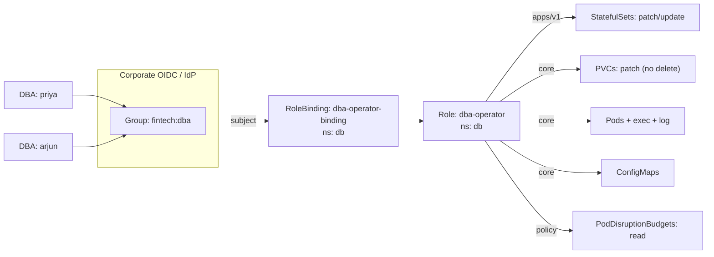
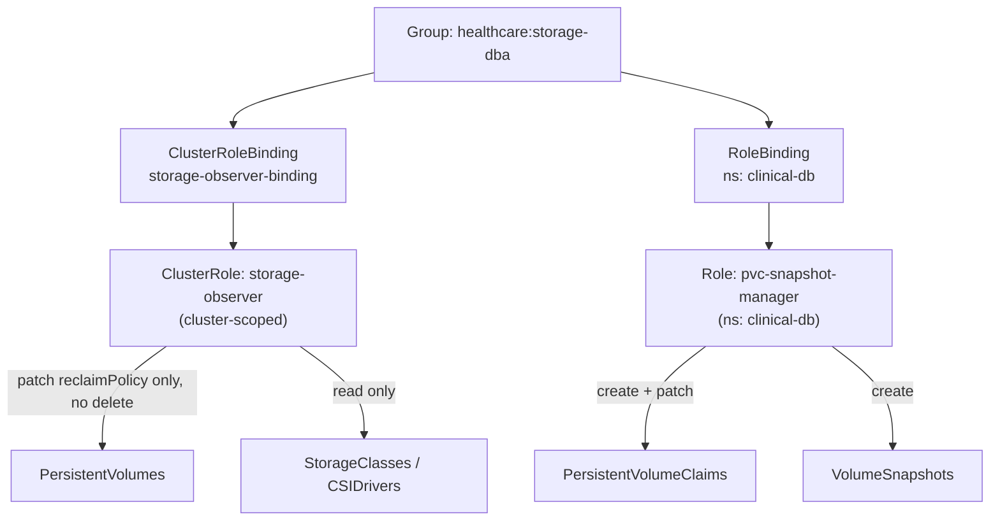
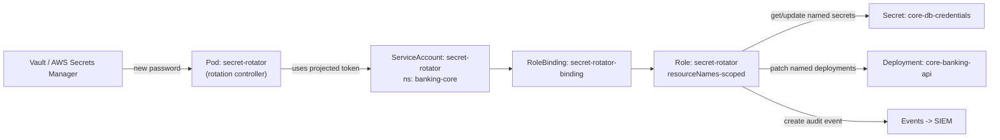
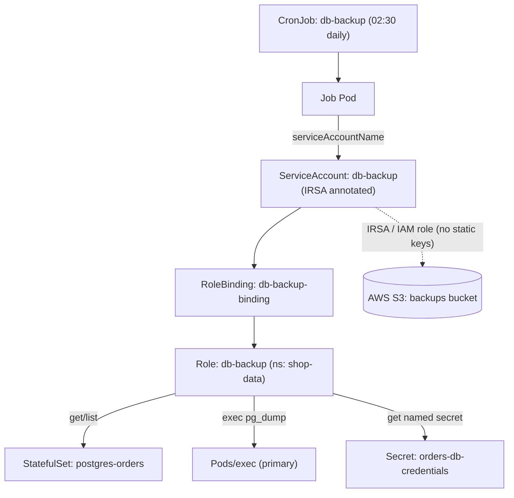
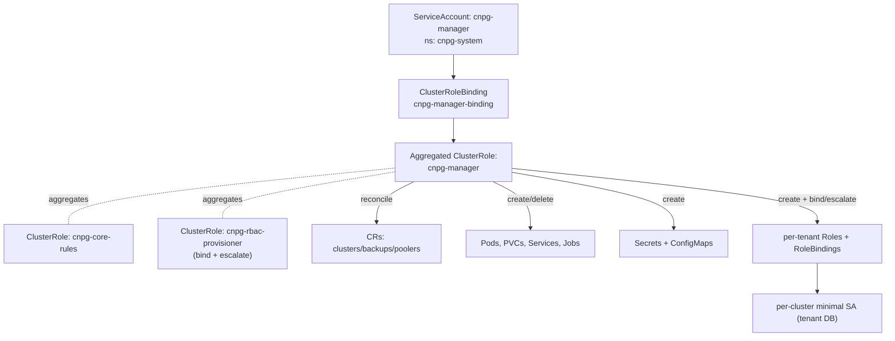

# Database Team

Real-time, production-grade RBAC scenarios for the platform-adjacent Database (DBA/DataOps) team, covering stateful workloads, storage primitives, secret rotation, backup automation, and operator-driven Postgres fleets on Kubernetes v1.33+.

## Scenario 36 — DBA Team Operating StatefulSets and PVCs in the `db` Namespace

**Company / Industry:** Banking / FinTech (digital payments platform)

### Business Requirement
The FinTech platform runs its core PostgreSQL and MySQL clusters as StatefulSets inside a dedicated `db` namespace. The DBA squad needs day-to-day operational control over these stateful workloads — scaling replicas, performing rolling restarts, resizing volumes, and shelling into pods to run `psql`/`mysql` for incident triage — without ever touching the cluster control plane, other tenants' namespaces, or node-level configuration. Regulatory posture (RBI guidelines, PCI-DSS) mandates that access is namespace-scoped and auditable per identity.

### Existing Problem
Historically the DBAs were handed a copy of `cluster-admin` kubeconfig "so they can just get their job done." During a Friday-night incident a DBA ran a `kubectl delete pvc --all` in what they believed was the staging context and wiped a production volume, triggering a 40-minute payments outage and a mandatory incident report to the regulator. The organization now needs tightly scoped, least-privilege access where the blast radius of any DBA action is confined to the `db` namespace and destructive PVC operations are constrained.

### Proposed RBAC Solution
Use a namespaced **Role** in the `db` namespace bound with a **RoleBinding** to the corporate identity **Group** `fintech:dba` (delivered via the OIDC provider / IdP claim). A Role (not ClusterRole) is correct because every resource the DBAs touch — StatefulSets, PVCs, Pods, Services — is namespaced, and we explicitly do not want the permission to leak into any other namespace. Binding to a Group rather than individual users means onboarding/offboarding is handled entirely in the IdP with zero cluster changes, which auditors love. A ServiceAccount is not used here because these are interactive human operators authenticating via OIDC, not workloads.

### Kubernetes Resources
- StatefulSets (`apps/v1`)
- Pods, Pods/exec, Pods/log
- PersistentVolumeClaims
- Services (headless service for the StatefulSet)
- ConfigMaps
- Events
- PodDisruptionBudgets (`policy/v1`)

### Required Permissions
- **StatefulSets** → `get, list, watch, patch, update` — scale replicas and trigger rolling restarts (patch the pod-template annotation). No `create`/`delete` because cluster provisioning is GitOps-owned.
- **Pods** → `get, list, watch, delete` — delete allows targeted pod restarts; `pods/exec` → `create` for interactive DB shells; `pods/log` → `get` for diagnostics.
- **PVCs** → `get, list, watch, patch` — `patch` enables online volume expansion. Deliberately **no `delete`/`deletecollection`** to prevent the exact data-loss incident that occurred.
- **Services** → `get, list, watch` (read-only; topology is GitOps-managed).
- **ConfigMaps** → `get, list, watch, patch` — tune DB parameters via config reload.
- **Events** → `get, list, watch` — read-only for diagnostics.
- **PodDisruptionBudgets** → `get, list, watch` — verify safe eviction budgets before maintenance.

### Architecture Diagram


### YAML Implementation
```yaml
apiVersion: v1
kind: Namespace
metadata:
  name: db
  labels:
    team: database
    tier: data
    compliance: pci-dss
---
apiVersion: rbac.authorization.k8s.io/v1
kind: Role
metadata:
  name: dba-operator
  namespace: db
  labels:
    team: database
    app.kubernetes.io/managed-by: platform-gitops
rules:
  # StatefulSet lifecycle operations (scale, rolling restart) — no create/delete
  - apiGroups: ["apps"]
    resources: ["statefulsets"]
    verbs: ["get", "list", "watch", "patch", "update"]
  - apiGroups: ["apps"]
    resources: ["statefulsets/scale"]
    verbs: ["get", "patch", "update"]
  # Targeted pod restarts and diagnostics
  - apiGroups: [""]
    resources: ["pods"]
    verbs: ["get", "list", "watch", "delete"]
  - apiGroups: [""]
    resources: ["pods/log"]
    verbs: ["get"]
  - apiGroups: [""]
    resources: ["pods/exec"]
    verbs: ["create"]
  # Volume expansion via patch — explicitly NO delete to protect data
  - apiGroups: [""]
    resources: ["persistentvolumeclaims"]
    verbs: ["get", "list", "watch", "patch"]
  # DB parameter tuning
  - apiGroups: [""]
    resources: ["configmaps"]
    verbs: ["get", "list", "watch", "patch"]
  # Read-only topology + diagnostics
  - apiGroups: [""]
    resources: ["services", "events", "endpoints"]
    verbs: ["get", "list", "watch"]
  - apiGroups: ["policy"]
    resources: ["poddisruptionbudgets"]
    verbs: ["get", "list", "watch"]
---
apiVersion: rbac.authorization.k8s.io/v1
kind: RoleBinding
metadata:
  name: dba-operator-binding
  namespace: db
  labels:
    team: database
subjects:
  - kind: Group
    name: "fintech:dba"
    apiGroup: rbac.authorization.k8s.io
roleRef:
  kind: Role
  name: dba-operator
  apiGroup: rbac.authorization.k8s.io
---
# Guardrail: cap the namespace so a runaway scale cannot exhaust the cluster
apiVersion: v1
kind: ResourceQuota
metadata:
  name: db-quota
  namespace: db
spec:
  hard:
    requests.storage: "2Ti"
    persistentvolumeclaims: "20"
    count/statefulsets.apps: "10"
```

### Commands
```bash
# Apply the namespace, role, binding, and quota
kubectl apply -f dba-operator.yaml

# Verify the binding wired the group correctly
kubectl -n db get rolebinding dba-operator-binding -o wide

# (During break-fix) a DBA scales a StatefulSet
kubectl -n db scale statefulset postgres-primary --replicas=3

# Rolling restart by patching the pod template annotation
kubectl -n db rollout restart statefulset/postgres-primary

# Online volume expansion (StorageClass must allowVolumeExpansion: true)
kubectl -n db patch pvc data-postgres-primary-0 \
  --type merge -p '{"spec":{"resources":{"requests":{"storage":"200Gi"}}}}'
```

### Verification
```bash
# ALLOW: DBA can scale and restart statefulsets in db
kubectl auth can-i update statefulsets --namespace db \
  --as=priya --as-group=fintech:dba
kubectl auth can-i create pods/exec --namespace db \
  --as=priya --as-group=fintech:dba

# ALLOW: patch a PVC (expansion)
kubectl auth can-i patch persistentvolumeclaims --namespace db \
  --as=priya --as-group=fintech:dba

# DENY: must NOT be able to delete PVCs (the incident guardrail)
kubectl auth can-i delete persistentvolumeclaims --namespace db \
  --as=priya --as-group=fintech:dba

# DENY: no reach into other namespaces or cluster scope
kubectl auth can-i list pods --namespace kube-system \
  --as=priya --as-group=fintech:dba
kubectl auth can-i get nodes \
  --as=priya --as-group=fintech:dba

# Full effective permission dump for the identity
kubectl auth can-i --list --namespace db --as=priya --as-group=fintech:dba
```

### Expected Output
```text
# ALLOW cases
$ kubectl auth can-i update statefulsets --namespace db --as=priya --as-group=fintech:dba
yes
$ kubectl auth can-i create pods/exec --namespace db --as=priya --as-group=fintech:dba
yes
$ kubectl auth can-i patch persistentvolumeclaims --namespace db --as=priya --as-group=fintech:dba
yes

# DENY cases
$ kubectl auth can-i delete persistentvolumeclaims --namespace db --as=priya --as-group=fintech:dba
no
$ kubectl auth can-i list pods --namespace kube-system --as=priya --as-group=fintech:dba
no

# A real forbidden error when a DBA actually attempts the delete:
$ kubectl -n db delete pvc data-postgres-primary-0 --as=priya --as-group=fintech:dba
Error from server (Forbidden): persistentvolumeclaims "data-postgres-primary-0" is forbidden:
User "priya" cannot delete resource "persistentvolumeclaims" in API group "" in the namespace "db"
```

### Common Mistakes
- Granting `delete` on PVCs "for symmetry" — this reintroduces the data-loss risk. Volume deletion must be a controlled, GitOps/ticketed action.
- Forgetting the separate `pods/exec` subresource rule; DBAs then get "forbidden" on `kubectl exec` even though `pods` verbs look complete.
- Binding to individual `User` subjects instead of the `Group`, creating onboarding churn and orphaned bindings when people leave.
- Omitting `statefulsets/scale` and wondering why `kubectl scale` fails while `patch` on the parent works.
- Adding `create`/`delete` on StatefulSets, breaking the GitOps single-source-of-truth model and enabling config drift.

### Troubleshooting
- Start with `kubectl auth can-i --list --namespace db --as=<user> --as-group=fintech:dba` to see the effective rule set.
- If exec fails, confirm the `pods/exec` rule exists and uses verb `create` (not `get`).
- `kubectl -n db describe rolebinding dba-operator-binding` — verify the subject `kind: Group`, exact name `fintech:dba`, and `apiGroup: rbac.authorization.k8s.io`.
- Confirm the OIDC token actually carries the `fintech:dba` group claim: `kubectl get --raw /apis/authentication.k8s.io/v1 ...` or inspect via `kubectl auth whoami`.
- If PVC patch works but expansion doesn't happen, the issue is not RBAC — check the StorageClass `allowVolumeExpansion: true`.

### Best Practice
Mature banks bind namespaced Roles to IdP-managed groups, keep all Role/RoleBinding manifests in a GitOps repo (Argo CD/Flux) with mandatory PR review, and pair the Role with a `ResourceQuota` and `LimitRange` so RBAC controls *what* while quotas control *how much*. Destructive verbs like PVC `delete` are excluded from the standing role and only granted via short-lived break-glass roles gated behind an approval workflow with full audit logging.

### Security Notes
The primary risk is data destruction and lateral movement. Namespacing the Role confines blast radius to `db`; excluding `delete` on PVCs removes the specific catastrophic path; read-only Services/Events prevent topology tampering. `pods/exec` is powerful (it grants shell-level access to the DB container and thus to credentials in the DB process), so it must be paired with pod-level audit logging and short session TTLs. No `escalate`, `bind`, or `impersonate` verbs are present, so a compromised DBA identity cannot widen its own privileges.

### Interview Questions
1. Why choose a Role over a ClusterRole for the DBA team, and what changes if they later need to operate an identical DB stack in a second namespace?
2. You granted `patch` on `statefulsets` but `kubectl scale` still fails with Forbidden. What is the root cause and fix?
3. Why is `pods/exec` a `create` verb and not `get`, and what are the security implications of granting it?
4. How do you let DBAs expand a PVC without giving them `delete`, and what non-RBAC prerequisite must be true?
5. The audit team asks how you guarantee a departed DBA loses access instantly. Explain the mechanism given this design.

### Interview Answers
1. All target resources are namespaced, and least-privilege dictates confining access. A ClusterRole would grant the verbs cluster-wide (across every namespace when paired with a ClusterRoleBinding), massively widening blast radius. If a second namespace is needed, the clean pattern is to keep the permissions defined once as a ClusterRole (as a reusable *definition*) and bind it with a **RoleBinding in each namespace** — this scopes a cluster-defined role to a single namespace while avoiding rule duplication.
2. `kubectl scale` operates on the `statefulsets/scale` subresource, which is a distinct RBAC object from `statefulsets`. Patching the parent object works, but the scale subresource needs its own rule with `get`, `patch`, `update` verbs. Add the `statefulsets/scale` rule.
3. Executing a command in a pod opens a bidirectional streaming connection, modeled in the Kubernetes API as *creating* an exec sub-resource — hence verb `create`. Security-wise it is equivalent to shell access inside the container: the operator can read env vars, mounted secrets, and the DB's on-disk data, and can bypass application-level controls. It demands session auditing and should never be granted broadly.
4. Volume expansion is an in-place `patch` that increases `spec.resources.requests.storage`; it never requires `delete`. The non-RBAC prerequisite is that the backing StorageClass sets `allowVolumeExpansion: true` and the CSI driver supports online expansion.
5. Access is granted to the IdP group `fintech:dba`, not to individuals. Removing the user from that group in the IdP (or disabling their account) means their next token carries no matching group claim, so RBAC evaluation yields no binding and access is denied — no cluster change required, and it takes effect on token refresh.

### Follow-up Questions
- How would you implement short-lived break-glass access to grant PVC `delete` only during a ticketed maintenance window, with automatic revocation?
- If the same ClusterRole definition is reused across namespaces, how do you prevent one team's RoleBinding from accidentally referencing another team's group?
- How do you audit every `pods/exec` a DBA performs, and where do those events surface (API server audit policy stages/levels)?
- Would you use a `ValidatingAdmissionPolicy` (CEL) to block PVC shrink or forbid `replicas: 0` on production StatefulSets, and how does that complement RBAC?

### Production Tips
- **Razorpay / PhonePe / Paytm** (India FinTech) map cluster access to Okta/Azure AD groups synced into OIDC claims; DBAs get namespace-scoped Roles and destructive verbs are behind break-glass with immutable audit trails shipped to SIEM.
- **Amazon EKS** users lean on IAM-to-Kubernetes group mapping (via `aws-auth`/EKS access entries) so the "fintech:dba" group is driven by IAM, and PVC deletion is additionally guarded by StorageClass `reclaimPolicy: Retain`.
- **Google GKE** customers use `gke-security-groups` (Google Groups) as the RBAC subject, keeping membership in Workspace and out of the cluster entirely.

## Scenario 37 — DBA Storage Operations Across PV, PVC, and StorageClass

**Company / Industry:** Healthcare (HIPAA-regulated clinical records platform)

### Business Requirement
The healthcare platform stores encrypted patient records on CSI-backed volumes. The storage-focused sub-team of DBAs must inspect cluster-wide storage topology (which PersistentVolumes exist, their StorageClasses, reclaim policies, and binding state), create and manage namespaced PVCs for new database instances, and drive VolumeSnapshots for point-in-time backups required by HIPAA retention rules. They must be able to reason about storage across the whole cluster but must never delete a bound PV (that would orphan or destroy PHI) and must not modify workloads outside storage.

### Existing Problem
PVs and StorageClasses are **cluster-scoped** objects, so the team was previously given a broad ClusterRole that also carried `delete` on PersistentVolumes. A well-intentioned cleanup script deleted "Released" PVs whose reclaim policy was mistakenly `Delete`, and the underlying encrypted EBS volumes were destroyed, forcing a restore from off-site backups and a HIPAA breach assessment. The team needs read/observe power over cluster-scoped storage but write power only over the narrow, safe surface (PVC creation, snapshot creation, reclaim-policy patching to `Retain`).

### Proposed RBAC Solution
Split the permissions by scope. Cluster-scoped resources (PersistentVolumes, StorageClasses, VolumeSnapshotClasses, CSIDrivers) require a **ClusterRole** bound with a **ClusterRoleBinding** — but restricted to non-destructive verbs. Namespaced resources (PersistentVolumeClaims, VolumeSnapshots) are granted via a separate **Role** + **RoleBinding** in the `clinical-db` namespace. Binding is to the IdP **Group** `healthcare:storage-dba`. Two distinct roles make the scope boundary explicit and auditable, and prevent the "one giant ClusterRole with delete" anti-pattern that caused the incident.

### Kubernetes Resources
- PersistentVolumes (cluster-scoped)
- StorageClasses (`storage.k8s.io/v1`, cluster-scoped)
- CSIDrivers, CSINodes (`storage.k8s.io/v1`, cluster-scoped)
- PersistentVolumeClaims (namespaced)
- VolumeSnapshots, VolumeSnapshotClasses (`snapshot.storage.k8s.io/v1`)
- Events

### Required Permissions
- **PersistentVolumes** → `get, list, watch, patch` — observe cluster storage and `patch` only to flip `reclaimPolicy` to `Retain` for safety. Explicitly **no `delete`/`deletecollection`** (the incident fix) and no `create` (provisioning is dynamic/GitOps).
- **StorageClasses** → `get, list, watch` — read-only; class definitions are platform-owned.
- **CSIDrivers / CSINodes** → `get, list, watch` — read-only topology for troubleshooting.
- **PersistentVolumeClaims** → `get, list, watch, create, patch` — create claims for new DB instances and patch for expansion; no `delete` in the standing role.
- **VolumeSnapshots** → `get, list, watch, create` — take point-in-time backups; `delete` is reserved for the retention controller, not humans.
- **VolumeSnapshotClasses** → `get, list, watch` — read-only.
- **Events** → `get, list, watch` — diagnose provisioning/attach failures.

### Architecture Diagram


### YAML Implementation
```yaml
apiVersion: v1
kind: Namespace
metadata:
  name: clinical-db
  labels:
    team: database
    compliance: hipaa
    data-classification: phi
---
# Cluster-scoped: observe storage topology, patch reclaim policy, NEVER delete PV
apiVersion: rbac.authorization.k8s.io/v1
kind: ClusterRole
metadata:
  name: storage-observer
  labels:
    team: database
rules:
  - apiGroups: [""]
    resources: ["persistentvolumes"]
    verbs: ["get", "list", "watch", "patch"]   # patch = set reclaimPolicy: Retain
  - apiGroups: ["storage.k8s.io"]
    resources: ["storageclasses", "csidrivers", "csinodes", "volumeattachments"]
    verbs: ["get", "list", "watch"]
  - apiGroups: ["snapshot.storage.k8s.io"]
    resources: ["volumesnapshotclasses"]
    verbs: ["get", "list", "watch"]
---
apiVersion: rbac.authorization.k8s.io/v1
kind: ClusterRoleBinding
metadata:
  name: storage-observer-binding
subjects:
  - kind: Group
    name: "healthcare:storage-dba"
    apiGroup: rbac.authorization.k8s.io
roleRef:
  kind: ClusterRole
  name: storage-observer
  apiGroup: rbac.authorization.k8s.io
---
# Namespaced: manage PVCs and snapshots inside clinical-db only
apiVersion: rbac.authorization.k8s.io/v1
kind: Role
metadata:
  name: pvc-snapshot-manager
  namespace: clinical-db
  labels:
    team: database
rules:
  - apiGroups: [""]
    resources: ["persistentvolumeclaims"]
    verbs: ["get", "list", "watch", "create", "patch"]
  - apiGroups: ["snapshot.storage.k8s.io"]
    resources: ["volumesnapshots"]
    verbs: ["get", "list", "watch", "create"]
  - apiGroups: [""]
    resources: ["events"]
    verbs: ["get", "list", "watch"]
---
apiVersion: rbac.authorization.k8s.io/v1
kind: RoleBinding
metadata:
  name: pvc-snapshot-manager-binding
  namespace: clinical-db
subjects:
  - kind: Group
    name: "healthcare:storage-dba"
    apiGroup: rbac.authorization.k8s.io
roleRef:
  kind: Role
  name: pvc-snapshot-manager
  apiGroup: rbac.authorization.k8s.io
---
# A HIPAA-grade encrypted StorageClass (platform-owned; shown for context)
apiVersion: storage.k8s.io/v1
kind: StorageClass
metadata:
  name: clinical-encrypted-gp3
provisioner: ebs.csi.aws.com
parameters:
  type: gp3
  encrypted: "true"
  kmsKeyId: "arn:aws:kms:us-east-1:111122223333:key/phi-db-key"
reclaimPolicy: Retain
allowVolumeExpansion: true
volumeBindingMode: WaitForFirstConsumer
```

### Commands
```bash
kubectl apply -f storage-dba.yaml

# Observe cluster storage topology (read across the whole cluster)
kubectl get pv --sort-by=.spec.capacity.storage
kubectl get storageclass

# Harden a PV against accidental deletion by flipping reclaim policy to Retain
kubectl patch pv pvc-8f3a1c2e-... \
  -p '{"spec":{"persistentVolumeReclaimPolicy":"Retain"}}'

# Create a PVC for a new DB instance
kubectl -n clinical-db apply -f new-instance-pvc.yaml

# Take a point-in-time snapshot for HIPAA retention
kubectl -n clinical-db apply -f patient-db-snapshot.yaml
```

### Verification
```bash
# ALLOW: observe cluster-scoped PVs and StorageClasses
kubectl auth can-i list persistentvolumes \
  --as=nurse-dba --as-group=healthcare:storage-dba
kubectl auth can-i patch persistentvolumes \
  --as=nurse-dba --as-group=healthcare:storage-dba

# ALLOW: create PVCs and snapshots in the clinical-db namespace
kubectl auth can-i create persistentvolumeclaims -n clinical-db \
  --as=nurse-dba --as-group=healthcare:storage-dba
kubectl auth can-i create volumesnapshots.snapshot.storage.k8s.io -n clinical-db \
  --as=nurse-dba --as-group=healthcare:storage-dba

# DENY: never delete a PersistentVolume (the incident guardrail)
kubectl auth can-i delete persistentvolumes \
  --as=nurse-dba --as-group=healthcare:storage-dba

# DENY: cannot modify StorageClasses (platform-owned)
kubectl auth can-i update storageclasses \
  --as=nurse-dba --as-group=healthcare:storage-dba
```

### Expected Output
```text
$ kubectl auth can-i list persistentvolumes --as=nurse-dba --as-group=healthcare:storage-dba
yes
$ kubectl auth can-i patch persistentvolumes --as=nurse-dba --as-group=healthcare:storage-dba
yes
$ kubectl auth can-i create persistentvolumeclaims -n clinical-db --as=nurse-dba --as-group=healthcare:storage-dba
yes
$ kubectl auth can-i delete persistentvolumes --as=nurse-dba --as-group=healthcare:storage-dba
no
$ kubectl auth can-i update storageclasses --as=nurse-dba --as-group=healthcare:storage-dba
no

# A real forbidden error on an attempted PV deletion:
$ kubectl delete pv pvc-8f3a1c2e --as=nurse-dba --as-group=healthcare:storage-dba
Error from server (Forbidden): persistentvolumes "pvc-8f3a1c2e" is forbidden:
User "nurse-dba" cannot delete resource "persistentvolumes" in API group "" at the cluster scope
```

### Common Mistakes
- Trying to grant PV/StorageClass access through a namespaced Role — cluster-scoped resources are simply invisible to a Role, so `kubectl get pv` returns Forbidden no matter what verbs you add.
- Binding the storage ClusterRole with a ClusterRoleBinding but including `delete` on PVs — cluster-wide destructive power over all PHI volumes.
- Forgetting that VolumeSnapshots live in the `snapshot.storage.k8s.io` apiGroup, not core `""` — the rule silently matches nothing.
- Setting reclaim policy at the PV level after binding but leaving the StorageClass default at `Delete`, so newly provisioned volumes remain unprotected.
- Granting `create` on PVs to humans; dynamic provisioning creates PVs automatically, and manual PV creation invites misconfiguration.

### Troubleshooting
- If `kubectl get pv` is Forbidden, confirm the ClusterRoleBinding exists and the subject group name matches exactly: `kubectl describe clusterrolebinding storage-observer-binding`.
- For snapshot failures, verify the apiGroup with `kubectl api-resources | grep snapshot` and that the rule targets `snapshot.storage.k8s.io`.
- Use `kubectl auth can-i --list --as=<user> --as-group=healthcare:storage-dba` (cluster scope) and again with `-n clinical-db` to see the union of both bindings.
- If PVC create succeeds but stays `Pending`, that's a provisioning/StorageClass issue, not RBAC — check events and the CSI controller logs.
- Confirm scope confusion by checking whether the resource is cluster- or namespace-scoped: `kubectl api-resources --namespaced=false`.

### Best Practice
Healthcare platforms enforce `reclaimPolicy: Retain` and KMS encryption at the StorageClass level so no human RBAC grant can cause silent data destruction. Storage observation is granted cluster-wide read-only, while all mutation is namespaced. Snapshot deletion/retention is handled exclusively by an automated controller SA governed by lifecycle policy, keeping humans out of the destructive path.

### Security Notes
The core risk is irreversible PHI loss and unauthorized access to encrypted volumes. Removing `delete` on PVs eliminates the catastrophic path; `Retain` reclaim policy ensures even a deleted PVC leaves the underlying volume intact for recovery. Read-only StorageClass prevents an attacker from swapping in an unencrypted provisioner. Because PVs can be bound to PVCs in *any* namespace, cluster-scoped PV write access is inherently sensitive — limiting it to `patch` (and only reclaim policy in practice, enforced further by admission policy) keeps blast radius minimal. No `escalate`/`bind`/`impersonate` verbs exist in either role.

### Interview Questions
1. Why can't a namespaced Role ever grant access to PersistentVolumes or StorageClasses, and how does that shape your design?
2. How does `reclaimPolicy: Retain` interact with RBAC to protect against data loss, and which is the stronger guarantee?
3. A DBA reports `kubectl create volumesnapshot` returns Forbidden despite having a snapshot rule. What's the likely bug?
4. Explain the security reasoning for allowing `patch` but not `delete` on PersistentVolumes.
5. You must let the retention controller delete old snapshots but keep humans out. How do you structure that with RBAC?

### Interview Answers
1. RBAC scope must match resource scope. PVs and StorageClasses are cluster-scoped objects; a Role and RoleBinding are namespace-scoped and can only authorize namespaced resources. Regardless of the verbs listed, a Role cannot authorize a cluster-scoped resource, so such access must come from a ClusterRole (bound via ClusterRoleBinding). This forces the deliberate split between cluster-scoped observation and namespaced mutation.
2. `reclaimPolicy: Retain` is a data-plane guarantee: when a PVC is deleted, the PV (and underlying disk) is kept, not destroyed. RBAC is a control-plane guarantee about who may issue API verbs. They are complementary defense-in-depth. `Retain` is the stronger *data-durability* guarantee because it protects even against an authorized-but-mistaken delete, whereas RBAC only blocks the API call for unauthorized subjects.
3. VolumeSnapshots belong to the `snapshot.storage.k8s.io` apiGroup. If the rule was written with `apiGroups: [""]` or the resource typed as `volumesnapshot` without the group, it matches nothing. Fix the rule to `apiGroups: ["snapshot.storage.k8s.io"]`, `resources: ["volumesnapshots"]`.
4. `patch` allows narrowly scoped, reversible changes (e.g., setting reclaim policy to Retain to increase safety) without granting the irreversible destruction of a volume that may hold PHI. `delete` on a cluster-scoped PV can orphan or destroy data across any namespace, so it is the single highest-risk verb and is withheld from human roles entirely.
5. Give the retention controller its own dedicated ServiceAccount with a minimal Role/ClusterRole that includes `delete` on `volumesnapshots`, scoped to the namespaces it manages. Human roles omit `delete` on snapshots. This separates automated, policy-driven deletion (auditable, deterministic) from ad-hoc human deletion.

### Follow-up Questions
- How would you use a `ValidatingAdmissionPolicy` to reject any PV `patch` that changes `reclaimPolicy` from `Retain` to `Delete`?
- If two teams share the cluster, how do you prevent `healthcare:storage-dba` from listing another tenant's PVs (which are cluster-scoped and thus globally visible)?
- How do CSI `VolumeSnapshotClass` `deletionPolicy` settings interact with your RBAC design for backups?
- Would you separate "read PV" from "patch PV" into two ClusterRoles, and when would that matter?

### Production Tips
- **Amazon EKS** clinical workloads use the EBS CSI driver with KMS-encrypted `gp3` StorageClasses and `reclaimPolicy: Retain`; storage-observer ClusterRoles are read-mostly and mapped to IAM groups via EKS access entries.
- **Google GKE** uses the PD CSI driver and `VolumeSnapshot` for backups, with `gke-security-groups` gating the storage-DBA group.
- **Red Hat OpenShift** ships pre-aggregated `storage-admin`-style cluster roles and pairs them with `SecurityContextConstraints`, which many regulated healthcare providers adopt to keep storage mutation auditable and PHI-safe.

## Scenario 38 — Automated Database Secret Rotation ServiceAccount

**Company / Industry:** Banking (core banking / cards issuance platform)

### Business Requirement
PCI-DSS and internal security policy require that database credentials rotate every 24 hours. A controller-style rotation workload (integrated with an external secrets manager such as HashiCorp Vault / AWS Secrets Manager) runs in-cluster, generates a new DB password, writes it into the Kubernetes Secret consumed by the application, and triggers a zero-downtime rolling restart of the consuming Deployments so they pick up the fresh credential. This must run unattended with a workload identity, touching only the specific secrets and workloads it owns.

### Existing Problem
Rotation was previously performed by a Jenkins job using a static kubeconfig with a broad `edit` ClusterRole. The token never expired, was checked into a pipeline credential store, and had read access to **every** Secret in the cluster. A security review flagged this as a critical finding: a single leaked pipeline token could exfiltrate all database and TLS secrets bank-wide. The organization needs a dedicated, least-privilege workload identity that can only read/update the handful of DB secrets it rotates and only restart the specific workloads that consume them.

### Proposed RBAC Solution
Create a dedicated **ServiceAccount** `secret-rotator` in the `banking-core` namespace and a namespaced **Role** bound via **RoleBinding**. A ServiceAccount is the correct subject because this is an unattended workload, not a human. Critically, the Role uses **`resourceNames`** to constrain the Secret verbs to the exact named secrets being rotated — this is the single most important control, turning "read all secrets" into "read/update these three." Restart capability is granted narrowly via `patch` on the named Deployments (the rotator adds a `kubectl.kubernetes.io/restartedAt` annotation). Token automounting is enabled only where needed and uses short-lived projected tokens.

### Kubernetes Resources
- Secrets (specific, via `resourceNames`)
- Deployments (specific, via `resourceNames`)
- Events (for emitting rotation audit events)
- ServiceAccount `secret-rotator`

### Required Permissions
- **Secrets** (named: `core-db-credentials`, `cards-db-credentials`, `ledger-db-credentials`) → `get, list, watch, update, patch` — read the current secret and write the new password. **No `create`** (secrets are provisioned by GitOps/External Secrets) and **no `delete`** (deleting a live DB secret would break the app). Note: `list`/`watch` cannot be constrained by `resourceNames` and are therefore granted on a *separate, minimal* footing or omitted in favor of `get` only.
- **Deployments** (named consumers) → `get, patch` — trigger rolling restart by patching the pod template annotation. No scale/delete.
- **Events** → `create, patch` — emit an audit event on each rotation for the SIEM.

### Architecture Diagram


### YAML Implementation
```yaml
apiVersion: v1
kind: ServiceAccount
metadata:
  name: secret-rotator
  namespace: banking-core
  labels:
    team: database
    purpose: credential-rotation
automountServiceAccountToken: false   # token is projected explicitly by the pod
---
apiVersion: rbac.authorization.k8s.io/v1
kind: Role
metadata:
  name: secret-rotator
  namespace: banking-core
  labels:
    team: database
rules:
  # Read + write ONLY the specific DB secrets this rotator owns
  - apiGroups: [""]
    resources: ["secrets"]
    resourceNames:
      - "core-db-credentials"
      - "cards-db-credentials"
      - "ledger-db-credentials"
    verbs: ["get", "update", "patch"]
  # Trigger zero-downtime restart of ONLY the consuming deployments
  - apiGroups: ["apps"]
    resources: ["deployments"]
    resourceNames:
      - "core-banking-api"
      - "cards-issuer-api"
      - "ledger-service"
    verbs: ["get", "patch"]
  # Emit audit events for the SIEM
  - apiGroups: [""]
    resources: ["events"]
    verbs: ["create", "patch"]
---
apiVersion: rbac.authorization.k8s.io/v1
kind: RoleBinding
metadata:
  name: secret-rotator-binding
  namespace: banking-core
subjects:
  - kind: ServiceAccount
    name: secret-rotator
    namespace: banking-core
roleRef:
  kind: Role
  name: secret-rotator
  apiGroup: rbac.authorization.k8s.io
---
# The rotation CronJob using the SA with a short-lived projected token
apiVersion: batch/v1
kind: CronJob
metadata:
  name: db-secret-rotator
  namespace: banking-core
spec:
  schedule: "0 2 * * *"            # daily 02:00 rotation
  concurrencyPolicy: Forbid
  successfulJobsHistoryLimit: 3
  failedJobsHistoryLimit: 3
  jobTemplate:
    spec:
      backoffLimit: 2
      template:
        metadata:
          labels:
            app: db-secret-rotator
        spec:
          serviceAccountName: secret-rotator
          automountServiceAccountToken: false
          restartPolicy: Never
          securityContext:
            runAsNonRoot: true
            runAsUser: 65532
            seccompProfile:
              type: RuntimeDefault
          containers:
            - name: rotator
              image: registry.internal.bank/db-tools/secret-rotator:1.8.2
              args: ["--secrets=core-db-credentials,cards-db-credentials,ledger-db-credentials"]
              securityContext:
                allowPrivilegeEscalation: false
                readOnlyRootFilesystem: true
                capabilities:
                  drop: ["ALL"]
              volumeMounts:
                - name: kube-api-token
                  mountPath: /var/run/secrets/tokens
                  readOnly: true
          volumes:
            - name: kube-api-token
              projected:
                sources:
                  - serviceAccountToken:
                      path: token
                      expirationSeconds: 600   # 10-min short-lived token
                      audience: https://kubernetes.default.svc
```

### Commands
```bash
kubectl apply -f secret-rotator.yaml

# Confirm the SA and binding exist
kubectl -n banking-core get sa secret-rotator
kubectl -n banking-core describe rolebinding secret-rotator-binding

# Manually kick a rotation run for validation
kubectl -n banking-core create job --from=cronjob/db-secret-rotator rotate-now
kubectl -n banking-core logs job/rotate-now -f
```

### Verification
```bash
SA=system:serviceaccount:banking-core:secret-rotator

# ALLOW: get/update the specific named secret
kubectl auth can-i get secrets/core-db-credentials -n banking-core --as=$SA
kubectl auth can-i update secrets/core-db-credentials -n banking-core --as=$SA

# ALLOW: patch a named consuming deployment (rolling restart)
kubectl auth can-i patch deployments/core-banking-api -n banking-core --as=$SA

# DENY: cannot touch a secret it does not own
kubectl auth can-i get secrets/root-ca-tls -n banking-core --as=$SA

# DENY: cannot delete secrets or read all secrets cluster-wide
kubectl auth can-i delete secrets/core-db-credentials -n banking-core --as=$SA
kubectl auth can-i list secrets -n kube-system --as=$SA

# Effective permissions for the workload identity
kubectl auth can-i --list -n banking-core --as=$SA
```

### Expected Output
```text
$ kubectl auth can-i get secrets/core-db-credentials -n banking-core --as=system:serviceaccount:banking-core:secret-rotator
yes
$ kubectl auth can-i update secrets/core-db-credentials -n banking-core --as=system:serviceaccount:banking-core:secret-rotator
yes
$ kubectl auth can-i patch deployments/core-banking-api -n banking-core --as=system:serviceaccount:banking-core:secret-rotator
yes
$ kubectl auth can-i get secrets/root-ca-tls -n banking-core --as=system:serviceaccount:banking-core:secret-rotator
no
$ kubectl auth can-i delete secrets/core-db-credentials -n banking-core --as=system:serviceaccount:banking-core:secret-rotator
no

# Real forbidden error when the rotator tries to read a secret outside its allowlist:
$ kubectl -n banking-core get secret root-ca-tls --as=system:serviceaccount:banking-core:secret-rotator
Error from server (Forbidden): secrets "root-ca-tls" is forbidden:
User "system:serviceaccount:banking-core:secret-rotator" cannot get resource "secrets" in API group "" in the namespace "banking-core"
```

### Common Mistakes
- Using `list` or `watch` verbs while expecting `resourceNames` to constrain them — `resourceNames` does **not** apply to `list`/`watch`/`create`/`deletecollection`. Granting `list` on secrets effectively exposes all secrets in the namespace. Use `get` on named secrets and have the app read by name.
- Leaving `automountServiceAccountToken: true` on both the SA and the pod, mounting a long-lived token when a short-lived projected token is far safer.
- Granting `deployments` `update` or `*` when only `patch` (for the restart annotation) is needed.
- Putting the rotator's Role in the wrong namespace so the RoleBinding references a Role that authorizes nothing.
- Forgetting `events` `create`, so rotation runs succeed but produce no audit trail.

### Troubleshooting
- `kubectl auth can-i --list -n banking-core --as=system:serviceaccount:banking-core:secret-rotator` shows exactly what the SA can do; look for the `resourceNames` scoping in the output.
- If updates fail, verify the secret name is spelled identically in `resourceNames` and that you're using `get`/`update` (not `list`).
- Confirm the pod actually uses the SA: `kubectl -n banking-core get pod <rotator-pod> -o jsonpath='{.spec.serviceAccountName}'`.
- For 401/403 from inside the pod, check the projected token audience matches the API server and hasn't expired (`expirationSeconds`).
- `kubectl describe rolebinding secret-rotator-binding` — verify subject `kind: ServiceAccount`, correct `name` and `namespace`.

### Best Practice
Banks integrate rotation with an external secrets operator (External Secrets Operator, Vault Agent, or the AWS/Azure secret CSI driver) so the Kubernetes Secret is a synced projection, and the in-cluster SA only needs `get`/`update` on named secrets plus `patch` on named consumers. Tokens are short-lived projected tokens (`expirationSeconds`), automount is disabled by default, and every rotation emits an audit event shipped to a SIEM with alerting on failures. The allowlist of secret names is code-reviewed in GitOps.

### Security Notes
Secrets are the highest-value target in the cluster, so this scenario is dominated by exfiltration risk. `resourceNames` transforms a namespace-wide secret reader into a three-secret reader, collapsing blast radius. Avoiding `list`/`watch` prevents enumeration of other secrets. Short-lived projected tokens mean a leaked token expires in minutes rather than living forever like the old Jenkins credential. No `create`/`delete` on secrets prevents an attacker from planting or destroying credentials. Crucially there is no `escalate`, `bind`, or `impersonate`, and no access to `roles`/`rolebindings`, so a compromised rotator cannot widen its own scope or mint new privileges.

### Interview Questions
1. Why does `resourceNames` protect the `get` on secrets but provide no protection if you also grant `list`?
2. Compare a long-lived mounted ServiceAccount token to a projected token with `expirationSeconds`. Why does the bank mandate the latter?
3. The rotator needs to restart consuming apps. Why `patch` on named Deployments rather than `delete` on their Pods?
4. How would a compromised rotator identity be contained, and what specifically stops it from escalating privileges?
5. External Secrets Operator already syncs the secret. What minimal RBAC does the in-cluster rotator still need, and why?

### Interview Answers
1. `resourceNames` filters authorization checks that reference a specific object by name — which `get`, `update`, `patch`, and `delete` do. But `list` and `watch` are collection operations that don't name a single object, so the authorizer cannot apply the name filter; a `list` grant therefore returns *all* secrets in the namespace. This is why you use `get`-by-name and never pair it with `list` when trying to scope to specific secrets.
2. A legacy mounted token is a static, non-expiring bearer credential; if it leaks it grants indefinite access until manually revoked, and revocation historically required deleting the SA. A projected token is minted on demand, bound to a specific audience, and expires after `expirationSeconds` (e.g., 10 minutes), so the exposure window from a leak is tiny and the kubelet auto-rotates it. PCI-DSS credential-hygiene requirements make the short-lived model mandatory.
3. Patching the Deployment's pod-template `restartedAt` annotation performs a controlled, rolling restart that respects `maxUnavailable`/`maxSurge` and readiness gates — zero downtime. Deleting pods directly is abrupt, can violate PodDisruptionBudgets, and risks taking down all replicas simultaneously. `patch` is also the least-privilege verb that achieves the goal.
4. Containment: the SA can only touch three named secrets and three named deployments in one namespace, tokens expire in minutes, and automount is off. It has no `roles`/`rolebindings` access, no `impersonate`, no `bind`, and no `escalate`, so it cannot grant itself more power or assume another identity. Worst case, an attacker rotates (not reads arbitrarily) three known secrets and restarts three apps — all of which is audited.
5. Even with ESO syncing the secret material, the rotator needs `get` on the named secrets (to read current/verify) and `patch`/`get` on the named consumer Deployments to trigger the rolling restart that makes apps pick up the new value, plus `events` `create` for auditing. If restarts are handled by ESO's `reloader`-style annotations, the rotator may need nothing beyond emitting events — you push as much as possible onto the operator to shrink the SA's rights.

### Follow-up Questions
- How do you rotate the *ServiceAccount token* itself, and why is that less of a concern with bound/projected tokens?
- If the app reads the secret only at startup, how do you guarantee it actually consumes the rotated value, and what RBAC does that add?
- Would you split read and write into two SAs (one to fetch from Vault, one to write to K8s), and what does that buy you?
- How do you detect and alert if the rotator's token is used from an unexpected pod/IP (audit log fields to key on)?

### Production Tips
- **PhonePe / Razorpay** run External Secrets Operator or Vault Agent Injector, so in-cluster rotators carry near-zero standing secret permissions and rely on short-lived projected tokens.
- **Amazon EKS** uses IRSA / EKS Pod Identity so the rotator authenticates to AWS Secrets Manager via a scoped IAM role, and its Kubernetes RBAC is limited to named secrets/deployments as shown.
- **Microsoft / Azure AKS** customers use the Secrets Store CSI driver with Azure Key Vault and workload identity federation, keeping the K8s Secret as a mounted projection and minimizing in-cluster secret verbs.

## Scenario 39 — Database Backup CronJob ServiceAccount

**Company / Industry:** E-Commerce (high-traffic marketplace)

### Business Requirement
The marketplace runs PostgreSQL for orders and MySQL for the catalog. A nightly (and pre-sale-event ad-hoc) backup pipeline must dump each primary database, stream the artifact to an object store (S3), and record backup metadata. The backup workload must locate the current primary pod, `exec` into it to run `pg_dump`/`mysqldump`, read only the DB connection secret, and upload to S3 using a cloud identity — all without any ability to modify or delete the databases themselves.

### Existing Problem
During last year's flagship sale, the backup job ran under the same SA as the application and inadvertently held `delete` on pods; a bug in the backup script's cleanup logic deleted a live catalog pod at peak traffic, causing a partial catalog outage. Additionally, the backup SA could read every secret in the namespace and had cloud credentials baked into the image. The team needs a purpose-built, read-and-exec-only identity with cloud access delegated through workload identity (IRSA), never static keys.

### Proposed RBAC Solution
A dedicated **ServiceAccount** `db-backup` in the `shop-data` namespace, annotated for **IRSA** (IAM Roles for Service Accounts) so S3 access is granted by AWS IAM, not Kubernetes. A namespaced **Role** + **RoleBinding** grants exactly: read the DB primary pods, `exec` to run the dump, `get` the named DB credential secret, and `create` events for backup auditing. No `delete` anywhere; no write to workloads. Using a ServiceAccount (workload identity) is correct because this is an unattended CronJob. IRSA removes long-lived cloud keys from the picture entirely — the K8s SA identity is federated to an IAM role.

### Kubernetes Resources
- Pods, Pods/exec, Pods/log (the DB primary)
- StatefulSets (read, to discover the primary/ordinal-0)
- Secrets (named DB credential secret, `get` only)
- Events
- ServiceAccount `db-backup` (IRSA-annotated)

### Required Permissions
- **Pods** → `get, list, watch` — discover the running primary pod; `pods/exec` → `create` — run `pg_dump`/`mysqldump` inside it; `pods/log` → `get` — capture dump logs.
- **StatefulSets** → `get, list` — resolve which pod is ordinal-0 / the primary.
- **Secrets** (named: `orders-db-credentials`, `catalog-db-credentials`) → `get` only — read connection credentials for the dump. No `list`/`watch` (no enumeration), no write.
- **Events** → `create` — emit backup start/success/failure audit events.
- Explicitly **no `delete`** on any resource — the direct fix for last year's incident.

### Architecture Diagram


### YAML Implementation
```yaml
apiVersion: v1
kind: ServiceAccount
metadata:
  name: db-backup
  namespace: shop-data
  labels:
    team: database
    purpose: backup
  annotations:
    # IRSA: federate this SA to an IAM role that can write to the backup bucket
    eks.amazonaws.com/role-arn: "arn:aws:iam::444455556666:role/shop-db-backup-s3-writer"
automountServiceAccountToken: true   # needed to call the K8s API for exec
---
apiVersion: rbac.authorization.k8s.io/v1
kind: Role
metadata:
  name: db-backup
  namespace: shop-data
  labels:
    team: database
rules:
  # Discover the primary DB pod
  - apiGroups: ["apps"]
    resources: ["statefulsets"]
    verbs: ["get", "list"]
  - apiGroups: [""]
    resources: ["pods"]
    verbs: ["get", "list", "watch"]
  - apiGroups: [""]
    resources: ["pods/log"]
    verbs: ["get"]
  # Run the dump inside the primary pod
  - apiGroups: [""]
    resources: ["pods/exec"]
    verbs: ["create"]
  # Read ONLY the named DB credential secrets (no list, no write)
  - apiGroups: [""]
    resources: ["secrets"]
    resourceNames: ["orders-db-credentials", "catalog-db-credentials"]
    verbs: ["get"]
  # Backup audit events
  - apiGroups: [""]
    resources: ["events"]
    verbs: ["create"]
---
apiVersion: rbac.authorization.k8s.io/v1
kind: RoleBinding
metadata:
  name: db-backup-binding
  namespace: shop-data
subjects:
  - kind: ServiceAccount
    name: db-backup
    namespace: shop-data
roleRef:
  kind: Role
  name: db-backup
  apiGroup: rbac.authorization.k8s.io
---
apiVersion: batch/v1
kind: CronJob
metadata:
  name: db-backup
  namespace: shop-data
  labels:
    team: database
spec:
  schedule: "30 2 * * *"
  concurrencyPolicy: Forbid
  startingDeadlineSeconds: 300
  successfulJobsHistoryLimit: 5
  failedJobsHistoryLimit: 5
  jobTemplate:
    spec:
      backoffLimit: 2
      activeDeadlineSeconds: 3600
      template:
        metadata:
          labels:
            app: db-backup
        spec:
          serviceAccountName: db-backup
          restartPolicy: Never
          securityContext:
            runAsNonRoot: true
            runAsUser: 65532
            fsGroup: 65532
            seccompProfile:
              type: RuntimeDefault
          containers:
            - name: backup
              image: registry.internal.shop/db-tools/pg-mysql-backup:2.4.0
              env:
                - name: TARGET_STATEFULSET
                  value: "postgres-orders"
                - name: S3_BUCKET
                  value: "shop-db-backups-prod"
                - name: AWS_REGION
                  value: "us-east-1"
              resources:
                requests:
                  cpu: "250m"
                  memory: "512Mi"
                limits:
                  cpu: "1"
                  memory: "1Gi"
              securityContext:
                allowPrivilegeEscalation: false
                readOnlyRootFilesystem: true
                capabilities:
                  drop: ["ALL"]
```

### Commands
```bash
kubectl apply -f db-backup.yaml

# Verify SA, IRSA annotation, and binding
kubectl -n shop-data get sa db-backup -o jsonpath='{.metadata.annotations}'
kubectl -n shop-data describe rolebinding db-backup-binding

# Trigger an ad-hoc backup before a big sale event
kubectl -n shop-data create job --from=cronjob/db-backup presale-backup
kubectl -n shop-data logs job/presale-backup -f
```

### Verification
```bash
SA=system:serviceaccount:shop-data:db-backup

# ALLOW: discover pods and exec into the primary
kubectl auth can-i list pods -n shop-data --as=$SA
kubectl auth can-i create pods/exec -n shop-data --as=$SA

# ALLOW: read the named DB credential secret
kubectl auth can-i get secrets/orders-db-credentials -n shop-data --as=$SA

# DENY: cannot delete pods (the peak-traffic incident guardrail)
kubectl auth can-i delete pods -n shop-data --as=$SA

# DENY: cannot enumerate all secrets, cannot read unlisted secrets
kubectl auth can-i list secrets -n shop-data --as=$SA
kubectl auth can-i get secrets/stripe-api-key -n shop-data --as=$SA

# DENY: cannot modify the database workloads
kubectl auth can-i patch statefulsets -n shop-data --as=$SA
```

### Expected Output
```text
$ kubectl auth can-i create pods/exec -n shop-data --as=system:serviceaccount:shop-data:db-backup
yes
$ kubectl auth can-i get secrets/orders-db-credentials -n shop-data --as=system:serviceaccount:shop-data:db-backup
yes
$ kubectl auth can-i delete pods -n shop-data --as=system:serviceaccount:shop-data:db-backup
no
$ kubectl auth can-i list secrets -n shop-data --as=system:serviceaccount:shop-data:db-backup
no
$ kubectl auth can-i patch statefulsets -n shop-data --as=system:serviceaccount:shop-data:db-backup
no

# Real forbidden error if the backup script bug tries to delete a live pod:
$ kubectl -n shop-data delete pod postgres-orders-0 --as=system:serviceaccount:shop-data:db-backup
Error from server (Forbidden): pods "postgres-orders-0" is forbidden:
User "system:serviceaccount:shop-data:db-backup" cannot delete resource "pods" in API group "" in the namespace "shop-data"
```

### Common Mistakes
- Baking static AWS access keys into the backup image instead of using IRSA/Pod Identity — a leaked image layer then leaks cloud credentials.
- Granting `list secrets` to "make discovery easier," exposing payment and third-party secrets like `stripe-api-key`.
- Leaving `delete` on pods from a copied application Role, which caused the original outage.
- Forgetting `pods/exec` as a separate rule, so the dump command fails with Forbidden even though `pods` looks fully permitted.
- Not setting `concurrencyPolicy: Forbid`, so a long pre-sale backup overlaps the nightly run and doubles DB load at the worst time.

### Troubleshooting
- If `kubectl exec` from the job fails, confirm the `pods/exec` rule (verb `create`) and that the SA is actually attached: `-o jsonpath='{.spec.serviceAccountName}'`.
- IRSA/S3 upload failing but K8s exec working means the problem is cloud-side: check the SA annotation `eks.amazonaws.com/role-arn`, the IAM trust policy's OIDC condition, and that the token is projected.
- `kubectl auth can-i --list -n shop-data --as=system:serviceaccount:shop-data:db-backup` to confirm the effective set.
- If secret `get` fails, verify the exact name is in `resourceNames` and you are not accidentally relying on `list`.
- `kubectl -n shop-data get events --field-selector involvedObject.name=db-backup` to see emitted audit events.

### Best Practice
Enterprises delegate cloud access via IRSA (EKS), GKE Workload Identity, or AKS Workload Identity so no static keys touch the cluster. The backup SA is read/exec-only in Kubernetes, backups are streamed and server-side-encrypted in the object store with lifecycle/retention, and integrity is verified with checksums. Ad-hoc pre-event backups reuse the same SA via `kubectl create job --from=cronjob`, keeping one audited identity. Backup success/failure emits events wired to alerting.

### Security Notes
The risks are (a) taking down live databases and (b) leaking DB or cloud credentials. Removing all `delete`/write verbs eliminates the outage path. `resourceNames` `get`-only on the two DB secrets prevents reading unrelated high-value secrets (payment keys). IRSA removes long-lived cloud keys, and its IAM policy should be write-only to a dedicated prefix so the identity cannot read or delete existing backups. `pods/exec` is powerful (shell in the DB pod), so it is paired with exec audit logging. No `escalate`/`bind`/`impersonate` and no RBAC-object access means the identity cannot self-escalate.

### Interview Questions
1. Why use IRSA/Workload Identity for S3 access instead of mounting AWS keys as a Kubernetes Secret?
2. The backup needs to run `pg_dump` inside the DB pod. Which RBAC verb/resource enables that and what are its risks?
3. Why is `get` with `resourceNames` on two secrets dramatically safer than `list` on secrets, for a backup job?
4. How does removing `delete` from this SA prevent a repeat of the peak-traffic outage, and what other layer could enforce it?
5. How do you run an ad-hoc pre-sale backup without minting a second, differently-privileged identity?

### Interview Answers
1. IRSA federates the Kubernetes ServiceAccount's projected OIDC token to an AWS IAM role via `sts:AssumeRoleWithWebIdentity`. The pod receives short-lived, auto-rotated STS credentials scoped by an IAM policy, and nothing static is stored in the cluster. Mounting AWS keys as a Secret means long-lived credentials that can leak from etcd, image layers, or logs and grant standing cloud access; IRSA eliminates that class of exposure and gives per-SA least privilege at the cloud layer.
2. Running a command inside a pod uses the `pods/exec` subresource with the `create` verb. The risk is that exec is effectively container shell access: whoever holds it can read the DB's in-memory data, environment, and mounted secrets, and could run arbitrary commands. It must be tightly scoped and audited; here it is confined to one namespace and paired with no write/delete verbs.
3. `resourceNames` restricts `get` to only the two named DB secrets, so a compromised backup identity cannot read `stripe-api-key` or any other secret. `list` cannot be constrained by `resourceNames` and returns every secret in the namespace, turning a backup job into a full secret-exfiltration vector. Backups only need the specific connection credentials by name, so `get`-by-name is both sufficient and minimal.
4. Without any `delete` verb, the API server rejects every pod-deletion call from this SA with Forbidden, so a buggy cleanup routine physically cannot delete a live DB pod. Defense-in-depth: a PodDisruptionBudget and a `ValidatingAdmissionPolicy` protecting the DB StatefulSet's pods add a second enforcement layer independent of the SA's RBAC.
5. Use `kubectl create job --from=cronjob/db-backup presale-backup`, which instantiates a Job from the existing CronJob template. It runs under the same `db-backup` SA with identical, already-audited permissions, so there is one identity and one policy surface — no drift, no extra privileged credential.

### Follow-up Questions
- How would you scope the IAM policy so the backup identity can write new objects but cannot read or delete existing backups (immutability/WORM)?
- How do you verify backup integrity and restorability without granting the SA any restore/write permissions on the live DB?
- If the primary fails over mid-backup, how does your pod-discovery logic (and its RBAC) handle the new primary?
- Would you move the dump to a physical/CSI VolumeSnapshot approach instead of `pg_dump`, and how would that change the required RBAC?

### Production Tips
- **Flipkart / Swiggy / Zomato** run backup CronJobs on EKS/GKE with IRSA/Workload Identity, write to S3/GCS with object-lock retention, and keep the backup SA strictly read/exec-only.
- **Amazon** internal patterns favor CSI VolumeSnapshots plus periodic logical dumps, with the backup identity's IAM policy limited to a write-only bucket prefix.
- **Netflix** emphasizes immutable, versioned backup stores and identity-federated access (no static keys), with automated restore drills validating that backups are usable.

## Scenario 40 — CloudNativePG Postgres Operator RBAC

**Company / Industry:** SaaS (multi-tenant B2B platform)

### Business Requirement
The SaaS platform provisions a dedicated PostgreSQL cluster per enterprise tenant using the **CloudNativePG (CNPG)** operator. The operator must reconcile its custom resources (`Cluster`, `Backup`, `ScheduledBackup`, `Pooler`) and, on their behalf, create and manage the underlying Pods, PVCs, Services, Secrets, ConfigMaps, ServiceAccounts, Jobs, and — critically — per-cluster RBAC (Roles/RoleBindings) so each Postgres instance runs with its own least-privilege identity. This operator identity is powerful and must be defined explicitly and audited, because it is the control-plane for every tenant's database.

### Existing Problem
An early install used the community "give the operator `cluster-admin`" shortcut. A security audit for SOC 2 flagged that the operator's ServiceAccount could do literally anything cluster-wide, meaning a single operator compromise (supply-chain or CVE) would expose every tenant's data and the entire cluster. Furthermore, because the operator itself creates Roles/RoleBindings for each Postgres cluster, the team must understand the **`escalate`/`bind`** privilege-escalation surface: an operator that can create bindings could otherwise grant privileges it doesn't itself hold. They need an explicit, minimal, aggregation-friendly ClusterRole with the escalation surface understood and contained.

### Proposed RBAC Solution
Define an explicit **ClusterRole** for the operator (CNPG watches all namespaces) bound with a **ClusterRoleBinding** to the operator's **ServiceAccount** in the `cnpg-system` namespace. Use **aggregated ClusterRoles** (via `aggregationRule` labels) so the operator's permissions are composed from labeled, reviewable rule fragments and can be extended without editing one monolith. The operator legitimately needs `create`/`update` on `roles` and `rolebindings` (to provision per-cluster RBAC) — under RBAC's escalation-prevention rules this normally requires the operator to already hold those permissions (or the `escalate`/`bind` verbs). We grant `bind`/`escalate` **narrowly and knowingly**, documenting them as the operator's defining privilege, and keep everything else least-privilege. Each provisioned Postgres cluster gets its own minimal ServiceAccount created by the operator — tenants never share a DB identity.

### Kubernetes Resources
- CNPG CRs: `clusters`, `backups`, `scheduledbackups`, `poolers`, `imagecatalogs` (`postgresql.cnpg.io`)
- Pods, Pods/exec, PVCs, Services, Endpoints, Secrets, ConfigMaps, ServiceAccounts (core)
- Jobs, CronJobs (`batch`)
- Roles, RoleBindings (`rbac.authorization.k8s.io`)
- Deployments (for the pooler / PgBouncer)
- Events, Leases (`coordination.k8s.io`) for leader election
- MutatingWebhookConfiguration / ValidatingWebhookConfiguration (admission)
- CustomResourceDefinitions (read/establish)

### Required Permissions
- **CNPG CRs** (`clusters`, `backups`, `scheduledbackups`, `poolers`) and their `/status`, `/finalizers` → `get, list, watch, create, update, patch, delete` — full reconciliation lifecycle.
- **Pods** → `get, list, watch, create, delete, patch`; **pods/exec** → `create` (bootstrap/switchover); **pods/status** → `get, patch`.
- **PVCs** → `get, list, watch, create, delete, patch` — provision and clean up per-instance storage.
- **Services, ConfigMaps, Secrets, ServiceAccounts** → `get, list, watch, create, update, patch, delete` — wire up connectivity, config, credentials, and per-cluster identity.
- **Jobs** (`batch`) → `get, list, watch, create, delete` — bootstrap/restore/backup jobs.
- **Deployments** (`apps`) → `get, list, watch, create, update, patch, delete` — pooler.
- **Roles, RoleBindings** → `get, list, watch, create, update, patch, delete` **plus `bind` and `escalate`** — provision least-privilege RBAC per Postgres cluster. This is the defining, high-risk grant.
- **Leases** → `get, list, watch, create, update, patch, delete` — leader election.
- **Events** → `create, patch`.
- **CRDs** → `get, list, watch` (read; installed by GitOps/Helm, not mutated by the operator at runtime).

### Architecture Diagram


### YAML Implementation
```yaml
apiVersion: v1
kind: Namespace
metadata:
  name: cnpg-system
  labels:
    app.kubernetes.io/name: cloudnative-pg
    control-plane: cnpg-controller-manager
---
apiVersion: v1
kind: ServiceAccount
metadata:
  name: cnpg-manager
  namespace: cnpg-system
  labels:
    app.kubernetes.io/name: cloudnative-pg
automountServiceAccountToken: true
---
# Aggregation root — its rules are the union of matching labeled ClusterRoles
apiVersion: rbac.authorization.k8s.io/v1
kind: ClusterRole
metadata:
  name: cnpg-manager
  labels:
    app.kubernetes.io/name: cloudnative-pg
aggregationRule:
  clusterRoleSelectors:
    - matchLabels:
        rbac.cnpg.io/aggregate-to-manager: "true"
rules: []   # populated by the controller from the aggregated fragments below
---
# Fragment 1: reconcile CNPG CRDs + manage workload/config resources
apiVersion: rbac.authorization.k8s.io/v1
kind: ClusterRole
metadata:
  name: cnpg-core-rules
  labels:
    rbac.cnpg.io/aggregate-to-manager: "true"
rules:
  - apiGroups: ["postgresql.cnpg.io"]
    resources: ["clusters", "backups", "scheduledbackups", "poolers", "imagecatalogs", "clusterimagecatalogs"]
    verbs: ["get", "list", "watch", "create", "update", "patch", "delete"]
  - apiGroups: ["postgresql.cnpg.io"]
    resources: ["clusters/status", "backups/status", "scheduledbackups/status", "poolers/status"]
    verbs: ["get", "patch", "update"]
  - apiGroups: ["postgresql.cnpg.io"]
    resources: ["clusters/finalizers", "backups/finalizers", "poolers/finalizers"]
    verbs: ["update"]
  - apiGroups: [""]
    resources: ["pods"]
    verbs: ["get", "list", "watch", "create", "delete", "patch"]
  - apiGroups: [""]
    resources: ["pods/exec"]
    verbs: ["create"]
  - apiGroups: [""]
    resources: ["pods/status"]
    verbs: ["get", "patch"]
  - apiGroups: [""]
    resources: ["persistentvolumeclaims"]
    verbs: ["get", "list", "watch", "create", "delete", "patch"]
  - apiGroups: [""]
    resources: ["services", "configmaps", "secrets", "serviceaccounts"]
    verbs: ["get", "list", "watch", "create", "update", "patch", "delete"]
  - apiGroups: ["apps"]
    resources: ["deployments"]
    verbs: ["get", "list", "watch", "create", "update", "patch", "delete"]
  - apiGroups: ["batch"]
    resources: ["jobs"]
    verbs: ["get", "list", "watch", "create", "delete"]
  - apiGroups: ["coordination.k8s.io"]
    resources: ["leases"]
    verbs: ["get", "list", "watch", "create", "update", "patch", "delete"]
  - apiGroups: [""]
    resources: ["events"]
    verbs: ["create", "patch"]
  - apiGroups: ["apiextensions.k8s.io"]
    resources: ["customresourcedefinitions"]
    verbs: ["get", "list", "watch"]
  - apiGroups: ["admissionregistration.k8s.io"]
    resources: ["mutatingwebhookconfigurations", "validatingwebhookconfigurations"]
    verbs: ["get", "list", "watch", "patch", "update"]
---
# Fragment 2: the high-risk RBAC provisioner (bind + escalate) — kept separate for audit
apiVersion: rbac.authorization.k8s.io/v1
kind: ClusterRole
metadata:
  name: cnpg-rbac-provisioner
  labels:
    rbac.cnpg.io/aggregate-to-manager: "true"
    rbac.cnpg.io/risk: "privilege-escalation"
rules:
  # Provision per-Postgres-cluster least-privilege RBAC on behalf of the CR
  - apiGroups: ["rbac.authorization.k8s.io"]
    resources: ["roles", "rolebindings"]
    verbs: ["get", "list", "watch", "create", "update", "patch", "delete", "bind", "escalate"]
---
apiVersion: rbac.authorization.k8s.io/v1
kind: ClusterRoleBinding
metadata:
  name: cnpg-manager-binding
  labels:
    app.kubernetes.io/name: cloudnative-pg
subjects:
  - kind: ServiceAccount
    name: cnpg-manager
    namespace: cnpg-system
roleRef:
  kind: ClusterRole
  name: cnpg-manager
  apiGroup: rbac.authorization.k8s.io
---
# Example tenant Cluster CR the operator reconciles (context; not RBAC)
apiVersion: postgresql.cnpg.io/v1
kind: Cluster
metadata:
  name: tenant-acme-pg
  namespace: tenant-acme
spec:
  instances: 3
  storage:
    size: 100Gi
    storageClass: fast-ssd-encrypted
  monitoring:
    enablePodMonitor: true
  backup:
    barmanObjectStore:
      destinationPath: "s3://saas-pg-backups/tenant-acme"
      s3Credentials:
        inheritFromIAMRole: true   # IRSA — no static keys
    retentionPolicy: "30d"
```

### Commands
```bash
# Install CRDs first (GitOps/Helm), then the operator RBAC
kubectl apply --server-side -f cnpg-crds.yaml
kubectl apply -f cnpg-operator-rbac.yaml

# Confirm the aggregation actually populated the manager ClusterRole
kubectl get clusterrole cnpg-manager -o yaml | grep -A3 "postgresql.cnpg.io"

# Inspect the high-risk fragment explicitly
kubectl describe clusterrole cnpg-rbac-provisioner

# Deploy the operator (Deployment omitted for brevity) and create a tenant cluster
kubectl apply -f tenant-acme-cluster.yaml
kubectl -n tenant-acme get clusters.postgresql.cnpg.io
```

### Verification
```bash
SA=system:serviceaccount:cnpg-system:cnpg-manager

# ALLOW: reconcile CNPG CRs cluster-wide
kubectl auth can-i list clusters.postgresql.cnpg.io --all-namespaces --as=$SA
kubectl auth can-i create backups.postgresql.cnpg.io -n tenant-acme --as=$SA

# ALLOW: manage the underlying workload + provision per-cluster RBAC
kubectl auth can-i create pods -n tenant-acme --as=$SA
kubectl auth can-i create rolebindings.rbac.authorization.k8s.io -n tenant-acme --as=$SA
kubectl auth can-i create secrets -n tenant-acme --as=$SA

# DENY: the operator is NOT cluster-admin — it cannot touch nodes or delete CRDs
kubectl auth can-i delete nodes --as=$SA
kubectl auth can-i delete customresourcedefinitions --as=$SA
kubectl auth can-i create clusterrolebindings.rbac.authorization.k8s.io --as=$SA

# Verify aggregation composed the effective role
kubectl auth can-i --list --as=$SA | grep -E "cnpg|rolebindings|secrets"
```

### Expected Output
```text
$ kubectl auth can-i list clusters.postgresql.cnpg.io --all-namespaces --as=system:serviceaccount:cnpg-system:cnpg-manager
yes
$ kubectl auth can-i create rolebindings.rbac.authorization.k8s.io -n tenant-acme --as=system:serviceaccount:cnpg-system:cnpg-manager
yes
$ kubectl auth can-i create pods -n tenant-acme --as=system:serviceaccount:cnpg-system:cnpg-manager
yes
$ kubectl auth can-i delete nodes --as=system:serviceaccount:cnpg-system:cnpg-manager
no
$ kubectl auth can-i create clusterrolebindings.rbac.authorization.k8s.io --as=system:serviceaccount:cnpg-system:cnpg-manager
no

# Real forbidden error proving the operator is not cluster-admin:
$ kubectl delete crd clusters.postgresql.cnpg.io --as=system:serviceaccount:cnpg-system:cnpg-manager
Error from server (Forbidden): customresourcedefinitions.apiextensions.k8s.io "clusters.postgresql.cnpg.io" is forbidden:
User "system:serviceaccount:cnpg-system:cnpg-manager" cannot delete resource "customresourcedefinitions" in API group "apiextensions.k8s.io" at the cluster scope
```

### Common Mistakes
- Installing the operator with `cluster-admin` "to get it working," creating a cluster-wide single point of catastrophic compromise.
- Granting `create`/`update` on `rolebindings` **without** understanding `bind`/`escalate`: RBAC's escalation prevention will silently block the operator from creating a binding that references permissions the operator itself lacks, and reconciliation fails with a confusing Forbidden.
- Granting the RBAC provisioner `escalate` on a monolithic role so it is invisible in audits — keep it in a separate, labeled fragment.
- Forgetting `leases` in `coordination.k8s.io`, so leader election fails and the operator CrashLoops on startup.
- Mutating CRDs at runtime with broad verbs; CRD lifecycle should be GitOps-owned with the operator holding read-only `get/list/watch`.
- Omitting the `/status` and `/finalizers` subresource rules, causing reconcile loops that can update spec but never clear finalizers (stuck deletions).

### Troubleshooting
- Aggregation not working: confirm the fragment ClusterRoles carry the exact label in `aggregationRule.clusterRoleSelectors`, then re-check `kubectl get clusterrole cnpg-manager -o yaml` — the controller repopulates `rules` automatically.
- Reconcile fails creating RoleBindings: this is the escalation-prevention rule. Verify the operator holds `bind`/`escalate` (or already possesses the exact permissions being granted). `kubectl describe clusterrole cnpg-rbac-provisioner`.
- Operator CrashLoop on boot: check RBAC for `leases`; leader election Forbidden is the usual culprit — `kubectl -n cnpg-system logs deploy/cnpg-controller-manager`.
- Use `kubectl auth can-i --list --as=system:serviceaccount:cnpg-system:cnpg-manager` to see the fully aggregated effective permission set.
- CRD-scoped 403s: ensure `apiGroups: ["postgresql.cnpg.io"]` matches the installed CRD group exactly (`kubectl get crd | grep cnpg`).

### Best Practice
Mature SaaS teams run the operator from an explicit, version-pinned RBAC manifest (never `cluster-admin`), compose permissions via aggregated ClusterRoles so security can review each fragment independently, and isolate the `bind`/`escalate` grant in a clearly labeled, alertable fragment. The operator provisions a distinct minimal ServiceAccount per tenant Postgres cluster, tenant namespaces are isolated with NetworkPolicies, and backups use IRSA/Workload Identity to object storage. Operator upgrades go through CVE scanning because its blast radius, while bounded, is still substantial.

### Security Notes
This is the highest-privilege identity in the chapter. The `escalate` verb lets the operator grant permissions it does not itself possess, and `bind` lets it bind existing roles to subjects — together they are a deliberate, controlled privilege-escalation path required for per-tenant RBAC provisioning. Mitigations: the operator is explicitly *not* `cluster-admin` (no node access, no ClusterRoleBinding creation, no CRD deletion), the escalation surface is quarantined in one labeled fragment for continuous audit, and the operator SA token is short-lived/projected. The chief residual risk is operator supply-chain/CVE compromise, mitigated by image signing, pinned digests, admission policy, and monitoring of any Role/RoleBinding the operator creates. Per-tenant SAs ensure one tenant DB compromise cannot read another tenant's data.

### Interview Questions
1. Why do `bind` and `escalate` exist, and precisely when does the CNPG operator require them?
2. Explain RBAC's escalation-prevention rule and how it would break the operator if `escalate`/`bind` were omitted.
3. What are aggregated ClusterRoles, and why are they the right structure for an operator's permissions?
4. How do you prove the operator is meaningfully more constrained than `cluster-admin`, and which specific denies matter most?
5. The operator creates a ServiceAccount and RoleBinding per tenant cluster. How does that design limit multi-tenant blast radius?

### Interview Answers
1. `escalate` and `bind` are special RBAC verbs that override the built-in privilege-escalation protection. By default, a subject cannot create or update a Role/RoleBinding that grants permissions it does not already hold — this stops privilege escalation via RBAC. `escalate` permits writing a Role with rules beyond the writer's own permissions; `bind` permits creating a RoleBinding that references a role the writer doesn't fully hold. CNPG needs them because it provisions per-cluster Roles/RoleBindings (for the Postgres instance's own SA) that may include permissions the operator wouldn't otherwise be allowed to hand out.
2. When you `create`/`update` a Role or RoleBinding, the API server checks that you already possess every permission you are granting (or hold `escalate`/`bind`). Without those verbs, the operator's attempt to create a tenant Role that includes, say, a permission the operator lacks is rejected with Forbidden, and reconciliation stalls. Granting `escalate`/`bind` (or ensuring the operator holds a superset of what it provisions) is what makes RBAC provisioning function.
3. An aggregated ClusterRole has an empty `rules` list plus an `aggregationRule` selecting other ClusterRoles by label; the controller-manager continuously unions the rules of all matching ClusterRoles into it. For an operator this means permissions are assembled from small, independently reviewable fragments (e.g., core reconcile rules vs. the risky RBAC-provisioner rules), enabling clean audits, additive extension without editing a monolith, and clear isolation of high-risk verbs.
4. Run `kubectl auth can-i` for cluster-admin-only actions and confirm `no`: `delete nodes`, `delete customresourcedefinitions`, `create clusterrolebindings`, access to `kube-system` secrets, etc. The most important denies are ClusterRoleBinding creation (prevents cluster-wide self-escalation), node access (prevents host/kubelet compromise), and CRD deletion (prevents wiping the API surface). These bound the blast radius to the resource types the operator legitimately manages.
5. Each tenant Postgres cluster gets its own ServiceAccount and its own namespaced RoleBinding with minimal permissions, created by the operator. Because identities are per-tenant and namespaced, a compromise of one tenant's DB pod yields only that tenant's SA — it cannot authenticate as, or read the secrets/PVCs of, another tenant. This converts a shared-identity risk into isolated, per-tenant failure domains.

### Follow-up Questions
- How would you continuously detect and alert on any Role/RoleBinding the operator creates that grants more than a defined baseline (drift/anomaly detection)?
- If a CVE drops for the operator image, what is your containment and rollback plan given its `escalate` grant?
- Would you run one operator per tenant-group (sharded) vs. one cluster-wide operator, and how does that trade off blast radius against operational overhead?
- How do CNPG's per-instance ServiceAccounts interact with IRSA/Workload Identity for backups, and how do you keep those cloud roles least-privilege per tenant?

### Production Tips
- **Red Hat OpenShift** ships CloudNativePG-derived Postgres via OLM with explicitly scoped operator ClusterRoles and OperatorGroup-based namespace scoping — never `cluster-admin`.
- **VMware / IBM** package operators with aggregated ClusterRoles and OLM-managed RBAC so security teams review the `bind`/`escalate` surface as a discrete unit.
- **Google GKE / Amazon EKS** SaaS builders combine the CNPG operator with Workload Identity/IRSA so each tenant Postgres cluster's backup identity is a distinct, least-privilege cloud role, and operator upgrades are gated by image-signing (cosign) and admission policy.
