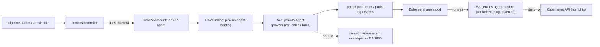
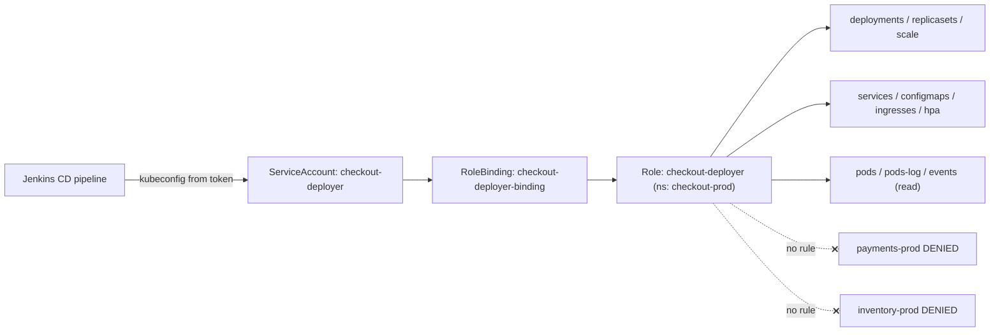
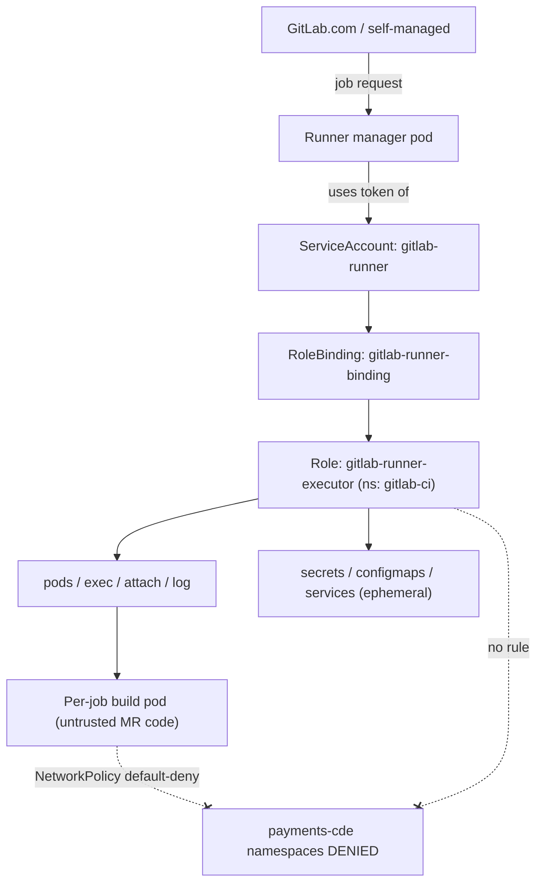
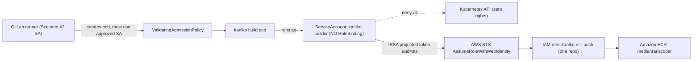
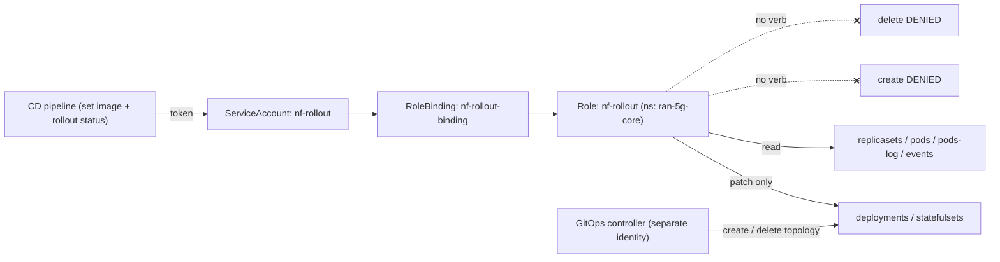

# CI/CD — Jenkins & GitLab

Five production RBAC scenarios covering how enterprises scope the Kubernetes identities that Jenkins and GitLab pipelines actually run under — the controller identity that spawns ephemeral build agents, the deploy identity that ships an app, the runner that creates build pods, the kaniko builder that pushes images, and the surgically narrow rollout identity — all on Kubernetes v1.33+.

## Scenario 41 — Jenkins Kubernetes Plugin Agent Spawner

**Company / Industry:** SaaS / B2B Workflow Automation Platform

### Business Requirement
A SaaS company runs a single Jenkins controller that builds roughly 40 microservices. To get elastic capacity and clean, reproducible build environments they adopted the Jenkins Kubernetes plugin: every build spins up an ephemeral agent pod (a JNLP/WebSocket inbound agent plus tool containers), runs the pipeline stages, and the pod is torn down at the end. The controller must create, watch, `exec` into, read logs from, and delete those agent pods on demand. The entire build fleet must be confined to one dedicated namespace and must never be able to see, schedule into, or read Secrets from tenant or production namespaces.

### Existing Problem
The original install gave the Jenkins controller ServiceAccount a `ClusterRoleBinding` to `cluster-admin` "so the plugin just works." Because pipeline authors fully control the agent `podTemplate` (arbitrary `yaml`, node selectors, volumes) and run arbitrary shell inside the `container()` step, any engineer could schedule an agent pod into `kube-system`, mount the powerful controller token, or read Secrets in customer namespaces. During an internal red-team exercise a crafted Jenkinsfile exfiltrated a tenant database Secret in under two minutes, simply by running `kubectl get secret -n tenant-acme` from a build step.

### Proposed RBAC Solution
Two distinct identities separated by trust level. The controller-side identity is a **ServiceAccount** `jenkins-agent` in a purpose-built `jenkins-build` namespace, granted a namespaced **Role** via a **RoleBinding** — never a ClusterRole. The plugin only ever creates and manages agent pods in the build namespace, so a namespaced Role is exactly correct: it is structurally incapable of enumerating or scheduling into any other namespace. A ServiceAccount (not a Group) is right because this is a non-human workload identity consumed by the plugin's Kubernetes cloud configuration. Critically, the agent pods themselves run under a **second, powerless ServiceAccount** `jenkins-agent-runtime` that has no RoleBinding at all and `automountServiceAccountToken: false`, so the untrusted build code executing inside the agent has zero Kubernetes API rights even though the controller can fully manage the pod's lifecycle.

### Kubernetes Resources
- Pods (core) — the ephemeral agent pods the plugin creates and deletes
- Pods/exec (core) — the `container()` step attaches into tool containers
- Pods/log (core) — the plugin streams agent logs back to the controller
- Events (core) — the plugin surfaces scheduling failures to the build console
- ServiceAccount (core) — both the controller identity and the powerless runtime identity
- ResourceQuota, LimitRange (core) — cap the build fleet's footprint

### Required Permissions
- `pods` (core) → `get`, `list`, `watch`, `create`, `delete`, `patch` — spawn ephemeral agents, track their status, patch labels/annotations, and tear them down. No `update` on the whole object is needed; `patch` covers the plugin's status writes.
- `pods/exec` (core) → `create`, `get` — the only meaningful verbs on the exec subresource; required for the `container()` step.
- `pods/log` (core) → `get`, `list`, `watch` — stream build output.
- `events` (core) → `get`, `list`, `watch` — show `FailedScheduling`/`ImagePullBackOff` in the pipeline log.
- No `secrets`, no `deployments`, no cluster-scoped verbs, and nothing outside `jenkins-build`.

### Architecture Diagram


### YAML Implementation
```yaml
apiVersion: v1
kind: Namespace
metadata:
  name: jenkins-build
  labels:
    app.kubernetes.io/part-of: ci-platform
    pod-security.kubernetes.io/enforce: baseline
    pod-security.kubernetes.io/warn: restricted
---
# Controller-side identity: the plugin authenticates as this SA to spawn agents
apiVersion: v1
kind: ServiceAccount
metadata:
  name: jenkins-agent
  namespace: jenkins-build
  labels:
    app.kubernetes.io/part-of: ci-platform
---
# Powerless identity the agent pods actually run as (untrusted build code)
apiVersion: v1
kind: ServiceAccount
metadata:
  name: jenkins-agent-runtime
  namespace: jenkins-build
  labels:
    app.kubernetes.io/part-of: ci-platform
automountServiceAccountToken: false
---
apiVersion: rbac.authorization.k8s.io/v1
kind: Role
metadata:
  name: jenkins-agent-spawner
  namespace: jenkins-build
  labels:
    app.kubernetes.io/part-of: ci-platform
    rbac.acme.io/source: jenkins-kubernetes-plugin
rules:
  - apiGroups: [""]
    resources: ["pods"]
    verbs: ["get", "list", "watch", "create", "delete", "patch"]
  - apiGroups: [""]
    resources: ["pods/exec"]
    verbs: ["get", "create"]
  - apiGroups: [""]
    resources: ["pods/log"]
    verbs: ["get", "list", "watch"]
  - apiGroups: [""]
    resources: ["events"]
    verbs: ["get", "list", "watch"]
---
apiVersion: rbac.authorization.k8s.io/v1
kind: RoleBinding
metadata:
  name: jenkins-agent-binding
  namespace: jenkins-build
subjects:
  - kind: ServiceAccount
    name: jenkins-agent
    namespace: jenkins-build
roleRef:
  kind: Role
  name: jenkins-agent-spawner
  apiGroup: rbac.authorization.k8s.io
---
apiVersion: v1
kind: ResourceQuota
metadata:
  name: jenkins-build-quota
  namespace: jenkins-build
spec:
  hard:
    pods: "60"
    requests.cpu: "40"
    requests.memory: 80Gi
    limits.cpu: "80"
    limits.memory: 160Gi
---
apiVersion: v1
kind: LimitRange
metadata:
  name: jenkins-build-limits
  namespace: jenkins-build
spec:
  limits:
    - type: Container
      default:
        cpu: "1"
        memory: 2Gi
      defaultRequest:
        cpu: 250m
        memory: 512Mi
```

### Commands
```bash
# 1. Apply namespace, both SAs, Role, RoleBinding, quota and limits
kubectl apply -f jenkins-agent-rbac.yaml

# 2. Mint a short-lived token for the plugin's "Kubernetes" cloud credential (v1.33 bound token)
kubectl create token jenkins-agent -n jenkins-build --duration=8h

# 3. In Jenkins -> Manage Jenkins -> Clouds -> Kubernetes, set:
#    Namespace = jenkins-build ; Credentials = the token above (Secret text)
#    In every podTemplate set: serviceAccountName: jenkins-agent-runtime
```

### Verification
```bash
# ALLOW: the controller identity can manage agent pods in its own namespace
kubectl auth can-i create pods -n jenkins-build --as=system:serviceaccount:jenkins-build:jenkins-agent
kubectl auth can-i create pods/exec -n jenkins-build --as=system:serviceaccount:jenkins-build:jenkins-agent

# DENY: it cannot read secrets, even in its own namespace
kubectl auth can-i get secrets -n jenkins-build --as=system:serviceaccount:jenkins-build:jenkins-agent
# DENY: it cannot reach another namespace at all
kubectl auth can-i create pods -n kube-system --as=system:serviceaccount:jenkins-build:jenkins-agent

# DENY: the runtime identity (untrusted build code) can do nothing
kubectl auth can-i --list -n jenkins-build --as=system:serviceaccount:jenkins-build:jenkins-agent-runtime

# Full effective set for the spawner
kubectl auth can-i --list -n jenkins-build --as=system:serviceaccount:jenkins-build:jenkins-agent
```

### Expected Output
```text
$ kubectl auth can-i create pods -n jenkins-build --as=system:serviceaccount:jenkins-build:jenkins-agent
yes
$ kubectl auth can-i create pods/exec -n jenkins-build --as=system:serviceaccount:jenkins-build:jenkins-agent
yes
$ kubectl auth can-i get secrets -n jenkins-build --as=system:serviceaccount:jenkins-build:jenkins-agent
no
$ kubectl auth can-i create pods -n kube-system --as=system:serviceaccount:jenkins-build:jenkins-agent
no

# A build step trying to read a tenant secret through the runtime SA:
$ kubectl get secret db-creds -n tenant-acme
Error from server (Forbidden): secrets "db-creds" is forbidden:
User "system:serviceaccount:jenkins-build:jenkins-agent-runtime" cannot get resource "secrets" in API group "" in the namespace "tenant-acme"
```

### Common Mistakes
- Binding the controller SA to `cluster-admin` or a `ClusterRole` "temporarily" and never narrowing it.
- Leaving the agent `podTemplate` on the namespace `default` ServiceAccount (which may have a mounted token) instead of the powerless `jenkins-agent-runtime`.
- Forgetting `automountServiceAccountToken: false` on the runtime SA, so build code can `curl` the API with the mounted token.
- Granting `secrets` `get`/`list` to the spawner because a plugin doc mentioned pull secrets — image pull secrets are referenced by name, not read via RBAC.
- Running the Jenkins controller itself in the same namespace and SA as the agents, collapsing two trust levels into one.

### Troubleshooting
- Agent pod never appears and the build hangs at "Created Pod": run `kubectl auth can-i create pods -n jenkins-build --as=system:serviceaccount:jenkins-build:jenkins-agent`; a `no` means the RoleBinding subject namespace or SA name is wrong.
- "Waiting for agent to connect": the pod was created but the `container()` step fails — check `pods/exec` `create` is present with `kubectl auth can-i create pods/exec ...`.
- `Forbidden` referencing a `User` you did not expect: `kubectl describe rolebinding jenkins-agent-binding -n jenkins-build` and confirm the `subjects[].namespace` matches where the SA lives.
- Verify the token actually maps to the SA with `kubectl auth whoami` from a debug pod using that token.

### Best Practice
Mature SaaS platforms run the Jenkins controller and its agents in separate namespaces with separate SAs, deliver the RBAC via GitOps so every widening is a reviewed pull request, and inject the plugin credential as a short-lived bound token refreshed by a sidecar rather than a never-expiring Secret. They enforce a Pod Security `restricted`/`baseline` label on the build namespace, pin allowed images with an admission policy (Kyverno/OPA), and set `serviceAccountName` on every `podTemplate` through a shared library so a pipeline author cannot silently opt back into a privileged SA.

### Security Notes
Splitting the spawner from the runtime identity collapses the blast radius: even a fully malicious Jenkinsfile can only run code inside a pod that has no API rights and no mounted token. The namespaced Role means a compromised controller credential cannot pivot into tenant namespaces or `kube-system`. The residual risk is the controller token itself — if it leaks, an attacker can create pods in `jenkins-build`, so it is kept short-lived, and admission policy prevents those pods from mounting host paths or running privileged. `escalate`/`bind` verbs are deliberately absent, so the spawner cannot grant itself more RBAC.

### Interview Questions
1. Why do you need two ServiceAccounts in a Jenkins-on-Kubernetes setup, and what does each one do?
2. Exactly which verbs does the Jenkins Kubernetes plugin need on `pods`, `pods/exec`, and `pods/log`, and why not `update`?
3. A build step runs `kubectl get secrets` and succeeds. Where did the RBAC design fail?
4. Why a namespaced Role instead of a ClusterRole for the agent spawner?
5. How would you stop a pipeline author from scheduling an agent pod onto a control-plane node?

### Interview Answers
1. The controller-side SA (`jenkins-agent`) is trusted and needs to create/delete agent pods, so it holds the spawner Role. The agent pods run untrusted, user-authored build code, so they run as a second SA (`jenkins-agent-runtime`) with no RoleBinding and no mounted token. Separating them means the powerful identity is never exposed to the code that could abuse it.
2. `pods`: `get,list,watch,create,delete,patch` — create/delete for the ephemeral lifecycle, get/list/watch to track status, patch for label/status updates. `pods/exec`: `create,get` (the only meaningful verbs) for the `container()` step. `pods/log`: `get,list,watch` to stream output. Full `update` on the pod object is unnecessary because the plugin only patches, and granting `update` would let it rewrite the whole spec.
3. The agent `podTemplate` was left on a ServiceAccount that has a mounted token and some RBAC (often the namespace `default` SA, or worse the spawner SA). The fix is a dedicated powerless runtime SA with `automountServiceAccountToken: false`.
4. The plugin only ever operates in the build namespace. A namespaced Role makes it structurally impossible to touch other namespaces; a ClusterRole would grant pod management cluster-wide, so one leaked credential could schedule into `kube-system`.
5. Enforce node scheduling via an admission policy that strips/rejects `nodeName`, control-plane `nodeSelector`/tolerations, and hostPath volumes from build pods, plus taint control-plane nodes; RBAC alone does not constrain scheduling, so this is an admission-control concern layered on top.

### Follow-up Questions
- How would you rotate the plugin's Kubernetes credential with zero failed builds?
- What admission policy would you write to guarantee every agent pod uses the powerless runtime SA?
- How do you isolate builds from different teams that share the same Jenkins controller?
- If an agent pod needs to pull from a private registry, how do you provide the pull secret without granting `secrets` `get` to the spawner?

### Production Tips
Netflix pioneered ephemeral, per-build Jenkins agents on their container platform and treats the agent runtime as fully untrusted. SaaS shops like Freshworks and Zoho run the Kubernetes plugin with a dedicated build namespace per environment, a powerless agent SA, and Kyverno policies pinning allowed images and blocking host mounts. Amazon's guidance for Jenkins on EKS is to give the controller a namespaced deploy identity and use IRSA for any AWS access rather than baking keys into the controller.

## Scenario 42 — Jenkins Deploy ServiceAccount Scoped to a Single App Namespace

**Company / Industry:** E-Commerce / Online Marketplace

### Business Requirement
An e-commerce company deploys its checkout service through a Jenkins CD pipeline directly to the `checkout-prod` namespace, often many times a day and heavily during flash-sale events. The pipeline must be able to apply and roll out the checkout Deployment and its supporting objects — Services, ConfigMaps, an Ingress, and an HPA — inside that one namespace, and observe the rollout to completion. It must never be able to touch the `payments-prod`, `inventory-prod`, or any other production namespace.

### Existing Problem
Previously a single shared `jenkins-cd` ServiceAccount held a `ClusterRole` with deployment rights bound across every production namespace. A checkout pipeline whose `kubectl apply -f` had a stale hardcoded `-n inventory-prod` overwrote the inventory service Deployment with the checkout image during a Diwali flash sale, taking the catalog offline for eleven minutes at peak traffic. The team needs the deploy identity to be physically unable to write outside its own app namespace.

### Proposed RBAC Solution
A dedicated **ServiceAccount** `checkout-deployer` in `checkout-prod`, bound by a namespaced **Role** + **RoleBinding**. A namespaced Role is the entire point: the credential cannot address any object in `inventory-prod` or `payments-prod` because RBAC scopes the Role to `checkout-prod`. A ServiceAccount (not a user or Group) is correct because Jenkins consumes a machine credential — a kubeconfig built from the SA token. Unlike a rollout-only identity, this scenario grants a fuller deploy verb set (`create`/`update`/`patch`/`delete`) because the pipeline uses `kubectl apply` with pruning and owns the full lifecycle of the checkout objects — but only within its one namespace.

### Kubernetes Resources
- Deployments, Deployments/scale, ReplicaSets (apps)
- Pods, Pods/log (core) — verify readiness and pull logs on failure
- Services, ConfigMaps (core)
- Ingresses (networking.k8s.io)
- HorizontalPodAutoscalers (autoscaling)
- Events (core) — surface rollout failures
- ServiceAccount + token Secret (core) — the credential Jenkins uses

### Required Permissions
- `deployments` (apps) → `get`, `list`, `watch`, `create`, `update`, `patch`, `delete` — full apply/prune lifecycle for the checkout workload in one namespace.
- `deployments/scale` (apps) → `patch` — manual scale-outs during sale prep.
- `replicasets` (apps) → `get`, `list`, `watch` — observe the rollout.
- `services`, `configmaps` (core) → `get`, `list`, `watch`, `create`, `update`, `patch`, `delete` — the app's config and networking objects.
- `ingresses` (networking.k8s.io) → `get`, `list`, `watch`, `create`, `update`, `patch` — routing rules.
- `horizontalpodautoscalers` (autoscaling) → `get`, `list`, `watch`, `create`, `update`, `patch` — autoscaling config.
- `pods`, `pods/log` (core) → `get`, `list`, `watch` — verification only, no create/delete of pods.
- `events` (core) → `get`, `list`, `watch`.
- No `secrets` write, no cluster-scoped resources, nothing outside `checkout-prod`.

### Architecture Diagram


### YAML Implementation
```yaml
apiVersion: v1
kind: Namespace
metadata:
  name: checkout-prod
  labels:
    app.kubernetes.io/part-of: storefront
    team: checkout
---
apiVersion: v1
kind: ServiceAccount
metadata:
  name: checkout-deployer
  namespace: checkout-prod
  labels:
    app.kubernetes.io/part-of: storefront
---
# Long-lived token Secret for building the Jenkins kubeconfig credential
apiVersion: v1
kind: Secret
metadata:
  name: checkout-deployer-token
  namespace: checkout-prod
  annotations:
    kubernetes.io/service-account.name: checkout-deployer
type: kubernetes.io/service-account-token
---
apiVersion: rbac.authorization.k8s.io/v1
kind: Role
metadata:
  name: checkout-deployer
  namespace: checkout-prod
  labels:
    app.kubernetes.io/part-of: storefront
    rbac.acme.io/source: jenkins-cd
rules:
  - apiGroups: ["apps"]
    resources: ["deployments"]
    verbs: ["get", "list", "watch", "create", "update", "patch", "delete"]
  - apiGroups: ["apps"]
    resources: ["deployments/scale"]
    verbs: ["patch"]
  - apiGroups: ["apps"]
    resources: ["replicasets"]
    verbs: ["get", "list", "watch"]
  - apiGroups: [""]
    resources: ["services", "configmaps"]
    verbs: ["get", "list", "watch", "create", "update", "patch", "delete"]
  - apiGroups: ["networking.k8s.io"]
    resources: ["ingresses"]
    verbs: ["get", "list", "watch", "create", "update", "patch"]
  - apiGroups: ["autoscaling"]
    resources: ["horizontalpodautoscalers"]
    verbs: ["get", "list", "watch", "create", "update", "patch"]
  - apiGroups: [""]
    resources: ["pods", "pods/log"]
    verbs: ["get", "list", "watch"]
  - apiGroups: [""]
    resources: ["events"]
    verbs: ["get", "list", "watch"]
---
apiVersion: rbac.authorization.k8s.io/v1
kind: RoleBinding
metadata:
  name: checkout-deployer-binding
  namespace: checkout-prod
subjects:
  - kind: ServiceAccount
    name: checkout-deployer
    namespace: checkout-prod
roleRef:
  kind: Role
  name: checkout-deployer
  apiGroup: rbac.authorization.k8s.io
```

### Commands
```bash
# 1. Apply the namespace, SA, token Secret, Role and RoleBinding
kubectl apply -f checkout-deployer-rbac.yaml

# 2. Build a kubeconfig for Jenkins from the SA token (prefer short-lived in real setups)
SA_TOKEN=$(kubectl get secret checkout-deployer-token -n checkout-prod -o jsonpath='{.data.token}' | base64 -d)
# Preferred v1.33 alternative (short-lived, refreshed each run):
# SA_TOKEN=$(kubectl create token checkout-deployer -n checkout-prod --duration=30m)

# 3. Store SA_TOKEN as a Jenkins "Secret text" credential; the pipeline runs, e.g.:
#    kubectl --token=$SA_TOKEN -n checkout-prod set image deployment/checkout web=registry/checkout:1.42.0
#    kubectl --token=$SA_TOKEN -n checkout-prod rollout status deployment/checkout --timeout=180s
```

### Verification
```bash
SA=system:serviceaccount:checkout-prod:checkout-deployer

# ALLOW: full deploy in its own namespace
kubectl auth can-i update deployments -n checkout-prod --as=$SA
kubectl auth can-i create ingresses.networking.k8s.io -n checkout-prod --as=$SA
kubectl auth can-i patch deployments/scale -n checkout-prod --as=$SA

# DENY: cannot touch other production namespaces
kubectl auth can-i update deployments -n inventory-prod --as=$SA
kubectl auth can-i update deployments -n payments-prod --as=$SA
# DENY: cannot read or write secrets anywhere
kubectl auth can-i get secrets -n checkout-prod --as=$SA

kubectl auth can-i --list -n checkout-prod --as=$SA
```

### Expected Output
```text
$ kubectl auth can-i update deployments -n checkout-prod --as=$SA
yes
$ kubectl auth can-i create ingresses.networking.k8s.io -n checkout-prod --as=$SA
yes
$ kubectl auth can-i update deployments -n inventory-prod --as=$SA
no
$ kubectl auth can-i get secrets -n checkout-prod --as=$SA
no

# The old incident, now blocked by design:
$ kubectl -n inventory-prod apply -f checkout-deployment.yaml
Error from server (Forbidden): deployments.apps "inventory-svc" is forbidden:
User "system:serviceaccount:checkout-prod:checkout-deployer" cannot patch resource "deployments" in API group "apps" in the namespace "inventory-prod"
```

### Common Mistakes
- Reusing one shared deploy SA with a ClusterRole across all prod namespaces (the exact root cause of the outage).
- Granting `secrets` `get`/`list` to the deployer because "the app needs a secret" — the app's pod reads its own secret; the deploy identity does not need to.
- Using a never-expiring token Secret and storing it in a plaintext Jenkins credential rather than a short-lived `kubectl create token`.
- Adding `namespaces` or `nodes` read to the deploy Role because a diff/plan step erred — scope those to a separate read-only identity.
- Binding the Role to a Group name that does not match how the SA authenticates, so `can-i` silently returns `no`.

### Troubleshooting
- Deploy fails with `Forbidden` on a resource you thought was covered: confirm the `apiGroups` — `ingresses` live in `networking.k8s.io`, `hpa` in `autoscaling`, not `""`.
- `rollout status` hangs: it needs `deployments` `watch` and `replicasets` `get,list,watch`; check both with `kubectl auth can-i watch replicasets -n checkout-prod --as=$SA`.
- Right verbs, wrong namespace: `kubectl describe rolebinding checkout-deployer-binding -n checkout-prod` and confirm it lives in `checkout-prod`, not the SA's default.
- Enumerate the full effective set with `kubectl auth can-i --list -n checkout-prod --as=$SA` and diff against intent.

### Best Practice
E-commerce platforms provision one deploy SA per app namespace, generated from a template so the blast radius is always one namespace, and deliver the RBAC through GitOps. They prefer short-lived tokens minted per pipeline run (`kubectl create token --duration`) over stored token Secrets, and they gate production deploys behind a Jenkins input step with approver groups. Secret material for the app is delivered by an external secrets operator into the namespace, never handled by the deploy identity.

### Security Notes
The namespaced Role hard-caps blast radius to a single app: a compromised Jenkins credential can disrupt checkout but cannot pivot to payments or inventory. Excluding `secrets` from the deploy identity means a leaked deploy token cannot exfiltrate credentials. The main residual risk is the token's lifetime — long-lived token Secrets are a standing liability, so short-lived minted tokens are strongly preferred, and the token is scoped, auditable, and revocable by deleting the binding. No `escalate`/`bind`/`impersonate` verbs exist here, so the deployer cannot grant itself more access.

### Interview Questions
1. Why is a namespaced Role the correct choice here, and what concrete failure does it prevent?
2. Which `apiGroups` do `deployments`, `ingresses`, and `horizontalpodautoscalers` belong to, and why does that matter for RBAC?
3. Why does a deploy identity not need `secrets` `get` even though the app uses secrets?
4. Compare a long-lived token Secret with `kubectl create token --duration`. Which do you use in production and why?
5. This Role has `delete` on deployments. When is that appropriate and when would you remove it?

### Interview Answers
1. The pipeline only ever ships one app, so a namespaced Role bound in `checkout-prod` makes it structurally impossible to write to any other namespace. It directly prevents the past incident where a shared cluster-wide deploy identity overwrote the inventory Deployment from a checkout pipeline.
2. `deployments` and `deployments/scale` are in `apps`; `ingresses` are in `networking.k8s.io`; `horizontalpodautoscalers` are in `autoscaling`; core objects like `services`/`configmaps` use `""`. RBAC rules match on `apiGroups`, so naming the wrong group (or `""` for an `apps` resource) silently grants nothing and the deploy is `Forbidden`.
3. The application pod reads its own mounted Secret at runtime using its own ServiceAccount; the deploy identity only references Secret names in manifests, which does not require read access. Granting `secrets` `get` to the deployer needlessly turns a leaked deploy token into a credential-exfiltration tool.
4. A token Secret never expires and sits in etcd and in the Jenkins credential store indefinitely — a standing liability. `kubectl create token --duration=30m` mints a short-lived token per run that expires automatically, dramatically shrinking the window a leaked token is useful. Production favors the short-lived token, refreshed by the pipeline each run.
5. `delete` is appropriate when the pipeline uses `kubectl apply --prune` and genuinely owns the full lifecycle of its objects, so removing a manifest should remove the object. If deployments are created and owned by a separate GitOps/provisioning flow and the pipeline only updates images, you remove `delete` (and `create`) and drop to a patch-only identity like Scenario 45.

### Follow-up Questions
- How would you template this so every new app namespace automatically gets an identically-scoped deploy SA?
- How do you give the pipeline a read-only diff/plan across namespaces without granting write there?
- What breaks if you move from `kubectl apply --prune` to a GitOps controller, and how does the deploy identity change?
- How would you require human approval for production deploys while keeping staging fully automated?

### Production Tips
Flipkart and Amazon retail teams provision one narrowly-scoped deploy identity per service namespace and treat cross-namespace deploy rights as a review-gated exception. Zomato and Swiggy scope their delivery/checkout pipelines to per-app namespaces and mint short-lived tokens per run, gating production stages behind approver groups in the pipeline. Razorpay wraps the whole flow in GitOps so RBAC and deploy manifests are peer-reviewed pull requests, with the deploy identity never holding `secrets` access.

## Scenario 43 — GitLab Runner ServiceAccount Creating Build Pods

**Company / Industry:** FinTech / Digital Payments

### Business Requirement
A payments company runs GitLab CI with the Kubernetes executor. A GitLab Runner manager pod watches for jobs and, for each one, creates a build pod (a `build` container, a `helper` container, and optional `service` containers) in a dedicated `gitlab-ci` namespace, streams output, and cleans it up. The runner must be able to create/delete these pods, exec/attach into them, read their logs, and create the ephemeral ConfigMaps and Secrets the executor injects per job. Under PCI-DSS the build fleet must be fully isolated from the cardholder-data environment (CDE) namespaces, with locked-down network egress.

### Existing Problem
The initial Helm install of `gitlab-runner` created a ServiceAccount bound to a broad `ClusterRole`. Because merge-request pipelines run untrusted, contributor-authored `.gitlab-ci.yml` scripts, a feature-branch job used the mounted runner token to `kubectl get secret -n payments-cde` and read a HashiCorp Vault AppRole token — a reportable PCI incident. The runner's Kubernetes permissions must be confined to exactly the `gitlab-ci` namespace, and network egress from build pods must be denied by default.

### Proposed RBAC Solution
A dedicated **ServiceAccount** `gitlab-runner` in the `gitlab-ci` namespace, granted a namespaced **Role** + **RoleBinding** matching precisely what the GitLab Kubernetes executor documents. A namespaced Role (never ClusterRole) confines the runner to `gitlab-ci`, so build pods cannot be scheduled into or read from CDE namespaces. A ServiceAccount is correct because the runner manager is a workload consuming the token via `automountServiceAccountToken`. Because the executor genuinely needs `secrets` `create`/`delete` in the build namespace (it injects per-job credentials and the registry pull secret), the design pairs the Role with a hard rule: the `gitlab-ci` namespace holds no long-lived secrets of value, and a default-deny **NetworkPolicy** plus a **ResourceQuota** contain the untrusted workloads.

### Kubernetes Resources
- Pods (core) — the executor's build/helper/service pods
- Pods/exec, Pods/attach (core) — the executor attaches to run the job script
- Pods/log (core) — stream job output
- Secrets (core) — ephemeral per-job credentials and registry pull secret
- ConfigMaps (core) — the injected build scripts
- Services (core) — service-container networking
- NetworkPolicy (networking.k8s.io), ResourceQuota (core) — isolation and caps

### Required Permissions
- `pods` (core) → `get`, `list`, `watch`, `create`, `delete` — the per-job pod lifecycle.
- `pods/exec` (core) → `create` — run the job script inside the build container.
- `pods/attach` (core) → `create`, `get`, `list`, `delete` — the executor attaches to stream stdin/stdout.
- `pods/log` (core) → `get`, `list` — stream logs to the GitLab job console.
- `secrets` (core) → `get`, `list`, `create`, `delete` — inject and clean up the ephemeral per-job secret and pull secret, in `gitlab-ci` only.
- `configmaps` (core) → `get`, `list`, `create`, `delete` — the injected build scripts.
- `services` (core) → `get`, `list`, `create`, `delete` — expose service containers (databases used by tests).
- No cluster-scoped resources, and nothing outside `gitlab-ci`.

### Architecture Diagram


### YAML Implementation
```yaml
apiVersion: v1
kind: Namespace
metadata:
  name: gitlab-ci
  labels:
    app.kubernetes.io/part-of: ci-platform
    compliance.acme.io/scope: non-cde
    pod-security.kubernetes.io/enforce: restricted
---
apiVersion: v1
kind: ServiceAccount
metadata:
  name: gitlab-runner
  namespace: gitlab-ci
  labels:
    app.kubernetes.io/part-of: ci-platform
---
apiVersion: rbac.authorization.k8s.io/v1
kind: Role
metadata:
  name: gitlab-runner-executor
  namespace: gitlab-ci
  labels:
    app.kubernetes.io/part-of: ci-platform
    rbac.acme.io/source: gitlab-k8s-executor
rules:
  - apiGroups: [""]
    resources: ["pods"]
    verbs: ["get", "list", "watch", "create", "delete"]
  - apiGroups: [""]
    resources: ["pods/exec"]
    verbs: ["create"]
  - apiGroups: [""]
    resources: ["pods/attach"]
    verbs: ["get", "list", "create", "delete"]
  - apiGroups: [""]
    resources: ["pods/log"]
    verbs: ["get", "list"]
  - apiGroups: [""]
    resources: ["secrets"]
    verbs: ["get", "list", "create", "delete"]
  - apiGroups: [""]
    resources: ["configmaps"]
    verbs: ["get", "list", "create", "delete"]
  - apiGroups: [""]
    resources: ["services"]
    verbs: ["get", "list", "create", "delete"]
---
apiVersion: rbac.authorization.k8s.io/v1
kind: RoleBinding
metadata:
  name: gitlab-runner-binding
  namespace: gitlab-ci
subjects:
  - kind: ServiceAccount
    name: gitlab-runner
    namespace: gitlab-ci
roleRef:
  kind: Role
  name: gitlab-runner-executor
  apiGroup: rbac.authorization.k8s.io
---
# Default-deny egress; allow only DNS + the internal package registry
apiVersion: networking.k8s.io/v1
kind: NetworkPolicy
metadata:
  name: gitlab-ci-egress-lockdown
  namespace: gitlab-ci
spec:
  podSelector: {}
  policyTypes: ["Egress"]
  egress:
    - to:
        - namespaceSelector:
            matchLabels:
              kubernetes.io/metadata.name: kube-system
      ports:
        - protocol: UDP
          port: 53
        - protocol: TCP
          port: 53
    - to:
        - namespaceSelector:
            matchLabels:
              kubernetes.io/metadata.name: platform-registry
      ports:
        - protocol: TCP
          port: 443
---
apiVersion: v1
kind: ResourceQuota
metadata:
  name: gitlab-ci-quota
  namespace: gitlab-ci
spec:
  hard:
    pods: "100"
    requests.cpu: "60"
    requests.memory: 120Gi
    limits.cpu: "120"
    limits.memory: 240Gi
```

### Commands
```bash
# 1. Apply namespace, SA, Role, RoleBinding, NetworkPolicy, quota
kubectl apply -f gitlab-runner-rbac.yaml

# 2. Install the runner pointing at this SA (Helm values excerpt)
#    rbac.create: false          # we manage RBAC ourselves above
#    serviceAccountName: gitlab-runner
#    runners.kubernetes.namespace: gitlab-ci
helm upgrade --install gitlab-runner gitlab/gitlab-runner \
  -n gitlab-ci --set rbac.create=false --set serviceAccountName=gitlab-runner \
  --set runners.config="[[runners]]\n  [runners.kubernetes]\n    namespace = \"gitlab-ci\""

# 3. Register the runner (token from the GitLab project/group CI settings)
kubectl -n gitlab-ci exec deploy/gitlab-runner -- gitlab-runner register --non-interactive
```

### Verification
```bash
SA=system:serviceaccount:gitlab-ci:gitlab-runner

# ALLOW: create build pods, exec, attach, manage ephemeral secrets in gitlab-ci
kubectl auth can-i create pods -n gitlab-ci --as=$SA
kubectl auth can-i create pods/exec -n gitlab-ci --as=$SA
kubectl auth can-i create secrets -n gitlab-ci --as=$SA

# DENY: cannot read secrets in the cardholder-data environment
kubectl auth can-i get secrets -n payments-cde --as=$SA
# DENY: cannot schedule pods outside its namespace
kubectl auth can-i create pods -n payments-cde --as=$SA
# DENY: no cluster-scoped power
kubectl auth can-i get nodes --as=$SA

kubectl auth can-i --list -n gitlab-ci --as=$SA
```

### Expected Output
```text
$ kubectl auth can-i create pods -n gitlab-ci --as=$SA
yes
$ kubectl auth can-i create pods/exec -n gitlab-ci --as=$SA
yes
$ kubectl auth can-i create secrets -n gitlab-ci --as=$SA
yes
$ kubectl auth can-i get secrets -n payments-cde --as=$SA
no
$ kubectl auth can-i get nodes --as=$SA
no

# The old PCI incident, now blocked:
$ kubectl get secret vault-approle -n payments-cde
Error from server (Forbidden): secrets "vault-approle" is forbidden:
User "system:serviceaccount:gitlab-ci:gitlab-runner" cannot get resource "secrets" in API group "" in the namespace "payments-cde"
```

### Common Mistakes
- Letting the Helm chart create a cluster-wide RBAC (`rbac.clusterWideAccess: true`) so the runner can schedule anywhere.
- Storing long-lived cloud/registry credentials as static Secrets in `gitlab-ci`, defeating the point of confining the runner there.
- Forgetting `pods/attach` `create`, which makes interactive/script streaming fail with a confusing timeout.
- No NetworkPolicy, so untrusted MR code can reach the CDE or the internet even though RBAC is tight.
- Running one runner namespace for both trusted protected-branch jobs and untrusted MR jobs instead of separating them.

### Troubleshooting
- Job stuck at "Preparing environment" then failing: the runner cannot create pods — `kubectl auth can-i create pods -n gitlab-ci --as=$SA`.
- "Error cleaning up pod" / leftover secrets: missing `delete` on `secrets`/`configmaps`; the executor creates them per job and must delete them.
- Streaming logs empty: check `pods/log` `get` and `pods/attach` `create`.
- CDE access unexpectedly works: a stale ClusterRoleBinding from the Helm default still exists — `kubectl get clusterrolebindings | grep gitlab` and remove it.
- Confirm the runner's real identity in-cluster with `kubectl -n gitlab-ci exec deploy/gitlab-runner -- cat /var/run/secrets/kubernetes.io/serviceaccount/token | ...` decoded, then `kubectl auth can-i --list`.

### Best Practice
Regulated FinTechs run untrusted merge-request pipelines on a separate runner and namespace from protected-branch pipelines, apply a default-deny egress NetworkPolicy, and enforce Pod Security `restricted`. They never store standing secrets in the CI namespace; credentials arrive as short-lived, job-scoped tokens (GitLab CI/CD variables or Vault dynamic secrets) and are cleaned up per job. RBAC is delivered by GitOps, and any move toward cluster-wide runner access is blocked by policy and audited.

### Security Notes
Confining the runner to `gitlab-ci` means a hijacked MR pipeline cannot read the CDE, which is the precise control PCI-DSS network-segmentation requirements expect. The unavoidable `secrets` `create`/`delete` right is contained by keeping no valuable secrets in the CI namespace and by default-deny egress, so even injected credentials cannot be shipped out. The residual risk is the runner manager token itself; it is short-lived where possible, and admission policy prevents build pods from gaining privileged/hostPath access. No `escalate`/`bind`/`impersonate` verbs are present, so a compromised build cannot rewrite RBAC.

### Interview Questions
1. Why does the GitLab Kubernetes executor legitimately need `secrets` `create`/`delete`, and how do you keep that from becoming a liability?
2. RBAC confines the runner to one namespace — why is a NetworkPolicy still required?
3. What is the difference in trust between a protected-branch pipeline and a merge-request pipeline, and how does that change your RBAC/namespace design?
4. Which pod subresources does the executor need and what breaks if each is missing?
5. The Helm chart offers cluster-wide RBAC. Why is that dangerous and what do you use instead?

### Interview Answers
1. The executor creates an ephemeral Secret per job to inject CI/CD variables and the registry pull credential, and deletes it on cleanup — so it needs `create`/`delete` (and `get`/`list`) on `secrets` in the build namespace. You keep it safe by ensuring the CI namespace stores no long-lived secrets of value, using short-lived job-scoped credentials, and pairing it with default-deny egress so injected secrets cannot be exfiltrated.
2. RBAC controls what the runner can do to the Kubernetes API; it does not control what a running build pod can reach over the network. Without a NetworkPolicy, untrusted MR code inside a build pod could still open TCP connections to the CDE or the internet. Default-deny egress closes that path independently of RBAC.
3. Protected-branch pipelines run reviewed, trusted code and may hold deploy credentials; merge-request pipelines run arbitrary contributor code and are untrusted. You run them on separate runners and namespaces with different (usually more restrictive) RBAC and network policy for the untrusted tier, so a malicious MR cannot borrow the trusted tier's rights.
4. `pods` create/delete for the job lifecycle, `pods/exec` create to run the script, `pods/attach` create to stream stdin/stdout, and `pods/log` get to show logs. Missing `create` on pods fails at "Preparing environment"; missing `exec`/`attach` makes the script never run or never stream; missing `log` shows an empty console.
5. Cluster-wide RBAC lets the runner create pods and read/write objects in every namespace, so a hijacked pipeline can pivot anywhere — exactly the CDE breach we had. Instead, disable chart RBAC creation and bind a hand-written namespaced Role to the runner SA in the CI namespace only.

### Follow-up Questions
- How would you run untrusted forked-MR pipelines with even less trust than internal MRs?
- How do you deliver a registry pull secret to build pods without leaving a standing secret in the namespace?
- What audit signals would you alert on to catch a runner reaching for a CDE namespace?
- How would you enforce that build pods can never be privileged or mount hostPath?

### Production Tips
Razorpay, PhonePe, and Paytm isolate CI build fleets into dedicated non-CDE namespaces with default-deny NetworkPolicies and separate runners for trusted vs untrusted pipelines, satisfying PCI network segmentation. They deliver credentials as short-lived Vault dynamic secrets scoped per job rather than standing Kubernetes Secrets, and enforce Pod Security `restricted` plus Kyverno image/host-mount policies. RBAC is GitOps-managed, and the GitLab chart's cluster-wide access option is blocked at the platform level.

## Scenario 44 — GitLab Kaniko Image-Build ServiceAccount

**Company / Industry:** Media / Video Streaming & VOD

### Business Requirement
A media streaming company builds large container images — transcoder, packager, and DRM-sidecar images, some multi-gigabyte — as part of its GitLab pipelines. They moved off Docker-in-Docker to kaniko so builds are daemonless and run without privileged containers. Each build pod must clone the repo, build the image, and push it to the company's Amazon ECR registry. The build identity should have effectively zero Kubernetes API rights; its only privilege should be pushing to one ECR repository.

### Existing Problem
The previous Docker-in-Docker approach required `privileged: true` and mounting the host's `docker.sock`/containerd socket. A compromised build (a malicious dependency in a `Dockerfile` `RUN` step) broke out of the container, reached the node's kubelet credentials, and listed pods across the cluster. DinD also violated the platform's Pod Security `restricted` baseline. The company needs a build that is unprivileged, has no node access, and cannot touch the Kubernetes API at all — while still being able to push images.

### Proposed RBAC Solution
The kaniko build pod runs under a dedicated **ServiceAccount** `kaniko-builder` in the `image-builds` namespace that has **no Role and no RoleBinding** — under RBAC's default-deny, that means zero Kubernetes API permissions. The only capability it is granted is out-of-cluster: the SA is annotated for **IRSA** (`eks.amazonaws.com/role-arn`) so its projected token is exchanged for an IAM role scoped to `ecr:*` on exactly one repository, giving kaniko push credentials without any static Docker credentials or in-cluster power. This is the purest expression of least privilege: the correct RBAC "grant" here is nothing at all. `automountServiceAccountToken: false` is still safe because the IRSA mutating webhook injects its own `sts.amazonaws.com`-audience projected token independently of the default API token, so kaniko can assume the role but cannot call the Kubernetes API. The GitLab runner that creates this pod is separately constrained (admission policy) so it can only assign the approved `kaniko-builder` SA, preventing a pipeline from swapping in a more powerful identity.

### Kubernetes Resources
- ServiceAccount (core) — `kaniko-builder`, intentionally unbound to any RBAC
- Pods (core) — the kaniko build pod (created by the GitLab runner from Scenario 43's identity)
- Amazon ECR repository (AWS) + IAM role (AWS) — the push target and federated identity
- ValidatingAdmissionPolicy (admissionregistration.k8s.io) — pin which SA build pods may use

### Required Permissions
- Kubernetes RBAC for `kaniko-builder` → **none**. No Role, no RoleBinding; every `kubectl auth can-i` for real resources returns `no`.
- AWS IAM (via IRSA, not RBAC) → `ecr:GetAuthorizationToken` (account-wide, required to log in) and `ecr:BatchCheckLayerAvailability`, `ecr:InitiateLayerUpload`, `ecr:UploadLayerPart`, `ecr:CompleteLayerUpload`, `ecr:PutImage` scoped to the single repository ARN — push only, no `ecr:Delete*`.
- The kaniko pod also needs `automountServiceAccountToken: false` and a `restricted` security context (no privilege escalation, non-root) — enforced by Pod Security, not RBAC.

### Architecture Diagram


### YAML Implementation
```yaml
apiVersion: v1
kind: Namespace
metadata:
  name: image-builds
  labels:
    app.kubernetes.io/part-of: ci-platform
    pod-security.kubernetes.io/enforce: restricted
---
# The build identity: annotated for IRSA, but bound to NO RBAC at all
apiVersion: v1
kind: ServiceAccount
metadata:
  name: kaniko-builder
  namespace: image-builds
  labels:
    app.kubernetes.io/part-of: ci-platform
  annotations:
    eks.amazonaws.com/role-arn: arn:aws:iam::210987654321:role/kaniko-ecr-push
automountServiceAccountToken: false
---
# Admission policy: build pods in this namespace may ONLY use kaniko-builder
apiVersion: admissionregistration.k8s.io/v1
kind: ValidatingAdmissionPolicy
metadata:
  name: enforce-kaniko-sa
spec:
  failurePolicy: Fail
  matchConstraints:
    resourceRules:
      - apiGroups: [""]
        apiVersions: ["v1"]
        operations: ["CREATE"]
        resources: ["pods"]
  validations:
    - expression: "object.spec.serviceAccountName == 'kaniko-builder'"
      message: "build pods in image-builds must run as the kaniko-builder ServiceAccount"
---
apiVersion: admissionregistration.k8s.io/v1
kind: ValidatingAdmissionPolicyBinding
metadata:
  name: enforce-kaniko-sa-binding
spec:
  policyName: enforce-kaniko-sa
  validationActions: ["Deny"]
  matchResources:
    namespaceSelector:
      matchLabels:
        kubernetes.io/metadata.name: image-builds
---
# Reference kaniko build pod (created per job by the GitLab runner)
apiVersion: v1
kind: Pod
metadata:
  name: kaniko-transcoder-build
  namespace: image-builds
  labels:
    app.kubernetes.io/part-of: ci-platform
spec:
  serviceAccountName: kaniko-builder
  automountServiceAccountToken: false     # IRSA still injects its own sts-audience token
  restartPolicy: Never
  securityContext:
    runAsNonRoot: true
    runAsUser: 1000
    seccompProfile:
      type: RuntimeDefault
  containers:
    - name: kaniko
      image: gcr.io/kaniko-project/executor:v1.23.0
      args:
        - "--context=git://gitlab.acme.io/media/transcoder.git#refs/heads/main"
        - "--destination=210987654321.dkr.ecr.us-east-1.amazonaws.com/media/transcoder:$(CI_COMMIT_SHORT_SHA)"
        - "--cache=true"
      securityContext:
        allowPrivilegeEscalation: false
        capabilities:
          drop: ["ALL"]
      resources:
        requests:
          cpu: "2"
          memory: 4Gi
        limits:
          cpu: "4"
          memory: 8Gi
```

### Commands
```bash
# 1. Create the IAM role trusting the cluster OIDC provider for this SA (IRSA)
eksctl create iamserviceaccount \
  --cluster media-prod-use1 --namespace image-builds --name kaniko-builder \
  --role-name kaniko-ecr-push --role-only \
  --attach-policy-arn arn:aws:iam::210987654321:policy/kaniko-ecr-push-one-repo \
  --approve

# 2. Apply namespace, SA (with IRSA annotation), and the admission policy
kubectl apply -f kaniko-builder-rbac.yaml

# 3. The GitLab pipeline creates the kaniko pod per job (kubernetes executor)
#    .gitlab-ci.yml uses image: gcr.io/kaniko-project/executor:debug and the SA above
```

### Verification
```bash
SA=system:serviceaccount:image-builds:kaniko-builder

# DENY everything on the Kubernetes API — the SA has no RBAC
kubectl auth can-i get pods -n image-builds --as=$SA
kubectl auth can-i get secrets -n image-builds --as=$SA
kubectl auth can-i create pods -n image-builds --as=$SA
kubectl auth can-i list namespaces --as=$SA

# The only "grant" is out-of-cluster: confirm IRSA env is injected into the pod
kubectl -n image-builds get pod kaniko-transcoder-build \
  -o jsonpath='{.spec.containers[0].env}' 2>/dev/null
kubectl -n image-builds describe pod kaniko-transcoder-build | grep -i aws_role_arn

# Effective set: should show only the universal self-review verbs, nothing real
kubectl auth can-i --list -n image-builds --as=$SA
```

### Expected Output
```text
$ kubectl auth can-i get pods -n image-builds --as=$SA
no
$ kubectl auth can-i get secrets -n image-builds --as=$SA
no
$ kubectl auth can-i create pods -n image-builds --as=$SA
no

$ kubectl auth can-i --list -n image-builds --as=$SA
Resources                                       Non-Resource URLs   Resource Names   Verbs
selfsubjectreviews.authentication.k8s.io        []                  []               [create]
selfsubjectaccessreviews.authorization.k8s.io   []                  []               [create]
selfsubjectrulesreviews.authorization.k8s.io    []                  []               [create]

# A pipeline trying to sneak in a privileged SA is blocked at admission:
$ kubectl -n image-builds apply -f build-pod-with-admin-sa.yaml
Error from server: admission webhook denied the request:
build pods in image-builds must run as the kaniko-builder ServiceAccount
```

### Common Mistakes
- Attaching a Role to `kaniko-builder` "just in case" — an image builder needs no Kubernetes API access whatsoever.
- Scoping the ECR IAM policy to `ecr:*` on all repositories instead of push-only verbs on one repo ARN.
- Storing a static `~/.docker/config.json` with long-lived registry credentials in a Secret instead of using IRSA/Workload Identity.
- Assuming `automountServiceAccountToken: false` breaks IRSA — the IRSA webhook injects a separate projected token, so it still works.
- Not constraining which SA the runner may assign, letting a pipeline mount a powerful SA into the build pod.

### Troubleshooting
- `kaniko` fails at push with `no basic auth credentials`: IRSA is not wired up — check the SA annotation and `AWS_ROLE_ARN`/`AWS_WEB_IDENTITY_TOKEN_FILE` env in the pod (`kubectl describe pod`).
- `AccessDenied` on `ecr:PutImage`: the IAM policy is missing the push verbs or the repository ARN does not match.
- `not authorized to perform sts:AssumeRoleWithWebIdentity`: the IAM role trust policy's `sub` does not match `system:serviceaccount:image-builds:kaniko-builder`.
- Build pod rejected at creation: the admission policy fired because `serviceAccountName` was not `kaniko-builder` — that is working as intended.
- Confirm the SA truly has no RBAC with `kubectl auth can-i --list -n image-builds --as=$SA`.

### Best Practice
Media platforms build images rootless (kaniko, buildah, or Cloud Build) with an in-cluster identity that has zero Kubernetes RBAC and a cloud identity scoped to a single registry repository with push-only permissions. They enforce Pod Security `restricted`, drop all Linux capabilities, and use admission policy (ValidatingAdmissionPolicy or Kyverno) to pin the allowed build SA and forbid privileged/hostPath. Registry credentials are always federated (IRSA on EKS, Workload Identity on GKE), never static Docker config secrets.

### Security Notes
The design eliminates the entire DinD breakout class: no privileged container, no host socket, no node credential exposure. Because the SA has no RBAC, even a fully compromised `Dockerfile RUN` step cannot enumerate or read anything in the cluster — the Kubernetes blast radius is zero. The only reachable capability is pushing to one ECR repo (no delete, no other repos), so a hijacked build cannot overwrite unrelated images or delete tags. The admission policy closes the escalation path of assigning a stronger SA; there is no `escalate`/`bind`/`impersonate` anywhere in this design.

### Interview Questions
1. Why does the kaniko build ServiceAccount have no Role or RoleBinding at all, and is that a mistake?
2. How can IRSA work when `automountServiceAccountToken` is `false`?
3. What security problems does kaniko solve compared with Docker-in-Docker?
4. How do you stop a pipeline author from running the build pod under a more powerful ServiceAccount?
5. How should the ECR IAM permissions be scoped, and why not `ecr:*`?

### Interview Answers
1. It is intentional, not a mistake. An image builder only needs to clone code and push an image — neither requires the Kubernetes API. Under RBAC default-deny, no binding means no API rights, which is the strongest possible least-privilege posture. The only capability it needs (registry push) is granted out-of-band via a federated cloud identity.
2. IRSA's mutating admission webhook injects its own projected `serviceAccountToken` volume with audience `sts.amazonaws.com` plus the `AWS_ROLE_ARN` and `AWS_WEB_IDENTITY_TOKEN_FILE` env vars. That is separate from the default Kubernetes API token that `automountServiceAccountToken: false` suppresses, so kaniko can assume the IAM role while remaining unable to call the Kubernetes API.
3. DinD requires a privileged container and access to a Docker/containerd socket, which is a well-known breakout vector to the node and violates Pod Security `restricted`. Kaniko builds in userspace without a daemon, runs unprivileged and non-root, and needs no socket, so a malicious build step cannot escape to the node.
4. Use a ValidatingAdmissionPolicy (or Kyverno) bound to the build namespace that rejects any pod whose `spec.serviceAccountName` is not the approved `kaniko-builder`. Combined with the runner being confined to that namespace, a pipeline cannot mount a stronger identity.
5. Scope to `ecr:GetAuthorizationToken` (which must be account-wide to log in) plus the push verbs — `BatchCheckLayerAvailability`, `InitiateLayerUpload`, `UploadLayerPart`, `CompleteLayerUpload`, `PutImage` — on exactly one repository ARN, and omit all `ecr:Delete*`/`ecr:BatchDeleteImage`. `ecr:*` would let a compromised build delete or overwrite images across every repository in the account.

### Follow-up Questions
- How would you achieve the equivalent registry federation on GKE and on AKS?
- How do you prevent a malicious `Dockerfile` from exfiltrating the IRSA token to an attacker-controlled endpoint?
- How would you add image signing (cosign) and enforce it at deploy time?
- What would change if the same image had to be pushed to two registries in different accounts?

### Production Tips
Kaniko itself originated at Google, whose Cloud Build promotes daemonless, unprivileged image builds with Workload Identity for registry push. Netflix builds images rootless with tightly scoped registry identities and zero cluster RBAC on the build workload. Media and streaming platforms on EKS use IRSA-scoped ECR push roles per repository and enforce the allowed build SA with admission policy, while Red Hat's OpenShift ecosystem favors buildah/S2I with equally minimal in-cluster rights.

## Scenario 45 — Pipeline Least-Privilege Deploy ServiceAccount (Rollout / Patch Only)

**Company / Industry:** Telecom / 5G Core Network

### Business Requirement
A telecom operator runs 5G core network functions (AMF, SMF, UPF) as Deployments and StatefulSets on Kubernetes under carrier-grade change control. The CD pipeline is allowed to do exactly one thing: bump the container image tag on pre-existing network-function workloads and trigger/observe a controlled rollout. It must not create new workloads, delete existing ones, or otherwise mutate topology — those changes flow through a separate, change-approved GitOps process. Regulatory and carrier SLAs require that an automated pipeline can never drop live subscriber sessions.

### Existing Problem
The former deploy ServiceAccount held `create`, `update`, and `delete` on Deployments across the `ran-5g-core` namespace. A pipeline run with a bad Helm values file performed a delete-and-recreate of the stateful UPF (User Plane Function) Deployment instead of an in-place image update, tearing down all pods at once and dropping active subscriber data sessions for a large metro region — an SLA-breaching outage. The operator needs a deploy identity that can only patch existing workloads, never create or delete them.

### Proposed RBAC Solution
A surgically narrow **ServiceAccount** `nf-rollout` in `ran-5g-core`, bound by a namespaced **Role** + **RoleBinding** that grants only `get`/`list`/`watch`/`patch` on `deployments` and `statefulsets` — deliberately no `create`, no `update` (full-object replace), and no `delete`. `patch` is exactly the verb behind `kubectl set image` and `kubectl rollout restart`, so the pipeline can change an image tag and roll it out, but cannot replace or remove the object. A namespaced Role is correct because the pipeline targets one network-function namespace; a ServiceAccount is correct because the pipeline consumes a machine token. The ability to create or delete network functions is reserved for a separate GitOps controller identity, keeping topology changes under human-reviewed change control.

### Kubernetes Resources
- Deployments, StatefulSets, Deployments/scale (apps) — the network-function workloads
- ReplicaSets (apps) — observe rollout progress
- Pods, Pods/log (core) — verify readiness, read logs on failure
- Events (core) — surface rollout problems

### Required Permissions
- `deployments`, `statefulsets` (apps) → `get`, `list`, `watch`, `patch` — patch covers `set image` and `rollout restart`; **no `create`, no `update`, no `delete`** so topology cannot change and workloads cannot be replaced or removed.
- `deployments/scale`, `statefulsets/scale` (apps) → `patch` — controlled, approved scale changes only (optional; can be removed for the strictest posture).
- `replicasets` (apps) → `get`, `list`, `watch` — follow the rollout the controller creates.
- `pods`, `pods/log` (core) → `get`, `list`, `watch` — verify readiness and read failure logs; no pod create/delete.
- `events` (core) → `get`, `list`, `watch` — diagnose rollout failures.
- No `secrets`, no `configmaps` write, no cluster-scoped resources.

### Architecture Diagram


### YAML Implementation
```yaml
apiVersion: v1
kind: Namespace
metadata:
  name: ran-5g-core
  labels:
    app.kubernetes.io/part-of: 5g-core
    change-control.telco.io/tier: carrier-grade
---
apiVersion: v1
kind: ServiceAccount
metadata:
  name: nf-rollout
  namespace: ran-5g-core
  labels:
    app.kubernetes.io/part-of: 5g-core
---
apiVersion: rbac.authorization.k8s.io/v1
kind: Role
metadata:
  name: nf-rollout
  namespace: ran-5g-core
  labels:
    app.kubernetes.io/part-of: 5g-core
    rbac.telco.io/source: cd-pipeline
rules:
  - apiGroups: ["apps"]
    resources: ["deployments", "statefulsets"]
    verbs: ["get", "list", "watch", "patch"]
  - apiGroups: ["apps"]
    resources: ["deployments/scale", "statefulsets/scale"]
    verbs: ["patch"]
  - apiGroups: ["apps"]
    resources: ["replicasets"]
    verbs: ["get", "list", "watch"]
  - apiGroups: [""]
    resources: ["pods", "pods/log"]
    verbs: ["get", "list", "watch"]
  - apiGroups: [""]
    resources: ["events"]
    verbs: ["get", "list", "watch"]
---
apiVersion: rbac.authorization.k8s.io/v1
kind: RoleBinding
metadata:
  name: nf-rollout-binding
  namespace: ran-5g-core
subjects:
  - kind: ServiceAccount
    name: nf-rollout
    namespace: ran-5g-core
roleRef:
  kind: Role
  name: nf-rollout
  apiGroup: rbac.authorization.k8s.io
```

### Commands
```bash
# 1. Apply namespace, SA, Role, RoleBinding
kubectl apply -f nf-rollout-rbac.yaml

# 2. Mint a short-lived token for the pipeline run
TOKEN=$(kubectl create token nf-rollout -n ran-5g-core --duration=20m)

# 3. What the pipeline is allowed to do (patch-based rollout):
kubectl --token=$TOKEN -n ran-5g-core set image deployment/amf amf=registry.telco.io/5gc/amf:2.9.1   # PATCH
kubectl --token=$TOKEN -n ran-5g-core rollout restart statefulset/upf                                # PATCH
kubectl --token=$TOKEN -n ran-5g-core rollout status deployment/amf --timeout=300s                   # GET/WATCH
```

### Verification
```bash
SA=system:serviceaccount:ran-5g-core:nf-rollout

# ALLOW: patch (set image / rollout restart) and observe
kubectl auth can-i patch deployments -n ran-5g-core --as=$SA
kubectl auth can-i patch statefulsets -n ran-5g-core --as=$SA
kubectl auth can-i watch replicasets -n ran-5g-core --as=$SA

# DENY: cannot create, update (full replace), or delete workloads
kubectl auth can-i create deployments -n ran-5g-core --as=$SA
kubectl auth can-i update deployments -n ran-5g-core --as=$SA
kubectl auth can-i delete deployments -n ran-5g-core --as=$SA
kubectl auth can-i delete statefulsets -n ran-5g-core --as=$SA
# DENY: no secrets
kubectl auth can-i get secrets -n ran-5g-core --as=$SA

kubectl auth can-i --list -n ran-5g-core --as=$SA
```

### Expected Output
```text
$ kubectl auth can-i patch deployments -n ran-5g-core --as=$SA
yes
$ kubectl auth can-i patch statefulsets -n ran-5g-core --as=$SA
yes
$ kubectl auth can-i create deployments -n ran-5g-core --as=$SA
no
$ kubectl auth can-i update deployments -n ran-5g-core --as=$SA
no
$ kubectl auth can-i delete deployments -n ran-5g-core --as=$SA
no
$ kubectl auth can-i get secrets -n ran-5g-core --as=$SA
no

# The old outage path, now impossible:
$ kubectl -n ran-5g-core delete deployment upf
Error from server (Forbidden): deployments.apps "upf" is forbidden:
User "system:serviceaccount:ran-5g-core:nf-rollout" cannot delete resource "deployments" in API group "apps" in the namespace "ran-5g-core"
```

### Common Mistakes
- Granting `update` alongside `patch` "for completeness" — `update` allows a full-object replace that can silently change topology and defeats the intent.
- Adding `delete` so `kubectl apply --prune` works, which re-enables the delete-and-recreate outage.
- Assuming `rollout undo` will work — a strict patch-only identity should roll back by re-running the pipeline with the previous image tag (a patch), not by delete/recreate.
- Forgetting `replicasets`/`pods` read verbs, so `rollout status` cannot follow progress and the pipeline times out.
- Giving this identity `create` on pods to "restart" a workload instead of using `rollout restart` (a deployment patch).

### Troubleshooting
- `set image` fails with `Forbidden`: confirm `patch` on `deployments` in `apps` with `kubectl auth can-i patch deployments -n ran-5g-core --as=$SA`.
- `rollout status` hangs then errors: the identity is missing `deployments`/`replicasets` `watch` — add the read verbs.
- A legitimate new network function cannot be created by the pipeline: that is by design; route creation through the GitOps controller identity, not this SA.
- Unexpected `create`/`delete` succeeding: a broader ClusterRoleBinding is also granting this SA rights — `kubectl auth can-i --list` and hunt the extra binding with `kubectl get clusterrolebindings -o wide | grep nf-rollout`.

### Best Practice
Carrier-grade and regulated operators split "change topology" from "roll a new image": a GitOps controller (Argo CD/Flux) owns create/delete of workloads under peer-reviewed pull requests, while the imperative CD pipeline holds only a patch-only rollout identity for image bumps. Rollbacks are re-applies of a previous known-good tag, not deletes. RBAC is delivered as code, tokens are short-lived and minted per run, and every rollout is tied to an approved change record for audit.

### Security Notes
Removing `create`/`update`/`delete` shrinks the blast radius to "change the running image tag," which cannot destroy a stateful network function or drop subscriber sessions — the precise SLA risk that caused the outage. Excluding `secrets`/`configmaps` write means a leaked pipeline token cannot alter configuration or read credentials. The design contains supply-chain risk too: even if a malicious image tag is pushed, the identity can only roll it out (observable and revertible), not delete workloads or pivot elsewhere. No `escalate`/`bind`/`impersonate` verbs exist, so the pipeline cannot expand its own rights.

### Interview Questions
1. Why grant `patch` but explicitly deny `update` on Deployments, given both modify the object?
2. How do `kubectl set image`, `kubectl rollout restart`, and `kubectl rollout status` map to RBAC verbs?
3. If this identity cannot `delete`, how does the team roll back a bad release?
4. Why separate the "create/delete topology" identity from the "rollout" identity, and who owns each?
5. What read permissions does a rollout-only identity still need, and why?

### Interview Answers
1. `patch` applies a partial, strategic-merge change — ideal for bumping an image tag or adding the `restartedAt` annotation — and cannot remove fields the pipeline did not mention. `update` (`PUT`) replaces the entire object, so a bad manifest could silently rewrite replica counts, volume claims, or the whole pod template, changing topology. Denying `update` keeps the pipeline's power to exactly "modify what it explicitly targets."
2. `kubectl set image` issues a PATCH to the Deployment's pod template (needs `patch`). `kubectl rollout restart` issues a PATCH adding a `kubectl.kubernetes.io/restartedAt` annotation (needs `patch`). `kubectl rollout status` issues GET/WATCH on the Deployment and its ReplicaSets (needs `get`/`list`/`watch`), which is why the read verbs are mandatory even for a "write" pipeline.
3. Rollback is a forward patch: re-run the pipeline pinned to the previous known-good image tag, which is another `kubectl set image` PATCH. This avoids `delete`/recreate entirely, keeps the workload (especially StatefulSets) intact, and preserves the no-session-drop guarantee. `rollout undo` is deliberately not relied upon because a strict posture avoids the update/replace path.
4. Topology changes (adding, removing, or restructuring network functions) are high-risk and must be human-reviewed, so a GitOps controller owns `create`/`delete` under pull-request approval and change records. The imperative CD pipeline only needs to ship a new image, so it gets a patch-only identity. Splitting them means a routine automated deploy can never perform a destructive topology change.
5. It needs `get`/`list`/`watch` on `deployments`/`statefulsets` and `replicasets` to follow rollout progress, and `get`/`list`/`watch` on `pods`, `pods/log`, and `events` to verify readiness and surface failures. Without these, `rollout status` cannot complete and the pipeline cannot tell whether the deploy succeeded.

### Follow-up Questions
- How would you allow controlled scaling but still forbid full `update` — is `deployments/scale` `patch` enough?
- How do you enforce that only signed, approved image tags can be rolled out by this identity?
- How would you extend this to StatefulSets with `OnDelete` update strategy where a patch alone does not roll pods?
- How do you tie every rollout performed by this SA back to a change-management record for the regulator?

### Production Tips
Telecom cloud platforms from Cisco, VMware (Telco Cloud), and Red Hat (OpenShift for 5G/RAN) separate GitOps-owned topology from imperative image rollouts and lean on patch-scoped deploy identities plus aggregated ClusterRoles for platform operators. IBM and Red Hat's telco reference architectures gate every change behind Argo CD pull requests tied to change records, mint short-lived deploy tokens per pipeline run, and forbid `delete` on stateful network functions so an automated pipeline can never drop live sessions.
