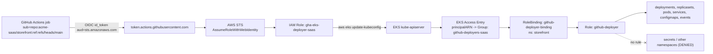
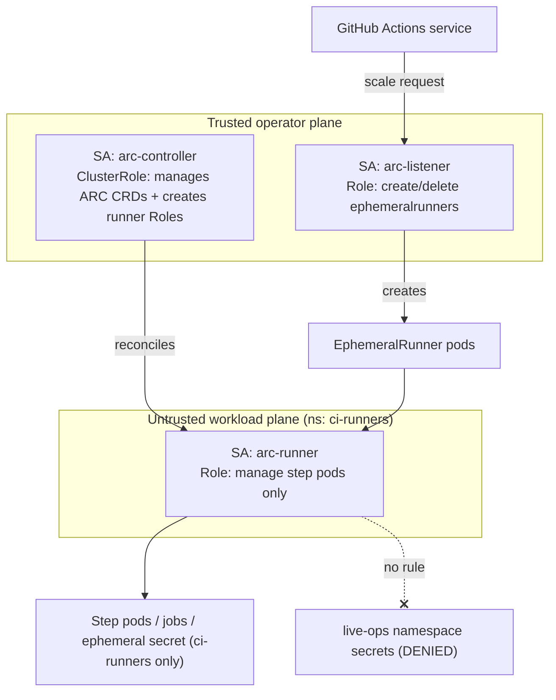
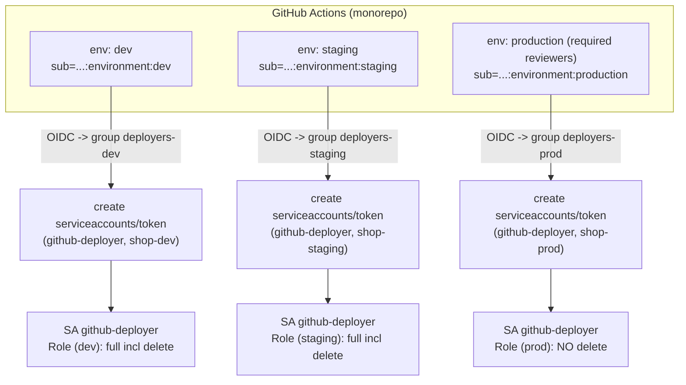
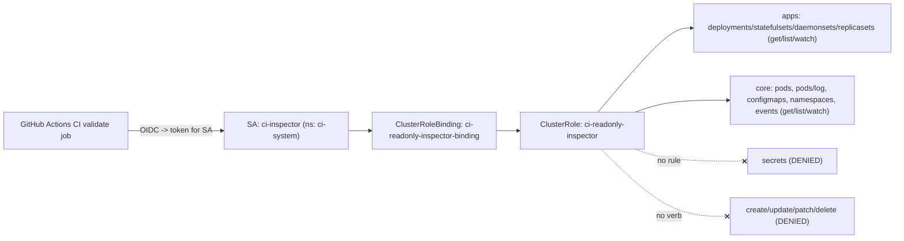
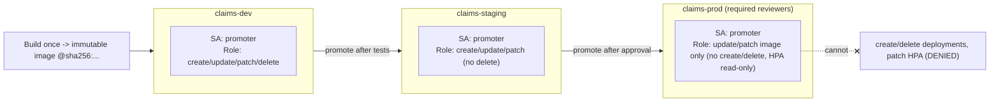

# GitHub Actions & OIDC

Five production RBAC scenarios covering how enterprises let GitHub Actions reach Kubernetes without long-lived credentials — federating GitHub's OIDC provider into cloud IAM and cluster RBAC, running self-hosted runners in-cluster, and scoping deploy identities per environment on Kubernetes v1.33+.

## Scenario 46 — GitHub Actions OIDC Federation to EKS via IRSA

**Company / Industry:** SaaS / Multi-Tenant B2B Platform

### Business Requirement
A B2B SaaS company ships its storefront and API services to a production EKS cluster from GitHub Actions dozens of times a day. Security and SOC 2 auditors mandate keyless CI/CD: no static AWS access keys may ever live in GitHub secrets, and every deploy must be attributable to a specific repository and branch. The pipeline must be able to roll out Deployments in the `storefront` namespace and watch the rollout to completion, but nothing more — it must not touch other tenants' namespaces or cluster-scoped objects.

### Existing Problem
The previous pipeline stored a long-lived IAM user access key pair in an organization-level GitHub secret with broad `eks:*` and `AdministratorAccess`. One of those keys leaked when a contributor pushed a workflow that echoed the environment during debugging, and the key was scraped from public Actions logs within minutes. Rotation was manual and error-prone, and because the IAM user mapped to `system:masters` via the `aws-auth` ConfigMap, the blast radius was the entire cluster. The company needs short-lived, federated credentials scoped to one namespace.

### Proposed RBAC Solution
GitHub's OIDC provider (`token.actions.githubusercontent.com`) is registered as an IAM OIDC identity provider. A dedicated IAM role (`gha-eks-deployer-saas`) trusts that provider with a `sub` condition pinned to `repo:acme-saas/storefront:ref:refs/heads/main`, so only the `main` branch of one repo can assume it via `AssumeRoleWithWebIdentity`. Inside EKS, an **EKS Access Entry** maps that IAM role ARN to the Kubernetes **Group** `github-deployers-saas` — not to `system:masters`. That group is granted a namespaced **Role** through a **RoleBinding** in the `storefront` namespace. A namespaced Role (not a ClusterRole) is the correct choice because the CI identity must be blind to every other tenant. Binding to a Group rather than a per-run identity means the mapping is stable while the underlying token is short-lived and rotates on every job. (Note: IRSA proper maps an in-cluster ServiceAccount to an IAM role for pods; here the same OIDC-trust primitive is used in the CI direction — GitHub OIDC to IAM to an EKS-mapped RBAC group.)

### Kubernetes Resources
- Deployments, ReplicaSets (apps)
- Pods, Pods/log (core) — to watch rollout and read failure logs
- Services, ConfigMaps (core)
- Events (core) — to surface rollout failures
- EKS Access Entry (AWS control plane object mapping the IAM role to a K8s group)

### Required Permissions
- `deployments` (apps) → `get`, `list`, `watch`, `create`, `update`, `patch` — apply and roll out; **no `delete`** so a bad job cannot wipe a workload.
- `replicasets` (apps) → `get`, `list`, `watch` — observe the rollout the Deployment controller creates.
- `pods`, `pods/log` (core) → `get`, `list`, `watch` — confirm readiness and pull logs on failure.
- `services`, `configmaps` (core) → `get`, `list`, `watch`, `create`, `update`, `patch` — apply the accompanying manifests.
- `events` (core) → `get`, `list`, `watch` — diagnose `FailedScheduling`/`ImagePullBackOff`.
- No `secrets`, no `nodes`, no other namespace.

### Architecture Diagram


### YAML Implementation
```yaml
# --- EKS side: map the federated IAM role to a K8s group (eksctl ClusterConfig) ---
apiVersion: eksctl.io/v1alpha5
kind: ClusterConfig
metadata:
  name: saas-prod-use1
  region: us-east-1
accessConfig:
  authenticationMode: API_AND_CONFIG_MAP
accessEntries:
  - principalARN: arn:aws:iam::123456789012:role/gha-eks-deployer-saas
    type: STANDARD
    kubernetesGroups:
      - github-deployers-saas
---
# --- Cluster RBAC: namespaced deploy role bound to the federated group ---
apiVersion: v1
kind: Namespace
metadata:
  name: storefront
  labels:
    app.kubernetes.io/part-of: saas-platform
    tenant.acme.io/tier: production
---
apiVersion: rbac.authorization.k8s.io/v1
kind: Role
metadata:
  name: github-deployer
  namespace: storefront
  labels:
    app.kubernetes.io/part-of: saas-platform
    rbac.acme.io/source: github-actions-oidc
rules:
  - apiGroups: ["apps"]
    resources: ["deployments"]
    verbs: ["get", "list", "watch", "create", "update", "patch"]
  - apiGroups: ["apps"]
    resources: ["replicasets"]
    verbs: ["get", "list", "watch"]
  - apiGroups: [""]
    resources: ["pods", "pods/log"]
    verbs: ["get", "list", "watch"]
  - apiGroups: [""]
    resources: ["services", "configmaps"]
    verbs: ["get", "list", "watch", "create", "update", "patch"]
  - apiGroups: [""]
    resources: ["events"]
    verbs: ["get", "list", "watch"]
---
apiVersion: rbac.authorization.k8s.io/v1
kind: RoleBinding
metadata:
  name: github-deployer-binding
  namespace: storefront
  labels:
    app.kubernetes.io/part-of: saas-platform
subjects:
  - kind: Group
    name: github-deployers-saas          # mapped from the IAM role via the EKS access entry
    apiGroup: rbac.authorization.k8s.io
roleRef:
  kind: Role
  name: github-deployer
  apiGroup: rbac.authorization.k8s.io
```

### Commands
```bash
# 1. Register GitHub's OIDC provider in IAM (one-time per account)
aws iam create-open-id-connect-provider \
  --url https://token.actions.githubusercontent.com \
  --client-id-list sts.amazonaws.com

# 2. Create the IAM role trusting only main branch of one repo
cat > trust-policy.json <<'JSON'
{
  "Version": "2012-10-17",
  "Statement": [{
    "Effect": "Allow",
    "Principal": { "Federated": "arn:aws:iam::123456789012:oidc-provider/token.actions.githubusercontent.com" },
    "Action": "sts:AssumeRoleWithWebIdentity",
    "Condition": {
      "StringEquals": {
        "token.actions.githubusercontent.com:aud": "sts.amazonaws.com",
        "token.actions.githubusercontent.com:sub": "repo:acme-saas/storefront:ref:refs/heads/main"
      }
    }
  }]
}
JSON
aws iam create-role --role-name gha-eks-deployer-saas \
  --assume-role-policy-document file://trust-policy.json

# Minimal AWS-side permission: only describe the cluster (no eks:* wildcard)
aws iam put-role-policy --role-name gha-eks-deployer-saas \
  --policy-name eks-describe --policy-document \
  '{"Version":"2012-10-17","Statement":[{"Effect":"Allow","Action":"eks:DescribeCluster","Resource":"arn:aws:eks:us-east-1:123456789012:cluster/saas-prod-use1"}]}'

# 3. Create the EKS access entry mapping the role -> K8s group
eksctl create accessentry -f saas-prod-use1.yaml     # or: aws eks create-access-entry --kubernetes-groups github-deployers-saas ...

# 4. Apply the cluster RBAC
kubectl apply -f github-deployer-rbac.yaml

# 5. In the workflow (reference): id-token: write + configure-aws-credentials, then
#    aws eks update-kubeconfig --name saas-prod-use1 --region us-east-1
```

### Verification
```bash
# ALLOW: the federated group can roll out in its own namespace
kubectl auth can-i patch deployments -n storefront --as-group=github-deployers-saas --as=oidc:gha
kubectl auth can-i watch pods -n storefront --as-group=github-deployers-saas --as=oidc:gha

# DENY: cannot delete workloads
kubectl auth can-i delete deployments -n storefront --as-group=github-deployers-saas --as=oidc:gha
# DENY: cannot read secrets
kubectl auth can-i get secrets -n storefront --as-group=github-deployers-saas --as=oidc:gha
# DENY: cannot touch another tenant's namespace
kubectl auth can-i get deployments -n billing --as-group=github-deployers-saas --as=oidc:gha

# Full effective set for the CI identity
kubectl auth can-i --list -n storefront --as-group=github-deployers-saas --as=oidc:gha
```

### Expected Output
```text
$ kubectl auth can-i patch deployments -n storefront --as-group=github-deployers-saas --as=oidc:gha
yes
$ kubectl auth can-i watch pods -n storefront --as-group=github-deployers-saas --as=oidc:gha
yes
$ kubectl auth can-i delete deployments -n storefront --as-group=github-deployers-saas --as=oidc:gha
no
$ kubectl auth can-i get secrets -n storefront --as-group=github-deployers-saas --as=oidc:gha
no
$ kubectl auth can-i get deployments -n billing --as-group=github-deployers-saas --as=oidc:gha
no

# If a job on a feature branch assumes-then-tries to delete in prod:
$ kubectl delete deployment storefront-api -n storefront
Error from server (Forbidden): deployments.apps "storefront-api" is forbidden:
User "github-deployers-saas" cannot delete resource "deployments" in API group "apps" in the namespace "storefront"
```

### Common Mistakes
- Setting the IAM trust `sub` to `repo:org/repo:*` — any branch, tag, or pull_request from a fork can then assume the deploy role.
- Forgetting the `aud` (`sts.amazonaws.com`) condition, so a token minted for another audience is accepted.
- Mapping the IAM role to `system:masters` in `aws-auth`/access entries "to get CI working" and never narrowing it.
- Granting `eks:*` on the IAM role when only `eks:DescribeCluster` is needed to build the kubeconfig.
- Using a ClusterRole/ClusterRoleBinding so the CI identity can see every tenant namespace.

### Troubleshooting
- `error: You must be logged in to the server (Unauthorized)`: the IAM role assumed but has no matching EKS access entry — check `aws eks list-access-entries` and the exact `principalARN`.
- `Forbidden` after auth succeeds: the access entry mapped to a different group than the RoleBinding subject — reconcile the group name in both places.
- `Not authorized to perform sts:AssumeRoleWithWebIdentity`: the `sub`/`aud` in the token does not match the trust policy — decode the OIDC token claims in the Actions log (never print the token itself).
- Confirm the effective identity from the runner with `kubectl auth whoami` and enumerate with `kubectl auth can-i --list -n storefront`.

### Best Practice
Mature SaaS shops pin the trust policy `sub` to a specific `environment:production` claim gated behind a GitHub Environment with required reviewers, register the OIDC provider and IAM role via Terraform, and manage EKS access entries as code (not click-ops). The `authenticationMode` is moved to `API` only (retiring `aws-auth`) once every legacy mapping is migrated to access entries, and the deploy role is delivered by GitOps so RBAC changes are peer-reviewed pull requests.

### Security Notes
Keyless federation removes the single highest-value CI secret from GitHub entirely; tokens are minted per job, expire in minutes, and are bound to one repo/branch, so a leaked Actions log is worthless. Blast radius is bounded to one namespace with no `delete` and no `secrets` access, so a compromised pipeline cannot exfiltrate credentials or destroy tenants. The residual risk is trust-policy sprawl: a wildcard `sub` silently re-opens the door, so the `sub`/`aud` conditions must be treated as security-critical and reviewed like firewall rules.

### Interview Questions
1. Walk through the exact token exchange from a GitHub Actions job to a `kubectl apply` on EKS with no static keys.
2. What are the two IAM trust-policy conditions that actually enforce security, and what happens if either is missing or wildcarded?
3. Why map the IAM role to a Kubernetes Group rather than binding the role ARN directly, and how do EKS access entries differ from the `aws-auth` ConfigMap?
4. Why is this a namespaced Role and not a ClusterRole, and why omit the `delete` verb on deployments?
5. IRSA and this CI flow both use OIDC — what is the directional difference between them?

### Interview Answers
1. The Actions runner requests an OIDC ID token from `token.actions.githubusercontent.com` with audience `sts.amazonaws.com`; `configure-aws-credentials` calls `sts:AssumeRoleWithWebIdentity` presenting that token; STS validates the signature and the trust-policy conditions and returns short-lived AWS credentials; the job runs `aws eks update-kubeconfig`, and the EKS access entry maps the assumed role ARN to the `github-deployers-saas` group, which RBAC binds to the namespaced Role — so `kubectl` calls are authorized by the group, not by any stored secret.
2. `token.actions.githubusercontent.com:aud` must equal `sts.amazonaws.com` and `:sub` must equal the exact `repo:org/repo:ref:refs/heads/main`. Missing `aud` lets a token minted for a different relying party be replayed; a wildcarded `sub` lets any branch, tag, or a pull_request from a fork assume the role — the classic privilege-escalation path in public repos.
3. Groups keep the RBAC stable and human-reviewable while the underlying federated identity rotates every job; you also get one place (the RoleBinding) to widen or revoke access. Access entries are a first-class EKS API (versioned, auditable, supporting access policies) whereas `aws-auth` is a single mutable ConfigMap where one bad edit can lock out the whole cluster.
4. The CI identity must be blind to other tenants, and a namespaced Role plus RoleBinding cannot grant anything outside `storefront`; a ClusterRole would leak visibility cluster-wide. `delete` is omitted so a buggy or hijacked pipeline can update image tags but cannot destroy a running production workload — rollbacks are done by re-applying, not by delete-and-recreate.
5. IRSA points inward: a pod's ServiceAccount token (issued by the cluster OIDC provider) is exchanged for an IAM role so pods can call AWS APIs. This CI flow points outward-then-in: GitHub's OIDC token is exchanged for an IAM role, which is then mapped back into the cluster's RBAC. Same OIDC/STS primitive, opposite direction of trust.

### Follow-up Questions
- How would you further constrain the trust policy so only tagged release refs (not branches) can deploy to production?
- How do you migrate a live cluster from `aws-auth` to access entries with zero downtime and no lockout?
- If GitHub rotated its OIDC signing keys, what breaks and what is automatic?
- How would you detect and alert on a trust policy being changed to a wildcard `sub`?

### Production Tips
Amazon documents this exact pattern (GitHub OIDC to IAM to EKS access entries) as the recommended keyless CI path and ships `aws-actions/configure-aws-credentials` for the token exchange. Netflix and Uber-scale platforms wrap it so the IAM trust `sub` is templated per repo/environment by their internal platform, register the OIDC provider via Terraform modules, and feed every `AssumeRoleWithWebIdentity` call into CloudTrail-based anomaly detection. Razorpay and other regulated fintech-adjacent SaaS teams gate the production role behind a GitHub Environment with required reviewers so the OIDC `sub` carries `environment:production` and human approval is part of the token's provenance.

## Scenario 47 — GitHub Actions Self-Hosted Runners (Actions Runner Controller) RBAC

**Company / Industry:** Gaming / AAA Studio Build Platform

### Business Requirement
A game studio runs enormous CI jobs — engine builds, shader compilation, and asset cooking — that need GPU nodes, tens of gigabytes of scratch, and network locality to an in-cluster artifact cache. They run self-hosted runners inside their own EKS cluster using Actions Runner Controller (ARC) with the `gha-runner-scale-set` chart in **kubernetes container mode**, where each runner pod spawns the actual workflow-step pods. The controller must autoscale runners on demand, and the runner workloads must be able to manage their step pods — but nothing in this system may reach the game's live-service production namespaces.

### Existing Problem
The studio's first ARC install ran everything under a single overpowered ServiceAccount: the controller, the listener, and the runner pods all shared one SA bound to a ClusterRole with `pods`, `secrets`, and `deployments` across all namespaces. Because untrusted pull-request workflows execute arbitrary code on those runners, a contributor's malicious PR was able to `kubectl get secrets` in the `live-ops` namespace and read a signing key. The three ARC personas — controller, listener, and runner workload — have completely different trust levels and must be separated into distinct ServiceAccounts and RBAC scopes.

### Proposed RBAC Solution
Three separate identities. The **controller-manager ServiceAccount** gets a **ClusterRole** to reconcile ARC's CRDs (`autoscalingrunnersets`, `ephemeralrunnersets`, `ephemeralrunners`, `autoscalinglisteners`) and to create the per-scale-set Role/RoleBinding — this is the trusted operator. The **listener ServiceAccount** (per scale set) gets a narrow namespaced **Role** to create/delete `ephemeralrunners`. The **runner-workload ServiceAccount** — the one running untrusted code — gets the minimal namespaced **Role** required by kubernetes container mode (manage step pods and their exec/log plus the ephemeral workflow secret) in the isolated `ci-runners` namespace only. Namespaced Roles are mandatory for the runner so untrusted code is confined to its own namespace; a ServiceAccount (not a Group) is correct because these are non-human workload identities.

### Kubernetes Resources
- `pods`, `pods/exec`, `pods/log` (core) — runner spawns and controls step pods
- `secrets` (core) — the ephemeral per-job workflow secret ARC injects
- `jobs` (batch) — kubernetes-mode step jobs
- `ephemeralrunners`, `ephemeralrunnersets`, `autoscalingrunnersets`, `autoscalinglisteners` (actions.github.com) — ARC CRDs
- `roles`, `rolebindings` (rbac.authorization.k8s.io) — the controller creates the runner Role per scale set

### Required Permissions
- Runner-workload SA → `pods` `get,list,create,delete`; `pods/exec` `get,create`; `pods/log` `get,list,watch`; `jobs` `get,list,create,delete`; `secrets` `get,list,create,delete` — all namespaced to `ci-runners`. This is exactly what the ARC runner needs to orchestrate step pods and no more.
- Listener SA → `ephemeralrunners` `create,delete,get,list,watch,patch` and `ephemeralrunners/status` `get,update,patch` in `ci-runners`.
- Controller SA → ARC CRDs `get,list,watch,create,update,patch,delete`; `pods`/`secrets` `get,list,watch,create,delete`; and crucially `roles`/`rolebindings` `create,delete,get,list,update` (the controller provisions the runner Role). Its ability to write RBAC is precisely why it is a separate, trusted identity.

### Architecture Diagram


### YAML Implementation
```yaml
apiVersion: v1
kind: Namespace
metadata:
  name: ci-runners
  labels:
    app.kubernetes.io/part-of: build-platform
    pod-security.kubernetes.io/enforce: baseline
---
# Runner-workload SA — this identity runs untrusted PR code
apiVersion: v1
kind: ServiceAccount
metadata:
  name: arc-runner
  namespace: ci-runners
automountServiceAccountToken: false     # runner mounts the token only when kubernetes mode needs it
---
# Minimal Role for kubernetes container mode (spawn/manage step pods)
apiVersion: rbac.authorization.k8s.io/v1
kind: Role
metadata:
  name: arc-runner-k8s-mode
  namespace: ci-runners
  labels:
    app.kubernetes.io/part-of: build-platform
rules:
  - apiGroups: [""]
    resources: ["pods"]
    verbs: ["get", "list", "create", "delete"]
  - apiGroups: [""]
    resources: ["pods/exec"]
    verbs: ["get", "create"]
  - apiGroups: [""]
    resources: ["pods/log"]
    verbs: ["get", "list", "watch"]
  - apiGroups: ["batch"]
    resources: ["jobs"]
    verbs: ["get", "list", "create", "delete"]
  - apiGroups: [""]
    resources: ["secrets"]
    verbs: ["get", "list", "create", "delete"]
---
apiVersion: rbac.authorization.k8s.io/v1
kind: RoleBinding
metadata:
  name: arc-runner-k8s-mode-binding
  namespace: ci-runners
subjects:
  - kind: ServiceAccount
    name: arc-runner
    namespace: ci-runners
roleRef:
  kind: Role
  name: arc-runner-k8s-mode
  apiGroup: rbac.authorization.k8s.io
---
# Listener SA + Role (per scale set) — creates the ephemeral runners on demand
apiVersion: v1
kind: ServiceAccount
metadata:
  name: arc-listener
  namespace: ci-runners
---
apiVersion: rbac.authorization.k8s.io/v1
kind: Role
metadata:
  name: arc-listener
  namespace: ci-runners
rules:
  - apiGroups: ["actions.github.com"]
    resources: ["ephemeralrunners", "ephemeralrunners/status"]
    verbs: ["get", "list", "watch", "create", "update", "patch", "delete"]
  - apiGroups: ["actions.github.com"]
    resources: ["autoscalingrunnersets"]
    verbs: ["get", "list", "watch"]
---
apiVersion: rbac.authorization.k8s.io/v1
kind: RoleBinding
metadata:
  name: arc-listener-binding
  namespace: ci-runners
subjects:
  - kind: ServiceAccount
    name: arc-listener
    namespace: ci-runners
roleRef:
  kind: Role
  name: arc-listener
  apiGroup: rbac.authorization.k8s.io
---
# Controller ClusterRole (trusted operator) — installed in arc-systems namespace
apiVersion: rbac.authorization.k8s.io/v1
kind: ClusterRole
metadata:
  name: arc-controller-manager
  labels:
    app.kubernetes.io/part-of: build-platform
rules:
  - apiGroups: ["actions.github.com"]
    resources:
      - autoscalingrunnersets
      - ephemeralrunnersets
      - ephemeralrunners
      - autoscalinglisteners
    verbs: ["get", "list", "watch", "create", "update", "patch", "delete"]
  - apiGroups: ["actions.github.com"]
    resources:
      - autoscalingrunnersets/status
      - ephemeralrunnersets/status
      - ephemeralrunners/status
    verbs: ["get", "update", "patch"]
  - apiGroups: [""]
    resources: ["pods", "secrets", "serviceaccounts", "configmaps"]
    verbs: ["get", "list", "watch", "create", "update", "patch", "delete"]
  - apiGroups: ["rbac.authorization.k8s.io"]
    resources: ["roles", "rolebindings"]
    verbs: ["get", "list", "watch", "create", "update", "delete"]
```

### Commands
```bash
# 1. Install the ARC controller (its own SA lives in arc-systems)
helm upgrade --install arc \
  oci://ghcr.io/actions/actions-runner-controller-charts/gha-runner-scale-set-controller \
  --namespace arc-systems --create-namespace

# 2. Apply the runner/listener namespace RBAC
kubectl apply -f arc-runner-rbac.yaml

# 3. Install a scale set that uses the dedicated runner SA + kubernetes mode
helm upgrade --install games-build \
  oci://ghcr.io/actions/actions-runner-controller-charts/gha-runner-scale-set \
  --namespace ci-runners \
  --set githubConfigUrl=https://github.com/aaa-studio/game-engine \
  --set containerMode.type=kubernetes \
  --set template.spec.serviceAccountName=arc-runner \
  --set githubConfigSecret=arc-github-app       # GitHub App creds, not a PAT

# 4. Confirm the scale set registered
kubectl get autoscalingrunnersets -n ci-runners
```

### Verification
```bash
# ALLOW: runner SA can manage step pods in its own namespace
kubectl auth can-i create pods -n ci-runners --as=system:serviceaccount:ci-runners:arc-runner
kubectl auth can-i create pods/exec -n ci-runners --as=system:serviceaccount:ci-runners:arc-runner

# DENY: runner SA cannot read secrets in a live-service namespace
kubectl auth can-i get secrets -n live-ops --as=system:serviceaccount:ci-runners:arc-runner
# DENY: runner SA cannot create deployments anywhere
kubectl auth can-i create deployments -n ci-runners --as=system:serviceaccount:ci-runners:arc-runner
# DENY: runner SA cannot write RBAC (only the controller can)
kubectl auth can-i create rolebindings -n ci-runners --as=system:serviceaccount:ci-runners:arc-runner

# Controller CAN write the runner RBAC it provisions
kubectl auth can-i create roles -n ci-runners --as=system:serviceaccount:arc-systems:arc-gha-rs-controller
```

### Expected Output
```text
$ kubectl auth can-i create pods -n ci-runners --as=system:serviceaccount:ci-runners:arc-runner
yes
$ kubectl auth can-i create pods/exec -n ci-runners --as=system:serviceaccount:ci-runners:arc-runner
yes
$ kubectl auth can-i get secrets -n live-ops --as=system:serviceaccount:ci-runners:arc-runner
no
$ kubectl auth can-i create deployments -n ci-runners --as=system:serviceaccount:ci-runners:arc-runner
no
$ kubectl auth can-i create rolebindings -n ci-runners --as=system:serviceaccount:ci-runners:arc-runner
no

# Untrusted PR workflow attempting cross-namespace secret theft:
$ kubectl get secret signing-key -n live-ops
Error from server (Forbidden): secrets "signing-key" is forbidden:
User "system:serviceaccount:ci-runners:arc-runner" cannot get resource "secrets" in API group "" in the namespace "live-ops"
```

### Common Mistakes
- Running runner pods under the controller's ServiceAccount, handing untrusted PR code the operator's RBAC.
- Leaving `serviceAccountName` unset so runners fall back to the namespace `default` SA (whose token is auto-mounted and often over-bound).
- Granting the runner Role a ClusterRole instead of a namespaced Role, breaking namespace isolation.
- Using kubernetes container mode without the required `pods/exec` verb, so jobs hang forever on step startup.
- Storing a classic PAT in `githubConfigSecret` instead of a GitHub App, giving broad org access if the runner is compromised.

### Troubleshooting
- Steps stuck at "Waiting for pod": the runner Role is missing `pods/exec` or `pods/log` — check `kubectl auth can-i create pods/exec -n ci-runners --as=system:serviceaccount:ci-runners:arc-runner`.
- Listener pod crashloops with 403 on `ephemeralrunners`: the listener SA/Role apiGroup is wrong (`actions.github.com`, not `actions.summerwind.dev` from legacy ARC).
- Controller cannot create the runner RoleBinding: the controller ClusterRole lacks `rolebindings` write — inspect `kubectl describe clusterrole arc-controller-manager`.
- Confirm which SA a runner actually runs as with `kubectl get pod <runner> -n ci-runners -o jsonpath='{.spec.serviceAccountName}'`.

### Best Practice
Studios isolate the entire runner namespace behind a default-deny NetworkPolicy plus a restricted PodSecurity level, keep the controller in its own `arc-systems` namespace, and pin the runner SA per scale set. Untrusted (fork PR) workloads run on a separate scale set/namespace from trusted (main branch) workloads, each with its own SA and its own network egress policy. Everything is delivered by Helm values in GitOps so the three-way identity split cannot be quietly collapsed.

### Security Notes
The core risk is that runners execute arbitrary attacker-controllable code, so the runner SA is treated as hostile-by-default: namespaced, no `secrets` outside its own namespace, no `deployments`, no RBAC write. Separating the controller (which legitimately writes Roles/RoleBindings) from the runner closes the escalation path where untrusted code could mint itself new permissions. The residual danger is `pods/exec` and in-namespace `secrets` write within `ci-runners`; that is contained by network isolation and by never scheduling live-service secrets into that namespace.

### Interview Questions
1. ARC has three distinct identities — name them and explain why each needs a different RBAC scope.
2. Why is the runner-workload ServiceAccount the most security-sensitive one, and how do you constrain it?
3. Why does the ARC controller legitimately need `create` on `roles` and `rolebindings`, and why is that dangerous to conflate with the runner?
4. What exact permissions does kubernetes container mode require that dind/dockerless mode does not?
5. How would you isolate untrusted pull-request runners from trusted main-branch runners?

### Interview Answers
1. The controller-manager reconciles CRDs and provisions per-scale-set RBAC (broadest, trusted); the listener creates and deletes `ephemeralrunners` in response to GitHub scale messages (narrow, semi-trusted); the runner-workload runs the actual job steps (untrusted). Collapsing them means untrusted code inherits operator permissions.
2. It executes code from any PR, including from forks, so it must be assumed compromised. It is confined with a namespaced Role limited to managing step pods in `ci-runners`, no cross-namespace access, no `secrets` outside its namespace, no `deployments`, and `automountServiceAccountToken: false` unless kubernetes mode requires the token.
3. In kubernetes mode the controller creates the runner's Role and RoleBinding automatically per scale set, so it needs RBAC write. If the runner shared that identity, untrusted code could create a RoleBinding granting itself `cluster-admin` — a direct privilege escalation, which is why RBAC-write lives only in the trusted controller.
4. Kubernetes mode requires `pods` create/delete, `pods/exec` get/create, `pods/log`, `jobs` create/delete, and `secrets` create/delete in the runner namespace, because each step runs as its own pod the runner orchestrates. dind runs steps inside the runner pod's own Docker daemon and needs none of that Kubernetes API surface.
5. Run them as separate scale sets in separate namespaces with separate ServiceAccounts, gate the trusted scale set on `main`-only workflow triggers, apply a stricter default-deny NetworkPolicy and PodSecurity `restricted` to the untrusted namespace, and never expose real secrets to the untrusted namespace.

### Follow-up Questions
- How do you prevent a fork PR from exfiltrating the GitHub App private key ARC uses for runner registration?
- What NetworkPolicy would you write to stop untrusted runners from reaching the cluster's metadata endpoint or the API server directly?
- How does `automountServiceAccountToken: false` interact with kubernetes container mode, and when must you flip it back on?
- How would you enforce that new scale sets can only reference an approved runner SA (e.g., via a validating admission policy)?

### Production Tips
Actions Runner Controller is itself GitHub/Microsoft's supported product and its docs prescribe the per-scale-set ServiceAccount and the exact kubernetes-mode Role shown here. Gaming and media platforms at Netflix scale run untrusted CI on dedicated, network-isolated node pools with per-repo runner namespaces. Microsoft/Azure customers pair ARC with Azure AD workload identity for the controller's cloud calls, while teams like Uber and Flipkart enforce the trusted/untrusted split with OPA Gatekeeper or Kubernetes ValidatingAdmissionPolicy so no scale set can be created pointing at an over-privileged ServiceAccount.

## Scenario 48 — GitHub Actions Deploy ServiceAccount Scoped Per Environment

**Company / Industry:** E-Commerce / Online Marketplace

### Business Requirement
An online marketplace deploys its cart, checkout, and catalog services from a single monorepo to three environments — `shop-dev`, `shop-staging`, and `shop-prod` — that live on one shared cluster. Each environment must have its own deploy identity so that a workflow targeting `dev` is physically incapable of touching `prod`, and every change is attributable to a specific GitHub Environment. Production deploys must additionally be gated behind GitHub Environment protection with required reviewers.

### Existing Problem
The team ran a single `ci-deployer` ServiceAccount whose token was stored as one repo secret and used for all three environments, bound via a ClusterRole to every namespace. During a refactor, a staging pipeline that iterated over namespaces had an off-by-one bug and ran `kubectl delete deployment` in `shop-prod`, taking checkout down during a flash sale. Post-incident review demanded hard, RBAC-level separation per environment and an end to the shared, all-powerful token.

### Proposed RBAC Solution
One dedicated **ServiceAccount** per environment (`github-deployer` in each of `shop-dev`, `shop-staging`, `shop-prod`), each with its own namespaced **Role** and **RoleBinding**. GitHub OIDC (federated to the cloud) resolves to a per-environment group that is granted permission to mint a short-lived token **only** for that environment's ServiceAccount via the TokenRequest API (`serviceaccounts/token` restricted by `resourceNames`). This is the key least-privilege pattern: the CI principal cannot read any static SA token; it can only request a bound, expiring token for its own environment's SA, which in turn holds the deploy Role. ServiceAccounts (not human Groups) are correct because these are automation identities, and per-namespace Roles guarantee no environment can cross into another.

### Kubernetes Resources
- Namespaces: `shop-dev`, `shop-staging`, `shop-prod`
- ServiceAccounts: one `github-deployer` per namespace
- `serviceaccounts/token` (core) — TokenRequest subresource for minting bound tokens
- Deployments, ReplicaSets (apps); Pods, Pods/log, ConfigMaps, Services (core)

### Required Permissions
- Per-environment `github-deployer` SA → `deployments` `get,list,watch,create,update,patch`; `replicasets`/`pods`/`pods/log` `get,list,watch`; `services`/`configmaps` `get,list,watch,create,update,patch`. `shop-prod` additionally **omits `delete`** on deployments; dev/staging may keep `delete` for teardown.
- CI-federated group per environment → `serviceaccounts/token` `create` restricted by `resourceNames: ["github-deployer"]` in that one namespace only. This is the sole permission that lets GitHub obtain a token, and it is scoped to a single SA name.
- No `secrets`, no cross-namespace grants, no cluster-scoped rules anywhere.

### Architecture Diagram


### YAML Implementation
```yaml
# ---------- shop-prod (most restricted; shown in full) ----------
apiVersion: v1
kind: Namespace
metadata:
  name: shop-prod
  labels: { app.kubernetes.io/part-of: marketplace, env: production }
---
apiVersion: v1
kind: ServiceAccount
metadata:
  name: github-deployer
  namespace: shop-prod
automountServiceAccountToken: false
---
apiVersion: rbac.authorization.k8s.io/v1
kind: Role
metadata:
  name: github-deployer
  namespace: shop-prod
rules:
  - apiGroups: ["apps"]
    resources: ["deployments"]
    verbs: ["get", "list", "watch", "create", "update", "patch"]   # no delete in prod
  - apiGroups: ["apps"]
    resources: ["replicasets"]
    verbs: ["get", "list", "watch"]
  - apiGroups: [""]
    resources: ["pods", "pods/log"]
    verbs: ["get", "list", "watch"]
  - apiGroups: [""]
    resources: ["services", "configmaps"]
    verbs: ["get", "list", "watch", "create", "update", "patch"]
---
apiVersion: rbac.authorization.k8s.io/v1
kind: RoleBinding
metadata:
  name: github-deployer-binding
  namespace: shop-prod
subjects:
  - kind: ServiceAccount
    name: github-deployer
    namespace: shop-prod
roleRef:
  kind: Role
  name: github-deployer
  apiGroup: rbac.authorization.k8s.io
---
# Token-minting Role: the prod CI group may create a bound token ONLY for this SA
apiVersion: rbac.authorization.k8s.io/v1
kind: Role
metadata:
  name: github-deployer-token-minter
  namespace: shop-prod
rules:
  - apiGroups: [""]
    resources: ["serviceaccounts/token"]
    resourceNames: ["github-deployer"]
    verbs: ["create"]
---
apiVersion: rbac.authorization.k8s.io/v1
kind: RoleBinding
metadata:
  name: github-deployer-token-minter-binding
  namespace: shop-prod
subjects:
  - kind: Group
    name: deployers-prod            # from GitHub OIDC environment:production -> cloud -> group
    apiGroup: rbac.authorization.k8s.io
roleRef:
  kind: Role
  name: github-deployer-token-minter
  apiGroup: rbac.authorization.k8s.io
---
# ---------- shop-staging (full incl delete) ----------
apiVersion: v1
kind: Namespace
metadata: { name: shop-staging, labels: { app.kubernetes.io/part-of: marketplace, env: staging } }
---
apiVersion: v1
kind: ServiceAccount
metadata: { name: github-deployer, namespace: shop-staging, automountServiceAccountToken: false }
---
apiVersion: rbac.authorization.k8s.io/v1
kind: Role
metadata: { name: github-deployer, namespace: shop-staging }
rules:
  - apiGroups: ["apps"]
    resources: ["deployments"]
    verbs: ["get", "list", "watch", "create", "update", "patch", "delete"]
  - apiGroups: [""]
    resources: ["pods", "pods/log", "services", "configmaps"]
    verbs: ["get", "list", "watch", "create", "update", "patch", "delete"]
---
apiVersion: rbac.authorization.k8s.io/v1
kind: RoleBinding
metadata: { name: github-deployer-binding, namespace: shop-staging }
subjects: [{ kind: ServiceAccount, name: github-deployer, namespace: shop-staging }]
roleRef: { kind: Role, name: github-deployer, apiGroup: rbac.authorization.k8s.io }
# (shop-dev is identical to shop-staging with env: dev — omitted for brevity but applied the same way)
```

### Commands
```bash
# Apply all three environments' RBAC
kubectl apply -f shop-prod-rbac.yaml
kubectl apply -f shop-staging-rbac.yaml
kubectl apply -f shop-dev-rbac.yaml

# In the workflow, after federating GitHub OIDC to the cloud role for THIS environment,
# mint a short-lived, bound token for only that environment's SA:
kubectl create token github-deployer -n shop-prod --duration=15m   # allowed only for deployers-prod

# Then deploy with that token (illustrative)
kubectl --token="$TOKEN" -n shop-prod set image deployment/checkout checkout=registry.acme.io/checkout:$SHA
```

### Verification
```bash
# ALLOW: prod CI group may mint a token for the prod deployer SA
kubectl auth can-i create serviceaccounts/token -n shop-prod \
  --subresource=token --as-group=deployers-prod --as=oidc:gha

# DENY: prod CI group may NOT mint a token in staging
kubectl auth can-i create serviceaccounts/token -n shop-staging \
  --subresource=token --as-group=deployers-prod --as=oidc:gha

# ALLOW: the prod SA can patch deployments
kubectl auth can-i patch deployments -n shop-prod --as=system:serviceaccount:shop-prod:github-deployer
# DENY: the prod SA cannot delete deployments (the incident guardrail)
kubectl auth can-i delete deployments -n shop-prod --as=system:serviceaccount:shop-prod:github-deployer
# DENY: the prod SA has zero reach into staging
kubectl auth can-i get deployments -n shop-staging --as=system:serviceaccount:shop-prod:github-deployer
```

### Expected Output
```text
$ kubectl auth can-i create serviceaccounts/token -n shop-prod --subresource=token --as-group=deployers-prod --as=oidc:gha
yes
$ kubectl auth can-i create serviceaccounts/token -n shop-staging --subresource=token --as-group=deployers-prod --as=oidc:gha
no
$ kubectl auth can-i patch deployments -n shop-prod --as=system:serviceaccount:shop-prod:github-deployer
yes
$ kubectl auth can-i delete deployments -n shop-prod --as=system:serviceaccount:shop-prod:github-deployer
no
$ kubectl auth can-i get deployments -n shop-staging --as=system:serviceaccount:shop-prod:github-deployer
no

# Staging pipeline's runaway loop trying to delete in prod:
$ kubectl delete deployment checkout -n shop-prod --as=system:serviceaccount:shop-prod:github-deployer
Error from server (Forbidden): deployments.apps "checkout" is forbidden:
User "system:serviceaccount:shop-prod:github-deployer" cannot delete resource "deployments" in API group "apps" in the namespace "shop-prod"
```

### Common Mistakes
- Reusing one ServiceAccount and one token across all environments, so environment isolation is a naming convention, not an enforced boundary.
- Binding the token-minter permission without `resourceNames`, letting a CI group mint a token for any SA in the namespace (including privileged ones).
- Granting `serviceaccounts/token` as a ClusterRole, silently allowing token minting cluster-wide.
- Keeping `delete` on the prod deployer Role, re-enabling the exact incident that caused the redesign.
- Storing a long-lived SA token (from a Secret) instead of using the TokenRequest API for short-lived, bound tokens.

### Troubleshooting
- `cannot create resource "serviceaccounts/token"`: the CI group is bound in the wrong namespace or the `resourceNames` does not include the SA name — check `kubectl describe rolebinding github-deployer-token-minter-binding -n shop-prod`.
- Token works but deploy is `Forbidden`: the SA's own Role is missing the verb — remember the CI group's minter Role and the SA's deploy Role are two separate grants.
- Wrong environment deploys succeed: the GitHub OIDC `sub` is not pinned to `environment:<name>`, so all environments map to the same cloud role/group.
- Enumerate the SA's effective rights with `kubectl auth can-i --list -n shop-prod --as=system:serviceaccount:shop-prod:github-deployer`.

### Best Practice
Mature marketplaces template these three (SA + deploy Role + token-minter Role) per environment from a single Helm/Kustomize base so drift is impossible, pin each GitHub Environment's OIDC `sub` to `environment:<name>`, and put required reviewers on the `production` Environment. Deploys use short-lived TokenRequest tokens (never mounted, never stored), and the whole RBAC set is reconciled by Argo CD so a human cannot hand-edit prod to add `delete`.

### Security Notes
The design converts environment separation from a convention into an RBAC-enforced boundary: the prod SA literally has no rule outside `shop-prod` and no `delete`, so neither a buggy loop nor a hijacked staging job can destroy production. The token-minter grant is the crown jewel — restricting it by `resourceNames` to one SA and one namespace means even a compromised CI identity can only obtain the token it was always meant to have, for 15 minutes, with no static secret to steal.

### Interview Questions
1. Why is a ServiceAccount-per-environment stronger than one shared SA with namespaced ClusterRoleBindings?
2. Explain the two-layer permission model here: what does the CI group get versus what the ServiceAccount gets?
3. Why restrict the `serviceaccounts/token` create permission with `resourceNames`, and what breaks if you don't?
4. Why remove `delete` specifically from the production deployer Role, and how do you still roll back?
5. How does the GitHub Environment name flow all the way into which Kubernetes identity is used?

### Interview Answers
1. Per-environment SAs make isolation a property of the authorization graph, not of pipeline logic; each SA's Role cannot reference another namespace, so even buggy or malicious CI code targeting the wrong environment is denied by the API server. A shared SA re-introduces a single over-privileged identity and a single token whose leak compromises every environment.
2. Two distinct grants: the GitHub-federated CI **group** is only allowed to `create` a bound token for its environment's SA (`serviceaccounts/token`, one `resourceName`); the **ServiceAccount** itself holds the actual deploy Role. The group can never deploy directly and never reads a static token — it can only mint the specific short-lived token, then act as the SA.
3. Without `resourceNames`, the create-token permission applies to every ServiceAccount in the namespace, so a CI identity could mint a token for a more privileged SA (say, one bound to admin) and escalate. Pinning `resourceNames: ["github-deployer"]` scopes the capability to exactly the intended identity.
4. `delete` is what caused the flash-sale outage, and CI never needs it in prod: rollouts and rollbacks are done with `patch`/`update` (`kubectl rollout undo`, `set image`), which mutate the existing Deployment rather than destroying it. Removing `delete` makes an accidental teardown structurally impossible.
5. The workflow declares `environment: production`; GitHub mints an OIDC token whose `sub` contains `environment:production`; the cloud trust policy matches that `sub` to a production-only role that maps into the `deployers-prod` K8s group; that group is the only subject allowed to mint the `shop-prod` SA token — so the Environment label deterministically selects the Kubernetes identity, end to end.

### Follow-up Questions
- How would you enforce that only the `main` branch running in `environment:production` can reach `shop-prod`, not any branch selecting that environment?
- Where would you set the token TTL, and how short can it be before long deploys start failing mid-rollout?
- How do you prevent a developer from creating a fourth environment that reuses the prod SA?
- Could you replace the TokenRequest indirection with the kube-apiserver directly trusting GitHub OIDC via structured authentication config? What are the trade-offs?

### Production Tips
Flipkart, Swiggy, and Zomato-scale commerce platforms template per-environment deploy identities from a single module and gate prod behind approval, exactly as above. Amazon EKS shops map each GitHub Environment to a distinct IAM role via the OIDC `sub` and rely on the TokenRequest API for short-lived SA tokens; Microsoft/AKS teams do the equivalent with Entra Workload ID and per-environment app registrations. Paytm and PhonePe-style regulated commerce teams add Argo CD so the entire per-environment RBAC set is GitOps-reconciled and any hand-edit (like re-adding `delete` to prod) is auto-reverted and alerted.

## Scenario 49 — GitHub Actions Read-Only Image/Config Access for CI

**Company / Industry:** FinTech / Payments & Lending

### Business Requirement
A regulated fintech runs a CI validation stage that must inspect the live cluster without any ability to change it: it reads the currently deployed image digests to detect drift from the desired Git state, reads ConfigMaps to render and diff configuration, and lists Pods to confirm the previous release is healthy before a separate (gated) deploy job runs. Compliance requires that this CI identity be provably incapable of mutating any production object and incapable of reading Secrets.

### Existing Problem
To make `kubectl diff` and `--dry-run=server` "work", an engineer had granted the CI ServiceAccount the built-in `edit` ClusterRole. A misconfigured validation job then ran a `kubectl apply` (instead of `diff`) against production and patched a live Deployment's image to a not-yet-approved tag, briefly serving unreviewed code in the payments path. The audit finding was severe: a read-only validation stage held write access, and server-side dry-run had masked the fact that the identity could actually mutate.

### Proposed RBAC Solution
A strictly read-only **ClusterRole** (`ci-readonly-inspector`) granting only `get`, `list`, `watch` on workloads, config, and image-bearing objects — and **no verb on `secrets`** — bound with a **ClusterRoleBinding** to a dedicated CI **ServiceAccount** (`ci-inspector` in `ci-system`). A ClusterRole is justified because drift detection spans every application namespace; there are no mutating verbs anywhere, so the cluster-wide scope carries no write blast radius. Crucially, the design accepts that a truly read-only identity **cannot** perform server-side dry-run (that runs the admission chain and requires the mutating verb); CI is switched to **client-side** diff/dry-run, which needs only read. Choosing a ServiceAccount over a Group is correct for a non-human automation identity.

### Kubernetes Resources
- Deployments, StatefulSets, DaemonSets, ReplicaSets (apps) — image digests live here
- Pods, Pods/log (core) — readiness of the running release
- ConfigMaps (core) — configuration to render/diff
- Namespaces, Events (core) — scope drift and read rollout events
- **Explicitly excluded:** Secrets

### Required Permissions
- `deployments`, `statefulsets`, `daemonsets`, `replicasets` (apps) → `get`, `list`, `watch` — extract `.spec.template.spec.containers[].image`.
- `pods`, `pods/log` (core) → `get`, `list`, `watch` — confirm the running image and health.
- `configmaps` (core) → `get`, `list`, `watch` — render and client-side diff config.
- `namespaces`, `events` (core) → `get`, `list`, `watch` — enumerate scope and read rollout signals.
- `secrets` → **no verbs**. Secret material is never in CI's inspection scope; `list` would return full bodies.
- No `create`/`update`/`patch`/`delete` anywhere — the property compliance depends on.

### Architecture Diagram


### YAML Implementation
```yaml
apiVersion: v1
kind: Namespace
metadata:
  name: ci-system
  labels:
    app.kubernetes.io/part-of: ci-platform
---
apiVersion: v1
kind: ServiceAccount
metadata:
  name: ci-inspector
  namespace: ci-system
automountServiceAccountToken: false
---
apiVersion: rbac.authorization.k8s.io/v1
kind: ClusterRole
metadata:
  name: ci-readonly-inspector
  labels:
    app.kubernetes.io/part-of: ci-platform
    rbac.acme.io/access: read-only
  annotations:
    rbac.acme.io/purpose: "CI drift detection and config diff; strictly no mutation, no secrets"
rules:
  - apiGroups: ["apps"]
    resources: ["deployments", "statefulsets", "daemonsets", "replicasets"]
    verbs: ["get", "list", "watch"]
  - apiGroups: [""]
    resources: ["pods", "pods/log", "configmaps", "namespaces", "events"]
    verbs: ["get", "list", "watch"]
  - apiGroups: ["batch"]
    resources: ["jobs", "cronjobs"]
    verbs: ["get", "list", "watch"]
  # NOTE: no `secrets` rule, no mutating verbs anywhere — this is deliberate.
---
apiVersion: rbac.authorization.k8s.io/v1
kind: ClusterRoleBinding
metadata:
  name: ci-readonly-inspector-binding
  labels:
    app.kubernetes.io/part-of: ci-platform
subjects:
  - kind: ServiceAccount
    name: ci-inspector
    namespace: ci-system
roleRef:
  kind: ClusterRole
  name: ci-readonly-inspector
  apiGroup: rbac.authorization.k8s.io
```

### Commands
```bash
# Apply the read-only inspector RBAC
kubectl apply -f ci-readonly-inspector.yaml

# In CI, mint a short-lived token for the inspector SA (after OIDC federation)
kubectl create token ci-inspector -n ci-system --duration=10m

# Extract deployed image digests for drift detection (read-only)
kubectl get deployments -A -o jsonpath='{range .items[*]}{.metadata.namespace}/{.metadata.name}={.spec.template.spec.containers[0].image}{"\n"}{end}'

# CLIENT-SIDE diff only (read-only safe); do NOT use --server-side / --dry-run=server here
kubectl diff -f rendered/ || true    # client diff uses get, not admission
```

### Verification
```bash
# ALLOW: read workloads and config cluster-wide
kubectl auth can-i list deployments -A --as=system:serviceaccount:ci-system:ci-inspector
kubectl auth can-i get configmaps -n payments --as=system:serviceaccount:ci-system:ci-inspector

# DENY: no secrets
kubectl auth can-i get secrets -n payments --as=system:serviceaccount:ci-system:ci-inspector
kubectl auth can-i list secrets -A --as=system:serviceaccount:ci-system:ci-inspector
# DENY: no mutation of any kind
kubectl auth can-i patch deployments -n payments --as=system:serviceaccount:ci-system:ci-inspector
kubectl auth can-i create configmaps -n payments --as=system:serviceaccount:ci-system:ci-inspector

# Full effective set — should be all get/list/watch
kubectl auth can-i --list --as=system:serviceaccount:ci-system:ci-inspector
```

### Expected Output
```text
$ kubectl auth can-i list deployments -A --as=system:serviceaccount:ci-system:ci-inspector
yes
$ kubectl auth can-i get configmaps -n payments --as=system:serviceaccount:ci-system:ci-inspector
yes
$ kubectl auth can-i get secrets -n payments --as=system:serviceaccount:ci-system:ci-inspector
no
$ kubectl auth can-i patch deployments -n payments --as=system:serviceaccount:ci-system:ci-inspector
no

# A validation job that mistakenly runs apply instead of diff:
$ kubectl apply -f deployment.yaml -n payments --as=system:serviceaccount:ci-system:ci-inspector
Error from server (Forbidden): deployments.apps "payments-api" is forbidden:
User "system:serviceaccount:ci-system:ci-inspector" cannot patch resource "deployments" in API group "apps" in the namespace "payments"

# And server-side dry-run also fails (by design) — proof it truly cannot mutate:
$ kubectl apply --dry-run=server -f deployment.yaml -n payments --as=system:serviceaccount:ci-system:ci-inspector
Error from server (Forbidden): deployments.apps "payments-api" is forbidden:
User "system:serviceaccount:ci-system:ci-inspector" cannot patch resource "deployments" in API group "apps" in the namespace "payments"
```

### Common Mistakes
- Granting `edit`/`admin` "so dry-run works" — server-side dry-run requires the mutating verb, so this hands CI real write access.
- Adding `secrets` with `get`/`list` "to validate config" — `list` returns full secret bodies, defeating the exclusion.
- Assuming `kubectl diff` is always read-only; the default `--server-side=false` is, but `--server-side` / `--dry-run=server` are not.
- Using a namespaced Role and then being unable to detect drift in a newly created namespace.
- Auto-mounting the inspector token into unrelated pods by leaving `automountServiceAccountToken` at its default.

### Troubleshooting
- `kubectl diff` returns `Forbidden`: it fell back to server-side (some plugins/versions) — force client-side and confirm the identity only has read with `kubectl auth can-i --list`.
- Drift job misses a namespace: confirm the binding is a ClusterRoleBinding (cluster-wide), not a per-namespace RoleBinding.
- Secret reads unexpectedly succeed: a second, broader binding (e.g., an old `view`/`edit`) still applies — RBAC is additive; find it with `kubectl get clusterrolebindings -o wide | grep ci-inspector`.
- Verify the exact denied verb/resource from the `Error from server (Forbidden)` message; it names the resource, apiGroup, verb, and namespace.

### Best Practice
Regulated fintechs keep read and write on entirely separate identities and separate jobs: the `validate` job runs as `ci-inspector` (read-only, this ClusterRole), and a distinct, gated `deploy` job runs as a write-scoped SA behind environment approval. Drift is reported (not auto-remediated) by the read-only stage, and the inspector's token is short-lived via TokenRequest. The whole thing is GitOps-managed so no one can quietly bolt a mutating verb onto the read-only role.

### Security Notes
Least privilege is enforced purely by omission — with zero mutating verbs and zero `secrets` access anywhere in the ClusterRole, a leaked inspector token can, at worst, disclose non-secret metadata (image tags, config, pod status). It cannot alter a payment workload or exfiltrate keys. The subtle risk this design surfaces is the server-side dry-run trap: teams reach for `edit` to enable it, silently converting a "read-only" stage into a write path; the mitigation is to standardize on client-side diff and treat any mutating verb on a validation identity as a control failure.

### Interview Questions
1. Why can a genuinely read-only ServiceAccount not perform `kubectl apply --dry-run=server`, and how do you validate manifests without write access?
2. Why exclude `secrets` entirely rather than granting `get` but not `list`?
3. Why is a ClusterRole with ClusterRoleBinding appropriate here despite the usual advice to prefer namespaced Roles?
4. RBAC is additive — how would a stale `view` binding undermine this design, and how do you find it?
5. What is the concrete audit/compliance value of proving the identity cannot mutate?

### Interview Answers
1. Server-side dry-run sends the object through the real admission and validation chain on the API server, which requires the same `create`/`update`/`patch` authorization as a real write — so a read-only identity is correctly `Forbidden`. You validate with client-side diff/dry-run, which fetches the live object via `get` and computes the difference locally, needing only read permissions.
2. `list` returns the full object including the base64 `data` map, so both `get` and `list` disclose secret material; there is no metadata-only read for secrets. The only safe posture for a CI inspector is zero verbs on `secrets`, with rotation/config validation proven from ConfigMaps and non-secret sources.
3. Drift detection is inherently cluster-wide — new namespaces appear without RBAC changes — and because the role contains only `get/list/watch`, the cluster scope adds visibility but no write blast radius. A namespaced Role would need replication per namespace and would silently miss any namespace created later.
4. RBAC unions all matching bindings, so if the SA is also (still) a subject of a `view` or `edit` binding, those permissions apply on top — a leftover `edit` would re-grant write. You find it by listing all bindings referencing the SA (`kubectl get clusterrolebindings,rolebindings -A -o wide | grep ci-inspector`) and by dumping the effective set with `kubectl auth can-i --list`.
5. It converts a policy statement ("CI won't change prod") into a technically enforced, testable control: the `Forbidden` on both `apply` and `--dry-run=server` is reproducible evidence for auditors, and `kubectl auth can-i --list` produces a machine-readable attestation that the identity holds only read verbs.

### Follow-up Questions
- How would you continuously assert (in CI itself) that `ci-inspector` never gains a mutating verb — a policy test for the RBAC?
- If CI must validate admission-webhook behavior (which needs server-side), how do you do that safely without granting prod write?
- How do you prevent the inspector from reading a Secret indirectly, e.g., via a Pod that exposes secret values as literal env vars in its spec?
- What is the difference in blast radius between this SA leaking versus a `view`-bound SA leaking?

### Production Tips
Amazon, Google, and Microsoft all ship a built-in `view` ClusterRole as the read-only baseline, but regulated teams author a tighter custom inspector (excluding secrets and any CRDs that embed sensitive data) as shown. Razorpay, PhonePe, and Paytm-style payments platforms run drift detection with a read-only identity feeding a report, and keep any remediation on a separate gated identity. Netflix and Uber bake "no mutating verb on CI validation identities" into policy-as-code (OPA/Kyverno/ValidatingAdmissionPolicy) so a pull request that adds `patch` to a read-only role is rejected before merge.

## Scenario 50 — GitHub Actions Multi-Environment Promotion Using Separate ServiceAccounts

**Company / Industry:** Insurance / Claims & Underwriting Platform

### Business Requirement
An insurer promotes a single, immutable container image through `claims-dev` -> `claims-staging` -> `claims-prod` using a build-once/promote-many pipeline. Regulators require segregation of duties across the promotion chain: each stage must act as a distinct identity, production promotion must be image-tag-only (no ability to create or delete workloads or change replica counts outside a controlled window), and every promotion must be attributable to the environment that performed it. A change must be physically unable to skip staging and land directly in prod.

### Existing Problem
The platform used one `promoter` ServiceAccount with a ClusterRole spanning all three namespaces. An engineer, under pressure during a quarter-end release, ran the promotion job with a prod image tag but pointed it at prod directly, bypassing staging validation entirely — and because the same identity could `create` and `delete`, the change also inadvertently reset an HPA. Auditors could not attribute which stage made which change because it was all one identity. The mandate: three separate, progressively narrower ServiceAccounts, with prod restricted to updating the image reference only.

### Proposed RBAC Solution
Three distinct **ServiceAccounts** — `promoter` in each of `claims-dev`, `claims-staging`, `claims-prod` — each with its own namespaced **Role** and **RoleBinding**, and progressively tighter permissions down the chain. Dev is the widest (`create`/`delete` for teardown and experimentation), staging is mid (`create`/`update`/`patch`, no `delete`), and prod is narrowest: `get`/`list`/`watch` plus `patch`/`update` on Deployments/StatefulSets **only** (to change the image and trigger a rollout), with no `create`, no `delete`, and no access to HPA or ReplicaSet scaling. Separate ServiceAccounts (not one shared identity, not human Groups) give per-stage attribution and hard SoD. GitHub Environments chain the promotion, and `claims-prod` requires reviewers, so the prod SA token is only mintable after human approval.

### Kubernetes Resources
- Deployments, StatefulSets (apps) — the promotion target (image field)
- ReplicaSets (apps) — observe rollout (read-only)
- Pods, Pods/log, Events (core) — verify the promoted image is healthy
- HorizontalPodAutoscalers (autoscaling) — read-only in prod; must not be mutated by promotion

### Required Permissions
- `claims-dev` promoter → `deployments`/`statefulsets` `get,list,watch,create,update,patch,delete`; `pods`/`pods/log`/`events` `get,list,watch`.
- `claims-staging` promoter → `deployments`/`statefulsets` `get,list,watch,create,update,patch` (**no delete**); `pods`/`pods/log`/`events` `get,list,watch`.
- `claims-prod` promoter → `deployments`/`statefulsets` `get,list,watch,update,patch` (**no create, no delete**); `replicasets`/`pods`/`pods/log`/`events`/`horizontalpodautoscalers` `get,list,watch` only. `patch`/`update` are what enable `set image` and `rollout restart`/`undo`; the absence of `create`/`delete` and any HPA write is the SoD guardrail.

### Architecture Diagram


### YAML Implementation
```yaml
# ---------------- claims-prod: narrowest, image-tag-only ----------------
apiVersion: v1
kind: Namespace
metadata:
  name: claims-prod
  labels: { app.kubernetes.io/part-of: claims-platform, env: production }
---
apiVersion: v1
kind: ServiceAccount
metadata:
  name: promoter
  namespace: claims-prod
automountServiceAccountToken: false
---
apiVersion: rbac.authorization.k8s.io/v1
kind: Role
metadata:
  name: promoter-prod
  namespace: claims-prod
  annotations:
    rbac.acme.io/sod: "prod promotion is image-tag-only; no create/delete; HPA read-only"
rules:
  - apiGroups: ["apps"]
    resources: ["deployments", "statefulsets"]
    verbs: ["get", "list", "watch", "update", "patch"]   # set image + rollout, no create/delete
  - apiGroups: ["apps"]
    resources: ["replicasets"]
    verbs: ["get", "list", "watch"]
  - apiGroups: [""]
    resources: ["pods", "pods/log", "events"]
    verbs: ["get", "list", "watch"]
  - apiGroups: ["autoscaling"]
    resources: ["horizontalpodautoscalers"]
    verbs: ["get", "list", "watch"]                       # read-only: promotion must not change scaling
---
apiVersion: rbac.authorization.k8s.io/v1
kind: RoleBinding
metadata:
  name: promoter-prod-binding
  namespace: claims-prod
subjects:
  - kind: ServiceAccount
    name: promoter
    namespace: claims-prod
roleRef:
  kind: Role
  name: promoter-prod
  apiGroup: rbac.authorization.k8s.io
---
# ---------------- claims-staging: mid (no delete) ----------------
apiVersion: v1
kind: Namespace
metadata: { name: claims-staging, labels: { app.kubernetes.io/part-of: claims-platform, env: staging } }
---
apiVersion: v1
kind: ServiceAccount
metadata: { name: promoter, namespace: claims-staging, automountServiceAccountToken: false }
---
apiVersion: rbac.authorization.k8s.io/v1
kind: Role
metadata: { name: promoter-staging, namespace: claims-staging }
rules:
  - apiGroups: ["apps"]
    resources: ["deployments", "statefulsets"]
    verbs: ["get", "list", "watch", "create", "update", "patch"]
  - apiGroups: [""]
    resources: ["pods", "pods/log", "events"]
    verbs: ["get", "list", "watch"]
---
apiVersion: rbac.authorization.k8s.io/v1
kind: RoleBinding
metadata: { name: promoter-staging-binding, namespace: claims-staging }
subjects: [{ kind: ServiceAccount, name: promoter, namespace: claims-staging }]
roleRef: { kind: Role, name: promoter-staging, apiGroup: rbac.authorization.k8s.io }
---
# ---------------- claims-dev: widest (create/delete for teardown) ----------------
apiVersion: v1
kind: Namespace
metadata: { name: claims-dev, labels: { app.kubernetes.io/part-of: claims-platform, env: dev } }
---
apiVersion: v1
kind: ServiceAccount
metadata: { name: promoter, namespace: claims-dev, automountServiceAccountToken: false }
---
apiVersion: rbac.authorization.k8s.io/v1
kind: Role
metadata: { name: promoter-dev, namespace: claims-dev }
rules:
  - apiGroups: ["apps"]
    resources: ["deployments", "statefulsets"]
    verbs: ["get", "list", "watch", "create", "update", "patch", "delete"]
  - apiGroups: [""]
    resources: ["pods", "pods/log", "events"]
    verbs: ["get", "list", "watch"]
---
apiVersion: rbac.authorization.k8s.io/v1
kind: RoleBinding
metadata: { name: promoter-dev-binding, namespace: claims-dev }
subjects: [{ kind: ServiceAccount, name: promoter, namespace: claims-dev }]
roleRef: { kind: Role, name: promoter-dev, apiGroup: rbac.authorization.k8s.io }
```

### Commands
```bash
# Apply the full three-tier promotion RBAC
kubectl apply -f claims-promotion-rbac.yaml

# Promote by updating ONLY the image (works in every environment)
kubectl -n claims-staging set image deployment/claims-api claims-api=registry.acme.io/claims-api@sha256:$DIGEST
kubectl -n claims-prod    set image deployment/claims-api claims-api=registry.acme.io/claims-api@sha256:$DIGEST   # after approval

# Roll back in prod without delete (allowed: it's a patch)
kubectl -n claims-prod rollout undo deployment/claims-api

# Mint the per-environment promoter token in CI (after OIDC federation + approval for prod)
kubectl create token promoter -n claims-prod --duration=15m
```

### Verification
```bash
# ALLOW: prod promoter can set image (patch) and roll out
kubectl auth can-i patch deployments -n claims-prod --as=system:serviceaccount:claims-prod:promoter
# DENY: prod promoter cannot create or delete workloads
kubectl auth can-i create deployments -n claims-prod --as=system:serviceaccount:claims-prod:promoter
kubectl auth can-i delete deployments -n claims-prod --as=system:serviceaccount:claims-prod:promoter
# DENY: prod promoter cannot mutate autoscaling
kubectl auth can-i patch horizontalpodautoscalers -n claims-prod --as=system:serviceaccount:claims-prod:promoter
# DENY: prod promoter has no reach into staging (SoD / attribution boundary)
kubectl auth can-i patch deployments -n claims-staging --as=system:serviceaccount:claims-prod:promoter

# Staging allows create, dev allows delete — proving the progressive narrowing
kubectl auth can-i create deployments -n claims-staging --as=system:serviceaccount:claims-staging:promoter   # yes
kubectl auth can-i delete deployments -n claims-dev      --as=system:serviceaccount:claims-dev:promoter        # yes
kubectl auth can-i delete deployments -n claims-staging  --as=system:serviceaccount:claims-staging:promoter    # no
```

### Expected Output
```text
$ kubectl auth can-i patch deployments -n claims-prod --as=system:serviceaccount:claims-prod:promoter
yes
$ kubectl auth can-i create deployments -n claims-prod --as=system:serviceaccount:claims-prod:promoter
no
$ kubectl auth can-i delete deployments -n claims-prod --as=system:serviceaccount:claims-prod:promoter
no
$ kubectl auth can-i patch horizontalpodautoscalers -n claims-prod --as=system:serviceaccount:claims-prod:promoter
no
$ kubectl auth can-i patch deployments -n claims-staging --as=system:serviceaccount:claims-prod:promoter
no

# Engineer tries to create a brand-new workload directly in prod, skipping the chain:
$ kubectl create deployment hotfix --image=registry.acme.io/claims-api@sha256:$DIGEST -n claims-prod \
    --as=system:serviceaccount:claims-prod:promoter
Error from server (Forbidden): deployments.apps is forbidden:
User "system:serviceaccount:claims-prod:promoter" cannot create resource "deployments" in API group "apps" in the namespace "claims-prod"
```

### Common Mistakes
- One shared `promoter` SA across all environments, destroying per-stage attribution and SoD.
- Giving prod `create`/`delete` "for hotfixes", which re-enables skipping staging and full-workload replacement.
- Forgetting that `kubectl rollout undo` and `set image` are `patch`/`update` — teams wrongly add `delete` thinking rollback needs it.
- Granting `patch` on `horizontalpodautoscalers` in prod, letting a promotion job silently change scaling.
- Using image tags (mutable) instead of digests, so "promote the same artifact" is not actually the same artifact.

### Troubleshooting
- Prod `set image` returns `Forbidden`: the prod Role is missing `patch`/`update` on the target kind (Deployment vs StatefulSet) — check both resources are listed.
- `rollout undo` fails: it needs `patch` on the workload and `get` on ReplicaSets — confirm `replicasets` read is present.
- A promotion "succeeded" in the wrong environment: the CI job used the wrong SA token; verify with `kubectl auth whoami` and the namespace in `kubectl create token`.
- Enumerate each stage's true rights with `kubectl auth can-i --list -n claims-prod --as=system:serviceaccount:claims-prod:promoter` and diff against staging/dev.

### Best Practice
Regulated insurers chain GitHub Environments (`dev` -> `staging` -> `production`) with required reviewers and wait timers on production, promote immutable digests (never tags), and template the three progressively-narrower Roles from one base so the narrowing is intentional and reviewed. The prod promoter token is short-lived and only mintable after approval, and the entire RBAC set is GitOps-reconciled so no one can hand-widen prod. Change attribution comes from the distinct SA subject recorded in the API server audit log for every promotion.

### Security Notes
Progressive narrowing shrinks blast radius as the stakes rise: a compromised dev promoter can churn dev freely, but the prod identity can only move an existing workload to a new image and roll it back — it cannot create rogue workloads, delete live services, or tamper with autoscaling. Segregation of duties is enforced by three separate subjects with no cross-namespace reach, so the audit log unambiguously attributes each change, and human approval is a precondition for the prod token even existing. The residual risk — that `patch` on a Deployment could set an unapproved image — is mitigated by promoting only signed digests and by admission policy verifying the image provenance.

### Interview Questions
1. Why use three separate ServiceAccounts instead of one promoter with a ClusterRole, given they do similar work?
2. How do you allow production image promotion and rollback while forbidding `create` and `delete`?
3. Why is `patch`/`update` on Deployments sufficient for `set image`, `rollout restart`, and `rollout undo`?
4. Why deliberately give dev `delete` but not staging or prod?
5. How does this design produce regulator-grade change attribution?

### Interview Answers
1. Three subjects give segregation of duties and per-stage attribution: the API server audit log records exactly which environment's identity made each change, and each SA's Role cannot reach another namespace, so a change cannot skip the chain. One shared identity collapses attribution and lets any stage act on any environment.
2. Grant only `get/list/watch` plus `update/patch` on `deployments`/`statefulsets` and omit `create` and `delete`. `set image` and `rollout undo` are patches to an existing object, so they succeed, while creating a new workload or deleting a live one is denied — exactly the SoD requirement.
3. All three operations mutate an existing resource: `set image` patches the pod template, `rollout restart` patches an annotation to trigger a new ReplicaSet, and `rollout undo` patches the template back to a previous revision. None create or delete the Deployment object, so `update`/`patch` (with `get`/`list`/`watch` and ReplicaSet read) is the complete permission set.
4. Dev is a throwaway environment where teardown/recreate is normal, so `delete` is convenient and low-risk. Staging and prod host validated/live state where a delete would erase configuration or cause an outage; removing `delete` there makes destructive mistakes structurally impossible while still allowing image promotion.
5. Every promotion authenticates as a namespace-specific ServiceAccount whose identity (`system:serviceaccount:claims-prod:promoter`) is written into the audit log with the verb, resource, and object. Combined with GitHub Environment approval records, this yields an end-to-end, tamper-evident trail: who approved, which environment acted, and exactly what changed.

### Follow-up Questions
- How would you cryptographically ensure the image promoted to prod is the exact digest that passed staging (not a re-tag)?
- Would a ValidatingAdmissionPolicy that only allows image-field changes on prod Deployments strengthen or duplicate this RBAC? Where do they complement each other?
- How do you handle a genuine prod hotfix that needs a new workload without permanently widening the prod SA?
- How would you time-box the prod promoter's `patch` to only the approved deployment window?

### Production Tips
Insurance and banking platforms — and fintechs like Razorpay and PhonePe — implement build-once/promote-many with immutable digests and progressively narrower per-environment identities exactly as above. Amazon EKS shops map each GitHub Environment to its own IAM role and EKS access entry; Google (`gke-security-groups`) and Microsoft (Entra Workload ID) provide the equivalent per-environment federation. Red Hat/OpenShift and VMware Tanzu customers pair this with admission policy (Kyverno/Gatekeeper or ValidatingAdmissionPolicy) that restricts prod promotion to image-field-only patches, and Netflix/Uber-scale platforms feed the per-SA audit events into their change-management system so every promotion is automatically reconciled against an approval record.
