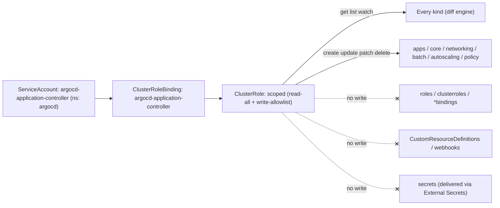
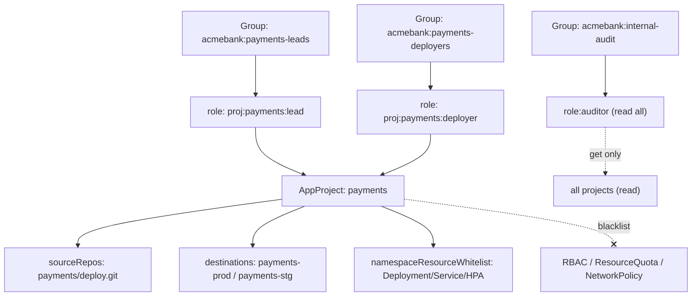
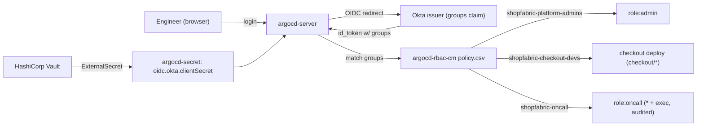
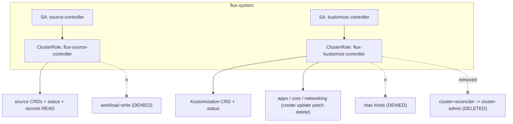
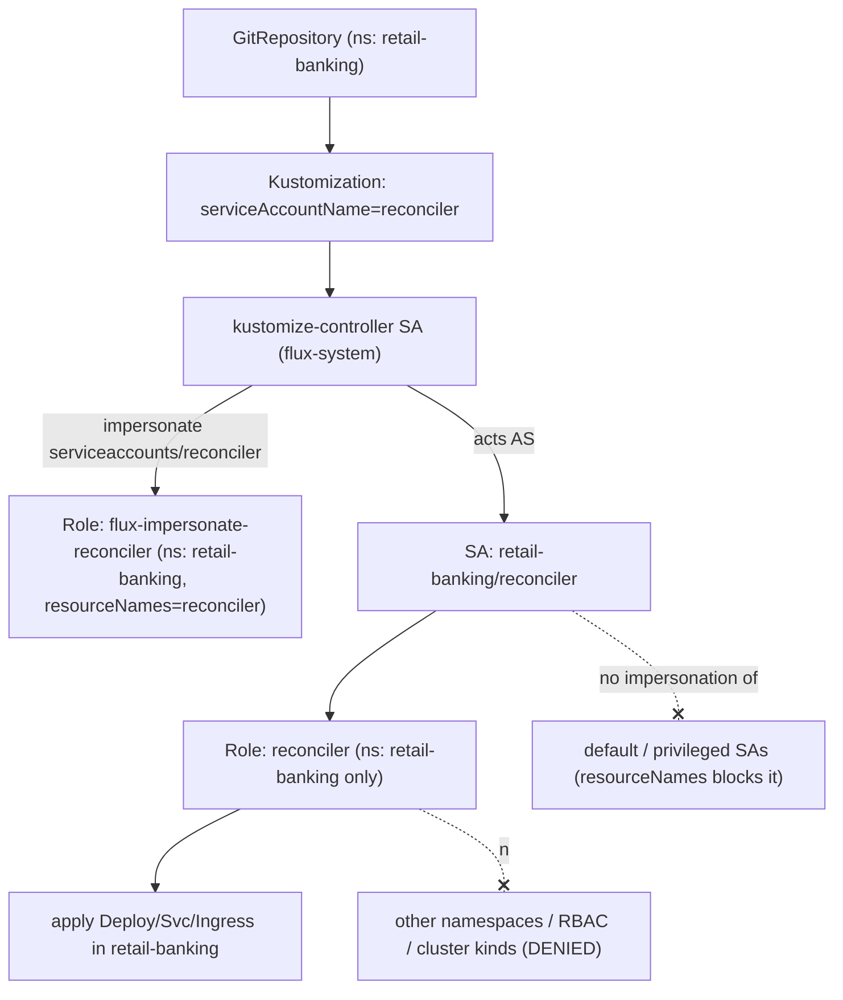

# GitOps — Argo CD & Flux

Five production RBAC scenarios covering how enterprises constrain the two dominant GitOps engines — Argo CD and Flux — so that a controller reconciling Git into a live cluster runs on least privilege, tenants stay isolated, and human access flows from the corporate IdP rather than shared admin tokens, all on Kubernetes v1.33+.

## Scenario 51 — Scoping the Argo CD application-controller Cluster RBAC

**Company / Industry:** SaaS / Multi-Tenant B2B Platform

### Business Requirement
A B2B SaaS provider runs a single Argo CD instance in a shared control-plane cluster that continuously reconciles roughly 400 Applications across 90 tenant namespaces. The `application-controller` is the component that computes live-versus-desired diffs and applies, patches, and prunes managed resources. Security requires that this controller — the single most powerful workload in the platform — be scoped to exactly the resource kinds tenants are permitted to deploy, and be structurally incapable of creating RBAC objects or reading Secrets, so a compromised repo or a malicious manifest cannot escalate to cluster-admin.

### Existing Problem
The platform was installed from the upstream `install.yaml`, which ships the `argocd-application-controller` ClusterRole with `apiGroups: ['*'] / resources: ['*'] / verbs: ['*']` — effectively cluster-admin. During a red-team exercise, an engineer committed an Application whose manifest included a `ClusterRoleBinding` granting `cluster-admin` to a tenant ServiceAccount. Argo CD happily synced it, because the controller had `*` on `clusterrolebindings`. The controller's token, if exfiltrated from the StatefulSet, was also a full cluster takeover. The wildcard role has to be replaced with an explicit read-everywhere / write-allowlist ClusterRole.

### Proposed RBAC Solution
Keep a **ClusterRole** + **ClusterRoleBinding** bound to the `argocd-application-controller` **ServiceAccount** — the controller genuinely reconciles across every tenant namespace, so a cluster-scoped grant is architecturally correct and a bag of per-namespace Roles would be unmanageable at 90 namespaces. The fix is the *content* of the ClusterRole, not its scope: cluster-wide `get/list/watch` on `*` (required for diffing arbitrary kinds), but `create/update/patch/delete/deletecollection` limited to an allowlist of workload/config/networking kinds. RBAC kinds (`roles`, `clusterroles`, `rolebindings`, `clusterrolebindings`), `admissionregistration`, and `apiextensions` get **no write verbs at all**, and `secrets` get no write either — secret material is delivered via External Secrets, so the GitOps controller never handles plaintext credentials. This is complemented by AppProject `clusterResourceWhitelist` (Scenario 52) as defense in depth.

### Kubernetes Resources
- Deployments, StatefulSets, DaemonSets, ReplicaSets (apps)
- Services, ConfigMaps, ServiceAccounts, PersistentVolumeClaims, Pods, Namespaces, Events (core)
- Ingresses, NetworkPolicies (networking.k8s.io)
- Jobs, CronJobs (batch); HorizontalPodAutoscalers (autoscaling); PodDisruptionBudgets (policy)
- Every other kind — read-only (for diff)

### Required Permissions
- `*/*` → `get`, `list`, `watch` — the controller must observe any kind an Application references to compute drift.
- `deployments`, `statefulsets`, `daemonsets`, `replicasets` (apps) → `create`, `update`, `patch`, `delete`, `deletecollection` — apply and **prune** managed workloads.
- `services`, `configmaps`, `serviceaccounts`, `persistentvolumeclaims` (core) → `create`, `update`, `patch`, `delete`, `deletecollection` — reconcile the supporting objects.
- `pods` (core) → `delete`, `deletecollection` — prune orphans and trigger restarts; **no create** (pods are owned by controllers).
- `namespaces` (core) → `create`, `update`, `patch` — app-of-apps bootstrap; **no delete** (deleting a namespace nukes a tenant).
- `ingresses`, `networkpolicies` / `jobs`, `cronjobs` / `horizontalpodautoscalers` / `poddisruptionbudgets` → `create`, `update`, `patch`, `delete`.
- `events` → `create`, `patch`; `pods/log` → `get` — controller telemetry.
- **No** write on RBAC kinds, CRDs, webhooks, or Secrets — the escalation and exfiltration paths are removed.

### Architecture Diagram


### YAML Implementation
```yaml
apiVersion: v1
kind: Namespace
metadata:
  name: argocd
  labels:
    app.kubernetes.io/part-of: argocd
    pod-security.kubernetes.io/enforce: restricted
---
apiVersion: v1
kind: ServiceAccount
metadata:
  name: argocd-application-controller
  namespace: argocd
  labels:
    app.kubernetes.io/name: argocd-application-controller
    app.kubernetes.io/part-of: argocd
automountServiceAccountToken: true
---
apiVersion: rbac.authorization.k8s.io/v1
kind: ClusterRole
metadata:
  name: argocd-application-controller
  labels:
    app.kubernetes.io/part-of: argocd
    rbac.acme.io/hardened: "true"
rules:
  # Cluster-wide READ so the controller can diff any managed kind.
  - apiGroups: ["*"]
    resources: ["*"]
    verbs: ["get", "list", "watch"]
  # Workloads: full reconcile incl. prune (deletecollection).
  - apiGroups: ["apps"]
    resources: ["deployments", "statefulsets", "daemonsets", "replicasets"]
    verbs: ["create", "update", "patch", "delete", "deletecollection"]
  # Core config/network-facing objects.
  - apiGroups: [""]
    resources: ["services", "configmaps", "serviceaccounts", "persistentvolumeclaims"]
    verbs: ["create", "update", "patch", "delete", "deletecollection"]
  # Pods: prune/restart only, never create directly.
  - apiGroups: [""]
    resources: ["pods"]
    verbs: ["delete", "deletecollection"]
  # Namespace bootstrap for app-of-apps; deliberately NO delete.
  - apiGroups: [""]
    resources: ["namespaces"]
    verbs: ["create", "update", "patch"]
  - apiGroups: ["networking.k8s.io"]
    resources: ["ingresses", "networkpolicies"]
    verbs: ["create", "update", "patch", "delete"]
  - apiGroups: ["batch"]
    resources: ["jobs", "cronjobs"]
    verbs: ["create", "update", "patch", "delete", "deletecollection"]
  - apiGroups: ["autoscaling"]
    resources: ["horizontalpodautoscalers"]
    verbs: ["create", "update", "patch", "delete"]
  - apiGroups: ["policy"]
    resources: ["poddisruptionbudgets"]
    verbs: ["create", "update", "patch", "delete"]
  # Telemetry.
  - apiGroups: [""]
    resources: ["events"]
    verbs: ["create", "patch"]
  - apiGroups: [""]
    resources: ["pods/log"]
    verbs: ["get"]
  # NOTE: no rbac.authorization.k8s.io, no apiextensions.k8s.io,
  #       no admissionregistration.k8s.io, no secrets write -> escalation removed.
---
apiVersion: rbac.authorization.k8s.io/v1
kind: ClusterRoleBinding
metadata:
  name: argocd-application-controller
  labels:
    app.kubernetes.io/part-of: argocd
roleRef:
  apiGroup: rbac.authorization.k8s.io
  kind: ClusterRole
  name: argocd-application-controller
subjects:
  - kind: ServiceAccount
    name: argocd-application-controller
    namespace: argocd
```

### Commands
```bash
# 1. Apply the hardened ServiceAccount + ClusterRole + binding (overrides the upstream wildcard role).
kubectl apply -f argocd-application-controller-rbac.yaml

# 2. Confirm the upstream wildcard role is gone / replaced (name is reused, so apply overwrites it).
kubectl get clusterrole argocd-application-controller -o yaml | grep -A3 "verbs:" | head

# 3. Restart the controller so it re-reads its token against the new role (token is unchanged, this just forces a fresh reconcile).
kubectl rollout restart statefulset argocd-application-controller -n argocd

# 4. Watch it reconcile without permission errors.
kubectl logs -n argocd statefulset/argocd-application-controller -f | grep -i forbidden
```

### Verification
```bash
SA=system:serviceaccount:argocd:argocd-application-controller

# ALLOW: it can reconcile workloads it manages.
kubectl auth can-i patch deployments -A --as=$SA
kubectl auth can-i deletecollection replicasets -n tenant-acme --as=$SA
kubectl auth can-i get customresourcedefinitions --as=$SA   # read = yes (diff)

# DENY: the escalation and exfiltration paths.
kubectl auth can-i create clusterrolebindings --as=$SA
kubectl auth can-i create rolebindings -n tenant-acme --as=$SA
kubectl auth can-i update secrets -n tenant-acme --as=$SA
kubectl auth can-i delete namespaces --as=$SA

# Full effective set.
kubectl auth can-i --list --as=$SA | grep -E "clusterrolebindings|secrets|deployments"
```

### Expected Output
```text
$ kubectl auth can-i patch deployments -A --as=system:serviceaccount:argocd:argocd-application-controller
yes
$ kubectl auth can-i get customresourcedefinitions --as=system:serviceaccount:argocd:argocd-application-controller
yes
$ kubectl auth can-i create clusterrolebindings --as=system:serviceaccount:argocd:argocd-application-controller
no
$ kubectl auth can-i update secrets -n tenant-acme --as=system:serviceaccount:argocd:argocd-application-controller
no
$ kubectl auth can-i delete namespaces --as=system:serviceaccount:argocd:argocd-application-controller
no

# When a malicious Application tries to sync a ClusterRoleBinding, the controller's own token is refused:
ComparisonError: failed to sync cluster resource ClusterRoleBinding/tenant-escalate:
clusterrolebindings.rbac.authorization.k8s.io is forbidden: User
"system:serviceaccount:argocd:argocd-application-controller" cannot create resource
"clusterrolebindings" in API group "rbac.authorization.k8s.io" at the cluster scope
```

### Common Mistakes
- Leaving the upstream `*/*/*` ClusterRole in place because "Argo needs to deploy anything" — it needs to *read* anything, not *write* anything.
- Granting `secrets` write to make a raw-Secret manifest sync, instead of adopting External Secrets / Sealed Secrets.
- Adding `delete` on `namespaces` so cascading prune "works", turning one bad `AppProject` into a tenant-wipe.
- Forgetting `deletecollection`, so `prune: true` silently leaves orphaned ReplicaSets and the app never reaches `Synced`.
- Scoping the controller to per-namespace Roles and then discovering cluster-scoped kinds (Namespace, CRD reads) fail.

### Troubleshooting
- Sync fails with `Forbidden` on a specific kind: run `kubectl auth can-i <verb> <kind> --as=system:serviceaccount:argocd:argocd-application-controller` — the allowlist is missing that kind; add it explicitly rather than reverting to `*`.
- Diff shows `Unknown` / `OutOfSync` for a CRD: read verbs on `*` should cover it; if not, the CRD's apiGroup is not served — check `kubectl api-resources`.
- Confirm the binding actually points at the controller SA with `kubectl describe clusterrolebinding argocd-application-controller` and match the `system:serviceaccount:argocd:...` name exactly.
- Enumerate the real effective permissions with `kubectl auth can-i --list --as=system:serviceaccount:argocd:argocd-application-controller` before assuming a role change took effect.

### Best Practice
Mature platform teams treat the controller ClusterRole as a security-reviewed allowlist that grows only via pull request, run Argo CD in `--application-namespaces` (app-in-any-namespace) mode so Applications live beside their tenants, and pair the scoped controller role with AppProject `clusterResourceWhitelist`/`namespaceResourceBlacklist` so escalation is blocked at two independent layers. Secrets are never written by Argo — External Secrets Operator or Sealed Secrets reconcile them — so the GitOps identity can be denied `secrets` write entirely.

### Security Notes
The default install makes the application-controller a cluster-admin equivalent; anyone who can merge to a watched repo (or steal the StatefulSet token) inherits that power. Removing write on RBAC kinds closes the classic `ClusterRoleBinding → cluster-admin` self-escalation; removing `secrets` write shrinks the exfiltration surface; keeping reads broad but writes narrow preserves diffing without granting mutation. The residual risk is allowlist drift — a well-meaning PR adding `clusterroles` write to "let Argo manage RBAC" silently re-opens the escalation path, so RBAC-kind writes on this role must be flagged in CI policy (Kyverno/Conftest).

### Interview Questions
1. Why is the upstream `argocd-application-controller` ClusterRole a security problem, and what specific attack does it enable?
2. The controller needs cluster-wide `get/list/watch` on `*` but only narrow write — why is that split correct rather than paranoid?
3. Why deny `secrets` write to the controller, and how do Applications that contain secrets still work?
4. Why keep it a ClusterRole rather than switching to per-namespace Roles for tighter scope?
5. How does this ClusterRole hardening interact with AppProject restrictions — aren't they redundant?

### Interview Answers
1. It grants `*/*/*`, i.e. cluster-admin. Because Argo CD applies whatever is in Git, anyone who can merge a manifest containing a `ClusterRoleBinding` (or steal the controller token) can bind `cluster-admin` to an identity they control — a full cluster takeover through the GitOps pipeline. Removing write on RBAC kinds structurally prevents it.
2. Diffing requires reading arbitrary kinds (you can't detect drift on a resource you can't `get`), so broad read is functionally necessary and low-risk (read can't mutate). Write is where blast radius lives, so it is restricted to the kinds tenants legitimately deploy. The asymmetry mirrors the threat model: reads are observation, writes are power.
3. A controller that can write Secrets can rewrite any credential in any namespace it manages — huge exfiltration/impersonation surface. By policy the platform forbids raw Secrets in Git and delivers them via External Secrets Operator (which has its own scoped SA) or Sealed Secrets (controller decrypts). Argo then only reconciles the `ExternalSecret`/`SealedSecret` CRD, never the plaintext Secret, so it can be denied `secrets` write.
4. The controller genuinely reconciles across every tenant namespace and also handles cluster-scoped kinds (Namespaces, reading CRDs). Per-namespace Roles would need one Role+binding per namespace (90+), couldn't grant cluster-scoped reads, and would break the moment a namespace is added. A single scoped ClusterRole is both tighter in content and simpler to operate.
5. They are complementary, defense-in-depth layers. The ClusterRole is a coarse, cluster-wide "the controller can never write RBAC or Secrets" guarantee enforced by the API server. AppProjects add per-tenant "this project may only deploy these kinds into these namespaces from these repos", enforced by Argo before it ever calls the API. An attacker must defeat both to escalate.

### Follow-up Questions
- How would you enforce, in CI, that no PR adds RBAC-kind write verbs to this ClusterRole?
- How does app-in-any-namespace change where Applications and their reconcile permissions live?
- If a tenant legitimately needs a new kind (e.g. a `SealedSecret`), what is the review path to extend the allowlist safely?
- How would you detect at runtime that the controller attempted a Forbidden write, and alert on it?

### Production Tips
Red Hat OpenShift GitOps ships Argo CD with a per-instance, namespace-scoped controller and lets platform teams tighten the cluster ClusterRole through the `ArgoCD` operator CR rather than editing raw manifests. VMware Tanzu and IBM Cloud package Argo CD with the diff-read/write-allowlist split baked in, and Intuit (Argo CD's origin) runs the controller with explicit resource allowlists at multi-hundred-cluster scale. The common thread: broad read, curated write, no RBAC/Secret write, and the allowlist governed as code.

## Scenario 52 — Argo CD AppProjects and policy.csv for Tenant Scoping

**Company / Industry:** Banking / FinTech

### Business Requirement
A fintech runs one Argo CD instance shared by the `payments` and `lending` product teams under PCI-DSS. Each team must only be able to act on its own Applications, deploy only from its own Git repository, only into its own namespaces, and must be structurally prevented from creating RBAC, ResourceQuota, or NetworkPolicy objects (those are owned by the platform team). Auditors need a read-only view across everything, and there must be no implicit access — every permission is explicit and traceable to a corporate group.

### Existing Problem
The instance ran with the built-in `admin` account shared across both teams and `policy.default: role:readonly`, so every authenticated user could read every Application in every team, and a payments engineer with the shared admin token once synced a lending Application during an incident, applying an untested manifest to the wrong product. There was no repo restriction, so any team could point an Application at any Git URL, and nothing stopped a manifest from carrying a `NetworkPolicy` that punched holes in the platform's segmentation.

### Proposed RBAC Solution
Use one **AppProject per tenant** as the isolation boundary and the global **`argocd-rbac-cm` `policy.csv`** for authorization. AppProjects are the right primitive because they bind three things atomically — allowed `sourceRepos`, allowed `destinations` (cluster+namespace), and allowed resource kinds (`clusterResourceWhitelist` / `namespaceResourceBlacklist` / `namespaceResourceWhitelist`). `policy.csv` maps corporate **Groups** (via SSO, Scenario 53) to **project-scoped roles** using object patterns like `payments/*`. `policy.default` is set to empty (deny-by-default). A small **Kubernetes Role** additionally restricts who can even edit `argocd-rbac-cm`/`argocd-cm` to the platform SRE group, so tenants cannot rewrite their own permissions.

### Kubernetes Resources
- AppProject (argoproj.io) — the tenancy boundary
- ConfigMap `argocd-rbac-cm`, `argocd-cm` (core) — policy and settings
- Applications (argoproj.io) — the objects being authorized
- Role / RoleBinding (rbac.authorization.k8s.io) — protecting the policy ConfigMaps

### Required Permissions
Argo CD-level (policy.csv, resource `applications`/`projects`/`logs`/`exec`):
- `proj:payments:deployer` → `applications` `get`, `sync` on `payments/*` — deploy but not delete.
- `proj:payments:lead` → `applications` `*` (incl. `delete`, `override`) on `payments/*`.
- `role:auditor` → `applications`/`projects`/`logs` `get` on `*` — global read-only.
- `role:platform-admin` → `*` on `*/*` — the SRE break-glass role.

Kubernetes-level (protecting the config):
- `configmaps` (core, `resourceNames: [argocd-rbac-cm, argocd-cm]`) → `get`, `list`, `watch`, `update`, `patch` for the platform group only. Tenants get none.

### Architecture Diagram


### YAML Implementation
```yaml
apiVersion: argoproj.io/v1alpha1
kind: AppProject
metadata:
  name: payments
  namespace: argocd
  finalizers:
    - resources-finalizer.argocd.argoproj.io
  labels:
    tenant: payments
    compliance: pci-dss
spec:
  description: "Payments product — PCI-DSS scoped GitOps project"
  sourceRepos:
    - "https://git.acmebank.internal/payments/deploy.git"
  destinations:
    - namespace: "payments-prod"
      server: "https://kubernetes.default.svc"
    - namespace: "payments-stg"
      server: "https://kubernetes.default.svc"
  # Only Namespaces may be created cluster-wide (for bootstrap); nothing else.
  clusterResourceWhitelist:
    - group: ""
      kind: Namespace
  # Kinds the tenant is explicitly allowed to manage inside its namespaces.
  namespaceResourceWhitelist:
    - group: "apps"
      kind: Deployment
    - group: "apps"
      kind: StatefulSet
    - group: ""
      kind: Service
    - group: ""
      kind: ConfigMap
    - group: "autoscaling"
      kind: HorizontalPodAutoscaler
  # Platform-owned kinds a tenant may never touch, even if whitelisted above.
  namespaceResourceBlacklist:
    - group: "rbac.authorization.k8s.io"
      kind: "*"
    - group: ""
      kind: ResourceQuota
    - group: ""
      kind: LimitRange
    - group: "networking.k8s.io"
      kind: NetworkPolicy
  orphanedResources:
    warn: true
  roles:
    - name: deployer
      description: "Sync + read payments apps; no delete"
      policies:
        - p, proj:payments:deployer, applications, get, payments/*, allow
        - p, proj:payments:deployer, applications, sync, payments/*, allow
      groups:
        - acmebank:payments-deployers
    - name: lead
      description: "Full app lifecycle within the payments project"
      policies:
        - p, proj:payments:lead, applications, *, payments/*, allow
      groups:
        - acmebank:payments-leads
---
apiVersion: argoproj.io/v1alpha1
kind: AppProject
metadata:
  name: lending
  namespace: argocd
  finalizers:
    - resources-finalizer.argocd.argoproj.io
  labels:
    tenant: lending
    compliance: pci-dss
spec:
  description: "Lending product — scoped GitOps project"
  sourceRepos:
    - "https://git.acmebank.internal/lending/deploy.git"
  destinations:
    - namespace: "lending-prod"
      server: "https://kubernetes.default.svc"
    - namespace: "lending-stg"
      server: "https://kubernetes.default.svc"
  clusterResourceWhitelist:
    - group: ""
      kind: Namespace
  namespaceResourceWhitelist:
    - group: "apps"
      kind: Deployment
    - group: ""
      kind: Service
    - group: ""
      kind: ConfigMap
  namespaceResourceBlacklist:
    - group: "rbac.authorization.k8s.io"
      kind: "*"
    - group: "networking.k8s.io"
      kind: NetworkPolicy
  roles:
    - name: lead
      policies:
        - p, proj:lending:lead, applications, *, lending/*, allow
      groups:
        - acmebank:lending-leads
---
apiVersion: v1
kind: ConfigMap
metadata:
  name: argocd-rbac-cm
  namespace: argocd
  labels:
    app.kubernetes.io/part-of: argocd
data:
  policy.default: ""            # deny-by-default: no implicit access at all
  scopes: '[groups]'
  policy.csv: |
    # Platform SRE: global admin + break-glass exec (audited)
    p, role:platform-admin, applications, *, */*, allow
    p, role:platform-admin, projects, *, *, allow
    p, role:platform-admin, clusters, *, *, allow
    p, role:platform-admin, repositories, *, *, allow
    p, role:platform-admin, exec, create, */*, allow
    g, acmebank:platform-sre, role:platform-admin

    # Auditors: read-only across every project, no sync/delete/exec
    p, role:auditor, applications, get, */*, allow
    p, role:auditor, projects, get, *, allow
    p, role:auditor, logs, get, */*, allow
    g, acmebank:internal-audit, role:auditor
---
# Only the platform SRE group may edit the policy ConfigMaps (K8s-level lock).
apiVersion: rbac.authorization.k8s.io/v1
kind: Role
metadata:
  name: argocd-config-editor
  namespace: argocd
rules:
  - apiGroups: [""]
    resources: ["configmaps"]
    resourceNames: ["argocd-rbac-cm", "argocd-cm"]
    verbs: ["get", "list", "watch", "update", "patch"]
---
apiVersion: rbac.authorization.k8s.io/v1
kind: RoleBinding
metadata:
  name: argocd-config-editor
  namespace: argocd
subjects:
  - kind: Group
    name: acmebank:platform-sre
    apiGroup: rbac.authorization.k8s.io
roleRef:
  kind: Role
  name: argocd-config-editor
  apiGroup: rbac.authorization.k8s.io
```

### Commands
```bash
# 1. Apply the projects, RBAC ConfigMap, and the config-editor lock.
kubectl apply -f argocd-projects-and-rbac.yaml

# 2. Argo CD hot-reloads argocd-rbac-cm; force a re-read if needed.
kubectl rollout restart deploy/argocd-server -n argocd

# 3. Create an app pinned to a project (only the payments repo/namespaces are allowed).
argocd app create payments-api \
  --project payments \
  --repo https://git.acmebank.internal/payments/deploy.git \
  --path apps/api --dest-namespace payments-prod \
  --dest-server https://kubernetes.default.svc

# 4. Inspect the effective project restrictions.
argocd proj get payments
```

### Verification
```bash
# Argo CD-level checks (as an SSO user carrying group claims).
argocd login argocd.acmebank.internal --sso

# ALLOW: a payments deployer can sync payments apps.
argocd account can-i sync applications payments/payments-api      # yes
# DENY: cannot sync a lending app.
argocd account can-i sync applications lending/lending-ledger      # no
# DENY: deployer cannot delete.
argocd account can-i delete applications payments/payments-api     # no

# Project-level guardrail: creating a forbidden repo/namespace/kind is rejected.
argocd app create rogue --project payments \
  --repo https://github.com/attacker/x.git --path . \
  --dest-namespace kube-system --dest-server https://kubernetes.default.svc

# K8s-level: a tenant cannot edit the policy ConfigMap.
kubectl auth can-i update configmap/argocd-rbac-cm -n argocd \
  --as=alice --as-group=acmebank:payments-leads
```

### Expected Output
```text
$ argocd account can-i sync applications payments/payments-api
yes
$ argocd account can-i sync applications lending/lending-ledger
no
$ argocd account can-i delete applications payments/payments-api
no

$ argocd app create rogue --project payments --repo https://github.com/attacker/x.git ...
FATA[0000] rpc error: code = InvalidArgument desc = application repo
https://github.com/attacker/x.git is not permitted in project 'payments'

$ kubectl auth can-i update configmap/argocd-rbac-cm -n argocd --as=alice --as-group=acmebank:payments-leads
no
```

### Common Mistakes
- Leaving `policy.default: role:readonly`, which silently lets every authenticated user read every tenant's Applications.
- Forgetting `scopes: '[groups]'`, so `g, <group>, role:...` lines never match and everyone falls through to the default.
- Writing object patterns as `*/payments-*` instead of `payments/*` — the object is `<project>/<app>`, not namespace-based.
- Whitelisting a kind in `namespaceResourceWhitelist` but forgetting the blacklist, so a manifest can still ship RBAC because it was implicitly allowed.
- Not locking `argocd-rbac-cm` at the K8s layer, so a tenant with `kubectl` edit rights on the argocd namespace rewrites their own policy.

### Troubleshooting
- User gets "permission denied" unexpectedly: dump their claims with `argocd account get-user-info` and confirm the group string matches the `g,` line exactly (case and prefix included).
- Sync allowed but apply blocked: it's the AppProject resource whitelist/blacklist, not policy.csv — check `argocd app manifests` against the project's allowed kinds.
- Policy edits not taking effect: `argocd-rbac-cm` is read live, but a malformed CSV row disables the whole file — check `argocd-server` logs for `policy.csv parse error`.
- Confirm which role a subject resolves to with `argocd account can-i <action> <resource> <object>` before debugging deeper.

### Best Practice
Regulated fintechs template one AppProject per product team from a golden module, keep `policy.default` empty, and generate the `g,` group mappings straight from the IdP so there are no hand-maintained user lists. The policy.csv and AppProjects are themselves GitOps-managed (Argo manages Argo), so every permission change is a reviewed, audited pull request, and the platform team owns a K8s RBAC lock on the config ConfigMaps so tenants physically cannot self-escalate.

### Security Notes
The AppProject enforces the three-axis boundary (repo, destination, kind) *before* the controller ever calls the API, so even a tenant lead cannot deploy an unapproved repo or a `NetworkPolicy` that breaks segmentation. Deny-by-default means a misconfigured or removed group grant fails closed. The `exec` action is granted only to break-glass SRE and is fully audited, because `exec` into a running pod bypasses image provenance. The main residual risk is a shared local `admin` account (which ignores policy.csv) — it must be disabled (Scenario 53) so all access is attributable.

### Interview Questions
1. What are the three independent axes an AppProject constrains, and why is enforcing them in the project better than only in Kubernetes RBAC?
2. Explain the `p,` and `g,` line formats in policy.csv and what the object pattern `payments/*` matches.
3. Why set `policy.default` to empty, and what breaks if `scopes` omits `groups`?
4. How do you prevent a tenant from editing their own Argo CD RBAC, and why is that a Kubernetes-RBAC concern rather than an Argo one?
5. What is the difference between `namespaceResourceWhitelist` and `namespaceResourceBlacklist`, and which wins?

### Interview Answers
1. Allowed `sourceRepos` (where manifests may come from), `destinations` (which cluster+namespace they may land in), and resource kinds (`clusterResourceWhitelist`/`namespaceResourceBlacklist`/`whitelist`). The project enforces these in Argo before any API call, catching a bad repo or destination that Kubernetes RBAC alone wouldn't see — RBAC only knows about the controller's SA, not which tenant authored the Application.
2. `p, <subject>, <resource>, <action>, <object>, <effect>` grants an action; `g, <subject>, <role>` maps a group/user to a role. For `applications`, the object is `<AppProject>/<application-name>`, so `payments/*` matches every Application in the payments project — it is project-scoped, not namespace-scoped.
3. Empty `policy.default` means deny-by-default: no group mapping, no access. If `scopes` omits `groups`, Argo never reads the group claim from the token, so every `g, <group>, role` line is dead and users collapse to the (empty) default — everyone is locked out, which is the classic "SSO works but nobody has permissions" incident.
4. Bind a Kubernetes Role that allows `update/patch` on `configmaps` with `resourceNames: [argocd-rbac-cm, argocd-cm]` only to the platform group. It is a K8s concern because policy.csv lives in a ConfigMap — anyone with `kubectl edit configmap` rights in the argocd namespace could rewrite the authorization rules regardless of what Argo thinks. You close that door at the API-server layer.
5. Whitelist is an allow-list of kinds a project may manage; blacklist is an explicit deny that overrides. Blacklist wins — even if a kind is (or would be) allowed, a blacklist entry blocks it, which is why RBAC/NetworkPolicy sit in the blacklist as a hard stop.

### Follow-up Questions
- How would you support a shared "platform" project whose apps deploy CRDs while still blocking tenants from doing the same?
- How do you roll out a policy.csv change safely without risking a parse error that locks everyone out?
- How would app-in-any-namespace change the object pattern from `<project>/<app>` to `<project>/<namespace>/<app>`?
- How do you reconcile Argo-managing-Argo so a bad RBAC PR can't lock the platform team out of Argo itself?

### Production Tips
Razorpay, PhonePe, and Paytm run one Argo CD with per-team AppProjects mapped to their SSO groups and deny-by-default policy.csv, generating the project manifests from an internal template so tenant onboarding is a single PR. Red Hat OpenShift GitOps exposes AppProjects and RBAC through the operator and integrates policy.csv with RH SSO (Keycloak) groups, while IBM Cloud documents the exact `sourceRepos`/`destinations`/blacklist pattern as its multi-tenant reference for regulated workloads.

## Scenario 53 — Argo CD SSO Group-to-RBAC Role Mapping

**Company / Industry:** E-Commerce / Online Retail

### Business Requirement
A large online retailer must eliminate the shared local `admin` account in Argo CD and route all human access through corporate SSO (Okta OIDC). Access decisions must be driven entirely by IdP group membership — when someone joins the checkout squad in the IdP, they gain checkout deploy rights automatically; when they leave, access is revoked centrally. On-call engineers get elevated, audited access during incidents, and no engineer ever holds a standing Argo CD password.

### Existing Problem
Everyone shared one `admin` bcrypt password stored in a wiki. When a contractor offboarded, the password was not rotated for weeks, and the account (which bypasses policy.csv entirely) had full control of every Application. There was no way to attribute an accidental production sync to a person, and audit had no join between Argo actions and the HR/IdP identity. The retailer needs OIDC with group claims wired straight into Argo's RBAC, and the local admin disabled.

### Proposed RBAC Solution
Configure **OIDC** directly against Okta in `argocd-cm` (no Dex needed for a single upstream IdP), request the `groups` claim, and set `admin.enabled: "false"` so the built-in account cannot be used. In `argocd-rbac-cm`, map Okta **Groups** to Argo roles with `g, <group>, role:<role>` lines and set `scopes: '[groups, email]'` so both the group and email claims are evaluated. Built-in `role:admin` is reserved for the platform group; squads get project-scoped roles; on-call gets a wide role including `exec`, granted only through an IdP group whose membership is time-boxed by the IdP's privileged-access workflow. The OIDC client secret is delivered into `argocd-secret` by **External Secrets Operator** from Vault, referenced in `argocd-cm` via the `$oidc.okta.clientSecret` variable — never hard-coded.

### Kubernetes Resources
- ConfigMap `argocd-cm` (OIDC config), `argocd-rbac-cm` (group mappings)
- Secret `argocd-secret` (holds the OIDC client secret, populated by ESO)
- ExternalSecret (external-secrets.io) — reconciles the client secret from Vault
- Argo CD Applications / AppProjects — the objects being authorized

### Required Permissions
Argo CD-level via policy.csv group mappings:
- `shopfabric-platform-admins` → built-in `role:admin` (full).
- `shopfabric-checkout-devs` → `applications` `get`, `sync` on `checkout/*` — deploy their own product only.
- `shopfabric-oncall` → `applications` `*` on `*/*` plus `exec` `create` on `*/*` — incident powers, audited.

External Secrets Operator SA (cluster prerequisite):
- `secrets` (core, namespace `argocd`) → `get`, `list`, `create`, `update`, `patch` to reconcile `argocd-secret`.

### Architecture Diagram


### YAML Implementation
```yaml
apiVersion: v1
kind: ConfigMap
metadata:
  name: argocd-cm
  namespace: argocd
  labels:
    app.kubernetes.io/part-of: argocd
data:
  url: "https://argocd.shopfabric.io"
  # Kill the shared local admin — SSO only.
  admin.enabled: "false"
  oidc.config: |
    name: Okta
    issuer: https://shopfabric.okta.com
    clientID: 0oa8h2j3kLMNOpqr5d7
    clientSecret: $oidc.okta.clientSecret
    requestedScopes:
      - openid
      - profile
      - email
      - groups
    requestedIDTokenClaims:
      groups:
        essential: true
---
apiVersion: v1
kind: ConfigMap
metadata:
  name: argocd-rbac-cm
  namespace: argocd
  labels:
    app.kubernetes.io/part-of: argocd
data:
  policy.default: ""
  scopes: '[groups, email]'
  policy.csv: |
    # Platform team -> built-in admin
    g, shopfabric-platform-admins, role:admin

    # Checkout squad -> deploy only their own product
    p, role:checkout-dev, applications, get, checkout/*, allow
    p, role:checkout-dev, applications, sync, checkout/*, allow
    g, shopfabric-checkout-devs, role:checkout-dev

    # On-call -> full + exec, granted via time-boxed IdP group, fully audited
    p, role:oncall, applications, *, */*, allow
    p, role:oncall, exec, create, */*, allow
    p, role:oncall, logs, get, */*, allow
    g, shopfabric-oncall, role:oncall
---
apiVersion: external-secrets.io/v1
kind: ExternalSecret
metadata:
  name: argocd-oidc-okta
  namespace: argocd
  labels:
    app.kubernetes.io/part-of: argocd
spec:
  refreshInterval: 1h
  secretStoreRef:
    name: vault-backend
    kind: ClusterSecretStore
  target:
    name: argocd-secret          # Argo's existing secret; merge, do not overwrite
    creationPolicy: Merge
    template:
      metadata:
        labels:
          app.kubernetes.io/part-of: argocd
  data:
    - secretKey: oidc.okta.clientSecret
      remoteRef:
        key: secret/data/shopfabric/argocd
        property: okta_client_secret
```

### Commands
```bash
# 1. Apply OIDC config, group mappings, and the ExternalSecret.
kubectl apply -f argocd-sso.yaml

# 2. Confirm ESO populated the client secret into argocd-secret.
kubectl get secret argocd-secret -n argocd -o jsonpath='{.data.oidc\.okta\.clientSecret}' | base64 -d | wc -c

# 3. Restart argocd-server to load the OIDC provider + reload RBAC.
kubectl rollout restart deploy/argocd-server -n argocd

# 4. Verify the OIDC provider is discovered.
kubectl logs deploy/argocd-server -n argocd | grep -i "OIDC configuration"
```

### Verification
```bash
# Log in via SSO and confirm the resolved identity/groups.
argocd login argocd.shopfabric.io --sso
argocd account get-user-info    # shows loggedIn, username (email), and groups

# ALLOW: a checkout dev can sync a checkout app.
argocd account can-i sync applications checkout/checkout-web        # yes
# DENY: cannot touch the search product.
argocd account can-i sync applications search/search-index          # no
# DENY: cannot exec (only on-call may).
argocd account can-i create exec */*                                 # no

# The local admin is dead.
argocd login argocd.shopfabric.io --username admin --password whatever
```

### Expected Output
```text
$ argocd account get-user-info
Logged In: true
Username: priya.nair@shopfabric.io
Issuer: https://shopfabric.okta.com
Groups: shopfabric-checkout-devs

$ argocd account can-i sync applications checkout/checkout-web
yes
$ argocd account can-i sync applications search/search-index
no
$ argocd account can-i create exec */*
no

$ argocd login argocd.shopfabric.io --username admin --password whatever
FATA[0000] rpc error: code = Unauthenticated desc = Invalid username or password
# admin.enabled=false -> the built-in account is disabled entirely
```

### Common Mistakes
- Requesting the `groups` scope in `oidc.config` but forgetting `scopes: '[groups]'` in `argocd-rbac-cm` — group claims arrive but are never evaluated.
- Okta returning group *names* while policy.csv uses group *IDs* (or vice versa) — the `g,` lines silently never match. Confirm with `get-user-info`.
- Leaving `admin.enabled` at its default `true`, so the shared bypass account still exists behind SSO.
- Hard-coding `clientSecret` in `argocd-cm` (it is a ConfigMap — world-readable to anyone with get on it) instead of the `$secret:key` variable.
- Group claim exceeds token size limits (many groups) and Okta truncates it — scope the group claim filter to `shopfabric-*` in the Okta app.

### Troubleshooting
- Login succeeds but user has no permissions: run `argocd account get-user-info`; if `Groups` is empty, the IdP isn't sending the claim (fix the Okta groups-claim filter / `requestedScopes`).
- `invalid_client` at the IdP: the client secret in `argocd-secret` is stale or wrong — check the ExternalSecret sync status and the Vault path.
- Groups present but still denied: the group string in policy.csv doesn't match the claim exactly — copy the value from `get-user-info` verbatim.
- Provider not loaded: `kubectl logs deploy/argocd-server -n argocd | grep -i oidc` — a `rootCA` may be required for a private issuer.

### Best Practice
Retail platform teams drive Argo access entirely from IdP groups so onboarding/offboarding is a single IdP change with zero Argo edits, disable the local admin, and grant `exec`/wide roles only through time-boxed privileged-access groups (Okta PAM / Entra PIM) that expire automatically. The client secret is reconciled from a secrets manager by External Secrets, and every OIDC login and Argo action is shipped to the SIEM keyed on the corporate email for a clean audit join.

### Security Notes
Removing the shared admin eliminates the single most dangerous credential and makes every action attributable to a real person. Group-driven RBAC means access follows the IdP's lifecycle (join/leave/PAM expiry), closing the offboarding gap. Elevated powers — `exec` (bypasses image provenance, gives a shell in a running pod) and wide `*` — are quarantined to an on-call group whose membership is temporary and audited. The client secret never lives in a ConfigMap or Git; it is pulled from Vault at runtime, so a leaked manifest reveals nothing. The residual risk is IdP group sprawl, mitigated by naming conventions and periodic access reviews.

### Interview Questions
1. Why must `scopes` in `argocd-rbac-cm` include `groups`, and what exactly breaks if it's missing while OIDC still requests the groups scope?
2. Why disable the local `admin` account, and how does it differ from an SSO user mapped to `role:admin`?
3. How do you deliver the OIDC client secret without hard-coding it, and why is a ConfigMap the wrong place for it?
4. How would you give on-call elevated, `exec`-capable access without anyone holding standing elevated rights?
5. A user logs in via SSO but has zero permissions — walk through your diagnosis.

### Interview Answers
1. `oidc.config.requestedScopes` controls what the IdP puts in the token; `argocd-rbac-cm scopes` controls which claims Argo's RBAC engine reads when matching `g,` lines. If `scopes` omits `groups`, the token carries the groups but Argo never looks at them, so every group mapping is dead and users fall to the empty default — locked out despite a "working" SSO login.
2. The local admin bypasses policy.csv entirely and is a shared, static credential — un-attributable and a rotation liability. An SSO user mapped to `role:admin` has the same power but is a named person whose access is governed by IdP lifecycle and whose every action is attributable. Disabling admin forces all access through that accountable path.
3. Reference it in `argocd-cm` as `$oidc.okta.clientSecret`, which resolves to the `oidc.okta.clientSecret` key in `argocd-secret`, and populate that key with External Secrets Operator from Vault. A ConfigMap is plaintext and readable by anyone with `get configmap`, so a client secret there is effectively public within the cluster; a Secret (plus RBAC on it) is the correct store.
4. Map a dedicated `role:oncall` (wide + `exec`) to an IdP group whose membership is granted only through the IdP's privileged-access workflow (Okta PAM / Entra PIM) with an automatic expiry. Engineers request elevation for the incident window; the IdP removes them afterward; Argo picks up the change on their next token refresh. No one carries the power at rest, and every elevation is logged.
5. Run `argocd account get-user-info`. If `Groups` is empty, the IdP isn't emitting the claim — fix `requestedScopes`/`requestedIDTokenClaims` and the Okta groups-claim filter. If groups are present but access is denied, compare the exact group string to the `g,` lines (IDs vs names, case, prefix). Confirm `scopes: '[groups]'` is set. Then check `argocd-server` logs for policy.csv parse errors that would disable the whole file.

### Follow-up Questions
- When would you introduce Dex in front of Okta rather than configuring OIDC directly, and what does Dex buy you?
- How do you handle Okta returning many groups that overflow the ID token / cookie size?
- How would you enforce that only `role:admin` (not squads) can create new AppProjects?
- How do you audit and alert when someone uses the on-call `exec` capability in production?

### Production Tips
Flipkart, Swiggy, and Zomato drive Argo CD access from Okta/Entra ID groups with the local admin disabled, and gate elevated on-call roles behind time-boxed privileged-access groups. Microsoft documents mapping Entra ID (Azure AD) groups to Argo/GitOps roles for AKS, and Red Hat OpenShift GitOps integrates the same pattern with RH SSO (Keycloak) group claims. The universal mechanism is: OIDC groups claim in, `g, <group>, role` mapping, no local admin, client secret from a manager.

## Scenario 54 — Flux source-controller and kustomize-controller ServiceAccounts

**Company / Industry:** Telecom / Network Infrastructure

### Business Requirement
A telecom operator manages its 5G core platform manifests with Flux on a hardened cluster. The security team requires that each Flux controller run under its own least-privilege ServiceAccount, and specifically that the `kustomize-controller` — the component that applies manifests to the API server — is **not** bound to `cluster-admin` as the default bootstrap leaves it. The `source-controller`, which only fetches Git/OCI/Helm artifacts, must have no ability to mutate workloads at all.

### Existing Problem
Flux was bootstrapped with `flux bootstrap`, which creates the `cluster-reconciler-flux-system` ClusterRoleBinding binding **both** `kustomize-controller` and `helm-controller` ServiceAccounts to the built-in `cluster-admin` ClusterRole. A CIS benchmark scan flagged two workload SAs with cluster-admin. Worse, because `source-controller` shared the broad `crd-controller` grants, an audit couldn't prove that the artifact-fetching component (which parses untrusted Git content) couldn't also write to the API. The controllers must be split into distinct, narrowly scoped identities, and the blanket cluster-admin binding removed.

### Proposed RBAC Solution
Give each controller its **own ServiceAccount** (Flux already does) and its own scoped **ClusterRole** + **ClusterRoleBinding** — ServiceAccounts because these are non-human workload identities, and cluster-scoped because Flux CRDs and reconciliation span namespaces. `source-controller` gets a ClusterRole limited to *managing source CRDs and their status/finalizers* and *reading* Secrets/ConfigMaps (for Git/Helm auth) — no workload write whatsoever. `kustomize-controller` gets a ClusterRole to manage `Kustomization` CRDs plus a curated allowlist of the platform's own workload/config/network kinds — but explicitly **no** write on RBAC kinds and **no** `cluster-admin`. The `cluster-reconciler-flux-system` cluster-admin binding is deleted and prevented from being recreated via a bootstrap kustomize patch. A small namespaced **Role** in `flux-system` grants leader-election `leases`.

### Kubernetes Resources
- ServiceAccounts `source-controller`, `kustomize-controller` (flux-system)
- Source CRDs: GitRepository, OCIRepository, HelmRepository, HelmChart, Bucket (source.toolkit.fluxcd.io)
- Kustomization CRD (kustomize.toolkit.fluxcd.io)
- Leases (coordination.k8s.io) — leader election
- Deployments/StatefulSets/DaemonSets, Services/ConfigMaps/PVCs, Ingresses/NetworkPolicies — the applied platform manifests
- Secrets, ConfigMaps, Events (core) — auth material and telemetry

### Required Permissions
- `source-controller` → source CRDs (`gitrepositories`, `ocirepositories`, `helmrepositories`, `helmcharts`, `buckets`) `get,list,watch,create,update,patch`; their `/status` `get,update,patch`; `/finalizers` `update,patch`; `secrets`,`configmaps`,`serviceaccounts` `get,list,watch`; `events` `create,patch`. **No workload write.**
- `kustomize-controller` → `kustomizations` + `/status`,`/finalizers` reconcile; source CRDs `get,list,watch` (to read what to apply); `events` `create,patch`; and the platform workload allowlist (`deployments`/`services`/`configmaps`/`ingresses`/`networkpolicies` etc.) `get,list,watch,create,update,patch,delete`. **No RBAC-kind write, no cluster-admin.**
- Both → `leases` (coordination.k8s.io, in flux-system) `get,list,watch,create,update,patch,delete` for leader election.

### Architecture Diagram


### YAML Implementation
```yaml
apiVersion: v1
kind: Namespace
metadata:
  name: flux-system
  labels:
    app.kubernetes.io/part-of: flux
    pod-security.kubernetes.io/enforce: restricted
---
apiVersion: v1
kind: ServiceAccount
metadata:
  name: source-controller
  namespace: flux-system
  labels: { app.kubernetes.io/part-of: flux }
---
apiVersion: v1
kind: ServiceAccount
metadata:
  name: kustomize-controller
  namespace: flux-system
  labels: { app.kubernetes.io/part-of: flux }
---
apiVersion: rbac.authorization.k8s.io/v1
kind: ClusterRole
metadata:
  name: flux-source-controller
  labels: { app.kubernetes.io/part-of: flux }
rules:
  - apiGroups: ["source.toolkit.fluxcd.io"]
    resources: ["gitrepositories", "ocirepositories", "helmrepositories", "helmcharts", "buckets"]
    verbs: ["get", "list", "watch", "create", "update", "patch"]
  - apiGroups: ["source.toolkit.fluxcd.io"]
    resources: ["gitrepositories/status", "ocirepositories/status", "helmrepositories/status", "helmcharts/status", "buckets/status"]
    verbs: ["get", "update", "patch"]
  - apiGroups: ["source.toolkit.fluxcd.io"]
    resources: ["gitrepositories/finalizers", "ocirepositories/finalizers", "helmrepositories/finalizers", "helmcharts/finalizers", "buckets/finalizers"]
    verbs: ["update", "patch"]
  # Read-only access to auth material for Git/Helm/OCI/Bucket sources.
  - apiGroups: [""]
    resources: ["secrets", "configmaps", "serviceaccounts"]
    verbs: ["get", "list", "watch"]
  - apiGroups: [""]
    resources: ["events"]
    verbs: ["create", "patch"]
---
apiVersion: rbac.authorization.k8s.io/v1
kind: ClusterRoleBinding
metadata:
  name: flux-source-controller
  labels: { app.kubernetes.io/part-of: flux }
roleRef:
  apiGroup: rbac.authorization.k8s.io
  kind: ClusterRole
  name: flux-source-controller
subjects:
  - kind: ServiceAccount
    name: source-controller
    namespace: flux-system
---
apiVersion: rbac.authorization.k8s.io/v1
kind: ClusterRole
metadata:
  name: flux-kustomize-controller
  labels: { app.kubernetes.io/part-of: flux }
rules:
  - apiGroups: ["kustomize.toolkit.fluxcd.io"]
    resources: ["kustomizations"]
    verbs: ["get", "list", "watch", "create", "update", "patch"]
  - apiGroups: ["kustomize.toolkit.fluxcd.io"]
    resources: ["kustomizations/status", "kustomizations/finalizers"]
    verbs: ["get", "update", "patch"]
  # Read the sources it applies from.
  - apiGroups: ["source.toolkit.fluxcd.io"]
    resources: ["gitrepositories", "ocirepositories", "buckets"]
    verbs: ["get", "list", "watch"]
  - apiGroups: [""]
    resources: ["events"]
    verbs: ["create", "patch"]
  # Curated allowlist of platform kinds this controller may APPLY. No RBAC kinds.
  - apiGroups: ["apps"]
    resources: ["deployments", "statefulsets", "daemonsets"]
    verbs: ["get", "list", "watch", "create", "update", "patch", "delete"]
  - apiGroups: [""]
    resources: ["services", "configmaps", "persistentvolumeclaims", "serviceaccounts"]
    verbs: ["get", "list", "watch", "create", "update", "patch", "delete"]
  - apiGroups: ["networking.k8s.io"]
    resources: ["ingresses", "networkpolicies"]
    verbs: ["get", "list", "watch", "create", "update", "patch", "delete"]
  - apiGroups: ["autoscaling"]
    resources: ["horizontalpodautoscalers"]
    verbs: ["get", "list", "watch", "create", "update", "patch", "delete"]
---
apiVersion: rbac.authorization.k8s.io/v1
kind: ClusterRoleBinding
metadata:
  name: flux-kustomize-controller
  labels: { app.kubernetes.io/part-of: flux }
roleRef:
  apiGroup: rbac.authorization.k8s.io
  kind: ClusterRole
  name: flux-kustomize-controller
subjects:
  - kind: ServiceAccount
    name: kustomize-controller
    namespace: flux-system
---
# Leader election, namespaced to flux-system, for both controllers.
apiVersion: rbac.authorization.k8s.io/v1
kind: Role
metadata:
  name: flux-leader-election
  namespace: flux-system
  labels: { app.kubernetes.io/part-of: flux }
rules:
  - apiGroups: ["coordination.k8s.io"]
    resources: ["leases"]
    verbs: ["get", "list", "watch", "create", "update", "patch", "delete"]
---
apiVersion: rbac.authorization.k8s.io/v1
kind: RoleBinding
metadata:
  name: flux-leader-election
  namespace: flux-system
  labels: { app.kubernetes.io/part-of: flux }
subjects:
  - kind: ServiceAccount
    name: source-controller
    namespace: flux-system
  - kind: ServiceAccount
    name: kustomize-controller
    namespace: flux-system
roleRef:
  kind: Role
  name: flux-leader-election
  apiGroup: rbac.authorization.k8s.io
```

### Commands
```bash
# 1. Apply the scoped controller RBAC (replaces the shared broad grants by name where applicable).
kubectl apply -f flux-controller-rbac.yaml

# 2. Remove the default cluster-admin binding that bootstrap created.
kubectl delete clusterrolebinding cluster-reconciler-flux-system

# 3. Prevent it from being recreated: patch it out in the flux-system Kustomization (GitOps-managed Flux).
#    In clusters/telco-5g-core/flux-system/kustomization.yaml add:
#      patches:
#        - target: { kind: ClusterRoleBinding, name: cluster-reconciler-flux-system }
#          patch: |
#            $patch: delete
#            apiVersion: rbac.authorization.k8s.io/v1
#            kind: ClusterRoleBinding
#            metadata: { name: cluster-reconciler-flux-system }
kubectl apply -k clusters/telco-5g-core/flux-system

# 4. Restart the controllers to bind to the new roles.
kubectl rollout restart deploy/source-controller deploy/kustomize-controller -n flux-system
```

### Verification
```bash
SRC=system:serviceaccount:flux-system:source-controller
KUS=system:serviceaccount:flux-system:kustomize-controller

# source-controller: can manage sources, CANNOT write workloads.
kubectl auth can-i patch gitrepositories -n flux-system --as=$SRC    # yes
kubectl auth can-i create deployments -A --as=$SRC                    # no
kubectl auth can-i get secrets -n flux-system --as=$SRC               # yes (read)

# kustomize-controller: can apply platform kinds, CANNOT write RBAC or be cluster-admin.
kubectl auth can-i create deployments -A --as=$KUS                    # yes
kubectl auth can-i create clusterrolebindings --as=$KUS              # no
kubectl auth can-i '*' '*' --all-namespaces --as=$KUS               # no (not cluster-admin)

# Confirm the cluster-admin binding is gone.
kubectl get clusterrolebinding cluster-reconciler-flux-system
```

### Expected Output
```text
$ kubectl auth can-i patch gitrepositories -n flux-system --as=system:serviceaccount:flux-system:source-controller
yes
$ kubectl auth can-i create deployments -A --as=system:serviceaccount:flux-system:source-controller
no
$ kubectl auth can-i create clusterrolebindings --as=system:serviceaccount:flux-system:kustomize-controller
no
$ kubectl auth can-i '*' '*' --all-namespaces --as=system:serviceaccount:flux-system:kustomize-controller
no

$ kubectl get clusterrolebinding cluster-reconciler-flux-system
Error from server (NotFound): clusterrolebindings.rbac.authorization.k8s.io "cluster-reconciler-flux-system" not found

# A Kustomization trying to apply an unlisted RBAC kind now fails reconciliation:
Kustomization/platform-core: clusterrolebindings.rbac.authorization.k8s.io is forbidden:
User "system:serviceaccount:flux-system:kustomize-controller" cannot create resource
"clusterrolebindings" in API group "rbac.authorization.k8s.io" at the cluster scope
```

### Common Mistakes
- Deleting `cluster-reconciler-flux-system` but not patching it out of the flux-system Kustomization — Flux reconciles it right back.
- Scoping `kustomize-controller` so tightly it can't apply a kind the platform actually ships, causing silent `Forbidden` reconcile failures no one watches.
- Giving `source-controller` write on workloads "to be safe" — it only fetches artifacts and never needs it.
- Forgetting the `/status` and `/finalizers` subresources, so controllers can't update CRD status or clean up on delete (objects stuck terminating).
- Omitting the `leases` Role, so leader election fails and the controller crash-loops in HA mode.

### Troubleshooting
- Controller pod `CrashLoopBackOff` with `leases.coordination.k8s.io is forbidden`: the leader-election Role/binding is missing in flux-system.
- Kustomization stuck `Reconciling` with `forbidden`: `kubectl auth can-i <verb> <kind> --as=system:serviceaccount:flux-system:kustomize-controller` and add the kind to the allowlist.
- CRD objects stuck `Terminating`: missing `/finalizers` verbs — add `update,patch` on the `*/finalizers` subresource.
- Verify the cluster-admin binding stayed gone after the next Flux sync with `kubectl get clusterrolebinding | grep reconciler`.

### Best Practice
Regulated operators run Flux with per-controller ServiceAccounts and curated ClusterRoles committed to Git, delete the default cluster-admin binding via a bootstrap kustomize patch so it can't silently return, and treat any addition of RBAC-kind write to `kustomize-controller` as a security-reviewed change. The `source-controller` is deliberately kept write-blind to the API — it is the component parsing untrusted Git content, so it must not be able to mutate the cluster.

### Security Notes
The default bootstrap makes two workload SAs cluster-admin — a single stolen `kustomize-controller` token is a full cluster compromise, and a poisoned manifest could ship a `ClusterRoleBinding`. Splitting into per-controller identities and removing cluster-admin bounds each blast radius: `source-controller` cannot write anything, `kustomize-controller` cannot write RBAC or escalate. The remaining risk is that `kustomize-controller` still applies platform manifests directly (single-tenant); the untrusted multi-tenant case requires per-tenant impersonation (Scenario 55). Keep the allowlist minimal and enforce "no RBAC kinds in kustomize-controller" in CI.

### Interview Questions
1. What does `flux bootstrap` grant `kustomize-controller` and `helm-controller` by default, and why is it a finding?
2. Why does `source-controller` need read on Secrets but no write on any workload kind?
3. After you `kubectl delete` the cluster-admin binding, why does it come back, and how do you make the deletion stick?
4. What are the `/status` and `/finalizers` subresources for, and what breaks if you omit them?
5. Why keep these as ClusterRoles instead of per-namespace Roles?

### Interview Answers
1. It creates `cluster-reconciler-flux-system`, a ClusterRoleBinding of both controllers' SAs to the built-in `cluster-admin`. It's a finding because two non-human workload SAs then have unrestricted cluster-wide write; a stolen token or a poisoned manifest becomes a full cluster takeover, and CIS benchmarks explicitly flag SAs bound to cluster-admin.
2. `source-controller` fetches Git/Helm/OCI/Bucket artifacts, which often require credentials stored in Secrets — hence read. It never applies manifests to the cluster (that's `kustomize-controller`/`helm-controller`), so it has zero need to write workloads; denying that write means the component parsing untrusted external content cannot mutate the API.
3. Flux is self-managing: the `flux-system` Kustomization reconciles the bootstrap manifests, which include that binding, so a plain `kubectl delete` is reverted on the next sync. You make it stick by adding a `$patch: delete` entry (or removing the resource) in the flux-system kustomization committed to Git, so the desired state itself no longer contains the binding.
4. `/status` lets the controller write the reconcile state (conditions, observedGeneration) back onto its CRD; without it the object never reports Ready. `/finalizers` lets the controller add/remove finalizers so it can clean up managed resources on deletion; without it, deleted CRDs hang in `Terminating` forever.
5. Flux CRDs are cluster-scoped in effect (reconciliation and source refs can span namespaces), and leader election plus CRD reconciliation aren't tied to one namespace. Per-namespace Roles would multiply with every namespace and couldn't grant the cluster-wide reads/writes the controllers need; a single scoped ClusterRole per controller is both correct and maintainable. (Leader election, being namespace-local, is the one piece kept as a namespaced Role.)

### Follow-up Questions
- How would you extend this to `helm-controller` without granting it cluster-admin?
- How do you let `kustomize-controller` manage CRDs (apiextensions) safely for platform add-ons?
- How would you enforce in CI that no PR adds RBAC-kind write to the kustomize-controller ClusterRole?
- What changes when you enable Flux's sharding/multi-instance to isolate controller identities further?

### Production Tips
Microsoft's AKS GitOps (the `microsoft.flux` extension) installs Flux with per-controller ServiceAccounts and supports non-cluster-admin, tenant-scoped operation. Amazon EKS Anywhere and Cisco's Kubernetes platforms ship Flux with the cluster-admin binding removed in hardened profiles, and VMware Tanzu/Red Hat document per-controller least-privilege as the reference. The shared mechanism is: one SA per controller, curated ClusterRoles in Git, no default cluster-admin.

## Scenario 55 — Flux Multi-Tenancy via Per-Tenant ServiceAccount Impersonation

**Company / Industry:** Banking

### Business Requirement
A bank runs a shared cluster where independent business units (retail banking, wealth management) each own a Git repository and reconcile it with Flux, but must be strictly confined to their own namespace. A tenant's `Kustomization` must be applied with **that tenant's** identity, not the powerful `kustomize-controller` identity, so a tenant can never deploy into another tenant's namespace or create cluster-scoped or RBAC objects — even if their manifests try. Regulators require that the reconcile identity map 1:1 to the tenant and be provably least-privilege.

### Existing Problem
Previously every `Kustomization` was applied by the shared `kustomize-controller` (bound to cluster-admin), so the effective privilege of any tenant's Git repo was cluster-admin. A retail-banking engineer accidentally committed a manifest with `targetNamespace: wealth-management`, and Flux applied it — cross-tenant contamination in a regulated environment. There was no per-tenant boundary: whoever could merge to any watched repo could, in principle, touch anything in the cluster.

### Proposed RBAC Solution
Use Flux's **ServiceAccount impersonation**. Each tenant gets a namespaced **ServiceAccount** (`reconciler`) with a namespaced **Role** + **RoleBinding** limited to its own namespace's workload kinds. The tenant's `Kustomization` sets `spec.serviceAccountName: reconciler`, so `kustomize-controller` **impersonates** `system:serviceaccount:<tenant-ns>:reconciler` when applying — the API server then authorizes against the tenant's scoped Role, not the controller's. To authorize that impersonation *narrowly*, each tenant namespace carries a **Role** granting the `kustomize-controller` SA the **`impersonate`** verb on `serviceaccounts` restricted via `resourceNames: [reconciler]` — so the controller can become exactly that one tenant SA and no other. The controller is started with `--default-service-account=reconciler` and `--no-cross-namespace-refs=true`, so a Kustomization that omits the SA still falls back to the namespace's scoped `reconciler` (never the controller), and cannot reference another namespace's source. The default cluster-admin binding (Scenario 54) is removed.

### Kubernetes Resources
- ServiceAccount `reconciler` (per tenant namespace, e.g. `retail-banking`)
- Role/RoleBinding `reconciler` (tenant workload permissions)
- Role/RoleBinding `flux-impersonate-reconciler` (grants kustomize-controller impersonate on the tenant SA)
- Kustomization, GitRepository (in the tenant namespace)
- kustomize-controller Deployment args (`--default-service-account`, `--no-cross-namespace-refs`)

### Required Permissions
- Tenant `reconciler` SA → in `retail-banking` only: `deployments`/`statefulsets`/`replicasets` (apps), `services`/`configmaps`/`pvc`/`serviceaccounts` (core), `ingresses` (networking), `horizontalpodautoscalers` (autoscaling) → `get,list,watch,create,update,patch,delete`. Nothing cluster-scoped, no RBAC, no other namespace.
- `kustomize-controller` SA → in each tenant namespace: `serviceaccounts` with `resourceNames: [reconciler]` → **`impersonate`**. This is the crux: `impersonate` lets the controller act *as* the tenant SA, and `resourceNames` pins it to exactly the intended SA so the controller can't impersonate `default` or a privileged SA to escalate.
- Controller flags → `--default-service-account=reconciler` (fail-safe fallback), `--no-cross-namespace-refs=true` (block cross-tenant source refs).

### Architecture Diagram


### YAML Implementation
```yaml
apiVersion: v1
kind: Namespace
metadata:
  name: retail-banking
  labels:
    toolkit.fluxcd.io/tenant: retail-banking
    pod-security.kubernetes.io/enforce: restricted
---
apiVersion: v1
kind: ServiceAccount
metadata:
  name: reconciler
  namespace: retail-banking
  labels: { toolkit.fluxcd.io/tenant: retail-banking }
automountServiceAccountToken: false
---
# What the tenant reconciler may do — its own namespace only.
apiVersion: rbac.authorization.k8s.io/v1
kind: Role
metadata:
  name: reconciler
  namespace: retail-banking
rules:
  - apiGroups: ["apps"]
    resources: ["deployments", "statefulsets", "replicasets"]
    verbs: ["get", "list", "watch", "create", "update", "patch", "delete"]
  - apiGroups: [""]
    resources: ["services", "configmaps", "persistentvolumeclaims", "serviceaccounts"]
    verbs: ["get", "list", "watch", "create", "update", "patch", "delete"]
  - apiGroups: ["autoscaling"]
    resources: ["horizontalpodautoscalers"]
    verbs: ["get", "list", "watch", "create", "update", "patch", "delete"]
  - apiGroups: ["networking.k8s.io"]
    resources: ["ingresses"]
    verbs: ["get", "list", "watch", "create", "update", "patch", "delete"]
---
apiVersion: rbac.authorization.k8s.io/v1
kind: RoleBinding
metadata:
  name: reconciler
  namespace: retail-banking
subjects:
  - kind: ServiceAccount
    name: reconciler
    namespace: retail-banking
roleRef:
  kind: Role
  name: reconciler
  apiGroup: rbac.authorization.k8s.io
---
# Allow kustomize-controller to impersonate ONLY this tenant's reconciler SA.
apiVersion: rbac.authorization.k8s.io/v1
kind: Role
metadata:
  name: flux-impersonate-reconciler
  namespace: retail-banking
rules:
  - apiGroups: [""]
    resources: ["serviceaccounts"]
    resourceNames: ["reconciler"]
    verbs: ["impersonate"]
---
apiVersion: rbac.authorization.k8s.io/v1
kind: RoleBinding
metadata:
  name: flux-impersonate-reconciler
  namespace: retail-banking
subjects:
  - kind: ServiceAccount
    name: kustomize-controller
    namespace: flux-system
roleRef:
  kind: Role
  name: flux-impersonate-reconciler
  apiGroup: rbac.authorization.k8s.io
---
# Tenant source, pinned to the tenant namespace (cross-namespace refs are disabled).
apiVersion: source.toolkit.fluxcd.io/v1
kind: GitRepository
metadata:
  name: retail-banking
  namespace: retail-banking
spec:
  interval: 1m
  url: https://git.trustbank.internal/retail-banking/deploy.git
  ref:
    branch: main
  secretRef:
    name: retail-banking-git-auth
---
# Tenant Kustomization applied AS the scoped reconciler SA.
apiVersion: kustomize.toolkit.fluxcd.io/v1
kind: Kustomization
metadata:
  name: retail-banking-apps
  namespace: retail-banking
spec:
  interval: 5m
  sourceRef:
    kind: GitRepository
    name: retail-banking
  path: ./apps/production
  prune: true
  wait: true
  timeout: 3m
  targetNamespace: retail-banking
  serviceAccountName: reconciler        # impersonated identity for every apply
---
# kustomize-controller hardening (Kustomize patch on the flux-system deployment).
apiVersion: apps/v1
kind: Deployment
metadata:
  name: kustomize-controller
  namespace: flux-system
spec:
  template:
    spec:
      containers:
        - name: manager
          args:
            - --events-addr=http://notification-controller.flux-system.svc.cluster.local./
            - --watch-all-namespaces=true
            - --log-level=info
            - --log-encoding=json
            - --enable-leader-election
            - --no-cross-namespace-refs=true     # tenant can't ref another ns source
            - --default-service-account=reconciler  # fail-safe: never fall back to controller
```

### Commands
```bash
# 1. Onboard the tenant: namespace, scoped reconciler SA/Role, impersonation grant, source, Kustomization.
kubectl apply -f tenant-retail-banking.yaml

# 2. Ensure the controller runs with the multi-tenancy flags (patch committed to Git in prod).
kubectl -n flux-system rollout restart deploy/kustomize-controller
kubectl -n flux-system get deploy kustomize-controller -o jsonpath='{.spec.template.spec.containers[0].args}' | tr ',' '\n' | grep -E "default-service-account|cross-namespace"

# 3. Trigger a reconcile and watch it apply AS the tenant SA.
flux reconcile kustomization retail-banking-apps -n retail-banking --with-source

# 4. Confirm applied objects are owned by the tenant reconcile.
kubectl -n retail-banking get deploy -l kustomize.toolkit.fluxcd.io/name=retail-banking-apps
```

### Verification
```bash
KC=system:serviceaccount:flux-system:kustomize-controller
RSA=system:serviceaccount:retail-banking:reconciler

# ALLOW: the controller may impersonate ONLY the tenant's reconciler SA.
kubectl auth can-i impersonate serviceaccounts reconciler -n retail-banking --as=$KC   # yes
# DENY: it may not impersonate the default (or any privileged) SA.
kubectl auth can-i impersonate serviceaccounts default -n retail-banking --as=$KC       # no

# ALLOW: the tenant identity can deploy in its own namespace.
kubectl auth can-i create deployments -n retail-banking --as=$RSA                        # yes
# DENY: it cannot escape into another tenant, nor create RBAC / cluster kinds.
kubectl auth can-i create deployments -n wealth-management --as=$RSA                      # no
kubectl auth can-i create rolebindings -n retail-banking --as=$RSA                       # no
kubectl auth can-i create clusterrolebindings --as=$RSA                                  # no

# End-to-end: a manifest targeting another namespace fails at reconcile time.
flux get kustomization retail-banking-apps -n retail-banking
```

### Expected Output
```text
$ kubectl auth can-i impersonate serviceaccounts reconciler -n retail-banking --as=system:serviceaccount:flux-system:kustomize-controller
yes
$ kubectl auth can-i impersonate serviceaccounts default -n retail-banking --as=system:serviceaccount:flux-system:kustomize-controller
no
$ kubectl auth can-i create deployments -n retail-banking --as=system:serviceaccount:retail-banking:reconciler
yes
$ kubectl auth can-i create deployments -n wealth-management --as=system:serviceaccount:retail-banking:reconciler
no
$ kubectl auth can-i create clusterrolebindings --as=system:serviceaccount:retail-banking:reconciler
no

# A Kustomization whose manifest targets wealth-management is rejected under the impersonated identity:
$ flux get kustomization retail-banking-apps -n retail-banking
NAME                  REVISION   SUSPENDED  READY  MESSAGE
retail-banking-apps   main@sha1  False      False  deployments.apps is forbidden:
User "system:serviceaccount:retail-banking:reconciler" cannot create resource
"deployments" in API group "apps" in the namespace "wealth-management"
```

### Common Mistakes
- Setting `serviceAccountName` on the Kustomization but not creating the impersonation Role, so reconcile fails with `cannot impersonate`.
- Granting `impersonate` on `serviceaccounts` cluster-wide without `resourceNames`, letting the controller impersonate any SA (including a privileged one) — re-opening escalation.
- Forgetting `--default-service-account`, so a Kustomization that omits `serviceAccountName` silently falls back to the (cluster-admin or broad) controller identity.
- Leaving `--no-cross-namespace-refs` off, so a tenant Kustomization references another tenant's GitRepository.
- Giving the tenant `reconciler` Role any RBAC-kind or cross-namespace verbs, defeating the whole isolation model.

### Troubleshooting
- Reconcile error `cannot impersonate resource "serviceaccounts"`: the `flux-impersonate-reconciler` Role/binding is missing or names the wrong SA; confirm `kubectl auth can-i impersonate serviceaccounts reconciler -n <ns> --as=system:serviceaccount:flux-system:kustomize-controller`.
- Apply succeeds with too much power: check the controller actually impersonated — `kubectl -n flux-system logs deploy/kustomize-controller | grep impersonat` — and that `--default-service-account` is set.
- `Forbidden` on a legitimate tenant kind: the tenant `reconciler` Role is missing that kind; add it (namespaced only).
- Cross-namespace source still resolving: `--no-cross-namespace-refs=true` not applied; re-check the deployment args.

### Best Practice
Banks template tenant onboarding so a single PR creates the namespace, the scoped `reconciler` SA/Role, the `resourceNames`-pinned impersonation grant, and the GitRepository+Kustomization. `kustomize-controller` runs with `--default-service-account` and `--no-cross-namespace-refs` cluster-wide, the default cluster-admin binding is removed, and the impersonation grant is always `resourceNames`-scoped to the single tenant SA. The tenant's own repo can be as messy as it likes — its effective power is capped by a namespaced Role it cannot change.

### Security Notes
Impersonation flips the trust model: the powerful controller borrows a weak identity to act, so the API server enforces the tenant's least-privilege Role on every apply — a poisoned tenant manifest can do no more than the tenant SA can. Pinning `impersonate` with `resourceNames: [reconciler]` is essential: an unscoped impersonate on `serviceaccounts` would let the controller (or an attacker with its token) impersonate a privileged SA and escalate, so it must never be granted broadly. `--default-service-account` removes the dangerous fallback to the controller's own identity, and `--no-cross-namespace-refs` stops lateral movement via source references. Combined with removing cluster-admin, the blast radius of any single tenant is exactly one namespace.

### Interview Questions
1. How does Flux ServiceAccount impersonation change which identity the API server authorizes on an apply, and why is that more secure than the controller applying directly?
2. Why is `resourceNames: [reconciler]` on the impersonate rule critical, and what attack does omitting it enable?
3. What does `--default-service-account` protect against, and what happens without it if a Kustomization omits `serviceAccountName`?
4. Why is `--no-cross-namespace-refs=true` part of the multi-tenancy design?
5. Which `impersonate` targets exist in Kubernetes, and which one does Flux use here?

### Interview Answers
1. With `spec.serviceAccountName`, `kustomize-controller` sets impersonation headers so the request runs as `system:serviceaccount:<ns>:reconciler`; the API server authorizes against the tenant's namespaced Role, not the controller's ClusterRole. It's more secure because the effective privilege of a tenant's Git content is capped at the tenant SA's least-privilege Role — the powerful controller identity is never the applying subject, so a malicious manifest can't exceed the tenant's own rights.
2. `resourceNames: [reconciler]` limits the controller to impersonating exactly that one SA in that one namespace. Without it, the controller has `impersonate` on all `serviceaccounts` in the namespace — it (or anyone with its token) could impersonate the `default` SA or any other SA, including one bound to broad rights, and escalate right back to the privilege we removed. The scoping is what makes impersonation safe.
3. It sets the identity used when a Kustomization doesn't specify `serviceAccountName`. Without it, an omitted SA falls back to the controller's own identity (historically cluster-admin), so a tenant could simply leave the field blank to get full power. With `--default-service-account=reconciler`, the fallback is the namespace's scoped SA, so there is no privileged default path.
4. It stops a Kustomization in one namespace from referencing a GitRepository/source in another namespace. Without it, tenant A could point its Kustomization at tenant B's source (or a platform source) and reconcile content it shouldn't, a lateral-movement and confused-deputy risk. Requiring same-namespace source refs keeps each tenant self-contained.
5. Kubernetes supports impersonating `users` (resource `users`), `groups` (`groups`), and service accounts (`serviceaccounts`), plus `userextras`. Flux here impersonates a ServiceAccount, so the relevant grant is `impersonate` on the `serviceaccounts` resource in the core API group, scoped by namespace and `resourceNames` to the tenant's SA.

### Follow-up Questions
- How would you enforce, cluster-wide, that every Kustomization must set `serviceAccountName` (belt beyond `--default-service-account`)?
- How does helm-controller impersonation differ, and how would you apply the same model to HelmReleases?
- How would you detect at runtime an attempt by kustomize-controller to impersonate an SA it isn't allowed to?
- How do you prevent a tenant from creating a privileged SA inside their own namespace and then impersonating it?

### Production Tips
Microsoft's AKS `microsoft.flux` extension documents tenant isolation via per-Kustomization `serviceAccountName` impersonation with `--default-service-account`, and the upstream `fluxcd/flux2-multi-tenancy` reference (used by banks and telcos) codifies exactly this pattern. Amazon EKS Anywhere and Cisco/VMware GitOps platforms adopt per-tenant reconciler SAs with `resourceNames`-scoped impersonation and `--no-cross-namespace-refs`, while Red Hat pairs it with OPA/Kyverno policies that reject any tenant manifest creating RBAC or privileged SAs — closing the last self-impersonation gap.
