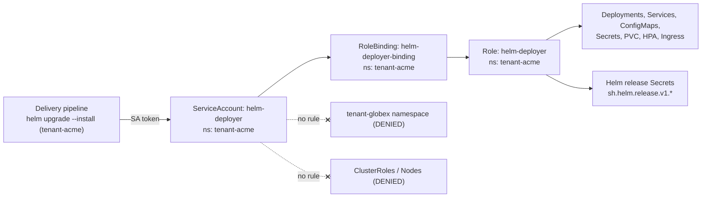
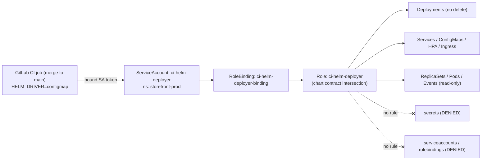
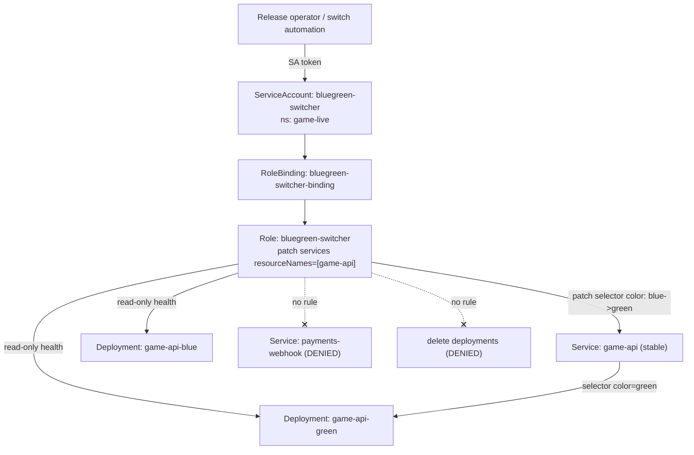
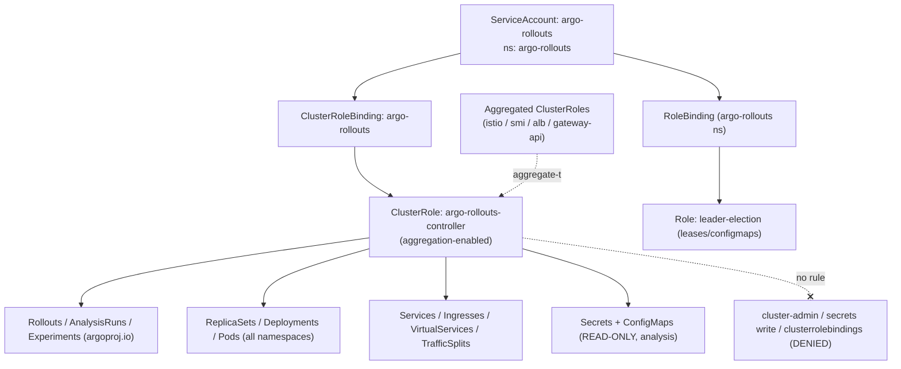

# Helm & Release Management

Five production RBAC scenarios covering how enterprises scope the identities that ship software — per-namespace Helm deployers, least-privilege CI release accounts, blue-green traffic switches, the Argo Rollouts controller, and human release-manager promote gates — on Kubernetes v1.33+.

## Scenario 56 — Per-Namespace Helm Deploy ServiceAccount (Tiller-less)

**Company / Industry:** SaaS / Multi-Tenant B2B Platform

### Business Requirement
A multi-tenant SaaS platform gives each customer a dedicated namespace (`tenant-acme`, `tenant-globex`, …) and ships every tenant's stack as a Helm 3 release from a shared delivery pipeline. Because Helm 3 is tiller-less, `helm upgrade --install` runs directly against the API server as whatever identity the pipeline presents — so the security team must guarantee that a deploy into one tenant can never read, mutate, or even enumerate another tenant's workloads or Secrets. Each tenant deploy must be able to manage the full application stack (Deployments, Services, ConfigMaps, PVCs, HPAs, Ingress) plus Helm's own release-history storage, but strictly within its own namespace.

### Existing Problem
The team migrated off Helm 2 but carried over the Tiller-era mental model: a single `helm-deployer` ServiceAccount in `kube-system` bound to `cluster-admin` "so Helm can do whatever the chart needs." A templating bug rendered a chart with the wrong `namespace:` value baked into the manifests, and because the deployer had cluster-wide write, `helm upgrade` for `tenant-globex` happily created a Deployment and copied a pull secret into `tenant-acme`. No RBAC boundary caught it — the only reason it was noticed was a tenant complaining about a phantom pod. The company needs each tenant's Helm identity confined to its namespace so a mis-templated release physically cannot cross tenants.

### Proposed RBAC Solution
One dedicated **ServiceAccount** per tenant namespace (`helm-deployer` in `tenant-acme`), each granted a namespaced **Role** via a **RoleBinding** in that same namespace. A namespaced Role — not a ClusterRole — is the entire point: RBAC evaluates the Role only within its namespace, so a manifest that names a foreign namespace is rejected by the API server rather than silently applied. A **ServiceAccount** (not a Group) is correct because the deployer is a non-human workload identity whose token the pipeline mounts or mints per tenant. We deliberately do **not** grant `escalate`, `bind`, or any `*.rbac.authorization.k8s.io` write, so a chart cannot ship its own RBAC to widen the deployer. The Role explicitly includes `secrets` because Helm 3's default storage driver persists release state as Secrets (`sh.helm.release.v1.<release>.v<rev>`) in the release namespace.

### Kubernetes Resources
- Deployments, StatefulSets, ReplicaSets (apps)
- Services, ConfigMaps, Secrets, PersistentVolumeClaims, ServiceAccounts (core)
- HorizontalPodAutoscalers (autoscaling)
- Jobs, CronJobs (batch) — chart hooks and scheduled tasks
- Ingresses (networking.k8s.io)
- PodDisruptionBudgets (policy)
- Secrets (core) again — Helm 3 release-history storage driver

### Required Permissions
- `deployments`, `statefulsets` (apps) → `get`, `list`, `watch`, `create`, `update`, `patch`, `delete` — Helm creates, upgrades, and prunes workloads across revisions.
- `replicasets` (apps) → `get`, `list`, `watch` — observe rollouts the controllers spawn.
- `services`, `configmaps`, `persistentvolumeclaims`, `serviceaccounts` (core) → `get`, `list`, `watch`, `create`, `update`, `patch`, `delete` — full chart object lifecycle.
- `secrets` (core) → `get`, `list`, `watch`, `create`, `update`, `patch`, `delete` — both application Secrets the chart renders **and** Helm's release-history Secrets.
- `horizontalpodautoscalers` (autoscaling), `jobs`/`cronjobs` (batch), `ingresses` (networking.k8s.io), `poddisruptionbudgets` (policy) → `get`, `list`, `watch`, `create`, `update`, `patch`, `delete`.
- No `nodes`, no `namespaces`, no `clusterroles`/`clusterrolebindings`, no `escalate`/`bind` — the deployer cannot touch cluster scope or grant itself more.

### Architecture Diagram


### YAML Implementation
```yaml
apiVersion: v1
kind: Namespace
metadata:
  name: tenant-acme
  labels:
    app.kubernetes.io/part-of: saas-platform
    tenant.saasco.io/id: acme
    tenant.saasco.io/tier: production
    pod-security.kubernetes.io/enforce: restricted
---
apiVersion: v1
kind: ServiceAccount
metadata:
  name: helm-deployer
  namespace: tenant-acme
  labels:
    app.kubernetes.io/part-of: saas-platform
    rbac.saasco.io/purpose: helm-release
automountServiceAccountToken: false   # pipeline mints a short-lived token via TokenRequest
---
apiVersion: rbac.authorization.k8s.io/v1
kind: Role
metadata:
  name: helm-deployer
  namespace: tenant-acme
  labels:
    app.kubernetes.io/part-of: saas-platform
rules:
  - apiGroups: ["apps"]
    resources: ["deployments", "statefulsets"]
    verbs: ["get", "list", "watch", "create", "update", "patch", "delete"]
  - apiGroups: ["apps"]
    resources: ["replicasets"]
    verbs: ["get", "list", "watch"]
  - apiGroups: [""]
    resources: ["services", "configmaps", "persistentvolumeclaims", "serviceaccounts"]
    verbs: ["get", "list", "watch", "create", "update", "patch", "delete"]
  - apiGroups: [""]
    # Application Secrets AND Helm 3 release-history Secrets (sh.helm.release.v1.*)
    resources: ["secrets"]
    verbs: ["get", "list", "watch", "create", "update", "patch", "delete"]
  - apiGroups: ["autoscaling"]
    resources: ["horizontalpodautoscalers"]
    verbs: ["get", "list", "watch", "create", "update", "patch", "delete"]
  - apiGroups: ["batch"]
    resources: ["jobs", "cronjobs"]
    verbs: ["get", "list", "watch", "create", "update", "patch", "delete"]
  - apiGroups: ["networking.k8s.io"]
    resources: ["ingresses"]
    verbs: ["get", "list", "watch", "create", "update", "patch", "delete"]
  - apiGroups: ["policy"]
    resources: ["poddisruptionbudgets"]
    verbs: ["get", "list", "watch", "create", "update", "patch", "delete"]
---
apiVersion: rbac.authorization.k8s.io/v1
kind: RoleBinding
metadata:
  name: helm-deployer-binding
  namespace: tenant-acme
  labels:
    app.kubernetes.io/part-of: saas-platform
subjects:
  - kind: ServiceAccount
    name: helm-deployer
    namespace: tenant-acme
roleRef:
  kind: Role
  name: helm-deployer
  apiGroup: rbac.authorization.k8s.io
---
# Contain the blast radius of any single tenant deploy
apiVersion: v1
kind: ResourceQuota
metadata:
  name: tenant-acme-quota
  namespace: tenant-acme
spec:
  hard:
    requests.cpu: "20"
    requests.memory: 40Gi
    limits.cpu: "40"
    limits.memory: 80Gi
    count/deployments.apps: "25"
    persistentvolumeclaims: "15"
```

### Commands
```bash
# 1. Create namespace + SA + Role + RoleBinding + quota
kubectl apply -f tenant-acme-helm-rbac.yaml

# 2. Mint a short-lived token for the deployer SA (bound, expiring) — no static Secret
TOKEN=$(kubectl create token helm-deployer -n tenant-acme --duration=15m)

# 3. Build a kubeconfig for the pipeline that uses that token, scoped to the namespace
kubectl config set-credentials helm-deployer-acme --token="$TOKEN"
kubectl config set-context helm-acme \
  --cluster="$(kubectl config current-context)" \
  --user=helm-deployer-acme --namespace=tenant-acme
kubectl config use-context helm-acme

# 4. Deploy the tenant release (Helm 3 talks to the API server directly as this SA)
helm upgrade --install acme-app ./charts/tenant-app \
  --namespace tenant-acme \
  --values values/acme.yaml \
  --atomic --timeout 5m

# 5. Inspect the release history stored as Secrets in the tenant namespace
helm history acme-app -n tenant-acme
```

### Verification
```bash
# ALLOW: the deployer can manage its own namespace and Helm history
kubectl auth can-i create deployments -n tenant-acme --as=system:serviceaccount:tenant-acme:helm-deployer
kubectl auth can-i delete secrets     -n tenant-acme --as=system:serviceaccount:tenant-acme:helm-deployer
kubectl auth can-i patch ingresses    -n tenant-acme --as=system:serviceaccount:tenant-acme:helm-deployer

# DENY: cannot cross into another tenant
kubectl auth can-i get deployments -n tenant-globex --as=system:serviceaccount:tenant-acme:helm-deployer
kubectl auth can-i get secrets     -n tenant-globex --as=system:serviceaccount:tenant-acme:helm-deployer

# DENY: cannot touch cluster scope or grant itself more
kubectl auth can-i get nodes                --as=system:serviceaccount:tenant-acme:helm-deployer
kubectl auth can-i create clusterrolebindings --as=system:serviceaccount:tenant-acme:helm-deployer

# Full effective set
kubectl auth can-i --list -n tenant-acme --as=system:serviceaccount:tenant-acme:helm-deployer
```

### Expected Output
```text
$ kubectl auth can-i create deployments -n tenant-acme --as=system:serviceaccount:tenant-acme:helm-deployer
yes
$ kubectl auth can-i delete secrets -n tenant-acme --as=system:serviceaccount:tenant-acme:helm-deployer
yes
$ kubectl auth can-i get deployments -n tenant-globex --as=system:serviceaccount:tenant-acme:helm-deployer
no
$ kubectl auth can-i get nodes --as=system:serviceaccount:tenant-acme:helm-deployer
no
$ kubectl auth can-i create clusterrolebindings --as=system:serviceaccount:tenant-acme:helm-deployer
no

# A mis-templated release that names a foreign namespace is rejected, not applied cross-tenant:
$ helm upgrade --install acme-app ./charts/tenant-app -n tenant-acme
Error: UPGRADE FAILED: create: failed to create: deployments.apps is forbidden:
User "system:serviceaccount:tenant-acme:helm-deployer" cannot create resource "deployments"
in API group "apps" in the namespace "tenant-globex"
```

### Common Mistakes
- Reusing one cluster-wide deployer SA for every tenant "because Helm 3 needs broad access" — Helm 3 needs exactly what the chart's objects need, nothing more.
- Forgetting `secrets` verbs and getting `cannot create secrets ... sh.helm.release.v1...` because Helm's default driver stores history as Secrets.
- Granting `namespaces` `create` to the deployer so charts can `--create-namespace` — that quietly re-introduces cross-namespace reach; create tenant namespaces out-of-band.
- Mounting a long-lived SA token Secret instead of minting a short-lived one with `kubectl create token`/`TokenRequest`.
- Adding `serviceaccounts` + `rolebindings` write to the deployer so charts can bundle their own RBAC — that is a self-escalation path.

### Troubleshooting
- `cannot create resource "secrets"`: the Role is missing `secrets` verbs; Helm cannot persist release history — add them or switch to a non-Secret driver.
- Cross-tenant `Forbidden` during `helm upgrade`: a template rendered the wrong `namespace:`; run `helm template` locally and grep for stray namespaces.
- `kubectl auth can-i --list -n tenant-acme --as=system:serviceaccount:tenant-acme:helm-deployer` to enumerate the exact effective verbs the pipeline has.
- `kubectl describe rolebinding helm-deployer-binding -n tenant-acme` to confirm the subject `namespace` matches the SA's namespace (a common copy-paste slip).
- If deploys succeed but Helm cannot read history, verify `HELM_DRIVER` (secret vs configmap) matches the resource the Role grants.

### Best Practice
Mature SaaS platforms generate the per-tenant namespace, ServiceAccount, Role, RoleBinding, and ResourceQuota from a single templated bundle (Helmfile, Kustomize, or a tenant-provisioning operator) so every tenant is identical and drift-free. The deployer token is never stored: the pipeline calls the TokenRequest API for a 5-15 minute bound token per deploy. RBAC lives in Git and is applied by a GitOps controller, so widening a tenant's permissions is a reviewed pull request, and tenant onboarding/offboarding is a one-line change to the tenant list.

### Security Notes
Least privilege here is namespace confinement: because the Role is namespaced and carries no cluster-scoped or RBAC-write verbs, the worst a compromised or buggy tenant deploy can do is damage its own namespace — the blast radius is exactly one tenant. Secret exposure is bounded to the tenant's own Secrets; there is no path to another tenant's pull secrets or TLS keys. The deliberate omission of `escalate`, `bind`, and `serviceaccounts`/`rolebindings` write closes the classic "chart ships its own RBAC" self-escalation. The residual risk is the deployer's own token: short-lived TokenRequest tokens and `automountServiceAccountToken: false` keep it from lingering as a stealable long-lived credential.

### Interview Questions
1. Helm 3 removed Tiller — so what identity actually performs the API writes during `helm upgrade`, and what changed for RBAC?
2. Why does a Helm deploy Role need `secrets` verbs even for a chart that renders no Secrets of its own?
3. Why a namespaced Role per tenant instead of one ClusterRole with a RoleBinding per namespace?
4. How does this design stop a mis-templated chart from creating objects in the wrong tenant?
5. Why deliberately omit `serviceaccounts`, `roles`, and `rolebindings` write from the deployer, and what attack does that prevent?

### Interview Answers
1. In Helm 3 there is no server-side component; the `helm` CLI talks to the API server directly using the caller's kubeconfig identity — here the `helm-deployer` ServiceAccount. RBAC therefore evaluates every create/update/delete against that SA, so the deploy identity must hold exactly the permissions the chart's rendered objects require. Under Tiller, all writes went through one over-privileged pod SA, which is precisely the anti-pattern this replaces.
2. Helm 3's default storage driver persists each release revision as a Secret named `sh.helm.release.v1.<release>.v<rev>` in the release namespace. Without `create`/`get`/`update`/`delete` on `secrets`, `helm upgrade` fails to record history even if every application object applies cleanly. (Switching `HELM_DRIVER` to `configmap` moves the requirement to ConfigMaps instead.)
3. A namespaced Role plus RoleBinding is evaluated only within its namespace, so it is structurally impossible for `tenant-acme`'s deployer to act in `tenant-globex`. A single shared ClusterRole referenced by many RoleBindings works for the grant, but centralizes a change surface — one edit to that ClusterRole silently re-scopes every tenant — and invites accidentally attaching a ClusterRoleBinding. Per-tenant Roles keep the change blast radius as small as the tenant.
4. The API server authorizes each object against the deployer's namespaced Role. If a template renders `namespace: tenant-globex`, the write is evaluated as "create in tenant-globex," for which the `tenant-acme` deployer has no rule, so it is rejected with `Forbidden` and `--atomic` rolls the release back. The boundary is enforced at admission, not by convention.
5. If the deployer could write ServiceAccounts and RoleBindings, a chart (or an attacker who controls chart values) could create a new SA and bind it to a broader Role — or bind the deployer itself to `cluster-admin` — escalating out of the sandbox. Omitting those verbs (and `escalate`/`bind`) means the deployer can never grant more than it already has.

### Follow-up Questions
- How would you let a chart create the tenant namespace with `--create-namespace` without giving the deployer cluster-wide `namespaces` create?
- What breaks if two tenants' pipelines run `helm upgrade` concurrently against the same release name, and how does RBAC or Helm's locking help?
- How would you migrate release history from the Secret driver to the SQL driver, and what RBAC changes?
- How do you prevent a chart hook Job from running with a more privileged SA than the deployer intended?

### Production Tips
Google's GKE guidance pushes exactly this per-namespace ServiceAccount + Workload Identity model for tenant deploy identities, and gke-security-groups is used when the deployer must be a human-adjacent group instead. Amazon pairs the pattern with IRSA so the tenant deployer pod assumes a tenant-scoped IAM role for pulling charts from ECR/S3. Zoho and Freshworks, which run heavily multi-tenant SaaS, provision the tenant namespace + RBAC bundle from an internal tenant-onboarding operator so a new customer is a single record that fans out to identical, least-privilege Helm deploy identities.

## Scenario 57 — Least-Privilege Helm ServiceAccount for CI (E-Commerce)

**Company / Industry:** E-Commerce / High-Traffic Online Retail

### Business Requirement
A large online retailer ships its storefront, cart, and checkout services to a shared `storefront-prod` namespace via a Helm chart run from GitLab CI on every merge to `main`. The chart's contract is fixed and narrow: it manages exactly Deployments, Services, ConfigMaps, HPAs, and an Ingress — it never creates Secrets, PVCs, ServiceAccounts, or RBAC. Security requires the CI identity to be able to do precisely what that chart declares and provably nothing else, so that a malicious dependency or a poisoned `values.yaml` in a pull request cannot read production Secrets or create privileged workloads.

### Existing Problem
The CI deploy account was created by copying a generic "editor" ClusterRole binding into the namespace. During a supply-chain scare, the team realized the CI SA could `get secrets` in `storefront-prod` — meaning the payment-gateway API key, the session-signing key, and the database DSN were all readable by any job the pipeline ran, including jobs triggered from forked merge requests. Worse, the SA could create ServiceAccounts and Jobs, so a crafted chart hook could have spun up a pod mounting a privileged token. There was no correspondence between what the chart actually declares and what the CI identity was permitted to do.

### Proposed RBAC Solution
A single-purpose **ServiceAccount** (`ci-helm-deployer`) in `storefront-prod`, bound by a **RoleBinding** to a tightly hand-authored namespaced **Role** whose rules are the exact intersection of the chart's object types and the verbs Helm needs on them. Crucially the Role grants **no read on application `secrets`** and separates Helm's release-history storage onto the **ConfigMap driver** (`HELM_DRIVER=configmap`) so the deploy identity never needs any Secret access at all. `delete` is deliberately withheld on Deployments/Services (rollbacks are re-applies, not delete-and-recreate). A ServiceAccount is correct (workload identity, short-lived token); a namespaced Role (not ClusterRole) confines CI to one namespace. This differs from Scenario 56 in intent: 56 gives a tenant deployer full stack control; 57 pins CI to a fixed chart contract and eliminates Secret access entirely.

### Kubernetes Resources
- Deployments (apps)
- ReplicaSets (apps) — read-only, to watch rollout
- Pods, Pods/log (core) — read-only, to confirm readiness and pull failure logs
- Services, ConfigMaps (core)
- HorizontalPodAutoscalers (autoscaling)
- Ingresses (networking.k8s.io)
- ConfigMaps (core) again — Helm release-history storage (configmap driver)
- Events (core) — read-only, to surface rollout failures

### Required Permissions
- `deployments` (apps) → `get`, `list`, `watch`, `create`, `update`, `patch` — apply and roll out; **no `delete`**.
- `replicasets`, `pods`, `pods/log`, `events` (apps/core) → `get`, `list`, `watch` — observe rollout, read logs and events on failure. Read-only.
- `services` (core) → `get`, `list`, `watch`, `create`, `update`, `patch` — the chart's Service objects.
- `configmaps` (core) → `get`, `list`, `watch`, `create`, `update`, `patch`, `delete` — both the chart's ConfigMaps and Helm's release-history (configmap driver, which requires `delete` to prune old revisions).
- `horizontalpodautoscalers` (autoscaling) → `get`, `list`, `watch`, `create`, `update`, `patch`.
- `ingresses` (networking.k8s.io) → `get`, `list`, `watch`, `create`, `update`, `patch`.
- **No** `secrets` verbs at all, **no** `serviceaccounts`, **no** `roles`/`rolebindings`, **no** `jobs` — the chart declares none of these, so the identity is denied them.

### Architecture Diagram


### YAML Implementation
```yaml
apiVersion: v1
kind: ServiceAccount
metadata:
  name: ci-helm-deployer
  namespace: storefront-prod
  labels:
    app.kubernetes.io/part-of: storefront
    rbac.retailco.io/purpose: ci-release
automountServiceAccountToken: false
---
apiVersion: rbac.authorization.k8s.io/v1
kind: Role
metadata:
  name: ci-helm-deployer
  namespace: storefront-prod
  labels:
    app.kubernetes.io/part-of: storefront
  annotations:
    rbac.retailco.io/chart-contract: "storefront@>=4.0.0"
    rbac.retailco.io/note: "Verbs match the chart's declared object types exactly. No secrets."
rules:
  # Workloads: apply + roll out, but never delete
  - apiGroups: ["apps"]
    resources: ["deployments"]
    verbs: ["get", "list", "watch", "create", "update", "patch"]
  # Read-only rollout observability
  - apiGroups: ["apps"]
    resources: ["replicasets"]
    verbs: ["get", "list", "watch"]
  - apiGroups: [""]
    resources: ["pods", "pods/log", "events"]
    verbs: ["get", "list", "watch"]
  # Chart networking + config objects
  - apiGroups: [""]
    resources: ["services"]
    verbs: ["get", "list", "watch", "create", "update", "patch"]
  - apiGroups: [""]
    # Chart ConfigMaps AND Helm release history (HELM_DRIVER=configmap).
    # delete is required to prune old release revisions.
    resources: ["configmaps"]
    verbs: ["get", "list", "watch", "create", "update", "patch", "delete"]
  - apiGroups: ["autoscaling"]
    resources: ["horizontalpodautoscalers"]
    verbs: ["get", "list", "watch", "create", "update", "patch"]
  - apiGroups: ["networking.k8s.io"]
    resources: ["ingresses"]
    verbs: ["get", "list", "watch", "create", "update", "patch"]
  # NOTE: no secrets, no serviceaccounts, no roles/rolebindings, no jobs — chart declares none.
---
apiVersion: rbac.authorization.k8s.io/v1
kind: RoleBinding
metadata:
  name: ci-helm-deployer-binding
  namespace: storefront-prod
  labels:
    app.kubernetes.io/part-of: storefront
subjects:
  - kind: ServiceAccount
    name: ci-helm-deployer
    namespace: storefront-prod
roleRef:
  kind: Role
  name: ci-helm-deployer
  apiGroup: rbac.authorization.k8s.io
---
# Belt-and-braces: even if a hook pod were somehow created, it cannot mount privileged tokens.
apiVersion: v1
kind: LimitRange
metadata:
  name: storefront-prod-defaults
  namespace: storefront-prod
spec:
  limits:
    - type: Container
      default:
        cpu: "1"
        memory: 1Gi
      defaultRequest:
        cpu: 250m
        memory: 256Mi
```

### Commands
```bash
# 1. Apply the CI identity and its narrow Role
kubectl apply -f ci-helm-deployer-rbac.yaml

# 2. In CI: force the ConfigMap history driver so no Secret access is ever needed
export HELM_DRIVER=configmap

# 3. Mint a short-lived bound token for the pipeline (no static Secret token)
TOKEN=$(kubectl create token ci-helm-deployer -n storefront-prod --duration=10m)

# 4. Deploy the fixed-contract chart; --atomic rolls back on any Forbidden/failed hook
helm upgrade --install storefront ./charts/storefront \
  --namespace storefront-prod \
  --set image.tag="$CI_COMMIT_SHORT_SHA" \
  --atomic --timeout 5m \
  --kube-token "$TOKEN"

# 5. Prove the driver stored history as ConfigMaps, not Secrets
kubectl get configmaps -n storefront-prod -l owner=helm
```

### Verification
```bash
# ALLOW: exactly the chart contract
kubectl auth can-i create deployments -n storefront-prod --as=system:serviceaccount:storefront-prod:ci-helm-deployer
kubectl auth can-i patch ingresses    -n storefront-prod --as=system:serviceaccount:storefront-prod:ci-helm-deployer
kubectl auth can-i delete configmaps  -n storefront-prod --as=system:serviceaccount:storefront-prod:ci-helm-deployer

# DENY: no Secret access, no delete on workloads, no identity creation
kubectl auth can-i get secrets        -n storefront-prod --as=system:serviceaccount:storefront-prod:ci-helm-deployer
kubectl auth can-i delete deployments -n storefront-prod --as=system:serviceaccount:storefront-prod:ci-helm-deployer
kubectl auth can-i create serviceaccounts -n storefront-prod --as=system:serviceaccount:storefront-prod:ci-helm-deployer
kubectl auth can-i create jobs        -n storefront-prod --as=system:serviceaccount:storefront-prod:ci-helm-deployer

kubectl auth can-i --list -n storefront-prod --as=system:serviceaccount:storefront-prod:ci-helm-deployer
```

### Expected Output
```text
$ kubectl auth can-i create deployments -n storefront-prod --as=system:serviceaccount:storefront-prod:ci-helm-deployer
yes
$ kubectl auth can-i delete configmaps -n storefront-prod --as=system:serviceaccount:storefront-prod:ci-helm-deployer
yes
$ kubectl auth can-i get secrets -n storefront-prod --as=system:serviceaccount:storefront-prod:ci-helm-deployer
no
$ kubectl auth can-i delete deployments -n storefront-prod --as=system:serviceaccount:storefront-prod:ci-helm-deployer
no
$ kubectl auth can-i create serviceaccounts -n storefront-prod --as=system:serviceaccount:storefront-prod:ci-helm-deployer
no

# A poisoned values.yaml that tries to render a Secret hook fails closed:
$ helm upgrade --install storefront ./charts/storefront -n storefront-prod --atomic
Error: UPGRADE FAILED: create: failed to create: secrets is forbidden:
User "system:serviceaccount:storefront-prod:ci-helm-deployer" cannot create resource "secrets"
in API group "" in the namespace "storefront-prod"
```

### Common Mistakes
- Binding a generic `edit`/`admin` ClusterRole to the CI SA — instantly grants `secrets` read and `serviceaccounts`/`jobs` create, defeating the point.
- Leaving `HELM_DRIVER` at the default (secret) while trying to remove all Secret access — Helm then can't store history and every deploy fails.
- Forgetting `delete` on ConfigMaps and hitting failures only after ~10 revisions when Helm tries to prune old history.
- Granting `delete` on Deployments "for cleanup" — a hijacked job can then wipe the storefront; use re-apply/rollback instead.
- Not scoping the Role to the chart's actual object types, so it drifts broader than the chart over time.

### Troubleshooting
- `cannot create resource "secrets"` during upgrade: either the chart started rendering a Secret (contract change — review the diff) or `HELM_DRIVER` is still `secret`.
- `cannot delete resource "configmaps"`: history pruning is blocked; add `delete` on configmaps or reduce `--history-max`.
- Deploy hangs then rolls back with `--atomic`: check `kubectl get events -n storefront-prod` and `kubectl logs` — the read-only pods/events grants exist precisely for this.
- Reconcile the chart-to-Role contract periodically: `helm template ./charts/storefront | grep '^kind:' | sort -u` and compare against the Role's `resources`.
- `kubectl auth can-i --list` under the SA to snapshot the exact effective permissions during audits.

### Best Practice
Retail platforms treat the Role as a machine-verified contract: a CI check runs `helm template` on the chart, extracts the set of `kind`s, and fails the build if the chart declares an object type the Role does not grant (or vice-versa), so RBAC and the chart never drift. History is kept on the ConfigMap or SQL driver in production so deploy identities are Secret-free, and the token is a per-job TokenRequest token with a 10-minute TTL delivered over the pipeline's OIDC federation rather than a static kubeconfig secret.

### Security Notes
The headline mitigation is total elimination of Secret access from the deploy path: because the CI identity has zero `secrets` verbs and history lives in ConfigMaps, a supply-chain compromise of the chart or a forked-MR job cannot read the payment key, session key, or DB DSN — the highest-value targets in a storefront namespace. Withholding `serviceaccounts`/`rolebindings`/`jobs` creation removes the "hook creates a privileged pod" escalation, and withholding `delete` on workloads bounds a hijacked pipeline to (recoverable) bad updates rather than destruction. Residual risk is contract drift — a future chart version that legitimately needs a Secret — which is caught by the template-vs-Role CI check rather than by loosening the Role pre-emptively.

### Interview Questions
1. How do you design a Helm CI Role so it maps one-to-one to a chart's declared object types, and how do you keep them from drifting?
2. Why change `HELM_DRIVER` to configmap in this scenario, and what RBAC consequence does that have?
3. Why omit `delete` on Deployments and Services from a CI deploy identity, and how are rollbacks handled without it?
4. A forked merge request runs a job that tries to read `storefront-prod` Secrets — trace exactly why it fails.
5. Why is `create` on `serviceaccounts` and `jobs` specifically dangerous for a Helm CI identity?

### Interview Answers
1. Render the chart with `helm template`, collect the distinct `kind` values, and author the Role's `resources` to be exactly that set with only the verbs Helm needs (create/update/patch, plus read for observability). Then add a CI gate that re-derives that set on every chart change and fails if it diverges from the Role — RBAC becomes a checked artifact rather than a hand-maintained guess, so it can't silently broaden.
2. The default Secret driver forces the deploy identity to hold `secrets` write to store release history; switching to the ConfigMap driver moves that requirement to ConfigMaps, letting you grant zero Secret verbs. The RBAC consequence is that `configmaps` needs `delete` (to prune old revisions) in addition to create/update — but the identity becomes completely blind to application Secrets.
3. `delete` lets a compromised or buggy pipeline destroy a live production workload; the recovery model instead is to re-apply the previous good image tag (a `patch`/`update`), which the Role already allows, or `helm rollback`, which also only updates. Delete-and-recreate causes an availability gap and needs no permission that a hijacked job could abuse, so it is withheld.
4. Helm/kubectl in that job authenticates as `system:serviceaccount:storefront-prod:ci-helm-deployer`. The Role bound to that SA has no rule with `resources: ["secrets"]`, so the API server's RBAC authorizer finds no matching allow rule and returns `Forbidden`. Even though the pod runs in the namespace that holds the Secrets, RBAC gates the API read, not filesystem access, so it fails closed.
5. `serviceaccounts` create lets an attacker mint a new identity; combined with any mountable token it becomes a foothold, and if paired with `rolebindings` it is a direct escalation. `jobs` create lets a chart hook launch an arbitrary pod under a chosen SA, running attacker code with whatever that SA can do. Neither is in the chart's contract, so both are denied — the deploy identity can only touch the declared, benign object types.

### Follow-up Questions
- How would you extend the template-vs-Role CI check to also assert the exact verb set, not just the object kinds?
- If the chart later needs one Secret (say a TLS cert), how do you grant the narrowest possible access without opening blanket Secret read?
- How do you prevent `helm rollback` from needing more permissions than `helm upgrade` in this model?
- How would you attribute a specific production deploy to a specific merge request and reviewer through this SA?

### Production Tips
Flipkart and Swiggy run storefront/discovery deploys through CI identities scoped to the exact chart contract, with the release-history driver moved off Secrets and tokens issued per-pipeline-run via OIDC federation. Razorpay, handling payment credentials, is emphatic about deploy identities never holding `secrets` read — application secrets are injected at runtime from a secrets manager (Vault/CSI driver) so the pipeline never touches them. Microsoft's AKS guidance recommends this "Role mirrors the workload's declared resources" approach and pairs it with Azure AD workload identity so the CI SA federates to a scoped Entra identity for pulling charts from ACR.

## Scenario 58 — Blue-Green Deployment RBAC via Service Selector Switch (Gaming)

**Company / Industry:** Gaming / Live Multiplayer Backend

### Business Requirement
A live multiplayer game runs its matchmaking and session API in a `game-live` namespace using a blue-green strategy: two full Deployments (`game-api-blue` and `game-api-green`) run side by side, and a single stable Service (`game-api`) routes 100% of player traffic to whichever color is "active" by way of its label selector. Releasing a new build means deploying the idle color, smoke-testing it via a preview Service, and then atomically flipping the stable Service's selector from `blue` to `green`. During a launch event, an on-call release operator must be able to perform (and instantly reverse) that flip — and nothing else. It must be impossible for that operator identity to delete Deployments, read Secrets, or touch any other Service.

### Existing Problem
Traffic switches were done by whoever was on call using their personal `cluster-admin`-adjacent kubeconfig, running an ad-hoc `kubectl patch svc`. During a Friday-night tournament, a tired operator targeted the wrong object and patched the selector of the `payments-webhook` Service instead of `game-api`, black-holing purchase callbacks for eleven minutes. There was no guardrail preventing the switch identity from editing arbitrary Services, and the switch action had the same privilege as full cluster administration. The studio needs a dedicated switch identity that can `patch` exactly the one stable Service and read the two Deployments to verify health — with the target object pinned by name.

### Proposed RBAC Solution
A dedicated **ServiceAccount** (`bluegreen-switcher`) in `game-live`, bound by a **RoleBinding** to a namespaced **Role** whose only mutating rule is `patch`/`update` on **services** restricted with `resourceNames: ["game-api"]` — so the identity can flip the one stable Service and no other. The Role adds read-only access to the blue/green Deployments and their Pods to verify the target color is healthy before the flip. A `resourceName`-scoped Role is the decisive choice: it makes "patch any Service" impossible, eliminating the wrong-object incident by construction. A ServiceAccount (used by the switch automation/runbook) rather than a Group is chosen because the flip is executed by a controlled tool; for human break-glass the same Role can additionally be bound to an on-call Group.

### Kubernetes Resources
- Services (core) — the stable `game-api` Service (selector target) and read of the preview Service
- Deployments (apps) — `game-api-blue`, `game-api-green` (read-only health check)
- ReplicaSets, Pods (core/apps) — read-only, to confirm the target color has ready replicas
- Endpoints / EndpointSlices (core / discovery.k8s.io) — read-only, to confirm the switch took effect

### Required Permissions
- `services` (core) → `get`, `list`, `watch` on all (to inspect) **plus** `patch`, `update` restricted via `resourceNames: ["game-api"]` — flip the selector of exactly one Service. No `create`, no `delete`.
- `deployments` (apps) → `get`, `list`, `watch` — verify blue/green health; **no write**, the switcher never changes workloads.
- `replicasets` (apps), `pods` (core) → `get`, `list`, `watch` — confirm ready replicas of the target color.
- `endpoints` (core), `endpointslices` (discovery.k8s.io) → `get`, `list`, `watch` — prove the Service now points at the new color.
- Explicitly **no** `secrets`, **no** `delete` anywhere, **no** write on any Service other than `game-api`.

### Architecture Diagram


### YAML Implementation
```yaml
apiVersion: v1
kind: Service
metadata:
  name: game-api
  namespace: game-live
  labels:
    app.kubernetes.io/name: game-api
    role: stable
spec:
  type: ClusterIP
  selector:
    app.kubernetes.io/name: game-api
    color: blue            # <-- the switch flips this to "green"
  ports:
    - name: http
      port: 80
      targetPort: 8080
---
apiVersion: apps/v1
kind: Deployment
metadata:
  name: game-api-blue
  namespace: game-live
  labels: { app.kubernetes.io/name: game-api, color: blue }
spec:
  replicas: 6
  selector:
    matchLabels: { app.kubernetes.io/name: game-api, color: blue }
  template:
    metadata:
      labels: { app.kubernetes.io/name: game-api, color: blue }
    spec:
      containers:
        - name: api
          image: registry.gamestudio.io/game-api:1.14.0
          ports: [{ containerPort: 8080 }]
          readinessProbe:
            httpGet: { path: /healthz, port: 8080 }
---
apiVersion: apps/v1
kind: Deployment
metadata:
  name: game-api-green
  namespace: game-live
  labels: { app.kubernetes.io/name: game-api, color: green }
spec:
  replicas: 6
  selector:
    matchLabels: { app.kubernetes.io/name: game-api, color: green }
  template:
    metadata:
      labels: { app.kubernetes.io/name: game-api, color: green }
    spec:
      containers:
        - name: api
          image: registry.gamestudio.io/game-api:1.15.0
          ports: [{ containerPort: 8080 }]
          readinessProbe:
            httpGet: { path: /healthz, port: 8080 }
---
apiVersion: v1
kind: ServiceAccount
metadata:
  name: bluegreen-switcher
  namespace: game-live
  labels:
    app.kubernetes.io/part-of: game-live
    rbac.gamestudio.io/purpose: traffic-switch
automountServiceAccountToken: false
---
apiVersion: rbac.authorization.k8s.io/v1
kind: Role
metadata:
  name: bluegreen-switcher
  namespace: game-live
  labels:
    app.kubernetes.io/part-of: game-live
rules:
  # Inspect any Service, but this rule grants no write
  - apiGroups: [""]
    resources: ["services"]
    verbs: ["get", "list", "watch"]
  # Mutate ONLY the stable Service, and only via patch/update — pinned by name
  - apiGroups: [""]
    resources: ["services"]
    resourceNames: ["game-api"]
    verbs: ["patch", "update"]
  # Read-only health verification of both colors
  - apiGroups: ["apps"]
    resources: ["deployments", "replicasets"]
    verbs: ["get", "list", "watch"]
  - apiGroups: [""]
    resources: ["pods", "endpoints"]
    verbs: ["get", "list", "watch"]
  - apiGroups: ["discovery.k8s.io"]
    resources: ["endpointslices"]
    verbs: ["get", "list", "watch"]
---
apiVersion: rbac.authorization.k8s.io/v1
kind: RoleBinding
metadata:
  name: bluegreen-switcher-binding
  namespace: game-live
  labels:
    app.kubernetes.io/part-of: game-live
subjects:
  - kind: ServiceAccount
    name: bluegreen-switcher
    namespace: game-live
  # Optional human break-glass: same narrow Role for the on-call group
  - kind: Group
    name: gamestudio:live-oncall
    apiGroup: rbac.authorization.k8s.io
roleRef:
  kind: Role
  name: bluegreen-switcher
  apiGroup: rbac.authorization.k8s.io
```

### Commands
```bash
# 1. Apply workloads, stable Service, and the switch identity
kubectl apply -f bluegreen.yaml

# 2. (Release) confirm the idle color (green) is fully ready BEFORE flipping
kubectl get deploy game-api-green -n game-live \
  -o jsonpath='{.status.readyReplicas}/{.spec.replicas}{"\n"}' \
  --as=system:serviceaccount:game-live:bluegreen-switcher

# 3. THE FLIP: point the stable Service at green (allowed only on game-api)
kubectl patch svc game-api -n game-live \
  --type=merge -p '{"spec":{"selector":{"app.kubernetes.io/name":"game-api","color":"green"}}}' \
  --as=system:serviceaccount:game-live:bluegreen-switcher

# 4. Verify the endpoints now resolve to green pods
kubectl get endpointslices -n game-live -l kubernetes.io/service-name=game-api \
  --as=system:serviceaccount:game-live:bluegreen-switcher

# 5. INSTANT ROLLBACK (same allowed patch, back to blue)
kubectl patch svc game-api -n game-live \
  --type=merge -p '{"spec":{"selector":{"color":"blue"}}}' \
  --as=system:serviceaccount:game-live:bluegreen-switcher
```

### Verification
```bash
# ALLOW: flip the one stable Service; read both colors
kubectl auth can-i patch services/game-api -n game-live --as=system:serviceaccount:game-live:bluegreen-switcher
kubectl auth can-i get   deployments        -n game-live --as=system:serviceaccount:game-live:bluegreen-switcher

# DENY: cannot patch any OTHER Service (the incident that started this)
kubectl auth can-i patch services/payments-webhook -n game-live --as=system:serviceaccount:game-live:bluegreen-switcher

# DENY: cannot delete workloads or read Secrets
kubectl auth can-i delete deployments -n game-live --as=system:serviceaccount:game-live:bluegreen-switcher
kubectl auth can-i get    secrets      -n game-live --as=system:serviceaccount:game-live:bluegreen-switcher
kubectl auth can-i create services     -n game-live --as=system:serviceaccount:game-live:bluegreen-switcher

kubectl auth can-i --list -n game-live --as=system:serviceaccount:game-live:bluegreen-switcher
```

### Expected Output
```text
$ kubectl auth can-i patch services/game-api -n game-live --as=system:serviceaccount:game-live:bluegreen-switcher
yes
$ kubectl auth can-i get deployments -n game-live --as=system:serviceaccount:game-live:bluegreen-switcher
yes
$ kubectl auth can-i patch services/payments-webhook -n game-live --as=system:serviceaccount:game-live:bluegreen-switcher
no
$ kubectl auth can-i delete deployments -n game-live --as=system:serviceaccount:game-live:bluegreen-switcher
no
$ kubectl auth can-i get secrets -n game-live --as=system:serviceaccount:game-live:bluegreen-switcher
no

# The exact incident replayed — patching the wrong Service now fails closed:
$ kubectl patch svc payments-webhook -n game-live --type=merge -p '{"spec":{"selector":{"color":"green"}}}' \
    --as=system:serviceaccount:game-live:bluegreen-switcher
Error from server (Forbidden): services "payments-webhook" is forbidden:
User "system:serviceaccount:game-live:bluegreen-switcher" cannot patch resource "services"
in API group "" in the namespace "game-live"
```

### Common Mistakes
- Granting `patch services` without `resourceNames`, so the switcher can flip (or break) every Service in the namespace — exactly the incident.
- Assuming `resourceNames` filters `list`/`watch` — it does not; `list` still returns all Services, so keep the read rule separate and accept it is namespace-wide read-only.
- Adding `create`/`delete` on Services "to recreate if needed" — a delete of the stable Service drops all traffic; keep the switcher to `patch`/`update` only.
- Flipping the selector before the target color reports `readyReplicas == replicas`, sending players to a not-yet-ready build.
- Forgetting that `kubectl patch --type=merge` with a partial selector can leave stale selector keys; send the full intended selector.

### Troubleshooting
- `services "game-api" is forbidden ... cannot patch`: the `resourceNames` value doesn't match the Service name, or the mutating rule was merged into the read rule (a rule with `resourceNames` cannot include `list`/`watch`).
- Switch "succeeds" but traffic doesn't move: the patched selector doesn't match the target color's pod labels — diff `kubectl get svc game-api -o jsonpath='{.spec.selector}'` against the green pod labels.
- `kubectl auth can-i patch services/game-api` returns `no` but `patch services` returns `yes`: your read rule accidentally granted namespace-wide patch; the `resourceNames` scoping is being bypassed.
- `kubectl describe rolebinding bluegreen-switcher-binding -n game-live` to confirm both the SA and the on-call Group subjects resolve.
- Use `kubectl get endpointslices -l kubernetes.io/service-name=game-api` to confirm the switch actually re-pointed endpoints.

### Best Practice
Studios don't let humans hand-run the flip in production; the switch is a parameterized runbook/CD step (Argo CD sync of the Service selector, or a Rollout with `strategy.blueGreen`) executed under the `bluegreen-switcher` SA, with the previous selector recorded so rollback is one reversible action. The `resourceName`-pinned Role is generated per stable Service, and a pre-flip gate asserts the target color is fully ready and passing synthetic smoke checks before the selector patch is allowed to run.

### Security Notes
The `resourceNames: ["game-api"]` scoping is the core mitigation: it converts "patch any Service" (which caused an eleven-minute payments outage) into "patch exactly one Service," so wrong-object mistakes are impossible by construction. Blast radius is a single Service's routing, which is instantly reversible with the same permission — there is no `delete` to cause an unrecoverable outage and no `secrets` access to exfiltrate. The residual sharp edge is that `resourceNames` does not constrain `list`/`watch`, so the identity can still enumerate Services (read-only), and partial-merge patches can leave stale selector keys — mitigated by always sending the complete intended selector and validating post-switch endpoints.

### Interview Questions
1. How do you constrain an RBAC identity to mutate exactly one named Service, and what are the limitations of `resourceNames`?
2. Why is `resourceNames` incompatible with `list` and `watch`, and how do you structure a Role that needs both scoped-write and broad-read?
3. In a blue-green switch, why grant only `patch`/`update` on the Service and deliberately withhold `create`/`delete`?
4. How does this design make the "patched the wrong Service" incident impossible rather than merely unlikely?
5. Why read the Deployments and EndpointSlices, and what would break if you flipped the selector without those reads?

### Interview Answers
1. Add a rule whose `resources` is `["services"]`, `verbs` is the mutating set, and `resourceNames` lists the exact object name(s) — RBAC then authorizes those verbs only for those names. Limitations: `resourceNames` only works for verbs that operate on a named object (`get`, `update`, `patch`, `delete`), it cannot restrict `create` (the name doesn't exist yet) or `list`/`watch` (collection verbs), and it can't wildcard-match names.
2. `list` and `watch` operate on a collection, not an individual named object, so the authorizer has no single name to match against `resourceNames`; Kubernetes therefore ignores/forbids the combination for those verbs. The pattern is two rules: one broad read rule (`get`, `list`, `watch`) with no `resourceNames`, and one narrow mutating rule (`patch`, `update`) with `resourceNames` pinned — which is exactly how this Role is built.
3. `patch`/`update` is all a selector flip needs and it is fully reversible. `create` is unnecessary (the Service already exists) and `delete` is dangerous: deleting the stable Service drops 100% of player traffic and cannot be undone by the same actor without recreate permission. Withholding them keeps the identity's worst case to "route to the wrong healthy color," which another patch fixes in seconds.
4. Every patch is authorized against `resourceNames: ["game-api"]`. A `kubectl patch svc payments-webhook` is evaluated as "patch the Service named payments-webhook," which matches no allow rule, so the API server returns `Forbidden` before any mutation occurs. The safety is enforced at admission by the object name, not by operator discipline, so fatigue or a typo cannot cause the cross-Service outage.
5. Reading Deployments/ReplicaSets/Pods lets the release gate confirm the target color has `readyReplicas == replicas` before the flip; reading EndpointSlices confirms the switch actually re-pointed traffic. Without the pre-flip read you could route all players to a color that is still pulling images or failing readiness, causing a mass disconnect; without the post-flip read you couldn't verify (or safely trust) that the switch took effect.

### Follow-up Questions
- How would you migrate this manual selector flip to an Argo Rollouts `blueGreen` strategy, and how does the required RBAC change?
- How do you guarantee session affinity / graceful draining of in-flight matches during the flip?
- How would you prevent a partial-merge patch from leaving a stale selector key that matches both colors at once?
- How would you scope one switcher identity across many stable Services without granting namespace-wide Service patch?

### Production Tips
Netflix's Spinnaker pioneered the red/black (blue-green) pattern and drives the traffic cutover through a controlled pipeline identity rather than human kubectl, with automated canary analysis gating the flip. Gaming and streaming platforms at Uber/Zomato scale wrap the switch in an internal deploy tool whose service account is `resourceName`-scoped per stable Service, and record the pre-flip selector for one-click rollback. Amazon's EKS blue-green guidance and Argo Rollouts (CNCF) both formalize the "idle color, verify readiness, switch Service selector" flow so the mutating permission is confined to the Rollout controller or a named-Service patch identity.

## Scenario 59 — Canary Deployments via Argo Rollouts Controller RBAC (Media)

**Company / Industry:** Media / Video Streaming Platform

### Business Requirement
A global video-streaming company adopts Argo Rollouts to run automated canary deployments of its playback, recommendations, and ad-decision services across dozens of namespaces. The Rollouts controller must reconcile `Rollout` CRDs cluster-wide — managing the ReplicaSets behind each Rollout, shifting traffic by editing Services/Ingresses (and the SMI/Istio traffic objects), and running `AnalysisRun`s that query Prometheus to auto-promote or auto-abort based on error-rate and latency SLOs. The controller needs a precise, cluster-scoped permission set that lets it drive progressive delivery everywhere — but it must not become a de-facto cluster admin.

### Existing Problem
The platform team installed the controller from a quick-start manifest that bound its ServiceAccount to `cluster-admin` "to avoid RBAC whack-a-mole across all the traffic providers." Security's cluster scan flagged a single namespaced controller pod holding god-mode over the whole fleet — it could read every Secret in every namespace and delete any resource. During an incident review they also found the controller had more than it used (broad `secrets` write it never exercised) and, paradoxically, was still missing a provider permission (`virtualservices`) that caused Istio canaries to silently stall. They need the controller bound to a purpose-built, aggregation-friendly ClusterRole that is the exact union of what progressive delivery requires — and no `cluster-admin`.

### Proposed RBAC Solution
A dedicated **ServiceAccount** (`argo-rollouts`) in the `argo-rollouts` namespace, bound by a **ClusterRoleBinding** to a purpose-built **ClusterRole** (`argo-rollouts-controller`) that grants exactly the CRD, workload, traffic-routing, and analysis permissions the controller reconciles. A ClusterRole + ClusterRoleBinding is mandatory because the controller watches Rollouts in every namespace — a namespaced Role cannot see cluster-wide. The ClusterRole carries the `rbac.authorization.k8s.io/aggregate-to-...` labels so traffic-provider extensions (Istio, SMI, ALB, Gateway API) can be added as separate aggregated ClusterRoles without editing the base. A **Role** + **RoleBinding** in the controller's own namespace handles leader-election `leases`/`configmaps`. `secrets` is restricted to read-only and only where analysis needs credentials — no blanket Secret write, and no `escalate`/`bind`.

### Kubernetes Resources
- Rollouts, Rollouts/status, Rollouts/finalizers, AnalysisRuns, AnalysisTemplates, ClusterAnalysisTemplates, Experiments (argoproj.io) — the controller's CRDs
- ReplicaSets, Deployments (apps) — canary/stable pod management
- Pods, Pods/eviction (core) — scale down / evict during rollout
- Services (core), Ingresses (networking.k8s.io) — traffic shifting
- VirtualServices, DestinationRules (networking.istio.io), TrafficSplits (split.smi-spec.io) — service-mesh canary weights
- Events (core) — record rollout progress
- ConfigMaps, Secrets (core) — read analysis metric-provider config/credentials
- Leases (coordination.k8s.io) — leader election

### Required Permissions
- `rollouts`, `rollouts/status`, `rollouts/finalizers`, `analysisruns`, `analysistemplates`, `clusteranalysistemplates`, `experiments`, `experiments/finalizers` (argoproj.io) → `get`, `list`, `watch`, `create`, `update`, `patch`, `delete` — full reconcile of its own CRDs.
- `replicasets`, `deployments` (apps) → `get`, `list`, `watch`, `create`, `update`, `patch`, `delete` — create/scale canary and stable ReplicaSets.
- `pods` (core) → `get`, `list`, `watch`; `pods/eviction` → `create` — scale down old pods gracefully.
- `services` (core), `ingresses` (networking.k8s.io) → `get`, `list`, `watch`, `create`, `update`, `patch` — shift traffic (no `delete`).
- `virtualservices`, `destinationrules` (networking.istio.io), `trafficsplits` (split.smi-spec.io) → `get`, `list`, `watch`, `update`, `patch` — set mesh canary weights.
- `events` (core) → `create`, `patch`; `secrets`, `configmaps` (core) → `get`, `list`, `watch` (read-only, analysis metric providers).
- `leases` (coordination.k8s.io) → `get`, `list`, `watch`, `create`, `update` — leader election (namespaced Role).
- No `nodes`, no `clusterroles`/`clusterrolebindings` write, no `escalate`, no `bind`, no blanket `secrets` write.

### Architecture Diagram


### YAML Implementation
```yaml
apiVersion: v1
kind: Namespace
metadata:
  name: argo-rollouts
  labels:
    app.kubernetes.io/part-of: progressive-delivery
---
apiVersion: v1
kind: ServiceAccount
metadata:
  name: argo-rollouts
  namespace: argo-rollouts
  labels:
    app.kubernetes.io/name: argo-rollouts
---
apiVersion: rbac.authorization.k8s.io/v1
kind: ClusterRole
metadata:
  name: argo-rollouts-controller
  labels:
    app.kubernetes.io/name: argo-rollouts
    # Base role that provider extensions aggregate INTO
    rbac.authorization.k8s.io/aggregate-to-argo-rollouts: "true"
aggregationRule:
  clusterRoleSelectors:
    - matchLabels:
        rbac.authorization.k8s.io/aggregate-to-argo-rollouts: "true"
rules:
  # --- Argo Rollouts CRDs ---
  - apiGroups: ["argoproj.io"]
    resources:
      ["rollouts", "rollouts/status", "rollouts/finalizers",
       "analysisruns", "analysisruns/finalizers",
       "analysistemplates", "clusteranalysistemplates",
       "experiments", "experiments/finalizers"]
    verbs: ["get", "list", "watch", "create", "update", "patch", "delete"]
  # --- Workloads managed by the rollout ---
  - apiGroups: ["apps"]
    resources: ["replicasets", "deployments"]
    verbs: ["get", "list", "watch", "create", "update", "patch", "delete"]
  - apiGroups: [""]
    resources: ["pods"]
    verbs: ["get", "list", "watch"]
  - apiGroups: [""]
    resources: ["pods/eviction"]
    verbs: ["create"]
  # --- Traffic routing: core Service/Ingress (no delete) ---
  - apiGroups: [""]
    resources: ["services"]
    verbs: ["get", "list", "watch", "create", "update", "patch"]
  - apiGroups: ["networking.k8s.io", "extensions"]
    resources: ["ingresses"]
    verbs: ["get", "list", "watch", "create", "update", "patch"]
  # --- Events for rollout progress ---
  - apiGroups: [""]
    resources: ["events"]
    verbs: ["create", "update", "patch"]
  # --- Analysis metric providers: READ-ONLY credentials/config ---
  - apiGroups: [""]
    resources: ["secrets", "configmaps"]
    verbs: ["get", "list", "watch"]
---
# Traffic-provider extension aggregated into the base ClusterRole (Istio example)
apiVersion: rbac.authorization.k8s.io/v1
kind: ClusterRole
metadata:
  name: argo-rollouts-istio
  labels:
    rbac.authorization.k8s.io/aggregate-to-argo-rollouts: "true"
rules:
  - apiGroups: ["networking.istio.io"]
    resources: ["virtualservices", "destinationrules"]
    verbs: ["get", "list", "watch", "update", "patch"]
  - apiGroups: ["split.smi-spec.io"]
    resources: ["trafficsplits"]
    verbs: ["get", "list", "watch", "update", "patch"]
---
apiVersion: rbac.authorization.k8s.io/v1
kind: ClusterRoleBinding
metadata:
  name: argo-rollouts
  labels:
    app.kubernetes.io/name: argo-rollouts
subjects:
  - kind: ServiceAccount
    name: argo-rollouts
    namespace: argo-rollouts
roleRef:
  kind: ClusterRole
  name: argo-rollouts-controller
  apiGroup: rbac.authorization.k8s.io
---
# Leader election is namespaced to the controller's own namespace
apiVersion: rbac.authorization.k8s.io/v1
kind: Role
metadata:
  name: argo-rollouts-leader-election
  namespace: argo-rollouts
rules:
  - apiGroups: ["coordination.k8s.io"]
    resources: ["leases"]
    verbs: ["get", "list", "watch", "create", "update", "patch", "delete"]
  - apiGroups: [""]
    resources: ["configmaps"]
    verbs: ["get", "list", "watch", "create", "update", "patch"]
---
apiVersion: rbac.authorization.k8s.io/v1
kind: RoleBinding
metadata:
  name: argo-rollouts-leader-election
  namespace: argo-rollouts
subjects:
  - kind: ServiceAccount
    name: argo-rollouts
    namespace: argo-rollouts
roleRef:
  kind: Role
  name: argo-rollouts-leader-election
  apiGroup: rbac.authorization.k8s.io
```

### Commands
```bash
# 1. Install the CRDs (Rollout, AnalysisTemplate, etc.) then apply the RBAC
kubectl apply -f https://github.com/argoproj/argo-rollouts/releases/latest/download/install.yaml --dry-run=client >/dev/null  # reference: CRDs
kubectl apply -f argo-rollouts-rbac.yaml

# 2. Deploy the controller Deployment referencing the SA (image pinned in prod)
kubectl -n argo-rollouts set serviceaccount deployment/argo-rollouts argo-rollouts

# 3. Confirm the controller acquired leadership and is watching cluster-wide
kubectl -n argo-rollouts logs deploy/argo-rollouts | grep -i "started leading\|watching"

# 4. Verify the aggregated ClusterRole picked up the Istio rules
kubectl get clusterrole argo-rollouts-controller -o jsonpath='{.rules[*].apiGroups}' | tr ' ' '\n' | sort -u
```

### Verification
```bash
SA=system:serviceaccount:argo-rollouts:argo-rollouts

# ALLOW: manage its CRDs and workloads cluster-wide, shift traffic, read analysis config
kubectl auth can-i patch rollouts.argoproj.io --all-namespaces --as=$SA
kubectl auth can-i update replicasets -n playback --as=$SA
kubectl auth can-i patch virtualservices.networking.istio.io -n playback --as=$SA
kubectl auth can-i get secrets -n playback --as=$SA        # read-only for analysis

# DENY: it is NOT cluster-admin
kubectl auth can-i create clusterrolebindings --as=$SA
kubectl auth can-i update secrets -n playback --as=$SA     # no Secret WRITE
kubectl auth can-i delete services -n playback --as=$SA    # no Service delete
kubectl auth can-i '*' '*' --all-namespaces --as=$SA

kubectl auth can-i --list --as=$SA | head -30
```

### Expected Output
```text
$ kubectl auth can-i patch rollouts.argoproj.io --all-namespaces --as=system:serviceaccount:argo-rollouts:argo-rollouts
yes
$ kubectl auth can-i patch virtualservices.networking.istio.io -n playback --as=...:argo-rollouts
yes
$ kubectl auth can-i get secrets -n playback --as=...:argo-rollouts
yes
$ kubectl auth can-i update secrets -n playback --as=...:argo-rollouts
no
$ kubectl auth can-i create clusterrolebindings --as=...:argo-rollouts
no
$ kubectl auth can-i '*' '*' --all-namespaces --as=...:argo-rollouts
no

# Before RBAC was fixed, Istio canaries stalled with:
Error from server (Forbidden): virtualservices.networking.istio.io "playback-vsvc" is forbidden:
User "system:serviceaccount:argo-rollouts:argo-rollouts" cannot patch resource "virtualservices"
in API group "networking.istio.io" in the namespace "playback"
```

### Common Mistakes
- Binding the controller SA to `cluster-admin` from a quick-start manifest and never narrowing it.
- Missing the traffic-provider apiGroup (`networking.istio.io`, `split.smi-spec.io`, `elbv2.k8s.aws`) so canaries deploy but never shift weight — the failure is silent (rollout stalls at 0% traffic step).
- Granting `secrets` write when analysis only needs to read metric-provider credentials.
- Forgetting `pods/eviction` `create`, so old pods aren't gracefully drained during scale-down.
- Putting leader-election `leases` in the cluster ClusterRole instead of a namespaced Role, widening scope unnecessarily.
- Omitting the aggregation labels, forcing every new provider to be a hand-edit of the monolithic ClusterRole.

### Troubleshooting
- Canary stuck at a traffic step: `kubectl argo rollouts get rollout <name> -n <ns>` shows the step; check controller logs for a `Forbidden` on the provider's apiGroup and add the aggregated ClusterRole.
- `cannot patch resource "rollouts/status"`: the `rollouts/status` subresource is missing from the CRD rule — the controller updates status separately from spec.
- Controller CrashLoops on `leases`: leader-election Role/RoleBinding missing in the `argo-rollouts` namespace.
- `kubectl auth can-i --list --as=$SA` to see the effective cluster-wide grant and confirm no `*/*`.
- `kubectl get clusterrole argo-rollouts-controller -o yaml` to confirm the `aggregationRule` merged the provider rules (aggregated rules appear under `.rules`, not the source ClusterRole).
- Analysis fails with `cannot get secrets`: the metric-provider credential Secret is in a namespace the read rule covers (cluster-wide read) — check the Secret actually exists and the AnalysisTemplate references it correctly.

### Best Practice
Media platforms install Argo Rollouts via its Helm chart / official manifests (which ship this aggregation-labelled ClusterRole) and add only the traffic providers they actually run as separate aggregated ClusterRoles, keeping the base immutable and upgrade-safe. AnalysisTemplates encode SLO queries (error rate, p99 latency) against Prometheus/Datadog so promotion is automated and human toil is removed; the controller runs with leader election for HA, and its RBAC is delivered by GitOps so any widening is a reviewed PR.

### Security Notes
Replacing `cluster-admin` with a purpose-built ClusterRole removes the single most dangerous grant in the cluster: the controller can no longer read arbitrary Secrets for exfiltration or delete arbitrary resources. The controller genuinely needs cluster-wide reach (it reconciles Rollouts everywhere), so blast radius is reduced not by namespacing but by verb minimization — read-only Secrets, no Service/CRD-adjacent `delete` beyond its own workloads, and no RBAC write, closing the escalate/bind path a compromised controller could otherwise use to promote itself. The residual risk is the controller's cluster-wide Secret *read* (needed for analysis credentials); mature setups mitigate this by scoping analysis credentials to a dedicated namespace or using a metrics provider that authenticates via workload identity rather than a mounted Secret.

### Interview Questions
1. Why must the Argo Rollouts controller use a ClusterRole+ClusterRoleBinding rather than a namespaced Role, and how do you then still minimize blast radius?
2. What is an aggregated ClusterRole and why is it the right pattern for a controller that supports many pluggable traffic providers?
3. A canary deploys new pods but never shifts traffic and the rollout stalls — how do you diagnose it as an RBAC problem and fix it?
4. Why does the controller need the `rollouts/status` and `pods/eviction` permissions specifically?
5. The controller needs to read Secrets for analysis — how do you grant that without giving it Secret write or making it cluster-admin?

### Interview Answers
1. The controller watches `Rollout` objects in every namespace and manages their ReplicaSets/traffic wherever they live; a namespaced Role is invisible outside its namespace, so the watch would miss most Rollouts. You minimize blast radius orthogonally to scope: keep the verb set tight (read-only Secrets, no cluster-scoped RBAC write, no wildcard), confine `delete` to its own workload types, and move namespaced concerns like leader-election leases into a namespaced Role rather than the ClusterRole.
2. An aggregated ClusterRole declares an `aggregationRule` selecting other ClusterRoles by label; the API server continuously unions their rules into the base role's `.rules`. For a controller supporting Istio, SMI, ALB, Gateway API, etc., each provider ships as a small labelled ClusterRole, so operators enable exactly the providers they run without ever editing (and risking) the base role — and upgrades that add providers don't clobber local changes.
3. Run `kubectl argo rollouts get rollout` to see it parked at a traffic step, then read the controller logs — an RBAC gap surfaces as `Forbidden: ... cannot patch resource "virtualservices" in API group "networking.istio.io"`. The workload permissions are fine (pods exist) but the traffic-provider apiGroup is missing. Fix by applying the aggregated ClusterRole for that provider; the base role picks it up and the rollout resumes.
4. Rollout spec and status are updated via different API calls; without `rollouts/status` write the controller can advance the spec but can't record progress/health, causing reconcile errors. `pods/eviction` `create` lets it evict old-version pods respecting PodDisruptionBudgets during scale-down, giving graceful, SLO-safe draining instead of hard deletes.
5. Grant only `get`/`list`/`watch` on `secrets` in the ClusterRole — enough for AnalysisRuns to read metric-provider credentials — and never `create`/`update`/`delete`. That keeps the controller from writing or rotating Secrets. To shrink even the read exposure, keep analysis credentials in one dedicated namespace (and scope the read there) or use a provider that authenticates via IRSA/workload identity so no Secret is mounted at all.

### Follow-up Questions
- How would you restrict the controller's cluster-wide Secret read to only the namespaces that hold analysis credentials?
- How does the RBAC differ between the controller and the `kubectl-argo-rollouts` plugin a human uses to promote?
- How would you add Gateway API (`httproutes`) support without touching the base ClusterRole?
- What happens to in-flight rollouts if the ClusterRoleBinding is deleted mid-canary, and how do you recover safely?

### Production Tips
Argo Rollouts is a CNCF project and its upstream install manifests ship precisely this aggregation-labelled ClusterRole — Intuit (its origin), and media/streaming platforms at Netflix-adjacent scale, run it with SLO-driven AnalysisTemplates against Prometheus/Datadog. Amazon documents Rollouts with the AWS Load Balancer Controller (`elbv2.k8s.aws targetgroupbindings`) as an aggregated provider role for EKS canary traffic; VMware (Tanzu) and Red Hat (OpenShift GitOps) package it with the base role hardened away from `cluster-admin` and providers enabled à la carte.

## Scenario 60 — Release Manager Promote/Approve Scoped Role (FinTech)

**Company / Industry:** FinTech / Digital Payments & Lending

### Business Requirement
A regulated digital-payments company runs canary releases of its ledger, payments, and KYC services with Argo Rollouts. Compliance (PCI-DSS, RBI guidelines) mandates separation of duties: engineers and CI may *deploy* a new canary, but only a designated on-call **release manager** may *promote* it to full traffic, *abort* a bad canary, or *retry* a paused one in the `payments-prod` namespace — and that promotion authority must not include the ability to create, delete, or re-spec Rollouts, read Secrets, or edit any workload directly. Every promote/abort must be attributable to a named human via the corporate identity provider and captured in the audit log.

### Existing Problem
Promotion was done with `kubectl argo rollouts promote` by anyone who held the team's shared `edit` RoleBinding in `payments-prod`. That same binding also allowed editing Deployments, reading Secrets, and deleting Rollouts — so the "approval" step carried far more power than approval, violating separation of duties and failing a PCI audit finding (the same identity could both write the canary spec and approve it). There was also no clean attribution: the shared binding meant the audit log showed a generic group, not the individual who approved a release that later caused a settlement incident. The company needs a promote/abort-only capability bound to individually-attributable release managers.

### Proposed RBAC Solution
A namespaced **Role** (`rollout-promoter`) in `payments-prod` granting read on Rollouts and their AnalysisRuns plus the single mutating capability promotion requires: `patch` on `rollouts` (the `promote`/`abort`/`retry`/`unpause` plugin actions are all implemented as patches to the Rollout object). It deliberately excludes `create`, `delete`, and `update` (full re-spec), and grants no `secrets` and no workload write. The Role is attached by a **RoleBinding** to the **Group** `fintech:release-managers`, which the OIDC provider (Okta/Entra) populates from the corporate directory — so authority follows individuals and every action is logged as `oidc:alice@paymentsco.io`, satisfying separation of duties and attribution. A Group binding (not a ServiceAccount) is correct because promotion is a human, audited decision. Read-only visibility into the underlying ReplicaSets/Pods lets the manager judge canary health before promoting.

### Kubernetes Resources
- Rollouts, Rollouts/status (argoproj.io) — the promote/abort/retry target
- AnalysisRuns, AnalysisTemplates (argoproj.io) — read canary SLO results before deciding
- ReplicaSets, Deployments (apps) — read-only, judge canary vs stable
- Pods, Pods/log (core) — read-only, inspect canary pod health/logs
- Events (core) — read-only, see rollout progress and abort reasons

### Required Permissions
- `rollouts` (argoproj.io) → `get`, `list`, `watch`, **`patch`** — the promote/abort/retry/unpause actions patch the Rollout; **no `create`, `delete`, or `update`**.
- `rollouts/status` (argoproj.io) → `get` — read reconcile/health status.
- `analysisruns`, `analysistemplates` (argoproj.io) → `get`, `list`, `watch` — review the canary's automated SLO analysis before approving. Read-only.
- `replicasets`, `deployments` (apps), `pods`, `pods/log`, `events` (core) → `get`, `list`, `watch` — judge canary health. Strictly read-only.
- **No** `secrets` (any verb), **no** workload write, **no** `create`/`delete` on Rollouts, **no** `escalate`/`bind`/`impersonate`. The identity can only advance/abort an existing release, never author or destroy one.

### Architecture Diagram
```mermaid
flowchart TD
  IDP["Corporate IdP (Okta/Entra)\ngroup: release-managers"] -->|OIDC token, groups claim| USER["oidc:alice@paymentsco.io"]
  USER --> RB["RoleBinding: rollout-promoter-binding\nsubject: Group fintech:release-managers\nns: payments-prod"]
  RB --> RL["Role: rollout-promoter\nns: payments-prod"]
  RL -->|patch (promote/abort/retry)| RO["Rollouts (argoproj.io)"]
  RL -->|read-only| AN["AnalysisRuns (SLO results)"]
  RL -->|read-only| WL["ReplicaSets / Pods / Events"]
  RL -.no rule.-x SEC["secrets (DENIED)"]
  RL -.no rule.-x CD["create/delete rollouts (DENIED)"]
  RL -.no rule.-x WR["edit deployments (DENIED)"]
```

### YAML Implementation
```yaml
apiVersion: rbac.authorization.k8s.io/v1
kind: Role
metadata:
  name: rollout-promoter
  namespace: payments-prod
  labels:
    app.kubernetes.io/part-of: payments-platform
    rbac.paymentsco.io/purpose: release-promotion
  annotations:
    compliance.paymentsco.io/control: "PCI-DSS-6.5 / SoD"
    rbac.paymentsco.io/note: "Promote/abort/retry only. No create/delete/update, no secrets."
rules:
  # Promotion actions (promote / abort / retry / unpause) are PATCHES to the Rollout.
  - apiGroups: ["argoproj.io"]
    resources: ["rollouts"]
    verbs: ["get", "list", "watch", "patch"]
  - apiGroups: ["argoproj.io"]
    resources: ["rollouts/status"]
    verbs: ["get"]
  # Review automated canary analysis before deciding (read-only)
  - apiGroups: ["argoproj.io"]
    resources: ["analysisruns", "analysistemplates"]
    verbs: ["get", "list", "watch"]
  # Judge canary vs stable health (read-only)
  - apiGroups: ["apps"]
    resources: ["replicasets", "deployments"]
    verbs: ["get", "list", "watch"]
  - apiGroups: [""]
    resources: ["pods", "pods/log", "events"]
    verbs: ["get", "list", "watch"]
  # NOTE: no create/delete/update on rollouts; no secrets; no workload write.
---
apiVersion: rbac.authorization.k8s.io/v1
kind: RoleBinding
metadata:
  name: rollout-promoter-binding
  namespace: payments-prod
  labels:
    app.kubernetes.io/part-of: payments-platform
subjects:
  # Individually-attributable humans, sourced from the corporate IdP group claim
  - kind: Group
    name: fintech:release-managers
    apiGroup: rbac.authorization.k8s.io
roleRef:
  kind: Role
  name: rollout-promoter
  apiGroup: rbac.authorization.k8s.io
---
# Break-glass: a separate, audited emergency binding disabled by default.
# Enabled only during an incident and reverted by GitOps afterwards.
apiVersion: rbac.authorization.k8s.io/v1
kind: RoleBinding
metadata:
  name: rollout-promoter-breakglass
  namespace: payments-prod
  labels:
    app.kubernetes.io/part-of: payments-platform
    rbac.paymentsco.io/breakglass: "true"
  annotations:
    rbac.paymentsco.io/state: "disabled"   # subjects intentionally empty until an incident
subjects: []
roleRef:
  kind: Role
  name: rollout-promoter
  apiGroup: rbac.authorization.k8s.io
```

### Commands
```bash
# 1. Apply the promoter Role + Group binding
kubectl apply -f rollout-promoter-rbac.yaml

# 2. A release manager authenticates via OIDC; their token carries the release-managers group.
#    Review the canary's automated analysis BEFORE promoting:
kubectl argo rollouts get rollout payments-api -n payments-prod   # shows steps + AnalysisRun results

# 3. PROMOTE the canary to the next step (implemented as a patch to the Rollout)
kubectl argo rollouts promote payments-api -n payments-prod

# 4. Or ABORT a bad canary (also a patch) — rolls all traffic back to stable
kubectl argo rollouts abort payments-api -n payments-prod

# 5. Confirm the identity and effective rights that performed the action (audit)
kubectl auth whoami
```

### Verification
```bash
G="--as=oidc:alice@paymentsco.io --as-group=fintech:release-managers"

# ALLOW: promote/abort (patch) and read analysis
kubectl auth can-i patch rollouts.argoproj.io -n payments-prod $G
kubectl auth can-i get   analysisruns.argoproj.io -n payments-prod $G
kubectl auth can-i list  pods -n payments-prod $G

# DENY: cannot author, destroy, or re-spec a release; no Secrets; no workload edit
kubectl auth can-i create rollouts.argoproj.io -n payments-prod $G
kubectl auth can-i delete rollouts.argoproj.io -n payments-prod $G
kubectl auth can-i update rollouts.argoproj.io -n payments-prod $G
kubectl auth can-i get    secrets               -n payments-prod $G
kubectl auth can-i patch  deployments           -n payments-prod $G

kubectl auth can-i --list -n payments-prod $G
```

### Expected Output
```text
$ kubectl auth can-i patch rollouts.argoproj.io -n payments-prod --as=oidc:alice@paymentsco.io --as-group=fintech:release-managers
yes
$ kubectl auth can-i get analysisruns.argoproj.io -n payments-prod --as=oidc:alice@... --as-group=fintech:release-managers
yes
$ kubectl auth can-i create rollouts.argoproj.io -n payments-prod --as=oidc:alice@... --as-group=fintech:release-managers
no
$ kubectl auth can-i delete rollouts.argoproj.io -n payments-prod --as=oidc:alice@... --as-group=fintech:release-managers
no
$ kubectl auth can-i get secrets -n payments-prod --as=oidc:alice@... --as-group=fintech:release-managers
no
$ kubectl auth can-i patch deployments -n payments-prod --as=oidc:alice@... --as-group=fintech:release-managers
no

# An engineer (deploy rights, NOT in release-managers) trying to promote is blocked:
$ kubectl argo rollouts promote payments-api -n payments-prod
Error from server (Forbidden): rollouts.argoproj.io "payments-api" is forbidden:
User "oidc:bob@paymentsco.io" cannot patch resource "rollouts" in API group "argoproj.io"
in the namespace "payments-prod"
```

### Common Mistakes
- Granting `update` on `rollouts` thinking promotion needs it — the plugin uses `patch`; `update` additionally lets the manager rewrite the whole canary spec, breaking separation of duties.
- Reusing the team's shared `edit` binding for promotion, so "approvers" can also edit Deployments and read Secrets.
- Binding to a ServiceAccount instead of a Group, losing per-human attribution in the audit log.
- Confusing the RBAC `approve` verb (which is specific to `certificatesigningrequests`) with rollout promotion — promotion is a `patch`, there is no `approve` verb for Rollouts.
- Forgetting read on `analysisruns`, so the manager promotes blind without seeing the automated SLO verdict.
- Leaving the break-glass binding populated, turning the emergency path into a permanent grant.

### Troubleshooting
- `cannot patch resource "rollouts"`: the user's token is missing the `release-managers` group claim — check `kubectl auth whoami` for the groups, and confirm the IdP maps the directory group into the OIDC `groups` claim.
- Promote silently does nothing: the Rollout isn't in a promotable state (not paused) — `kubectl argo rollouts get rollout` shows the current step; RBAC is fine.
- `cannot get resource "analysisruns"`: apiGroup typo (`argoproj.io`) or the CRD isn't installed in the cluster.
- Audit shows a group, not a person: the binding subject or IdP is collapsing users to a service identity — ensure the OIDC `username` claim is the individual's email, not a shared account.
- `kubectl auth can-i --list -n payments-prod --as=oidc:... --as-group=fintech:release-managers` to prove the promoter set contains `patch rollouts` but not `create`/`delete`/`update`.

### Best Practice
Regulated fintechs source the `release-managers` group from the corporate directory via OIDC, so joining/leaving the on-call rotation automatically grants/revokes promote authority with no cluster change. Promotion is often gated further behind an approval in the GitOps/CD tool (Argo CD sync windows, or a change-management ticket referenced in the AnalysisTemplate) so the kubectl patch is the last mile of an audited workflow. Break-glass is a separate, empty-by-default binding populated only during an incident and auto-reverted by GitOps, with every promote/abort shipped from the API audit log to the SIEM for the SoD control evidence.

### Security Notes
The design enforces separation of duties by construction: the promoter Role's only write is `patch rollouts`, so a release manager can advance or abort a release but can neither author the canary they approve (no `create`/`update`) nor destroy it (`delete`) nor touch the underlying workloads or Secrets — the exact PCI finding that failed before. Blast radius is one namespace and one verb on one CRD; there is no `secrets` access, so a compromised release-manager credential cannot exfiltrate payment keys, and no `escalate`/`bind`/`impersonate`, so it cannot widen itself or act as another user. Attribution is guaranteed because authority is bound to an IdP-sourced Group whose members resolve to individual emails in the audit log; the residual risk — standing promote authority — is mitigated by sourcing the group from time-bound on-call membership and keeping break-glass empty by default.

### Interview Questions
1. How is an Argo Rollouts `promote`/`abort` actually implemented at the API level, and which single verb does the RBAC need to allow it?
2. Why grant `patch` but explicitly deny `update` on `rollouts` for a release manager?
3. How does binding to an IdP-sourced Group (rather than a ServiceAccount or individual User) satisfy both separation of duties and audit attribution?
4. The task title says "approve" — is there a Kubernetes RBAC `approve` verb for Rollouts, and if not, how is approval modeled?
5. How does this Role prevent the person who approves a release from being the same person who authored it, and why does PCI care?

### Interview Answers
1. The `kubectl-argo-rollouts` plugin's `promote`, `abort`, `retry`, and `unpause` commands all issue a PATCH against the `Rollout` object (setting fields like the pause/abort state or advancing the step), not a custom subresource. So the RBAC needs `patch` on `rollouts` in `argoproj.io` — and nothing more mutating — to enable the entire promotion workflow. `get`/`list`/`watch` support reading state before acting.
2. `patch` lets the manager change the specific fields the promote/abort actions set. `update` replaces the whole object, which would let a release manager rewrite the canary's image, steps, or analysis before "approving" it — collapsing author and approver into one identity. Denying `update` (and `create`/`delete`) keeps the capability to *advance* a release strictly separate from the capability to *define* one.
3. A Group binding means membership — and therefore authority — lives in the corporate directory: adding someone to the on-call rotation grants promote rights, removing them revokes it, with no RBAC edit. Because the OIDC token carries the individual's email as the username plus the group claim, the API audit log records `oidc:alice@paymentsco.io` performing the patch, giving per-human attribution while the *grant* is managed at the group level.
4. There is no `approve` verb for Rollouts; the RBAC `approve` verb exists only for `certificatesigningrequests` (`certificates.k8s.io`). Rollout "approval" is modeled as authorization to `patch` the Rollout (the promote action). Where a stronger approval gate is required, it's layered outside RBAC — a GitOps approval, a change ticket, or an AnalysisRun that must pass — with the kubectl patch as the final authorized step.
5. Deployers/CI can `create`/`update` Rollouts but are not in `release-managers`; release managers can `patch` (promote/abort) but cannot `create`/`update`. The two capabilities are disjoint and bound to different subjects, so the identity that defines a release cannot be the one that approves its promotion. PCI-DSS requires separation of duties precisely to stop a single actor from pushing a self-authored change to production unchecked, which is a fraud and error control for systems handling cardholder/payment data.

### Follow-up Questions
- How would you make promote authority time-bound (e.g., only during a change window) using RBAC plus an external controller?
- How do you produce tamper-evident audit evidence that a specific person promoted a specific revision, for an auditor?
- If you needed a two-person rule (two distinct release managers must approve), how would you implement it above Kubernetes RBAC?
- How would you extend this to multiple prod namespaces without granting cluster-wide promote?

### Production Tips
Razorpay, PhonePe, and Paytm-scale payment platforms source the release-manager group from Okta/Azure AD and gate promotion behind change-management, shipping every promote/abort from the audit log to a SIEM as SoD evidence. Amazon (EKS) and Microsoft (AKS + Entra ID groups) both document mapping IdP groups to namespaced RBAC for exactly this "human approves, machine deploys" split, and Google's gke-security-groups delivers the same directory-sourced group model. Netflix and Uber layer the promotion behind their internal delivery platforms so the kubectl `patch` is the audited last mile of a pipeline that already recorded who requested and who approved the release.
