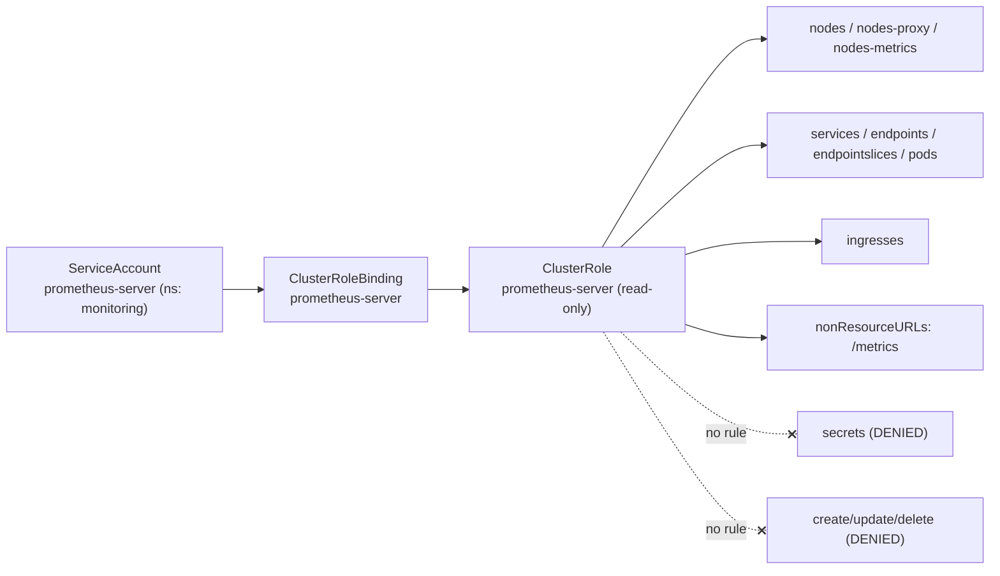
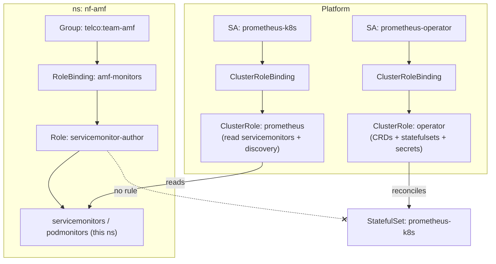
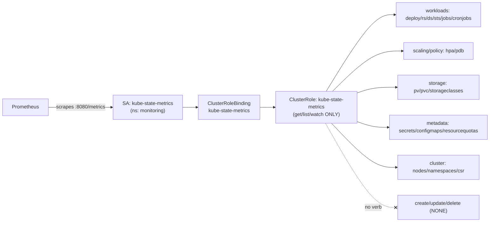
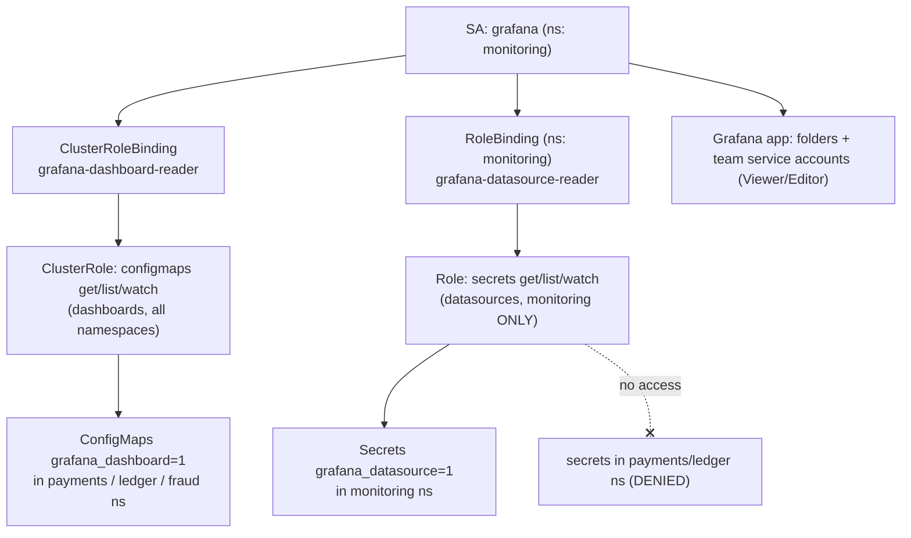
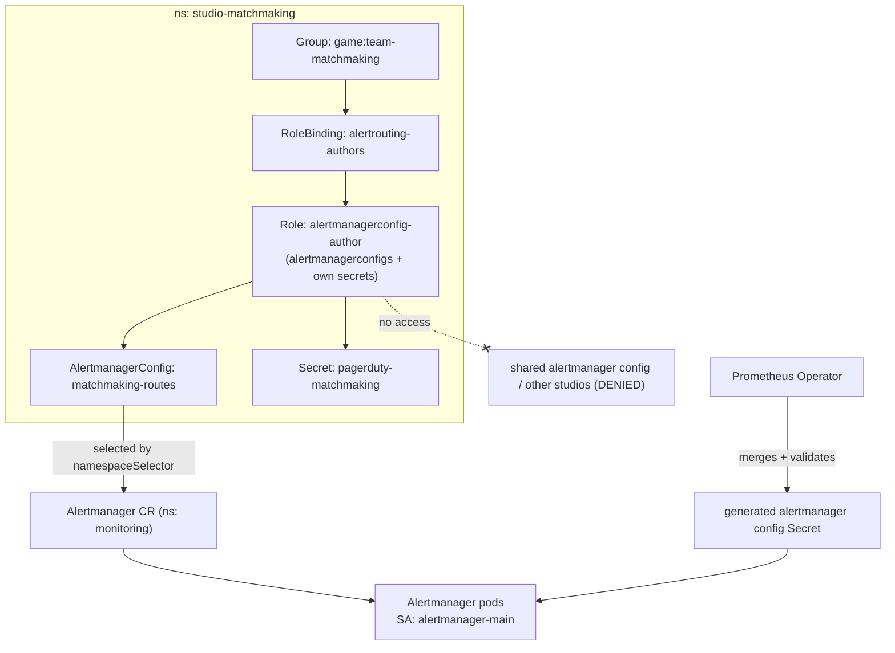

# Monitoring — Prometheus & Grafana

Five production RBAC scenarios covering how enterprises grant the monitoring stack — Prometheus scrape identities, the Prometheus Operator and its CRDs, kube-state-metrics, Grafana dashboard/datasource loading, and Alertmanager routing — exactly the read access they need and nothing more, on Kubernetes v1.33+.

## Scenario 61 — Cluster-Wide Prometheus Scrape ClusterRole for a Multi-Tenant SaaS Platform

**Company / Industry:** SaaS / Multi-Tenant B2B Observability Platform

### Business Requirement
A B2B SaaS company runs a self-hosted Prometheus (not the Operator) inside a shared `monitoring` namespace that must discover and scrape targets across every tenant namespace in the cluster: node exporters on each node, cAdvisor metrics from the kubelet, and application `/metrics` endpoints exposed via Services, Endpoints, and annotated Pods. Because tenants come and go daily, the scrape identity must use Kubernetes service discovery (`kubernetes_sd_configs`) rather than static targets, which requires read visibility into cluster-scoped and cross-namespace objects. Platform engineering must prove to auditors that this powerful read identity can never mutate anything.

### Existing Problem
The team originally deployed Prometheus with the Helm chart's default and, during a rushed incident, bound its ServiceAccount to the built-in `view` ClusterRole "to make discovery work." `view` grants read on Secrets across the whole cluster, so a single scrape identity could read every tenant's TLS keys and database passwords — a catastrophic finding in the SOC 2 audit. Worse, an engineer had also added `configmaps` write to debug relabeling, giving the monitoring SA mutate rights it never needed. The company needs a purpose-built, read-only, discovery-scoped ClusterRole with zero Secret access.

### Proposed RBAC Solution
Use a **ClusterRole** bound with a **ClusterRoleBinding** to a dedicated **ServiceAccount** (`prometheus-server`) in `monitoring`. A ClusterRole is mandatory because `nodes` are cluster-scoped and service discovery must list Services, Endpoints, and Pods in *all* namespaces — a namespaced Role could never see cross-tenant targets. The binding targets a single ServiceAccount, not a Group, because exactly one workload (the Prometheus StatefulSet) assumes this identity. The rules deliberately grant only `get`, `list`, `watch` on discovery objects plus the `nonResourceURLs` needed for `/metrics`, and **omit Secrets and ConfigMaps write entirely**, replacing the dangerous built-in `view` role.

### Kubernetes Resources
- Nodes, Nodes/metrics, Nodes/proxy (core)
- Services, Endpoints, Pods (core)
- EndpointSlices (discovery.k8s.io)
- Ingresses (networking.k8s.io)
- ConfigMaps (core) — read-only, for scrape-config file references
- Non-resource URL `/metrics` and `/metrics/cadvisor`

### Required Permissions
- `nodes`, `nodes/metrics`, `nodes/proxy` (core) → `get`, `list`, `watch` — discover nodes and reach the kubelet's cAdvisor/summary metrics.
- `services`, `endpoints`, `pods` (core) → `get`, `list`, `watch` — the three classic `kubernetes_sd_configs` roles for target discovery.
- `endpointslices` (discovery.k8s.io) → `get`, `list`, `watch` — modern replacement for `endpoints` at scale (v1.33 default discovery).
- `ingresses` (networking.k8s.io) → `get`, `list`, `watch` — for blackbox/ingress discovery.
- `configmaps` (core) → `get` only — read a referenced scrape ConfigMap; never write.
- `nonResourceURLs: ["/metrics", "/metrics/cadvisor"]` → `get` — the API server federation/metrics endpoints.
- **No Secrets, no create/update/patch/delete anywhere.**

### Architecture Diagram


### YAML Implementation
```yaml
apiVersion: v1
kind: Namespace
metadata:
  name: monitoring
  labels:
    app.kubernetes.io/part-of: observability-platform
    pod-security.kubernetes.io/enforce: restricted
---
apiVersion: v1
kind: ServiceAccount
metadata:
  name: prometheus-server
  namespace: monitoring
  labels:
    app.kubernetes.io/name: prometheus
    app.kubernetes.io/component: server
automountServiceAccountToken: true
---
apiVersion: rbac.authorization.k8s.io/v1
kind: ClusterRole
metadata:
  name: prometheus-server
  labels:
    app.kubernetes.io/name: prometheus
rules:
  - apiGroups: [""]
    resources:
      - nodes
      - nodes/metrics
      - nodes/proxy
      - services
      - endpoints
      - pods
    verbs: ["get", "list", "watch"]
  - apiGroups: ["discovery.k8s.io"]
    resources:
      - endpointslices
    verbs: ["get", "list", "watch"]
  - apiGroups: ["networking.k8s.io"]
    resources:
      - ingresses
    verbs: ["get", "list", "watch"]
  - apiGroups: [""]
    resources:
      - configmaps
    verbs: ["get"]
  - nonResourceURLs: ["/metrics", "/metrics/cadvisor"]
    verbs: ["get"]
---
apiVersion: rbac.authorization.k8s.io/v1
kind: ClusterRoleBinding
metadata:
  name: prometheus-server
  labels:
    app.kubernetes.io/name: prometheus
roleRef:
  apiGroup: rbac.authorization.k8s.io
  kind: ClusterRole
  name: prometheus-server
subjects:
  - kind: ServiceAccount
    name: prometheus-server
    namespace: monitoring
```

### Commands
```bash
# Create the namespace, SA, ClusterRole and binding
kubectl apply -f prometheus-scrape-rbac.yaml

# Confirm the ServiceAccount exists and its token is projected into the pod
kubectl -n monitoring get serviceaccount prometheus-server -o yaml

# Point the Prometheus Deployment/StatefulSet at this SA (if editing live)
kubectl -n monitoring patch statefulset prometheus-server \
  --type merge -p '{"spec":{"template":{"spec":{"serviceAccountName":"prometheus-server"}}}}'
```

### Verification
```bash
# ALLOW: discovery reads the SA must succeed at
kubectl auth can-i list nodes \
  --as=system:serviceaccount:monitoring:prometheus-server                 # yes
kubectl auth can-i watch endpointslices \
  --as=system:serviceaccount:monitoring:prometheus-server                 # yes
kubectl auth can-i get nodes/proxy \
  --as=system:serviceaccount:monitoring:prometheus-server                 # yes

# DENY: the whole point of replacing the 'view' role
kubectl auth can-i get secrets --all-namespaces \
  --as=system:serviceaccount:monitoring:prometheus-server                 # no
kubectl auth can-i create configmaps -n monitoring \
  --as=system:serviceaccount:monitoring:prometheus-server                 # no
kubectl auth can-i delete pods -n tenant-acme \
  --as=system:serviceaccount:monitoring:prometheus-server                 # no

# Full effective permission dump for the SA
kubectl auth can-i --list \
  --as=system:serviceaccount:monitoring:prometheus-server

# Prove discovery actually works from inside the pod
kubectl -n monitoring exec deploy/prometheus-server -c prometheus -- \
  wget -qO- http://localhost:9090/api/v1/targets | head
```

### Expected Output
```text
# ALLOW cases
$ kubectl auth can-i list nodes --as=system:serviceaccount:monitoring:prometheus-server
yes
$ kubectl auth can-i get nodes/proxy --as=system:serviceaccount:monitoring:prometheus-server
yes

# DENY cases
$ kubectl auth can-i get secrets --all-namespaces --as=system:serviceaccount:monitoring:prometheus-server
no

# What happens if Prometheus is misconfigured to hit the Secrets API directly:
Error from server (Forbidden): secrets is forbidden: User
"system:serviceaccount:monitoring:prometheus-server" cannot list resource
"secrets" in API group "" at the cluster scope
```

### Common Mistakes
- Binding to the built-in `view` or `cluster-admin` ClusterRole "to make it work" — leaks Secrets cluster-wide.
- Forgetting `nodes/proxy` and `nodes/metrics`, so cAdvisor/kubelet scrapes fail with 403 while node discovery still succeeds — confusing partial breakage.
- Using a `RoleBinding` instead of a `ClusterRoleBinding`, so the SA can only see targets in `monitoring` and every other namespace shows zero targets.
- Omitting the `nonResourceURLs` rule and wondering why API-server self-scrape federation returns Forbidden.
- Still listing `endpoints` only, without `endpointslices`, on large 1.33 clusters that have moved to EndpointSlice-based discovery.

### Troubleshooting
- Run `kubectl auth can-i --list --as=system:serviceaccount:monitoring:prometheus-server` to see the exact effective verbs.
- If targets show `403` in the Prometheus UI, the failure is almost always `nodes/proxy` or an app namespace's NetworkPolicy, not RBAC on Services.
- `kubectl describe clusterrolebinding prometheus-server` — confirm `roleRef` points at the right ClusterRole and the subject `namespace` matches exactly (a common typo is defaulting to `default`).
- Check the apiGroup: `endpointslices` live in `discovery.k8s.io`, not `""`; a wrong group silently grants nothing.
- Verify the pod actually uses the SA: `kubectl -n monitoring get pod <p> -o jsonpath='{.spec.serviceAccountName}'`.

### Best Practice
Mature SaaS platforms treat the scrape identity as a distinct, minimal, read-only ClusterRole that is version-controlled and never edited in place. They disable `automountServiceAccountToken` on every other SA in `monitoring` so only Prometheus carries a token, gate the manifest behind OPA/Gatekeeper or Kyverno policies that forbid any monitoring SA from binding to `view`/`edit`/`cluster-admin`, and periodically diff the live ClusterRole against Git with a drift detector.

### Security Notes
The core risk is over-broad read: a scrape identity with Secret access becomes a cluster-wide credential exfiltration path. This design enforces least privilege by enumerating only discovery resources and metrics endpoints, keeping blast radius to *metadata* rather than *secrets*. Because there are no mutate verbs, a compromised Prometheus cannot pivot to writing objects or escalating. The `escalate`/`bind` verbs are absent, so the SA cannot craft a more powerful role for itself.

### Interview Questions
1. Why does Prometheus service discovery require a ClusterRole rather than a namespaced Role, even though Prometheus itself lives in one namespace?
2. What exactly breaks if you grant `nodes` but omit `nodes/proxy` and `nodes/metrics`?
3. Why is binding a scrape SA to the built-in `view` ClusterRole a security problem, and what does it grant that a custom scrape role does not?
4. What is the difference between the `endpoints` and `endpointslices` resources for discovery, and why does it matter on v1.33?
5. When would you need a `nonResourceURLs` rule in a Prometheus ClusterRole?

### Interview Answers
1. Node objects are cluster-scoped and have no namespace, and `kubernetes_sd_configs` for the `endpoints`/`service`/`pod` roles must enumerate targets across *all* namespaces. A namespaced Role can only authorize resources within its own namespace and cannot reference cluster-scoped `nodes` at all, so discovery would return only the monitoring namespace's targets and fail entirely on nodes.
2. Node object discovery (the `node` SD role) still works because it only reads the Node API objects, but scraping the kubelet's cAdvisor and `/metrics/resource` endpoints goes through the API server proxy subresource. Without `nodes/proxy` those scrapes return `403 Forbidden` while node-level "up" appears healthy — a subtle partial outage where container CPU/memory metrics silently disappear.
3. `view` is an aggregated built-in that grants read on almost everything read-only, including Secrets in every namespace it applies to. A scrape identity never needs Secrets, so `view` massively over-grants and turns a monitoring compromise into a cluster-wide secret leak. A custom scrape role enumerates only discovery resources and metrics URLs, so the worst-case read is target metadata.
4. `endpoints` is the legacy single-object-per-Service model; `endpointslices` shards endpoints across multiple objects to scale to thousands of backends and is the default backing store for discovery in modern clusters. On v1.33 many components read EndpointSlices directly, so granting only `endpoints` can miss targets or add API pressure; you grant `endpointslices` in `discovery.k8s.io` for correct, scalable discovery.
5. `nonResourceURLs` authorizes HTTP paths that are not Kubernetes API objects, such as `/metrics`, `/healthz`, or `/metrics/cadvisor` on the API server itself. When Prometheus federates or scrapes the API server's own metrics endpoint, RBAC checks the URL path rather than a resource/verb pair, so you must grant `get` on those explicit paths.

### Follow-up Questions
1. How would you further restrict scraping so tenants can only expose metrics they opt into, without changing this ClusterRole?
2. How do you rotate or revoke the Prometheus SA token, and what changed about token behavior since bound service-account tokens became the default?
3. If two Prometheus replicas run for HA, do they need separate identities, and what are the RBAC implications of sharding via Thanos/receive?
4. How would you audit, cluster-wide, every ServiceAccount that currently has read access to Secrets, to find the next "view-bound" mistake?

### Production Tips
Amazon EKS deployments attach this SA to an IAM role via **IRSA** so Prometheus can also write to Amazon Managed Prometheus (remote_write) without static keys, while the in-cluster ClusterRole stays read-only. Google's **gke-security-groups** and Workload Identity are used so the scrape SA maps to a GCP identity with no Secret access. Netflix and Uber run per-cell/per-shard Prometheus fleets where each shard's SA gets the identical minimal ClusterRole, and drift from that canonical role is flagged by policy-as-code (OPA/Gatekeeper) in admission.

## Scenario 62 — Prometheus Operator and ServiceMonitor CRD RBAC for a Telecom NOC

**Company / Industry:** Telecom / 5G Core Network Operations

### Business Requirement
A telecom operator runs its 5G control-plane and OSS/BSS workloads on Kubernetes and manages observability with the **Prometheus Operator**. Network function teams (AMF, SMF, UPF, billing) must be able to declare *what* gets scraped by creating `ServiceMonitor` and `PodMonitor` custom resources in their own namespaces, without ever touching the Prometheus StatefulSet, Alertmanager, or the operator itself. The Operator's controller needs cluster-wide rights to reconcile those CRDs into scrape config, and the resulting Prometheus instance needs its own read identity — two separate RBAC layers that must not be conflated.

### Existing Problem
The NOC initially gave every network-function team `edit` in the `monitoring` namespace so they could "add ServiceMonitors." That let a billing engineer accidentally scale the shared Prometheus StatefulSet to zero during a change window, blacking out all network monitoring for 40 minutes during a regional incident — a reportable event under the operator's SLA. The teams also could read the Alertmanager Secret containing PagerDuty and SMPP gateway credentials. Monitoring config authorship and monitoring platform administration were fused into one over-powered role.

### Proposed RBAC Solution
Split into three identities. (1) The **Operator's ServiceAccount** gets a **ClusterRole** to manage `monitoring.coreos.com` CRDs and the StatefulSets/Services/Secrets it generates. (2) The **Prometheus instance's ServiceAccount** gets a **ClusterRole** to *read* `ServiceMonitor`/`PodMonitor`/`PrometheusRule` and do target discovery — it authors nothing. (3) Each network-function team gets a namespaced **Role** + **RoleBinding** to a **Group** (from the corporate IdP) allowing full lifecycle of `servicemonitors`/`podmonitors` **in their own namespace only**. A namespaced Role for teams is correct because a ServiceMonitor is namespaced and should only describe that team's own Services; the operator's cluster-wide power is isolated to a workload SA no human uses.

### Kubernetes Resources
- CRDs: `prometheuses`, `alertmanagers`, `servicemonitors`, `podmonitors`, `probes`, `prometheusrules`, `thanosrulers`, `scrapeconfigs` (monitoring.coreos.com)
- StatefulSets (apps) — operator-managed
- Services, Endpoints, Secrets, ConfigMaps, Pods (core)
- ServiceMonitors / PodMonitors owned by network-function teams

### Required Permissions
- Operator SA → `monitoring.coreos.com` CRDs: `get`, `list`, `watch`, `create`, `update`, `patch`, `delete` — full reconcile.
- Operator SA → `statefulsets` (apps): `get`, `list`, `watch`, `create`, `update`, `patch`, `delete` — it owns the Prometheus/Alertmanager StatefulSets.
- Operator SA → `services`, `endpoints`, `secrets`, `configmaps` (core): `get`, `list`, `watch`, `create`, `update`, `delete` — governing objects it generates (e.g., the scrape-config Secret).
- Prometheus instance SA → `servicemonitors`, `podmonitors`, `probes`, `prometheusrules`, `scrapeconfigs`: `get`, `list`, `watch` — read-only; plus core discovery `get/list/watch` as in Scenario 61.
- Network-function Group → `servicemonitors`, `podmonitors` (monitoring.coreos.com): `get`, `list`, `watch`, `create`, `update`, `patch`, `delete` — but **namespaced only**, no StatefulSets, no Secrets.

### Architecture Diagram


### YAML Implementation
```yaml
apiVersion: v1
kind: Namespace
metadata:
  name: monitoring
  labels: { app.kubernetes.io/part-of: telco-observability }
---
apiVersion: v1
kind: Namespace
metadata:
  name: nf-amf
  labels: { network-function: amf, app.kubernetes.io/part-of: 5g-core }
---
apiVersion: v1
kind: ServiceAccount
metadata: { name: prometheus-operator, namespace: monitoring }
---
apiVersion: v1
kind: ServiceAccount
metadata: { name: prometheus-k8s, namespace: monitoring }
---
# (1) Operator controller ClusterRole
apiVersion: rbac.authorization.k8s.io/v1
kind: ClusterRole
metadata:
  name: prometheus-operator
rules:
  - apiGroups: ["monitoring.coreos.com"]
    resources:
      - prometheuses
      - prometheuses/status
      - alertmanagers
      - alertmanagers/status
      - thanosrulers
      - servicemonitors
      - podmonitors
      - probes
      - prometheusrules
      - scrapeconfigs
      - alertmanagerconfigs
    verbs: ["get", "list", "watch", "create", "update", "patch", "delete"]
  - apiGroups: ["apps"]
    resources: ["statefulsets"]
    verbs: ["get", "list", "watch", "create", "update", "patch", "delete"]
  - apiGroups: [""]
    resources: ["services", "endpoints", "configmaps"]
    verbs: ["get", "list", "watch", "create", "update", "delete"]
  - apiGroups: [""]
    resources: ["secrets"]
    verbs: ["get", "list", "watch", "create", "update", "delete"]
  - apiGroups: [""]
    resources: ["pods"]
    verbs: ["list", "delete"]      # to roll pods during config change
---
apiVersion: rbac.authorization.k8s.io/v1
kind: ClusterRoleBinding
metadata: { name: prometheus-operator }
roleRef:
  apiGroup: rbac.authorization.k8s.io
  kind: ClusterRole
  name: prometheus-operator
subjects:
  - kind: ServiceAccount
    name: prometheus-operator
    namespace: monitoring
---
# (2) Prometheus instance ClusterRole (read CRDs + discovery, author nothing)
apiVersion: rbac.authorization.k8s.io/v1
kind: ClusterRole
metadata:
  name: prometheus-k8s
rules:
  - apiGroups: ["monitoring.coreos.com"]
    resources: ["servicemonitors", "podmonitors", "probes", "prometheusrules", "scrapeconfigs"]
    verbs: ["get", "list", "watch"]
  - apiGroups: [""]
    resources: ["nodes", "nodes/metrics", "nodes/proxy", "services", "endpoints", "pods"]
    verbs: ["get", "list", "watch"]
  - apiGroups: ["discovery.k8s.io"]
    resources: ["endpointslices"]
    verbs: ["get", "list", "watch"]
  - nonResourceURLs: ["/metrics"]
    verbs: ["get"]
---
apiVersion: rbac.authorization.k8s.io/v1
kind: ClusterRoleBinding
metadata: { name: prometheus-k8s }
roleRef:
  apiGroup: rbac.authorization.k8s.io
  kind: ClusterRole
  name: prometheus-k8s
subjects:
  - kind: ServiceAccount
    name: prometheus-k8s
    namespace: monitoring
---
# (3) Namespaced authoring Role for the AMF network-function team
apiVersion: rbac.authorization.k8s.io/v1
kind: Role
metadata:
  name: servicemonitor-author
  namespace: nf-amf
rules:
  - apiGroups: ["monitoring.coreos.com"]
    resources: ["servicemonitors", "podmonitors"]
    verbs: ["get", "list", "watch", "create", "update", "patch", "delete"]
---
apiVersion: rbac.authorization.k8s.io/v1
kind: RoleBinding
metadata:
  name: amf-monitors
  namespace: nf-amf
roleRef:
  apiGroup: rbac.authorization.k8s.io
  kind: Role
  name: servicemonitor-author
subjects:
  - kind: Group
    name: telco:team-amf
    apiGroup: rbac.authorization.k8s.io
---
# Prometheus CR selecting ServiceMonitors from labeled tenant namespaces
apiVersion: monitoring.coreos.com/v1
kind: Prometheus
metadata:
  name: prometheus-k8s
  namespace: monitoring
spec:
  serviceAccountName: prometheus-k8s
  replicas: 2
  serviceMonitorNamespaceSelector:
    matchLabels: { app.kubernetes.io/part-of: 5g-core }
  serviceMonitorSelector: {}
  podMonitorNamespaceSelector:
    matchLabels: { app.kubernetes.io/part-of: 5g-core }
  podMonitorSelector: {}
  resources:
    requests: { memory: 4Gi, cpu: "1" }
```

### Commands
```bash
kubectl apply -f prometheus-operator-rbac.yaml     # both ClusterRoles + team Role
kubectl apply -f prometheus-cr.yaml                # the Prometheus custom resource

# The AMF team now creates its own ServiceMonitor (impersonation test)
kubectl apply -f amf-servicemonitor.yaml --as-group=telco:team-amf --as=amf-eng
```

### Verification
```bash
# ALLOW: AMF team can author ServiceMonitors in its own namespace
kubectl auth can-i create servicemonitors -n nf-amf \
  --as=amf-eng --as-group=telco:team-amf                                  # yes

# DENY: AMF team cannot scale/kill the shared Prometheus StatefulSet
kubectl auth can-i patch statefulsets -n monitoring \
  --as=amf-eng --as-group=telco:team-amf                                  # no
# DENY: AMF team cannot read the Alertmanager Secret
kubectl auth can-i get secrets -n monitoring \
  --as=amf-eng --as-group=telco:team-amf                                  # no
# DENY: AMF team cannot author ServiceMonitors in another NF's namespace
kubectl auth can-i create servicemonitors -n nf-smf \
  --as=amf-eng --as-group=telco:team-amf                                  # no

# The Prometheus instance can read but not write ServiceMonitors
kubectl auth can-i list servicemonitors --all-namespaces \
  --as=system:serviceaccount:monitoring:prometheus-k8s                    # yes
kubectl auth can-i create servicemonitors -n nf-amf \
  --as=system:serviceaccount:monitoring:prometheus-k8s                    # no
```

### Expected Output
```text
$ kubectl auth can-i create servicemonitors -n nf-amf --as=amf-eng --as-group=telco:team-amf
yes
$ kubectl auth can-i patch statefulsets -n monitoring --as=amf-eng --as-group=telco:team-amf
no

# If the AMF engineer tries to edit the shared Prometheus StatefulSet directly:
Error from server (Forbidden): statefulsets.apps "prometheus-k8s" is forbidden:
User "amf-eng" cannot patch resource "statefulsets" in API group "apps" in the
namespace "monitoring"
```

### Common Mistakes
- Granting teams `edit` in `monitoring` instead of a CRD-scoped Role — lets them scale the shared Prometheus to zero.
- Giving the Prometheus *instance* SA write on ServiceMonitors; it only needs read — the operator does the writing.
- Forgetting the `*/status` subresources on the operator ClusterRole, so the operator loops on status update `Forbidden`.
- Setting `serviceMonitorSelector` but not `serviceMonitorNamespaceSelector`, so tenant namespaces are never scanned regardless of RBAC.
- Using apiGroup `""` for `servicemonitors` instead of `monitoring.coreos.com` — the rule matches nothing.

### Troubleshooting
- Operator stuck? `kubectl -n monitoring logs deploy/prometheus-operator` and look for `cannot ... prometheusrules.monitoring.coreos.com` — a missing CRD verb.
- `kubectl auth can-i --list --as=system:serviceaccount:monitoring:prometheus-operator` to confirm the operator's effective CRD verbs.
- If a team's ServiceMonitor exists but isn't scraped, the problem is usually the Prometheus CR's namespace/label selectors, not RBAC — check `kubectl -n monitoring get prometheus prometheus-k8s -o yaml`.
- `kubectl describe rolebinding amf-monitors -n nf-amf` — verify the Group name matches the IdP claim exactly (`telco:team-amf`).

### Best Practice
Telecom NOCs deploy the Operator via GitOps (Argo CD/Flux) with the operator's ClusterRole locked and reviewed, while tenant authoring Roles are templated per network-function namespace and rendered from a single Kustomize base. They rely on `serviceMonitorNamespaceSelector` label gating plus RBAC as defense in depth: even if a team's RBAC were widened by mistake, the selector still governs what Prometheus ingests.

### Security Notes
The chief risk is fusing config authorship with platform administration. Separating the operator SA (cluster-wide, no humans), the instance SA (read-only), and the tenant Role (namespaced authoring) keeps blast radius small: a compromised team credential can create noisy ServiceMonitors at worst, never scale down monitoring or read Alertmanager Secrets. Note the operator legitimately holds Secret write — it is a high-value identity that must be a workload-only SA with `automountServiceAccountToken` scoped and audited.

### Interview Questions
1. Why are there three distinct RBAC identities in a Prometheus Operator deployment, and what does each own?
2. Does the Prometheus *instance* ServiceAccount need write access to ServiceMonitors? Why or why not?
3. What is the interplay between `serviceMonitorNamespaceSelector` and RBAC, and which one actually decides what gets scraped?
4. Why does the operator ClusterRole require `*/status` subresource verbs and Secret write?
5. How do you let application teams self-service their scrape config without giving them access to the shared Prometheus workload?

### Interview Answers
1. The operator SA reconciles CRDs into StatefulSets/Secrets and therefore needs cluster-wide CRD + workload write; the Prometheus instance SA only reads ServiceMonitors and discovery objects to build its scrape config at runtime; the tenant team Role grants namespaced authoring of ServiceMonitors so teams describe their own targets. Each maps to a different trust level, which is why they are never merged.
2. No. The operator watches ServiceMonitors and translates them into a scrape-config Secret; the Prometheus process only needs to *read* ServiceMonitors (and discovery objects) to know what to scrape. Granting it write would let a compromised Prometheus fabricate scrape targets, expanding blast radius for zero functional benefit.
3. RBAC decides who may *create/edit* a ServiceMonitor object; the namespace and label selectors on the Prometheus CR decide which existing ServiceMonitors that Prometheus actually *ingests*. They are complementary — RBAC is the authoring gate, the selector is the consumption gate — and the selector is the final authority on what is scraped even if RBAC is loose.
4. Controllers write back reconciliation state to the `/status` subresource, which is a separately authorized resource; without `prometheuses/status` etc. the operator loops on Forbidden status updates. It needs Secret write because it generates the scrape-config and web-config Secrets that the Prometheus/Alertmanager pods mount — that is core to how the operator drives configuration.
5. Give teams a namespaced Role over `servicemonitors`/`podmonitors` in their own namespace and bind it to their IdP group, then label their namespaces so the Prometheus CR's `serviceMonitorNamespaceSelector` picks them up. They never receive any verb on StatefulSets, Secrets, or the `monitoring` namespace, so authoring and platform admin stay fully separated.

### Follow-up Questions
1. How would you prevent a team from creating a ServiceMonitor that scrapes another team's Service across namespaces?
2. How does `AlertmanagerConfig` self-service differ from `ServiceMonitor` self-service in terms of the RBAC and CRD model?
3. If you sharded Prometheus across multiple instances by namespace, how would the instance SAs and selectors change?
4. How would you enforce, at admission time, that every ServiceMonitor carries a mandatory `team` label for cost attribution?

### Production Tips
Telecoms and large platforms such as Cisco and VMware Tanzu ship the Prometheus Operator with the operator ClusterRole hardened and delivered via GitOps, while exposing only namespaced ServiceMonitor Roles to app teams. Red Hat OpenShift's cluster-monitoring operator uses exactly this split — a cluster-scoped operator identity plus user-workload monitoring where project teams create ServiceMonitors in their own projects, gated by project (namespace) RBAC and namespace selectors.

## Scenario 63 — kube-state-metrics Read-Only RBAC for an E-Commerce Platform

**Company / Industry:** E-Commerce / Online Marketplace

### Business Requirement
A large online marketplace runs `kube-state-metrics` (KSM) to expose the *state* of Kubernetes objects — Deployment replica mismatches, Pod restart counts, PVC capacity, HPA saturation, Job failures — which powers capacity dashboards and the on-call runbooks during peak-sale events. KSM must be able to `list` and `watch` a very wide set of object types across the entire cluster, but it must be strictly read-only: it never mutates anything, and it must not read the *contents* of Secrets, only their metadata for the `kube_secret_*` series.

### Existing Problem
During a Black-Friday readiness review, a security scan flagged that the marketplace's KSM ServiceAccount was bound to `cluster-admin` — a copy-paste from an old Helm values file — meaning a metrics component could delete Deployments cluster-wide. Separately, an earlier attempt to tighten it broke half the dashboards because the engineer removed `watch` on `horizontalpodautoscalers` and `jobs`, so autoscaling and batch-failure panels went blank right before a sale. The platform team needs the canonical, complete, read-only KSM ClusterRole with the exact resource set and no write verbs.

### Proposed RBAC Solution
A single purpose-built **ClusterRole** granting **only** `get`, `list`, `watch` across the full catalog of resources KSM reflects, bound via a **ClusterRoleBinding** to the **ServiceAccount** `kube-state-metrics` in `monitoring`. ClusterRole is required because KSM observes objects in every namespace and cluster-scoped objects (Nodes, PersistentVolumes, StorageClasses, ClusterRoles themselves). Crucially, the rule for `secrets` grants only `list`/`watch` for metadata series — KSM never needs `get` on individual Secret contents, and no write verb appears anywhere, replacing the `cluster-admin` binding entirely.

### Kubernetes Resources
- core: Pods, Services, Endpoints, Nodes, Namespaces, ConfigMaps, Secrets (metadata), ResourceQuotas, LimitRanges, PersistentVolumes, PersistentVolumeClaims, ReplicationControllers
- apps: Deployments, DaemonSets, ReplicaSets, StatefulSets
- batch: Jobs, CronJobs
- autoscaling: HorizontalPodAutoscalers
- policy: PodDisruptionBudgets
- networking.k8s.io: Ingresses, NetworkPolicies
- storage.k8s.io: StorageClasses, VolumeAttachments
- certificates.k8s.io: CertificateSigningRequests
- admissionregistration.k8s.io: Validating/MutatingWebhookConfigurations

### Required Permissions
- All listed resources → `get`, `list`, `watch` only. `list`/`watch` drive the informer cache; `get` is included for completeness where KSM performs point reads.
- `secrets` (core) → `list`, `watch` only — for `kube_secret_info`/`kube_secret_type` metadata; **never `get` on contents.**
- `certificatesigningrequests`, `storageclasses`, `volumeattachments`, `nodes`, `persistentvolumes` — cluster-scoped, hence a ClusterRole.
- **No `create`, `update`, `patch`, `delete`, `deletecollection`, `impersonate`, `bind`, or `escalate` anywhere.**

### Architecture Diagram


### YAML Implementation
```yaml
apiVersion: v1
kind: ServiceAccount
metadata:
  name: kube-state-metrics
  namespace: monitoring
  labels: { app.kubernetes.io/name: kube-state-metrics }
automountServiceAccountToken: true
---
apiVersion: rbac.authorization.k8s.io/v1
kind: ClusterRole
metadata:
  name: kube-state-metrics
  labels: { app.kubernetes.io/name: kube-state-metrics }
rules:
  - apiGroups: [""]
    resources:
      - configmaps
      - secrets
      - nodes
      - pods
      - services
      - serviceaccounts
      - resourcequotas
      - replicationcontrollers
      - limitranges
      - persistentvolumeclaims
      - persistentvolumes
      - namespaces
      - endpoints
    verbs: ["list", "watch"]
  - apiGroups: ["apps"]
    resources: ["statefulsets", "daemonsets", "deployments", "replicasets"]
    verbs: ["list", "watch"]
  - apiGroups: ["batch"]
    resources: ["cronjobs", "jobs"]
    verbs: ["list", "watch"]
  - apiGroups: ["autoscaling"]
    resources: ["horizontalpodautoscalers"]
    verbs: ["list", "watch"]
  - apiGroups: ["policy"]
    resources: ["poddisruptionbudgets"]
    verbs: ["list", "watch"]
  - apiGroups: ["networking.k8s.io"]
    resources: ["ingresses", "networkpolicies"]
    verbs: ["list", "watch"]
  - apiGroups: ["storage.k8s.io"]
    resources: ["storageclasses", "volumeattachments"]
    verbs: ["list", "watch"]
  - apiGroups: ["certificates.k8s.io"]
    resources: ["certificatesigningrequests"]
    verbs: ["list", "watch"]
  - apiGroups: ["admissionregistration.k8s.io"]
    resources: ["mutatingwebhookconfigurations", "validatingwebhookconfigurations"]
    verbs: ["list", "watch"]
  - apiGroups: ["coordination.k8s.io"]
    resources: ["leases"]
    verbs: ["list", "watch"]
  - apiGroups: ["rbac.authorization.k8s.io"]
    resources: ["clusterroles", "roles", "clusterrolebindings", "rolebindings"]
    verbs: ["list", "watch"]
---
apiVersion: rbac.authorization.k8s.io/v1
kind: ClusterRoleBinding
metadata:
  name: kube-state-metrics
  labels: { app.kubernetes.io/name: kube-state-metrics }
roleRef:
  apiGroup: rbac.authorization.k8s.io
  kind: ClusterRole
  name: kube-state-metrics
subjects:
  - kind: ServiceAccount
    name: kube-state-metrics
    namespace: monitoring
---
apiVersion: apps/v1
kind: Deployment
metadata:
  name: kube-state-metrics
  namespace: monitoring
  labels: { app.kubernetes.io/name: kube-state-metrics }
spec:
  replicas: 1
  selector:
    matchLabels: { app.kubernetes.io/name: kube-state-metrics }
  template:
    metadata:
      labels: { app.kubernetes.io/name: kube-state-metrics }
    spec:
      serviceAccountName: kube-state-metrics
      automountServiceAccountToken: true
      securityContext:
        runAsNonRoot: true
        runAsUser: 65534
        seccompProfile: { type: RuntimeDefault }
      containers:
        - name: kube-state-metrics
          image: registry.k8s.io/kube-state-metrics/kube-state-metrics:v2.13.0
          ports:
            - { name: http-metrics, containerPort: 8080 }
            - { name: telemetry, containerPort: 8081 }
          securityContext:
            allowPrivilegeEscalation: false
            readOnlyRootFilesystem: true
            capabilities: { drop: ["ALL"] }
          resources:
            requests: { cpu: 50m, memory: 128Mi }
            limits: { memory: 256Mi }
```

### Commands
```bash
kubectl apply -f kube-state-metrics-rbac.yaml    # SA + ClusterRole + binding + Deployment

# Confirm the pod is Running under the correct SA
kubectl -n monitoring get pod -l app.kubernetes.io/name=kube-state-metrics \
  -o jsonpath='{.items[0].spec.serviceAccountName}{"\n"}'
```

### Verification
```bash
# ALLOW: the wide read surface KSM depends on
kubectl auth can-i list deployments --all-namespaces \
  --as=system:serviceaccount:monitoring:kube-state-metrics                # yes
kubectl auth can-i watch horizontalpodautoscalers -A \
  --as=system:serviceaccount:monitoring:kube-state-metrics                # yes
kubectl auth can-i list persistentvolumes \
  --as=system:serviceaccount:monitoring:kube-state-metrics                # yes

# DENY: any write, and any Secret content read
kubectl auth can-i delete deployments -n checkout \
  --as=system:serviceaccount:monitoring:kube-state-metrics                # no
kubectl auth can-i get secrets -n checkout \
  --as=system:serviceaccount:monitoring:kube-state-metrics                # no  (only list/watch granted)
kubectl auth can-i create pods -n checkout \
  --as=system:serviceaccount:monitoring:kube-state-metrics                # no

# Prove metrics are actually produced
kubectl -n monitoring port-forward deploy/kube-state-metrics 8080:8080 &
curl -s localhost:8080/metrics | grep -c '^kube_'                          # large count
```

### Expected Output
```text
$ kubectl auth can-i list deployments --all-namespaces --as=system:serviceaccount:monitoring:kube-state-metrics
yes
$ kubectl auth can-i get secrets -n checkout --as=system:serviceaccount:monitoring:kube-state-metrics
no
$ kubectl auth can-i delete deployments -n checkout --as=system:serviceaccount:monitoring:kube-state-metrics
no

# In the KSM logs if a resource verb is missing (e.g., jobs removed):
E0714 listing resource "jobs.batch" failed: jobs.batch is forbidden: User
"system:serviceaccount:monitoring:kube-state-metrics" cannot list resource "jobs"
in API group "batch" at the cluster scope
```

### Common Mistakes
- Binding KSM to `cluster-admin` or `view` from an old Helm values file — `cluster-admin` allows deletes; `view` grants `get` on Secret contents.
- Granting `get` on `secrets` instead of only `list`/`watch`, unnecessarily exposing Secret contents.
- Dropping `horizontalpodautoscalers`, `jobs`, or `poddisruptionbudgets` while "tightening," silently blanking dashboards.
- Adding write verbs "just in case" — KSM never writes; any write verb is pure attack surface.
- Using a Role instead of a ClusterRole, so cluster-scoped `nodes`/`persistentvolumes`/`storageclasses` metrics never populate.

### Troubleshooting
- Blank panels? `kubectl -n monitoring logs deploy/kube-state-metrics` and grep for `is forbidden` — the log names the exact missing resource and apiGroup.
- `kubectl auth can-i --list --as=system:serviceaccount:monitoring:kube-state-metrics` shows the full effective read matrix.
- Confirm apiGroups: HPAs are in `autoscaling`, PDBs in `policy`, Ingresses/NetworkPolicies in `networking.k8s.io` — wrong group = silent no-op rule.
- If only namespaced series appear and cluster ones don't, you accidentally created a Role/RoleBinding rather than ClusterRole/ClusterRoleBinding.

### Best Practice
Enterprises pin KSM's ClusterRole to exactly the resources they enable via `--resources` flags and keep the two in sync, so the RBAC surface never exceeds the collected surface. They run KSM with a hardened Pod (non-root, read-only rootfs, all caps dropped) and enforce via admission policy that no monitoring SA may hold any write verb or `get secrets`. The ClusterRole is generated from the upstream manifest at the pinned image version to avoid version drift.

### Security Notes
KSM is a broad read identity, so the primary risks are (a) Secret content exposure and (b) accidental write power. This design mitigates both: `secrets` is `list`/`watch` only (metadata series, no payload), and no mutating verb exists, so a compromised KSM cannot delete or modify workloads — its blast radius is limited to disclosing object *state* metadata. Because it holds no `impersonate`/`bind`/`escalate`, it cannot pivot to a stronger identity.

### Interview Questions
1. Why must kube-state-metrics use a ClusterRole and not a namespaced Role?
2. Why grant `list`/`watch` but not `get` on `secrets` to KSM, and what would `get` additionally expose?
3. What is the failure symptom when a single required resource verb is missing from the KSM ClusterRole, and how do you diagnose it fast?
4. Why should KSM never have any write verb, and how does that limit blast radius if the pod is compromised?
5. How do you keep the KSM RBAC surface aligned with what it actually collects over time?

### Interview Answers
1. KSM reflects the state of objects in every namespace plus cluster-scoped objects like Nodes, PersistentVolumes, StorageClasses, and even ClusterRoles. A namespaced Role can only authorize resources within one namespace and cannot reference cluster-scoped resources, so cluster metrics would never populate and namespaced metrics would only cover one namespace — a ClusterRole is the only way to cover the full object graph.
2. KSM builds series like `kube_secret_info`, `kube_secret_type`, and creation timestamps from Secret *metadata*, which the `list`/`watch` informer provides without reading the `data` payload. Granting `get` would allow point reads of individual Secrets including their base64 contents, turning a metrics component into a potential secret-exfiltration path for no metric benefit.
3. The affected metric families simply stop appearing and their dashboards go blank, while the rest of KSM keeps working. The fastest diagnosis is the KSM pod log, which prints `<resource>.<group> is forbidden: ... cannot list resource ...` naming the exact resource and apiGroup, so you add precisely that rule. `kubectl auth can-i --list` for the SA confirms the fix.
4. KSM's entire job is reading object state; it never creates or mutates anything, so any write verb is pure unused attack surface. Without write verbs, a compromised KSM pod cannot delete Deployments, edit ConfigMaps, or scale workloads — its worst case is disclosing state metadata. This caps the blast radius to information disclosure rather than cluster tampering.
5. Tie the ClusterRole to the KSM `--resources` allowlist: only collect what you grant and only grant what you collect. Generate the ClusterRole from the upstream manifest at the pinned image tag through GitOps, and run a periodic job (or admission policy) that fails if a monitoring SA holds any write verb or `get secrets`, catching drift before it reaches production.

### Follow-up Questions
1. How would you shard KSM horizontally for a 10,000-node cluster, and does sharding change the RBAC?
2. How do you expose KSM metrics securely so only Prometheus can scrape them (RBAC vs. NetworkPolicy vs. TLS)?
3. What is the difference between the metrics KSM produces and the metrics the kubelet/cAdvisor produce, and why do they need different RBAC?
4. How would you add a Custom Resource State metric for a CRD, and what RBAC does that require?

### Production Tips
Flipkart, Swiggy, and other high-scale e-commerce platforms run sharded KSM behind a hardened, read-only ClusterRole generated from the pinned upstream manifest, with the `secrets` rule limited to `list`/`watch`. Amazon's EKS add-on and Google's GKE managed KSM ship the same least-privilege ClusterRole, and mature shops enforce with Kyverno/Gatekeeper that no observability ServiceAccount can ever be bound to `cluster-admin` or granted `get secrets`.

## Scenario 64 — Grafana ServiceAccount with Team Dashboard and Datasource Read Access for a FinTech

**Company / Industry:** FinTech / Digital Payments & Lending

### Business Requirement
A regulated payments company runs a central Grafana in the `monitoring` namespace, with dashboards owned by three product teams (payments, ledger, fraud). Each team stores its dashboards as Kubernetes ConfigMaps in its own namespace, labeled `grafana_dashboard: "1"`, and a Grafana sidecar auto-loads them. Datasource definitions (which carry Prometheus/Loki bearer tokens) live as Secrets in `monitoring` only. Grafana must be able to *read* dashboard ConfigMaps cluster-wide but read datasource Secrets only in `monitoring`, and it must never write or delete any Kubernetes object. Team-level read/edit separation happens inside Grafana via its service-account and folder model.

### Existing Problem
The prior setup ran the Grafana sidecar with a ClusterRole that granted `get` on Secrets in every namespace so it could "load datasources from anywhere." A pen test showed the Grafana pod's token could read the payments team's KMS-wrapping Secret and the ledger database password — a PCI-DSS and RBI compliance failure. Additionally, a bug had the sidecar with `patch configmaps` cluster-wide, meaning a dashboard-loader could rewrite arbitrary ConfigMaps. The company needs dashboard-read (ConfigMaps) decoupled from datasource-read (Secrets), with Secret access confined to one namespace and zero write anywhere.

### Proposed RBAC Solution
Two bindings for one **ServiceAccount** (`grafana`) in `monitoring`. (1) A **ClusterRole** + **ClusterRoleBinding** granting `get`, `list`, `watch` on **ConfigMaps only** cluster-wide, so the sidecar can discover team dashboards in any namespace — ConfigMaps here hold no secrets. (2) A namespaced **Role** + **RoleBinding** in `monitoring` granting `get`, `list`, `watch` on **Secrets** so the sidecar loads datasource credentials from the central namespace *only*. Splitting ConfigMaps (cluster-wide) from Secrets (namespace-confined) is the crux: it gives broad dashboard discovery without broad secret exposure. Inside Grafana, team isolation uses Grafana **service accounts** (Viewer/Editor roles) scoped to team **folders**, which is application-layer RBAC, not Kubernetes RBAC.

### Kubernetes Resources
- ConfigMaps (core) — dashboards, cluster-wide read
- Secrets (core) — datasource credentials, `monitoring` namespace read only
- The `grafana` ServiceAccount and its projected token
- (App layer) Grafana folders, teams, and Grafana service-account tokens

### Required Permissions
- `configmaps` (core) → `get`, `list`, `watch` — cluster-wide via ClusterRole, for the dashboard sidecar; **no write.**
- `secrets` (core) → `get`, `list`, `watch` — **namespaced to `monitoring` only** via Role, for the datasource sidecar.
- No `create`/`update`/`patch`/`delete` on anything; the sidecar only reads and provisions files onto Grafana's volume.
- Grafana app-layer: team service accounts get `Viewer` (read dashboards/query datasources) or `Editor`, folder-scoped — enforced by Grafana, not the API server.

### Architecture Diagram


### YAML Implementation
```yaml
apiVersion: v1
kind: ServiceAccount
metadata:
  name: grafana
  namespace: monitoring
  labels: { app.kubernetes.io/name: grafana }
---
# (1) Cluster-wide DASHBOARD (ConfigMap) read — no secrets here
apiVersion: rbac.authorization.k8s.io/v1
kind: ClusterRole
metadata:
  name: grafana-dashboard-reader
rules:
  - apiGroups: [""]
    resources: ["configmaps"]
    verbs: ["get", "list", "watch"]
---
apiVersion: rbac.authorization.k8s.io/v1
kind: ClusterRoleBinding
metadata:
  name: grafana-dashboard-reader
roleRef:
  apiGroup: rbac.authorization.k8s.io
  kind: ClusterRole
  name: grafana-dashboard-reader
subjects:
  - kind: ServiceAccount
    name: grafana
    namespace: monitoring
---
# (2) DATASOURCE (Secret) read — confined to the monitoring namespace ONLY
apiVersion: rbac.authorization.k8s.io/v1
kind: Role
metadata:
  name: grafana-datasource-reader
  namespace: monitoring
rules:
  - apiGroups: [""]
    resources: ["secrets"]
    verbs: ["get", "list", "watch"]
---
apiVersion: rbac.authorization.k8s.io/v1
kind: RoleBinding
metadata:
  name: grafana-datasource-reader
  namespace: monitoring
roleRef:
  apiGroup: rbac.authorization.k8s.io
  kind: Role
  name: grafana-datasource-reader
subjects:
  - kind: ServiceAccount
    name: grafana
    namespace: monitoring
---
# Example team dashboard ConfigMap (payments team, own namespace)
apiVersion: v1
kind: ConfigMap
metadata:
  name: payments-latency-dashboard
  namespace: payments
  labels:
    grafana_dashboard: "1"
    team: payments
data:
  payments-latency.json: |
    {"title":"Payments p99 Latency","schemaVersion":39,"panels":[]}
---
# Example datasource Secret (central monitoring namespace only)
apiVersion: v1
kind: Secret
metadata:
  name: prometheus-datasource
  namespace: monitoring
  labels:
    grafana_datasource: "1"
type: Opaque
stringData:
  prometheus.yaml: |
    apiVersion: 1
    datasources:
      - name: Prometheus
        type: prometheus
        access: proxy
        url: http://prometheus-k8s.monitoring.svc:9090
        isDefault: true
---
# Grafana with the two provisioning sidecars using the grafana SA
apiVersion: apps/v1
kind: Deployment
metadata:
  name: grafana
  namespace: monitoring
  labels: { app.kubernetes.io/name: grafana }
spec:
  replicas: 2
  selector:
    matchLabels: { app.kubernetes.io/name: grafana }
  template:
    metadata:
      labels: { app.kubernetes.io/name: grafana }
    spec:
      serviceAccountName: grafana
      securityContext: { runAsNonRoot: true, runAsUser: 472, fsGroup: 472 }
      containers:
        - name: grafana
          image: grafana/grafana:11.1.0
          ports: [{ name: http, containerPort: 3000 }]
          env:
            - { name: GF_AUTH_ANONYMOUS_ENABLED, value: "false" }
            - { name: GF_USERS_DEFAULT_THEME, value: "light" }
          volumeMounts:
            - { name: dashboards, mountPath: /etc/grafana/provisioning/dashboards }
            - { name: datasources, mountPath: /etc/grafana/provisioning/datasources }
        - name: sidecar-dashboards
          image: kiwigrid/k8s-sidecar:1.27.5
          env:
            - { name: LABEL, value: "grafana_dashboard" }
            - { name: FOLDER, value: "/etc/grafana/provisioning/dashboards" }
            - { name: RESOURCE, value: "configmap" }
            - { name: NAMESPACE, value: "ALL" }        # cluster-wide dashboard discovery
          volumeMounts:
            - { name: dashboards, mountPath: /etc/grafana/provisioning/dashboards }
        - name: sidecar-datasources
          image: kiwigrid/k8s-sidecar:1.27.5
          env:
            - { name: LABEL, value: "grafana_datasource" }
            - { name: FOLDER, value: "/etc/grafana/provisioning/datasources" }
            - { name: RESOURCE, value: "secret" }
            - { name: NAMESPACE, value: "monitoring" }  # datasources only from monitoring
          volumeMounts:
            - { name: datasources, mountPath: /etc/grafana/provisioning/datasources }
      volumes:
        - { name: dashboards, emptyDir: {} }
        - { name: datasources, emptyDir: {} }
```

### Commands
```bash
kubectl apply -f grafana-rbac.yaml            # SA + ClusterRole + Role + bindings
kubectl apply -f grafana-deploy.yaml          # Grafana + sidecars
kubectl apply -f payments-dashboard-cm.yaml   # a team dashboard in its own namespace

# Create a Grafana app-layer service account for the payments team (Viewer, via API)
GRAFANA=http://localhost:3000
curl -s -u admin:$ADMIN_PW -X POST $GRAFANA/api/serviceaccounts \
  -H 'Content-Type: application/json' \
  -d '{"name":"payments-viewer","role":"Viewer"}'
```

### Verification
```bash
# ALLOW: dashboards readable cluster-wide
kubectl auth can-i list configmaps --all-namespaces \
  --as=system:serviceaccount:monitoring:grafana                           # yes
kubectl auth can-i get configmaps -n payments \
  --as=system:serviceaccount:monitoring:grafana                           # yes

# ALLOW: datasource secrets readable ONLY in monitoring
kubectl auth can-i get secrets -n monitoring \
  --as=system:serviceaccount:monitoring:grafana                           # yes

# DENY: datasource-style secret read in a team namespace
kubectl auth can-i get secrets -n payments \
  --as=system:serviceaccount:monitoring:grafana                           # no
kubectl auth can-i get secrets -n ledger \
  --as=system:serviceaccount:monitoring:grafana                           # no

# DENY: any write to dashboards/config
kubectl auth can-i patch configmaps -n payments \
  --as=system:serviceaccount:monitoring:grafana                           # no

# Confirm the sidecar actually loaded the dashboard
kubectl -n monitoring logs deploy/grafana -c sidecar-dashboards | grep payments-latency
```

### Expected Output
```text
$ kubectl auth can-i list configmaps --all-namespaces --as=system:serviceaccount:monitoring:grafana
yes
$ kubectl auth can-i get secrets -n monitoring --as=system:serviceaccount:monitoring:grafana
yes
$ kubectl auth can-i get secrets -n payments --as=system:serviceaccount:monitoring:grafana
no

# If the datasource sidecar were misconfigured to NAMESPACE=ALL and tried a team ns:
Error from server (Forbidden): secrets is forbidden: User
"system:serviceaccount:monitoring:grafana" cannot list resource "secrets" in API
group "" in the namespace "payments"
```

### Common Mistakes
- Granting the sidecar `get secrets` cluster-wide to "load datasources from anywhere" — exposes every namespace's Secrets.
- Combining dashboards and datasources into one ClusterRole over both ConfigMaps and Secrets, over-scoping the Secret read.
- Adding `patch`/`update` on ConfigMaps because someone thought the sidecar writes back — it only reads and provisions files.
- Confusing Grafana app-layer RBAC (folders/teams/service accounts) with Kubernetes RBAC — API-server RBAC cannot express "payments team sees only payments dashboards."
- Setting the datasource sidecar `NAMESPACE=ALL` while RBAC only allows `monitoring`, causing Forbidden spam in logs.

### Troubleshooting
- Dashboards not appearing? Check the sidecar log first (`-c sidecar-dashboards`) — a `Forbidden` means the ClusterRole/binding is missing; a silent skip means the `grafana_dashboard` label is absent.
- `kubectl auth can-i --list --as=system:serviceaccount:monitoring:grafana -n payments` to see what the SA can do in a team namespace.
- Datasource missing? Verify the Secret is in `monitoring`, labeled `grafana_datasource`, and that the datasource sidecar's `NAMESPACE` matches the Role's namespace.
- `kubectl describe rolebinding grafana-datasource-reader -n monitoring` — confirm subject SA and namespace.
- For "team sees other team's dashboards," fix Grafana folder permissions, not Kubernetes RBAC.

### Best Practice
Regulated FinTechs keep dashboard ConfigMaps freely discoverable (they contain no secrets) but confine datasource Secrets to the central namespace, and increasingly avoid Secrets entirely by having Grafana authenticate to Prometheus/Loki via short-lived tokens (IRSA/Workload Identity) rather than static bearer tokens in a Secret. Team isolation is done with Grafana teams + folder permissions and per-team Grafana service accounts, all provisioned as code, so Kubernetes RBAC stays coarse and the fine-grained authorization lives where it belongs.

### Security Notes
The central risk is that the dashboard loader is a broad reader; if it can read Secrets everywhere, it becomes a cross-namespace credential leak. This design isolates Secret read to a single namespace while allowing broad, low-sensitivity ConfigMap read, minimizing blast radius. No write verbs mean a compromised sidecar cannot tamper with dashboards or configs. Preferring token-federated datasource auth over Secret-stored bearer tokens removes the highest-value target from the cluster entirely.

### Interview Questions
1. Why split Grafana's Kubernetes RBAC into a cluster-wide ConfigMap read and a namespace-scoped Secret read?
2. What is the difference between Kubernetes RBAC and Grafana's own RBAC, and which one enforces "team A sees only team A dashboards"?
3. Why is granting the Grafana sidecar `get secrets` cluster-wide dangerous, and what compliance regimes does it violate?
4. How does the dashboard sidecar discover dashboards across namespaces, and what RBAC verb set does that require?
5. How would you eliminate static datasource credentials from the cluster altogether?

### Interview Answers
1. Dashboards are non-sensitive JSON in ConfigMaps that legitimately live in each team's namespace, so broad cluster-wide read is acceptable and convenient. Datasource definitions carry bearer tokens/passwords in Secrets and are centralized in `monitoring`, so their read must be confined to that one namespace. Splitting the two lets you grant wide dashboard discovery without ever granting wide Secret access.
2. Kubernetes RBAC authorizes API-server operations (which ConfigMaps/Secrets the Grafana pod's SA can read) and is namespace/resource/verb based. Grafana's RBAC governs application objects — dashboards, folders, datasources, teams — with Viewer/Editor/Admin roles. "Team A sees only team A dashboards" is a folder-permission concept enforced inside Grafana; the API server has no notion of a Grafana folder, so Kubernetes RBAC cannot express it.
3. It gives a metrics/UI component a token that can read every namespace's Secrets — database passwords, KMS-wrapping keys, TLS private keys — so a single compromised Grafana pod becomes a cluster-wide secret exfiltration path. For a payments company this breaks PCI-DSS scoping and, in India, RBI data-security expectations, because a non-privileged component gains privileged data access with a huge blast radius.
4. The kiwigrid k8s-sidecar runs an informer that lists and watches ConfigMaps carrying the `grafana_dashboard` label across all namespaces (`NAMESPACE=ALL`), then writes their contents as files into Grafana's provisioning folder. That requires `get`, `list`, `watch` on `configmaps` cluster-wide — and nothing more; no write verb, because it only reads objects and provisions local files.
5. Replace the datasource Secret's static bearer token with federated identity: on EKS attach the Grafana SA to an IAM role via IRSA so Grafana signs Amazon Managed Prometheus queries with SigV4; on GKE use Workload Identity; in-cluster, use short-lived projected SA tokens the datasource refreshes. The datasource definition then references the identity rather than storing a long-lived credential, so there is no high-value Secret to steal.

### Follow-up Questions
1. How would you provision Grafana teams, folders, and per-team service accounts as code so they are reproducible and auditable?
2. If dashboards must be editable by teams but read-only for others, how do you model that across Kubernetes RBAC and Grafana RBAC?
3. How do you rotate the Grafana admin credential and team service-account tokens without downtime?
4. How would you prevent a team from putting a Secret-bearing datasource ConfigMap in their own namespace to bypass the central control?

### Production Tips
Razorpay, PhonePe, and Paytm-scale FinTechs run centralized Grafana with dashboards-as-ConfigMaps auto-loaded cluster-wide, datasource Secrets confined to the monitoring namespace, and team isolation via Grafana folders + provisioned team service accounts. On AWS they use **IRSA** so Grafana queries Amazon Managed Prometheus via SigV4 with no stored token; Microsoft shops bind Grafana to **Azure AD groups** for team/folder mapping via SSO; Google deployments use **Workload Identity** plus `gke-security-groups` so Grafana teams mirror corporate groups.

## Scenario 65 — Alertmanager and Per-Team Alert-Routing ServiceAccount for a Gaming Platform

**Company / Industry:** Gaming / Online Multiplayer & Live-Ops

### Business Requirement
A multiplayer gaming company runs Alertmanager (managed by the Prometheus Operator) as the central alert router for dozens of game-studio teams (matchmaking, game-servers, payments, live-ops). Each studio must self-service its own alert routing — which receivers (PagerDuty, Slack, Opsgenie) fire for which alerts — without touching the shared Alertmanager configuration or seeing other studios' on-call secrets. Studios declare routing via namespaced `AlertmanagerConfig` custom resources, and each studio's receiver credentials (PagerDuty integration keys, Slack webhook URLs) live as Secrets in that studio's own namespace.

### Existing Problem
During a major game launch, a live-ops engineer edited the single shared Alertmanager config Secret to add a Slack route and made a YAML typo that crashed Alertmanager, silencing *all* alerts cluster-wide for 25 minutes at peak concurrency — a launch-day incident. Separately, all studios shared one `monitoring`-namespace Secret holding every team's PagerDuty key, so any studio engineer could read (and misuse) another studio's on-call integration. Routing authorship was centralized and fragile, and receiver secrets had no isolation.

### Proposed RBAC Solution
Adopt the Operator's `AlertmanagerConfig` model. The central **Alertmanager CR** selects `AlertmanagerConfig` objects from studio namespaces via a namespace selector; the Operator merges them into the running config, so a single studio's bad config is validated and namespaced rather than crashing the whole file. Each studio gets a namespaced **Role** + **RoleBinding** to its IdP **Group** allowing full lifecycle of `alertmanagerconfigs` **and** `get` on receiver **Secrets** in its own namespace only. The Alertmanager instance runs under a minimal **ServiceAccount**. A namespaced Role is correct because an `AlertmanagerConfig` and its receiver Secrets are per-studio and must not be visible cross-namespace; nobody edits the shared config directly anymore.

### Kubernetes Resources
- `alertmanagers`, `alertmanagerconfigs` (monitoring.coreos.com)
- Secrets (core) — per-studio receiver credentials (PagerDuty/Slack/Opsgenie)
- The Alertmanager instance ServiceAccount
- Studio IdP Groups mapped via RoleBindings

### Required Permissions
- Studio Group → `alertmanagerconfigs` (monitoring.coreos.com): `get`, `list`, `watch`, `create`, `update`, `patch`, `delete` — full self-service routing in its own namespace.
- Studio Group → `secrets` (core): `get`, `list`, `create`, `update`, `patch`, `delete` — manage its own receiver credentials, **namespaced only**.
- Alertmanager instance SA → minimal: no cluster-wide rights; it reads its generated config Secret mounted by the Operator (no direct API verbs needed beyond the default).
- Operator SA (from Scenario 62) → `alertmanagerconfigs` `get/list/watch` and Secret read to merge configs; not re-granted here.
- **Studios get no verb on the `alertmanagers` CR or the shared config, and no access to other namespaces.**

### Architecture Diagram


### YAML Implementation
```yaml
apiVersion: v1
kind: Namespace
metadata:
  name: studio-matchmaking
  labels:
    studio: matchmaking
    alertmanager-config: enabled
---
apiVersion: v1
kind: ServiceAccount
metadata:
  name: alertmanager-main
  namespace: monitoring
  labels: { app.kubernetes.io/name: alertmanager }
---
# Per-studio self-service Role: routing + own receiver secrets, namespaced only
apiVersion: rbac.authorization.k8s.io/v1
kind: Role
metadata:
  name: alertmanagerconfig-author
  namespace: studio-matchmaking
rules:
  - apiGroups: ["monitoring.coreos.com"]
    resources: ["alertmanagerconfigs"]
    verbs: ["get", "list", "watch", "create", "update", "patch", "delete"]
  - apiGroups: [""]
    resources: ["secrets"]
    verbs: ["get", "list", "create", "update", "patch", "delete"]
---
apiVersion: rbac.authorization.k8s.io/v1
kind: RoleBinding
metadata:
  name: alertrouting-authors
  namespace: studio-matchmaking
roleRef:
  apiGroup: rbac.authorization.k8s.io
  kind: Role
  name: alertmanagerconfig-author
subjects:
  - kind: Group
    name: game:team-matchmaking
    apiGroup: rbac.authorization.k8s.io
---
# Studio's own receiver credential Secret (lives in its namespace)
apiVersion: v1
kind: Secret
metadata:
  name: pagerduty-matchmaking
  namespace: studio-matchmaking
type: Opaque
stringData:
  routingKey: "R0UTINGKEYmatchmaking0nly"
---
# Studio-authored routing (namespaced AlertmanagerConfig)
apiVersion: monitoring.coreos.com/v1beta1
kind: AlertmanagerConfig
metadata:
  name: matchmaking-routes
  namespace: studio-matchmaking
  labels: { studio: matchmaking }
spec:
  route:
    receiver: matchmaking-pagerduty
    groupBy: ["alertname", "namespace"]
    groupWait: 30s
    groupInterval: 5m
    repeatInterval: 3h
    matchers:
      - name: studio
        value: matchmaking
  receivers:
    - name: matchmaking-pagerduty
      pagerdutyConfigs:
        - routingKey:
            name: pagerduty-matchmaking
            key: routingKey
          severity: critical
---
# Central Alertmanager CR selecting studio configs by namespace label
apiVersion: monitoring.coreos.com/v1
kind: Alertmanager
metadata:
  name: main
  namespace: monitoring
spec:
  serviceAccountName: alertmanager-main
  replicas: 3
  alertmanagerConfigSelector: {}
  alertmanagerConfigNamespaceSelector:
    matchLabels:
      alertmanager-config: enabled
  alertmanagerConfigMatcherStrategy:
    type: OnNamespace          # force each config's alerts to match its namespace
  resources:
    requests: { memory: 256Mi, cpu: 100m }
---
# NetworkPolicy: only Prometheus may reach Alertmanager's API
apiVersion: networking.k8s.io/v1
kind: NetworkPolicy
metadata:
  name: alertmanager-ingress
  namespace: monitoring
spec:
  podSelector:
    matchLabels: { app.kubernetes.io/name: alertmanager }
  policyTypes: ["Ingress"]
  ingress:
    - from:
        - podSelector:
            matchLabels: { app.kubernetes.io/name: prometheus }
      ports:
        - { protocol: TCP, port: 9093 }
```

### Commands
```bash
kubectl apply -f alertmanager-routing-rbac.yaml   # Role + RoleBinding + SA
kubectl apply -f alertmanager-cr.yaml             # central Alertmanager CR + NetworkPolicy

# Studio self-services its routing (impersonated as the studio group)
kubectl apply -f matchmaking-routes.yaml \
  --as=mm-oncall --as-group=game:team-matchmaking

# Confirm the operator merged it into the running config
kubectl -n monitoring get secret alertmanager-main-generated -o jsonpath='{.data}' | head -c 80
```

### Verification
```bash
# ALLOW: studio manages its own routing + its own receiver secrets
kubectl auth can-i create alertmanagerconfigs -n studio-matchmaking \
  --as=mm-oncall --as-group=game:team-matchmaking                          # yes
kubectl auth can-i get secrets -n studio-matchmaking \
  --as=mm-oncall --as-group=game:team-matchmaking                          # yes

# DENY: studio cannot touch the shared Alertmanager CR or its config
kubectl auth can-i patch alertmanagers -n monitoring \
  --as=mm-oncall --as-group=game:team-matchmaking                          # no
kubectl auth can-i get secrets -n monitoring \
  --as=mm-oncall --as-group=game:team-matchmaking                          # no

# DENY: studio cannot read another studio's on-call secret or routing
kubectl auth can-i get secrets -n studio-payments \
  --as=mm-oncall --as-group=game:team-matchmaking                          # no
kubectl auth can-i create alertmanagerconfigs -n studio-payments \
  --as=mm-oncall --as-group=game:team-matchmaking                          # no

# Verify routing loaded and Alertmanager is healthy
kubectl -n monitoring exec sts/alertmanager-main -c alertmanager -- \
  wget -qO- http://localhost:9093/api/v2/status | head
```

### Expected Output
```text
$ kubectl auth can-i create alertmanagerconfigs -n studio-matchmaking --as=mm-oncall --as-group=game:team-matchmaking
yes
$ kubectl auth can-i patch alertmanagers -n monitoring --as=mm-oncall --as-group=game:team-matchmaking
no
$ kubectl auth can-i get secrets -n studio-payments --as=mm-oncall --as-group=game:team-matchmaking
no

# If a matchmaking engineer tries to read the payments studio's PagerDuty secret:
Error from server (Forbidden): secrets "pagerduty-payments" is forbidden: User
"mm-oncall" cannot get resource "secrets" in API group "" in the namespace
"studio-payments"
```

### Common Mistakes
- Letting studios edit the single shared Alertmanager config Secret — one typo silences all alerts (the original incident).
- Storing every team's PagerDuty/Slack credential in one `monitoring` Secret, giving cross-studio access.
- Forgetting `alertmanagerConfigMatcherStrategy: OnNamespace`, so a studio's routes could match other studios' alerts.
- Missing the `alertmanagerConfigNamespaceSelector` label on studio namespaces, so their AlertmanagerConfigs are never merged despite correct RBAC.
- Granting studios verbs on the `alertmanagers` CR — they only need `alertmanagerconfigs`.

### Troubleshooting
- Routing not applied? Check the operator log for `AlertmanagerConfig ... rejected` (validation) and confirm the studio namespace carries the selector label.
- `kubectl auth can-i --list --as=mm-oncall --as-group=game:team-matchmaking -n studio-matchmaking` shows the studio's effective verbs.
- `kubectl -n monitoring get secret alertmanager-main-generated -o yaml` — confirm the merged config includes the studio's route.
- If a receiver never fires, verify the referenced Secret key exists in the *studio* namespace, not `monitoring`.
- Check `kubectl describe alertmanager main -n monitoring` for the selectors and matcher strategy.

### Best Practice
Gaming and live-ops platforms decentralize alert routing with `AlertmanagerConfig` so a bad studio config is validated and namespace-isolated instead of crashing a shared file, and they keep each studio's receiver secrets in that studio's namespace. They enforce `OnNamespace` matching so one studio's routes cannot capture another's alerts, and they run Alertmanager with 3+ replicas in HA gossip mode so config reloads and node failures never blank the alerting pipeline during a launch.

### Security Notes
The risks are a shared-config single point of failure and cross-team credential exposure. Namespaced `AlertmanagerConfig` removes the former — studios can only author validated, namespace-scoped routing and can never crash or read the shared config. Per-namespace receiver Secrets remove the latter — a matchmaking engineer physically cannot read the payments studio's PagerDuty key. The Alertmanager SA is minimal (no cluster rights), the NetworkPolicy limits who can reach port 9093, and no studio holds `impersonate`/`bind`/`escalate`, so lateral movement is blocked.

### Interview Questions
1. Why does the `AlertmanagerConfig` CRD model prevent the "one typo silences all alerts" failure that a shared config Secret has?
2. Where should per-team receiver secrets (PagerDuty keys, Slack webhooks) live, and what RBAC enforces isolation?
3. What is `alertmanagerConfigMatcherStrategy: OnNamespace` and why is it a security control, not just a routing detail?
4. Which RBAC verbs does a studio need on `alertmanagerconfigs`, and why does it get none on the `alertmanagers` CR?
5. What is the relationship between the namespace selector on the Alertmanager CR and the studio's RBAC?

### Interview Answers
1. With a single shared config Secret, everyone edits one document and a syntax error breaks the whole Alertmanager, silencing every alert. `AlertmanagerConfig` objects are per-namespace CRs that the Operator validates individually and merges into the generated config; an invalid or malformed studio config is rejected at admission/reconcile and simply not merged, so it cannot take down routing for other studios — the failure domain shrinks to that one studio.
2. Each team's receiver credentials belong in that team's own namespace as Secrets, referenced by the team's `AlertmanagerConfig` via a local Secret key reference. A namespaced Role granting `get`/`create`/`update` on `secrets` bound to the team's group enforces isolation: the API server denies any attempt to read another namespace's Secrets, so no studio can access another's on-call integration.
3. `OnNamespace` forces every alert matched by a studio's `AlertmanagerConfig` to also carry a matcher pinning it to that studio's namespace, so a studio's routes can only capture its own alerts. Without it (`None`), a studio could write a broad matcher that intercepts or suppresses another studio's alerts — an availability/integrity attack on someone else's paging — so the strategy is a genuine multi-tenant isolation control.
4. A studio needs `get`, `list`, `watch`, `create`, `update`, `patch`, `delete` on `alertmanagerconfigs` in its own namespace to fully self-service routing. It gets nothing on the `alertmanagers` CR because that object defines the shared Alertmanager instance (replicas, selectors, global config); allowing studios to touch it would reintroduce the shared single point of failure and let one team reconfigure everyone's alerting.
5. RBAC controls who may *author* an `AlertmanagerConfig` in a namespace; the Alertmanager CR's `alertmanagerConfigNamespaceSelector` controls which namespaces' configs are actually *merged* into the running Alertmanager. Both must align: a studio needs the Role to create the object and its namespace needs the selector label for it to take effect — RBAC is the authoring gate, the selector is the consumption gate.

### Follow-up Questions
1. How would you provide a break-glass path to edit the global Alertmanager config during an incident while keeping it audited?
2. How do you test a studio's routing change safely before it affects real paging (e.g., amtool, staging Alertmanager)?
3. How would you prevent a studio from configuring an inhibition rule that suppresses another studio's alerts?
4. How do you rotate a studio's PagerDuty routing key with zero missed alerts, and what RBAC/automation supports that?

### Production Tips
Gaming and consumer platforms like Zomato, Swiggy, and Uber decentralize alert routing with namespaced `AlertmanagerConfig` so each service team self-services paging while the shared Alertmanager stays untouchable, with per-team receiver Secrets isolated by namespace RBAC. Break-glass edits to the global config are gated behind an audited, time-boxed elevation (e.g., a reviewed PR or a JIT admin role) with full audit-log capture — the same break-glass-audit pattern Netflix and Amazon apply to any change that can affect the entire alerting pipeline.
