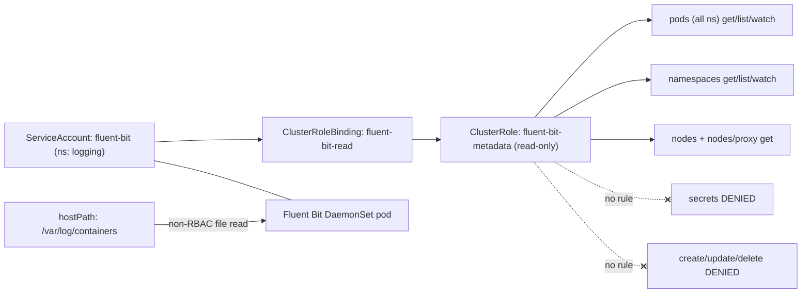
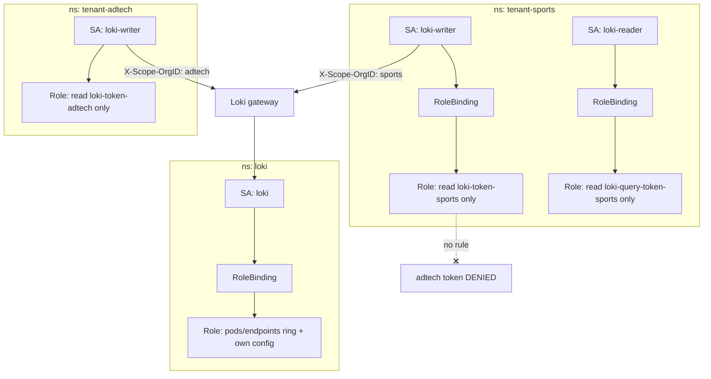
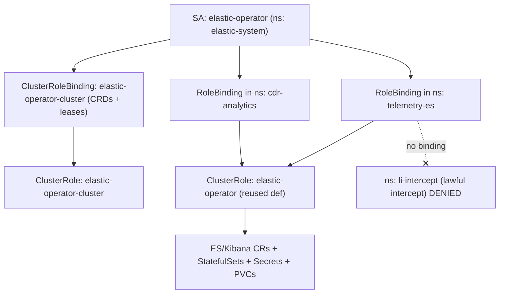
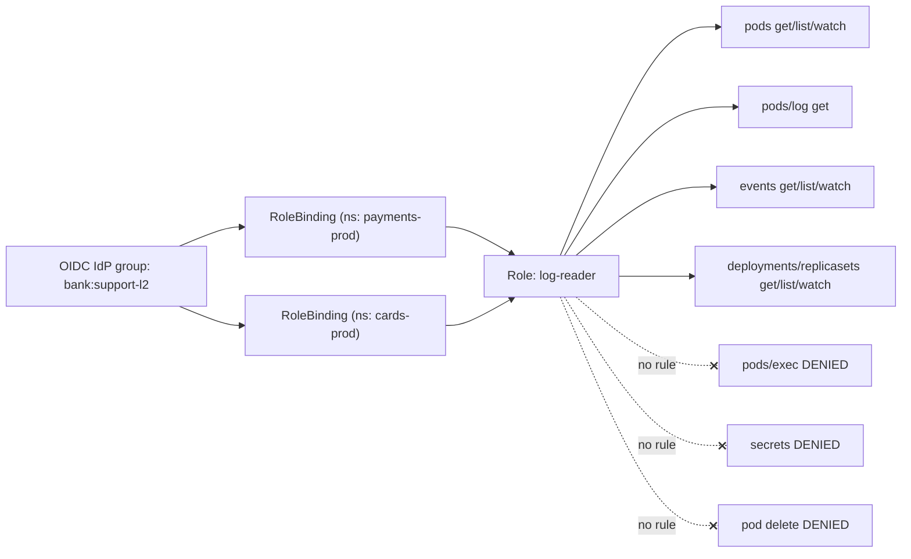
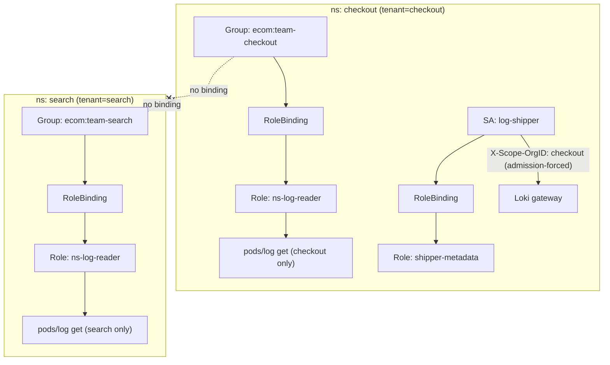

# Logging — Loki, Fluent Bit, Elasticsearch

Five production RBAC scenarios covering the identities behind an enterprise logging pipeline — the node-level collector DaemonSet that enriches logs from the Kubernetes API, multi-tenant Loki write/read credentials, the ECK operator that runs Elasticsearch, and the human read-access controls that decide who may see which namespace's logs — sized to least privilege on Kubernetes v1.33+.

## Scenario 66 — Fluent Bit DaemonSet Metadata-Enrichment ServiceAccount for a SaaS Platform

**Company / Industry:** SaaS / Multi-Tenant Application Platform

### Business Requirement
A SaaS company ships every container's stdout/stderr to a central Loki + object-store backend using a **Fluent Bit DaemonSet** on all worker nodes. Raw log lines from `/var/log/containers/*.log` are useless without context, so the `kubernetes` filter must enrich each record with pod name, namespace, labels, annotations, and the owning workload. That enrichment is an API-server (or kubelet) lookup, so the collector needs a read identity. To keep collector pressure off the API server on 400-node clusters, the team enables the filter's `Use_Kubelet On` mode, which reads pod metadata from each node's local kubelet instead — an additional permission surface.

### Existing Problem
The pipeline was bootstrapped with the Helm chart's default, which bound the Fluent Bit ServiceAccount to a hand-written ClusterRole that included `secrets` `get`/`list` "so the filter could resolve image-pull secrets." Because Fluent Bit runs on every node with a host-path mount of the entire container-log tree, that Secret read turned a log collector into a cluster-wide credential reader — every tenant's TLS keys were reachable by a compromised collector pod. Separately, when the SRE team switched on `Use_Kubelet On`, enrichment silently returned empty metadata (403 on the kubelet proxy), so alerts lost their `namespace` label during an incident.

### Proposed RBAC Solution
Use a purpose-built **ClusterRole** bound by a **ClusterRoleBinding** to a dedicated **ServiceAccount** (`fluent-bit`) in the `logging` namespace. A ClusterRole is mandatory: a DaemonSet pod on any node must enrich logs from *every* namespace, and `nodes`/`nodes/proxy` are cluster-scoped, so a namespaced Role cannot express this. The binding targets one ServiceAccount, not a Group, because exactly one workload assumes this identity. The rules grant only `get`, `list`, `watch` on `pods` and `namespaces` for enrichment, plus `get` on `nodes`/`nodes/proxy` for the kubelet path — and deliberately contain **no Secrets and no mutating verbs**. Note the actual log *files* are read through a `hostPath` volume, not RBAC; RBAC governs only the metadata lookups.

### Kubernetes Resources
- Pods (core) — the enrichment source
- Namespaces (core) — namespace metadata/labels
- Nodes, Nodes/proxy (core) — only when `Use_Kubelet On` reads metadata from the local kubelet
- (Out of RBAC scope) host `/var/log/containers` and `/var/log/pods` via `hostPath`

### Required Permissions
- `pods` (core) → `get`, `list`, `watch` — the `kubernetes` filter watches pods to build the metadata cache.
- `namespaces` (core) → `get`, `list`, `watch` — pull namespace labels/annotations for enrichment.
- `nodes` (core) → `get`, `list` — resolve the local node when kubelet mode is on.
- `nodes/proxy` (core) → `get` — the subresource that proxies to the kubelet's `/pods` endpoint under `Use_Kubelet On`.
- **No `secrets`, no `create/update/patch/delete` anywhere.**

### Architecture Diagram


### YAML Implementation
```yaml
apiVersion: v1
kind: Namespace
metadata:
  name: logging
  labels:
    app.kubernetes.io/part-of: observability-platform
    pod-security.kubernetes.io/enforce: privileged  # DaemonSet needs hostPath log mounts
---
apiVersion: v1
kind: ServiceAccount
metadata:
  name: fluent-bit
  namespace: logging
  labels:
    app.kubernetes.io/name: fluent-bit
    app.kubernetes.io/component: log-collector
automountServiceAccountToken: true
---
apiVersion: rbac.authorization.k8s.io/v1
kind: ClusterRole
metadata:
  name: fluent-bit-metadata
  labels:
    app.kubernetes.io/name: fluent-bit
rules:
  - apiGroups: [""]
    resources: ["pods", "namespaces"]
    verbs: ["get", "list", "watch"]
  - apiGroups: [""]
    resources: ["nodes"]
    verbs: ["get", "list"]
  - apiGroups: [""]
    resources: ["nodes/proxy"]
    verbs: ["get"]
---
apiVersion: rbac.authorization.k8s.io/v1
kind: ClusterRoleBinding
metadata:
  name: fluent-bit-read
  labels:
    app.kubernetes.io/name: fluent-bit
roleRef:
  apiGroup: rbac.authorization.k8s.io
  kind: ClusterRole
  name: fluent-bit-metadata
subjects:
  - kind: ServiceAccount
    name: fluent-bit
    namespace: logging
---
apiVersion: apps/v1
kind: DaemonSet
metadata:
  name: fluent-bit
  namespace: logging
  labels:
    app.kubernetes.io/name: fluent-bit
spec:
  selector:
    matchLabels:
      app.kubernetes.io/name: fluent-bit
  template:
    metadata:
      labels:
        app.kubernetes.io/name: fluent-bit
    spec:
      serviceAccountName: fluent-bit
      automountServiceAccountToken: true
      tolerations:
        - operator: Exists          # run on every node incl. control-plane/tainted
      containers:
        - name: fluent-bit
          image: cr.fluentbit.io/fluent/fluent-bit:3.1.9
          resources:
            requests: { cpu: 100m, memory: 128Mi }
            limits: { cpu: 500m, memory: 256Mi }
          securityContext:
            readOnlyRootFilesystem: true
            allowPrivilegeEscalation: false
            runAsNonRoot: false      # needs root to read host log files
          volumeMounts:
            - name: varlogcontainers
              mountPath: /var/log/containers
              readOnly: true
            - name: varlogpods
              mountPath: /var/log/pods
              readOnly: true
      volumes:
        - name: varlogcontainers
          hostPath: { path: /var/log/containers }
        - name: varlogpods
          hostPath: { path: /var/log/pods }
```

### Commands
```bash
# Apply namespace, SA, ClusterRole, binding and the DaemonSet
kubectl apply -f fluent-bit-rbac.yaml

# Confirm the DaemonSet pods actually assume the fluent-bit SA
kubectl -n logging get pods -l app.kubernetes.io/name=fluent-bit \
  -o jsonpath='{range .items[*]}{.metadata.name}{"\t"}{.spec.serviceAccountName}{"\n"}{end}'

# If wiring an existing DaemonSet, point it at the SA
kubectl -n logging patch daemonset fluent-bit \
  --type merge -p '{"spec":{"template":{"spec":{"serviceAccountName":"fluent-bit"}}}}'
```

### Verification
```bash
# ALLOW: metadata enrichment reads must work cluster-wide
kubectl auth can-i list pods --all-namespaces \
  --as=system:serviceaccount:logging:fluent-bit                     # yes
kubectl auth can-i watch namespaces \
  --as=system:serviceaccount:logging:fluent-bit                     # yes
kubectl auth can-i get nodes/proxy \
  --as=system:serviceaccount:logging:fluent-bit                     # yes

# DENY: the whole point — no Secrets, no mutation
kubectl auth can-i get secrets --all-namespaces \
  --as=system:serviceaccount:logging:fluent-bit                     # no
kubectl auth can-i delete pods -n tenant-acme \
  --as=system:serviceaccount:logging:fluent-bit                     # no

# Full effective permission dump
kubectl auth can-i --list --as=system:serviceaccount:logging:fluent-bit

# Prove enrichment works: metadata should carry kubernetes.namespace_name
kubectl -n logging logs ds/fluent-bit | grep -m1 kubernetes
```

### Expected Output
```text
# ALLOW cases
$ kubectl auth can-i list pods --all-namespaces --as=system:serviceaccount:logging:fluent-bit
yes
$ kubectl auth can-i get nodes/proxy --as=system:serviceaccount:logging:fluent-bit
yes

# DENY cases
$ kubectl auth can-i get secrets --all-namespaces --as=system:serviceaccount:logging:fluent-bit
no

# If Use_Kubelet On is set but nodes/proxy is missing, enrichment fails like this:
[error] [filter:kubernetes:kubernetes.0] kubelet upstream connection error
Error from server (Forbidden): nodes "ip-10-4-2-17.ec2.internal" is forbidden: User
"system:serviceaccount:logging:fluent-bit" cannot get resource "nodes/proxy" in API
group "" at the cluster scope
```

### Common Mistakes
- Adding `secrets` read "for image-pull secret resolution" — Fluent Bit enrichment never needs Secrets; this leaks credentials on every node.
- Enabling `Use_Kubelet On` without granting `nodes/proxy`, so enrichment silently degrades to empty metadata and logs lose their `namespace`/`pod` labels.
- Using a `RoleBinding` in `logging` only, so pods on nodes hosting other namespaces get no metadata.
- Assuming RBAC grants access to the log *files*; the files come from the `hostPath` mount and PodSecurity, not from the API.
- Forgetting `watch` on `pods`, forcing the filter into slow per-record `get` calls that hammer the API server.

### Troubleshooting
- `kubectl auth can-i --list --as=system:serviceaccount:logging:fluent-bit` shows the exact effective verbs.
- Empty `kubernetes.*` fields in records almost always mean the metadata lookup is being denied — check `nodes/proxy` (kubelet mode) or `pods` (API mode).
- `kubectl describe clusterrolebinding fluent-bit-read` — confirm `roleRef` and that the subject `namespace: logging` matches (a common typo defaults it to `default`).
- Verify the pod uses the SA: `kubectl -n logging get pod <p> -o jsonpath='{.spec.serviceAccountName}'`.
- If files can't be read but RBAC checks pass, the issue is PodSecurity/`hostPath`/`readOnlyRootFilesystem`, not RBAC.

### Best Practice
Mature SaaS platforms keep the collector identity read-only and cluster-scoped, disable `automountServiceAccountToken` on every other SA in `logging`, and gate the manifest behind Kyverno/OPA policies that forbid any logging SA from binding to `view`, `edit`, or `cluster-admin` or from listing Secrets. Metadata enrichment is served from the kubelet (`Use_Kubelet On`) at large node counts to avoid a thundering-herd of pod `watch`es against the API server, with the API-server path kept only as a fallback.

### Security Notes
The core risk is that a DaemonSet touches every node, so any excess grant multiplies across the fleet. Restricting to read-only pod/namespace/node metadata keeps the blast radius to non-sensitive labels; a compromised collector cannot read Secrets or mutate anything. The absence of `escalate`/`bind` means the SA cannot widen its own role. Because the log files are exposed only via read-only `hostPath` and never through the API, RBAC compromise alone cannot exfiltrate log content.

### Interview Questions
1. Why does the Fluent Bit `kubernetes` filter need any Kubernetes RBAC at all if it reads log files from the host?
2. What exactly does `nodes/proxy` authorize, and when is it required for Fluent Bit?
3. Why must this be a ClusterRole/ClusterRoleBinding rather than a namespaced Role?
4. Why is granting `secrets` read to a log collector a serious risk specifically for a DaemonSet?
5. What breaks, and how does it manifest, if you omit `watch` on `pods`?

### Interview Answers
1. The raw file gives you the message, timestamp, and container ID, but not Kubernetes context. The `kubernetes` filter calls the API server (or kubelet) to map the container to its pod, namespace, labels, and owner, and adds those as fields. That lookup is an authenticated API read, so it needs `get`/`list`/`watch` on `pods` (and `namespaces`) — the file read itself is unrelated to RBAC.
2. `nodes/proxy` is a subresource that lets the API server proxy a request to the kubelet on that node, including the kubelet's `/pods` endpoint. Fluent Bit's `Use_Kubelet On` mode uses it to fetch pod metadata from the local kubelet instead of the central API server, cutting API load on large clusters. Without the grant the proxy call returns 403 and enrichment fails.
3. A DaemonSet pod runs on every node and must enrich logs from pods in *all* namespaces, and `nodes`/`nodes/proxy` are cluster-scoped resources with no namespace. A namespaced Role can only authorize resources in its own namespace and cannot reference nodes at all, so enrichment would work only for the collector's own namespace and never for kubelet mode.
4. Because a DaemonSet runs an identical pod on every node, a single compromised collector with `secrets` read becomes a cluster-wide, node-wide credential harvester — the blast radius is the whole fleet, not one workload. Fluent Bit never needs Secrets for enrichment, so the grant is pure downside.
5. Without `watch`, the filter cannot maintain a live metadata cache and either falls back to a `get` per record (heavy API load, rate-limiting, dropped enrichment) or serves stale data. In practice you see API-server throttling, elevated latency, and records missing fresh labels after deployments.

### Follow-up Questions
1. How would you cap the collector's API load further while keeping enrichment correct — caching TTLs, kubelet mode, or informer resync tuning?
2. How do you prevent a tenant from spoofing another tenant's namespace label in shipped logs, given the collector trusts the API metadata?
3. If you must run Fluent Bit under PodSecurity `restricted`, how do you still read host log files, and what changes in the RBAC/volume design?
4. How would you audit, cluster-wide, every DaemonSet ServiceAccount that can read Secrets?

### Production Tips
On Amazon EKS the Fluent Bit SA is attached to an IAM role via **IRSA** so it can ship to CloudWatch/OpenSearch/S3 without static keys while the in-cluster ClusterRole stays read-only — this is exactly how AWS's own `aws-for-fluent-bit` chart is wired. Google's GKE Logging agent uses **Workload Identity** with an equivalently minimal read role. Netflix and Uber run node-agent log collectors fleet-wide with a single canonical read-only ClusterRole enforced by admission policy, and they prefer the kubelet metadata path to protect the API server at tens of thousands of nodes.

## Scenario 67 — Loki Multi-Tenant Write/Read ServiceAccounts for a Media Streaming Company

**Company / Industry:** Media / OTT Video Streaming

### Business Requirement
A media company runs a single shared **Grafana Loki** cluster (simple-scalable mode) for every brand and product line — VOD, live sports, ad-tech, and the mobile apps. Loki multi-tenancy is enforced by the `X-Scope-OrgID` header, so each brand pushes logs under its own tenant ID and can only query its own stream. Each brand's log shipper (Grafana Agent / Alloy) authenticates to the Loki gateway with a **tenant-specific bearer token** stored as a Kubernetes Secret, and Grafana queries back with a separate read token. The platform team must guarantee that one brand's namespace can never read another brand's push or query credential, and that the Loki backend itself has only the API access it needs to form its hash ring.

### Existing Problem
Originally all tenant tokens were dropped into one Secret in a shared `loki` namespace, and every brand's Grafana Agent mounted it. A misconfigured Alloy pipeline in the ad-tech namespace pushed logs under the sports tenant's `X-Scope-OrgID`, corrupting the sports brand's index and — worse — proving that ad-tech held the sports read token and could have queried premium content-delivery logs containing signed CDN URLs. Multi-tenancy at the Loki layer was real, but the *credentials* protecting it were shared, collapsing the isolation to zero.

### Proposed RBAC Solution
Give each tenant its own namespace and its own **ServiceAccount** for the write path (`loki-writer`) and, where a per-tenant Grafana lives, the read path (`loki-reader`). Bind each with a **namespaced Role** + **RoleBinding** whose Secret access is locked with **`resourceNames`** to exactly that tenant's push/query Secret — so `tenant-sports`'s shipper can `get` only `loki-token-sports`. The Loki backend components run under a separate **ServiceAccount** (`loki`) with a namespaced Role granting `get`/`list`/`watch` on `pods` and `endpoints` for memberlist ring discovery, plus `get` on its own config Secret. Namespaced Roles are correct because both the credentials and the shippers are namespace-local; no ClusterRole is needed, which keeps every tenant blind to every other tenant's objects.

### Kubernetes Resources
- Secrets (core) — per-tenant push token and query token, scoped by `resourceNames`
- Pods, Endpoints (core) — Loki memberlist/ring discovery
- ConfigMaps (core) — Loki runtime config / per-tenant limits overrides
- ServiceAccounts (core) — one writer/reader per tenant, one for the backend

### Required Permissions
- `loki-writer` SA → `secrets` (core) `get` on `resourceNames: ["loki-token-sports"]` only — read its own push credential; nothing else.
- `loki-reader` SA → `secrets` (core) `get` on `resourceNames: ["loki-query-token-sports"]` only — read its own query credential.
- `loki` backend SA → `pods`, `endpoints` (core) `get`, `list`, `watch` — memberlist gossip/ring discovery in the `loki` namespace.
- `loki` backend SA → `configmaps` (core) `get`, `list`, `watch`; `secrets` `get` on `resourceNames: ["loki-runtime-config"]` — read its own config; **no cross-tenant Secret access**.
- **No `create`/`update`/`delete` on Secrets for any tenant; no cross-namespace verbs.**

### Architecture Diagram


### YAML Implementation
```yaml
apiVersion: v1
kind: Namespace
metadata:
  name: loki
  labels: { app.kubernetes.io/part-of: logging-backend }
---
apiVersion: v1
kind: Namespace
metadata:
  name: tenant-sports
  labels: { tenant: sports, app.kubernetes.io/part-of: media-logging }
---
apiVersion: v1
kind: Namespace
metadata:
  name: tenant-adtech
  labels: { tenant: adtech, app.kubernetes.io/part-of: media-logging }
---
# ---- Per-tenant push/query credentials (opaque; values are real base64 tokens in prod) ----
apiVersion: v1
kind: Secret
metadata:
  name: loki-token-sports
  namespace: tenant-sports
  labels: { tenant: sports, loki.io/credential: push }
type: Opaque
stringData:
  token: "prod-sports-push-8f2c1a9e4b7d"
---
apiVersion: v1
kind: Secret
metadata:
  name: loki-query-token-sports
  namespace: tenant-sports
  labels: { tenant: sports, loki.io/credential: query }
type: Opaque
stringData:
  token: "prod-sports-query-3d5e9a2c7f10"
---
apiVersion: v1
kind: Secret
metadata:
  name: loki-token-adtech
  namespace: tenant-adtech
  labels: { tenant: adtech, loki.io/credential: push }
type: Opaque
stringData:
  token: "prod-adtech-push-6b1f0c8d2e44"
---
# ---- Tenant: sports — writer identity ----
apiVersion: v1
kind: ServiceAccount
metadata: { name: loki-writer, namespace: tenant-sports }
---
apiVersion: rbac.authorization.k8s.io/v1
kind: Role
metadata:
  name: loki-writer-sports
  namespace: tenant-sports
rules:
  - apiGroups: [""]
    resources: ["secrets"]
    resourceNames: ["loki-token-sports"]
    verbs: ["get"]
---
apiVersion: rbac.authorization.k8s.io/v1
kind: RoleBinding
metadata:
  name: loki-writer-sports
  namespace: tenant-sports
roleRef:
  apiGroup: rbac.authorization.k8s.io
  kind: Role
  name: loki-writer-sports
subjects:
  - kind: ServiceAccount
    name: loki-writer
    namespace: tenant-sports
---
# ---- Tenant: sports — reader identity ----
apiVersion: v1
kind: ServiceAccount
metadata: { name: loki-reader, namespace: tenant-sports }
---
apiVersion: rbac.authorization.k8s.io/v1
kind: Role
metadata:
  name: loki-reader-sports
  namespace: tenant-sports
rules:
  - apiGroups: [""]
    resources: ["secrets"]
    resourceNames: ["loki-query-token-sports"]
    verbs: ["get"]
---
apiVersion: rbac.authorization.k8s.io/v1
kind: RoleBinding
metadata:
  name: loki-reader-sports
  namespace: tenant-sports
roleRef:
  apiGroup: rbac.authorization.k8s.io
  kind: Role
  name: loki-reader-sports
subjects:
  - kind: ServiceAccount
    name: loki-reader
    namespace: tenant-sports
---
# ---- Tenant: adtech — writer identity (own token only) ----
apiVersion: v1
kind: ServiceAccount
metadata: { name: loki-writer, namespace: tenant-adtech }
---
apiVersion: rbac.authorization.k8s.io/v1
kind: Role
metadata:
  name: loki-writer-adtech
  namespace: tenant-adtech
rules:
  - apiGroups: [""]
    resources: ["secrets"]
    resourceNames: ["loki-token-adtech"]
    verbs: ["get"]
---
apiVersion: rbac.authorization.k8s.io/v1
kind: RoleBinding
metadata:
  name: loki-writer-adtech
  namespace: tenant-adtech
roleRef:
  apiGroup: rbac.authorization.k8s.io
  kind: Role
  name: loki-writer-adtech
subjects:
  - kind: ServiceAccount
    name: loki-writer
    namespace: tenant-adtech
---
# ---- Loki backend identity: ring discovery + own config only ----
apiVersion: v1
kind: ServiceAccount
metadata: { name: loki, namespace: loki }
---
apiVersion: rbac.authorization.k8s.io/v1
kind: Role
metadata:
  name: loki-backend
  namespace: loki
rules:
  - apiGroups: [""]
    resources: ["pods", "endpoints"]
    verbs: ["get", "list", "watch"]        # memberlist ring discovery
  - apiGroups: [""]
    resources: ["configmaps"]
    verbs: ["get", "list", "watch"]        # runtime config + per-tenant limits
  - apiGroups: [""]
    resources: ["secrets"]
    resourceNames: ["loki-runtime-config"]
    verbs: ["get"]
---
apiVersion: rbac.authorization.k8s.io/v1
kind: RoleBinding
metadata:
  name: loki-backend
  namespace: loki
roleRef:
  apiGroup: rbac.authorization.k8s.io
  kind: Role
  name: loki-backend
subjects:
  - kind: ServiceAccount
    name: loki
    namespace: loki
```

### Commands
```bash
# Apply all tenants + backend RBAC and credentials
kubectl apply -f loki-multitenant-rbac.yaml

# Wire the sports Grafana Agent/Alloy to its writer SA + token secret
kubectl -n tenant-sports patch deployment alloy \
  --type merge -p '{"spec":{"template":{"spec":{"serviceAccountName":"loki-writer"}}}}'

# Confirm each tenant SA exists
kubectl -n tenant-sports get sa loki-writer loki-reader
kubectl -n tenant-adtech get sa loki-writer
```

### Verification
```bash
# ALLOW: sports writer reads ONLY its own push token
kubectl auth can-i get secret/loki-token-sports -n tenant-sports \
  --as=system:serviceaccount:tenant-sports:loki-writer            # yes

# DENY: sports writer cannot touch its own QUERY token (write path only)
kubectl auth can-i get secret/loki-query-token-sports -n tenant-sports \
  --as=system:serviceaccount:tenant-sports:loki-writer            # no

# DENY (the incident): adtech writer cannot read the sports push token
kubectl auth can-i get secret/loki-token-sports -n tenant-sports \
  --as=system:serviceaccount:tenant-adtech:loki-writer            # no

# DENY: no tenant can list secrets (resourceNames blocks list)
kubectl auth can-i list secrets -n tenant-sports \
  --as=system:serviceaccount:tenant-sports:loki-writer            # no

# ALLOW: backend ring discovery works
kubectl auth can-i list endpoints -n loki \
  --as=system:serviceaccount:loki:loki                            # yes
```

### Expected Output
```text
$ kubectl auth can-i get secret/loki-token-sports -n tenant-sports --as=system:serviceaccount:tenant-sports:loki-writer
yes
$ kubectl auth can-i get secret/loki-token-sports -n tenant-sports --as=system:serviceaccount:tenant-adtech:loki-writer
no
$ kubectl auth can-i list secrets -n tenant-sports --as=system:serviceaccount:tenant-sports:loki-writer
no

# If the adtech shipper is misconfigured to mount the sports token via the API:
Error from server (Forbidden): secrets "loki-token-sports" is forbidden: User
"system:serviceaccount:tenant-adtech:loki-writer" cannot get resource "secrets"
in API group "" in the namespace "tenant-sports"
```

### Common Mistakes
- Putting every tenant token in one shared Secret/namespace, collapsing Loki's multi-tenancy back to a single trust boundary.
- Granting `secrets` `list` instead of `get` on a `resourceNames` set — `list` ignores `resourceNames` and exposes every Secret in the namespace.
- Assuming the `X-Scope-OrgID` header alone provides isolation; the header is only as safe as the credential that carries it.
- Giving the writer SA read on the query token (or vice versa), breaking the write/read separation.
- Granting the Loki backend cluster-wide `secrets` access "for tenant config" when a single `resourceNames`-scoped Secret suffices.

### Troubleshooting
- `kubectl auth can-i --list --as=system:serviceaccount:tenant-sports:loki-writer` shows the effective scope; if `list secrets` shows up, someone added a non-`resourceNames` rule.
- Remember `resourceNames` only restricts `get`/`update`/`patch`/`delete`; it does **not** restrict `list`/`watch`/`create`, which is why those verbs are omitted.
- `kubectl describe role loki-writer-sports -n tenant-sports` — confirm the exact `resourceNames` string matches the Secret name character-for-character.
- If a push returns HTTP 401/403 from Loki, that is Loki auth (wrong `X-Scope-OrgID` or token), not Kubernetes RBAC — check the mounted Secret value.
- Verify the pod mounts the right Secret and runs as the right SA before blaming RBAC.

### Best Practice
Mature media platforms generate one namespace + writer/reader SA + `resourceNames`-scoped Role per tenant from a GitOps template (Argo CD ApplicationSet or a Helm loop), so isolation is structural and drift-free. Tenant tokens are minted by an external secrets manager (Vault, AWS Secrets Manager) and synced via External Secrets Operator into each tenant namespace, never hand-copied. Per-tenant rate limits and stream caps are enforced in Loki's `runtime_config`, and admission policy rejects any pod in a tenant namespace that tries to set an `X-Scope-OrgID` other than its own.

### Security Notes
The risk is credential leakage across the tenant boundary — one leaked push token corrupts another tenant's index; one leaked query token exposes another brand's logs (which for a streamer include signed CDN URLs and viewer identifiers). Scoping Secret `get` to a single `resourceNames` keeps the blast radius to a single tenant's single credential. Using `get`-only (never `list`) prevents enumeration. The backend SA holds no cross-tenant Secret access, so compromising Loki's ring identity does not yield tenant tokens.

### Interview Questions
1. Loki multi-tenancy is enforced by `X-Scope-OrgID`. Why do you still need Kubernetes RBAC around it?
2. Why does `resourceNames` protect `get` but not `list`, and how does that shape your rule design?
3. Why separate the write and read ServiceAccounts per tenant instead of one SA with both tokens?
4. What API access does a Loki backend actually need, and why is `pods`/`endpoints` read sufficient?
5. How would you scale this pattern to 300 tenants without hand-writing 300 Roles?

### Interview Answers
1. `X-Scope-OrgID` isolates data *inside* Loki, but the header value is supplied by whoever holds the tenant's bearer token. If every namespace can read every token, any workload can send any header and impersonate any tenant, so the Loki-layer isolation is only as strong as the Kubernetes-layer control over the credentials. RBAC scoped by `resourceNames` is what actually binds a namespace to exactly one tenant identity.
2. `resourceNames` filters the object-name dimension of a request, which only makes sense for verbs that name a specific object — `get`, `update`, `patch`, `delete`. `list`, `watch`, and `create` do not target a named object (you list a collection or create a new name), so the authorizer ignores `resourceNames` for them and they would expose the whole namespace. Therefore you grant only `get` and never `list`/`watch` on the Secret.
3. Splitting them enforces least privilege along the data-flow direction: the shipper only needs to push, so it should never hold a query token that could read the tenant's logs, and a per-tenant Grafana only needs to read. If a shipper pod is compromised, the attacker gets a write token (can inject noise) but not a read token (cannot exfiltrate logs), and vice versa — smaller, directional blast radius.
4. In simple-scalable/microservices mode Loki forms a hash ring via memberlist and needs to discover peer pods, so it reads `pods` and `endpoints` in its own namespace with `get`/`list`/`watch`. It also reads its runtime config from a ConfigMap and one named Secret. It never needs to write Kubernetes objects or read tenant credentials, so the Role stays tiny and namespaced.
5. Template it: an Argo CD ApplicationSet (or Helm `range` over a tenants list) renders the namespace, writer/reader SAs, and `resourceNames`-scoped Roles/RoleBindings per tenant from a single source of truth, and External Secrets Operator syncs each tenant token from Vault. Adding a tenant is a one-line change to the tenants list; nothing is hand-copied, and policy-as-code verifies each tenant Role names only its own Secret.

### Follow-up Questions
1. How would you rotate a tenant's push token with zero log loss, and what RBAC/Secret mechanics make that safe?
2. How do you prevent a tenant pod from setting an arbitrary `X-Scope-OrgID` even if it somehow reads a token — admission policy, gateway auth, or both?
3. What are the trade-offs of enforcing tenancy at the gateway (auth proxy) versus per-namespace credentials?
4. How would you detect, from audit logs, a namespace attempting to read another tenant's Secret?

### Production Tips
Media platforms like the Grafana-stack adopters commonly front Loki with an auth gateway and mint per-tenant tokens in **HashiCorp Vault**, syncing them into tenant namespaces with **External Secrets Operator** so the `resourceNames`-scoped Role is the only thing that can read each one. On EKS the backend SA uses **IRSA** to reach the S3 chunk store without static keys. Uber and Netflix run per-team/per-cell logging tenants with exactly this namespace-per-tenant + templated RBAC model, and enforce the `X-Scope-OrgID`-equals-namespace invariant with OPA/Gatekeeper at admission.

## Scenario 68 — ECK Elasticsearch Operator RBAC for a Telecom Provider

**Company / Industry:** Telecom / Carrier Network Operations & Analytics

### Business Requirement
A telecom operator ingests CDRs, RAN telemetry, and 5G core logs into **Elasticsearch on Kubernetes (ECK)**, running the official Elastic operator to manage `Elasticsearch`, `Kibana`, `Beats`, `Logstash`, and `APMServer` custom resources. Regulatory rules (data residency, lawful-intercept separation) require that the operator manage clusters **only** in a defined set of namespaces — the operator must not be able to reconcile Elasticsearch resources in the lawful-intercept namespace or in unrelated tenant namespaces. The operator itself needs broad rights within its scope to create the StatefulSets, Services, Secrets (TLS/CA, elastic user), PVCs, and PodDisruptionBudgets that back an Elasticsearch cluster.

### Existing Problem
The operator was installed with its default cluster-wide ClusterRoleBinding, giving it reconcile power over Elasticsearch CRs in *every* namespace, including `li-intercept` (lawful intercept) whose data is legally ring-fenced. During a routine upgrade, a mislabeled `Elasticsearch` CR in the wrong namespace caused the operator to spin up a StatefulSet and generate an `elastic` superuser Secret inside `li-intercept`, creating an audit-reportable data-governance breach. The operator also had standing `secrets` access cluster-wide, so a single operator compromise exposed every cluster's superuser and TLS keys.

### Proposed RBAC Solution
Run the operator with a namespace-restricted deployment (the operator's `--namespaces` flag) and back it with a **ClusterRole** (the reusable set of verbs the operator needs) that is bound only into the managed namespaces via **per-namespace RoleBindings**, not a single ClusterRoleBinding. This is the key choice: the *definition* of the operator's power is a ClusterRole (write once, reuse), but the *grant* is scoped with RoleBindings so the operator has zero authority in `li-intercept`. A small ClusterRole + ClusterRoleBinding is still needed for genuinely cluster-scoped needs (reading/validating CRDs and leader-election Leases in the operator's own namespace). The operator uses a dedicated **ServiceAccount** (`elastic-operator`); no human ever assumes it.

### Kubernetes Resources
- CRs: `elasticsearches`, `kibanas`, `apmservers`, `beats`, `logstashes`, `enterprisesearches`, `elasticmapsservers` (`*.k8s.elastic.co`) + their `/status` and `/finalizers`
- StatefulSets, Deployments, DaemonSets (apps) — operator-generated workloads
- Pods, Services, Endpoints, Secrets, ConfigMaps, PersistentVolumeClaims, ServiceAccounts, Events (core)
- PodDisruptionBudgets (policy)
- Leases (coordination.k8s.io) — leader election
- CustomResourceDefinitions (apiextensions.k8s.io) — read/validate at startup

### Required Permissions
- Elastic CRs (`*.k8s.elastic.co`) → `get`, `list`, `watch`, `create`, `update`, `patch`, `delete`; `/status` `update`,`patch`; `/finalizers` `update` — full reconcile of the CRs, in managed namespaces only.
- `statefulsets`, `deployments`, `daemonsets` (apps) → `get`, `list`, `watch`, `create`, `update`, `patch`, `delete` — build the Elasticsearch/Kibana workloads.
- `services`, `endpoints`, `configmaps`, `persistentvolumeclaims`, `serviceaccounts`, `pods` (core) → `get`, `list`, `watch`, `create`, `update`, `patch`, `delete` — the surrounding objects; `pods` also `delete` for rolling restarts.
- `secrets` (core) → `get`, `list`, `watch`, `create`, `update`, `patch`, `delete` — TLS/CA and the `elastic` user Secret; **restricted to managed namespaces via RoleBinding, not cluster-wide.**
- `events` (core) → `create`, `patch` — surface reconcile events.
- `poddisruptionbudgets` (policy) → `get`, `list`, `watch`, `create`, `update`, `patch`, `delete`.
- `leases` (coordination.k8s.io) → `get`, `create`, `update` — leader election in the operator namespace (ClusterRole/own-ns).
- `customresourcedefinitions` (apiextensions.k8s.io) → `get`, `list`, `watch` — startup validation (cluster-scoped).

### Architecture Diagram


### YAML Implementation
```yaml
apiVersion: v1
kind: Namespace
metadata:
  name: elastic-system
  labels: { app.kubernetes.io/part-of: eck-operator }
---
apiVersion: v1
kind: Namespace
metadata:
  name: telemetry-es
  labels: { eck.managed: "true", data-domain: ran-telemetry }
---
apiVersion: v1
kind: Namespace
metadata:
  name: cdr-analytics
  labels: { eck.managed: "true", data-domain: cdr }
---
apiVersion: v1
kind: Namespace
metadata:
  name: li-intercept
  labels: { eck.managed: "false", data-domain: lawful-intercept }   # explicitly NOT managed
---
apiVersion: v1
kind: ServiceAccount
metadata:
  name: elastic-operator
  namespace: elastic-system
---
# ---- Cluster-scoped needs only: CRDs (validation) ----
apiVersion: rbac.authorization.k8s.io/v1
kind: ClusterRole
metadata:
  name: elastic-operator-cluster
rules:
  - apiGroups: ["apiextensions.k8s.io"]
    resources: ["customresourcedefinitions"]
    verbs: ["get", "list", "watch"]
---
apiVersion: rbac.authorization.k8s.io/v1
kind: ClusterRoleBinding
metadata:
  name: elastic-operator-cluster
roleRef:
  apiGroup: rbac.authorization.k8s.io
  kind: ClusterRole
  name: elastic-operator-cluster
subjects:
  - kind: ServiceAccount
    name: elastic-operator
    namespace: elastic-system
---
# ---- Reusable operator power (definition only; granted per-namespace below) ----
apiVersion: rbac.authorization.k8s.io/v1
kind: ClusterRole
metadata:
  name: elastic-operator
rules:
  - apiGroups: ["elasticsearch.k8s.elastic.co", "kibana.k8s.elastic.co",
                "apm.k8s.elastic.co", "beat.k8s.elastic.co",
                "logstash.k8s.elastic.co", "enterprisesearch.k8s.elastic.co",
                "maps.k8s.elastic.co", "autoscaling.k8s.elastic.co",
                "stackconfigpolicy.k8s.elastic.co"]
    resources: ["*"]
    verbs: ["get", "list", "watch", "create", "update", "patch", "delete"]
  - apiGroups: ["elasticsearch.k8s.elastic.co", "kibana.k8s.elastic.co",
                "apm.k8s.elastic.co", "beat.k8s.elastic.co",
                "logstash.k8s.elastic.co", "enterprisesearch.k8s.elastic.co"]
    resources: ["*/status", "*/finalizers"]
    verbs: ["get", "update", "patch"]
  - apiGroups: [""]
    resources: ["pods", "services", "endpoints", "configmaps",
                "persistentvolumeclaims", "serviceaccounts"]
    verbs: ["get", "list", "watch", "create", "update", "patch", "delete"]
  - apiGroups: [""]
    resources: ["secrets"]
    verbs: ["get", "list", "watch", "create", "update", "patch", "delete"]
  - apiGroups: [""]
    resources: ["events"]
    verbs: ["create", "patch"]
  - apiGroups: ["apps"]
    resources: ["statefulsets", "deployments", "daemonsets"]
    verbs: ["get", "list", "watch", "create", "update", "patch", "delete"]
  - apiGroups: ["policy"]
    resources: ["poddisruptionbudgets"]
    verbs: ["get", "list", "watch", "create", "update", "patch", "delete"]
---
# ---- Grant the power ONLY in managed namespaces via RoleBinding ----
apiVersion: rbac.authorization.k8s.io/v1
kind: RoleBinding
metadata:
  name: elastic-operator
  namespace: telemetry-es
roleRef:
  apiGroup: rbac.authorization.k8s.io
  kind: ClusterRole
  name: elastic-operator
subjects:
  - kind: ServiceAccount
    name: elastic-operator
    namespace: elastic-system
---
apiVersion: rbac.authorization.k8s.io/v1
kind: RoleBinding
metadata:
  name: elastic-operator
  namespace: cdr-analytics
roleRef:
  apiGroup: rbac.authorization.k8s.io
  kind: ClusterRole
  name: elastic-operator
subjects:
  - kind: ServiceAccount
    name: elastic-operator
    namespace: elastic-system
---
# ---- Leader-election Lease in the operator's own namespace ----
apiVersion: rbac.authorization.k8s.io/v1
kind: Role
metadata:
  name: elastic-operator-leader-election
  namespace: elastic-system
rules:
  - apiGroups: ["coordination.k8s.io"]
    resources: ["leases"]
    verbs: ["get", "create", "update"]
  - apiGroups: [""]
    resources: ["configmaps"]
    verbs: ["get", "create", "update"]
  - apiGroups: [""]
    resources: ["events"]
    verbs: ["create", "patch"]
---
apiVersion: rbac.authorization.k8s.io/v1
kind: RoleBinding
metadata:
  name: elastic-operator-leader-election
  namespace: elastic-system
roleRef:
  apiGroup: rbac.authorization.k8s.io
  kind: Role
  name: elastic-operator-leader-election
subjects:
  - kind: ServiceAccount
    name: elastic-operator
    namespace: elastic-system
```

### Commands
```bash
# Apply operator RBAC (namespaces, SA, ClusterRoles, per-ns RoleBindings, lease Role)
kubectl apply -f eck-operator-rbac.yaml

# Configure the operator StatefulSet to only watch managed namespaces
kubectl -n elastic-system set env statefulset/elastic-operator \
  NAMESPACES=telemetry-es,cdr-analytics

# Confirm operator SA and bindings
kubectl -n telemetry-es get rolebinding elastic-operator
kubectl -n cdr-analytics get rolebinding elastic-operator
kubectl get clusterrolebinding elastic-operator-cluster
```

### Verification
```bash
# ALLOW: operator can reconcile Elasticsearch + generate secrets in managed ns
kubectl auth can-i create elasticsearches.elasticsearch.k8s.elastic.co -n telemetry-es \
  --as=system:serviceaccount:elastic-system:elastic-operator      # yes
kubectl auth can-i create secrets -n cdr-analytics \
  --as=system:serviceaccount:elastic-system:elastic-operator      # yes
kubectl auth can-i create statefulsets -n telemetry-es \
  --as=system:serviceaccount:elastic-system:elastic-operator      # yes

# DENY (the governance control): no power at all in lawful-intercept ns
kubectl auth can-i create elasticsearches.elasticsearch.k8s.elastic.co -n li-intercept \
  --as=system:serviceaccount:elastic-system:elastic-operator      # no
kubectl auth can-i get secrets -n li-intercept \
  --as=system:serviceaccount:elastic-system:elastic-operator      # no

# DENY: operator is not cluster-wide on secrets
kubectl auth can-i get secrets --all-namespaces \
  --as=system:serviceaccount:elastic-system:elastic-operator      # no

# ALLOW cluster-scoped: read CRDs
kubectl auth can-i list customresourcedefinitions \
  --as=system:serviceaccount:elastic-system:elastic-operator      # yes
```

### Expected Output
```text
$ kubectl auth can-i create secrets -n cdr-analytics --as=system:serviceaccount:elastic-system:elastic-operator
yes
$ kubectl auth can-i get secrets -n li-intercept --as=system:serviceaccount:elastic-system:elastic-operator
no
$ kubectl auth can-i get secrets --all-namespaces --as=system:serviceaccount:elastic-system:elastic-operator
no

# If a stray Elasticsearch CR lands in li-intercept, the operator reconcile fails:
Error from server (Forbidden): secrets is forbidden: User
"system:serviceaccount:elastic-system:elastic-operator" cannot create resource
"secrets" in API group "" in the namespace "li-intercept"
```

### Common Mistakes
- Installing ECK with its default cluster-wide ClusterRoleBinding, so the operator can build clusters (and superuser Secrets) in every namespace.
- Setting the `--namespaces` flag but forgetting to remove the ClusterRoleBinding, so the operator's *authority* is still cluster-wide even though it only *watches* some namespaces.
- Omitting the `*/finalizers` rule, causing CR deletion to hang forever with the finalizer stuck.
- Forgetting the `leases` Role, so two operator replicas fight for leadership and thrash reconciles.
- Not granting `pods` `delete`, so ES config changes that require rolling pod restarts stall.

### Troubleshooting
- `kubectl auth can-i --list --as=system:serviceaccount:elastic-system:elastic-operator -n telemetry-es` shows the effective managed-namespace verbs.
- Reconcile stuck? `kubectl -n elastic-system logs sts/elastic-operator` and look for `Forbidden` — the missing verb/resource is named in the message.
- CRs deleting slowly usually mean the `*/finalizers` grant is missing.
- `kubectl describe rolebinding elastic-operator -n telemetry-es` — confirm `roleRef` points at the shared ClusterRole and the subject SA namespace is `elastic-system`.
- Confirm the operator's `NAMESPACES` env matches the set of namespaces you created RoleBindings in; a mismatch causes silent no-ops or Forbidden errors.

### Best Practice
Telecoms and other regulated operators deploy ECK in restricted mode: one ClusterRole definition, per-namespace RoleBindings generated by GitOps for exactly the managed namespaces, and an explicit deny-by-omission for ring-fenced namespaces like lawful intercept. Superuser and TLS Secrets are never read by humans; break-glass access to the `elastic` Secret is a separately audited, time-boxed RoleBinding. Operator upgrades are gated behind admission policies that block any `Elasticsearch` CR outside the labeled managed set.

### Security Notes
An operator is a high-value target because it can create workloads and mint superuser credentials. Scoping its grant with RoleBindings caps the blast radius to labeled namespaces and keeps it out of legally ring-fenced data domains entirely. Keeping `secrets` access namespaced (not cluster-wide) means an operator compromise cannot harvest every cluster's `elastic` password and CA keys at once. The operator holds no `escalate`/`bind`/`impersonate`, so it cannot widen its own authority or forge identities.

### Interview Questions
1. Why bind the operator's ClusterRole with per-namespace RoleBindings instead of a single ClusterRoleBinding?
2. What is the difference between the operator *watching* a namespace (`--namespaces`) and being *authorized* in it, and why must both be set?
3. Why does the operator need `secrets` create/delete, and how do you keep that from becoming a cluster-wide risk?
4. What do the `*/status` and `*/finalizers` subresource grants do, and what breaks without each?
5. Why does the operator need a `leases` Role, and what happens if it is missing?

### Interview Answers
1. A ClusterRole is just a reusable set of rules; it grants nothing until bound. Binding it with a ClusterRoleBinding grants those rules in *every* namespace, which is exactly the governance problem. Binding the same ClusterRole with a RoleBinding in each managed namespace grants the rules only there, so unlisted namespaces (like lawful intercept) receive no authority at all — deny-by-omission — while you still maintain a single rule definition.
2. `--namespaces` controls which namespaces the operator's controllers *reconcile* (its informer scope); RBAC controls what it is *allowed* to do. If you set the flag but leave a cluster-wide binding, the operator won't watch other namespaces but still *could* act there if a CR appeared or code changed — authority exceeds intent. If you scope RBAC but not the flag, the operator watches everywhere and floods logs with Forbidden errors. You set both so intent and authority match.
3. Elasticsearch needs generated TLS/CA material and an `elastic` superuser password, which the operator stores as Secrets, so it must create/update/delete them. Keeping that grant in per-namespace RoleBindings rather than a ClusterRoleBinding means a compromised operator can only reach Secrets in managed namespaces, not every namespace's superuser and keys, dramatically shrinking the blast radius.
4. `*/status` lets the operator write the observed state back onto the CR (health, phase) without touching the spec; without it, status never updates and health/automation reads go stale. `*/finalizers` lets it add/remove finalizers so deletion runs cleanup (deprovision PVCs, remove from cluster) before the object disappears; without it, deletes hang with the finalizer stuck and the CR never terminates.
5. The operator runs multiple replicas for HA and uses a leader-election Lease (coordination.k8s.io) so only one actively reconciles. Without `get`/`create`/`update` on `leases`, leader election fails; either no replica leads (no reconciliation) or replicas thrash, causing duplicate/competing reconciles, flapping StatefulSets, and noisy events.

### Follow-up Questions
1. How would you give an ES cluster its own restricted `StackConfigPolicy` without widening the operator's cluster-wide rights?
2. How do you implement audited break-glass access to the `elastic` superuser Secret for on-call, and expire it automatically?
3. If you must run one operator for 50 namespaces, how do you keep the RoleBinding sprawl manageable and drift-free?
4. How would you use admission policy to guarantee no `Elasticsearch` CR can ever be created in `li-intercept`?

### Production Tips
**Red Hat** ships ECK through OperatorHub/OLM, which models exactly this pattern — an operator ServiceAccount, a generated ClusterRole, and OperatorGroup-driven namespace scoping so the operator's authority matches its watched namespaces. **IBM** and telecom operators on OpenShift use OLM `OperatorGroup` targetNamespaces plus SCCs to ring-fence regulated data domains. On EKS/AKS the operator SA is tied to **IRSA**/**Azure AD Workload Identity** for snapshot repositories in S3/Blob without static keys, while the in-cluster grant stays namespace-scoped and audited.

## Scenario 69 — Namespace-Scoped Log-Reader Role for a Banking L2 Support Team

**Company / Industry:** Banking / Payments Platform

### Business Requirement
A bank's Level-2 application support team must triage incidents in the payment-processing namespaces by reading **pod logs and events** live via `kubectl`, without any ability to change, exec into, or read Secrets from those workloads. Under PCI-DSS and internal SOX controls, "read the logs" and "operate the pods" must be strictly separated: support can see stdout/stderr and Kubernetes events to correlate crashes and restarts, but must never open a shell (which would expose cardholder data in memory/env), delete pods, or read the database/HSM credentials. Access is limited to the `payments-prod` and `cards-prod` namespaces only.

### Existing Problem
Support was granted the built-in `edit` ClusterRole in the two namespaces "so they could see logs." `edit` includes `pods/exec`, `pods/portforward`, Secret read, and pod `delete`. During a P1, a support engineer opened a shell into a payment pod to "tail the log" and inadvertently dumped environment variables containing a database password into a shared incident channel — a PCI cardholder-data-environment (CDE) exposure that triggered mandatory breach review. The team never needed `exec` or Secrets; they needed logs and events, read-only.

### Proposed RBAC Solution
Create a namespaced **Role** (`log-reader`) granting `get`/`list`/`watch` on `pods` and `events` and — critically — `get` on the **`pods/log` subresource**, plus read on `deployments`/`replicasets` for restart context. Bind it with a **RoleBinding** in each of `payments-prod` and `cards-prod` to the corporate IdP **Group** `bank:support-l2` (synced via OIDC), not to individual users, so membership is managed in the IdP and joiners/leavers are automatic. A Role (not ClusterRole) is correct because access must be confined to exactly two namespaces; the CDE boundary is namespace-shaped. The Role deliberately **omits `pods/exec`, `pods/portforward`, `secrets`, and every mutating verb**.

### Kubernetes Resources
- Pods (core) + `pods/log` subresource
- Events (core, and events.k8s.io) — restart/scheduling context
- Deployments (apps), ReplicaSets (apps) — correlate which revision produced the logs

### Required Permissions
- `pods` (core) → `get`, `list`, `watch` — find pods and follow their lifecycle.
- `pods/log` (core) → `get` — the subresource that returns container logs (`kubectl logs`); this is the whole point.
- `events` (core) and `events` (events.k8s.io) → `get`, `list`, `watch` — CrashLoopBackOff/OOMKilled/scheduling context.
- `deployments`, `replicasets` (apps) → `get`, `list`, `watch` — map a pod to its owning revision.
- **Explicitly NOT granted:** `pods/exec`, `pods/portforward`, `pods/attach`, `secrets` (any verb), and all of `create`/`update`/`patch`/`delete`/`deletecollection`.

### Architecture Diagram


### YAML Implementation
```yaml
apiVersion: v1
kind: Namespace
metadata:
  name: payments-prod
  labels: { pci-scope: cde, app.kubernetes.io/part-of: payments }
---
apiVersion: v1
kind: Namespace
metadata:
  name: cards-prod
  labels: { pci-scope: cde, app.kubernetes.io/part-of: cards }
---
# Reusable read-only log-reader Role (created in each CDE namespace)
apiVersion: rbac.authorization.k8s.io/v1
kind: Role
metadata:
  name: log-reader
  namespace: payments-prod
  labels: { rbac.bank.io/purpose: incident-triage }
rules:
  - apiGroups: [""]
    resources: ["pods"]
    verbs: ["get", "list", "watch"]
  - apiGroups: [""]
    resources: ["pods/log"]
    verbs: ["get"]
  - apiGroups: [""]
    resources: ["events"]
    verbs: ["get", "list", "watch"]
  - apiGroups: ["events.k8s.io"]
    resources: ["events"]
    verbs: ["get", "list", "watch"]
  - apiGroups: ["apps"]
    resources: ["deployments", "replicasets"]
    verbs: ["get", "list", "watch"]
---
apiVersion: rbac.authorization.k8s.io/v1
kind: Role
metadata:
  name: log-reader
  namespace: cards-prod
  labels: { rbac.bank.io/purpose: incident-triage }
rules:
  - apiGroups: [""]
    resources: ["pods"]
    verbs: ["get", "list", "watch"]
  - apiGroups: [""]
    resources: ["pods/log"]
    verbs: ["get"]
  - apiGroups: [""]
    resources: ["events"]
    verbs: ["get", "list", "watch"]
  - apiGroups: ["events.k8s.io"]
    resources: ["events"]
    verbs: ["get", "list", "watch"]
  - apiGroups: ["apps"]
    resources: ["deployments", "replicasets"]
    verbs: ["get", "list", "watch"]
---
apiVersion: rbac.authorization.k8s.io/v1
kind: RoleBinding
metadata:
  name: support-l2-log-reader
  namespace: payments-prod
roleRef:
  apiGroup: rbac.authorization.k8s.io
  kind: Role
  name: log-reader
subjects:
  - apiGroup: rbac.authorization.k8s.io
    kind: Group
    name: bank:support-l2         # OIDC group claim
---
apiVersion: rbac.authorization.k8s.io/v1
kind: RoleBinding
metadata:
  name: support-l2-log-reader
  namespace: cards-prod
roleRef:
  apiGroup: rbac.authorization.k8s.io
  kind: Role
  name: log-reader
subjects:
  - apiGroup: rbac.authorization.k8s.io
    kind: Group
    name: bank:support-l2
```

### Commands
```bash
# Apply the Roles and RoleBindings in both CDE namespaces
kubectl apply -f banking-log-reader-rbac.yaml

# Confirm the bindings target the IdP group
kubectl -n payments-prod describe rolebinding support-l2-log-reader
kubectl -n cards-prod get rolebinding support-l2-log-reader -o wide
```

### Verification
```bash
# ALLOW: an L2 engineer (member of bank:support-l2) can read logs + events
kubectl auth can-i get pods/log -n payments-prod \
  --as=alice@bank.com --as-group=bank:support-l2                  # yes
kubectl auth can-i list events -n cards-prod \
  --as=alice@bank.com --as-group=bank:support-l2                  # yes

# Real command they will run
kubectl logs -n payments-prod deploy/payment-gateway --tail=100 \
  --as=alice@bank.com --as-group=bank:support-l2

# DENY: the PCI-critical controls
kubectl auth can-i create pods/exec -n payments-prod \
  --as=alice@bank.com --as-group=bank:support-l2                  # no
kubectl auth can-i get secrets -n payments-prod \
  --as=alice@bank.com --as-group=bank:support-l2                  # no
kubectl auth can-i delete pods -n payments-prod \
  --as=alice@bank.com --as-group=bank:support-l2                  # no

# DENY: no access outside the two CDE namespaces
kubectl auth can-i get pods/log -n treasury-prod \
  --as=alice@bank.com --as-group=bank:support-l2                  # no
```

### Expected Output
```text
$ kubectl auth can-i get pods/log -n payments-prod --as=alice@bank.com --as-group=bank:support-l2
yes
$ kubectl auth can-i create pods/exec -n payments-prod --as=alice@bank.com --as-group=bank:support-l2
no
$ kubectl auth can-i get secrets -n payments-prod --as=alice@bank.com --as-group=bank:support-l2
no

# If an engineer tries to shell in during an incident:
$ kubectl exec -n payments-prod payment-gateway-7d9c-abcde -it -- /bin/sh
Error from server (Forbidden): pods "payment-gateway-7d9c-abcde" is forbidden: User
"alice@bank.com" cannot create resource "pods/exec" in API group "" in the namespace
"payments-prod"
```

### Common Mistakes
- Granting `edit` or `view` "to read logs" — `edit` includes `exec`/Secrets/delete, and `view` includes Secret read in older/aggregated forms; both over-grant.
- Forgetting `pods/log` and only granting `pods`, so `kubectl logs` returns Forbidden even though `kubectl get pods` works.
- Binding to individual usernames instead of the IdP Group, so leavers keep access and audits fail.
- Assuming `pods/log` implies `pods/exec` — they are independent subresources; you can (and should) grant one without the other.
- Using a ClusterRoleBinding, accidentally granting log read across all namespaces including out-of-scope ones like treasury or HR.

### Troubleshooting
- `kubectl auth can-i --list -n payments-prod --as=alice@bank.com --as-group=bank:support-l2` prints the effective permissions for the impersonated identity.
- `kubectl logs` Forbidden but `kubectl get pods` works → you granted `pods` but not the `pods/log` subresource.
- If nothing works, the OIDC group claim may not be arriving; check the token: `kubectl config view` / API server `--oidc-groups-claim`, and confirm the Group name in the RoleBinding matches the claim exactly (case-sensitive).
- `kubectl describe rolebinding support-l2-log-reader -n payments-prod` — verify `subjects.kind: Group` and the `apiGroup: rbac.authorization.k8s.io`.
- Access in the wrong namespace? Confirm you used a RoleBinding per namespace, not a ClusterRoleBinding.

### Best Practice
Banks bind read-only triage roles to IdP-managed groups (Azure AD / Okta) synced through OIDC, never to individual accounts, so access lifecycle rides the joiner-mover-leaver process. Log reading for regulated CDE workloads is increasingly pushed to a Loki/Grafana UI with data-source-level tenant scoping so raw `kubectl logs` is reserved for break-glass, and even `pods/log` is time-boxed. Every `pods/log`, `exec`, and Secret access is captured by the API-server audit policy and streamed to the SIEM for PCI evidence.

### Security Notes
The specific risk is that `exec` and Secret reads inside a CDE expose cardholder data and credentials, so the design removes both while preserving the legitimate need to read logs. Namespace-scoped Roles cap the blast radius to the two payment namespaces — no reach into treasury, HR, or platform namespaces. Because the binding targets a Group, there are no orphaned per-user grants. Logs themselves can still contain sensitive data, so mature banks pair this with log redaction at the collector; RBAC controls *who reads*, redaction controls *what is written*.

### Interview Questions
1. Why is granting `edit` (or even `view`) the wrong way to let a team read logs?
2. What is the `pods/log` subresource, and why must it be granted separately from `pods`?
3. Why bind to an OIDC Group instead of individual users, and what are the audit implications?
4. Why namespace-scoped Roles rather than a single ClusterRole for this team?
5. RBAC lets them read logs but the logs contain a password — is that an RBAC failure? How do you address it?

### Interview Answers
1. `edit` is a broad write role that includes `pods/exec`, `pods/portforward`, Secret read, and pod `delete` — far more than reading logs, and each of those is a PCI-relevant capability inside a CDE. `view` is read-only but historically includes Secret read across the namespace, which still exposes credentials. Neither expresses "logs and events only," so both violate least privilege for a triage team.
2. `pods/log` is a subresource of `pods` that returns container stdout/stderr; `kubectl logs` performs a `get` on it. RBAC treats subresources as distinct resource names, so having `get` on `pods` does not grant `get` on `pods/log`. You must list `pods/log` explicitly — which is exactly what lets you grant log reading without granting `exec` or `attach`.
3. Binding to a Group means the RoleBinding never changes as people join or leave; membership lives in the IdP and rides the corporate joiner-mover-leaver process, so a departed employee loses access when removed from the group, with no stale Kubernetes objects. For audit, you demonstrate access control by pointing at the IdP group membership and the single binding, rather than reconciling dozens of per-user bindings.
4. The compliance boundary is the CDE, which is namespace-shaped: only `payments-prod` and `cards-prod` are in scope. A ClusterRole/ClusterRoleBinding would grant log read in every namespace, pulling unrelated systems (treasury, HR, platform) into the access surface and breaking the scoping the audit depends on. Namespaced Roles confine the grant to exactly the two namespaces.
5. It is not an RBAC failure — RBAC correctly authorized reading logs, which is the intended capability. The problem is sensitive data being written to logs in the first place. You address it with defense in depth: redact/scrub secrets at the log collector (Fluent Bit/Alloy filters) so tokens never reach storage, enforce app-side logging standards, and keep RBAC as the "who can read" control. RBAC and redaction solve orthogonal problems.

### Follow-up Questions
1. How would you implement time-boxed, audited break-glass for `pods/exec` when triage genuinely requires a shell?
2. How do you prevent sensitive data from ever reaching logs, and where does that control live relative to RBAC?
3. How would you extend this to Loki/Grafana so the same team reads historical logs with equivalent namespace scoping?
4. How do you produce PCI/SOX evidence that only `bank:support-l2` read payment-pod logs last quarter?

### Production Tips
Banks and payments firms (the PhonePe / Razorpay / Paytm class of company) drive Kubernetes access from **Azure AD / Okta groups over OIDC**, binding read-only triage roles to those groups and reserving `exec` for audited, time-boxed **break-glass** RoleBindings that auto-expire. They enable the API-server **audit policy** at `Metadata`/`Request` level for `pods/log`, `pods/exec`, and `secrets`, streaming to Splunk/Elastic SIEM as PCI evidence. Log redaction runs at the collector so credentials never persist, making the RBAC read-grant safe by construction.

## Scenario 70 — Per-Namespace Multi-Tenant Log Isolation for an E-Commerce Platform

**Company / Industry:** E-Commerce / Online Marketplace

### Business Requirement
A large marketplace runs dozens of product teams — `catalog`, `checkout`, `search`, `fulfillment`, `pricing` — each owning its own namespace on a shared cluster, with logs collected into a shared Loki backend. Two isolation guarantees are required at once: (1) each team's engineers may read only their **own** namespace's pod logs, and (2) each namespace's log shipper may push logs only under its **own** Loki tenant ID (namespace = tenant), and may reach only the Loki gateway on the network. The model must be a repeatable template applied identically to every tenant namespace, so onboarding a new team is a mechanical, drift-free operation.

### Existing Problem
Early on, a single cluster-wide `logs-viewer` ClusterRoleBinding was granted to an "engineering" group so "anyone can debug." That meant a `search` engineer could read `checkout` pod logs, which contained partial PANs and coupon-fraud signals — a data-segregation violation flagged in an internal audit. On the write side, a shared log-shipper DaemonSet pushed all namespaces under one Loki tenant, so any team querying the shared tenant saw every other team's logs. There was no per-tenant boundary on either the read or write path, and no repeatable way to add one.

### Proposed RBAC Solution
Apply a per-namespace template: in each tenant namespace, a namespaced **Role** (`ns-log-reader`) grants `get`/`list`/`watch` on `pods` and `get` on `pods/log`, bound by a **RoleBinding** to that team's IdP **Group** (e.g. `ecom:team-checkout`). Separately, each namespace runs its own log-shipper **ServiceAccount** (`log-shipper`) with a namespaced Role for local pod-metadata enrichment; a mutating admission policy (Kyverno) forces its `X-Scope-OrgID` to equal the namespace, and a **NetworkPolicy** restricts egress to the Loki gateway only. ClusterRoles are avoided on the read path precisely to prevent cross-namespace leakage — the isolation boundary *is* the namespace, so namespaced Role + RoleBinding per tenant is the correct primitive. This is shown concretely for two tenants (`checkout`, `search`) and is applied identically to all.

### Kubernetes Resources
- Pods (core) + `pods/log` subresource — per-team read
- Events (core) — per-team debugging context
- ServiceAccounts (core) — per-namespace `log-shipper`
- NetworkPolicy (networking.k8s.io) — pin shipper egress to the Loki gateway
- ResourceQuota (core) — cap log-shipper footprint per tenant

### Required Permissions
- Team Group → `pods` (core) `get`, `list`, `watch`; `pods/log` `get`; `events` `get`, `list`, `watch` — read own namespace only.
- `log-shipper` SA → `pods` (core) `get`, `list`, `watch` — local metadata enrichment in its own namespace.
- **No cross-namespace read;** no `secrets`, no `exec`, no mutating verbs for either subject.
- Isolation reinforced by NetworkPolicy (egress to Loki gateway only) and admission-enforced tenant header — not RBAC verbs, but part of the design.

### Architecture Diagram


### YAML Implementation
```yaml
apiVersion: v1
kind: Namespace
metadata:
  name: checkout
  labels: { team: checkout, loki-tenant: checkout, app.kubernetes.io/part-of: marketplace }
---
apiVersion: v1
kind: Namespace
metadata:
  name: search
  labels: { team: search, loki-tenant: search, app.kubernetes.io/part-of: marketplace }
---
# ================= TENANT: checkout =================
apiVersion: v1
kind: ServiceAccount
metadata: { name: log-shipper, namespace: checkout }
---
apiVersion: rbac.authorization.k8s.io/v1
kind: Role
metadata:
  name: ns-log-reader
  namespace: checkout
rules:
  - apiGroups: [""]
    resources: ["pods"]
    verbs: ["get", "list", "watch"]
  - apiGroups: [""]
    resources: ["pods/log"]
    verbs: ["get"]
  - apiGroups: [""]
    resources: ["events"]
    verbs: ["get", "list", "watch"]
---
apiVersion: rbac.authorization.k8s.io/v1
kind: RoleBinding
metadata:
  name: team-checkout-log-reader
  namespace: checkout
roleRef:
  apiGroup: rbac.authorization.k8s.io
  kind: Role
  name: ns-log-reader
subjects:
  - apiGroup: rbac.authorization.k8s.io
    kind: Group
    name: ecom:team-checkout
---
apiVersion: rbac.authorization.k8s.io/v1
kind: Role
metadata:
  name: shipper-metadata
  namespace: checkout
rules:
  - apiGroups: [""]
    resources: ["pods"]
    verbs: ["get", "list", "watch"]
---
apiVersion: rbac.authorization.k8s.io/v1
kind: RoleBinding
metadata:
  name: log-shipper-metadata
  namespace: checkout
roleRef:
  apiGroup: rbac.authorization.k8s.io
  kind: Role
  name: shipper-metadata
subjects:
  - kind: ServiceAccount
    name: log-shipper
    namespace: checkout
---
apiVersion: networking.k8s.io/v1
kind: NetworkPolicy
metadata:
  name: shipper-egress-loki-only
  namespace: checkout
spec:
  podSelector:
    matchLabels: { app.kubernetes.io/name: log-shipper }
  policyTypes: ["Egress"]
  egress:
    - to:
        - namespaceSelector:
            matchLabels: { app.kubernetes.io/part-of: logging-backend }
          podSelector:
            matchLabels: { app.kubernetes.io/name: loki-gateway }
      ports:
        - protocol: TCP
          port: 8080
    - to: []                        # allow DNS
      ports:
        - protocol: UDP
          port: 53
        - protocol: TCP
          port: 53
---
apiVersion: v1
kind: ResourceQuota
metadata:
  name: log-shipper-quota
  namespace: checkout
spec:
  hard:
    count/pods: "80"
    requests.cpu: "8"
    requests.memory: 16Gi
---
# ================= TENANT: search =================
apiVersion: v1
kind: ServiceAccount
metadata: { name: log-shipper, namespace: search }
---
apiVersion: rbac.authorization.k8s.io/v1
kind: Role
metadata:
  name: ns-log-reader
  namespace: search
rules:
  - apiGroups: [""]
    resources: ["pods"]
    verbs: ["get", "list", "watch"]
  - apiGroups: [""]
    resources: ["pods/log"]
    verbs: ["get"]
  - apiGroups: [""]
    resources: ["events"]
    verbs: ["get", "list", "watch"]
---
apiVersion: rbac.authorization.k8s.io/v1
kind: RoleBinding
metadata:
  name: team-search-log-reader
  namespace: search
roleRef:
  apiGroup: rbac.authorization.k8s.io
  kind: Role
  name: ns-log-reader
subjects:
  - apiGroup: rbac.authorization.k8s.io
    kind: Group
    name: ecom:team-search
---
# Kyverno policy: force the shipper's tenant header to equal its namespace
apiVersion: kyverno.io/v1
kind: ClusterPolicy
metadata:
  name: enforce-loki-tenant-equals-namespace
spec:
  validationFailureAction: Enforce
  background: false
  rules:
    - name: tenant-header-must-match-namespace
      match:
        any:
          - resources:
              kinds: ["Pod"]
              selector:
                matchLabels: { app.kubernetes.io/name: log-shipper }
      validate:
        message: "log-shipper LOKI_TENANT env must equal its own namespace"
        foreach:
          - list: "request.object.spec.containers"
            deny:
              conditions:
                any:
                  - key: "checkout"      # illustrative; templated per-ns in GitOps
                    operator: NotEquals
                    value: "{{ request.namespace }}"
```

### Commands
```bash
# Apply the full two-tenant template (repeat/generate per team via GitOps)
kubectl apply -f ecom-log-isolation.yaml

# Confirm each namespace has its own reader binding to its own group
kubectl -n checkout get rolebinding team-checkout-log-reader -o wide
kubectl -n search get rolebinding team-search-log-reader -o wide

# Point each namespace's shipper Deployment at its SA
kubectl -n checkout patch deployment log-shipper \
  --type merge -p '{"spec":{"template":{"spec":{"serviceAccountName":"log-shipper"}}}}'
```

### Verification
```bash
# ALLOW: checkout engineer reads checkout logs
kubectl auth can-i get pods/log -n checkout \
  --as=bob@ecom.com --as-group=ecom:team-checkout                # yes

# DENY (the audit finding): checkout engineer CANNOT read search logs
kubectl auth can-i get pods/log -n search \
  --as=bob@ecom.com --as-group=ecom:team-checkout                # no

# DENY: search engineer cannot read checkout logs either
kubectl auth can-i get pods/log -n checkout \
  --as=dana@ecom.com --as-group=ecom:team-search                 # no

# DENY: no team can read secrets or exec anywhere
kubectl auth can-i get secrets -n checkout \
  --as=bob@ecom.com --as-group=ecom:team-checkout                # no
kubectl auth can-i create pods/exec -n checkout \
  --as=bob@ecom.com --as-group=ecom:team-checkout                # no

# ALLOW: the shipper SA reads pods only in its own namespace
kubectl auth can-i list pods -n checkout \
  --as=system:serviceaccount:checkout:log-shipper                # yes
kubectl auth can-i list pods -n search \
  --as=system:serviceaccount:checkout:log-shipper                # no
```

### Expected Output
```text
$ kubectl auth can-i get pods/log -n checkout --as=bob@ecom.com --as-group=ecom:team-checkout
yes
$ kubectl auth can-i get pods/log -n search --as=bob@ecom.com --as-group=ecom:team-checkout
no
$ kubectl auth can-i list pods -n search --as=system:serviceaccount:checkout:log-shipper
no

# Cross-tenant read attempt via kubectl:
$ kubectl logs -n search deploy/search-api --as=bob@ecom.com --as-group=ecom:team-checkout
Error from server (Forbidden): pods is forbidden: User "bob@ecom.com" cannot list
resource "pods" in API group "" in the namespace "search"
```

### Common Mistakes
- A single cluster-wide `logs-viewer` ClusterRoleBinding for "all engineers," which erases every namespace boundary at once.
- Reusing the same Loki tenant ID for all namespaces, so query isolation is lost even if RBAC read is correct.
- Binding each namespace's Role to a broad org-wide group instead of the specific team group, re-introducing cross-team reads.
- Relying on RBAC alone and forgetting the NetworkPolicy, so a compromised shipper can exfiltrate logs to arbitrary endpoints.
- Hand-editing each namespace's manifests instead of templating, causing drift where one tenant silently gets broader access.

### Troubleshooting
- `kubectl auth can-i --list -n search --as=bob@ecom.com --as-group=ecom:team-checkout` proves whether a cross-namespace grant leaked in.
- Cross-team read still works? Search for a stray ClusterRoleBinding: `kubectl get clusterrolebindings -o wide | grep -i log`.
- Reader gets Forbidden on `kubectl logs` but `get pods` works → missing `pods/log` subresource in that namespace's Role.
- Shipper pushes to the wrong tenant → check the Kyverno policy result and the injected `LOKI_TENANT`/`X-Scope-OrgID`, not RBAC.
- New namespace has no access → the GitOps template did not render its Role/RoleBinding; confirm the ApplicationSet generated them.

### Best Practice
Mature marketplaces generate the entire per-tenant bundle — namespace, `log-shipper` SA, `ns-log-reader` Role/RoleBinding to the team group, NetworkPolicy, and ResourceQuota — from one GitOps template (Argo CD ApplicationSet keyed on the team list), so every tenant is provably identical and onboarding is a one-line change. The namespace name is the single source of truth for both the RBAC scope and the Loki tenant ID, enforced by admission so read isolation (RBAC) and write isolation (tenant header) can never diverge. Policy-as-code forbids any ClusterRoleBinding granting `pods/log`.

### Security Notes
The dual risk is cross-tenant log *reading* (RBAC) and cross-tenant log *writing/querying* (Loki tenancy); the design closes both — namespaced Roles bound to team-specific groups on the read side, admission-forced tenant headers plus NetworkPolicy on the write side. Blast radius is one namespace: a compromised team credential reads only that team's logs, and a compromised shipper can push only its own tenant and reach only the gateway. Because logs may carry PII/PANs, RBAC read-scoping is paired with collector-side redaction so the smallest possible audience sees the smallest possible sensitive surface.

### Interview Questions
1. Why must the read path use namespaced Roles instead of a shared ClusterRole for "log viewers"?
2. How do read isolation (RBAC) and write isolation (Loki tenant) differ, and why do you need both?
3. Why bind each namespace's Role to a team-specific group rather than a single engineering group?
4. What does the NetworkPolicy add that RBAC cannot, and why is it part of the isolation model?
5. How do you keep 40 tenant namespaces provably identical and prevent one from drifting to broader access?

### Interview Answers
1. The isolation boundary is the namespace: each team may read only its own namespace's logs. A ClusterRole bound cluster-wide (or even a ClusterRole bound in one namespace but reused via a ClusterRoleBinding) grants across namespaces, which is exactly the cross-team leak the audit flagged. A namespaced Role plus a RoleBinding confines both the definition's effect and the grant to a single namespace, so team scope is structural, not conventional.
2. RBAC read isolation controls who can call `kubectl logs`/`get pods` in a namespace via the Kubernetes API. Loki tenant isolation controls which log streams a query returns, keyed on `X-Scope-OrgID`. They protect different surfaces: RBAC guards live pod logs through the API; Loki tenancy guards historical/aggregated logs in the backend. If you only did RBAC, everyone querying the shared Loki tenant would still see all logs; if you only did tenancy, anyone could still `kubectl logs` another namespace. You need both.
3. A single org-wide group re-creates the very cross-team access you are trying to remove — every engineer would match the subject in every namespace's binding. Binding `checkout`'s Role only to `ecom:team-checkout` means only checkout engineers match there, and search engineers never do. The team-to-namespace mapping is enforced by which group each RoleBinding names.
4. RBAC controls Kubernetes API actions; it says nothing about where a running pod can send network traffic. A compromised shipper with valid RBAC could still POST logs to an attacker's endpoint. The NetworkPolicy pins the shipper's egress to the Loki gateway (plus DNS), so even a compromised shipper cannot exfiltrate logs off-cluster — it closes a data-egress path RBAC is blind to.
5. Generate the whole per-tenant bundle from one GitOps template (Argo CD ApplicationSet over a team list) so every namespace is rendered from identical source; drift is impossible because nothing is hand-edited. Reinforce with policy-as-code (Kyverno/OPA) that rejects any ClusterRoleBinding granting `pods/log` and any log-shipper whose tenant header differs from its namespace, and run a periodic Git-vs-cluster diff to catch out-of-band changes.

### Follow-up Questions
1. How would you let a central SRE team read all namespaces' logs for platform incidents without weakening per-team isolation?
2. How do you handle shared namespaces (e.g. an `ingress` namespace) whose logs multiple teams legitimately need?
3. How would you enforce that the Loki tenant ID always equals the namespace at the gateway, independent of the shipper config?
4. How do you audit, cluster-wide, every subject that currently has `pods/log` access and in which namespaces?

### Production Tips
Marketplaces in the Flipkart / Swiggy / Zomato class run namespace-per-team clusters and template the entire tenant bundle (namespace, SA, Role/RoleBinding to an **Azure AD/Okta group**, NetworkPolicy, quota) via **Argo CD ApplicationSets**, so onboarding a team is a one-line change to a generator. The namespace name doubles as the Loki `X-Scope-OrgID`, enforced by **Kyverno/OPA Gatekeeper** at admission so read and write isolation stay in lockstep. **Amazon** and **Google** use the same generator-driven, group-bound, namespace-scoped model (with IRSA/Workload Identity for the backend), and a central SRE break-glass group gets audited, time-boxed cross-namespace read for platform incidents.
