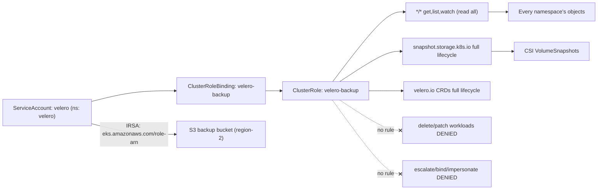
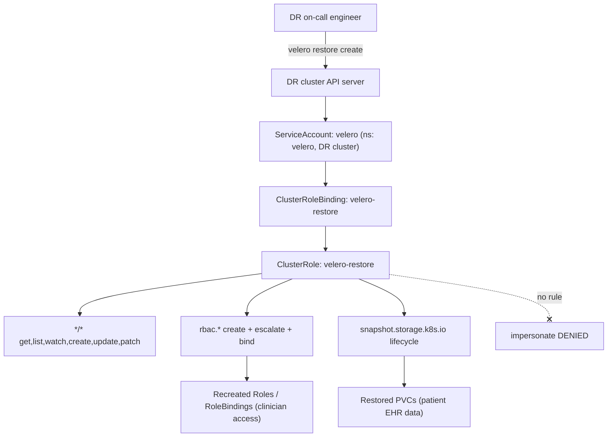
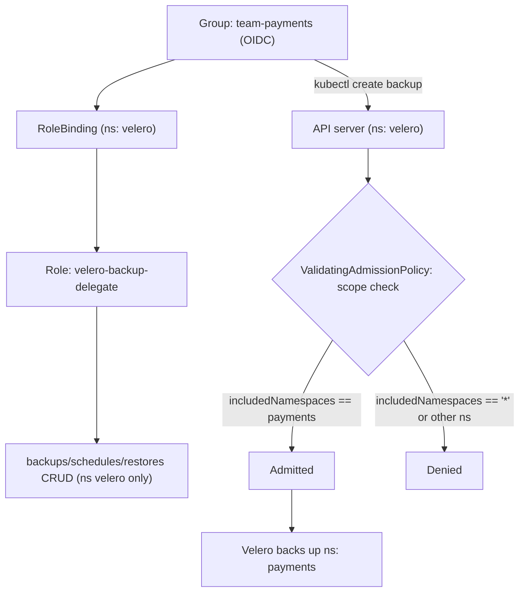
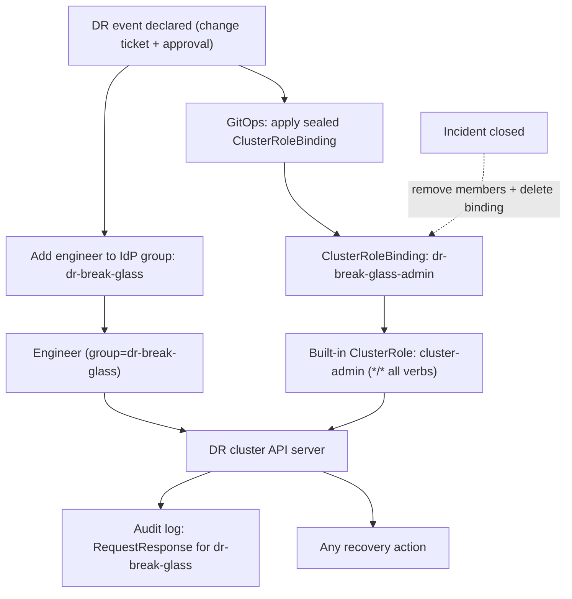
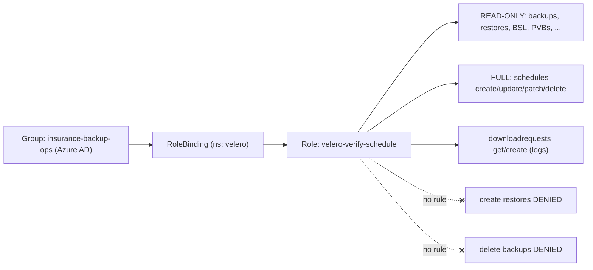

# Backup & DR — Velero

Five production RBAC scenarios covering the identities behind an enterprise Velero backup-and-disaster-recovery platform on Kubernetes v1.33+ — the read-everything backup ServiceAccount, the write-everything restore identity on the DR cluster, self-service per-namespace backup delegation, an audited cluster-admin break-glass for declared failovers, and the backup operations team that verifies backups and manages schedules without ever touching a restore.

## Scenario 71 — Velero Backup ServiceAccount with Cluster-Wide Read and Volume-Snapshot Rights for a FinTech

**Company / Industry:** Banking / FinTech (payments switch)

### Business Requirement
A regulated payments company runs Velero to take daily and pre-deploy backups of every production cluster to an S3-compatible object store in a second region, satisfying RBI/PCI-DSS recoverability and data-localization requirements. A meaningful backup must capture *every* API object — Deployments, ConfigMaps, PVCs, CRDs from the payment-orchestration operators, and the CSI `VolumeSnapshot` objects that pin the block volumes backing the ledger and reconciliation databases. Because the backup is only as complete as the identity taking it, the Velero server must be able to read all resource types in all namespaces and drive the CSI snapshot lifecycle, but it must never be able to *mutate* application state.

### Existing Problem
The platform was bootstrapped with the upstream Helm chart default, which binds the `velero` ServiceAccount to the built-in `cluster-admin` ClusterRole. That gives a backup daemon the power to `delete` any resource, create RoleBindings, and impersonate users — an enormous, permanently-mounted blast radius that failed the PCI segregation-of-duties audit. Separately, when the team migrated the databases to CSI volumes, backups silently stopped snapshotting them: the snapshotter returned `403` on `volumesnapshots` because the trimmed-down role someone had hand-written to "fix" the audit finding never included the `snapshot.storage.k8s.io` group, so several nightly backups were logically complete but had *no restorable volume data*.

### Proposed RBAC Solution
Use a purpose-built **ClusterRole** (`velero-backup`) bound by a **ClusterRoleBinding** to the dedicated **ServiceAccount** `velero` in the `velero` namespace. A ClusterRole is mandatory: a backup must read objects in *every* namespace and touch cluster-scoped kinds (CRDs, PVs, `VolumeSnapshotContents`, ClusterRoles), which a namespaced Role cannot express. The rule set is read-only (`get`/`list`/`watch`) across `apiGroups: ["*"]`, plus full lifecycle on `snapshot.storage.k8s.io` (Velero creates and later deletes snapshot objects as part of the backup) and full lifecycle on the `velero.io` CRDs it owns (it patches `Backup` status, spawns `PodVolumeBackup`/`DataUpload` children, etc.). We deliberately grant **no** `create`/`update`/`patch`/`delete` on application resources, and **no** `escalate`/`bind`/`impersonate` anywhere — a backup never needs to modify the workloads it reads. The node-agent DaemonSet gets its own narrow binding for filesystem backups.

### Kubernetes Resources
- All API resources, all groups (core, apps, batch, networking, CRDs) — read for the backup manifest
- `volumesnapshots`, `volumesnapshotcontents`, `volumesnapshotclasses` (`snapshot.storage.k8s.io`) — CSI snapshot lifecycle
- `backups`, `podvolumebackups`, `datauploads`, `backupstoragelocations`, `volumesnapshotlocations`, `serverstatusrequests` (`velero.io`) — Velero's own control objects
- PersistentVolumeClaims / PersistentVolumes (core) — read to resolve volumes to snapshot
- Pods (core) — read for node-agent filesystem backups

### Required Permissions
- `*` (all groups) → `get`, `list`, `watch` — enumerate and read every object into the backup tarball. No write verbs.
- `snapshot.storage.k8s.io` (`volumesnapshots`, `volumesnapshotcontents`, `volumesnapshotclasses`) → `get`, `list`, `watch`, `create`, `update`, `patch`, `delete` — Velero creates a snapshot, waits for `readyToUse`, then deletes the transient `VolumeSnapshot` while retaining the content.
- `velero.io` (all its CRDs) → `get`, `list`, `watch`, `create`, `update`, `patch`, `delete` — patch `Backup` status and manage child CRs.
- node-agent SA → `pods` `get`/`list`/`watch`, and `podvolumebackups`/`datauploads` manage — filesystem-level backup of pod volumes.
- **Explicitly excluded:** `escalate`, `bind`, `impersonate`, and any mutation of workloads/Secrets.

### Architecture Diagram


### YAML Implementation
```yaml
apiVersion: v1
kind: Namespace
metadata:
  name: velero
  labels:
    app.kubernetes.io/part-of: backup-dr
    pod-security.kubernetes.io/enforce: baseline
---
apiVersion: v1
kind: ServiceAccount
metadata:
  name: velero
  namespace: velero
  labels:
    app.kubernetes.io/name: velero
    app.kubernetes.io/component: backup-server
  annotations:
    # IRSA: S3 write happens via IAM, NOT via in-cluster RBAC
    eks.amazonaws.com/role-arn: arn:aws:iam::418922334455:role/velero-backup-prod
automountServiceAccountToken: true
---
apiVersion: v1
kind: ServiceAccount
metadata:
  name: velero-node-agent
  namespace: velero
  labels:
    app.kubernetes.io/name: velero
    app.kubernetes.io/component: node-agent
automountServiceAccountToken: true
---
apiVersion: rbac.authorization.k8s.io/v1
kind: ClusterRole
metadata:
  name: velero-backup
  labels:
    app.kubernetes.io/name: velero
rules:
  # Read EVERY resource in EVERY group so the backup manifest is complete.
  - apiGroups: ["*"]
    resources: ["*"]
    verbs: ["get", "list", "watch"]
  # CSI snapshot lifecycle: create the snapshot, then clean up the transient object.
  - apiGroups: ["snapshot.storage.k8s.io"]
    resources: ["volumesnapshots", "volumesnapshotcontents", "volumesnapshotclasses"]
    verbs: ["get", "list", "watch", "create", "update", "patch", "delete"]
  # Velero's own control objects (status patches, child CRs).
  - apiGroups: ["velero.io"]
    resources: ["*"]
    verbs: ["get", "list", "watch", "create", "update", "patch", "delete"]
---
apiVersion: rbac.authorization.k8s.io/v1
kind: ClusterRoleBinding
metadata:
  name: velero-backup
  labels:
    app.kubernetes.io/name: velero
roleRef:
  apiGroup: rbac.authorization.k8s.io
  kind: ClusterRole
  name: velero-backup
subjects:
  - kind: ServiceAccount
    name: velero
    namespace: velero
---
# Node-agent (filesystem / Kopia) backup identity — deliberately narrow.
apiVersion: rbac.authorization.k8s.io/v1
kind: ClusterRole
metadata:
  name: velero-node-agent
  labels:
    app.kubernetes.io/name: velero
rules:
  - apiGroups: [""]
    resources: ["pods", "persistentvolumeclaims", "persistentvolumes"]
    verbs: ["get", "list", "watch"]
  - apiGroups: ["velero.io"]
    resources: ["podvolumebackups", "datauploads", "backuprepositories", "backupstoragelocations"]
    verbs: ["get", "list", "watch", "create", "update", "patch"]
---
apiVersion: rbac.authorization.k8s.io/v1
kind: ClusterRoleBinding
metadata:
  name: velero-node-agent
  labels:
    app.kubernetes.io/name: velero
roleRef:
  apiGroup: rbac.authorization.k8s.io
  kind: ClusterRole
  name: velero-node-agent
subjects:
  - kind: ServiceAccount
    name: velero-node-agent
    namespace: velero
---
# Daily + pre-deploy schedule proving the identity works end to end.
apiVersion: velero.io/v1
kind: Schedule
metadata:
  name: prod-daily
  namespace: velero
  labels:
    app.kubernetes.io/name: velero
spec:
  schedule: "0 1 * * *"
  template:
    includedNamespaces:
      - "*"
    snapshotVolumes: true
    defaultVolumesToFsBackup: false
    ttl: 720h0m0s   # 30-day retention
    storageLocation: s3-region2
    volumeSnapshotLocations:
      - csi-region2
```

### Commands
```bash
# Apply namespace, both ServiceAccounts, ClusterRoles, bindings and the schedule
kubectl apply -f velero-backup-rbac.yaml

# Point the Velero server + node-agent Deployments/DaemonSet at their SAs
kubectl -n velero set serviceaccount deployment/velero velero
kubectl -n velero set serviceaccount daemonset/node-agent velero-node-agent

# Confirm the server pod actually assumes the velero SA (not default)
kubectl -n velero get deploy velero \
  -o jsonpath='{.spec.template.spec.serviceAccountName}{"\n"}'

# Trigger an on-demand backup to exercise the read + snapshot path
velero backup create adhoc-verify --from-schedule prod-daily --wait
```

### Verification
```bash
SA=system:serviceaccount:velero:velero

# ALLOW: read anything, drive snapshots, manage own CRDs
kubectl auth can-i list secrets --all-namespaces --as=$SA          # yes (backup reads all)
kubectl auth can-i get deployments -n payments-core --as=$SA       # yes
kubectl auth can-i create volumesnapshots.snapshot.storage.k8s.io -n payments-core --as=$SA  # yes
kubectl auth can-i patch backups.velero.io -n velero --as=$SA      # yes

# DENY: a backup must never mutate workloads or escalate
kubectl auth can-i delete deployments -n payments-core --as=$SA    # no
kubectl auth can-i update secrets -n payments-core --as=$SA        # no
kubectl auth can-i create clusterrolebindings --as=$SA            # no
kubectl auth can-i impersonate users --as=$SA                     # no

# Full effective set + prove the snapshot actually attached
kubectl auth can-i --list --as=$SA | head -n 20
velero backup describe adhoc-verify --details | grep -A3 "CSI Volume Snapshots"
```

### Expected Output
```text
# ALLOW
$ kubectl auth can-i list secrets --all-namespaces --as=system:serviceaccount:velero:velero
yes
$ kubectl auth can-i create volumesnapshots.snapshot.storage.k8s.io -n payments-core --as=system:serviceaccount:velero:velero
yes

# DENY
$ kubectl auth can-i delete deployments -n payments-core --as=system:serviceaccount:velero:velero
no
$ kubectl auth can-i impersonate users --as=system:serviceaccount:velero:velero
no

# If the snapshot API group is missing from the ClusterRole, the backup logs show:
Error from server (Forbidden): volumesnapshots.snapshot.storage.k8s.io is forbidden:
User "system:serviceaccount:velero:velero" cannot create resource "volumesnapshots" in
API group "snapshot.storage.k8s.io" in the namespace "payments-core"

# Healthy backup:
CSI Volume Snapshots:
  payments-core/ledger-data-0:
    Snapshot Content Name: snapcontent-9f2c... Storage: 42.0 GB  Ready to use: true
```

### Common Mistakes
- Leaving the chart default `cluster-admin` binding in place — a backup daemon with `delete`/`impersonate`/`bind` is a standing privilege-escalation path and a guaranteed audit failure.
- Trimming to read-only but forgetting `snapshot.storage.k8s.io`, so backups complete with zero restorable volume data — the most dangerous silent failure in this scenario.
- Reusing the wildcard-read ClusterRole for the node-agent, giving a per-node DaemonSet cluster-wide Secret read it never needs.
- Granting `create` on core resources "for restore too" on the *backup* cluster — restore belongs on the DR cluster with a separate identity.
- Assuming S3 write comes from RBAC; it comes from IRSA/Workload Identity — mixing the two leads people to over-grant in-cluster.

### Troubleshooting
- `kubectl auth can-i --list --as=system:serviceaccount:velero:velero` shows the exact effective verbs; a missing snapshot group jumps out immediately.
- Backup `PartiallyFailed` with `403` on `volumesnapshots` → the `snapshot.storage.k8s.io` rule is absent or has the wrong group string.
- `kubectl describe clusterrolebinding velero-backup` — confirm `roleRef` and that the subject `namespace: velero` matches (a blank namespace silently defaults to `default`).
- `velero backup logs <name>` surfaces the exact resource/verb that was denied.
- If everything reads but nothing writes to S3, the fault is IAM/IRSA, not RBAC — check the SA's `eks.amazonaws.com/role-arn` annotation and the pod's projected token.

### Best Practice
Mature FinTechs keep the backup identity strictly read-plus-snapshot, never `cluster-admin`, and enforce that with a Kyverno/ValidatingAdmissionPolicy rule that forbids any ServiceAccount in `velero` from being a subject of a `cluster-admin` binding. Object-store writes go through short-lived cloud credentials (IRSA on EKS, Workload Identity on GKE/AKS) so no static keys live in the cluster, and backups land in a separate account/region with immutable/object-lock retention so a compromised cluster cannot delete its own backups.

### Security Notes
The unavoidable risk is that a full-cluster backup identity can *read* every Secret in the cluster — TLS keys, DB passwords, HSM tokens. The design accepts read but eliminates write, escalation, and impersonation, so a compromised backup pod cannot alter state or widen its own rights. Blast radius is bounded further by encrypting backups at rest, sending them to an isolated account with object-lock, and pairing the wildcard read with data-egress controls (the pod can only reach the object store via IRSA-scoped IAM). The absence of `escalate`/`bind` means the SA can never mint itself a broader role.

### Interview Questions
1. Why does a Velero backup ServiceAccount need `get`/`list`/`watch` on *all* resources, and what is the security cost of that?
2. Why must the ClusterRole include write verbs on `snapshot.storage.k8s.io` even though backup is conceptually "read-only"?
3. Why is a ClusterRole/ClusterRoleBinding required here rather than a namespaced Role?
4. What is wrong with the upstream default `cluster-admin` binding, and what specifically do you remove?
5. If S3 write is not granted by RBAC, how does Velero authenticate to the object store, and why keep it separate?

### Interview Answers
1. A backup's value is completeness — if it cannot list a resource type, that type is absent from the restore. So it needs read across every group and namespace, including cluster-scoped kinds. The cost is that read includes Secrets cluster-wide, so a compromised backup identity is a credential-disclosure risk; you mitigate with encryption-at-rest, isolated storage, and by removing all write/escalation so read is the *only* capability.
2. Velero's CSI path physically creates a `VolumeSnapshot`, polls it until `readyToUse`, then deletes the transient object while the `VolumeSnapshotContent` is retained by the driver. Creating and deleting those objects requires `create`/`delete` on `snapshot.storage.k8s.io`. Without them the backup succeeds for API objects but captures no block-volume data — a complete-looking, unrestorable backup.
3. Backups span every namespace and touch cluster-scoped resources (CRDs, PVs, `VolumeSnapshotContents`, ClusterRoles). A namespaced Role only authorizes resources in its own namespace and cannot reference cluster-scoped kinds at all, so it could never produce a whole-cluster backup.
4. `cluster-admin` grants `*` on `*` including `delete`, `impersonate`, `bind`, and `escalate` — a permanently-mounted daemon that can destroy or take over the cluster. You replace it with read-only on `*/*` plus write only on the snapshot API and Velero's own CRDs, and you drop `escalate`/`bind`/`impersonate` entirely.
5. Velero uses cloud IAM through IRSA (EKS), Workload Identity (GKE/AKS), so the SA's projected token is exchanged for short-lived cloud credentials scoped to exactly one bucket. Keeping storage auth out of RBAC means in-cluster permissions stay minimal and there are no static long-lived keys to leak; the two planes fail independently.

### Follow-up Questions
1. How would you exclude specific Secrets (e.g. sealed HSM material) from backups while keeping the wildcard read role?
2. How do you guarantee a compromised production cluster cannot delete or overwrite its own backups in S3?
3. How would you audit, across every cluster, that no `velero` ServiceAccount is bound to `cluster-admin`?
4. When would `defaultVolumesToFsBackup: true` (node-agent path) change your RBAC, and what extra permissions appear?

### Production Tips
On Amazon EKS the canonical pattern is exactly this: the `velero` SA is annotated for **IRSA** so S3/EBS-snapshot access flows through a scoped IAM role while the in-cluster ClusterRole stays read-plus-snapshot — this is how AWS's own Velero-on-EKS guidance wires it. **Google** GKE uses **Workload Identity** to a GCS bucket with an equivalently minimal role, and **Microsoft** AKS uses **Azure AD Workload Identity** to Blob storage. Payments firms in the **Razorpay / PhonePe / Paytm** class add region-isolated, object-locked buckets in a separate cloud account for RBI data-localization and immutability, and gate the RBAC with policy-as-code that bans `cluster-admin` for any backup SA.

## Scenario 72 — Velero Restore Identity on the DR Cluster for a Healthcare Provider

**Company / Industry:** Healthcare / Hospital EHR Platform (HIPAA)

### Business Requirement
A hospital group replicates its Electronic Health Record (EHR) platform into a warm standby cluster in a second data center. When primary fails, the on-call DR engineer runs `velero restore` on the standby to rebuild every namespace — Deployments, ConfigMaps, PVCs, the CSI volume data holding patient records, and crucially the RBAC objects (Roles, RoleBindings) that scope clinician access. The restore identity must therefore be able to *create* essentially every resource type, including RBAC objects that grant more privilege than the restorer itself holds — a capability normal RBAC deliberately blocks.

### Existing Problem
The first DR drill failed halfway: Velero restored Deployments and Secrets fine but every `RoleBinding` and `ClusterRole` was skipped with `forbidden: cannot create resource "rolebindings" ... attempt to grant extra privileges`. The team had copied the backup cluster's read-only ClusterRole, so the restore SA could not write RBAC at all, and even after adding `create` it hit the privilege-escalation guard — the API server refuses to let a subject create a binding to permissions it does not itself possess unless it has the `bind` verb. The result: the standby came up with workloads running but *no clinician access model*, so no doctor could log in during the drill.

### Proposed RBAC Solution
On the DR cluster, bind a dedicated **ServiceAccount** `velero` to a **ClusterRole** (`velero-restore`) via a **ClusterRoleBinding**. Restore is inherently a write operation across all namespaces and cluster-scoped kinds, so a ClusterRole is required. The role grants `get`/`list`/`watch`/`create`/`update`/`patch` on `apiGroups: ["*"]` (restore recreates objects; it does not need `delete` under the default `existingResourcePolicy`), full lifecycle on `snapshot.storage.k8s.io` (to provision `VolumeSnapshotContents` for the restored PVCs), and — the key detail — the `escalate` and `bind` verbs on `rbac.authorization.k8s.io` resources so Velero can recreate Roles/ClusterRoles and their bindings faithfully. We withhold `impersonate` (restore never needs to act *as* a user) and `delete` on workloads, keeping the identity powerful but not omnipotent. The whole binding exists *only* on the standby cluster.

### Kubernetes Resources
- All API resources (core, apps, batch, networking, CRDs) — recreated on restore
- `roles`, `clusterroles`, `rolebindings`, `clusterrolebindings` (`rbac.authorization.k8s.io`) — recreated with `escalate`/`bind`
- `volumesnapshots`, `volumesnapshotcontents`, `volumesnapshotclasses` (`snapshot.storage.k8s.io`) — restore PVC data from snapshots
- `restores`, `podvolumerestores`, `datadownloads`, `backupstoragelocations` (`velero.io`) — Velero's restore control objects
- Namespaces, PersistentVolumeClaims (core) — recreated first in the restore order

### Required Permissions
- `*` (all groups) → `get`, `list`, `watch`, `create`, `update`, `patch` — recreate every object. No `delete` (default restore does not delete existing objects).
- `rbac.authorization.k8s.io` (`roles`, `clusterroles`, `rolebindings`, `clusterrolebindings`) → `create`, `update`, `patch`, `get`, `list`, `escalate`, `bind` — `escalate` lets Velero write a Role with rules beyond its own; `bind` lets it create a binding referencing a role it does not hold.
- `snapshot.storage.k8s.io` (`volumesnapshots`, `volumesnapshotcontents`, `volumesnapshotclasses`) → `get`, `list`, `create`, `update`, `patch`, `delete` — reconstruct CSI content objects for restored volumes.
- `velero.io` restore CRDs → full lifecycle — manage `Restore`, `PodVolumeRestore`, `DataDownload`.
- **Explicitly excluded:** `impersonate` (never needed), `delete` on application/core resources.

### Architecture Diagram


### YAML Implementation
```yaml
apiVersion: v1
kind: Namespace
metadata:
  name: velero
  labels:
    app.kubernetes.io/part-of: backup-dr
    cluster-role: disaster-recovery-standby
---
apiVersion: v1
kind: ServiceAccount
metadata:
  name: velero
  namespace: velero
  labels:
    app.kubernetes.io/name: velero
    app.kubernetes.io/component: restore-server
  annotations:
    eks.amazonaws.com/role-arn: arn:aws:iam::551234998877:role/velero-restore-dr
automountServiceAccountToken: true
---
apiVersion: rbac.authorization.k8s.io/v1
kind: ClusterRole
metadata:
  name: velero-restore
  labels:
    app.kubernetes.io/name: velero
    cluster-role: disaster-recovery-standby
rules:
  # Recreate every non-RBAC object. No delete: default restore never deletes.
  - apiGroups: ["*"]
    resources: ["*"]
    verbs: ["get", "list", "watch", "create", "update", "patch"]
  # RBAC objects need escalate + bind so restored access model is faithful.
  - apiGroups: ["rbac.authorization.k8s.io"]
    resources: ["roles", "clusterroles", "rolebindings", "clusterrolebindings"]
    verbs: ["get", "list", "watch", "create", "update", "patch", "escalate", "bind"]
  # Reconstruct CSI content for restored PVCs.
  - apiGroups: ["snapshot.storage.k8s.io"]
    resources: ["volumesnapshots", "volumesnapshotcontents", "volumesnapshotclasses"]
    verbs: ["get", "list", "watch", "create", "update", "patch", "delete"]
  # Velero's own restore control objects.
  - apiGroups: ["velero.io"]
    resources: ["*"]
    verbs: ["get", "list", "watch", "create", "update", "patch", "delete"]
---
apiVersion: rbac.authorization.k8s.io/v1
kind: ClusterRoleBinding
metadata:
  name: velero-restore
  labels:
    app.kubernetes.io/name: velero
    cluster-role: disaster-recovery-standby
roleRef:
  apiGroup: rbac.authorization.k8s.io
  kind: ClusterRole
  name: velero-restore
subjects:
  - kind: ServiceAccount
    name: velero
    namespace: velero
---
# Read-only pointer to the primary cluster's backup bucket (restore source).
apiVersion: velero.io/v1
kind: BackupStorageLocation
metadata:
  name: primary-region1
  namespace: velero
  labels:
    app.kubernetes.io/name: velero
spec:
  provider: aws
  accessMode: ReadOnly
  objectStorage:
    bucket: ehr-prod-backups-region1
    prefix: velero
  config:
    region: us-east-1
```

### Commands
```bash
# Apply the restore identity + read-only backup location on the DR cluster
kubectl apply -f velero-restore-rbac.yaml

# Point the standby Velero server at the SA
kubectl -n velero set serviceaccount deployment/velero velero

# Confirm the primary bucket is visible and backups are discoverable
velero backup-location get
velero backup get                       # lists backups synced from region1

# Execute the failover restore of the latest full backup
velero restore create ehr-failover-$(date +%Y%m%d) \
  --from-backup $(velero backup get -o name | sort | tail -1 | cut -d/ -f2) \
  --wait
```

### Verification
```bash
SA=system:serviceaccount:velero:velero

# ALLOW: create workloads AND the RBAC access model (the crux)
kubectl auth can-i create deployments -n ehr-clinical --as=$SA        # yes
kubectl auth can-i create rolebindings -n ehr-clinical --as=$SA       # yes
kubectl auth can-i bind clusterroles --as=$SA                         # yes (bind verb)
kubectl auth can-i escalate roles -n ehr-clinical --as=$SA            # yes (escalate verb)

# DENY: restore must not impersonate or delete live workloads
kubectl auth can-i impersonate users --as=$SA                         # no
kubectl auth can-i delete deployments -n ehr-clinical --as=$SA        # no

kubectl auth can-i --list --as=$SA | grep -E "bind|escalate|impersonate"
velero restore describe ehr-failover-* --details | grep -A2 "Warnings\|Errors"
```

### Expected Output
```text
# ALLOW
$ kubectl auth can-i create rolebindings -n ehr-clinical --as=system:serviceaccount:velero:velero
yes
$ kubectl auth can-i bind clusterroles --as=system:serviceaccount:velero:velero
yes

# DENY
$ kubectl auth can-i impersonate users --as=system:serviceaccount:velero:velero
no

# Without the bind verb, restore of RBAC objects fails exactly like this:
Error from server (Forbidden): rolebindings.rbac.authorization.k8s.io is forbidden:
User "system:serviceaccount:velero:velero" cannot create resource "rolebindings" in API
group "rbac.authorization.k8s.io" in the namespace "ehr-clinical": user attempting to
grant privileges that are not held [PolicyRule{Resources:["pods"], Verbs:["*"]}]

# Healthy failover restore:
Phase: Completed
Warnings: 0   Errors: 0
Namespaces:  ehr-clinical, ehr-billing, ehr-imaging  restored
```

### Common Mistakes
- Copying the backup cluster's read-only role to the DR cluster — restore then creates nothing.
- Adding `create` on `rbac.*` but omitting `escalate`/`bind`, so RBAC objects are silently skipped and the restored cluster has workloads but no access model.
- Granting `impersonate` "to be safe" — restore never impersonates; it is pure privilege bloat that lets a compromised restore SA act as any user.
- Adding `delete` on `*` and enabling an aggressive `existingResourcePolicy`, turning a restore into a cluster-wiping operation.
- Leaving the `BackupStorageLocation` in read-write mode on DR, risking the standby overwriting the primary's backups.

### Troubleshooting
- Restore `PartiallyFailed` with `attempt to grant extra privileges` → you have `create` on `rbac.*` but not `bind`/`escalate`.
- `kubectl auth can-i bind clusterroles --as=...` returns `no` → the `bind` verb is missing from the RBAC rule (it is a distinct verb, not implied by `create`).
- `velero restore logs <name>` lists each skipped/forbidden resource and the exact verb denied.
- `kubectl describe clusterrolebinding velero-restore` — verify the subject namespace and that the roleRef points at `velero-restore`, not the backup role.
- If PVC data is missing after restore, check `snapshot.storage.k8s.io` create rights and that the CSI driver on DR matches the snapshot class.

### Best Practice
Mature healthcare platforms keep the restore identity dormant until a declared DR event — the `velero` Deployment on the standby is scaled to zero and the SA carries no live workload in steady state, so the powerful role is only *active* during an actual failover, logged end-to-end. `escalate`/`bind` are granted narrowly to RBAC resources only (never `*`), the backup location is pinned `ReadOnly`, and restored data is validated against a checksum manifest before clinicians are cut over. Every restore is captured in the audit log at `RequestResponse` level for HIPAA evidence.

### Security Notes
`escalate` and `bind` are the two most dangerous RBAC verbs because they let a subject grant privileges it does not itself hold — exactly what a faithful restore requires and exactly what an attacker wants. The mitigation is tight scoping (`escalate`/`bind` only on `rbac.*`, never on `*`), withholding `impersonate` and `delete`, running the identity only during failover, and full audit. Patient EHR data restored into PVCs is protected by encryption-at-rest and by the DR cluster's own network isolation; the restore SA cannot read backups from anywhere except the single read-only bucket it is pointed at.

### Interview Questions
1. Why does a restore ServiceAccount need the `bind` and `escalate` verbs, and what breaks without them?
2. What is the difference between `escalate` and `bind`, and on which resources should each be granted?
3. Why deliberately withhold `delete` and `impersonate` from a restore identity?
4. Why is `existingResourcePolicy` relevant to how much power the restore role needs?
5. Why keep the DR `BackupStorageLocation` in `ReadOnly` mode?

### Interview Answers
1. When Velero recreates a `RoleBinding` that references a `Role` granting, say, `pods/*`, the API server's privilege-escalation prevention refuses the create unless the caller either already holds those permissions or has the `bind` verb on the referenced role. Likewise recreating a `Role`/`ClusterRole` whose rules exceed the caller's own requires `escalate`. Without them, all RBAC objects are skipped and the restored cluster has no working access model.
2. `escalate` authorizes creating or updating a `Role`/`ClusterRole` whose rules are broader than the caller's own permissions — it governs writing the *definition*. `bind` authorizes creating a `RoleBinding`/`ClusterRoleBinding` that references a role the caller does not hold — it governs writing the *reference*. Both should be granted only on `rbac.authorization.k8s.io` resources, never via a `*` wildcard.
3. `delete` is unnecessary because the default restore only creates/updates and never removes existing objects; granting it turns a recovery tool into a potential cluster-wiper. `impersonate` is never used by restore and would let a compromised restore pod assume any user or group identity — pure blast-radius expansion with zero functional benefit.
4. `existingResourcePolicy: update` makes restore patch objects that already exist, which needs `update`/`patch`; the default `none` skips them. If someone were to script a "delete then restore" flow they would demand `delete` on `*` — a far more dangerous role. Understanding the policy lets you grant the minimum verbs the chosen restore mode actually uses.
5. A `ReadOnly` `BackupStorageLocation` guarantees the standby can list and pull backups but can never write, prune, or corrupt the primary's backup bucket. If the DR cluster is compromised or a restore misfires, the source of truth — the backups themselves — remains intact.

### Follow-up Questions
1. How would you restore into a cluster with a *different* CSI driver than the source, and what changes in the snapshot RBAC/config?
2. How do you prevent the powerful restore role from being usable outside a declared DR window?
3. How would you selectively restore only RBAC objects (access model) without touching running workloads?
4. How do you prove, for a HIPAA audit, exactly which subject performed a restore and what it created?

### Production Tips
Healthcare and regulated-SaaS platforms run the standby Velero scaled-to-zero and activate the restore identity only during a declared failover, mirroring how **IBM** and **Red Hat** (OpenShift OADP, which packages Velero) document DR — OADP ships a restore role with exactly this `escalate`/`bind`-on-`rbac` shape. **Microsoft** AKS and **Google** GKE bind the restore SA through Workload Identity to a *read-only* backup bucket so DR can pull but never mutate the source. Firms with strict segregation (think **Cisco**/**VMware** internal platforms) time-box the restore role via short-lived tokens and capture every restore at `RequestResponse` audit level for evidence.

## Scenario 73 — Per-Namespace Backup Self-Service Delegation to Application Teams for a SaaS Platform

**Company / Industry:** B2B SaaS / Multi-Tenant Application Platform

### Business Requirement
A SaaS company runs 60+ product teams, each owning one or more namespaces on shared clusters. Teams increasingly need *self-service* backups: take an on-demand snapshot before a risky migration, manage their own nightly `Schedule`, and restore their own namespace after a bad deploy — without filing a ticket to the central platform team and without being able to touch any other team's data. Velero's `Backup`, `Schedule`, and `Restore` objects all live in the single `velero` namespace, so delegation cannot simply hand a team its own namespace; it must grant scoped write into the shared `velero` namespace and *constrain which namespace each team may target*.

### Existing Problem
The platform team originally handled all backups centrally and became a bottleneck — dozens of tickets a week for pre-migration snapshots. Their first attempt at self-service granted the `team-payments` group `create` on `backups.velero.io` in the `velero` namespace. But RBAC has no way to restrict the `spec.includedNamespaces` field, so within a day a well-meaning engineer created a `Backup` with `includedNamespaces: ["*"]` that pulled every tenant's data — including other teams' Secrets — into a backup the payments team could then download. RBAC controlled *who could create a Backup object* but not *what that Backup was allowed to read*.

### Proposed RBAC Solution
Two complementary controls. First, a namespaced **Role** (`velero-backup-delegate`) in the `velero` namespace bound per team via a **RoleBinding** to that team's **Group** (from the OIDC IdP), granting `create`/`get`/`list`/`watch`/`update`/`patch`/`delete` on `backups`, `schedules`, and `restores`, plus read on the supporting locations and `downloadrequests` for `velero backup logs`. A Role (not ClusterRole) is correct because every object a team touches lives in the one `velero` namespace; binding to a Group (not individual users) keeps membership in the IdP. Second — because RBAC cannot police `spec.includedNamespaces` — a per-team **ValidatingAdmissionPolicy** (GA in v1.33) enforces that any `Backup`/`Schedule`/`Restore` created by that team targets *only* its own namespace. RBAC decides *who and which verbs*; the admission policy decides *what scope*, and together they make self-service safe.

### Kubernetes Resources
- `backups`, `schedules`, `restores` (`velero.io`) — the objects teams self-serve, in the `velero` namespace
- `downloadrequests` (`velero.io`) — read backup logs / describe details
- `backupstoragelocations`, `volumesnapshotlocations` (`velero.io`) — read-only, to select a location
- `ValidatingAdmissionPolicy` / `ValidatingAdmissionPolicyBinding` (`admissionregistration.k8s.io`) — enforce `includedNamespaces` scope
- The team's own application namespace (e.g. `payments`) — the only namespace their backups may target

### Required Permissions
- `velero.io` (`backups`, `schedules`, `restores`) → `get`, `list`, `watch`, `create`, `update`, `patch`, `delete` — full self-service lifecycle, but only in the `velero` namespace.
- `velero.io` (`downloadrequests`) → `get`, `create` — needed for `velero backup logs`/`describe --details`.
- `velero.io` (`backupstoragelocations`, `volumesnapshotlocations`) → `get`, `list`, `watch` — choose a valid location; read-only so teams cannot repoint storage.
- **No** access to `deletebackuprequests` (lifecycle is via `spec.ttl`), **no** `backupstoragelocation` write, **no** cluster-scoped rights.
- Admission-layer (not RBAC): `spec.includedNamespaces` (and `spec.template.includedNamespaces` for `Schedule`) must equal exactly the team's namespace.

### Architecture Diagram


### YAML Implementation
```yaml
apiVersion: rbac.authorization.k8s.io/v1
kind: Role
metadata:
  name: velero-backup-delegate
  namespace: velero
  labels:
    app.kubernetes.io/name: velero
    rbac.example.com/purpose: team-self-service
rules:
  - apiGroups: ["velero.io"]
    resources: ["backups", "schedules", "restores"]
    verbs: ["get", "list", "watch", "create", "update", "patch", "delete"]
  - apiGroups: ["velero.io"]
    resources: ["downloadrequests"]
    verbs: ["get", "create"]
  - apiGroups: ["velero.io"]
    resources: ["backupstoragelocations", "volumesnapshotlocations"]
    verbs: ["get", "list", "watch"]
---
apiVersion: rbac.authorization.k8s.io/v1
kind: RoleBinding
metadata:
  name: velero-backup-delegate-payments
  namespace: velero
  labels:
    app.kubernetes.io/name: velero
    team: payments
roleRef:
  apiGroup: rbac.authorization.k8s.io
  kind: Role
  name: velero-backup-delegate
subjects:
  - kind: Group
    name: team-payments            # OIDC group claim
    apiGroup: rbac.authorization.k8s.io
---
# ---- Scope enforcement RBAC cannot do: pin includedNamespaces to 'payments' ----
apiVersion: admissionregistration.k8s.io/v1
kind: ValidatingAdmissionPolicy
metadata:
  name: velero-scope-payments
  labels:
    team: payments
spec:
  failurePolicy: Fail
  matchConstraints:
    resourceRules:
      - apiGroups: ["velero.io"]
        apiVersions: ["v1"]
        operations: ["CREATE", "UPDATE", "DELETE"]
        resources: ["backups", "schedules", "restores"]
  # Only evaluate requests coming FROM the payments team.
  matchConditions:
    - name: from-payments-team
      expression: "'team-payments' in request.userInfo.groups"
  variables:
    - name: scope
      expression: >
        request.operation == 'DELETE'
          ? (request.kind.kind == 'Schedule'
              ? oldObject.spec.template.?includedNamespaces.orValue([])
              : oldObject.spec.?includedNamespaces.orValue([]))
          : (request.kind.kind == 'Schedule'
              ? object.spec.template.?includedNamespaces.orValue([])
              : object.spec.?includedNamespaces.orValue([]))
  validations:
    - expression: "variables.scope == ['payments']"
      message: "team-payments may only back up, schedule, restore or delete objects scoped to the 'payments' namespace"
    - expression: "!('*' in variables.scope)"
      message: "wildcard namespace selection is not permitted for delegated backups"
---
apiVersion: admissionregistration.k8s.io/v1
kind: ValidatingAdmissionPolicyBinding
metadata:
  name: velero-scope-payments
  labels:
    team: payments
spec:
  policyName: velero-scope-payments
  validationActions: ["Deny", "Audit"]
---
# What a compliant team-authored Schedule looks like.
apiVersion: velero.io/v1
kind: Schedule
metadata:
  name: payments-nightly
  namespace: velero
  labels:
    team: payments
spec:
  schedule: "30 2 * * *"
  template:
    includedNamespaces:
      - payments
    ttl: 336h0m0s          # 14-day self-managed retention
    snapshotVolumes: true
    storageLocation: default
```

### Commands
```bash
# Platform team applies the delegate Role, the per-team RoleBinding, and the scope policy
kubectl apply -f velero-delegate-payments.yaml

# A payments engineer (authenticated via OIDC, group=team-payments) self-serves a backup
velero backup create payments-premigration \
  --include-namespaces payments --wait

# Same engineer manages their own schedule and reads their own logs
kubectl -n velero get schedules -l team=payments
velero backup logs payments-premigration
```

### Verification
```bash
# Simulate the payments engineer with impersonation
IMP="--as=alice@saas.example.com --as-group=team-payments"

# ALLOW: create/list/delete their own backups + schedules in velero ns
kubectl auth can-i create backups.velero.io -n velero $IMP           # yes
kubectl auth can-i delete schedules.velero.io -n velero $IMP         # yes
kubectl auth can-i get downloadrequests.velero.io -n velero $IMP     # yes

# DENY (RBAC): no write to storage locations, no cluster scope, no other namespace API
kubectl auth can-i update backupstoragelocations.velero.io -n velero $IMP   # no
kubectl auth can-i create backups.velero.io -n kube-system $IMP             # no

# DENY (admission): a wildcard/cross-team backup is rejected by the policy
cat <<'EOF' | kubectl apply --as=alice@saas.example.com --as-group=team-payments -f -
apiVersion: velero.io/v1
kind: Backup
metadata: { name: sneaky-all, namespace: velero }
spec: { includedNamespaces: ["*"] }
EOF
```

### Expected Output
```text
# ALLOW
$ kubectl auth can-i create backups.velero.io -n velero --as=alice@saas.example.com --as-group=team-payments
yes

# DENY (RBAC — cannot repoint storage)
$ kubectl auth can-i update backupstoragelocations.velero.io -n velero --as=alice@saas.example.com --as-group=team-payments
no

# DENY (admission — the ValidatingAdmissionPolicy blocks the wildcard scope)
$ kubectl apply --as=alice@saas.example.com --as-group=team-payments -f sneaky-all.yaml
Error from server (Forbidden): error when creating "STDIN": admission webhook denied the
request: ValidatingAdmissionPolicy 'velero-scope-payments' denied request: team-payments
may only back up, schedule, restore or delete objects scoped to the 'payments' namespace
```

### Common Mistakes
- Granting `create` on `backups.velero.io` and calling it done — RBAC cannot restrict `spec.includedNamespaces`, so any team can back up (and later download) every other tenant's data.
- Enforcing scope only on `Backup` while forgetting `Schedule` (whose namespace list lives under `spec.template.includedNamespaces`) — teams then bypass via a schedule.
- Binding the delegate Role to individual users instead of the team Group, so membership drifts from the IdP and orphaned grants accumulate.
- Giving teams write on `backupstoragelocations`, letting them repoint backups to an attacker-controlled bucket.
- Handing out `deletebackuprequests` — a team could then request deletion of another team's backup by name; use `spec.ttl` for lifecycle instead.

### Troubleshooting
- Backup rejected unexpectedly → `kubectl get validatingadmissionpolicybinding velero-scope-payments -o yaml` and check `validationActions`; the policy message names the exact rule.
- Team can create in `velero` but not see their backups → they are missing `list`/`watch`; check the Role, not the policy.
- `kubectl auth can-i --list -n velero --as=... --as-group=team-payments` shows effective verbs; anything under `kube-system` should be absent.
- Admission policy not firing → confirm `matchConditions` uses the correct group claim name your OIDC provider emits (`groups` vs a custom claim).
- Cross-team download still possible → extend the VAP to `downloadrequests` matching a backup-ownership label, or scope `downloadrequests` further.

### Best Practice
Mature SaaS platforms template the entire per-team bundle — the RoleBinding to the team Group, the `ValidatingAdmissionPolicy`, and its binding — from one GitOps generator (Argo CD ApplicationSet keyed on the team-to-namespace map), so onboarding a team is a one-line change and every team's scope is provably identical. The namespace is the single source of truth for both the RBAC grant and the admission scope, and policy-as-code rejects any team `Backup`/`Schedule` whose `includedNamespaces` is empty, `*`, or a foreign namespace. Retention is self-managed via mandatory `spec.ttl` rather than delegated deletion.

### Security Notes
The core risk is a cross-tenant data-exfiltration path: a `Backup` object is a *read* of arbitrary namespaces, so create-rights without scope control is equivalent to cluster-wide read. The two-layer design closes it — RBAC confines *who* and *which verbs* in the shared `velero` namespace, while the admission policy confines *scope* to the owning namespace, defeating the `includedNamespaces: ["*"]` escalation. Blast radius is one team's namespace: a compromised team credential can back up and restore only `payments`, cannot repoint storage, cannot delete another team's backups, and cannot reach any cluster-scoped resource.

### Interview Questions
1. Why can't RBAC alone safely delegate per-namespace backups in Velero?
2. Where does `includedNamespaces` live for a `Schedule` versus a `Backup`, and why does that matter for the scope policy?
3. Why bind the delegate Role to a Group instead of individual users?
4. Why is write access to `BackupStorageLocation` specifically dangerous to delegate?
5. How does a `Backup` object become a data-exfiltration primitive if left unconstrained?

### Interview Answers
1. RBAC authorizes verbs on resource *types* in a *namespace*; it cannot inspect or constrain fields inside an object's spec. A `Backup` is created in the `velero` namespace but its `spec.includedNamespaces` decides what it reads. So RBAC can say "team X may create Backups" but not "team X's Backups may only target namespace X" — you need admission-time validation (ValidatingAdmissionPolicy/Kyverno) for the field-level constraint.
2. For a `Backup` or `Restore` it is `spec.includedNamespaces`; for a `Schedule` it is nested at `spec.template.includedNamespaces` because a Schedule wraps a BackupSpec in a template. If your policy only checks `spec.includedNamespaces`, a team can evade it entirely by using a `Schedule`, which is why the CEL branches on `request.kind.kind == 'Schedule'`.
3. The team-to-namespace mapping is owned by the IdP. Binding to a Group means adding or removing a person is an IdP change with zero cluster edits, and there are no per-user grants to go stale. Binding to individuals re-introduces drift and orphaned access — exactly what audits flag.
4. `BackupStorageLocation` defines *where* backups are read from and written to. Write access lets a team repoint it to a bucket they control, redirecting backups (data exfiltration) or feeding a poisoned restore source. Teams only ever need to *read* locations to pick one, so it is granted read-only.
5. Backing up a namespace reads every object in it — Deployments, ConfigMaps, and Secrets — into a tarball the creator can then download via `downloadrequests`/`velero backup logs`. If a team can set `includedNamespaces: ["*"]`, a single `Backup` becomes a cluster-wide read of every tenant's Secrets, exfiltrated through the backup store. Scoping the field is what neutralizes it.

### Follow-up Questions
1. How would you also prevent a team from downloading another team's existing backup via `downloadrequests`?
2. How do you template this per-team bundle so 60 teams stay provably consistent?
3. How would you let a central platform team still take cluster-wide backups while these per-team policies exist?
4. How would you enforce a maximum `ttl` and mandatory encryption on team-authored schedules?

### Production Tips
Multi-tenant SaaS platforms in the **Freshworks / Zoho** class delegate backup self-service exactly this way — a Role bound to an **OIDC/Okta group** plus a **ValidatingAdmissionPolicy** (or Kyverno/OPA Gatekeeper) that pins `includedNamespaces` — all generated per team by an **Argo CD ApplicationSet**. **Google** GKE and **Microsoft** AKS document the same "RBAC for verbs, admission policy for field scope" split for tenant self-service. **Netflix** and **Uber**-scale platforms push the scope map into a central policy store so a team's backup boundary and its namespace ownership can never diverge.

## Scenario 74 — DR Failover Cluster-Admin Break-Glass Procedure for a Bank

**Company / Industry:** Banking / Core Banking Platform (RBI / PCI-DSS)

### Business Requirement
A bank's core-banking platform has a strict runbook: during a declared regional disaster, a small set of senior DR engineers must be able to run *any* recovery action on the standby cluster — restore Velero backups, re-point ingress, patch stuck finalizers, force-delete corrupted objects — with no time lost to permission tickets. This is a classic break-glass requirement: near-total power, but *only* during a declared incident, *only* for named individuals, fully audited, and automatically revoked afterward. In steady state, no human holds `cluster-admin` on production or DR.

### Existing Problem
Before the break-glass design, three named SRE leads carried a permanent `cluster-admin` ClusterRoleBinding "for emergencies." The PCI-DSS assessor flagged it as standing privileged access with no just-in-time control and no per-use approval, and an internal review found one of those accounts had been used for routine day-two work, defeating segregation of duties entirely. During an actual minor incident, the reverse problem also appeared: a *fourth* engineer who genuinely needed access during the event had none, and the on-call had to hand-edit RBAC under pressure with no audit trail of why.

### Proposed RBAC Solution
Bind a dedicated **Group** (`dr-break-glass`) to the built-in **ClusterRole** `cluster-admin` via a **ClusterRoleBinding** — but the binding is *not* applied in steady state. It lives in a sealed, separately-controlled GitOps path and is applied only when a DR event is declared, with the requesting engineers added to the `dr-break-glass` group in the IdP for the duration of the incident. We use a Group (not individual `User` subjects) so activation is an IdP membership change with an approval workflow, not a cluster edit per person. We use the built-in `cluster-admin` (not a hand-rolled role) because break-glass by definition needs unbounded power and a curated role would inevitably miss something during a real disaster. The control that makes this safe is *not* the RBAC scope — it is the combination of dormancy, IdP-gated activation, an audit policy that logs every break-glass action at `RequestResponse`, and automatic revocation.

### Kubernetes Resources
- `ClusterRoleBinding` → built-in `cluster-admin` ClusterRole (`rbac.authorization.k8s.io`)
- Group `dr-break-glass` (OIDC/AD claim) — the activated subject
- All cluster resources (via `cluster-admin`) — every recovery action during the event
- Audit policy (`audit.k8s.io/v1`) — `RequestResponse` logging of the break-glass subjects
- (Optional) a short-lived break-glass `ServiceAccount` with a bound, expiring token for automation

### Required Permissions
- Group `dr-break-glass` → **all verbs on all resources** via `cluster-admin` — including `create`, `update`, `patch`, `delete`, `deletecollection`, `escalate`, `bind`, `impersonate`, `approve`. This is intentional and total, justified only by dormancy + activation control.
- The activation itself is gated by an out-of-band approval (change ticket + IdP group add), not by a Kubernetes verb.
- Audit: every request by a `dr-break-glass` subject is captured at `RequestResponse` level.
- Steady state: the binding is **absent** and the group has **zero members**, so effective permissions are none.

### Architecture Diagram


### YAML Implementation
```yaml
# ============================================================================
# BREAK-GLASS BINDING — stored in a SEALED GitOps path, NOT applied in steady
# state. Applied only on a declared DR event, reverted at incident close.
# ============================================================================
apiVersion: rbac.authorization.k8s.io/v1
kind: ClusterRoleBinding
metadata:
  name: dr-break-glass-admin
  labels:
    rbac.example.com/purpose: break-glass
    rbac.example.com/lifecycle: emergency-only
  annotations:
    # Human-readable guardrails; enforced by process + audit, not by RBAC.
    rbac.example.com/activation: "requires-change-ticket-and-two-person-approval"
    rbac.example.com/max-duration: "PT4H"
    rbac.example.com/owner: "platform-sre@bank.example.com"
roleRef:
  apiGroup: rbac.authorization.k8s.io
  kind: ClusterRole
  name: cluster-admin          # built-in, intentionally unbounded
subjects:
  - kind: Group
    name: dr-break-glass        # IdP group; ZERO members in steady state
    apiGroup: rbac.authorization.k8s.io
---
# Optional: an expiring token for break-glass automation (not a standing token).
apiVersion: v1
kind: ServiceAccount
metadata:
  name: dr-break-glass-bot
  namespace: velero
  labels:
    rbac.example.com/purpose: break-glass
automountServiceAccountToken: false   # tokens minted on demand via TokenRequest
---
# ---- Audit policy fragment: every break-glass action at full fidelity ----
# (Referenced by the API server via --audit-policy-file; shown for completeness.)
apiVersion: audit.k8s.io/v1
kind: Policy
rules:
  - level: RequestResponse
    users: []                 # match by group below
    userGroups: ["dr-break-glass"]
  - level: RequestResponse
    users: ["system:serviceaccount:velero:dr-break-glass-bot"]
  - level: Metadata           # everything else stays terse
```

### Commands
```bash
# ---------- ACTIVATION (only on a declared DR event) ----------
# 1) Out-of-band: open change ticket, obtain two-person approval, add the
#    responder to the IdP group 'dr-break-glass' with an auto-expiry.
# 2) Apply the sealed break-glass binding from the emergency GitOps path.
kubectl apply -f break-glass/dr-break-glass-admin.yaml

# 3) Verify the responder now has admin on the DR cluster.
kubectl auth can-i '*' '*' --all-namespaces \
  --as=oncall@bank.example.com --as-group=dr-break-glass          # yes

# ---------- REVOCATION (at incident close, mandatory) ----------
kubectl delete clusterrolebinding dr-break-glass-admin            # remove the grant
# Remove all members from the IdP 'dr-break-glass' group (auto-expiry backs this up).

# ---------- If automation is needed, mint a SHORT-LIVED token ----------
kubectl -n velero create token dr-break-glass-bot --duration=1h
```

### Verification
```bash
# STEADY STATE: binding absent, group empty -> no power
kubectl get clusterrolebinding dr-break-glass-admin               # NotFound
kubectl auth can-i delete pods --all-namespaces \
  --as=oncall@bank.example.com --as-group=dr-break-glass          # no

# ACTIVATED: full admin proven, and audit fidelity confirmed
kubectl auth can-i '*' '*' --all-namespaces \
  --as=oncall@bank.example.com --as-group=dr-break-glass          # yes
kubectl auth can-i impersonate users \
  --as=oncall@bank.example.com --as-group=dr-break-glass          # yes

# Prove every action is being captured (query the audit backend)
kubectl -n velero create token dr-break-glass-bot --duration=1h >/dev/null
# then confirm a RequestResponse entry appears for userGroups=dr-break-glass
```

### Expected Output
```text
# STEADY STATE (safe default): no binding, no access
$ kubectl get clusterrolebinding dr-break-glass-admin
Error from server (NotFound): clusterrolebindings.rbac.authorization.k8s.io "dr-break-glass-admin" not found

$ kubectl auth can-i delete pods --all-namespaces --as=oncall@bank.example.com --as-group=dr-break-glass
no

# ACTIVATED during a declared DR event
$ kubectl auth can-i '*' '*' --all-namespaces --as=oncall@bank.example.com --as-group=dr-break-glass
yes

# Audit backend shows full request/response for every break-glass call:
{"kind":"Event","level":"RequestResponse","stage":"ResponseComplete",
 "user":{"username":"oncall@bank.example.com","groups":["dr-break-glass"]},
 "verb":"delete","objectRef":{"resource":"pods","namespace":"core-ledger"},
 "responseStatus":{"code":200}}
```

### Common Mistakes
- Making the break-glass binding permanent "so it's ready" — that recreates exactly the standing privileged access the control is meant to eliminate.
- Naming individual `User` subjects instead of a Group, so activation/deactivation means editing cluster RBAC per person under incident pressure.
- Forgetting to revoke — leaving the binding applied after the incident is the single most common finding; back it with IdP auto-expiry.
- Building a bespoke "almost cluster-admin" role that misses a resource type the disaster actually needs, defeating the purpose during a real event.
- Minting a long-lived token for the break-glass SA instead of a short-duration `TokenRequest` token.

### Troubleshooting
- Responder has no access after activation → the IdP group claim isn't reaching the API server; check the OIDC `--oidc-groups-claim` mapping and that the token carries `dr-break-glass`.
- `kubectl auth can-i --list --as=... --as-group=dr-break-glass` confirms whether the binding is live and effective.
- Access persists after revocation → the ClusterRoleBinding was deleted but the IdP group still has members (or vice versa); both must be cleared.
- No audit entries → the `--audit-policy-file`/`--audit-log-path` (or webhook backend) isn't wired; break-glass without audit is non-compliant.
- Binding applied to the wrong cluster context → confirm `kubectl config current-context` points at the DR cluster before applying.

### Best Practice
Banks implement break-glass as *just-in-time, zero-standing-privilege*: the `cluster-admin` binding is dormant, activation requires a change ticket plus two-person approval and an IdP group membership that auto-expires (e.g. 4 hours), and every action by the break-glass identity is streamed to an immutable audit sink and reviewed post-incident. The activation is a deliberately high-friction, well-rehearsed path exercised in scheduled DR game-days so it works under real pressure, and revocation is automated so "forgot to remove it" cannot happen.

### Security Notes
`cluster-admin` includes `escalate`, `bind`, and `impersonate` — the ability to grant any privilege and act as any identity — so the risk is total compromise if the binding is ever live without control. The design mitigates by making the *default state* zero access (binding absent, group empty), so the dangerous power exists only inside a declared, approved, time-boxed, fully-audited window. Blast radius in steady state is nil; during activation it is deliberately unbounded but observable and reversible. The named-Group-plus-IdP-expiry model ensures the grant cannot silently outlive the incident.

### Interview Questions
1. Why bind a Group to the built-in `cluster-admin` rather than crafting a curated emergency ClusterRole?
2. What makes this design "zero standing privilege," and why does that matter for PCI/RBI?
3. Why use a `Group` subject with IdP membership instead of `User` subjects in the binding?
4. Why is the audit policy (not the RBAC rules) the real security control here?
5. How do you guarantee the elevated access does not outlive the incident?

### Interview Answers
1. A real disaster is unpredictable; a curated role will inevitably lack some verb or resource the recovery needs, and discovering that mid-incident costs the exact time break-glass exists to save. The safety comes from *when* the power is available (dormant, approved, time-boxed, audited), not from narrowing *what* it can do — so the built-in `cluster-admin` is the right target precisely because it is complete.
2. In steady state the binding is not applied and the group has no members, so the effective permission of every human is zero — no one holds admin day to day. Access exists only inside a declared, approved window. PCI-DSS/RBI reward this because it removes standing privileged accounts and enforces per-use, approved, auditable elevation, satisfying least-privilege and segregation-of-duties.
3. Activation and deactivation become IdP membership changes governed by an approval workflow, not cluster edits per individual. One dormant binding serves all responders; adding or removing a person is an IdP action with auto-expiry, so you never hand-edit RBAC under incident pressure and never leave per-user grants behind.
4. RBAC here is intentionally maximal, so it constrains nothing during activation — the thing that keeps break-glass safe and compliant is that every action is recorded at `RequestResponse` fidelity to an immutable sink and reviewed afterward. Without audit, break-glass is indistinguishable from an attacker with admin; with it, every emergency action is attributable and reviewable.
5. Two layered timers: the IdP group membership is granted with an automatic expiry (e.g. 4 hours), and the ClusterRoleBinding is deleted at incident close as part of the runbook. Even if the human step is forgotten, the IdP expiry revokes effective access; even if the IdP lags, deleting the binding cuts it. Game-days verify both paths actually revoke.

### Follow-up Questions
1. How would you enforce the 4-hour maximum automatically rather than relying on the runbook?
2. How do you prevent a break-glass responder from using the access for routine day-two work?
3. How would you alert in real time when the break-glass binding is applied?
4. How do you reconcile break-glass with GitOps drift detection that would otherwise revert or flag the manual binding?

### Production Tips
Banks and large enterprises implement Velero/DR break-glass as audited, time-boxed elevation: **Microsoft** patterns use **Azure AD PIM** (Privileged Identity Management) to grant an approved, auto-expiring role that maps to a Kubernetes group; **Amazon** EKS teams gate it behind IAM Identity Center + short-lived STS sessions surfaced as a cluster group. **Cisco**, **VMware**, and **IBM/Red Hat** internal platforms keep the `cluster-admin` binding dormant in a sealed GitOps path, alert on its application, and exercise the whole flow in scheduled DR game-days. **PhonePe / Razorpay**-style RBI-regulated firms pair it with immutable audit sinks and mandatory post-incident review of every break-glass action.

## Scenario 75 — Backup Operations Team Read-Only Verification and Schedule Management for an Insurer

**Company / Industry:** Insurance / Claims & Policy Administration

### Business Requirement
An insurer has a dedicated Backup Operations team responsible for the *health* of the backup estate — every morning they must verify that last night's backups completed, that no `PartiallyFailed` backups slipped through, that retention is correct, and that the object-store locations are `Available`. They also own the backup *cadence*: creating and tuning `Schedule` objects as new namespaces come online and retention policies change. What they must **never** do is trigger a `Restore` (a change-control, DR-only action owned by a different team) or delete backups (data destruction requiring separate approval). This is a deliberate separation of duties: manage the schedule and verify the outcome, but do not perform recovery or destruction.

### Existing Problem
The Backup Ops team was originally given the `velero` chart's admin-flavored role so they could "see everything." With it, a well-meaning operator investigating a failed backup ran `velero restore create` against production to "test that the backup was good," partially overwriting a live claims-processing namespace and triggering a Sev-1. The post-incident review found the team had `create` on `restores` and `delete` on `backups` that they never needed for their actual job — verification and scheduling — and demanded a role that is read-only for everything *except* schedule management.

### Proposed RBAC Solution
A namespaced **Role** (`velero-verify-schedule`) in the `velero` namespace bound by a **RoleBinding** to the **Group** `insurance-backup-ops` (from Azure AD via OIDC). A Role suffices because all Velero objects the team touches live in the one `velero` namespace, and a Group keeps membership in Azure AD. The role grants **read-only** (`get`/`list`/`watch`) on every Velero CRD used for verification — `backups`, `restores`, `backupstoragelocations`, `volumesnapshotlocations`, `podvolumebackups`, `podvolumerestores`, `backuprepositories`, `datauploads`, `datadownloads`, `serverstatusrequests` — plus `get`/`create` on `downloadrequests` (so `velero backup describe --details` and `velero backup logs` work). It grants **full lifecycle** (`create`/`update`/`patch`/`delete`) *only* on `schedules`. It grants **no** `create` on `restores` and **no** `delete` on `backups` or `deletebackuprequests` — the two capabilities the incident proved dangerous.

### Kubernetes Resources
- `backups`, `restores` (`velero.io`) — read-only, for verification
- `schedules` (`velero.io`) — full lifecycle, the team's write surface
- `backupstoragelocations`, `volumesnapshotlocations` (`velero.io`) — read-only, confirm `Available`
- `podvolumebackups`, `podvolumerestores`, `backuprepositories`, `datauploads`, `datadownloads`, `serverstatusrequests` (`velero.io`) — read-only, deep verification
- `downloadrequests` (`velero.io`) — `get`/`create` for logs and detailed describes

### Required Permissions
- `velero.io` (`backups`, `restores`, `backupstoragelocations`, `volumesnapshotlocations`, `podvolumebackups`, `podvolumerestores`, `backuprepositories`, `datauploads`, `datadownloads`, `serverstatusrequests`) → `get`, `list`, `watch` — full read for verification, zero mutation.
- `velero.io` (`schedules`) → `get`, `list`, `watch`, `create`, `update`, `patch`, `delete` — own the backup cadence.
- `velero.io` (`downloadrequests`) → `get`, `create` — required by `velero backup logs`/`describe --details`; these are transient signed-URL requests, not data mutation.
- **Explicitly denied:** `create` on `restores`, `delete` on `backups`, any access to `deletebackuprequests` — enforcing separation of duties.

### Architecture Diagram


### YAML Implementation
```yaml
apiVersion: rbac.authorization.k8s.io/v1
kind: Role
metadata:
  name: velero-verify-schedule
  namespace: velero
  labels:
    app.kubernetes.io/name: velero
    rbac.example.com/team: backup-operations
rules:
  # READ-ONLY verification surface across the whole Velero estate.
  - apiGroups: ["velero.io"]
    resources:
      - backups
      - restores
      - backupstoragelocations
      - volumesnapshotlocations
      - podvolumebackups
      - podvolumerestores
      - backuprepositories
      - datauploads
      - datadownloads
      - serverstatusrequests
    verbs: ["get", "list", "watch"]
  # FULL lifecycle ONLY on schedules — the team owns backup cadence.
  - apiGroups: ["velero.io"]
    resources: ["schedules"]
    verbs: ["get", "list", "watch", "create", "update", "patch", "delete"]
  # downloadrequests are needed for `velero backup logs` / describe --details.
  # get + create only; they mint a transient signed URL, not a data change.
  - apiGroups: ["velero.io"]
    resources: ["downloadrequests"]
    verbs: ["get", "create"]
---
apiVersion: rbac.authorization.k8s.io/v1
kind: RoleBinding
metadata:
  name: velero-verify-schedule
  namespace: velero
  labels:
    app.kubernetes.io/name: velero
    rbac.example.com/team: backup-operations
roleRef:
  apiGroup: rbac.authorization.k8s.io
  kind: Role
  name: velero-verify-schedule
subjects:
  - kind: Group
    name: insurance-backup-ops       # Azure AD group via OIDC
    apiGroup: rbac.authorization.k8s.io
---
# A schedule the team legitimately owns and tunes.
apiVersion: velero.io/v1
kind: Schedule
metadata:
  name: claims-hourly
  namespace: velero
  labels:
    rbac.example.com/team: backup-operations
spec:
  schedule: "0 * * * *"
  template:
    includedNamespaces:
      - claims-processing
      - policy-admin
    ttl: 168h0m0s          # 7-day retention, tuned by Backup Ops
    snapshotVolumes: true
    storageLocation: default
```

### Commands
```bash
# Platform team applies the read-only-plus-schedules Role and the group binding
kubectl apply -f velero-verify-schedule.yaml

# Backup Ops morning verification (read-only)
velero backup get                                    # list all backups + phase
velero backup describe claims-hourly-20260714010000 --details
velero backup logs claims-hourly-20260714010000      # uses downloadrequests
kubectl -n velero get backupstoragelocations         # confirm Available

# Backup Ops managing cadence (allowed write surface)
kubectl -n velero apply -f schedules/claims-hourly.yaml
kubectl -n velero patch schedule claims-hourly \
  --type merge -p '{"spec":{"template":{"ttl":"336h0m0s"}}}'   # extend retention
```

### Verification
```bash
IMP="--as=bob@insurer.example.com --as-group=insurance-backup-ops"

# ALLOW: read all verification objects + full schedule management
kubectl auth can-i list backups.velero.io -n velero $IMP              # yes
kubectl auth can-i get backupstoragelocations.velero.io -n velero $IMP # yes
kubectl auth can-i create schedules.velero.io -n velero $IMP          # yes
kubectl auth can-i delete schedules.velero.io -n velero $IMP          # yes
kubectl auth can-i create downloadrequests.velero.io -n velero $IMP   # yes

# DENY: no restore, no backup deletion, no purge requests (separation of duties)
kubectl auth can-i create restores.velero.io -n velero $IMP           # no
kubectl auth can-i delete backups.velero.io -n velero $IMP            # no
kubectl auth can-i create deletebackuprequests.velero.io -n velero $IMP # no

kubectl auth can-i --list -n velero $IMP | grep velero.io
```

### Expected Output
```text
# ALLOW
$ kubectl auth can-i list backups.velero.io -n velero --as=bob@insurer.example.com --as-group=insurance-backup-ops
yes
$ kubectl auth can-i create schedules.velero.io -n velero --as=bob@insurer.example.com --as-group=insurance-backup-ops
yes

# DENY (separation of duties enforced)
$ kubectl auth can-i create restores.velero.io -n velero --as=bob@insurer.example.com --as-group=insurance-backup-ops
no
$ kubectl auth can-i delete backups.velero.io -n velero --as=bob@insurer.example.com --as-group=insurance-backup-ops
no

# The blocked restore attempt from the incident now fails cleanly:
$ velero restore create test-restore --from-backup claims-hourly-20260714010000
Error from server (Forbidden): restores.velero.io is forbidden: User
"bob@insurer.example.com" cannot create resource "restores" in API group "velero.io"
in the namespace "velero"
```

### Common Mistakes
- Handing the team the Velero admin role "so they can see everything" — read visibility never requires `create restores` or `delete backups`.
- Forgetting `downloadrequests` `get`/`create`, so `velero backup logs` and `describe --details` fail even though the team is meant to verify backups.
- Granting `delete` on `schedules` but also on `backups`, blurring "manage cadence" with "destroy data."
- Assuming `list backups` implies you can read backup *contents*; contents come via `downloadrequests`, which is a separate grant.
- Binding to individuals rather than the Azure AD group, causing access drift as the team roster changes.

### Troubleshooting
- `velero backup logs` returns Forbidden → the `downloadrequests` `create` verb is missing (log retrieval creates a DownloadRequest under the hood).
- Team can list schedules but not create → the `schedules` write verbs are absent or the RoleBinding targets the wrong group claim.
- `kubectl auth can-i --list -n velero --as=... --as-group=insurance-backup-ops` shows the effective set; `restores: create` should be absent.
- A restore unexpectedly succeeds → check for a *second* RoleBinding (e.g. a stale `edit` grant) also matching the group; effective permissions are the union of all bindings.
- Read works but describe fails → the CRD subresource or `serverstatusrequests` read is missing; add it to the read block.

### Best Practice
Mature insurers encode this separation of duties as distinct, non-overlapping roles bound to distinct Azure AD groups: `backup-ops` (verify + schedule, this role), `dr-restore` (restore only, activated for drills/incidents), and `backup-admin` (deletion/retention changes, tightly held). Access is reviewed quarterly, membership flows only from the IdP, and policy-as-code asserts that no single group holds both `create restores` and `delete backups`. Verification is largely automated — a job reads backup phases and pages Backup Ops on any `PartiallyFailed` — with the human role scoped to investigate and tune cadence.

### Security Notes
The risk this role targets is not data disclosure but *unauthorized recovery and destruction*: a `Restore` can overwrite live production, and `delete backups`/`deletebackuprequests` can erase recoverability. Removing `create restores` and `delete backups` makes both structurally impossible for this team, enforcing separation of duties in RBAC rather than by convention. Blast radius is confined to the `velero` namespace and to non-destructive verbs plus schedule objects; a compromised Backup Ops credential can read backup metadata and change cadence but cannot destroy backups or trigger a production-overwriting restore. `downloadrequests` is the one sensitive read (it can fetch backup contents), justified by the verification mandate and monitored accordingly.

### Interview Questions
1. Why give the Backup Ops team full lifecycle on `schedules` but strictly read-only on `backups` and `restores`?
2. Why does verifying a backup with `velero backup logs` require `create` on `downloadrequests`, and is that a data-mutation risk?
3. How does removing `create restores` and `delete backups` implement separation of duties in RBAC terms?
4. Why a namespaced Role bound to a Group rather than a ClusterRole or per-user binding?
5. If a restore unexpectedly succeeds for this team, how do you diagnose it?

### Interview Answers
1. Their job is to own the backup *cadence* (schedules) and *verify outcomes* (read everything). Schedule management is legitimately a write operation, so it gets full lifecycle. Backups and restores are outcomes to observe and actions owned by other teams, so read-only is correct — write there would let verification drift into destruction or unauthorized recovery, which is exactly the Sev-1 the incident produced.
2. `velero backup logs` and `describe --details` work by creating a transient `DownloadRequest`, which Velero reconciles into a short-lived signed URL to the backup's logs/contents in object storage. So log retrieval genuinely needs `create` on `downloadrequests`. It is not a mutation of backup *data* — the object is a request primitive that is GC'd — but it can surface backup contents, so it is the one sensitive read in the role and is granted deliberately and monitored.
3. Separation of duties means the person who verifies and schedules is not the person who recovers or destroys. In RBAC, that is expressed by simply omitting the dangerous verbs: no `create` on `restores` (recovery is a different group's role) and no `delete` on `backups`/`deletebackuprequests` (destruction is yet another group's role). The boundary is structural — the API server denies the verb — not a convention someone can ignore under pressure.
4. Every Velero object the team touches lives in the single `velero` namespace, so a namespaced Role is sufficient and keeps the grant tightly scoped; a ClusterRole would over-reach. Binding to the Azure AD group means membership is managed in the IdP with joiner/leaver automation, so there are no per-user grants to drift or orphan as the roster changes.
5. Effective permissions are the union of all bindings that match the subject, so an unexpected `create restores` almost always means a *second* binding — a stale `edit`/`admin` ClusterRoleBinding or another RoleBinding — also names the group or a group the user belongs to. Run `kubectl auth can-i --list` for the user, then `kubectl get rolebindings,clusterrolebindings -A -o wide | grep insurance-backup-ops` to find every binding contributing permissions.

### Follow-up Questions
1. How would you let this team read backup *metadata* for verification but block them from downloading backup *contents* entirely?
2. How do you prevent two roles from ever collectively granting both `create restores` and `delete backups` to one person?
3. How would you automate the morning verification so the human role is only for exceptions?
4. How would you extend this to a multi-cluster estate where the team verifies backups across 20 clusters?

### Production Tips
Insurers and financial firms wire this to **Azure AD groups** over OIDC (the AKS-native pattern) or **gke-security-groups** on GKE, binding a purpose-built verify-plus-schedule Role and keeping restore/delete in separate, tightly-held groups — the same segregation **Microsoft**, **IBM**, and **Red Hat** (OADP) document for backup operations. Verification itself is automated: **Amazon**/**Google** SRE patterns run a controller that reads backup phases and alerts on `PartiallyFailed`, leaving humans to investigate. Policy-as-code (Kyverno/OPA Gatekeeper) asserts no group simultaneously holds restore-create and backup-delete, and quarterly access reviews reconcile group membership against the IdP.
